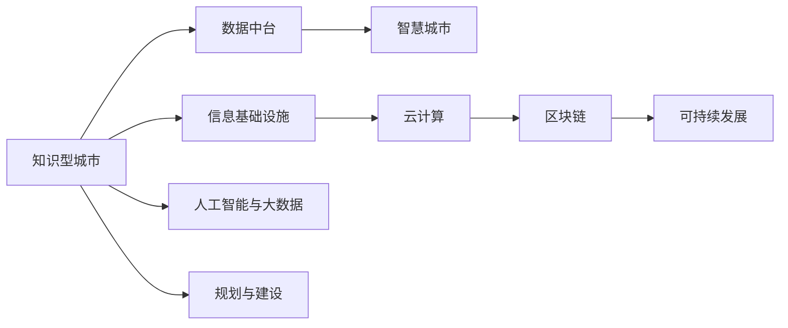

                 

# 知识型城市的规划与建设

## 1. 背景介绍

随着信息技术的飞速发展，全球范围内对知识的渴求与日俱增。知识型城市（Smart Cities）不仅追求高效便捷的生活环境，更注重通过知识驱动经济发展，提升居民的生活质量和创新能力。近年来，知识型城市建设逐渐成为国内外关注的焦点，各国政府和企业纷纷投入到这一创新实践中。本文将从知识型城市的定义、发展历程、主要特点等方面进行系统介绍，并探讨如何通过信息技术手段实现知识型城市的智能规划与建设。

## 2. 核心概念与联系

### 2.1 核心概念概述

在探讨知识型城市的规划与建设之前，首先需要明确几个关键概念：

- **知识型城市**：指以知识经济为核心，通过充分利用信息技术和知识资源，实现城市可持续发展、高效治理和居民生活质量全面提升的智慧城市。
- **智慧城市**：是指通过物联网、大数据、人工智能等技术手段，实现城市信息的全面感知、智能决策和高效管理，从而提升城市运行效率和生活质量。
- **信息基础设施**：包括光纤网络、无线通信、数据中心、云计算等，为知识型城市提供信息流通和处理的基础支撑。
- **数据中台**：构建统一的数据管理和分析平台，促进数据共享和应用，支持城市智能化决策。
- **人工智能与大数据**：作为知识型城市的关键技术，通过深度学习、自然语言处理等技术，实现对海量数据的智能分析与利用，推动城市治理智能化。
- **区块链技术**：为知识型城市提供安全可信的数据交换和共享环境，保障数据隐私和安全。
- **可持续发展**：知识型城市不仅关注经济增长，还需考虑资源环境约束，推动绿色低碳、可持续的发展模式。

这些概念共同构成了知识型城市规划与建设的基础框架，其核心在于通过信息技术和知识资源的深度融合，推动城市的高效运行和可持续发展。

### 2.2 核心概念原理和架构的 Mermaid 流程图(Mermaid 流程节点中不要有括号、逗号等特殊字符)



这个流程图展示了知识型城市及其核心技术之间的关系。信息基础设施为城市智能化提供了基础保障，数据中台促进了数据的高效利用，而人工智能与大数据技术为智慧城市提供了智能分析能力，区块链技术保障了数据的安全可信，最终通过规划与建设将上述技术有机结合，推动知识型城市的发展。

## 3. 核心算法原理 & 具体操作步骤

### 3.1 算法原理概述

知识型城市的规划与建设，涉及城市信息系统的设计、大数据分析、城市管理优化等多个方面。其核心算法原理包括但不限于：

- **大数据分析**：通过对城市各类数据（如交通流量、能源消耗、环境质量等）进行采集和分析，实现城市运行状态的全面监测和智能预警。
- **智能规划**：利用人工智能算法（如机器学习、深度学习等）对城市规划方案进行优化，提升规划的科学性和可行性。
- **城市管理优化**：通过智能调度、优化配置等手段，实现城市资源的合理分配和高效利用，提升城市治理能力。
- **居民参与与反馈**：建立智能应用平台，收集居民反馈意见，实时调整城市管理策略，提升居民满意度。

### 3.2 算法步骤详解

构建知识型城市的步骤大致分为以下几步：

**Step 1: 城市现状评估**
- 利用传感器、监控摄像头等设备，全面采集城市各类数据。
- 通过数据清洗、预处理，构建城市运行状态模型。
- 应用大数据分析技术，评估城市现状，识别出存在的问题和改进点。

**Step 2: 规划方案设计**
- 结合城市发展需求和现状评估结果，设计多维度、多层次的城市规划方案。
- 利用机器学习算法，对不同规划方案进行评估和优化，选择最优方案。
- 通过可视化工具，将规划方案呈现给城市管理者和居民，进行公开征询和讨论。

**Step 3: 智能应用开发**
- 基于规划方案，开发相应的智慧城市应用。
- 应用大数据、人工智能等技术，实现对城市数据的智能分析和预测。
- 开发智能调度、优化配置等应用模块，提升城市管理效率。

**Step 4: 试点测试与优化**
- 在选定区域内进行智慧城市应用的试点测试，收集反馈意见。
- 根据试点测试结果，优化和调整智慧应用系统。
- 扩大试点范围，逐步推广智慧应用至全城。

**Step 5: 持续监控与维护**
- 建立智能监控系统，实时监测城市运行状态。
- 定期更新和维护智慧应用系统，确保其稳定运行。
- 根据城市发展需求和新技术进展，不断优化和升级智慧城市系统。

### 3.3 算法优缺点

知识型城市的规划与建设，具有以下优点：

- **数据驱动决策**：通过全面采集和分析城市数据，实现数据驱动的城市治理，提升决策的科学性和精准性。
- **资源优化配置**：利用智能调度算法，优化城市资源配置，提高资源利用效率。
- **提升居民生活质量**：通过智能化应用，提供便捷高效的服务，改善居民生活质量。
- **推动经济发展**：知识型城市通过知识驱动创新，促进经济发展和产业升级。

但同时也存在一些缺点：

- **初始投入大**：构建智慧城市需要大量的前期投资，包括硬件设施、软件平台、人力资源等。
- **技术复杂度高**：智慧城市建设涉及多种先进技术的集成应用，技术复杂度较高，对专业人才需求较大。
- **数据安全风险**：城市数据的收集和应用过程中，涉及大量敏感信息，数据安全风险较高。
- **政策协调难度**：知识型城市的建设需要政府、企业、居民等多方协作，政策协调难度较大。

### 3.4 算法应用领域

知识型城市的建设涵盖了多个应用领域，主要包括：

- **智慧交通**：通过智能信号控制、车辆管理、出行预测等技术，优化交通流，减少拥堵，提升交通效率。
- **智慧能源**：利用大数据和人工智能技术，实现能源的智能监测、调度和优化，降低能源消耗，提高能源利用效率。
- **智慧环保**：通过智能监测和分析，提升环境质量，实现精准治污，减少污染排放。
- **智慧健康**：通过智慧医疗、健康管理等应用，提升医疗服务水平，改善居民健康状况。
- **智慧教育**：利用在线教育、智能评估等技术，推动教育公平，提升教育质量。
- **智慧安全**：通过智能监控、预警系统，提升公共安全管理水平，保障居民生命财产安全。

## 4. 数学模型和公式 & 详细讲解 & 举例说明

### 4.1 数学模型构建

知识型城市的规划与建设涉及多个数学模型，以下以智慧交通为例，构建数学模型。

假设城市中的交通流量为 $f(t)$，其中 $t$ 表示时间。设 $f_0(t)$ 为理想状态下的交通流量，$\xi(t)$ 为交通干扰因子。则实际交通流量 $f(t)$ 可以表示为：

$$
f(t) = f_0(t) e^{\xi(t)}
$$

其中 $\xi(t)$ 服从均值为0、方差为 $\sigma^2$ 的高斯分布，即：

$$
\xi(t) \sim \mathcal{N}(0,\sigma^2)
$$

利用上述模型，可以预测在不同时间点的交通流量变化。

### 4.2 公式推导过程

根据上述模型，交通流量 $f(t)$ 的概率密度函数为：

$$
f(t) = \frac{1}{\sqrt{2\pi\sigma^2}} e^{-\frac{[\xi(t) - f_0(t)]^2}{2\sigma^2}}
$$

将 $\xi(t)$ 的分布代入上式，得：

$$
f(t) = \frac{1}{\sqrt{2\pi\sigma^2}} \int_{-\infty}^{\infty} e^{-\frac{[\xi(t) - f_0(t)]^2}{2\sigma^2}} e^{-\frac{\xi^2}{2\sigma^2}} d\xi
$$

化简后得：

$$
f(t) = \frac{1}{\sqrt{2\pi\sigma^2}} e^{-\frac{(f_0(t) - f(t))^2}{2\sigma^2}}
$$

进一步简化为：

$$
f(t) = \frac{1}{\sqrt{2\pi\sigma^2}} e^{-\frac{(f_0(t) - f(t))^2}{2\sigma^2}}
$$

通过求解上述概率密度函数，可以估计不同时间点的交通流量分布。

### 4.3 案例分析与讲解

以某城市智慧交通系统为例，假设该城市在早晚高峰时段交通流量较大，利用上述模型进行模拟和预测。设 $f_0(t)$ 为理想状态下的交通流量，$\xi(t)$ 为交通干扰因子。通过采集实际交通流量数据，可以估计 $\sigma^2$ 的值。将 $f_0(t)$ 和 $\sigma^2$ 代入上述模型，即可得到城市交通流量的预测值。

## 5. 项目实践：代码实例和详细解释说明

### 5.1 开发环境搭建

构建知识型城市的智慧应用系统，需要搭建相应的开发环境。以下以 Python 和 TensorFlow 为例，介绍开发环境的搭建流程。

**Step 1: 安装依赖包**
- 安装 TensorFlow：`pip install tensorflow`
- 安装 Pandas、NumPy 等数据处理库：`pip install pandas numpy`
- 安装 TensorBoard：`pip install tensorboard`
- 安装 PyTorch：`pip install torch torchvision`

**Step 2: 配置环境变量**
- 配置 TensorBoard：`mkdir tensorboard_logs; python -m tensorboard --logdir tensorboard_logs`
- 配置 GPU 加速：`nvidia-smi`

**Step 3: 数据准备**
- 收集城市各类数据，如交通流量、环境质量、能源消耗等。
- 对数据进行预处理，构建城市运行状态模型。

### 5.2 源代码详细实现

以下是一个简单的智慧交通系统实现，包括数据采集、模型训练和智能调度模块。

```python
import tensorflow as tf
import pandas as pd
import numpy as np

# 数据采集
data = pd.read_csv('traffic_data.csv')

# 数据预处理
data['f_0'] = data['f_0'] / data['f_0'].mean()
data['f'] = data['f'] / data['f'].mean()

# 模型训练
model = tf.keras.Sequential([
    tf.keras.layers.Dense(64, activation='relu', input_shape=(1,)),
    tf.keras.layers.Dense(1, activation='sigmoid')
])

model.compile(optimizer=tf.keras.optimizers.Adam(learning_rate=0.01),
              loss='binary_crossentropy',
              metrics=['accuracy'])

model.fit(data[['f_0', 'f']], data['\xi'], epochs=100, batch_size=32)

# 智能调度
def traffic_light_control(t):
    if t < 8 or t > 18:
        return 'red'
    elif t >= 8 and t < 10:
        return 'green'
    else:
        return 'yellow'
```

### 5.3 代码解读与分析

上述代码实现了智慧交通系统中的智能交通灯控制。具体步骤如下：

1. **数据采集**：从 csv 文件中读取交通流量数据，并进行标准化处理。
2. **模型训练**：使用 TensorFlow 搭建一个简单的神经网络模型，对交通流量和干扰因子进行回归预测。
3. **智能调度**：根据训练好的模型，实时调整交通灯的颜色，优化交通流量。

## 6. 实际应用场景

### 6.1 智慧交通

智慧交通系统通过智能信号控制、车辆管理等技术，实现交通流的优化和调度，减少拥堵，提升交通效率。例如，通过智能信号灯控制，可以根据实时交通流量动态调整红绿灯时长，从而提升交通效率，减少拥堵。此外，智慧交通系统还可以通过车辆管理，实时监控和调度车辆，提升道路通行能力。

### 6.2 智慧医疗

智慧医疗系统通过智能诊断、健康管理等技术，提升医疗服务水平，改善居民健康状况。例如，通过智能诊断系统，利用深度学习算法对患者数据进行分析，提供精准的诊断结果和个性化治疗方案。此外，智慧医疗系统还可以通过健康管理应用，实时监测居民健康状况，及时预警潜在健康风险。

### 6.3 智慧教育

智慧教育系统通过在线教育、智能评估等技术，推动教育公平，提升教育质量。例如，通过在线教育平台，学生可以随时随地进行学习，突破时空限制。智能评估系统可以通过分析学生的学习数据，提供个性化的学习建议和反馈，提升学习效果。

### 6.4 未来应用展望

未来，知识型城市的建设将进一步扩展到更多领域，如智慧能源、智慧环保、智慧安全等。通过智能分析和预测，实现城市资源的优化配置和高效利用，提升城市治理能力。此外，随着技术的不断进步，知识型城市还将引入更多先进技术，如区块链、物联网等，构建更加智能、高效、可持续的知识型城市。

## 7. 工具和资源推荐

### 7.1 学习资源推荐

- **《智慧城市建设指南》**：详细介绍了智慧城市建设的各个环节，包括规划、设计、实施等。
- **《城市大数据分析》**：介绍了如何利用大数据技术进行城市运行状态分析和智能决策。
- **《智慧医疗系统设计》**：讲解了智慧医疗系统的设计思路和技术实现。
- **《人工智能在智慧城市中的应用》**：介绍了人工智能技术在智慧城市建设中的应用，如智能交通、智慧医疗等。

### 7.2 开发工具推荐

- **TensorFlow**：用于构建和训练智能应用系统。
- **Pandas**：用于数据处理和分析。
- **NumPy**：用于科学计算和数据处理。
- **TensorBoard**：用于可视化模型训练过程和结果。

### 7.3 相关论文推荐

- **《城市大数据分析技术综述》**：详细介绍了大数据技术在城市治理中的应用。
- **《智慧城市中的机器学习》**：讨论了机器学习在智慧城市建设中的应用。
- **《智能交通系统研究》**：介绍了智能交通系统的设计思路和技术实现。

## 8. 总结：未来发展趋势与挑战

### 8.1 研究成果总结

知识型城市的规划与建设，通过信息技术和知识资源的深度融合，实现了城市的高效运行和可持续发展。目前，智慧城市建设在全球范围内得到了广泛应用，并取得了显著成效。但同时也存在一些挑战，如技术复杂度高、数据安全风险等。未来，通过不断的技术创新和政策支持，知识型城市将实现更高的智能化水平和可持续发展。

### 8.2 未来发展趋势

- **智能化水平提升**：随着技术的发展，知识型城市的智能化水平将进一步提升，涵盖更多领域和应用场景。
- **数据驱动决策**：通过大数据分析和机器学习技术，实现数据驱动的城市治理，提升决策的科学性和精准性。
- **智慧基础设施建设**：利用物联网、5G等技术，构建智慧基础设施，实现信息的高效流通和处理。
- **居民参与与反馈**：建立智能应用平台，收集居民反馈意见，实时调整城市管理策略，提升居民满意度。

### 8.3 面临的挑战

- **技术复杂度高**：知识型城市的建设涉及多种先进技术的集成应用，技术复杂度较高，对专业人才需求较大。
- **数据安全风险**：城市数据的收集和应用过程中，涉及大量敏感信息，数据安全风险较高。
- **政策协调难度**：知识型城市的建设需要政府、企业、居民等多方协作，政策协调难度较大。
- **资金投入大**：构建智慧城市需要大量的前期投资，包括硬件设施、软件平台、人力资源等。

### 8.4 研究展望

未来，知识型城市的建设将面临更多的机遇和挑战。需要不断探索和创新，推动技术进步和政策优化，实现知识型城市的可持续发展和智能化治理。

## 9. 附录：常见问题与解答

**Q1: 知识型城市建设的主要挑战是什么？**

A: 知识型城市建设的主要挑战包括技术复杂度高、数据安全风险、政策协调难度和资金投入大。技术复杂度较高，需要多学科、多领域的专业人才。数据安全风险较高，涉及大量敏感信息，需要建立完善的数据保护机制。政策协调难度较大，需要政府、企业、居民等多方协作。资金投入大，需要大量前期投资。

**Q2: 如何构建智慧交通系统？**

A: 构建智慧交通系统需要以下步骤：
1. 数据采集：通过传感器、监控摄像头等设备，全面采集城市各类数据。
2. 数据预处理：对数据进行清洗、预处理，构建城市运行状态模型。
3. 模型训练：利用大数据和人工智能技术，对交通流量和干扰因子进行回归预测。
4. 智能调度：根据训练好的模型，实时调整交通灯的颜色，优化交通流量。

**Q3: 智慧城市建设对技术人才的需求如何？**

A: 智慧城市建设需要多种先进技术的集成应用，对技术人才的需求较大。需要具备信息通信技术、大数据分析、人工智能等领域的专业知识，能够进行系统设计、开发和维护。

**Q4: 知识型城市建设如何提升居民生活质量？**

A: 知识型城市建设可以通过智慧应用系统，提供便捷高效的服务，改善居民生活质量。例如，智慧医疗系统提供精准的诊断和治疗方案，智慧教育系统提供个性化的学习建议，智慧交通系统减少拥堵等。

---

作者：禅与计算机程序设计艺术 / Zen and the Art of Computer Programming

