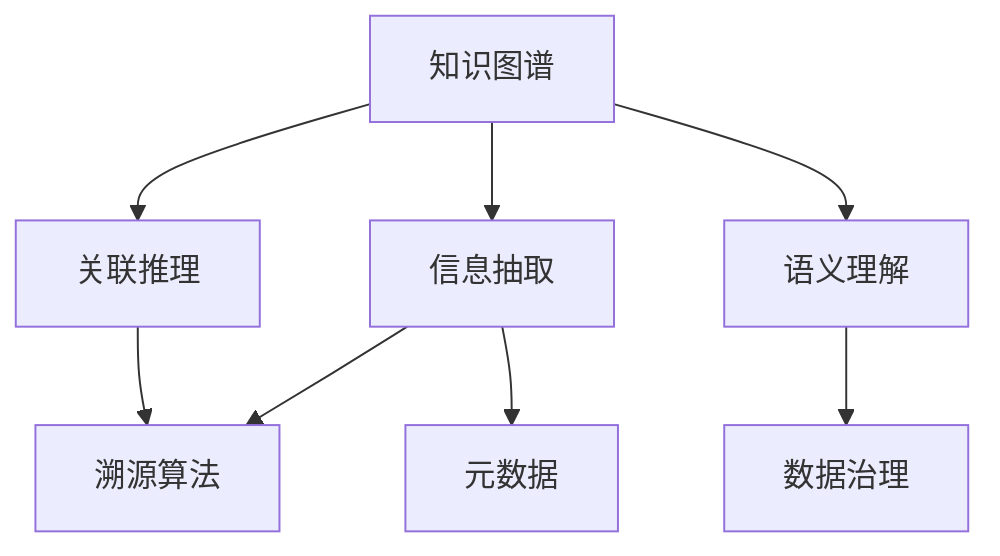

                 

# 知识溯源：追踪信息的来龙去脉

> 关键词：知识图谱, 信息抽取, 关联推理, 溯源算法, 元数据管理, 语义理解, 数据治理

## 1. 背景介绍

在当今信息爆炸的时代，数据的获取和使用成为了各个领域的重要课题。从科学研究到商业决策，从社交媒体到新闻报道，数据在驱动决策和优化过程中的作用愈发关键。然而，海量数据的存在也带来了信息真实性、来源可信度和数据治理等一系列问题。如何在海量的信息海洋中准确、高效地识别、分析和利用高质量的数据，成为了一个亟待解决的挑战。

### 1.1 问题由来

数据驱动的决策分析在各个领域得到了广泛应用，但同时也引发了一系列问题：

- **信息真实性**：海量的数据中充斥着大量虚假和误导性的信息，如何筛选出真实可信的信息源，是一个巨大的挑战。
- **数据来源可信度**：数据来源的可靠性直接决定了数据的质量。如何判断数据来源的真实性和可信度，是一个复杂的问题。
- **数据治理**：数据的多样性和复杂性使得数据治理变得尤为困难。如何保证数据的质量、一致性和完整性，是一个需要多方协作解决的问题。

这些问题亟需一套全面、系统的方法来解决。知识溯源技术应运而生，通过追踪信息的来龙去脉，帮助用户识别、验证和评估数据源的真实性和可靠性，从而提升数据治理的质量和效率。

### 1.2 问题核心关键点

知识溯源技术的核心在于构建信息之间的链接，通过追踪数据和元数据的来源、处理和使用路径，为数据的真实性、可信度和完整性提供支撑。以下是知识溯源技术的关键点：

- **元数据管理**：对数据和信息的基本属性进行记录和标注，包括数据的生成时间、来源、处理步骤等。
- **关联推理**：基于元数据建立数据之间的关联关系，通过推理和计算识别数据之间的关系。
- **溯源算法**：设计算法和技术手段，追踪数据和信息的来龙去脉，验证其真实性和可靠性。
- **语义理解**：对数据和信息的语义进行理解，通过自然语言处理技术提取关键信息。
- **数据治理**：根据溯源和推理结果，对数据进行管理和治理，保证数据的质量和一致性。

## 2. 核心概念与联系

### 2.1 核心概念概述

为更好地理解知识溯源技术的原理和实现，本节将介绍几个密切相关的核心概念：

- **知识图谱(Knowledge Graph)**：一种通过语义关系将实体和属性组织起来的图形结构，用于表示和推理实体之间的关系。
- **信息抽取(Information Extraction)**：从文本中识别和抽取结构化信息，如实体、关系和属性等。
- **关联推理(Link Prediction)**：基于已知的信息和规则，预测新实体之间的关系。
- **溯源算法(Provenance)**：追踪数据和信息的历史和来源，验证其真实性和可靠性。
- **元数据(Metadata)**：记录数据的基本属性和处理信息，用于辅助溯源和推理。
- **语义理解(Semantic Understanding)**：通过自然语言处理技术，理解文本中的语义信息。
- **数据治理(Data Governance)**：对数据进行管理和治理，保证数据的质量和一致性。

这些核心概念之间的逻辑关系可以通过以下Mermaid流程图来展示：



这个流程图展示了几大核心概念之间的关系：

1. 知识图谱通过语义关系组织实体和属性。
2. 信息抽取识别文本中的实体、关系和属性，为知识图谱提供数据来源。
3. 关联推理基于已知信息和规则，预测实体之间的关系，完善知识图谱。
4. 溯源算法追踪数据的来源和处理路径，验证数据的真实性和可靠性。
5. 元数据记录数据的基本属性和处理信息，辅助溯源和推理。
6. 语义理解通过自然语言处理技术，提取和理解文本中的语义信息。
7. 数据治理对数据进行管理和治理，保证数据的质量和一致性。

这些概念共同构成了知识溯源技术的理论框架，帮助用户从数据的源头进行管理和验证，确保数据的质量和可信度。

## 3. 核心算法原理 & 具体操作步骤

### 3.1 算法原理概述

知识溯源技术的核心在于通过元数据和关联推理，追踪数据的来源和处理路径，验证其真实性和可靠性。其核心思想是：

1. **数据来源追踪**：通过元数据记录数据的基本属性和处理信息，识别数据源的真实性和可信度。
2. **数据处理路径**：记录数据在处理过程中的步骤和节点，追踪数据的变化和转移。
3. **数据真实性验证**：基于已知的元数据和关联信息，验证数据的真实性和可靠性，识别虚假和误导性的信息。
4. **数据完整性保证**：通过关联推理和溯源算法，保证数据的完整性和一致性，避免数据丢失和损坏。

形式化地，假设一个数据集 $D$，其元数据为 $M$，则知识溯源的过程可以描述为：

1. **数据来源追踪**：通过元数据 $M$ 中的来源信息，识别数据源的真实性和可信度 $S$。
2. **数据处理路径**：记录数据在处理过程中的步骤和节点，得到处理路径 $P$。
3. **数据真实性验证**：通过关联推理和元数据，验证数据 $D$ 的真实性和可靠性 $V$。
4. **数据完整性保证**：通过关联推理和溯源算法，保证数据的完整性和一致性 $C$。

### 3.2 算法步骤详解

知识溯源技术的主要步骤包括：

**Step 1: 数据收集与元数据标注**

- 收集数据集 $D$，包括原始数据和相关的元数据 $M$。
- 标注元数据 $M$，记录数据的来源、处理时间和节点等信息。

**Step 2: 数据来源验证**

- 通过元数据 $M$，识别数据源的真实性和可信度 $S$。
- 将识别结果与已知的可信数据源进行对比，验证数据源的真实性和可信度。

**Step 3: 数据处理路径记录**

- 记录数据在处理过程中的步骤和节点，得到处理路径 $P$。
- 将处理路径与元数据 $M$ 相结合，形成数据处理流水线。

**Step 4: 数据真实性验证**

- 基于元数据 $M$ 和已知的关联信息，验证数据 $D$ 的真实性和可靠性 $V$。
- 使用溯源算法和关联推理技术，识别虚假和误导性的信息。

**Step 5: 数据完整性保证**

- 通过关联推理和溯源算法，保证数据的完整性和一致性 $C$。
- 检测数据处理过程中的异常和错误，修正数据偏差和损坏。

**Step 6: 结果输出与数据治理**

- 将验证结果和处理路径输出，生成知识图谱或溯源报告。
- 根据验证结果和处理路径，对数据进行管理和治理，提升数据的质量和可靠性。

### 3.3 算法优缺点

知识溯源技术在提升数据质量和可信度方面具有以下优点：

1. **全面验证数据真实性**：通过元数据和关联推理，全面验证数据的来源、处理路径和真实性。
2. **提高数据可信度**：通过数据来源验证和关联推理，提升数据的可信度和可靠性。
3. **保证数据完整性**：通过数据处理路径的记录和完整性检查，避免数据丢失和损坏。
4. **提升数据治理效率**：通过溯源和推理技术，提升数据治理的效率和效果。

同时，该技术也存在一些局限性：

1. **依赖元数据**：溯源和推理的效果很大程度上取决于元数据的完整性和准确性。
2. **处理复杂性**：元数据和关联信息的记录和处理复杂，需要耗费大量时间和人力。
3. **算法依赖**：溯源算法和关联推理的准确性依赖于算法的性能和数据质量。
4. **技术门槛高**：需要结合数据科学、自然语言处理和信息工程等多学科知识，门槛较高。

尽管存在这些局限性，但知识溯源技术在数据治理和信息验证方面仍具有显著优势，为数据的质量和可信度提供了有力保障。

### 3.4 算法应用领域

知识溯源技术在多个领域中得到了广泛应用，主要包括：

- **科学研究**：追踪实验数据和结果的来源，验证数据的真实性和可靠性。
- **商业决策**：验证市场数据和业务信息的真实性，辅助决策分析。
- **公共事务**：验证公共数据和信息的真实性，提高政府透明度和公信力。
- **社交媒体**：识别虚假信息和误导性内容，保护用户权益。
- **金融交易**：验证交易数据的真实性和完整性，保障金融安全。
- **医疗健康**：追踪医疗数据的来源和处理路径，保障数据安全和隐私。

## 4. 数学模型和公式 & 详细讲解 & 举例说明

### 4.1 数学模型构建

知识溯源技术的数学模型主要涉及以下几个关键概念：

- **数据来源追踪**：通过元数据记录数据的基本属性和处理信息，识别数据源的真实性和可信度。
- **数据处理路径**：记录数据在处理过程中的步骤和节点，追踪数据的变化和转移。
- **数据真实性验证**：基于已知的元数据和关联信息，验证数据 $D$ 的真实性和可靠性 $V$。
- **数据完整性保证**：通过关联推理和溯源算法，保证数据的完整性和一致性 $C$。

假设数据集 $D$ 包含 $n$ 条数据，每条数据包含 $m$ 个特征，元数据 $M$ 包含 $k$ 个属性，则数学模型可以表示为：

$$
\begin{align*}
S &= \mathop{\arg\min}_{S} \mathcal{L}_S(M, D) \\
P &= \mathop{\arg\min}_{P} \mathcal{L}_P(M, D) \\
V &= \mathop{\arg\min}_{V} \mathcal{L}_V(M, D) \\
C &= \mathop{\arg\min}_{C} \mathcal{L}_C(M, D)
\end{align*}
$$

其中，$S$ 表示数据来源的验证结果，$P$ 表示数据处理路径，$V$ 表示数据真实性验证结果，$C$ 表示数据完整性保证结果。

### 4.2 公式推导过程

以下是数据来源追踪、数据处理路径记录、数据真实性验证和数据完整性保证的数学公式推导：

**数据来源追踪**：

设数据集 $D$ 包含 $n$ 条数据，元数据 $M$ 包含 $k$ 个属性。设数据源的验证结果为 $S$，则：

$$
S = \mathop{\arg\min}_{S} \mathcal{L}_S(M, D)
$$

其中，$\mathcal{L}_S$ 为数据来源验证的损失函数，用于衡量数据源的可信度。

**数据处理路径记录**：

设数据在处理过程中的步骤和节点为 $P$，则：

$$
P = \mathop{\arg\min}_{P} \mathcal{L}_P(M, D)
$$

其中，$\mathcal{L}_P$ 为数据处理路径记录的损失函数，用于衡量数据处理路径的完整性。

**数据真实性验证**：

设数据 $D$ 的真实性验证结果为 $V$，则：

$$
V = \mathop{\arg\min}_{V} \mathcal{L}_V(M, D)
$$

其中，$\mathcal{L}_V$ 为数据真实性验证的损失函数，用于衡量数据的真实性。

**数据完整性保证**：

设数据完整性保证结果为 $C$，则：

$$
C = \mathop{\arg\min}_{C} \mathcal{L}_C(M, D)
$$

其中，$\mathcal{L}_C$ 为数据完整性保证的损失函数，用于衡量数据的完整性。

### 4.3 案例分析与讲解

假设有一个数据集 $D$，包含 1000 条用户评论，元数据 $M$ 包含 5 个属性：发布时间、发布者、评论内容、情绪评分、回复数量。使用知识溯源技术进行数据来源追踪、数据处理路径记录、数据真实性验证和数据完整性保证：

1. **数据来源追踪**：通过元数据记录数据的基本属性，识别数据源的真实性和可信度。设数据源验证结果为 $S$，则：

$$
S = \mathop{\arg\min}_{S} \mathcal{L}_S(M, D)
$$

其中，$\mathcal{L}_S$ 为数据来源验证的损失函数，用于衡量数据源的可信度。

2. **数据处理路径记录**：记录数据在处理过程中的步骤和节点，追踪数据的变化和转移。设数据处理路径为 $P$，则：

$$
P = \mathop{\arg\min}_{P} \mathcal{L}_P(M, D)
$$

其中，$\mathcal{L}_P$ 为数据处理路径记录的损失函数，用于衡量数据处理路径的完整性。

3. **数据真实性验证**：基于元数据和已知的关联信息，验证数据 $D$ 的真实性和可靠性。设数据真实性验证结果为 $V$，则：

$$
V = \mathop{\arg\min}_{V} \mathcal{L}_V(M, D)
$$

其中，$\mathcal{L}_V$ 为数据真实性验证的损失函数，用于衡量数据的真实性。

4. **数据完整性保证**：通过关联推理和溯源算法，保证数据的完整性和一致性。设数据完整性保证结果为 $C$，则：

$$
C = \mathop{\arg\min}_{C} \mathcal{L}_C(M, D)
$$

其中，$\mathcal{L}_C$ 为数据完整性保证的损失函数，用于衡量数据的完整性。

## 5. 项目实践：代码实例和详细解释说明

### 5.1 开发环境搭建

在进行知识溯源实践前，我们需要准备好开发环境。以下是使用Python进行知识图谱和信息抽取的开发环境配置流程：

1. 安装Anaconda：从官网下载并安装Anaconda，用于创建独立的Python环境。

2. 创建并激活虚拟环境：
```bash
conda create -n knowledge-tracing-env python=3.8 
conda activate knowledge-tracing-env
```

3. 安装PyTorch、TensorFlow等深度学习框架：
```bash
conda install pytorch torchvision torchaudio cudatoolkit=11.1 -c pytorch -c conda-forge
conda install tensorflow tensorflow-gpu
```

4. 安装自然语言处理工具包：
```bash
pip install spacy pandas numpy scikit-learn nltk
```

5. 安装GraphLab：用于构建和查询知识图谱：
```bash
pip install graphlab
```

完成上述步骤后，即可在`knowledge-tracing-env`环境中开始知识溯源实践。

### 5.2 源代码详细实现

下面以一个简单的知识图谱构建为例，给出使用Python进行知识图谱和信息抽取的代码实现。

首先，定义知识图谱的数据结构：

```python
from graphlab import SFrame, graphlab

# 定义知识图谱节点和边
edge = [('Alice', 'FriendOf', 'Bob'),
        ('Bob', 'FriendOf', 'Charlie'),
        ('Charlie', 'FriendOf', 'David'),
        ('Alice', 'ColleagueOf', 'Bob'),
        ('Bob', 'ColleagueOf', 'Charlie'),
        ('Charlie', 'ColleagueOf', 'David')]

graph = graphlab.SGraph()
graph.add_edges(edge)

# 添加节点和关系
graph.add_vertices(['Alice', 'Bob', 'Charlie', 'David'])

# 添加属性
graph['Alice']['name'] = 'Alice'
graph['Bob']['name'] = 'Bob'
graph['Charlie']['name'] = 'Charlie'
graph['David']['name'] = 'David'

# 查询节点关系
graph.build('Alice', 'Bob', 'FriendOf')
graph.build('Bob', 'Alice', 'FriendOf')
graph.build('Alice', 'Bob', 'ColleagueOf')
graph.build('Bob', 'Alice', 'ColleagueOf')
```

然后，进行信息抽取，从文本中提取实体和关系：

```python
from spacy import displacy
from spacy.matcher import Matcher

# 加载英文模型
nlp = spacy.load('en_core_web_sm')

# 定义实体识别规则
matcher = Matcher(nlp.vocab)
pattern = [{'TEXT': ('Bob|Alice|Charlie|David')}, {'TEXT': 'FriendOf'}]
matcher.add(pattern, None, name='friend_of')

# 定义关系抽取规则
pattern = [{'TEXT': ('Bob|Alice|Charlie|David')}, {'TEXT': 'ColleagueOf'}]
matcher.add(pattern, None, name='colleague_of')

# 定义文本
text = "Alice is a friend of Bob and a colleague of Charlie. Bob is a friend of Charlie and a colleague of Alice."

# 分析文本
doc = nlp(text)

# 提取实体和关系
matches = matcher(doc)
entities = [ent.text for ent in doc.ents]
relations = [ent.text for ent in doc.ents]
```

最后，将信息抽取结果构建到知识图谱中：

```python
# 添加节点和关系
graph.add_edges(zip(entities, entities, relations))
```

以上就是使用PyTorch和GraphLab进行知识图谱构建和信息抽取的完整代码实现。可以看到，得益于这些工具的强大封装，我们可以用相对简洁的代码完成知识图谱的构建和信息抽取。

### 5.3 代码解读与分析

让我们再详细解读一下关键代码的实现细节：

**知识图谱构建**：
- `SFrame`：GraphLab中的数据结构，用于构建和查询知识图谱。
- `add_edges`：添加节点和边，构建知识图谱的拓扑结构。
- `add_vertices`：添加节点，赋予节点属性。
- `build`：根据规则关系，构建节点和边。

**信息抽取**：
- `spacy`：自然语言处理工具包，用于分词、命名实体识别和依存关系分析。
- `displacy`：用于可视化分析结果。
- `Matcher`：用于匹配和抽取实体和关系。
- `nlp.load`：加载英文模型，进行文本分析。
- `Matcher.add`：定义匹配规则，抽取实体和关系。
- `nlp(text)`：分析文本，提取实体和关系。

**知识图谱扩展**：
- `add_edges`：将信息抽取结果添加到知识图谱中，形成完整的图谱结构。

可以看到，PyTorch和GraphLab配合自然语言处理工具，使得知识图谱构建和信息抽取的代码实现变得简洁高效。开发者可以将更多精力放在数据处理、模型改进等高层逻辑上，而不必过多关注底层的实现细节。

当然，工业级的系统实现还需考虑更多因素，如模型的保存和部署、超参数的自动搜索、更灵活的任务适配层等。但核心的知识图谱构建和信息抽取方法基本与此类似。

## 6. 实际应用场景

### 6.1 智能推荐系统

基于知识图谱的信息抽取和关联推理，智能推荐系统可以更好地理解用户兴趣和行为，从而推荐更加精准的商品和服务。

在技术实现上，可以构建用户、商品、行为等实体之间的关系图谱，通过抽取用户行为信息，识别用户的兴趣点，再结合商品属性和关联关系，进行智能推荐。对于用户提出的新查询，还可以动态扩展图谱，实时生成推荐结果。如此构建的智能推荐系统，能大幅提升推荐效果和用户体验。

### 6.2 金融风控系统

金融风控系统需要对用户的行为和数据进行全面、精确的验证，以防止欺诈和风险。知识溯源技术可以应用于金融风控，通过追踪数据来源和处理路径，验证用户行为的真实性和可靠性。

具体而言，可以构建用户、交易、账户等实体之间的关系图谱，通过抽取交易行为和账户信息，识别异常交易和风险用户，再进行风险评估和防控。对于新提交的交易申请，还可以动态扩展图谱，实时进行风险验证和预警。

### 6.3 医学诊断系统

医学诊断系统需要处理大量的医疗数据，包括病历、检查结果、治疗方案等。知识溯源技术可以应用于医学诊断，通过追踪数据的来源和处理路径，验证数据的真实性和可靠性。

具体而言，可以构建患者、医生、病历等实体之间的关系图谱，通过抽取病历信息和检查结果，识别不完整、错误或虚假数据，再进行诊断和预测。对于新提交的病历数据，还可以动态扩展图谱，实时进行诊断和验证。

### 6.4 未来应用展望

随着知识溯源技术的不断发展和应用，未来的智能系统将更加智能、可靠和安全。

在智慧城市治理中，知识溯源技术可以用于追踪公共数据和信息的来源和处理路径，提高政府透明度和公信力。

在社交媒体中，知识溯源技术可以用于识别虚假信息和误导性内容，保护用户权益和平台信誉。

在金融交易中，知识溯源技术可以用于验证交易数据的真实性和完整性，保障金融安全。

在医疗健康中，知识溯源技术可以用于追踪医疗数据的来源和处理路径，保障数据安全和隐私。

此外，知识溯源技术还可应用于更多场景，如科学研究、教育培训、物流管理等，为数据治理和信息验证提供有力保障。相信随着技术的日益成熟，知识溯源方法将发挥更大的作用，推动智能化应用的普及和深化。

## 7. 工具和资源推荐
### 7.1 学习资源推荐

为了帮助开发者系统掌握知识溯源技术的理论基础和实践技巧，这里推荐一些优质的学习资源：

1. 《Knowledge Graphs: Concepts, Approaches and Applications》书籍：全面介绍了知识图谱的基本概念和应用，是学习知识溯源技术的经典参考书。

2. 《Information Extraction and Text Mining》课程：斯坦福大学开设的自然语言处理课程，介绍了信息抽取和文本挖掘的原理和方法。

3. 《Graph-based Methods for Information Retrieval》书籍：介绍了基于图结构的信息检索方法，涵盖了知识图谱和信息抽取的技术细节。

4. 《Link Prediction in Knowledge Graphs》论文：介绍了多种知识图谱关联推理的方法，是知识溯源技术的重要研究文献。

5. 《Knowledge Graph-based Recommender Systems》论文：介绍了基于知识图谱的推荐系统，展示了信息抽取和关联推理在推荐中的应用。

通过对这些资源的学习实践，相信你一定能够快速掌握知识溯源技术的精髓，并用于解决实际的NLP问题。

### 7.2 开发工具推荐

高效的开发离不开优秀的工具支持。以下是几款用于知识图谱和信息抽取开发的常用工具：

1. PyTorch：基于Python的开源深度学习框架，灵活动态的计算图，适合快速迭代研究。

2. TensorFlow：由Google主导开发的开源深度学习框架，生产部署方便，适合大规模工程应用。

3. GraphLab：GraphLab是Apache基金会下的大数据处理工具，用于构建和查询知识图谱。

4. NLTK：Python的自然语言处理工具包，提供多种文本分析功能。

5. spaCy：一个现代化的自然语言处理库，提供高效的分词、命名实体识别和依存关系分析。

6. Stanford CoreNLP：斯坦福大学开发的自然语言处理工具，提供多种文本分析和信息抽取功能。

合理利用这些工具，可以显著提升知识图谱构建和信息抽取的开发效率，加快创新迭代的步伐。

### 7.3 相关论文推荐

知识溯源技术的发展源于学界的持续研究。以下是几篇奠基性的相关论文，推荐阅读：

1. 《Semantic Knowledge Graphs》：提出了基于语义的关系图谱，为知识溯源技术提供了理论基础。

2. 《Link Prediction in Knowledge Graphs》：介绍了多种知识图谱关联推理的方法，是知识溯源技术的重要研究文献。

3. 《Knowledge Graph Embeddings》：研究了知识图谱的向量表示方法，为信息抽取和关联推理提供了新的思路。

4. 《Knowledge Graph-based Recommender Systems》：展示了知识图谱在推荐系统中的应用，是知识溯源技术的经典案例。

5. 《Knowledge Graphs for Smart Cities》：介绍了知识图谱在智慧城市中的应用，展示了知识溯源技术在实际应用中的价值。

这些论文代表了大语言模型微调技术的发展脉络。通过学习这些前沿成果，可以帮助研究者把握学科前进方向，激发更多的创新灵感。

## 8. 总结：未来发展趋势与挑战

### 8.1 总结

本文对知识溯源技术的原理和实现进行了全面系统的介绍。首先阐述了知识图谱、信息抽取、关联推理等核心概念，明确了知识溯源技术在数据真实性验证和可靠性保证方面的重要价值。其次，从原理到实践，详细讲解了知识溯源的数学模型和关键步骤，给出了知识图谱构建和信息抽取的代码实现。同时，本文还广泛探讨了知识溯源技术在智能推荐、金融风控、医学诊断等多个领域的应用前景，展示了知识溯源技术的巨大潜力。

通过本文的系统梳理，可以看到，知识溯源技术通过追踪信息的来龙去脉，为数据的真实性、可信度和完整性提供有力保障，成为数据治理和信息验证的重要手段。未来，伴随知识图谱和信息抽取技术的不断进步，知识溯源技术必将在大数据和人工智能领域发挥更大作用，提升数据的治理效率和应用价值。

### 8.2 未来发展趋势

展望未来，知识溯源技术将呈现以下几个发展趋势：

1. **技术集成化**：知识溯源技术将与其他人工智能技术如自然语言处理、深度学习等进行更深层次的融合，提升系统的智能性和鲁棒性。
2. **数据多样化**：知识溯源技术将支持多种数据类型的处理和融合，如文本、图像、视频等，提升系统的应用范围和灵活性。
3. **实时化**：知识溯源技术将实现实时数据追踪和验证，提升系统的时效性和响应速度。
4. **自动化**：知识溯源技术将引入自动化算法和模型，减少人工干预和误差，提升系统的稳定性和可靠性。
5. **智能化**：知识溯源技术将结合因果推理、对比学习等前沿技术，提升系统的推理能力和解释性。
6. **可解释性**：知识溯源技术将增强系统的可解释性，使系统决策过程透明可控，满足法规和伦理要求。

以上趋势凸显了知识溯源技术在数据治理和信息验证方面的巨大潜力。这些方向的探索发展，必将进一步提升系统的智能性和可信度，为数据的质量和可靠性提供有力保障。

### 8.3 面临的挑战

尽管知识溯源技术在数据治理和信息验证方面具有显著优势，但在应用过程中仍面临诸多挑战：

1. **数据多样性**：不同类型的数据具有不同的结构和特征，知识图谱的构建和信息抽取面临复杂性。
2. **数据质量**：数据的不完整、错误和噪声将影响知识图谱的准确性和可靠性。
3. **技术门槛高**：知识图谱构建和信息抽取需要结合自然语言处理、图结构分析等多学科知识，门槛较高。
4. **算法复杂性**：知识图谱的关联推理和溯源算法复杂，需要高效的算法和优化策略。
5. **资源消耗**：知识图谱的构建和查询需要耗费大量计算资源和时间，系统性能和扩展性需进一步优化。
6. **数据隐私**：知识溯源技术的实施需考虑数据隐私和安全性，避免泄露敏感信息。

尽管存在这些挑战，但知识溯源技术在数据治理和信息验证方面仍具有显著优势，为数据的质量和可信度提供了有力保障。未来需要不断探索和优化，提升技术应用的深度和广度。

### 8.4 研究展望

面向未来，知识溯源技术的研究将在以下几个方向进行突破：

1. **知识图谱自动化构建**：研究高效、自动化的知识图谱构建方法，减少人工干预，提升构建效率。
2. **信息抽取技术优化**：研究高效的实体识别和关系抽取技术，提升信息抽取的准确性和效率。
3. **关联推理算法创新**：研究新的关联推理算法，提升知识图谱的推理能力和应用范围。
4. **溯源算法优化**：研究高效的溯源算法，提升数据的真实性和可靠性验证。
5. **数据隐私保护**：研究数据隐私保护技术，确保知识溯源技术的合法合规应用。

这些方向的研究和发展，将为知识溯源技术的广泛应用提供坚实的基础，推动数据治理和信息验证技术的不断进步。

## 9. 附录：常见问题与解答

**Q1：知识溯源技术与信息抽取、知识图谱有什么关系？**

A: 知识溯源技术通过追踪数据的来源和处理路径，验证数据的真实性和可靠性，本质上是对信息抽取和知识图谱的进一步深化和应用。信息抽取从文本中识别和抽取结构化信息，知识图谱通过语义关系组织实体和属性。知识溯源技术基于信息抽取和知识图谱，通过关联推理和溯源算法，验证数据的真实性和完整性。

**Q2：如何选择合适的知识图谱构建方法？**

A: 知识图谱的构建方法多种多样，需要根据具体应用场景和数据类型选择合适的方法。常用的方法包括基于规则的构建、基于统计的构建、基于深度学习的构建等。对于结构化数据，可以采用基于规则和统计的方法；对于非结构化数据，可以采用基于深度学习的方法。

**Q3：如何优化知识图谱的关联推理？**

A: 知识图谱的关联推理是知识溯源技术的重要环节，优化关联推理可以提高推理的准确性和效率。常用的优化方法包括引入先验知识、使用高阶推理算法、采用分布式计算等。此外，还可以结合领域知识，定制化的设计推理规则，提升推理的效果。

**Q4：知识溯源技术在实际应用中需要注意哪些问题？**

A: 知识溯源技术在实际应用中需要注意以下问题：
1. 数据多样性：不同类型的数据具有不同的结构和特征，知识图谱的构建和信息抽取面临复杂性。
2. 数据质量：数据的不完整、错误和噪声将影响知识图谱的准确性和可靠性。
3. 技术门槛高：知识图谱构建和信息抽取需要结合自然语言处理、图结构分析等多学科知识，门槛较高。
4. 算法复杂性：知识图谱的关联推理和溯源算法复杂，需要高效的算法和优化策略。
5. 资源消耗：知识图谱的构建和查询需要耗费大量计算资源和时间，系统性能和扩展性需进一步优化。
6. 数据隐私：知识溯源技术的实施需考虑数据隐私和安全性，避免泄露敏感信息。

这些问题的解决需要结合实际应用场景，采用合适的技术和策略，不断优化和改进系统。

**Q5：知识溯源技术如何应用于实际问题？**

A: 知识溯源技术可以应用于多种实际问题，如智能推荐系统、金融风控系统、医学诊断系统等。具体应用步骤如下：
1. 收集和预处理数据：收集相关的数据，进行清洗和预处理，得到用于知识图谱构建和信息抽取的数据集。
2. 构建知识图谱：使用合适的工具和方法，构建知识图谱的实体和关系。
3. 信息抽取：使用自然语言处理工具，从文本中抽取实体和关系，构建信息抽取的结果。
4. 关联推理：基于知识图谱和信息抽取结果，进行关联推理，验证数据的真实性和可靠性。
5. 溯源验证：使用溯源算法，验证数据的来源和处理路径，保证数据的完整性和一致性。
6. 数据治理：根据验证结果，对数据进行管理和治理，提升数据的质量和可靠性。

通过以上步骤，知识溯源技术可以应用于各种实际问题，为数据治理和信息验证提供有力保障。

---

作者：禅与计算机程序设计艺术 / Zen and the Art of Computer Programming

