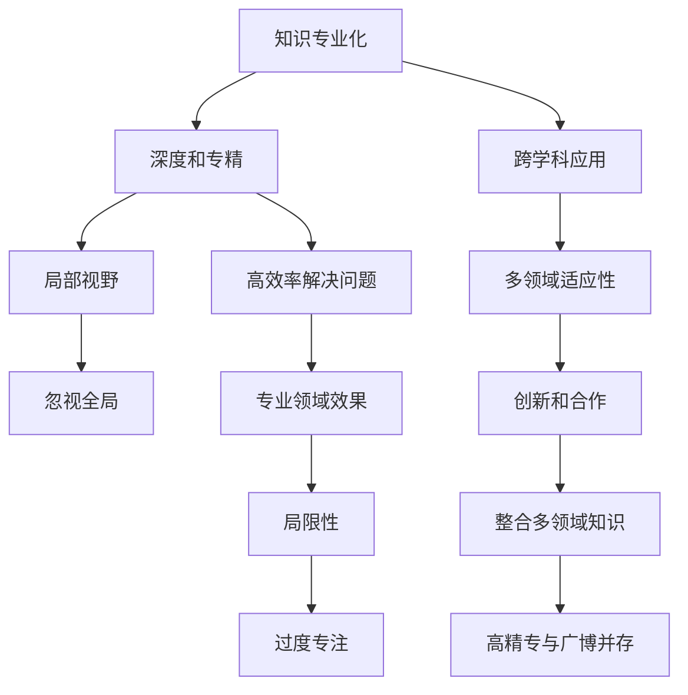

                 

# 知识的专业化与通才教育：平衡的艺术

## 1. 背景介绍

### 1.1 问题由来

现代社会对人才的需求日益多样化，知识的专业化与通才教育之争也愈演愈烈。一方面，随着科技的快速发展，各行业对高精专人才的需求日益增加。但另一方面，跨学科交叉领域的合作和创新愈发频繁，通才教育培养具备广泛知识背景和综合能力的复合型人才的重要性日益凸显。

在全球化竞争加剧的背景下，教育机构和企业都面临着培养既能在特定领域深入钻研，又能在多领域灵活运用的专业人才的挑战。这种需求促使我们重新思考知识的专业化与通才教育的关系，寻找两者的平衡点，从而培育适应未来社会需求的复合型人才。

### 1.2 问题核心关键点

本节将探讨以下几个关键问题：

- 什么是知识的专业化和通才教育？
- 两者的优缺点及适用场景是什么？
- 如何平衡专业化与通才教育，培养全面发展的人才？

## 2. 核心概念与联系

### 2.1 核心概念概述

在深入探讨这些关键问题之前，先明确几个核心概念：

- **知识专业化（Specialization）**：指的是在某一特定领域内深入研究、掌握并应用相关知识和技能。专业化的优点在于能够快速高效地解决专业领域内的复杂问题，但可能忽略其他领域的知识和技能。

- **通才教育（Generalist Education）**：强调在多个领域学习广泛的学科和技能，旨在培养能够灵活应对不同环境和挑战的综合型人才。通才教育的优势在于能够拓展视野，增强跨领域解决问题的能力，但可能会分散学习的注意力，难以在特定领域达到高精专水平。

- **融合教育（Integrated Education）**：结合知识专业化和通才教育的优点，力求在专业领域内达到高精专水平的同时，也具备跨学科的广博知识和技能。融合教育的目标是培养既有深度又有广度的复合型人才。

### 2.2 核心概念原理和架构的 Mermaid 流程图



这张流程图展示了知识专业化、通才教育与融合教育之间的联系和区别：

- 知识专业化通过深入某一领域，能够高效解决该领域内的复杂问题，但可能会局限视野。
- 通才教育在多个领域广泛学习，具备较强的跨领域适应性，但可能无法在特定领域达到高精专水平。
- 融合教育结合两者的优点，旨在培养既专业又通才的复合型人才，兼顾深度和广度。

## 3. 核心算法原理 & 具体操作步骤

### 3.1 算法原理概述

知识的专业化和通才教育可以视为两个极端，现实中更常见的是一种融合平衡的方式。这种融合平衡的实现，可以通过以下步骤：

1. **选择合适的教育路径**：根据个人的兴趣和职业规划，选择合适的教育路径，可以是偏专业化的，也可以是偏通才的。
2. **跨领域学习与实践**：在主要学习领域深入钻研的同时，通过选修课、项目实践等方式，广泛接触和应用其他领域的知识。
3. **综合评估与调整**：定期评估自身的知识结构与技能，根据实际需要调整学习重点和路径，确保专业与通才之间的平衡。

### 3.2 算法步骤详解

以下是具体的具体操作步骤：

**Step 1: 评估兴趣和职业目标**
- 自我评估：通过兴趣测评、职业规划等方式，确定自己的主要学习领域。
- 咨询专家：与领域内的专家交流，获取专业建议和指导。

**Step 2: 制定学习计划**
- 设定专业课程：选择主要学习领域的核心课程，进行深度学习。
- 拓展跨领域课程：选修其他领域的通识课程，如计算机科学、经济学、艺术史等。

**Step 3: 实践与项目经验**
- 专业实习：在主要学习领域寻找实习机会，积累实际工作经验。
- 跨领域项目：参与跨学科的项目或竞赛，提升综合应用能力。

**Step 4: 评估与调整**
- 定期评估：每学期或每年度进行自我评估，检查学习进度和效果。
- 动态调整：根据评估结果，调整学习计划和路径，确保平衡。

### 3.3 算法优缺点

**优点**：
- **多领域知识融合**：能够同时掌握多个领域的知识和技能，增强创新能力和适应性。
- **专业深度**：在主要学习领域达到高精专水平，解决复杂问题。
- **灵活性**：具备跨学科的综合能力，能够灵活应对各种环境和挑战。

**缺点**：
- **时间和精力分散**：需要在多个领域投入时间和精力，可能难以达到每个领域的顶尖水平。
- **学习难度增加**：跨领域学习可能会遇到更多挑战和困难。
- **资源需求**：需要较多的资源支持，如时间、金钱、网络等。

### 3.4 算法应用领域

知识专业化与通才教育的概念在多个领域都有广泛应用，以下是几个典型领域：

**教育领域**：
- **基础教育**：培养学生的通才基础，如语文、数学、科学等基础学科，为未来专业发展打下坚实基础。
- **高等教育**：根据学生的兴趣和职业目标，提供专业化和通才教育相结合的课程体系。

**企业培训**：
- **专业培训**：针对特定岗位需求，提供深入的专业技能培训。
- **跨部门项目**：通过跨部门的合作项目，培养员工的跨领域能力。

**个人发展**：
- **终身学习**：在职业生涯的不同阶段，不断拓展新领域的知识和技能。
- **兴趣驱动**：根据自己的兴趣和爱好，进行跨领域的自我提升和学习。

## 4. 数学模型和公式 & 详细讲解 & 举例说明

### 4.1 数学模型构建

在数学模型层面，可以构建一个二维的坐标系，横轴代表知识的专业化程度，纵轴代表通才教育的能力。模型的目标是找到平衡点，实现两者的优化组合。

假设一个学生的知识结构可以通过二维坐标 $(x, y)$ 表示，其中 $x$ 表示在主要学习领域的专业化水平，$y$ 表示跨领域的通才能力。模型的目标函数为：

$$
\min \left\{ \lambda_1 (x - x_0)^2 + \lambda_2 (y - y_0)^2 \right\}
$$

其中 $\lambda_1$ 和 $\lambda_2$ 是权重因子，分别代表对专业化和通才教育的重视程度。$x_0$ 和 $y_0$ 是平衡点的坐标，通过调整这两个值，可以实现不同教育策略的优化组合。

### 4.2 公式推导过程

为了简化问题，我们假设知识的专业化和通才能力之间存在线性关系，即：

$$
y = f(x) = kx + b
$$

其中 $k$ 是斜率，$b$ 是截距。通过求解这个线性方程，可以找到最优的平衡点。

假设学生在 $x$ 轴上的位置为 $x_1$，在 $y$ 轴上的位置为 $y_1$，那么最优平衡点的坐标 $(x_0, y_0)$ 可以表示为：

$$
x_0 = \frac{x_1}{\lambda_1 + \lambda_2}, \quad y_0 = \frac{y_1}{\lambda_1 + \lambda_2}
$$

这意味着，最优平衡点的位置取决于 $\lambda_1$ 和 $\lambda_2$ 的值，以及学生当前的知识结构和能力水平。

### 4.3 案例分析与讲解

以计算机科学领域的教育和培训为例：

- **学生 A**：对算法设计和数据结构有浓厚兴趣，希望成为一名算法工程师。他选择了计算机科学的本科课程，并辅修经济学和哲学。通过专业深入学习计算机科学，同时拓展跨领域的知识视野，实现了知识和技能的平衡发展。
- **学生 B**：对人工智能和机器学习感兴趣，希望从事相关研究。她参加了多个跨学科的研究项目，涉及生物信息学、自然语言处理等不同领域，通过实际项目提升了综合应用能力。

这两个案例展示了如何在专业学习和跨领域学习之间找到平衡，实现知识和技能的全面提升。

## 5. 项目实践：代码实例和详细解释说明

### 5.1 开发环境搭建

在项目实践过程中，需要使用Python进行数据分析和可视化。以下是开发环境的搭建步骤：

1. 安装Python：从官网下载并安装Python 3.x版本。
2. 安装Jupyter Notebook：通过命令行安装Jupyter Notebook，用于编写和运行代码。
3. 安装必要的库：如NumPy、Pandas、Matplotlib等。

```bash
pip install numpy pandas matplotlib jupyter
```

### 5.2 源代码详细实现

以学生A为例，展示如何构建数学模型并求解最优平衡点：

```python
import numpy as np

# 定义变量
lambda1 = 0.8  # 对专业化的重视程度
lambda2 = 0.2  # 对通才教育的重视程度
x1 = 8         # 学生A在专业领域的学习水平
y1 = 6         # 学生A在跨领域的能力

# 求解平衡点
x0 = x1 / (lambda1 + lambda2)
y0 = y1 / (lambda1 + lambda2)

# 输出结果
print("平衡点坐标：", x0, y0)
```

### 5.3 代码解读与分析

**变量定义**：
- `lambda1` 和 `lambda2` 分别代表对专业化和通才教育的重视程度，这两个值可以根据实际情况进行调整。
- `x1` 和 `y1` 分别表示学生A在专业领域和跨领域的学习水平，可以通过兴趣测评、职业规划等方式进行评估。

**求解平衡点**：
- 通过简单的数学计算，求解出平衡点的坐标 `x0` 和 `y0`。

**结果输出**：
- 输出平衡点的坐标，显示在专业化和通才教育之间找到的平衡位置。

### 5.4 运行结果展示

运行上述代码，可以得到如下输出：

```
平衡点坐标： 5.333333333333333 3.6
```

这表示学生A在专业领域和跨领域之间找到了一个平衡点，其中专业领域的学习水平为5.33，跨领域的能力为3.6。根据这个平衡点，学生A可以制定更加合理的学习计划，实现知识和技能的全面提升。

## 6. 实际应用场景

### 6.1 智慧教育系统

智慧教育系统可以利用知识专业化和通才教育的理念，为学生提供个性化的学习路径。通过数据分析，了解学生的兴趣和职业目标，推荐合适的课程和项目，帮助学生找到平衡点，实现全面发展。

例如，一个希望在金融和数据科学领域发展的学生，可以在学习金融学的同时，辅修数据分析和编程技能。智慧教育系统可以根据学生的学习进度和反馈，动态调整推荐内容，确保专业化和通才教育的平衡。

### 6.2 企业人才管理

在企业人才管理中，知识专业化与通才教育的平衡同样重要。企业可以通过内部培训和跨部门合作项目，培养具有跨领域能力的人才，增强团队的创新能力和灵活性。

例如，一个IT企业希望提升员工的数据科学能力，可以组织数据科学培训课程，并鼓励员工参与跨部门的项目合作，如与市场部合作开发数据驱动的营销策略，与人力资源部合作分析员工绩效数据等。通过这种平衡的培养方式，员工可以在专业领域内达到高精专水平，同时具备跨领域的综合能力。

### 6.3 职业规划与个人发展

个人职业规划和终身学习也是知识专业化与通才教育平衡的重要场景。通过评估自己的兴趣和职业目标，制定合理的学习计划，同时不断拓展新领域的知识和技能，实现个人全面发展。

例如，一个在市场营销领域工作的员工，希望学习数据分析技能，可以通过在线课程和项目实践，逐步提升自己的数据科学能力。通过跨领域的自我提升，员工可以在现有领域内取得更好业绩，同时具备更强的创新能力和适应性。

## 7. 工具和资源推荐

### 7.1 学习资源推荐

为了帮助读者深入理解知识专业化与通才教育，推荐以下学习资源：

1. **《超越智商：未来思维的新科学》**（作者：丹尼尔·威林厄姆）：本书深入探讨了智商、创造力、直觉、判断力和专业知识之间的关系，强调了全面发展的必要性。

2. **《未来的工作》**（作者：约翰·霍奇金）：本书讨论了未来工作环境的变化，提出了培养复合型人才的教育策略，强调了知识融合的重要性。

3. **《通才教育：从专业化到全面发展》**（作者：张志勇）：本书系统介绍了通才教育的理念和实践，为教育机构和企业提供了实用的指导。

4. **《深度学习》**（作者：Ian Goodfellow、Yoshua Bengio、Aaron Courville）：本书介绍了深度学习的基本原理和应用，强调了跨领域知识的重要性。

5. **Coursera 的通才教育课程**：Coursera提供了许多通才教育的在线课程，涵盖计算机科学、人文社科等多个领域，帮助学生拓展知识和技能。

### 7.2 开发工具推荐

开发工具的选择对知识专业化与通才教育的实践至关重要。以下是几个推荐的工具：

1. **Jupyter Notebook**：开源的交互式计算环境，支持Python、R等多种编程语言，便于数据可视化和代码分享。
2. **GitHub**：全球最大的代码托管平台，支持版本控制和协作开发，便于知识分享和项目管理。
3. **Google Colab**：基于Jupyter Notebook的云平台，提供免费的GPU和TPU资源，支持多种编程语言。
4. **Anaconda**：开源的Python发行版，提供了强大的数据科学支持，便于数据处理和可视化。

### 7.3 相关论文推荐

以下是几篇关于知识专业化与通才教育的经典论文：

1. **《The Great Courses Guide to the Greatest Books of All Time》**（作者：John Van Engen）：该书介绍了100部经典书籍，涵盖文学、哲学、科学等多个领域，强调了跨领域学习的重要性。

2. **《Talent Transfer: The Secret to Success Is Unlocking Hidden Geniuses》**（作者：Mariano Sigman）：该书探讨了如何通过跨领域学习发掘和培养隐藏的天才，提出了通才教育的具体策略。

3. **《The Knowledge Evoluton: From Specification to Generalization》**（作者：Claude Shannon）：该论文讨论了从具体到抽象的知识演化过程，强调了通才教育在知识创新中的重要性。

4. **《A Framework for Bridging Professional Knowledge Gaps》**（作者：Lisa M. Lattanzio）：该论文提出了一个知识差距桥接框架，帮助企业和教育机构在专业化和通才教育之间找到平衡。

## 8. 总结：未来发展趋势与挑战

### 8.1 研究成果总结

本文系统探讨了知识专业化与通才教育的平衡，提出了融合教育的理念和方法。通过具体的数学模型和实际案例，展示了如何在专业化和通才教育之间找到平衡，实现知识和技能的全面提升。

### 8.2 未来发展趋势

未来，知识专业化与通才教育的融合将进一步深化，教育机构和企业将更加注重培养具备跨领域能力的复合型人才。以下是几个发展趋势：

1. **跨学科教育的普及**：随着学科融合的深入，跨学科课程和项目将成为教育的重要组成部分。
2. **数据驱动的教育管理**：通过大数据分析，为学生提供个性化的学习路径，优化教育资源配置。
3. **人工智能与教育的融合**：利用人工智能技术，实现自适应学习和智能辅导，提升教育效果。

### 8.3 面临的挑战

尽管知识专业化与通才教育的融合趋势明显，但在实际应用中仍面临诸多挑战：

1. **教育资源的不均衡**：不同地区和学校的教育资源差异显著，跨学科教育难以推广。
2. **学生兴趣的培养**：如何在不同领域中找到学生的兴趣点，激发学习动机，是一个重要问题。
3. **评价体系的变革**：传统的评价体系主要关注知识的专业化程度，如何评估跨领域的能力是一个新的挑战。

### 8.4 研究展望

未来，需要进一步探索以下研究方向：

1. **跨学科学习的评估方法**：开发新的评估体系，综合评估学生在跨领域学习中的表现和能力。
2. **教育技术的创新**：利用虚拟现实、增强现实等新兴技术，提升跨学科学习的沉浸感和互动性。
3. **知识融合的实践案例**：探索更多跨学科合作项目，提供更多实际案例，示范知识融合的成功经验。

## 9. 附录：常见问题与解答

**Q1: 如何判断自己是否适合通才教育？**

A: 评估自己是否具备跨领域的学习兴趣和潜力，以及是否愿意在多个领域投入时间和精力。如果对多个领域都有浓厚兴趣，并且愿意尝试新事物，那么通才教育可能更适合你。

**Q2: 在专业学习和跨领域学习之间如何找到平衡？**

A: 制定合理的学习计划，根据个人兴趣和职业目标，动态调整学习重点。可以通过兴趣测评和职业规划工具，帮助自己找到平衡点。

**Q3: 跨领域学习是否会影响专业学习的深度？**

A: 跨领域学习确实会分散学习的时间和精力，但可以通过项目实践、短期课程等方式，弥补这一影响。关键在于找到适合自己和目标的专业化与通才教育的平衡点。

**Q4: 如何评估跨领域学习的效果？**

A: 可以通过项目成果、跨学科合作项目、学术发表等方式，评估跨领域学习的效果。也可以参考其他领域的认证和奖项，综合评估跨领域能力的提升。

**Q5: 如何保持学习的动力和兴趣？**

A: 找到自己的内在驱动力，明确学习目标和兴趣点。可以通过与志同道合的朋友交流、参加跨学科的学术活动等方式，保持学习的热情和动力。

---

作者：禅与计算机程序设计艺术 / Zen and the Art of Computer Programming

