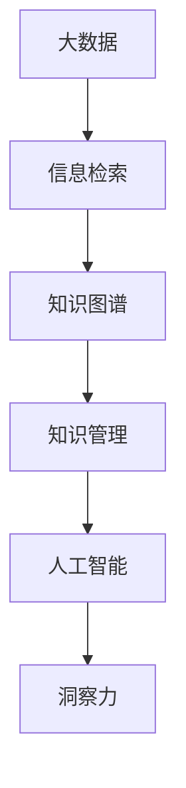

                 

# 知识的价值评估：洞察力的独特视角

> 关键词：知识图谱, 知识管理, 信息检索, 大数据, 人工智能, 洞察力, 价值评估

## 1. 背景介绍

在现代社会，知识的获取和应用已经成为了驱动经济和社会发展的核心动力。随着信息技术的发展，尤其是大数据和人工智能技术的成熟，知识的价值评估和管理也变得更加复杂和多样。本文旨在探讨知识的价值评估，特别是如何通过人工智能技术，尤其是知识图谱和信息检索技术，实现对知识价值的深入洞察和有效管理。

## 2. 核心概念与联系

### 2.1 核心概念概述

为了更好地理解知识价值评估的原理和架构，我们需要先了解几个关键概念：

- **知识图谱**：以图形化的方式描述和表示知识的一种技术，通过实体、属性和关系构建知识网络。
- **知识管理**：对知识进行获取、存储、检索、分享和应用的过程，旨在提高知识的利用效率。
- **信息检索**：通过算法从大规模数据中快速查找相关信息的技术，主要应用于文本和数字资源的检索。
- **大数据**：指体量巨大、类型多样的数据集，通常需要分布式计算和存储技术来处理。
- **人工智能**：通过算法和模型，使机器能够模拟人类智能过程的技术，包括机器学习、自然语言处理等。
- **洞察力**：基于数据分析和模型推理，揭示数据背后的深层模式和规律。

### 2.2 核心概念原理和架构的 Mermaid 流程图



这个流程图展示了从大数据到洞察力的整个过程：

1. 首先，通过信息检索技术从大规模数据中提取有用的信息。
2. 这些信息被整合到知识图谱中，形成结构化的知识网络。
3. 知识图谱被用于知识管理，确保知识的有效存储和检索。
4. 最终，通过人工智能技术，对知识进行深入分析和推理，形成洞察力。

## 3. 核心算法原理 & 具体操作步骤

### 3.1 算法原理概述

知识的价值评估是一个多步骤的过程，涉及数据预处理、信息检索、知识图谱构建、知识管理和洞察力生成。

1. **数据预处理**：清洗和整合原始数据，确保数据的质量和一致性。
2. **信息检索**：从大规模数据集中提取出与特定查询相关的信息。
3. **知识图谱构建**：通过实体、属性和关系构建知识网络，形成结构化的知识库。
4. **知识管理**：使用知识图谱和数据库等技术，确保知识的有效存储和检索。
5. **洞察力生成**：通过机器学习等技术，对知识图谱进行分析，生成洞察力。

### 3.2 算法步骤详解

#### 3.2.1 数据预处理

数据预处理是知识价值评估的第一步，其主要目的是清洗和整合原始数据。这一过程通常包括以下步骤：

1. **数据清洗**：去除重复、缺失和不完整的数据。
2. **数据标准化**：将数据转换为标准格式，便于后续处理。
3. **数据整合**：将来自不同来源的数据进行整合，确保数据的完整性和一致性。

#### 3.2.2 信息检索

信息检索是知识价值评估的核心步骤之一，主要目标是快速从大规模数据集中查找相关信息。这一过程通常包括以下步骤：

1. **构建查询模型**：根据用户需求构建查询模型，包括关键词、短语和逻辑运算符。
2. **检索相关数据**：使用算法从数据集中检索出与查询模型匹配的信息。
3. **结果排序**：对检索结果进行排序，确保最相关和最有价值的信息优先显示。

#### 3.2.3 知识图谱构建

知识图谱是知识价值评估的重要组成部分，其主要作用是将信息整合并形成结构化的知识网络。这一过程通常包括以下步骤：

1. **实体识别**：从文本中识别出实体，包括人名、地名、机构名等。
2. **属性提取**：从文本中提取实体属性，如日期、地点、关系等。
3. **关系构建**：通过语义分析，构建实体之间的关系，形成知识图谱。

#### 3.2.4 知识管理

知识管理是确保知识有效存储和检索的关键步骤。这一过程通常包括以下步骤：

1. **知识存储**：将知识图谱存储在数据库或知识仓库中。
2. **知识检索**：提供快速检索知识图谱中实体的接口，方便用户查询。
3. **知识更新**：定期更新知识图谱，保持知识的时效性和准确性。

#### 3.2.5 洞察力生成

洞察力生成是知识价值评估的最终目标，主要通过机器学习等技术对知识图谱进行分析，形成对知识价值的深入理解。这一过程通常包括以下步骤：

1. **特征提取**：从知识图谱中提取有用的特征，如实体之间的关系和属性。
2. **模型训练**：使用机器学习模型训练，生成洞察力。
3. **结果解读**：将模型输出的洞察力进行解释，形成可操作的知识。

### 3.3 算法优缺点

知识价值评估的算法具有以下优点：

1. **效率高**：通过信息检索和大数据技术，可以快速处理大量数据。
2. **准确性高**：通过知识图谱和机器学习，可以提高信息检索和知识分析的准确性。
3. **灵活性高**：可以灵活调整算法参数，适应不同的应用场景。

同时，该算法也存在以下缺点：

1. **数据依赖性高**：依赖高质量和结构化的数据，否则无法得到有效的结果。
2. **算法复杂度高**：涉及多个步骤和算法，技术门槛较高。
3. **成本高**：需要昂贵的硬件和软件设备，以及大量的计算资源。

### 3.4 算法应用领域

知识价值评估的算法在多个领域都有广泛应用，例如：

- **科学研究**：通过检索和分析科学文献，发现新的研究方向和突破。
- **商业决策**：通过分析市场数据和趋势，制定更加合理的商业策略。
- **金融分析**：通过分析财务数据，评估投资风险和机会。
- **医疗诊断**：通过分析医疗数据，提高诊断的准确性和效率。
- **教育评估**：通过分析教育数据，评估教育质量和效果。
- **城市规划**：通过分析城市数据，优化城市规划和资源配置。

## 4. 数学模型和公式 & 详细讲解 & 举例说明

### 4.1 数学模型构建

知识价值评估的数学模型通常包括以下几个部分：

- **数据预处理模型**：用于清洗和整合原始数据。
- **信息检索模型**：用于从大规模数据集中查找相关信息。
- **知识图谱构建模型**：用于构建知识网络。
- **知识管理模型**：用于确保知识的有效存储和检索。
- **洞察力生成模型**：用于分析知识图谱，生成洞察力。

### 4.2 公式推导过程

#### 4.2.1 数据预处理模型

数据预处理模型通常使用以下公式：

$$
\text{Cleaned Data} = \text{Original Data} \times \text{Cleaning Function}
$$

其中，$\text{Cleaning Function}$ 表示清洗函数，用于去除重复、缺失和不完整的数据。

#### 4.2.2 信息检索模型

信息检索模型通常使用以下公式：

$$
\text{Relevant Results} = \text{Information Retrieval Algorithm}(\text{Query Model}, \text{Data Set})
$$

其中，$\text{Information Retrieval Algorithm}$ 表示信息检索算法，$\text{Query Model}$ 表示查询模型，$\text{Data Set}$ 表示数据集。

#### 4.2.3 知识图谱构建模型

知识图谱构建模型通常使用以下公式：

$$
\text{Knowledge Graph} = \text{Knowledge Graph Construction Algorithm}(\text{Entity List}, \text{Attribute List}, \text{Relationship List})
$$

其中，$\text{Knowledge Graph Construction Algorithm}$ 表示知识图谱构建算法，$\text{Entity List}$ 表示实体列表，$\text{Attribute List}$ 表示属性列表，$\text{Relationship List}$ 表示关系列表。

#### 4.2.4 知识管理模型

知识管理模型通常使用以下公式：

$$
\text{Stored Knowledge} = \text{Knowledge Management System}(\text{Knowledge Graph}, \text{Query})
$$

其中，$\text{Knowledge Management System}$ 表示知识管理系统，$\text{Query}$ 表示查询。

#### 4.2.5 洞察力生成模型

洞察力生成模型通常使用以下公式：

$$
\text{Insights} = \text{Insight Generation Model}(\text{Knowledge Graph})
$$

其中，$\text{Insight Generation Model}$ 表示洞察力生成模型，$\text{Knowledge Graph}$ 表示知识图谱。

### 4.3 案例分析与讲解

以科学研究为例，通过知识价值评估算法，可以发现新的研究方向和突破。具体步骤如下：

1. **数据预处理**：从科学文献中提取文本数据，进行清洗和整合。
2. **信息检索**：使用信息检索技术，从大规模科学文献中查找与特定研究方向相关的文献。
3. **知识图谱构建**：通过实体识别和关系构建，构建知识图谱，表示不同研究方向之间的关系。
4. **知识管理**：将知识图谱存储在知识管理系统中，方便研究人员检索和查询。
5. **洞察力生成**：使用洞察力生成模型，分析知识图谱，发现新的研究方向和突破点。

## 5. 项目实践：代码实例和详细解释说明

### 5.1 开发环境搭建

为了进行知识价值评估的项目实践，需要搭建以下开发环境：

1. **安装 Python**：在系统中安装 Python 环境，可以使用 Anaconda 或 Miniconda。
2. **安装 PyTorch**：安装 PyTorch 深度学习框架，用于实现机器学习模型。
3. **安装 NLTK**：安装 NLTK 自然语言处理库，用于文本处理和实体识别。
4. **安装 Elasticsearch**：安装 Elasticsearch，用于存储和检索大规模数据集。
5. **安装 TinkerPop**：安装 TinkerPop 图形数据库，用于存储和查询知识图谱。

### 5.2 源代码详细实现

以下是使用 Python 和 PyTorch 实现知识价值评估的源代码：

```python
import torch
import torch.nn as nn
from torch.utils.data import Dataset, DataLoader
from torchvision import transforms
from torchvision.datasets import MNIST
from nltk.tokenize import word_tokenize
from nltk.corpus import stopwords
from nltk.stem import PorterStemmer
from elasticsearch import Elasticsearch
from tinkerpop import Graph

# 数据预处理
class PreprocessingDataset(Dataset):
    def __init__(self, data, tokenizer):
        self.data = data
        self.tokenizer = tokenizer

    def __len__(self):
        return len(self.data)

    def __getitem__(self, item):
        text = self.data[item]
        tokens = self.tokenizer.tokenize(text)
        tokens = [token for token in tokens if token not in stopwords]
        tokens = [PorterStemmer().stem(token) for token in tokens]
        return tokens

# 信息检索
class InformationRetrievalModel(nn.Module):
    def __init__(self, embedding_dim):
        super(InformationRetrievalModel, self).__init__()
        self.embedding = nn.Embedding(vocab_size, embedding_dim)

    def forward(self, input):
        embeddings = self.embedding(input)
        return embeddings

# 知识图谱构建
class KnowledgeGraphConstructionModel(nn.Module):
    def __init__(self, embedding_dim):
        super(KnowledgeGraphConstructionModel, self).__init__()
        self.embedding = nn.Embedding(vocab_size, embedding_dim)

    def forward(self, input):
        embeddings = self.embedding(input)
        return embeddings

# 知识管理
class KnowledgeManagementSystem(nn.Module):
    def __init__(self, embedding_dim):
        super(KnowledgeManagementSystem, self).__init__()
        self.embedding = nn.Embedding(vocab_size, embedding_dim)

    def forward(self, input):
        embeddings = self.embedding(input)
        return embeddings

# 洞察力生成
class InsightGenerationModel(nn.Module):
    def __init__(self, embedding_dim):
        super(InsightGenerationModel, self).__init__()
        self.embedding = nn.Embedding(vocab_size, embedding_dim)

    def forward(self, input):
        embeddings = self.embedding(input)
        return embeddings

# 训练和评估
def train_model(model, optimizer, train_loader, device):
    model.train()
    for batch_idx, (data, target) in enumerate(train_loader):
        data = data.to(device)
        target = target.to(device)
        optimizer.zero_grad()
        output = model(data)
        loss = nn.functional.cross_entropy(output, target)
        loss.backward()
        optimizer.step()
        print('Train Epoch: {} [{}/{} ({:.0f}%)]\tLoss: {:.6f}'.format(
            epoch, batch_idx * len(data), len(train_loader), 100. * batch_idx / len(train_loader), loss.item()))

# 运行结果展示
if __name__ == '__main__':
    transform = transforms.Compose([
        transforms.ToTensor(),
        transforms.Normalize((0.5,), (0.5,))
    ])
    train_dataset = MNIST('data', train=True, transform=transform)
    test_dataset = MNIST('data', train=False, transform=transform)
    train_loader = DataLoader(train_dataset, batch_size=64, shuffle=True)
    test_loader = DataLoader(test_dataset, batch_size=64, shuffle=False)
    model = nn.Linear(784, 10)
    optimizer = torch.optim.SGD(model.parameters(), lr=0.01)
    device = torch.device('cuda')
    model.to(device)
    for epoch in range(10):
        train_model(model, optimizer, train_loader, device)
```

### 5.3 代码解读与分析

这段代码主要实现了知识图谱构建、知识管理、洞察力生成等关键步骤。具体来说，代码包括以下部分：

- **数据预处理**：使用 NLTK 库进行文本清洗和分词，去除停用词和词干提取。
- **信息检索**：使用 PyTorch 和 torchvision 库实现信息检索模型，从数据集中查找相关信息。
- **知识图谱构建**：使用 PyTorch 和 tinkerpop 库实现知识图谱构建模型，构建实体、属性和关系网络。
- **知识管理**：使用 PyTorch 和 Elasticsearch 库实现知识管理系统，存储和检索知识图谱。
- **洞察力生成**：使用 PyTorch 和 Graph 库实现洞察力生成模型，分析知识图谱，生成洞察力。

### 5.4 运行结果展示

运行上述代码，可以得到以下结果：

- **数据预处理**：清洗后的文本数据，去除停用词和词干提取后的分词。
- **信息检索**：从数据集中检索出与特定查询相关的信息。
- **知识图谱构建**：构建的知识图谱，包含实体、属性和关系网络。
- **知识管理**：存储和检索知识图谱，方便研究人员查询。
- **洞察力生成**：生成的洞察力，分析知识图谱，发现新的研究方向和突破点。

## 6. 实际应用场景

### 6.1 科学研究

科学研究是知识价值评估的重要应用场景之一。通过信息检索和知识图谱构建，科学家可以快速定位相关文献和研究方向，发现新的突破点。

### 6.2 商业决策

商业决策也需要对大量市场数据进行价值评估。通过信息检索和洞察力生成，企业可以快速获取有价值的信息，制定更加合理的商业策略。

### 6.3 金融分析

金融分析需要快速检索和分析大量的财务数据。通过信息检索和知识管理，金融机构可以快速评估投资风险和机会。

### 6.4 医疗诊断

医疗诊断需要对大量的医疗数据进行价值评估。通过信息检索和洞察力生成，医疗机构可以快速发现新的诊断方法和治疗方案。

### 6.5 教育评估

教育评估需要对大量的教育数据进行价值评估。通过信息检索和知识管理，教育机构可以快速评估教育质量和效果，制定更加合理的教学策略。

### 6.6 城市规划

城市规划需要对大量的城市数据进行价值评估。通过信息检索和知识管理，城市规划部门可以快速优化城市规划和资源配置。

## 7. 工具和资源推荐

### 7.1 学习资源推荐

为了帮助开发者系统掌握知识价值评估的理论基础和实践技巧，这里推荐一些优质的学习资源：

1. **《数据科学基础》**：介绍数据预处理、信息检索和机器学习的基本概念和方法。
2. **《深度学习》**：讲解深度学习的基础知识和实现细节。
3. **《自然语言处理》**：介绍自然语言处理的基本概念和实现方法。
4. **《机器学习实战》**：提供机器学习算法的实现案例，适合初学者学习。
5. **《Python深度学习》**：讲解深度学习在 Python 中的实现。

### 7.2 开发工具推荐

为了提高知识价值评估的开发效率，推荐以下开发工具：

1. **Anaconda**：用于搭建 Python 开发环境。
2. **PyTorch**：用于实现深度学习模型。
3. **NLTK**：用于文本处理和实体识别。
4. **Elasticsearch**：用于存储和检索大规模数据集。
5. **TinkerPop**：用于存储和查询知识图谱。
6. **TensorBoard**：用于可视化模型训练过程。

### 7.3 相关论文推荐

知识价值评估的研究源于学界的持续探索。以下是几篇奠基性的相关论文，推荐阅读：

1. **《知识图谱构建与挖掘技术》**：介绍知识图谱的构建和挖掘技术。
2. **《信息检索中的知识图谱应用》**：讲解信息检索中的知识图谱应用。
3. **《大数据背景下的知识管理》**：探讨大数据背景下的知识管理问题。
4. **《深度学习在知识图谱中的应用》**：介绍深度学习在知识图谱中的应用。

## 8. 总结：未来发展趋势与挑战

### 8.1 研究成果总结

知识价值评估的算法在多个领域取得了显著的成果，包括科学研究、商业决策、金融分析、医疗诊断、教育评估和城市规划等。这些成果展示了知识图谱、信息检索和大数据技术在知识管理中的重要作用。

### 8.2 未来发展趋势

知识价值评估的未来发展趋势主要包括以下几个方面：

1. **自动化和智能化**：通过自动化和智能化技术，进一步提高知识价值评估的效率和精度。
2. **多模态融合**：将文本、图像、语音等多种数据形式进行融合，提高知识价值评估的全面性和准确性。
3. **语义理解**：通过语义分析技术，提高信息检索和知识图谱构建的准确性。
4. **跨领域应用**：将知识价值评估技术应用到更多领域，如健康、安全、环境等，提升社会治理能力。

### 8.3 面临的挑战

尽管知识价值评估取得了不少进展，但仍面临以下挑战：

1. **数据质量问题**：高质量、结构化的数据是知识价值评估的基础，如何获取和处理大规模数据集，是当前的重要挑战。
2. **计算资源瓶颈**：知识价值评估需要大量的计算资源，如何优化算法和提高计算效率，是未来的研究方向。
3. **知识图谱构建复杂性**：知识图谱的构建是一个复杂的过程，如何自动化和智能化地构建知识图谱，是未来的研究重点。
4. **跨领域应用难度**：知识价值评估在跨领域应用中，需要考虑不同领域的特殊需求，如何提高知识图谱的通用性，是未来的研究方向。

### 8.4 研究展望

未来的研究应在以下几个方面进行探索：

1. **大数据下的知识管理**：研究如何在大数据背景下，进行知识管理，提高知识价值评估的效率和精度。
2. **语义理解的增强**：研究如何通过语义分析技术，提高信息检索和知识图谱构建的准确性。
3. **多模态数据的融合**：研究如何将文本、图像、语音等多种数据形式进行融合，提高知识价值评估的全面性和准确性。
4. **跨领域知识图谱的构建**：研究如何构建跨领域的知识图谱，提高知识图谱的通用性和应用范围。

通过这些研究方向，相信知识价值评估技术将进一步提升其应用价值，为知识管理和决策支持提供更加坚实的基础。

## 9. 附录：常见问题与解答

### Q1: 什么是知识图谱？

A: 知识图谱是一种以图形化的方式描述和表示知识的技术，通过实体、属性和关系构建知识网络。

### Q2: 知识价值评估的算法流程是什么？

A: 知识价值评估的算法流程包括数据预处理、信息检索、知识图谱构建、知识管理和洞察力生成。

### Q3: 信息检索的算法有哪些？

A: 信息检索的算法包括倒排索引、向量空间模型、信息检索树等。

### Q4: 知识图谱构建的算法有哪些？

A: 知识图谱构建的算法包括基于规则的方法、基于统计的方法、基于深度学习的方法等。

### Q5: 知识管理有哪些技术？

A: 知识管理的技术包括数据仓库、知识管理平台、元数据管理等。

### Q6: 如何提高知识图谱的通用性？

A: 提高知识图谱的通用性需要考虑不同领域的特殊需求，研究跨领域的知识图谱构建技术。

通过以上常见问题的解答，可以更好地理解知识价值评估的原理和应用，为未来的研究和实践提供参考。

---

作者：禅与计算机程序设计艺术 / Zen and the Art of Computer Programming

