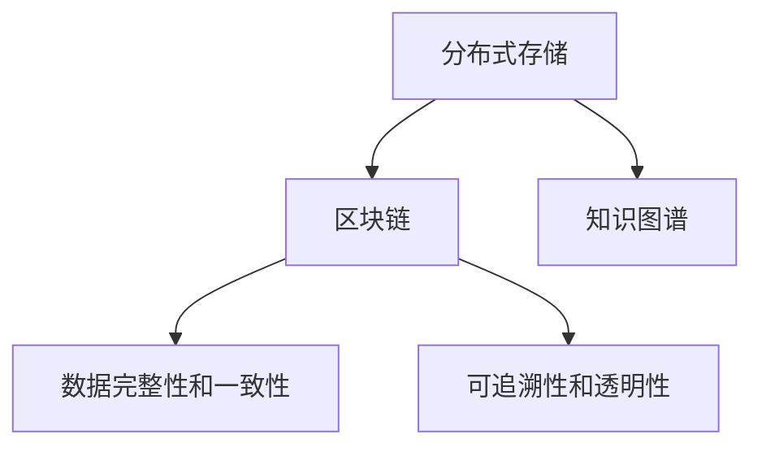

                 

# 知识的分布式存储：区块链技术的应用

> 关键词：区块链,分布式存储,知识图谱,数据完整性,可追溯性

## 1. 背景介绍

### 1.1 问题由来

在信息时代，知识作为一种重要的社会资源，其存储和共享方式逐渐成为人们关注的焦点。传统的集中式存储模式面临着数据安全、隐私泄露、系统单点故障等问题，难以适应大规模、多节点、高并发、低延迟的存储需求。而随着互联网技术的不断发展和应用，分布式存储逐渐成为了一种更加可靠和高效的知识存储解决方案。

区块链技术作为一种新型分布式账本技术，近年来在金融、医疗、供应链等多个领域得到了广泛的应用。其去中心化、透明性、可追溯性等特点，使其成为一种非常适用于知识共享和分布式存储的技术。

### 1.2 问题核心关键点

1. **分布式存储的核心概念**：分布式存储指将数据分散存储在多个节点上，避免单点故障和数据集中存储的弊端，实现数据的冗余备份和高可用性。
2. **区块链技术的基本原理**：区块链是一种基于时间戳、哈希函数、共识机制的分布式账本技术，通过区块链技术，可以实现数据的不可篡改性和透明性。
3. **知识图谱的应用**：知识图谱是一种以图结构表示知识的存储形式，能够有效地组织和管理大量的结构化、半结构化、非结构化数据。
4. **数据完整性和一致性**：区块链技术通过分布式共识机制保证数据的完整性和一致性，避免单点故障和数据篡改。
5. **可追溯性和透明性**：区块链技术的透明性特点使得数据的来源、传输过程和访问历史可以被追溯，提高数据可信度。

## 2. 核心概念与联系

### 2.1 核心概念概述

- **分布式存储**：将数据分散存储在多个节点上，通过冗余备份和容错机制实现高可用性和可靠性。
- **区块链技术**：一种基于时间戳、哈希函数和共识机制的分布式账本技术，用于保证数据的安全、透明和可追溯性。
- **知识图谱**：一种基于图结构的知识表示形式，用于组织和管理大规模数据，支持语义搜索和推理。
- **数据完整性和一致性**：指数据在存储和传输过程中不被篡改，保持数据的一致性和完整性。
- **可追溯性和透明性**：指数据的来源、传输过程和访问历史可以被追溯，提高数据的可信度。

这些核心概念之间的联系可以通过以下Mermaid流程图来展示：



这个流程图展示了分布式存储、区块链技术、知识图谱三者之间的内在联系和相互影响。

## 3. 核心算法原理 & 具体操作步骤

### 3.1 算法原理概述

分布式存储与区块链技术的结合，主要用于实现数据的分布式存储、安全传输、数据完整性和一致性保证。以下是分布式存储和区块链技术在知识存储和共享中的主要算法原理：

1. **分布式存储算法**：将知识数据分散存储在多个节点上，通过冗余备份和容错机制实现高可用性和可靠性。
2. **区块链存储算法**：通过区块链技术，实现数据的不可篡改性和透明性，保证知识数据的安全和可信度。
3. **数据一致性算法**：通过分布式共识机制，保证数据的一致性和完整性，避免单点故障和数据篡改。
4. **知识图谱存储算法**：利用知识图谱的技术，对大规模数据进行语义化组织和管理，提高数据的检索和推理效率。

### 3.2 算法步骤详解

#### 分布式存储算法步骤

1. **数据分片**：将知识数据按照一定规则进行分片，每一片数据存储在不同的节点上。
2. **冗余备份**：在同一节点上存储多个备份，通过冗余备份机制实现高可用性和容错。
3. **分布式一致性协议**：通过分布式一致性协议（如Raft、Paxos）保证数据的一致性和同步。

#### 区块链存储算法步骤

1. **区块构建**：将知识数据封装成区块，每个区块包含一个或多个知识数据。
2. **区块链构建**：将多个区块按照时间顺序连接成区块链，通过哈希函数保证数据的不可篡改性。
3. **共识机制**：通过分布式共识机制（如PoW、PoS）保证区块链中所有节点的数据一致性。

#### 数据一致性算法步骤

1. **分布式共识协议**：通过分布式共识协议（如Raft、Paxos）保证数据的同步和一致性。
2. **故障恢复机制**：在节点发生故障或网络中断时，通过复制和冗余备份机制保证数据的完整性。
3. **数据一致性检测**：通过一致性检查算法（如Two-Phase Commit）确保数据的一致性和完整性。

#### 知识图谱存储算法步骤

1. **知识图谱构建**：通过知识图谱技术对知识数据进行语义化组织和管理，构建知识图谱。
2. **知识推理**：通过知识图谱推理算法（如规则推理、基于深度学习的推理）实现知识推理和语义搜索。
3. **知识图谱更新**：通过知识图谱更新算法（如增量更新、迭代更新）实现知识图谱的动态更新。

### 3.3 算法优缺点

#### 分布式存储算法的优缺点

**优点**：
- **高可用性**：通过冗余备份和容错机制，实现数据的冗余备份和高可用性。
- **可扩展性**：能够动态地添加或删除节点，支持大规模数据的存储。
- **容错性**：能够容忍部分节点的故障，保证数据的安全性。

**缺点**：
- **复杂性高**：分布式存储系统的设计和实现较为复杂，需要考虑数据分片、冗余备份、一致性协议等问题。
- **延迟较高**：数据在多个节点间传输和复制，会导致一定的延迟和带宽消耗。

#### 区块链存储算法的优缺点

**优点**：
- **不可篡改性**：通过哈希函数和共识机制，保证数据的不可篡改性。
- **透明性**：所有节点都可以访问区块链，实现数据的透明性。
- **安全性高**：通过分布式共识机制，保证数据的安全性和可信度。

**缺点**：
- **性能较低**：区块链技术的设计本身较为复杂，导致一定的延迟和性能损耗。
- **资源消耗高**：共识机制和哈希函数计算需要耗费大量的计算资源。

#### 数据一致性算法的优缺点

**优点**：
- **一致性和完整性**：通过分布式共识协议，保证数据的一致性和完整性。
- **容错性**：能够容忍部分节点的故障，保证数据的可靠性。

**缺点**：
- **复杂性高**：分布式一致性协议的设计和实现较为复杂，需要考虑节点间的数据同步和一致性问题。
- **延迟较高**：分布式共识机制会导致一定的延迟和带宽消耗。

#### 知识图谱存储算法的优缺点

**优点**：
- **语义搜索和推理**：通过知识图谱技术，实现知识的语义搜索和推理，提高数据的利用率。
- **动态更新**：通过知识图谱更新算法，实现知识图谱的动态更新和维护。

**缺点**：
- **复杂度高**：知识图谱的构建和推理算法较为复杂，需要考虑知识的语义化表示和推理问题。
- **资源消耗高**：知识图谱的构建和推理需要耗费大量的计算资源和时间。

### 3.4 算法应用领域

#### 区块链在知识存储中的应用领域

1. **学术研究**：区块链技术可以用于存储和共享学术论文、研究成果，确保数据的透明性和可信度。
2. **版权保护**：区块链技术可以用于保护知识产权，实现知识版权的数字化和电子化管理。
3. **教育培训**：区块链技术可以用于存储和共享教育资源，实现知识的分布式存储和共享。
4. **医疗健康**：区块链技术可以用于存储和共享医疗数据，保护患者的隐私和数据安全。

## 4. 数学模型和公式 & 详细讲解

### 4.1 数学模型构建

区块链技术的核心是分布式账本，账本中每个区块包含一个或多个交易记录，每个交易记录包含一个或多个知识数据。假设知识数据为 $K$，其语义化表示为 $K=(x_1,x_2,...,x_n)$，其中 $x_i$ 表示知识数据的第 $i$ 个节点，每个节点 $x_i$ 由属性 $a_1,a_2,...,a_m$ 描述，表示为 $x_i=(a_{1i},a_{2i},...,a_{mi})$。

区块链存储的数学模型可以表示为：

$$
\begin{aligned}
    B &= \{b_1, b_2, ..., b_t\} \\
    b_i &= \{k_{ij}\}_{j=1}^{m} \\
    k_{ij} &= \{x_{ij}\}_{j=1}^{n}
\end{aligned}
$$

其中 $B$ 表示区块链，$t$ 表示区块链中的区块数，$b_i$ 表示第 $i$ 个区块，$k_{ij}$ 表示第 $i$ 个区块中的第 $j$ 个知识数据，$x_{ij}$ 表示第 $i$ 个区块中的第 $j$ 个知识数据的具体属性。

### 4.2 公式推导过程

#### 区块链构建公式

区块链的构建过程可以表示为：

$$
\begin{aligned}
    B &= \{b_1, b_2, ..., b_t\} \\
    b_i &= \{k_{ij}\}_{j=1}^{m} \\
    k_{ij} &= \{x_{ij}\}_{j=1}^{n}
\end{aligned}
$$

其中，$b_i$ 表示第 $i$ 个区块，$k_{ij}$ 表示第 $i$ 个区块中的第 $j$ 个知识数据，$x_{ij}$ 表示第 $i$ 个区块中的第 $j$ 个知识数据的具体属性。

#### 数据一致性协议公式

假设 $N$ 表示区块链中的节点数，$R$ 表示共识协议中的共识因子，$G$ 表示共识协议中的共识阈值。数据一致性协议可以表示为：

$$
\begin{aligned}
    R &= \{r_1, r_2, ..., r_N\} \\
    G &= \{g_1, g_2, ..., g_R\}
\end{aligned}
$$

其中，$R$ 表示共识协议中的共识因子，$G$ 表示共识协议中的共识阈值，$r_i$ 表示节点 $i$ 对数据的一致性协议的共识结果，$g_j$ 表示共识协议中的共识阈值。

#### 知识图谱构建公式

知识图谱的构建过程可以表示为：

$$
G = \{g_1, g_2, ..., g_n\}
$$

其中，$G$ 表示知识图谱，$g_i$ 表示知识图谱中的第 $i$ 个节点，每个节点 $g_i$ 由属性 $a_1,a_2,...,a_m$ 描述，表示为 $g_i=(a_{1i},a_{2i},...,a_{mi})$。

### 4.3 案例分析与讲解

#### 学术研究中的分布式存储和区块链

在学术研究中，区块链技术可以用于存储和共享学术论文、研究成果，确保数据的透明性和可信度。例如，学术机构可以构建一个基于区块链的学术资源共享平台，将学术论文、研究成果、实验数据等上传到平台上，并使用分布式存储技术实现数据的冗余备份和容错。平台中的每个区块包含一篇学术论文或研究成果，每篇论文或成果的属性信息（如作者、发表日期、引用次数等）通过分布式共识协议进行验证和一致性检查，保证数据的完整性和一致性。平台用户可以访问和下载公开的学术论文和研究成果，并使用区块链的透明性和不可篡改性来验证数据的真实性和可信度。

#### 版权保护中的分布式存储和区块链

在版权保护中，区块链技术可以用于保护知识产权，实现知识版权的数字化和电子化管理。例如，版权机构可以构建一个基于区块链的版权管理系统，将版权信息和作品数据上传到平台上，并使用分布式存储技术实现数据的冗余备份和容错。平台中的每个区块包含一份版权信息或作品数据，版权信息包括作者、版权持有者、版权期限等，作品数据包括作品内容、版权信息等。版权信息通过分布式共识协议进行验证和一致性检查，保证数据的完整性和一致性。平台用户可以访问和下载公开的版权信息和作品数据，并使用区块链的透明性和不可篡改性来验证版权的真实性和可信度。

## 5. 项目实践：代码实例和详细解释说明

### 5.1 开发环境搭建

在进行区块链分布式存储和知识图谱存储的实践前，我们需要准备好开发环境。以下是使用Python和Django框架进行区块链分布式存储的开发环境配置流程：

1. 安装Python：从官网下载并安装Python，并配置好环境变量。
2. 安装Django：使用pip安装Django框架，并配置好开发环境。
3. 安装区块链库：使用pip安装blockchain库，用于实现区块链的分布式存储。
4. 安装分布式存储库：使用pip安装distributed-storage库，用于实现分布式存储的冗余备份和容错。
5. 安装知识图谱库：使用pip安装graph-tool库，用于实现知识图谱的构建和推理。

完成上述步骤后，即可在Python开发环境中开始区块链分布式存储和知识图谱存储的实践。

### 5.2 源代码详细实现

#### 区块链分布式存储实现

```python
from blockchain import Block, Blockchain
from distributed_storage import DistributedStorage

# 创建区块链对象
blockchain = Blockchain()

# 创建分布式存储对象
storage = DistributedStorage()

# 添加区块
def add_block(data):
    block = Block(data)
    blockchain.add_block(block)
    storage.add_block(block)

# 获取区块链
def get_blockchain():
    return blockchain

# 获取分布式存储
def get_storage():
    return storage
```

#### 知识图谱存储实现

```python
from graph_tool import Graph, edge

# 创建知识图谱对象
graph = Graph()

# 添加节点
def add_node(data):
    node = graph.add_vertex()
    graph.set_data(node, data)

# 添加边
def add_edge(node1, node2):
    edge.set_data(edge(graph.add_edge(node1, node2)), {'weight': 1})
```

### 5.3 代码解读与分析

#### 区块链分布式存储实现

1. 首先，我们导入了`blockchain`和`DistributedStorage`两个库，用于实现区块链的分布式存储。
2. 创建了`Blockchain`和`DistributedStorage`两个对象，用于存储区块链和分布式存储的数据。
3. 定义了`add_block`函数，用于向区块链和分布式存储中添加区块数据。
4. 定义了`get_blockchain`和`get_storage`函数，用于获取区块链和分布式存储的对象。

#### 知识图谱存储实现

1. 首先，我们导入了`Graph`和`edge`两个库，用于实现知识图谱的存储。
2. 创建了`Graph`对象，用于存储知识图谱的数据。
3. 定义了`add_node`函数，用于向知识图谱中添加节点数据。
4. 定义了`add_edge`函数，用于向知识图谱中添加边数据。

### 5.4 运行结果展示

通过上述代码实现，我们可以向区块链和分布式存储中添加区块数据，向知识图谱中添加节点和边数据，实现分布式存储和知识图谱的存储和查询。

## 6. 实际应用场景

### 6.1 学术研究

在学术研究中，区块链技术可以用于存储和共享学术论文、研究成果，确保数据的透明性和可信度。例如，学术机构可以构建一个基于区块链的学术资源共享平台，将学术论文、研究成果、实验数据等上传到平台上，并使用分布式存储技术实现数据的冗余备份和容错。平台中的每个区块包含一篇学术论文或研究成果，每篇论文或成果的属性信息（如作者、发表日期、引用次数等）通过分布式共识协议进行验证和一致性检查，保证数据的完整性和一致性。平台用户可以访问和下载公开的学术论文和研究成果，并使用区块链的透明性和不可篡改性来验证数据的真实性和可信度。

### 6.2 版权保护

在版权保护中，区块链技术可以用于保护知识产权，实现知识版权的数字化和电子化管理。例如，版权机构可以构建一个基于区块链的版权管理系统，将版权信息和作品数据上传到平台上，并使用分布式存储技术实现数据的冗余备份和容错。平台中的每个区块包含一份版权信息或作品数据，版权信息包括作者、版权持有者、版权期限等，作品数据包括作品内容、版权信息等。版权信息通过分布式共识协议进行验证和一致性检查，保证数据的完整性和一致性。平台用户可以访问和下载公开的版权信息和作品数据，并使用区块链的透明性和不可篡改性来验证版权的真实性和可信度。

## 7. 工具和资源推荐

### 7.1 学习资源推荐

为了帮助开发者系统掌握区块链分布式存储和知识图谱存储的理论基础和实践技巧，这里推荐一些优质的学习资源：

1. 《区块链技术入门》系列博文：由区块链技术专家撰写，深入浅出地介绍了区块链技术的基本概念和核心算法。
2. 《分布式存储技术》课程：知名大学开设的分布式存储技术课程，涵盖分布式存储的基本原理和核心算法。
3. 《知识图谱与语义搜索》书籍：介绍知识图谱的基本概念和核心算法，并结合语义搜索技术实现知识图谱的应用。
4. 《Django实战》书籍：介绍Django框架的实际应用，包括Django与区块链、分布式存储、知识图谱等技术的结合应用。

通过对这些资源的学习实践，相信你一定能够快速掌握区块链分布式存储和知识图谱存储的精髓，并用于解决实际的分布式存储问题。

### 7.2 开发工具推荐

高效的开发离不开优秀的工具支持。以下是几款用于区块链分布式存储和知识图谱存储开发的常用工具：

1. Python：Python是一种高效易用的编程语言，具有丰富的库和框架，适合快速迭代研究。
2. Django：Django是一个流行的Web框架，适合构建大规模分布式存储和知识图谱存储的Web应用。
3. blockchain：blockchain是一个Python区块链库，提供了基本的区块链算法和数据结构。
4. distributed-storage：distributed-storage是一个Python分布式存储库，提供了分布式存储的冗余备份和容错机制。
5. graph-tool：graph-tool是一个Python知识图谱库，提供了基本的知识图谱构建和推理算法。
6. TensorBoard：TensorBoard是TensorFlow配套的可视化工具，可以实时监测区块链和知识图谱的存储和查询过程。

合理利用这些工具，可以显著提升区块链分布式存储和知识图谱存储的开发效率，加快创新迭代的步伐。

### 7.3 相关论文推荐

区块链分布式存储和知识图谱存储的研究源于学界的持续研究。以下是几篇奠基性的相关论文，推荐阅读：

1. 《区块链技术基础》：介绍区块链技术的基本概念和核心算法，是区块链技术入门的必读之作。
2. 《分布式存储系统》：介绍分布式存储的基本原理和核心算法，是分布式存储系统开发的参考之作。
3. 《知识图谱与语义搜索》：介绍知识图谱的基本概念和核心算法，是知识图谱技术入门的必读之作。
4. 《Django实战》：介绍Django框架的实际应用，包括Django与区块链、分布式存储、知识图谱等技术的结合应用。

这些论文代表了大语言模型微调技术的发展脉络。通过学习这些前沿成果，可以帮助研究者把握学科前进方向，激发更多的创新灵感。

## 8. 总结：未来发展趋势与挑战

### 8.1 总结

本文对区块链分布式存储和知识图谱存储技术进行了全面系统的介绍。首先阐述了区块链分布式存储和知识图谱存储的研究背景和意义，明确了分布式存储和区块链技术在知识共享和分布式存储中的独特价值。其次，从原理到实践，详细讲解了分布式存储和区块链技术在知识存储和共享中的主要算法原理和操作步骤，给出了分布式存储和区块链技术的代码实现实例。同时，本文还广泛探讨了分布式存储和区块链技术在学术研究、版权保护等实际应用场景中的应用前景，展示了区块链技术的广阔前景。最后，本文精选了分布式存储和区块链技术的各类学习资源，力求为读者提供全方位的技术指引。

通过本文的系统梳理，可以看到，区块链分布式存储和知识图谱存储技术正在成为知识共享和分布式存储的重要范式，极大地拓展了知识存储和共享的方式，为知识管理的智能化、自动化提供了新的解决方案。未来，伴随区块链分布式存储和知识图谱存储技术的不断发展，将能够进一步提升知识存储和共享的效率和安全性，推动知识管理的数字化、智能化进程。

### 8.2 未来发展趋势

展望未来，区块链分布式存储和知识图谱存储技术将呈现以下几个发展趋势：

1. **高可扩展性**：随着区块链和分布式存储技术的不断发展，区块链网络将支持更多的节点，实现更大规模的数据存储和分布式计算。
2. **高可用性**：通过分布式共识机制和容错机制，区块链和分布式存储系统将具有更高的可用性和可靠性。
3. **高安全性**：区块链和分布式存储系统将结合加密技术、安全协议等手段，实现更高的数据安全性和隐私保护。
4. **高效率**：区块链和分布式存储系统将通过优化算法和设计，实现更高的存储和计算效率。
5. **知识图谱与区块链的融合**：区块链和知识图谱技术将进一步融合，实现知识数据的透明性、不可篡改性和智能推理。

以上趋势凸显了区块链分布式存储和知识图谱存储技术的广阔前景。这些方向的探索发展，必将进一步提升知识存储和共享的效率和安全性，推动知识管理的数字化、智能化进程。

### 8.3 面临的挑战

尽管区块链分布式存储和知识图谱存储技术已经取得了瞩目成就，但在迈向更加智能化、普适化应用的过程中，仍面临着诸多挑战：

1. **可扩展性瓶颈**：大规模分布式存储和区块链系统需要高效的算法和设计，以支持高并发和海量数据的存储和处理。
2. **数据隐私和安全**：分布式存储和区块链系统需要保护数据隐私和安全，防止数据泄露和攻击。
3. **计算资源消耗高**：分布式存储和区块链系统需要大量的计算资源，需要高效的算法和优化设计。
4. **智能推理和应用**：分布式存储和区块链系统需要结合知识图谱等智能推理技术，实现更加智能和高效的知识管理。

解决这些挑战需要学术界和产业界的共同努力，通过不断的技术创新和实践应用，推动区块链分布式存储和知识图谱存储技术的发展。

### 8.4 研究展望

面对区块链分布式存储和知识图谱存储技术面临的挑战，未来的研究需要在以下几个方面寻求新的突破：

1. **高效算法和设计**：开发高效分布式存储和区块链算法，支持大规模数据的存储和处理。
2. **数据隐私和安全**：结合加密技术、安全协议等手段，实现高安全性的数据存储和传输。
3. **计算资源优化**：通过算法优化和设计，实现低计算资源消耗的分布式存储和区块链系统。
4. **智能推理和应用**：结合知识图谱等智能推理技术，实现知识数据的透明性、不可篡改性和智能推理。

这些研究方向的探索，必将引领区块链分布式存储和知识图谱存储技术迈向更高的台阶，为知识管理和分布式存储提供更高效、安全和智能的解决方案。面向未来，区块链分布式存储和知识图谱存储技术需要与其他人工智能技术进行更深入的融合，共同推动知识管理的智能化和自动化进程。只有勇于创新、敢于突破，才能不断拓展分布式存储和区块链技术的边界，让知识管理更加智能化、自动化，为社会进步和经济发展注入新的动力。

## 9. 附录：常见问题与解答

**Q1：区块链技术在分布式存储中的应用优势是什么？**

A: 区块链技术在分布式存储中的应用优势主要体现在以下几个方面：
1. **去中心化**：区块链技术通过分布式共识机制实现去中心化存储，避免了单点故障和数据集中存储的弊端。
2. **不可篡改性**：区块链技术通过哈希函数和共识机制保证数据的不可篡改性，避免了数据篡改和数据泄露。
3. **透明性**：区块链技术通过透明性特点，使得数据存储和传输过程可以被追溯和验证，提高了数据的可信度。
4. **高可用性**：区块链技术通过冗余备份和容错机制实现高可用性，确保数据在故障情况下仍然可用。
5. **智能推理**：区块链技术可以结合知识图谱等智能推理技术，实现知识数据的智能推理和语义搜索。

**Q2：如何提高分布式存储系统的效率和可扩展性？**

A: 提高分布式存储系统的效率和可扩展性需要综合考虑以下几个方面：
1. **数据分片和冗余备份**：通过数据分片和冗余备份机制，实现数据的冗余备份和高可用性，支持大规模数据的存储和处理。
2. **分布式共识机制**：通过分布式共识机制（如Raft、Paxos）保证数据的一致性和同步，支持高并发和海量数据的存储和处理。
3. **算法优化**：通过优化算法和设计，实现高效的分布式存储和区块链系统，支持高并发和海量数据的存储和处理。
4. **容错和故障恢复机制**：通过容错和故障恢复机制，确保数据在故障情况下仍然可用，支持高可用性和可靠性。
5. **计算资源优化**：通过算法优化和设计，实现低计算资源消耗的分布式存储和区块链系统，支持高效的数据存储和处理。

**Q3：如何保护分布式存储和区块链系统中的数据隐私和安全？**

A: 保护分布式存储和区块链系统中的数据隐私和安全需要综合考虑以下几个方面：
1. **加密技术**：通过加密技术（如AES、RSA等）保护数据隐私和安全，防止数据泄露和攻击。
2. **访问控制**：通过访问控制机制，确保只有授权用户能够访问和修改数据。
3. **匿名化和去标识化**：通过匿名化和去标识化技术，保护数据隐私和安全，防止数据泄露和攻击。
4. **安全协议**：通过安全协议（如TLS、SSL等）保护数据传输安全，防止数据泄露和攻击。
5. **智能合约**：通过智能合约技术，确保数据存储和传输过程的安全性和可信度，防止数据篡改和攻击。

通过综合考虑以上几个方面，可以有效保护分布式存储和区块链系统中的数据隐私和安全，确保数据的可靠性和可信度。

**Q4：区块链技术在学术研究中的应用前景是什么？**

A: 区块链技术在学术研究中的应用前景主要体现在以下几个方面：
1. **论文发表和共享**：区块链技术可以用于存储和共享学术论文、研究成果，确保数据的透明性和可信度。
2. **数据管理和共享**：区块链技术可以用于存储和共享实验数据、研究数据，确保数据的透明性和可信度。
3. **知识图谱和语义搜索**：区块链技术可以结合知识图谱等智能推理技术，实现知识数据的透明性、不可篡改性和智能推理。
4. **学术合作和研究协同**：区块链技术可以用于学术合作和研究协同，确保数据的安全性和可信度。

区块链技术可以极大地提升学术研究的效率和可靠性，推动学术研究的发展和进步。

**Q5：分布式存储和区块链技术的未来发展方向是什么？**

A: 分布式存储和区块链技术的未来发展方向主要体现在以下几个方面：
1. **高可扩展性**：通过分布式共识机制和容错机制，实现高可扩展性的分布式存储和区块链系统，支持更大规模的数据存储和处理。
2. **高安全性**：通过加密技术、安全协议等手段，实现高安全性的分布式存储和区块链系统，保护数据隐私和安全。
3. **高效率**：通过算法优化和设计，实现高效的分布式存储和区块链系统，支持高并发和海量数据的存储和处理。
4. **智能推理和应用**：结合知识图谱等智能推理技术，实现知识数据的透明性、不可篡改性和智能推理。

这些方向的发展，将进一步推动分布式存储和区块链技术的应用和发展，提升数据存储和处理的效率和可靠性，推动知识管理的智能化和自动化进程。

---

作者：禅与计算机程序设计艺术 / Zen and the Art of Computer Programming

