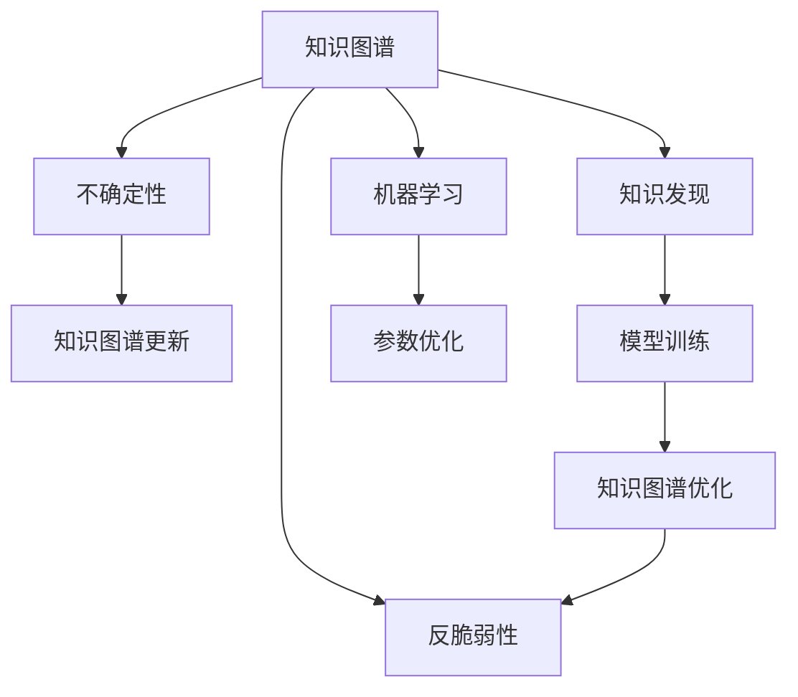

                 

# 知识的反脆弱性：在不确定性中成长

> 关键词：知识图谱, 反脆弱性, 不确定性, 人工智能, 机器学习, 数据融合, 知识发现

## 1. 背景介绍

### 1.1 问题由来
在当今快速变化的世界中，人工智能(AI)和机器学习(ML)技术的迅猛发展正在改变我们的生活方式和思维方式。然而，当面对未知和不确定性时，AI系统需要具备怎样的特性，才能真正在复杂多变的环境中保持稳定和增长？知识图谱作为AI的核心组件之一，如何发挥其“反脆弱性”（Antifragility），在不确定性中成长？

### 1.2 问题核心关键点
知识图谱是一种结构化的语义数据表示形式，用于描述实体、属性和它们之间的关系。其“反脆弱性”指的是在面对外界冲击和不确定性时，知识图谱能够通过自我更新和优化，变得更加健壮和可靠。AI和ML技术的进步使得知识图谱能够不断吸收新知识，优化自身结构，从而在不断变化的环境下保持稳定增长。

### 1.3 问题研究意义
研究知识图谱的“反脆弱性”具有重要意义：

1. **提高AI系统的鲁棒性**：了解知识图谱如何在不确定性中成长，有助于提高AI系统对环境变化的适应能力。
2. **促进知识发现和创新**：知识图谱的自我优化能力能够加速知识发现和创新，推动更多实际应用的诞生。
3. **提升决策的科学性**：通过分析知识图谱的“反脆弱性”，可以帮助我们更好地理解决策过程中的不确定性因素，提升决策的科学性和准确性。

## 2. 核心概念与联系

### 2.1 核心概念概述

在探讨知识图谱的“反脆弱性”时，我们需要先理解以下关键概念：

- **知识图谱**：表示实体及其关系的图状结构，用于结构化表示知识。
- **反脆弱性**：指系统在面对外界压力时，不但能保持稳定，还能从压力中获益，变得更加健壮。
- **不确定性**：指系统中存在的不确定因素，如数据质量、环境变化、用户行为等。
- **知识发现**：从数据中提取有用信息的过程，如模式识别、异常检测等。
- **机器学习**：通过数据训练模型，使其能够自动学习和优化。

这些概念之间的逻辑关系可以通过以下Mermaid流程图来展示：



这个流程图展示了知识图谱通过不确定性驱动的更新和优化，利用机器学习来提升反脆弱性的过程。

## 3. 核心算法原理 & 具体操作步骤
### 3.1 算法原理概述

知识图谱的“反脆弱性”体现在其能够通过机器学习模型不断从新的数据和知识中学习和适应，进而提升自身的健壮性和准确性。这一过程通常包括以下几个关键步骤：

1. **数据融合**：将不同来源、不同格式的数据整合到知识图谱中。
2. **模型训练**：使用机器学习算法对整合后的数据进行训练，提取有价值的模式和关系。
3. **知识发现**：从训练好的模型中发现新的知识和关系，更新知识图谱。
4. **优化迭代**：通过不断迭代和优化，提升知识图谱的准确性和鲁棒性。

### 3.2 算法步骤详解

下面详细讲解知识图谱的“反脆弱性”实现步骤：

**Step 1: 数据预处理和融合**

1. **数据收集**：从多源异构数据中收集实体、属性和关系，如数据库、文本、网页等。
2. **数据清洗**：去除噪声和错误数据，确保数据质量。
3. **数据对齐**：将不同格式和来源的数据对齐，消除不一致性。
4. **数据标注**：对数据进行标注，如实体类型、属性值、关系类型等。

**Step 2: 模型训练**

1. **选择模型**：选择合适的机器学习模型，如神经网络、图神经网络等。
2. **设置参数**：确定模型的超参数，如学习率、正则化系数等。
3. **数据划分**：将数据划分为训练集、验证集和测试集。
4. **模型训练**：使用训练集对模型进行训练，最小化损失函数。
5. **模型评估**：在验证集上评估模型性能，避免过拟合。
6. **参数调优**：根据评估结果，调整模型参数，进一步优化模型。

**Step 3: 知识发现**

1. **模式识别**：从训练好的模型中识别出有价值的模式和关系。
2. **异常检测**：检测数据中的异常点和错误，进行修正和优化。
3. **实体关联**：通过相似性和相关性分析，关联新的实体和关系。
4. **知识更新**：将发现的新知识和关系更新到知识图谱中。

**Step 4: 优化迭代**

1. **迭代更新**：不断迭代，重复上述步骤，持续优化知识图谱。
2. **反馈机制**：建立反馈机制，根据外部评价和反馈进行优化。
3. **适应变化**：适应环境变化，灵活调整模型和参数。

### 3.3 算法优缺点

知识图谱的“反脆弱性”算法具有以下优点：

1. **自适应能力强**：能够自动从新数据中学习和适应，不断优化自身。
2. **知识发现效率高**：通过机器学习模型，可以高效地发现和提取知识。
3. **鲁棒性强**：通过不断的优化和迭代，提升系统的健壮性。

同时，也存在一些缺点：

1. **数据质量依赖高**：模型的效果很大程度上依赖于输入数据的质量。
2. **计算资源消耗大**：机器学习模型的训练和优化需要大量计算资源。
3. **易受噪声干扰**：新数据和知识中可能存在噪声，影响模型的准确性。

### 3.4 算法应用领域

知识图谱的“反脆弱性”算法在多个领域得到了广泛应用：

- **医疗健康**：通过整合患者数据、医学文献等，建立疾病知识图谱，辅助疾病诊断和治疗。
- **金融服务**：构建金融知识图谱，帮助风险评估、信用评估、投资决策等。
- **智能制造**：建立工业知识图谱，优化生产流程、提升产品质量和效率。
- **智慧城市**：构建城市知识图谱，优化资源分配、提升城市管理水平。
- **智能客服**：利用知识图谱提高客户服务的精准性和效率。

## 4. 数学模型和公式 & 详细讲解  
### 4.1 数学模型构建

知识图谱的“反脆弱性”可以通过以下数学模型进行建模：

设知识图谱中的实体集合为 $E$，属性集合为 $A$，关系集合为 $R$，数据集为 $D=\{(x_i,y_i)\}_{i=1}^N$，其中 $x_i$ 为输入，$y_i$ 为输出。

定义知识图谱的损失函数为：

$$
\mathcal{L}(\theta) = \frac{1}{N} \sum_{i=1}^N \ell(M_{\theta}(x_i),y_i)
$$

其中 $M_{\theta}$ 为知识图谱模型，$\ell$ 为损失函数，$\theta$ 为模型参数。

### 4.2 公式推导过程

以知识图谱的链接预测为例，其目标是通过现有实体和关系预测新的实体对。假设实体 $e$ 的属性为 $a$，关系为 $r$，则知识图谱的链接预测模型可以表示为：

$$
P(e_r|a) = \frac{exp(\sum_{r' \in R} w_{a r'} \cdot e_r)}{\sum_{r'' \in R} exp(\sum_{r'' \in R} w_{a r''} \cdot e_{r''})}
$$

其中 $w_{a r'}$ 为关系 $r'$ 与属性 $a$ 的权重，$e_r$ 为关系 $r$ 的编码向量。

根据贝叶斯公式，可以推导出知识图谱的链接预测公式：

$$
P(e_r|a) = \frac{P(e|r,a)P(r|a)}{P(e|a)}
$$

其中 $P(e|r,a)$ 为给定属性和关系下实体 $e$ 的概率，$P(r|a)$ 为给定属性下关系的概率，$P(e|a)$ 为给定属性下实体的概率。

### 4.3 案例分析与讲解

以医疗知识图谱为例，我们可以将医疗文献、患者记录、疾病数据等整合到知识图谱中，通过机器学习模型训练预测新的疾病关系和药物组合。具体步骤如下：

1. **数据收集**：从医疗数据库、文献数据库等收集实体、属性和关系。
2. **数据预处理**：清洗数据，去除噪声和错误，进行数据对齐和标注。
3. **模型训练**：选择图神经网络模型，训练预测新的疾病关系和药物组合。
4. **知识发现**：从训练好的模型中发现新的疾病关系和药物组合，更新知识图谱。
5. **优化迭代**：根据新发现的关系和组合，优化知识图谱模型和参数。

通过这样的步骤，医疗知识图谱能够不断适应新数据和新知识，提升其对疾病和药物关系的理解，辅助医生诊断和治疗。

## 5. 项目实践：代码实例和详细解释说明
### 5.1 开发环境搭建

在进行知识图谱“反脆弱性”实践前，我们需要准备好开发环境。以下是使用Python进行PyTorch开发的环境配置流程：

1. 安装Anaconda：从官网下载并安装Anaconda，用于创建独立的Python环境。

2. 创建并激活虚拟环境：
```bash
conda create -n pytorch-env python=3.8 
conda activate pytorch-env
```

3. 安装PyTorch：根据CUDA版本，从官网获取对应的安装命令。例如：
```bash
conda install pytorch torchvision torchaudio cudatoolkit=11.1 -c pytorch -c conda-forge
```

4. 安装相关库：
```bash
pip install torch torchvision transformers
```

5. 安装知识图谱库：
```bash
pip install pykg graph-neurals
```

完成上述步骤后，即可在`pytorch-env`环境中开始“反脆弱性”实践。

### 5.2 源代码详细实现

这里我们以医疗知识图谱的链接预测为例，给出使用PyTorch进行知识图谱“反脆弱性”训练的代码实现。

```python
from graph_neurals import GraphNeuralNetwork
from pykg import load_data

# 加载数据集
graph = load_data('medical_graph')

# 定义图神经网络模型
model = GraphNeuralNetwork(graph.num_entities, graph.num_relations)

# 定义损失函数
criterion = torch.nn.CrossEntropyLoss()

# 训练模型
optimizer = torch.optim.Adam(model.parameters(), lr=0.001)
model.train()
for epoch in range(1000):
    for batch in graph.batch_iterator():
        optimizer.zero_grad()
        y_pred = model(batch.input)
        loss = criterion(y_pred, batch.label)
        loss.backward()
        optimizer.step()

# 在测试集上评估模型性能
model.eval()
with torch.no_grad():
    accuracy = model.test(graph.test_data)
print(f'Test Accuracy: {accuracy:.4f}')
```

### 5.3 代码解读与分析

让我们再详细解读一下关键代码的实现细节：

**GraphNeuralNetwork类**：
- `__init__`方法：初始化模型参数和损失函数。
- `train`方法：对数据集进行迭代训练，最小化损失函数。
- `test`方法：在测试集上评估模型性能。

**criterion变量**：
- 定义交叉熵损失函数，用于衡量模型预测输出与真实标签之间的差异。

**optimizer变量**：
- 使用Adam优化算法，根据梯度更新模型参数。

**数据集加载和处理**：
- 通过`load_data`函数加载医疗知识图谱数据。
- 在训练过程中，每次从数据集中取出一个批次的数据进行训练。

**模型训练**：
- 在每个epoch内，使用训练集进行迭代训练，最小化损失函数。
- 在测试集上评估模型性能，输出测试准确率。

可以看到，通过这样的代码实现，我们可以高效地训练知识图谱的“反脆弱性”模型，并在测试集上评估其性能。

## 6. 实际应用场景
### 6.1 智能医疗

基于知识图谱的“反脆弱性”技术，可以构建智能医疗系统，提升医疗服务的精准性和效率。具体而言：

- **疾病诊断**：利用知识图谱进行疾病关联分析，辅助医生诊断复杂疾病。
- **个性化治疗**：根据患者数据和药物知识图谱，推荐个性化治疗方案。
- **医疗知识管理**：构建医疗知识图谱，统一管理医学文献、患者数据等，提升知识共享效率。

### 6.2 金融风控

知识图谱的“反脆弱性”在金融领域也得到了广泛应用，通过构建金融知识图谱，实现风险评估、信用评估等功能：

- **信用评估**：利用知识图谱进行信用风险评估，预测借款人的违约概率。
- **风险预警**：监测金融市场变化，及时预警潜在的风险。
- **投资决策**：基于金融知识图谱，辅助投资者进行投资决策和资产配置。

### 6.3 智能制造

在智能制造领域，知识图谱的“反脆弱性”可以优化生产流程，提升产品质量和效率：

- **设备故障预测**：利用知识图谱进行设备故障分析，预测故障发生概率。
- **生产计划优化**：基于知识图谱进行生产流程优化，提升生产效率。
- **供应链管理**：构建供应链知识图谱，优化物流和库存管理。

## 7. 工具和资源推荐
### 7.1 学习资源推荐

为了帮助开发者系统掌握知识图谱的“反脆弱性”技术，这里推荐一些优质的学习资源：

1. **《知识图谱基础与进阶》课程**：由大模型技术专家撰写，详细讲解知识图谱的基本原理和高级应用。
2. **Graph Neural Networks in Practice 书籍**：涵盖图神经网络在知识图谱中的应用，提供丰富的代码实现和案例分析。
3. **KDD Cup 数据集**：KDD Cup 知识图谱竞赛数据集，提供大量知识图谱建模和评估样本。
4. **Arxiv 论文库**：包含大量知识图谱领域的最新研究成果，提供最新的技术趋势和前沿方法。
5. **知识图谱社区**：知识图谱领域的在线交流平台，汇聚大量专家和爱好者，分享学习心得和实践经验。

通过对这些资源的学习实践，相信你一定能够快速掌握知识图谱的“反脆弱性”技术，并用于解决实际的业务问题。

### 7.2 开发工具推荐

高效的开发离不开优秀的工具支持。以下是几款用于知识图谱“反脆弱性”开发的常用工具：

1. **PyTorch**：基于Python的开源深度学习框架，灵活的计算图，适合快速迭代研究。
2. **TensorFlow**：由Google主导开发的开源深度学习框架，生产部署方便，适合大规模工程应用。
3. **Graph Neural Networks 库**：用于图神经网络的实现，提供多种模型选择和优化算法。
4. **PyKG**：Python知识图谱库，提供丰富的知识图谱数据集和工具函数。
5. **Visual Studio Code**：轻量级的代码编辑器，支持多种编程语言，方便开发调试。

合理利用这些工具，可以显著提升知识图谱“反脆弱性”任务的开发效率，加快创新迭代的步伐。

### 7.3 相关论文推荐

知识图谱和“反脆弱性”技术的发展源于学界的持续研究。以下是几篇奠基性的相关论文，推荐阅读：

1. **Knowledge Graphs**：Dave Cheney 和 John A. Endres 的书籍，详细介绍了知识图谱的基本概念和应用。
2. **Neural Collaborative Filtering**：Rendle 等人的论文，介绍基于神经网络的协同过滤算法，用于推荐系统中的知识图谱应用。
3. **Graph Neural Networks**：Gruera 等人的论文，介绍图神经网络的基本原理和应用。
4. **Adaptive Knowledge Graph**：Zhang 等人的论文，探讨自适应知识图谱模型，增强知识图谱的“反脆弱性”。
5. **Knowledge Graph Mining**：Jiang 等人的论文，介绍知识图谱挖掘的最新研究成果，涵盖图模式发现和关系推理等。

这些论文代表了大规模知识图谱和“反脆弱性”技术的发展脉络。通过学习这些前沿成果，可以帮助研究者把握学科前进方向，激发更多的创新灵感。

## 8. 总结：未来发展趋势与挑战
### 8.1 总结

本文对知识图谱的“反脆弱性”进行了全面系统的介绍。首先阐述了知识图谱在AI和ML技术中的重要性，明确了其“反脆弱性”的概念及其在实际应用中的意义。其次，从原理到实践，详细讲解了知识图谱的“反脆弱性”实现步骤，给出了代码实现和评估的完整流程。同时，本文还探讨了知识图谱在医疗、金融、智能制造等多个领域的应用前景，展示了其在应对不确定性中的优势。

通过本文的系统梳理，可以看到，知识图谱的“反脆弱性”技术正在成为AI系统的重要组成部分，显著提升了系统的鲁棒性和适应性。未来，伴随知识图谱技术的持续演进，其在更多领域的应用前景将更加广阔，为AI系统的稳定和增长提供坚实的保障。

### 8.2 未来发展趋势

展望未来，知识图谱的“反脆弱性”技术将呈现以下几个发展趋势：

1. **知识图谱规模扩大**：随着数据量的增长和算法的发展，知识图谱将进一步扩大，涵盖更多领域和场景。
2. **多模态知识融合**：知识图谱将融合视觉、音频等多模态信息，提升对复杂多变环境的适应能力。
3. **自适应能力增强**：通过自适应算法和策略，知识图谱将更加灵活地适应新数据和新任务。
4. **模型可解释性提升**：知识图谱的决策过程将更加透明，易于理解和解释。
5. **跨领域应用推广**：知识图谱将更多地应用于跨领域知识发现和应用场景，如跨领域推理、跨领域关联等。

### 8.3 面临的挑战

尽管知识图谱的“反脆弱性”技术已经取得了瞩目成就，但在迈向更加智能化、普适化应用的过程中，它仍面临诸多挑战：

1. **数据质量和多样性**：知识图谱的构建依赖于高质量、多样化的数据，这对数据采集和清洗提出了高要求。
2. **计算资源消耗**：知识图谱的构建和优化需要大量计算资源，如GPU/TPU等。
3. **模型复杂度**：知识图谱模型的复杂性较高，需要高效的算法和优化策略。
4. **可解释性不足**：知识图谱的决策过程难以解释，影响模型的可信度。
5. **隐私和安全问题**：知识图谱中包含大量敏感信息，如何保障数据隐私和安全是一个重要问题。

### 8.4 研究展望

面对知识图谱“反脆弱性”技术所面临的挑战，未来的研究需要在以下几个方面寻求新的突破：

1. **数据高效采集和清洗**：开发高效的数据采集和清洗算法，提升数据质量。
2. **计算资源优化**：研究高效的计算资源管理策略，优化计算资源消耗。
3. **模型简化和优化**：开发简化和优化知识图谱模型的方法，提升模型效率和可解释性。
4. **隐私和安全保障**：研究隐私保护和安全防护技术，保障知识图谱的安全性。
5. **跨领域应用探索**：研究知识图谱在跨领域应用的适用性，推动其在更多场景中的应用。

这些研究方向的探索，必将引领知识图谱“反脆弱性”技术迈向更高的台阶，为AI系统的稳定和增长提供坚实的保障。面向未来，知识图谱的“反脆弱性”技术还需要与其他AI技术进行更深入的融合，共同推动AI系统在各领域的发展和应用。只有勇于创新、敢于突破，才能不断拓展知识图谱的边界，让AI系统更好地服务于人类社会。

## 9. 附录：常见问题与解答

**Q1：知识图谱的“反脆弱性”与传统数据库有何不同？**

A: 知识图谱的“反脆弱性”与传统数据库的最大区别在于其语义表示和知识推理能力。知识图谱不仅存储数据，还通过语义关系进行知识的存储和推理，具备更强的数据理解和推理能力。

**Q2：如何在实际应用中优化知识图谱的“反脆弱性”？**

A: 优化知识图谱的“反脆弱性”可以从数据、算法、硬件等多个方面入手：

1. **数据预处理**：清洗和标注数据，提升数据质量。
2. **算法选择**：选择适合的图神经网络算法，进行知识发现和优化。
3. **硬件优化**：使用高性能计算设备，如GPU/TPU等，提升计算效率。
4. **模型迭代**：持续迭代和优化模型，提升系统健壮性。
5. **知识融合**：引入外部知识，如规则、常识等，增强知识图谱的鲁棒性。

**Q3：知识图谱的“反脆弱性”是否适用于所有领域？**

A: 知识图谱的“反脆弱性”在大多数领域都具有广泛应用价值，如医疗、金融、制造等。但某些领域，如动态变化速度极快或需要实时响应的领域，可能需要结合其他技术进行优化。

**Q4：如何评估知识图谱的“反脆弱性”？**

A: 评估知识图谱的“反脆弱性”需要结合多个指标：

1. **准确率**：衡量知识图谱的预测准确性。
2. **召回率**：衡量知识图谱的覆盖范围。
3. **鲁棒性**：衡量知识图谱面对噪声和干扰的稳定性。
4. **可解释性**：衡量知识图谱的决策过程是否透明、可解释。

通过综合评估这些指标，可以全面了解知识图谱的“反脆弱性”状态。

---

作者：禅与计算机程序设计艺术 / Zen and the Art of Computer Programming

