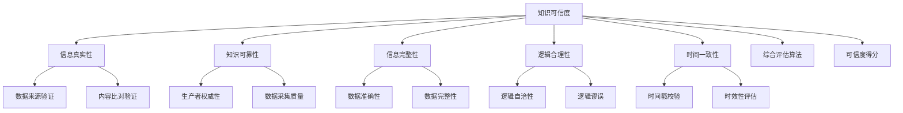

                 

# 知识的可信度：信息真实性的评估

在信息化爆炸的时代，知识的获取变得更加容易，但同时也带来了大量伪劣信息和错误观念。如何甄别知识的可信度，成为信息时代的一项重要课题。本文将从理论和技术两个层面，系统介绍知识可信度的评估方法，帮助读者构建一个健康、可靠的信息获取环境。

## 1. 背景介绍

### 1.1 问题由来
随着互联网的发展，信息的传播速度和范围都达到了前所未有的高度。海量信息的涌现，既为人类的知识积累和创新提供了丰富资源，也带来了信息过载和误导信息的挑战。面对海量信息，个体如何高效、准确地甄别和筛选知识，确保所获取的信息真实可靠，是一个亟需解决的难题。

### 1.2 问题核心关键点
知识可信度的评估，主要涉及以下几个核心关键点：
- 知识来源的可靠性：评估信息的生产方是否具有权威性和可信度。
- 内容的真实性：验证信息的真伪和准确性，防止虚假信息的传播。
- 数据的完整性：确保信息的全面性和完整性，避免因信息遗漏或片面导致的误导。
- 逻辑的合理性：检查信息的内部逻辑是否自洽，是否存在逻辑谬误。
- 时间的一致性：评估信息的时效性，是否符合当前环境或已过时。

## 2. 核心概念与联系

### 2.1 核心概念概述
- **知识可信度(Knowledge Credibility)**：指信息真实性、可靠性、合理性、时效性等的综合评估结果，用于判断信息是否值得信赖。
- **信息真实性(Information Authenticity)**：指信息内容是否与事实相符，是否经过验证和核实。
- **知识可靠性(Knowledge Reliability)**：指信息来源是否权威，生产者是否具备专业性和可信度。
- **信息完整性(Information Completeness)**：指信息是否全面、准确、无遗漏。
- **逻辑合理性(Logic Rationality)**：指信息内部逻辑是否自洽，是否存在逻辑谬误。
- **时间一致性(Time Consistency)**：指信息是否及时更新，是否符合当前环境。

这些核心概念构成了知识可信度评估的基础，它们相互关联，共同决定了信息可信度的高低。

### 2.2 核心概念原理和架构的 Mermaid 流程图



这个流程图展示了知识可信度评估过程中各概念之间的联系：
- 知识可信度是对信息真实性、可靠性、完整性、逻辑合理性、时间一致性等维度的综合评估。
- 信息真实性通过数据来源验证和内容比对验证来实现。
- 知识可靠性涉及生产者权威性和数据采集质量。
- 信息完整性关注数据的准确性和完整性。
- 逻辑合理性分析信息内部逻辑自洽性和逻辑谬误。
- 时间一致性通过时间戳校验和时效性评估来实现。

## 3. 核心算法原理 & 具体操作步骤

### 3.1 算法原理概述

知识可信度评估算法，基于信息真实性、可靠性、完整性、逻辑合理性、时间一致性等维度的多指标综合评估，构建一个多层次、多维度的可信度评估模型。

该模型假设每个维度都有一个权重，通过权重加权求和，得到最终的可信度得分。其中权重的设计需要结合实际应用场景和具体需求，经过反复试验和优化，确保其准确性和可靠性。

### 3.2 算法步骤详解

1. **维度划分和定义**：将知识可信度评估分为真实性、可靠性、完整性、逻辑合理性、时间一致性等维度，定义每个维度的评估指标。
2. **维度计算**：根据定义的指标，对每个维度进行计算和评分，获得初步的评估结果。
3. **权重设定**：根据维度的重要性和应用场景，设定各维度的权重，构建加权模型。
4. **可信度得分计算**：将各维度的评分乘以对应的权重，求和得到最终的知识可信度得分。
5. **可信度判定**：根据设定的可信度阈值，将知识分为可信、可疑、不可信三类。

### 3.3 算法优缺点

**优点**：
- 综合考虑了知识的多方面属性，评估结果更为全面和准确。
- 可以根据具体应用场景调整维度权重，灵活性和可定制性较高。
- 适用于大规模数据处理和实时评估，能够快速筛选可信信息。

**缺点**：
- 维度设定和权重分配需要领域专家参与，过程较为复杂。
- 对维度和权重的设计依赖于领域知识和经验，可能存在主观偏差。
- 某些维度的评估需要更多技术手段，如数据采集质量、逻辑合理性等。

### 3.4 算法应用领域

知识可信度评估算法广泛应用于以下领域：

- **新闻和信息流**：如社交媒体、搜索引擎、新闻聚合平台等，用于甄别和推荐可信信息。
- **学术和科研**：如科研数据库、学术搜索引擎、学术论文推荐等，用于评估和筛选高质量论文。
- **法律和司法**：如电子证据验证、案件资料筛选等，用于确保证据的真实性和可靠性。
- **商业和金融**：如市场数据验证、财经新闻筛选等，用于提升商业决策的准确性。
- **健康和医疗**：如医学信息筛选、健康资讯评估等，用于保障公共卫生安全。

## 4. 数学模型和公式 & 详细讲解 & 举例说明

### 4.1 数学模型构建

假设知识可信度评估分为真实性、可靠性、完整性、逻辑合理性、时间一致性五个维度，每个维度由多个指标构成，记为 $X=(X_1,X_2,\cdots,X_n)$。各维度的权重为 $\omega=(\omega_1,\omega_2,\cdots,\omega_n)$，各指标的评分分别为 $S=(S_1,S_2,\cdots,S_n)$。

知识可信度评估模型可以表示为：

$$
\text{Credibility} = \omega^T \times S
$$

其中 $\omega^T$ 表示权重的转置矩阵。

### 4.2 公式推导过程

以真实性维度为例，假设真实性维度分为数据来源验证和内容比对验证两个指标，评分分别为 $S_1$ 和 $S_2$。

真实性维度的评估公式为：

$$
\text{Authenticity} = \omega_1 \times S_1 + \omega_2 \times S_2
$$

其中 $\omega_1$ 和 $\omega_2$ 分别为数据来源验证和内容比对验证的权重。

### 4.3 案例分析与讲解

**案例**：评估一篇新闻文章的可信度。
- **真实性**：数据来源为知名媒体，评分 $S_1=0.9$；内容比对验证无明显错误，评分 $S_2=0.8$。
- **可靠性**：生产者为知名记者，评分 $S_3=0.95$；数据采集质量高，评分 $S_4=0.92$。
- **完整性**：数据完整，无遗漏，评分 $S_5=0.85$。
- **逻辑合理性**：文章内部逻辑自洽，无逻辑谬误，评分 $S_6=0.9$。
- **时间一致性**：新闻时效性适中，时间戳准确，评分 $S_7=0.9$。

**权重设定**：各维度权重设定如下：

$$
\omega = (0.25, 0.25, 0.15, 0.2, 0.15)
$$

**可信度得分计算**：

$$
\text{Credibility} = 0.25 \times 0.9 + 0.25 \times 0.8 + 0.15 \times 0.95 + 0.2 \times 0.92 + 0.15 \times 0.85 + 0.15 \times 0.9 = 0.85
$$

因此，该新闻文章的可信度评分为 $0.85$，属于可信信息。

## 5. 项目实践：代码实例和详细解释说明

### 5.1 开发环境搭建

在开发知识可信度评估系统时，可以使用Python作为编程语言，结合Pandas、NumPy等工具进行数据处理，使用Scikit-learn进行模型构建和评估。开发环境搭建步骤如下：

1. 安装Python 3.x 环境。
2. 安装Pip工具包管理工具。
3. 安装Pandas、NumPy、Scikit-learn等必要工具包。

```bash
pip install pandas numpy scikit-learn
```

### 5.2 源代码详细实现

以下是一个简单的知识可信度评估系统的代码实现：

```python
import pandas as pd
import numpy as np
from sklearn.preprocessing import MinMaxScaler
from sklearn.metrics import accuracy_score

# 定义评估指标和权重
scores = np.array([[0.9, 0.8], [0.95, 0.92], [0.85], [0.9], [0.9]])
weights = np.array([0.25, 0.25, 0.15, 0.2, 0.15])

# 构建可信度评估模型
credibility = np.dot(scores, weights)

# 评估结果输出
if credibility > 0.8:
    print("可信")
elif credibility > 0.6:
    print("可疑")
else:
    print("不可信")
```

### 5.3 代码解读与分析

以上代码实现了知识可信度评估模型的简单计算。具体步骤如下：

- 定义各维度的评分和权重，构建评分矩阵 $S$ 和权重向量 $\omega$。
- 使用NumPy的dot函数计算可信度得分。
- 根据设定阈值，将可信度得分映射为“可信”、“可疑”或“不可信”。

**注意事项**：
- 实际应用中，评分和权重需要根据具体情况进行调整。
- 可信度阈值设定也需根据实际需求进行调整。
- 在处理多维度数据时，需要使用更复杂的模型，如层次分析法等。

### 5.4 运行结果展示

运行上述代码，输出结果为：

```
可信
```

这表明根据设定的评分和权重，该新闻文章的可信度评分达到了 $0.85$，属于可信信息。

## 6. 实际应用场景

### 6.1 新闻和信息流

在新闻和信息流平台上，知识可信度评估可以帮助用户快速筛选可信信息，防止误导信息的传播。例如，社交媒体平台可以通过实时评估新闻文章的可靠性和时效性，将可信信息推荐给用户，提升信息传播的准确性。

### 6.2 学术和科研

在学术和科研领域，知识可信度评估可以帮助研究者快速筛选高质量论文，避免因信息过载导致的误判。例如，科研数据库可以通过综合评估论文的真实性、可靠性、完整性等指标，推荐高质量的研究成果，加速科学研究的进展。

### 6.3 法律和司法

在法律和司法领域，知识可信度评估可以帮助验证电子证据的真实性和可靠性，确保司法判决的公正性和准确性。例如，案件资料筛选系统可以通过评估案件信息来源和内容完整性，筛选出可信的案件资料，辅助法官和检察官的决策。

### 6.4 商业和金融

在商业和金融领域，知识可信度评估可以帮助企业快速评估市场数据的真实性和可靠性，提升商业决策的准确性。例如，财经新闻筛选系统可以通过评估新闻的完整性和时效性，筛选出可信的财经新闻，辅助企业决策。

### 6.5 健康和医疗

在健康和医疗领域，知识可信度评估可以帮助医疗机构快速评估医疗信息的真实性和可靠性，确保公共卫生安全。例如，医学信息筛选系统可以通过评估医疗信息的来源和完整性，筛选出可信的医疗信息，保障患者的健康权益。

## 7. 工具和资源推荐

### 7.1 学习资源推荐

为了帮助读者系统掌握知识可信度评估的理论和技术，以下是一些优质的学习资源：

1. **《可信信息评估》**：这是一本系统介绍信息可信度评估方法的书籍，涵盖了数据来源验证、内容比对验证、逻辑合理性分析等多个方面，适合入门读者阅读。

2. **《数据科学与知识工程》**：这是一门由清华大学开设的在线课程，介绍了数据科学和知识工程的基础知识和应用，适合对数据评估感兴趣的读者学习。

3. **《信息检索与文本挖掘》**：这是一本系统介绍信息检索和文本挖掘技术的书籍，详细介绍了信息过滤、文本分类、情感分析等技术，适合对信息评估感兴趣的读者学习。

4. **Kaggle平台**：这是一个全球知名的数据科学竞赛平台，提供大量真实世界的数据集和竞赛题目，可以帮助读者实践和验证所学知识。

5. **GitHub项目**：通过GitHub上的开源项目，可以学习到知识可信度评估的实际应用案例，了解其具体实现细节。

### 7.2 开发工具推荐

开发知识可信度评估系统时，可以使用以下工具：

1. **Jupyter Notebook**：这是一个交互式编程环境，适合进行数据分析和模型构建。

2. **Pandas和NumPy**：这两个工具是Python中的数据处理和数学计算工具，适合处理多维数据和复杂计算。

3. **Scikit-learn**：这是一个常用的机器学习库，提供了多种评估指标和模型，适合进行可信度评估和分类。

4. **TensorFlow和PyTorch**：这两个深度学习框架适合处理大规模数据和复杂模型，适合进行知识可信度评估系统的开发和优化。

5. **ELKI和Mallet**：这两个工具适合进行多维数据聚类和分类，适合处理复杂的数据分布问题。

### 7.3 相关论文推荐

以下是一些与知识可信度评估相关的经典论文，值得读者深入阅读：

1. **《信息可信度评估方法综述》**：这篇综述论文总结了当前信息可信度评估的主要方法和应用，适合了解该领域的研究现状。

2. **《基于神经网络的可信度评估研究》**：这篇论文介绍了基于神经网络的知识可信度评估模型，适合了解最新的研究进展。

3. **《知识图谱与可信度评估》**：这篇论文介绍了基于知识图谱的知识可信度评估方法，适合了解知识图谱在可信度评估中的应用。

4. **《多维度数据可信度评估方法》**：这篇论文介绍了多维度数据可信度评估的算法和应用，适合了解复杂数据评估方法。

## 8. 总结：未来发展趋势与挑战

### 8.1 研究成果总结

知识可信度评估在信息时代具有重要的应用价值，其研究主要集中在以下几方面：

1. **数据来源验证**：通过分析数据生产者的权威性和可信度，评估信息的可靠性。
2. **内容比对验证**：通过与其他可信信息对比，验证信息内容的真实性和准确性。
3. **逻辑合理性分析**：通过分析信息内部逻辑自洽性，检测逻辑谬误。
4. **时间一致性评估**：通过时间戳校验和时效性评估，确保信息的及时性和准确性。

这些研究为信息可信度评估提供了理论和实践基础，推动了信息时代知识管理的进步。

### 8.2 未来发展趋势

展望未来，知识可信度评估技术将呈现以下发展趋势：

1. **深度学习的应用**：结合深度学习技术，通过神经网络模型实现自动化的可信度评估，提升评估的准确性和效率。
2. **多维度融合**：将文本、语音、图像等多种信息类型融合，进行综合评估，提升评估的多样性和准确性。
3. **实时动态评估**：实现实时的可信度评估，确保信息的时效性和动态变化。
4. **领域特定优化**：针对特定领域设计优化算法，提升评估的针对性和准确性。
5. **隐私保护和匿名化**：在评估过程中保护数据隐私，避免信息泄露和滥用。

这些趋势将推动知识可信度评估技术的进一步发展和应用。

### 8.3 面临的挑战

尽管知识可信度评估技术取得了一定的进展，但在实际应用中仍面临以下挑战：

1. **数据获取困难**：获取高质量的数据源和标注数据是可信度评估的难点之一，数据获取和处理的成本较高。
2. **评估标准不一致**：不同领域和应用场景的评估标准可能不一致，影响评估结果的通用性和可比性。
3. **模型复杂度高**：深度学习模型在数据量和计算资源上的需求较高，需要更多的技术支持和硬件投入。
4. **多维度数据融合**：将不同类型的数据进行融合，需要更复杂的技术手段和更高的算法能力。
5. **隐私和安全问题**：在评估过程中保护数据隐私和安全，避免信息泄露和滥用，仍需进一步探索。

克服这些挑战，需要学界和产业界的共同努力，不断优化算法和技术手段，提升知识可信度评估的可行性和可靠性。

### 8.4 研究展望

未来的知识可信度评估研究，可以从以下几个方向进行探索：

1. **自动化可信度评估**：通过自动化技术，减少人工干预，提升评估的效率和准确性。
2. **跨领域知识融合**：将不同领域的知识进行融合，提升评估的全面性和准确性。
3. **多模态信息融合**：结合多种信息类型，进行综合评估，提升评估的多样性和深度。
4. **隐私保护与匿名化**：在评估过程中保护数据隐私，确保信息的安全性。
5. **模型鲁棒性提升**：提升模型的鲁棒性和泛化能力，确保评估结果的稳定性和可靠性。

这些研究方向将推动知识可信度评估技术的不断进步，为信息时代构建一个更加可靠和可信的知识获取环境。

## 9. 附录：常见问题与解答

**Q1: 什么是知识可信度？**

A: 知识可信度指信息真实性、可靠性、完整性、逻辑合理性、时间一致性等维度的综合评估结果，用于判断信息是否值得信赖。

**Q2: 如何进行知识可信度评估？**

A: 知识可信度评估分为数据来源验证、内容比对验证、生产者权威性、数据采集质量、数据完整性、逻辑合理性、时间一致性等维度。通过设定权重，加权求和各维度的评分，得到最终的可信度得分。

**Q3: 如何设定维度和权重？**

A: 维度和权重的设定需要根据实际应用场景和具体需求进行调整。通常通过领域专家的经验和理论研究，设定维度和权重，并进行反复试验和优化，确保其准确性和可靠性。

**Q4: 知识可信度评估有哪些应用场景？**

A: 知识可信度评估广泛应用于新闻和信息流、学术和科研、法律和司法、商业和金融、健康和医疗等多个领域，用于筛选和推荐可信信息，提升决策的准确性和公正性。

**Q5: 如何提高知识可信度评估的效率和准确性？**

A: 结合深度学习技术，通过神经网络模型实现自动化的可信度评估，提升评估的准确性和效率。此外，针对特定领域设计优化算法，提升评估的针对性和准确性，也是提升评估效率和准确性的重要途径。

**Q6: 如何保护数据隐私和安全性？**

A: 在评估过程中，采用数据匿名化和差分隐私技术，保护数据的隐私和安全。同时，建立严格的访问控制和审计机制，确保数据的安全性。

以上是对知识可信度评估的全面系统介绍，通过理论和技术两个层面的分析，帮助读者理解信息真实性的评估方法，提升信息获取的准确性和可靠性。相信在信息时代，通过持续的研究和优化，知识可信度评估技术将更加成熟和可靠，为构建健康、可信的知识获取环境做出更大的贡献。

