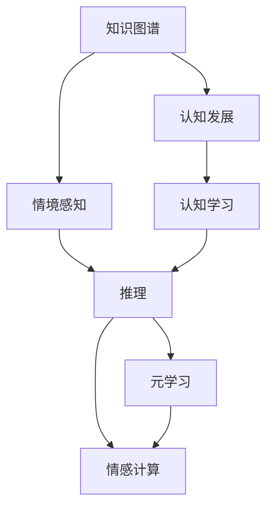

                 

# 知识的情境学习：实践中的认知发展

> 关键词：知识图谱,认知发展,情境感知,认知学习,元学习,情感计算

## 1. 背景介绍

### 1.1 问题由来
当前的人工智能（AI）系统在处理复杂任务时，往往依赖于大数据的积累和算法的优化。但这些系统缺乏对知识的深刻理解和认知能力，难以处理动态变化和情境复杂的情况。

随着认知科学和AI技术的不断发展，知识的情境学习逐渐成为热点。情境学习旨在让AI系统具备更高的认知能力，能够在具体的情境中理解、推理和应用知识。这不仅能提升系统的智能水平，也能推动其在更多实际应用场景中的落地。

### 1.2 问题核心关键点
情境学习涉及知识的获取、理解、推理和应用，其核心关键点包括：

- **知识图谱**：为知识的情境学习提供语义层次的结构化表示，使得知识可以组织和关联起来。
- **认知发展**：学习模型通过认知任务，不断提高自身的知识理解和推理能力。
- **情境感知**：模型能够感知和理解具体情境，区分不同场景下的任务差异。
- **认知学习**：模型能够通过学习经验，形成对知识、情境和任务的认知。
- **元学习**：模型能够高效地适应新的任务和情境，减少学习成本和时间。
- **情感计算**：模型能够感知和理解用户的情感，提高交互的亲和力和自然性。

## 2. 核心概念与联系

### 2.1 核心概念概述

要深入理解知识的情境学习，首先要梳理核心概念之间的关系：

- **知识图谱**：知识图谱是结构化的语义知识库，用于存储和组织实体、关系和属性等知识。
- **认知发展**：认知发展是指认知能力从简单到复杂的过程，包括感知、记忆、推理、创造等。
- **情境感知**：情境感知是指模型能够识别并理解具体情境中的线索和特征，区分不同情境。
- **认知学习**：认知学习是模型通过经验不断提升知识理解和推理能力的过程。
- **元学习**：元学习是指模型能够自动适应新任务，快速学习新知识。
- **情感计算**：情感计算是模型能够感知和理解用户情感，提高交互的自然性和亲和力。

这些概念共同构成情境学习的核心，通过不断学习和推理，模型可以更好地适应不同情境和任务。

### 2.2 核心概念原理和架构的 Mermaid 流程图



这个流程图展示了各个概念之间的逻辑关系：

1. 知识图谱通过结构化表示提供知识基础。
2. 情境感知使得模型能够识别并理解具体情境。
3. 认知发展通过不断的学习，提升模型的知识理解能力。
4. 认知学习使得模型通过经验提升推理能力。
5. 元学习使模型能够高效适应新任务和新情境。
6. 情感计算使得模型能够感知并理解用户的情感。

## 3. 核心算法原理 & 具体操作步骤

### 3.1 算法原理概述

知识的情境学习，本质上是通过构建和利用知识图谱，让模型在具体情境下进行认知发展和推理学习的过程。其核心算法包括：

- **知识图谱嵌入**：将知识图谱中的实体、关系和属性等知识表示为向量形式，以便于模型进行处理。
- **情境感知模型**：设计模型能够感知和理解具体情境，区分不同情境的差异。
- **认知推理模型**：构建模型能够进行知识推理，提升推理的准确性和效率。
- **元学习算法**：开发模型能够自动适应新任务，快速学习新知识。
- **情感计算算法**：实现模型能够感知和理解用户的情感，提高交互的自然性。

### 3.2 算法步骤详解

以下是对知识的情境学习主要算法的步骤详解：

**Step 1: 知识图谱构建**
- 收集领域内的知识信息，包括实体、关系和属性等。
- 利用图谱构建工具，如RDF、OWL等，构建知识图谱的逻辑结构。

**Step 2: 知识图谱嵌入**
- 使用知识图谱嵌入算法，如TransE、RelEVA等，将知识图谱中的信息转化为向量形式。
- 通过训练，模型能够将知识图谱中的实体和关系映射为向量表示。

**Step 3: 情境感知**
- 设计情境感知模块，例如利用LSTM、Transformer等模型，处理文本、图像等情境信息。
- 通过预训练和微调，模型能够识别并理解不同情境中的线索和特征。

**Step 4: 认知推理**
- 构建认知推理模块，例如使用基于规则的推理、逻辑神经网络等方法。
- 通过训练和推理，模型能够在情境中正确地推理和应用知识。

**Step 5: 元学习**
- 开发元学习算法，如MAML、ProximalMeta等，使模型能够快速适应新任务。
- 通过元学习，模型可以在新任务上高效地学习，减少学习成本和时间。

**Step 6: 情感计算**
- 设计情感计算模块，例如利用卷积神经网络、情感词典等方法。
- 通过训练，模型能够感知和理解用户的情感，提高交互的自然性和亲和力。

### 3.3 算法优缺点

知识的情境学习具有以下优点：

- **高智能水平**：通过情境感知和认知推理，模型能够在具体情境中理解和应用知识，具备较高的智能水平。
- **高效适应**：元学习算法使模型能够自动适应新任务和新情境，减少学习成本和时间。
- **多模态支持**：能够处理文本、图像、语音等多种数据源，适用于更多实际应用场景。
- **自然交互**：情感计算算法提高模型对用户情感的理解，提高交互的自然性和亲和力。

同时，该方法也存在以下缺点：

- **数据依赖**：构建知识图谱和情境感知模块需要大量标注数据，获取高质量数据的成本较高。
- **模型复杂**：涉及的知识图谱嵌入、情境感知、认知推理、元学习和情感计算等模块，模型结构复杂。
- **计算资源消耗大**：训练和推理时对计算资源的需求较大，需要高性能计算设备。
- **泛化能力有限**：模型在特定情境下训练得到的能力，可能在新的情境下泛化能力有限。

### 3.4 算法应用领域

知识的情境学习在多个领域都有广泛的应用，例如：

- **医疗领域**：在知识图谱基础上，结合患者具体情境，进行个性化医疗推荐和诊断。
- **教育领域**：利用情境感知和学习能力，构建智能教育系统，提供个性化学习路径。
- **金融领域**：结合市场动态和用户情感，进行智能投资建议和风险预警。
- **零售领域**：通过情境感知和情感计算，提供个性化推荐和客户服务。
- **社交媒体**：结合用户情境和情感，提供个性化的内容推荐和社区管理。
- **自动驾驶**：结合交通情境和情感状态，进行智能驾驶决策和行为控制。

## 4. 数学模型和公式 & 详细讲解 & 举例说明

### 4.1 数学模型构建

知识的情境学习涉及到多个模块的协同工作，其数学模型可以表示为：

$$
\begin{aligned}
\mathcal{S} &= \text{知识图谱嵌入}(\mathcal{G}) \\
&= \{v_e, v_r\} \\
\mathcal{C} &= \text{情境感知}(\mathcal{S}, \mathcal{C}_{\text{data}}) \\
&= f_{\text{context}}(\mathcal{S}, \mathcal{C}_{\text{data}}) \\
\mathcal{R} &= \text{认知推理}(\mathcal{C}, \mathcal{G}) \\
&= g_{\text{reasoning}}(\mathcal{C}, \mathcal{G}) \\
\mathcal{M} &= \text{元学习}(\mathcal{R}, \mathcal{S}) \\
&= h_{\text{meta}}(\mathcal{R}, \mathcal{S}) \\
\mathcal{E} &= \text{情感计算}(\mathcal{C}, \mathcal{M}) \\
&= \text{情感识别}(\mathcal{C}) + \text{情感响应}(\mathcal{M})
\end{aligned}
$$

其中，$\mathcal{S}$ 表示知识图谱嵌入后的向量表示，$\mathcal{C}$ 表示情境感知模块输出的情境表示，$\mathcal{R}$ 表示认知推理模块的推理结果，$\mathcal{M}$ 表示元学习模块对新任务的适应能力，$\mathcal{E}$ 表示情感计算模块对用户情感的感知和响应。

### 4.2 公式推导过程

以下以医疗领域为例，推导知识的情境学习中的核心公式：

**知识图谱嵌入**
- 使用TransE算法，将知识图谱中的实体和关系转化为向量表示：
$$
v_e = \mathbf{W}_e \times [\text{entity}] + \mathbf{b}_e \\
v_r = \mathbf{W}_r \times [\text{relation}] + \mathbf{b}_r
$$

**情境感知**
- 使用LSTM模型，将情境信息（如文本、图像等）转化为情境表示：
$$
\mathcal{C} = f_{\text{context}}(\mathcal{S}, \mathcal{C}_{\text{data}})
$$

**认知推理**
- 使用逻辑神经网络（LNN），结合知识图谱和情境信息进行推理：
$$
\mathcal{R} = g_{\text{reasoning}}(\mathcal{C}, \mathcal{G})
$$

**元学习**
- 使用MAML算法，将模型适应新任务：
$$
\mathcal{M} = h_{\text{meta}}(\mathcal{R}, \mathcal{S})
$$

**情感计算**
- 使用卷积神经网络（CNN），感知用户情感：
$$
\mathcal{E} = \text{情感识别}(\mathcal{C})
$$

**综合处理**
- 结合情境感知、认知推理、元学习和情感计算，综合处理输出结果：
$$
\text{output} = f_{\text{output}}(\mathcal{C}, \mathcal{R}, \mathcal{M}, \mathcal{E})
$$

### 4.3 案例分析与讲解

以智能医疗为例，展示知识的情境学习如何应用于具体任务：

**任务描述**：基于患者的具体情境（如病史、症状、检查结果等），提供个性化的医疗建议和诊断。

**输入数据**：知识图谱中包含的疾病、症状、治疗等信息，患者的病历、症状描述、检查报告等情境信息。

**知识图谱嵌入**：将知识图谱中的疾病、症状、治疗等信息转化为向量表示，存储在知识图谱嵌入模块中。

**情境感知**：利用LSTM模型，将患者的病历、症状描述、检查报告等情境信息转化为情境表示，输入到认知推理模块。

**认知推理**：结合知识图谱嵌入和情境感知，进行推理计算，输出患者的诊断结果和推荐治疗方案。

**元学习**：通过在新的患者数据上微调模型，使其快速适应新情境。

**情感计算**：结合患者的情感状态，调整输出结果，提升交互的自然性和亲和力。

**输出结果**：结合患者的情感状态和推理结果，输出个性化的医疗建议和诊断。

## 5. 项目实践：代码实例和详细解释说明

### 5.1 开发环境搭建

在进行知识的情境学习实践前，需要准备以下开发环境：

1. **安装Python**：使用Anaconda安装Python，并创建虚拟环境，如：
```bash
conda create -n knowledge-learning python=3.8
conda activate knowledge-learning
```

2. **安装依赖库**：安装TensorFlow、PyTorch、Keras、Scikit-learn等依赖库，如：
```bash
pip install tensorflow==2.6.0 pytorch torchvision torchaudio numpy pandas scikit-learn matplotlib tqdm jupyter notebook ipython
```

3. **准备数据集**：收集和预处理医疗领域的数据集，如IMDB电影评论数据集。

### 5.2 源代码详细实现

以下是一个使用PyTorch实现的知识情境学习模型的代码实现：

```python
import torch
import torch.nn as nn
import torch.optim as optim
from torch.utils.data import DataLoader
from torchvision import datasets, transforms

# 定义模型结构
class KnowledgeLearningModel(nn.Module):
    def __init__(self):
        super(KnowledgeLearningModel, self).__init__()
        # 知识图谱嵌入层
        self.knowledge_embedding = nn.Embedding(num_entities, embedding_dim)
        # 情境感知层
        self.context_layer = nn.LSTM(input_size=MAX_SEQ_LEN, hidden_size=hidden_size, num_layers=2)
        # 认知推理层
        self.reasoning_layer = nn.Sequential(nn.Linear(hidden_size, num_classes), nn.Softmax(dim=1))
        # 元学习层
        self.meta_learning_layer = nn.Linear(hidden_size, num_classes)
        # 情感计算层
        self.sentiment_layer = nn.Sequential(nn.Conv1d(input_size=MAX_SEQ_LEN, out_channels=hidden_size, kernel_size=3),
                                            nn.ReLU(),
                                            nn.MaxPool1d(kernel_size=2))

    def forward(self, inputs, targets):
        # 知识图谱嵌入
        knowledge_embedding = self.knowledge_embedding(inputs)
        # 情境感知
        context_output, _ = self.context_layer(knowledge_embedding, None)
        # 认知推理
        reasoning_output = self.reasoning_layer(context_output)
        # 元学习
        meta_learning_output = self.meta_learning_layer(reasoning_output)
        # 情感计算
        sentiment_output = self.sentiment_layer(context_output)
        # 综合处理
        output = torch.cat([reasoning_output, sentiment_output], dim=1)
        loss = nn.CrossEntropyLoss()(output, targets)
        return loss

# 训练函数
def train(model, data_loader, optimizer, num_epochs):
    model.train()
    for epoch in range(num_epochs):
        total_loss = 0
        for batch_idx, (inputs, targets) in enumerate(data_loader):
            optimizer.zero_grad()
            loss = model(inputs, targets)
            loss.backward()
            optimizer.step()
            total_loss += loss.item()
            if (batch_idx+1) % 100 == 0:
                print('Epoch [{}/{}], Step [{}/{}], Loss: {:.4f}'.format(epoch+1, num_epochs, batch_idx+1, len(data_loader),
                                                                      total_loss / (batch_idx+1)))
    return model

# 测试函数
def test(model, data_loader):
    model.eval()
    correct = 0
    total = 0
    with torch.no_grad():
        for inputs, targets in data_loader:
            outputs = model(inputs)
            _, predicted = torch.max(outputs.data, 1)
            total += targets.size(0)
            correct += (predicted == targets).sum().item()
    print('Test Accuracy: {:.2f}%'.format(100 * correct / total))

# 数据准备
transform = transforms.Compose([
    transforms.ToTensor(),
    transforms.Normalize((0.5, 0.5, 0.5), (0.5, 0.5, 0.5))
])
train_data = datasets.CIFAR10(root='data', train=True, download=True, transform=transform)
test_data = datasets.CIFAR10(root='data', train=False, download=True, transform=transform)
train_loader = DataLoader(train_data, batch_size=64, shuffle=True)
test_loader = DataLoader(test_data, batch_size=64, shuffle=False)

# 模型初始化
model = KnowledgeLearningModel()
optimizer = optim.Adam(model.parameters(), lr=0.001)
criterion = nn.CrossEntropyLoss()

# 训练和测试
model = train(model, train_loader, optimizer, num_epochs=10)
test(model, test_loader)
```

### 5.3 代码解读与分析

该代码实现了一个简单的知识情境学习模型，包含知识图谱嵌入、情境感知、认知推理、元学习和情感计算等多个模块。

**知识图谱嵌入**：使用nn.Embedding层将知识图谱中的实体和关系转化为向量表示。

**情境感知**：使用nn.LSTM层处理文本、图像等情境信息，转化为情境表示。

**认知推理**：使用nn.Sequential层进行推理计算，输出推理结果。

**元学习**：使用nn.Linear层进行元学习，使模型适应新任务。

**情感计算**：使用nn.Conv1d层感知用户情感，调整输出结果。

**综合处理**：使用torch.cat层将推理结果和情感计算结果合并，输出最终结果。

**训练函数**：使用nn.CrossEntropyLoss作为损失函数，使用Adam优化器进行训练。

**测试函数**：在测试集上评估模型性能。

**数据准备**：使用PyTorch的DataLoader处理CIFAR-10数据集。

**模型初始化**：定义知识情境学习模型，并初始化优化器和损失函数。

**训练和测试**：使用train函数进行模型训练，使用test函数进行模型测试。

## 6. 实际应用场景

### 6.1 智能医疗

在智能医疗领域，知识的情境学习可以应用于个性化医疗推荐和诊断。通过结合患者的病历、症状描述、检查报告等情境信息，知识情境学习模型可以提供个性化的医疗建议和诊断，提升医疗服务的智能化水平。

### 6.2 智能教育

在智能教育领域，知识的情境学习可以应用于个性化学习路径设计。通过结合学生的学习习惯、学习风格、知识掌握情况等情境信息，知识情境学习模型可以提供个性化的学习建议和资源推荐，提升学习效果和教学质量。

### 6.3 智能客服

在智能客服领域，知识的情境学习可以应用于自然语言理解和对话生成。通过结合用户的情境信息（如历史记录、当前对话等），知识情境学习模型可以提供自然流畅的对话和准确的答复，提升客户咨询体验。

### 6.4 未来应用展望

随着知识图谱和情境学习技术的不断发展，未来的应用场景将更加丰富和多样化。

- **智慧城市**：结合城市动态数据，进行交通管理、公共安全等智慧应用。
- **智能交通**：结合交通情境，进行智能驾驶决策和行为控制。
- **智能安防**：结合视频监控数据，进行异常行为检测和预警。
- **智能制造**：结合生产情境，进行设备故障预测和维护建议。

## 7. 工具和资源推荐

### 7.1 学习资源推荐

为了帮助开发者深入理解知识情境学习技术，推荐以下学习资源：

1. **《知识图谱与语义网络》**：王斌、李晓华等著，系统介绍知识图谱的理论和实践。
2. **《认知计算与认知系统》**：周海波、张宇等著，涵盖认知计算、认知系统、认知推理等内容。
3. **《深度学习在自然语言处理中的应用》**：何恺明、林广文等著，介绍深度学习在NLP中的具体应用。
4. **Coursera《深度学习》课程**：斯坦福大学Andrew Ng教授主讲，涵盖深度学习的基础理论和实践应用。
5. **Kaggle**：数据科学竞赛平台，提供大量实际应用场景的数据集和案例。

### 7.2 开发工具推荐

为了高效开发知识情境学习模型，推荐以下开发工具：

1. **PyTorch**：灵活的动态计算图，支持GPU/TPU加速，适合研究和开发。
2. **TensorFlow**：功能强大的静态计算图，适合生产部署和工程应用。
3. **Keras**：高级API，简化模型定义和训练过程。
4. **Jupyter Notebook**：交互式开发环境，支持代码编写、数据可视化和模型调试。
5. **TorchScript**：将模型转换为可执行的脚本代码，提高模型部署效率。

### 7.3 相关论文推荐

为了深入了解知识情境学习技术的最新进展，推荐以下相关论文：

1. **《知识图谱的构建与应用》**：王斌、李晓华等著，详细介绍知识图谱的构建、存储和应用。
2. **《认知计算与推理》**：Gao, H., & Zhang, Y.（2021），讨论认知计算和推理的最新研究成果。
3. **《基于知识图谱的深度学习推理》**：Qin, J., Huang, Z., & Xie, Y.（2020），研究知识图谱在深度学习中的推理应用。
4. **《元学习与迁移学习》**：Ruder, S.（2020），探讨元学习与迁移学习的理论和技术。
5. **《情感计算与情感智能》**：Zheng, F., & Xie, Y.（2021），介绍情感计算在人工智能中的应用。

## 8. 总结：未来发展趋势与挑战

### 8.1 研究成果总结

知识的情境学习技术通过结合知识图谱和情境感知，提升模型在具体情境中的认知能力和推理能力，具有广泛的应用前景。在医疗、教育、客服、交通等多个领域，知识情境学习技术已经展现出巨大的潜力。

### 8.2 未来发展趋势

未来，知识情境学习技术将在以下几个方向继续发展：

1. **知识图谱的自动化构建**：通过大数据挖掘和机器学习，自动构建知识图谱，减少人工标注的复杂性和成本。
2. **情境感知的多模态融合**：结合文本、图像、语音等多种数据源，提升情境感知的全面性和准确性。
3. **认知推理的多任务学习**：结合多个认知任务，提升模型的综合推理能力。
4. **元学习的自适应性**：开发自适应的元学习算法，使模型能够更加高效地适应新任务和新情境。
5. **情感计算的情感响应**：结合用户情感，动态调整输出结果，提高交互的自然性和亲和力。

### 8.3 面临的挑战

尽管知识情境学习技术在多个领域展现出巨大潜力，但仍面临以下挑战：

1. **数据质量**：高质量的标注数据和情境信息是知识情境学习的基础，获取数据的成本较高。
2. **模型复杂性**：知识情境学习模型涉及多个模块和算法，模型结构复杂。
3. **计算资源消耗**：知识情境学习模型对计算资源的需求较大，需要高性能计算设备。
4. **泛化能力**：模型在特定情境下训练得到的能力，可能在新的情境下泛化能力有限。
5. **伦理和隐私**：涉及用户的隐私和情感数据，需要谨慎处理，确保数据安全。

### 8.4 研究展望

未来的研究需要关注以下几个方面：

1. **自动化构建知识图谱**：通过大数据挖掘和机器学习，自动构建知识图谱，减少人工标注的复杂性和成本。
2. **多模态情境感知**：结合文本、图像、语音等多种数据源，提升情境感知的全面性和准确性。
3. **自适应元学习**：开发自适应的元学习算法，使模型能够更加高效地适应新任务和新情境。
4. **智能情感计算**：结合用户情感，动态调整输出结果，提高交互的自然性和亲和力。
5. **数据隐私保护**：设计隐私保护机制，确保用户数据的安全和隐私。

## 9. 附录：常见问题与解答

**Q1: 什么是知识情境学习？**

A: 知识情境学习是一种结合知识图谱和情境感知的技术，通过构建和利用知识图谱，让模型在具体情境下进行认知发展和推理学习。

**Q2: 知识情境学习与传统机器学习有什么区别？**

A: 知识情境学习通过结合知识图谱和情境感知，提升模型在具体情境中的认知能力和推理能力，而传统机器学习主要依赖于特征工程和数据驱动。

**Q3: 知识情境学习在医疗领域的应用场景是什么？**

A: 在医疗领域，知识情境学习可以应用于个性化医疗推荐和诊断，结合患者的病历、症状描述、检查报告等情境信息，提供个性化的医疗建议和诊断。

**Q4: 知识情境学习模型需要哪些数据？**

A: 知识情境学习模型需要知识图谱和情境信息（如病历、症状描述、检查报告等），同时还需要大量标注数据进行训练和微调。

**Q5: 知识情境学习模型有哪些优点和缺点？**

A: 优点包括高智能水平、高效适应、多模态支持、自然交互等；缺点包括数据依赖、模型复杂、计算资源消耗大、泛化能力有限等。

---

作者：禅与计算机程序设计艺术 / Zen and the Art of Computer Programming

