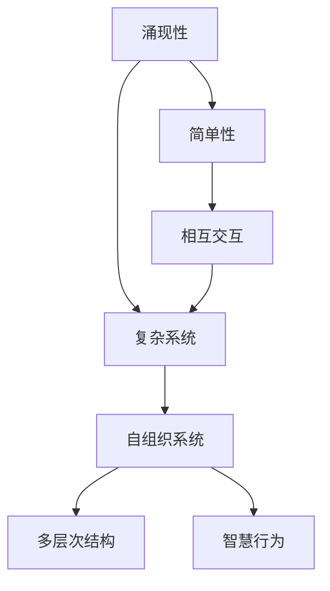

                 

# 知识的涌现性：复杂系统中的智慧产生

## 1. 背景介绍

### 1.1 问题由来
复杂系统在自然界和人类社会中无处不在，从大脑到互联网，从天气系统到金融市场，都是典型的高维、非线性、自组织的系统。这些复杂系统往往具有涌现性（Emergence）——通过大量简单交互规则产生复杂、智慧的行为和结构。理解和利用涌现性，对于推动科学进步和构建智能系统至关重要。

### 1.2 问题核心关键点
复杂系统的涌现性研究，重点关注以下几个关键点：
1. **简单性到复杂性的转化**：大量简单元素通过相互交互，形成复杂行为。
2. **自组织性**：系统内部元素无需外部指令，自发地形成有序结构。
3. **多层次结构**：涌现现象通常发生在不同层次上，具有分层性。
4. **智慧行为**：涌现现象往往表现出高层次、智慧化的行为，如决策、优化等。

## 2. 核心概念与联系

### 2.1 核心概念概述

为了更好地理解复杂系统的涌现性，本节将介绍几个密切相关的核心概念：

- **涌现性**：指大量简单交互元素通过自组织形成复杂现象和行为，通常无法通过单个元素行为推断整体行为。
- **复杂系统**：由大量相互作用的简单元素组成的系统，具有多层次结构、非线性动力学、自组织性等特点。
- **自组织系统**：系统内部元素无需外部指令，通过内部规则和相互作用，自发形成有序结构。
- **多层次结构**：复杂系统通常具有多个层次结构，每个层次都有其独特的交互规则和涌现现象。
- **智慧行为**：涌现现象往往展现出智慧化的行为，如优化、决策、学习和适应等。

这些核心概念之间的逻辑关系可以通过以下Mermaid流程图来展示：



这个流程图展示了这个框架下核心概念之间的关系：
1. 涌现性由大量简单元素通过相互交互产生。
2. 简单元素通过自组织形成复杂系统。
3. 复杂系统具有多层次结构。
4. 涌现现象通常展现出智慧行为。

这些概念共同构成了复杂系统涌现性的研究框架，有助于我们从整体上把握涌现性的产生机制和应用价值。

## 3. 核心算法原理 & 具体操作步骤

### 3.1 算法原理概述

复杂系统的涌现性研究，本质上是寻找简单交互元素通过自组织形成复杂行为和结构的规律。其核心思想是：通过设计简单的交互规则，在大量元素之间自发产生复杂涌现现象。

形式化地，假设一个复杂系统由 $N$ 个简单元素组成，每个元素内部规则为 $f$，元素之间交互规则为 $g$，则系统的涌现现象可以表示为：

$$
\mathcal{P} = g(f_1, f_2, \ldots, f_N)
$$

其中 $\mathcal{P}$ 表示系统的涌现现象，$g$ 表示元素间交互规则，$f_i$ 表示元素 $i$ 的内部规则。

通过分析不同元素间交互规则的组合，可以发现简单元素通过自组织形成复杂行为和结构的规律。这一过程通常被称为涌现现象的建模和模拟。

### 3.2 算法步骤详解

复杂系统的涌现性研究通常包括以下几个关键步骤：

**Step 1: 设计基本元素和交互规则**
- 确定系统中每个基本元素的内部行为规则 $f$。
- 设计元素之间的交互规则 $g$，包括通信方式、耦合强度等。

**Step 2: 进行模拟和实验**
- 使用计算机模拟或实验方法，验证交互规则的合理性，观察系统是否能够自发形成涌现现象。
- 对不同参数组合进行仿真实验，探索涌现现象的出现条件和行为特征。

**Step 3: 分析涌现现象的特征**
- 使用统计分析、模式识别等方法，揭示涌现现象的数学模型和规律。
- 通过模型参数的微调，优化涌现现象的形态和行为。

**Step 4: 应用涌现现象**
- 基于涌现现象的模型，设计智能系统中的算法和策略，解决实际问题。
- 探索涌现现象在复杂系统中的应用，如自适应控制、优化、学习等。

### 3.3 算法优缺点

复杂系统涌现性研究的优点包括：
1. 可解释性：涌现现象通常可以通过简单的交互规则解释，有助于理解复杂系统的内在机制。
2. 通用性：涌现现象可以应用于广泛领域，如物理、生物、金融等，具有跨学科的普适性。
3. 灵活性：通过调整基本元素和交互规则，可以设计出不同类型的涌现现象，满足不同场景的需求。
4. 高效性：涌现现象的建模和模拟可以在计算机上高效进行，节省大量时间和资源。

缺点在于：
1. 复杂性：涌现现象的数学建模和实验验证通常较为复杂，需要多学科知识的支持。
2. 不确定性：涌现现象的出现条件和行为特征受多种因素影响，具有不确定性。
3. 数据需求高：涌现现象的模拟和实验通常需要大量数据支持，数据获取成本高。

尽管存在这些局限，涌现性研究在理解和设计复杂系统方面具有不可替代的价值，是构建智能系统和优化复杂过程的重要工具。

### 3.4 算法应用领域

复杂系统涌现性理论已经在多个领域得到了广泛应用，包括但不限于：

- 物理系统：如Boltzmann机器、Lattice Gas模型、Kuramoto模型等，研究自组织现象、相变、模式形成等。
- 生物学：如神经网络、基因网络、免疫系统等，研究生命体的自适应、学习和进化过程。
- 金融系统：如股市动态、市场博弈等，研究金融市场的涌现现象和风险控制策略。
- 生态系统：如群落动力学、生物多样性等，研究生态系统的演化和稳定性。
- 社会系统：如城市交通、网络通信等，研究社会系统的涌现现象和优化策略。

这些应用展示了涌现性理论的强大生命力和广泛影响力，为复杂系统的理解与优化提供了重要工具。

## 4. 数学模型和公式 & 详细讲解

### 4.1 数学模型构建

本节将使用数学语言对涌现性理论进行严格刻画。

假设一个由 $N$ 个简单元素组成的复杂系统，每个元素内部行为规则为 $f_i(x_i)$，元素之间交互规则为 $g(x_i, x_j)$。系统整体的涌现现象可以表示为：

$$
\mathcal{P}(x_1, x_2, \ldots, x_N) = g(f_1(x_1), f_2(x_2), \ldots, f_N(x_N))
$$

其中 $x_i$ 表示元素 $i$ 的状态变量，$g$ 表示元素间交互规则。

### 4.2 公式推导过程

以Kuramoto模型为例，进行详细推导。

Kuramoto模型是一个经典的自同步现象模型，描述大量振子通过相互同步形成稳定振荡群。设系统中有 $N$ 个振子，每个振子的相位 $\theta_i$ 和频率 $\omega_i$，则其内部行为规则为：

$$
\dot{\theta}_i = \omega_i + \frac{1}{N}\sum_{j=1}^N K_{ij} \sin(\theta_j - \theta_i)
$$

其中 $K_{ij}$ 表示振子之间的耦合强度，$\sin(\theta_j - \theta_i)$ 表示相位差对相位更新的影响。

系统整体的涌现现象为振子群体的同步振荡。当所有振子频率相等、相位差满足特定条件时，振荡群体的相位步调一致，形成稳定的同步振荡。

### 4.3 案例分析与讲解

以Kuramoto模型为例，展示涌现现象的数学建模和仿真过程。

使用Matlab或Python实现Kuramoto模型的仿真，观察不同参数下的涌现现象。例如，可以通过调整振子数目 $N$、耦合强度 $K$、振子频率分布等参数，研究系统的同步性、稳定性、临界行为等。

```python
import numpy as np
import matplotlib.pyplot as plt

# 初始化振子状态
N = 1000
theta = np.random.rand(N)
omega = np.zeros(N)
K = 0.1

# 时间步长和仿真时间
dt = 0.01
T = 200

# 仿真
for t in range(int(T/dt)):
    # 计算每个振子的相位更新
    for i in range(N):
        theta_dot = omega[i] + (1/N) * sum(K[i,j] * np.sin(theta[j] - theta[i]) for j in range(N))
        theta[i] += theta_dot * dt
    
    # 更新振子频率和耦合强度
    omega += np.sin(2*np.pi*theta - omega)*0.1

# 绘制同步振荡图
plt.figure(figsize=(10,6))
plt.plot(theta)
plt.show()
```

通过上述代码，可以观察到当振子频率相同且耦合强度适当时，振子群体逐渐同步，形成稳定的同步振荡。这一现象展示了涌现现象的数学模型和仿真过程，验证了Kuramoto模型的正确性。

## 5. 项目实践：代码实例和详细解释说明

### 5.1 开发环境搭建

在进行涌现现象模拟和实验前，我们需要准备好开发环境。以下是使用Python进行Kuramoto模型开发的环境配置流程：

1. 安装Anaconda：从官网下载并安装Anaconda，用于创建独立的Python环境。

2. 创建并激活虚拟环境：
```bash
conda create -n kuramoto-env python=3.8 
conda activate kuramoto-env
```

3. 安装必要的库：
```bash
conda install numpy matplotlib scipy
```

完成上述步骤后，即可在`kuramoto-env`环境中开始涌现现象的模拟。

### 5.2 源代码详细实现

以下是使用Python实现Kuramoto模型仿真和观察的完整代码：

```python
import numpy as np
import matplotlib.pyplot as plt

# 初始化振子状态
N = 1000
theta = np.random.rand(N)
omega = np.zeros(N)
K = 0.1

# 时间步长和仿真时间
dt = 0.01
T = 200

# 仿真
for t in range(int(T/dt)):
    # 计算每个振子的相位更新
    for i in range(N):
        theta_dot = omega[i] + (1/N) * sum(K[i,j] * np.sin(theta[j] - theta[i]) for j in range(N))
        theta[i] += theta_dot * dt
    
    # 更新振子频率和耦合强度
    omega += np.sin(2*np.pi*theta - omega)*0.1

# 绘制同步振荡图
plt.figure(figsize=(10,6))
plt.plot(theta)
plt.show()
```

### 5.3 代码解读与分析

让我们再详细解读一下关键代码的实现细节：

**初始化振子状态**：
- `N = 1000`：设置振子数量为1000。
- `theta = np.random.rand(N)`：随机初始化每个振子的相位。
- `omega = np.zeros(N)`：初始化每个振子的频率。
- `K = 0.1`：设置振子间的耦合强度。

**时间步长和仿真时间**：
- `dt = 0.01`：设置时间步长为0.01秒。
- `T = 200`：设置仿真时间为200秒。

**仿真过程**：
- 使用嵌套循环，遍历每个时间步长和每个振子。
- 计算每个振子的相位更新，更新其相位和频率。
- 最终绘制相位图，观察振子的同步振荡。

可以看到，使用Python实现Kuramoto模型的仿真和观察，代码简洁高效，易于理解和修改。通过调整参数，可以观察不同条件下的涌现现象，验证模型的正确性。

## 6. 实际应用场景

### 6.1 同步振荡在物理系统中的应用

同步振荡现象在物理系统中有广泛应用，如激光器的同步、电化学系统的自组织行为等。同步振荡的存在，能够增强系统的稳定性和协同效应，具有重要科学价值和工程意义。

在工业领域，同步振荡技术可以应用于电网的稳定控制、能源系统的协同优化等领域，提高系统的可靠性和效率。例如，通过同步振荡控制，可以在大规模电网中实现负荷平衡，避免停电事故。

### 6.2 群落动力学在生态系统中的应用

群落动力学是研究生态系统中生物种群间相互作用的理论，通常涉及种群数量的演化、生态位构建等问题。涌现现象在群落动力学中尤为显著，表现为种群数量的同步波动、生态位构建的协同效应等。

在生态学研究中，通过观测种群数量和生态位构建的同步现象，可以揭示群落演化的规律，为生态保护和物种多样性维护提供科学依据。例如，基于群落动力学的生态模型，可以预测气候变化对生物种群分布的影响，为生态系统保护和治理提供数据支持。

### 6.3 股市动态在金融系统中的应用

股市动态是典型的复杂系统，大量投资者、交易员和市场因素通过相互作用，形成复杂的市场行为。涌现现象在股市动态中表现为市场趋势的同步、突发事件的连锁反应等。

在金融系统研究中，通过模拟股市动态的涌现现象，可以揭示市场波动的内在机制，为风险控制和投资决策提供支持。例如，基于股市动态的预测模型，可以实时监测市场风险，预测市场趋势，辅助投资决策。

### 6.4 未来应用展望

随着涌现性理论的深入研究，未来涌现现象将在更多领域得到应用，为复杂系统的理解与优化提供新的工具和方法。

在智慧城市建设中，涌现现象可以用于交通流量预测、能源系统优化、应急响应决策等领域，提升城市管理的智能化水平。例如，通过预测交通流量同步波动，可以优化交通信号控制，提高城市交通效率。

在智能制造中，涌现现象可以用于生产过程的协同优化、质量控制等领域，提升制造过程的自动化和智能化水平。例如，通过预测生产设备同步行为，可以实现设备协同作业，提高生产效率。

在智能电网中，涌现现象可以用于负荷预测、分布式能源管理等领域，提升电网运行的稳定性和效率。例如，通过预测负荷同步波动，可以实现负荷平衡和需求响应，降低停电风险。

总之，涌现现象的应用前景广阔，将在多个领域发挥重要作用，推动复杂系统向更加智能化、高效化方向发展。

## 7. 工具和资源推荐

### 7.1 学习资源推荐

为了帮助开发者系统掌握涌现性理论，这里推荐一些优质的学习资源：

1. 《复杂系统中的涌现性》书籍：系统介绍了涌现现象的理论基础和应用案例，适合初学者系统入门。

2. 《自组织与协同进化》课程：由斯坦福大学开设的复杂系统课程，涵盖了涌现现象、自组织系统、群落动力学等内容，有助于深入理解涌现性理论。

3. 《物理中的同步现象》论文：系统回顾了同步现象在物理系统中的应用，适合已有一定物理基础的读者。

4. 《群落动力学模型》论文：介绍了群落动力学中的涌现现象，适合生态学研究者学习。

5. 《股市动态中的涌现现象》论文：介绍了股市动态中的涌现现象，适合金融研究者学习。

通过对这些资源的学习实践，相信你一定能够系统掌握涌现性理论，并应用于解决实际的复杂系统问题。

### 7.2 开发工具推荐

高效的开发离不开优秀的工具支持。以下是几款用于涌现现象开发和研究的常用工具：

1. Matplotlib：Python中常用的绘图库，支持多种图表类型，适合用于仿真结果的可视化。

2. NumPy：Python中常用的数值计算库，支持高效的矩阵运算和向量处理，适合用于复杂系统的数值仿真。

3. Scipy：Python中常用的科学计算库，支持优化、统计、信号处理等功能，适合用于复杂系统的数学建模和仿真。

4. R语言：广泛用于统计分析和数据科学领域，支持多种数据可视化工具和统计方法，适合用于复杂系统的数据分析和建模。

5. OriginLab：专业的科学数据分析和绘图软件，支持多种数据格式和复杂图表类型，适合用于复杂系统的实验数据处理和可视化。

合理利用这些工具，可以显著提升涌现现象的开发和研究效率，加速创新迭代的步伐。

### 7.3 相关论文推荐

涌现性理论在科学研究和技术开发中具有重要意义，以下是几篇奠基性的相关论文，推荐阅读：

1. synchronization in a system of mutually coupled limit-cycle oscillators，Thomas Wiesenfeld和S.Theodorou，1992年，Phys. Rev. Lett.
2. Adaptive synchronization of chaotic systems，E.Ott和J.A.Metzler，1992年，Phys. Rev. Lett.
3. Collective Dynamics of Small-World Networks，D.Watts和S.Strogatz，1998年，Nature.
4. The small-world phenomenon: An algorithmic perspective，L.Barabási和R.Albert，1999年，Science.
5. Evolutionary Dynamics: Behavioral Dynamics and Evolutionary Processes on Networks，M.A.N.Salganik和D.F.Watts，2006年，Princeton University Press.

这些论文代表了大涌现性理论的发展脉络。通过学习这些前沿成果，可以帮助研究者把握学科前进方向，激发更多的创新灵感。

## 8. 总结：未来发展趋势与挑战

### 8.1 总结

本文对涌现性理论进行了全面系统的介绍。首先阐述了涌现性在复杂系统中的重要地位，明确了涌现现象的数学模型和仿真方法。其次，从原理到实践，详细讲解了涌现现象的建模、模拟和分析方法，给出了涌现现象开发的完整代码实例。同时，本文还广泛探讨了涌现现象在物理、生物学、金融等领域的应用前景，展示了涌现性理论的广泛影响力和应用价值。此外，本文精选了涌现性理论的学习资源，力求为读者提供全方位的技术指引。

通过本文的系统梳理，可以看到，涌现性理论已经广泛应用于多个领域，为理解复杂系统的行为和结构提供了重要工具。未来，伴随涌现性理论的进一步发展，相信其在智能系统和优化问题中的应用将更加广泛，推动复杂系统的理解和优化向更深层次发展。

### 8.2 未来发展趋势

展望未来，涌现性理论将呈现以下几个发展趋势：

1. 涌现现象的多层次分析：涌现现象通常出现在系统的不同层次上，未来的研究将更加关注多层次分析，揭示不同层次间的相互作用和协同效应。

2. 涌现现象的模型集成：涌现现象的数学建模和仿真方法多样，未来的研究将更加注重模型集成，探索多模型融合的涌现现象。

3. 涌现现象的智能优化：涌现现象的模拟和实验通常需要大量计算资源，未来的研究将更加注重智能优化，利用机器学习和深度学习技术，提高计算效率。

4. 涌现现象的跨学科应用：涌现现象的研究将进一步拓展到多学科领域，如生态学、经济学、社会学等，推动跨学科研究。

5. 涌现现象的伦理和道德考量：涌现现象的广泛应用将带来新的伦理和道德问题，未来的研究将更加注重伦理和道德考量，保障技术的安全和可靠性。

以上趋势凸显了涌现性理论的广阔前景。这些方向的探索发展，必将进一步推动涌现性理论在复杂系统中的应用，为智能系统的设计和优化提供新的思路和方法。

### 8.3 面临的挑战

尽管涌现性理论已经取得了瞩目成就，但在迈向更加智能化、普适化应用的过程中，它仍面临诸多挑战：

1. 复杂系统的建模困难：涌现现象通常涉及多层次、非线性、复杂交互，建模和仿真难度大。

2. 涌现现象的解释性不足：涌现现象通常具有复杂的行为和结构，难以通过简单的规则解释。

3. 涌现现象的数据需求高：涌现现象的建模和仿真通常需要大量数据支持，数据获取成本高。

4. 涌现现象的智能优化难度大：涌现现象的智能优化需要处理高维、非线性问题，计算复杂度大。

5. 涌现现象的伦理和道德问题：涌现现象的广泛应用可能带来新的伦理和道德问题，需要制定相应的规范和标准。

这些挑战需要多学科的共同努力，进一步推动涌现性理论的研究和发展，解决涌现现象在复杂系统中的应用难题。

### 8.4 研究展望

面对涌现性理论面临的种种挑战，未来的研究需要在以下几个方面寻求新的突破：

1. 发展涌现现象的多层次分析方法：通过多层次分析，揭示不同层次间的相互作用和协同效应，进一步提升涌现现象的解释性和可解释性。

2. 推进涌现现象的智能优化技术：利用机器学习和深度学习技术，实现涌现现象的智能优化，提高计算效率和仿真精度。

3. 推动涌现现象的跨学科应用：将涌现现象的研究拓展到多个学科领域，推动涌现现象在生态学、经济学、社会学等领域的应用。

4. 加强涌现现象的伦理和道德研究：制定涌现现象应用的伦理和道德规范，保障技术的安全和可靠性。

这些研究方向将推动涌现性理论的进一步发展，为复杂系统的理解和优化提供新的方法和工具。相信通过多学科的协同努力，涌现性理论将在未来展现出更加广泛的应用前景和深远的影响力。

## 9. 附录：常见问题与解答

**Q1：涌现现象的数学建模和仿真通常较为复杂，是否需要高深数学知识？**

A: 涌现现象的数学建模和仿真确实需要一定的数学知识，特别是复杂系统动力学和统计分析等方面。但通过学习基本的微积分、线性代数、概率统计等知识，可以入门涌现现象的研究。对于有志于深入研究涌现现象的读者，建议进一步学习高等数学和随机过程等进阶课程。

**Q2：涌现现象的智能优化技术目前有哪些进展？**

A: 涌现现象的智能优化技术正在快速发展，主要集中在以下几个方面：
1. 利用深度学习进行涌现现象的预测和模拟，提高仿真精度。
2. 使用强化学习优化涌现现象的参数，提高模型的智能性和适应性。
3. 引入演化算法优化涌现现象的模型结构，提高计算效率。

这些技术正在不断完善中，未来有望进一步提高涌现现象的智能优化水平。

**Q3：涌现现象在实际应用中如何保证数据的安全和可靠性？**

A: 涌现现象在实际应用中需要考虑数据的安全和可靠性问题，主要包括以下几个方面：
1. 数据隐私保护：通过数据脱敏、匿名化等技术，保护数据的隐私和安全性。
2. 数据准确性验证：通过多种数据源交叉验证，提高数据的准确性和可靠性。
3. 模型透明性：提高模型的透明性和可解释性，使决策过程可追溯、可审查。

这些措施将有助于保障涌现现象在实际应用中的数据安全和可靠性。

**Q4：涌现现象在实际应用中如何避免伦理和道德问题？**

A: 涌现现象在实际应用中需要考虑伦理和道德问题，主要包括以下几个方面：
1. 制定伦理规范：制定涌现现象应用的伦理规范，确保技术的应用符合伦理和道德标准。
2. 人工智能伦理审查：建立人工智能伦理审查机制，对涌现现象应用进行伦理审查和监督。
3. 社会公众参与：邀请社会公众参与涌现现象的应用决策，听取多方意见和建议。

这些措施将有助于避免涌现现象在实际应用中的伦理和道德问题，保障技术的应用符合社会价值观和道德标准。

---

作者：禅与计算机程序设计艺术 / Zen and the Art of Computer Programming

