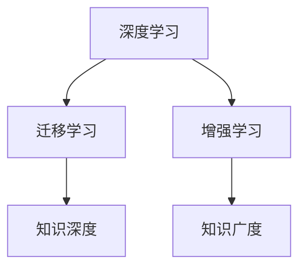

                 

# 知识的深度与广度：全面发展的重要性

在信息技术高速发展的今天，知识的深度与广度已经成为推动技术进步和社会发展的关键因素。本文旨在全面探讨知识的深度与广度在人工智能(AI)领域的应用和发展，强调两者在知识获取、处理和应用中的互补作用，并提出一些关于全面发展的重要见解。

## 1. 背景介绍

### 1.1 知识在AI领域的双重价值

人工智能，作为当前科技创新的重要前沿，在医学、金融、教育、交通等多个领域展现出了巨大潜力。知识的深度与广度，是AI技术发展的基础。知识的深度，强调对某一特定领域的深入理解；知识的广度，强调对多领域的综合掌握。只有深度和广度相结合，才能构建起全面、智能的AI系统。

### 1.2 知识深度与广度在AI领域的应用

1. **深度学习**：
   深度学习利用大量数据和复杂网络结构，可以处理复杂模式和关系，实现对知识深度的探索和挖掘。例如，通过大规模语料库训练的语言模型，可以深入理解自然语言的语法、语义和上下文，提高自然语言处理(NLP)任务的准确性。

2. **迁移学习**：
   迁移学习强调在多领域之间的知识共享和迁移，通过已学习的知识在新任务上应用，可以拓展知识的广度。例如，预训练大模型可以在不同任务之间进行迁移微调，提高模型在不同领域上的泛化能力。

3. **增强学习**：
   增强学习通过与环境的互动，不断积累经验，实现对复杂环境的理解和适应。增强学习中的知识深度体现在对特定任务的学习，而知识的广度则体现在与多种环境策略的交互中。

## 2. 核心概念与联系

### 2.1 核心概念概述

为更好地理解知识深度与广度在AI领域的应用，本节将介绍几个密切相关的核心概念：

- **知识深度**：对特定领域的深入理解和掌握，往往涉及专业知识、技术细节、应用场景等方面的细致研究。例如，机器学习领域的深度神经网络结构设计、模型训练算法等。

- **知识广度**：对多个领域或行业的广泛认知和理解，强调跨学科的融合与协作。例如，AI在金融、医疗、教育等领域的交叉应用，涉及多个学科的知识整合和应用。

- **深度学习**：一种基于多层神经网络的机器学习方法，能够处理复杂模式和关系，实现对知识深度的探索。

- **迁移学习**：通过将一个领域学到的知识迁移到另一个领域，提高模型的泛化能力，拓展知识的广度。

- **增强学习**：通过与环境的互动，不断积累经验，实现对复杂环境的理解和适应。

这些核心概念之间的逻辑关系可以通过以下Mermaid流程图来展示：



这个流程图展示了一个知识深度与广度在AI领域中的基本框架：

1. 深度学习是探索知识深度的重要手段。
2. 迁移学习则通过将深度学习中获得的知识迁移到新领域，拓展知识的广度。
3. 增强学习通过与环境的互动，积累经验，进一步提升模型的深度和广度。

## 3. 核心算法原理 & 具体操作步骤

### 3.1 算法原理概述

AI领域中，知识深度与广度的探索和发展，涉及多方面的算法和工具。以下将详细介绍其中的关键算法及其原理。

#### 3.1.1 深度学习算法原理

深度学习算法利用多层神经网络结构，通过反向传播算法进行模型优化，实现对复杂模式的探索和处理。以卷积神经网络(CNN)为例，通过卷积层、池化层等组件，可以从输入数据中提取关键特征，实现对图像、视频等数据的深度理解。

#### 3.1.2 迁移学习算法原理

迁移学习通过在不同领域之间的知识共享，提高模型的泛化能力。其核心思想是在预训练模型的基础上，针对新任务的特定需求，进行微调或部分层级调整。例如，在大规模语料库上预训练的语言模型，可以在多个NLP任务中进行迁移微调，提升模型在新任务上的性能。

#### 3.1.3 增强学习算法原理

增强学习通过与环境的互动，不断积累经验，实现对复杂环境的理解和适应。其核心算法包括Q-learning、SARSA等，通过奖励机制引导模型学习最优策略。例如，在自动驾驶领域，增强学习可以训练车辆在不同路况下的驾驶策略，实现对复杂环境的适应。

### 3.2 算法步骤详解

#### 3.2.1 深度学习算法步骤

1. **数据准备**：收集并清洗数据集，准备用于模型训练。
2. **模型设计**：选择合适的神经网络结构，设计网络层、激活函数等。
3. **模型训练**：使用反向传播算法，优化模型参数。
4. **模型评估**：在验证集上评估模型性能，调整超参数。
5. **模型应用**：在测试集上测试模型，进行实际应用。

#### 3.2.2 迁移学习算法步骤

1. **预训练模型选择**：选择合适的预训练模型作为初始化参数。
2. **微调设计**：设计微调目标函数，选择合适的损失函数和优化器。
3. **微调训练**：在目标数据集上进行微调，更新模型参数。
4. **模型评估**：在验证集和测试集上评估微调后的模型性能。
5. **模型应用**：在实际应用场景中，使用微调后的模型进行推理和预测。

#### 3.2.3 增强学习算法步骤

1. **环境设计**：定义任务环境和奖励机制。
2. **模型设计**：选择合适的Q-learning或SARSA等算法，设计状态、动作和奖励函数。
3. **训练迭代**：通过与环境的互动，不断迭代训练，积累经验。
4. **策略优化**：优化策略参数，提高模型性能。
5. **模型应用**：在实际环境中，应用优化后的策略，实现自动决策。

### 3.3 算法优缺点

#### 3.3.1 深度学习算法优缺点

- **优点**：
  - 能处理复杂模式，实现对知识深度的探索。
  - 数据驱动，通过大量数据训练，可获得高精度模型。

- **缺点**：
  - 需要大量数据和计算资源，训练时间长。
  - 模型复杂，难以解释，存在过拟合风险。

#### 3.3.2 迁移学习算法优缺点

- **优点**：
  - 利用已有知识，减少训练时间和资源消耗。
  - 提高模型的泛化能力，拓展知识广度。

- **缺点**：
  - 微调参数对预训练模型影响较大，可能导致知识丢失。
  - 需要考虑目标领域和预训练领域之间的知识差距。

#### 3.3.3 增强学习算法优缺点

- **优点**：
  - 通过与环境的互动，积累经验，实现对复杂环境的理解和适应。
  - 可自适应，根据环境变化调整策略。

- **缺点**：
  - 训练过程复杂，需要大量时间和数据。
  - 依赖于奖励机制设计，对复杂任务难以建模。

### 3.4 算法应用领域

知识深度与广度在AI领域的应用非常广泛，以下是几个典型的应用场景：

1. **自然语言处理(NLP)**：
   深度学习在NLP中的应用，如语言模型、情感分析、机器翻译等，通过深度学习算法实现对语言深度的理解。

2. **计算机视觉(CV)**：
   深度学习在图像识别、目标检测、图像生成等任务中，通过卷积神经网络实现对图像深度的理解。

3. **机器人学**：
   增强学习在机器人控制、路径规划、物体抓取等任务中，通过与环境的互动，实现对复杂环境的适应。

4. **推荐系统**：
   迁移学习在推荐系统中的应用，通过已有用户行为数据，在不同用户群体之间进行迁移微调，提高推荐效果。

5. **金融预测**：
   深度学习在金融领域的应用，如时间序列预测、风险评估等，通过深度学习算法实现对金融数据的深度理解。

6. **医疗诊断**：
   深度学习在医疗影像分析、病理学诊断等任务中，通过卷积神经网络实现对医疗数据的深度理解。

## 4. 数学模型和公式 & 详细讲解 & 举例说明

### 4.1 数学模型构建

深度学习模型的核心在于神经网络结构的设计，以下以卷积神经网络(CNN)为例，介绍其数学模型构建和推导过程。

#### 4.1.1 CNN模型结构

CNN由卷积层、池化层、全连接层等组成，其数学模型可以表示为：

$$
f_{CNN}(x) = h \circ f_{P} \circ f_{C} \circ f_{W}(x)
$$

其中：
- $f_{W}(x)$：卷积层，提取特征图；
- $f_{C}(x)$：池化层，降维压缩；
- $f_{P}(x)$：全连接层，输出预测结果；
- $h$：激活函数。

#### 4.1.2 CNN的训练目标

训练CNN模型的目标是最小化损失函数，通常采用交叉熵损失函数，其形式为：

$$
\mathcal{L} = -\frac{1}{N}\sum_{i=1}^N \sum_{j=1}^C y_{ij}\log (p_{ij})
$$

其中：
- $N$：样本数；
- $C$：类别数；
- $y_{ij}$：样本$x_i$属于类别$j$的概率；
- $p_{ij}$：模型预测样本$x_i$属于类别$j$的概率。

#### 4.1.3 损失函数的梯度计算

通过反向传播算法，计算损失函数对模型参数的梯度，具体如下：

$$
\frac{\partial \mathcal{L}}{\partial \theta} = -\frac{1}{N}\sum_{i=1}^N \frac{1}{M}\sum_{j=1}^C (y_{ij} - p_{ij}) \frac{\partial p_{ij}}{\partial \theta}
$$

其中：
- $\theta$：模型参数；
- $M$：训练样本数；
- $\frac{\partial p_{ij}}{\partial \theta}$：预测概率对模型参数的梯度，可通过链式法则计算。

### 4.2 公式推导过程

以下以CNN模型的训练目标函数为例，推导其梯度计算公式。

假设CNN模型由$L$个卷积层和$H$个全连接层组成，输入数据为$x$，输出为$y$。假设卷积层的参数为$\theta_{conv}$，全连接层的参数为$\theta_{fc}$，则模型的输出为：

$$
f(x) = f_{fc} \circ f_{H} \circ \dots \circ f_{P} \circ f_{C} \circ f_{W}(x)
$$

其中$f_{P}$和$f_{C}$分别代表全连接层和池化层，$f_{W}$和$f_{C}$分别代表卷积层和池化层。

在损失函数$\mathcal{L}$的基础上，计算梯度$\frac{\partial \mathcal{L}}{\partial \theta_{conv}}$和$\frac{\partial \mathcal{L}}{\partial \theta_{fc}}$，具体推导如下：

1. **全连接层梯度计算**：

$$
\frac{\partial \mathcal{L}}{\partial \theta_{fc}} = -\frac{1}{N}\sum_{i=1}^N \sum_{j=1}^C y_{ij} \frac{\partial p_{ij}}{\partial \theta_{fc}}
$$

其中：
- $p_{ij}$：模型预测样本$x_i$属于类别$j$的概率。

2. **卷积层梯度计算**：

$$
\frac{\partial \mathcal{L}}{\partial \theta_{conv}} = \frac{\partial \mathcal{L}}{\partial z_{H+1}} \frac{\partial z_{H+1}}{\partial h_{H+1}} \frac{\partial h_{H+1}}{\partial z_{H}} \dots \frac{\partial z_2}{\partial h_2} \frac{\partial h_2}{\partial z_1} \frac{\partial z_1}{\partial x}
$$

其中$z_l$和$h_l$分别表示卷积层的卷积结果和激活函数输出。

通过上述推导，可以计算出卷积神经网络模型在训练过程中的梯度，进而更新模型参数，实现对知识深度的探索和挖掘。

### 4.3 案例分析与讲解

#### 4.3.1 CNN在图像分类中的应用

假设有一张$28 \times 28$的图像，使用CNN模型进行分类。模型的卷积层和全连接层的参数分别为$\theta_{conv}$和$\theta_{fc}$，损失函数为交叉熵损失函数。

1. **数据准备**：收集图像数据，进行预处理和归一化。

2. **模型训练**：
   - 输入图像$x$，通过卷积层$f_{conv}(x)$提取特征图$z_1$。
   - 将特征图$z_1$送入全连接层$f_{fc}(z_1)$，输出预测结果$p$。
   - 计算损失函数$\mathcal{L}$，并计算梯度$\frac{\partial \mathcal{L}}{\partial \theta_{conv}}$和$\frac{\partial \mathcal{L}}{\partial \theta_{fc}}$。
   - 使用优化器，如Adam，更新模型参数$\theta_{conv}$和$\theta_{fc}$。

3. **模型评估**：在测试集上评估模型性能，计算准确率等指标。

4. **模型应用**：使用训练好的模型，对新图像进行分类。

通过上述步骤，CNN模型可以有效地从图像数据中提取关键特征，实现对图像深度的理解，进而提高图像分类任务的准确率。

## 5. 项目实践：代码实例和详细解释说明

### 5.1 开发环境搭建

为了实现CNN模型的训练和测试，我们需要搭建开发环境。以下是使用Python进行PyTorch开发的环境配置流程：

1. 安装Anaconda：从官网下载并安装Anaconda，用于创建独立的Python环境。

2. 创建并激活虚拟环境：
```bash
conda create -n cnn-env python=3.8 
conda activate cnn-env
```

3. 安装PyTorch：根据CUDA版本，从官网获取对应的安装命令。例如：
```bash
conda install pytorch torchvision torchaudio cudatoolkit=11.1 -c pytorch -c conda-forge
```

4. 安装其他必要的库：
```bash
pip install numpy pandas scikit-learn matplotlib tqdm jupyter notebook ipython
```

完成上述步骤后，即可在`cnn-env`环境中开始项目实践。

### 5.2 源代码详细实现

接下来，我们将通过一个简单的图像分类项目，详细实现CNN模型的训练和测试。

```python
import torch
import torch.nn as nn
import torch.optim as optim
import torchvision.transforms as transforms
from torchvision.datasets import CIFAR10
from torch.utils.data import DataLoader

# 定义CNN模型
class CNNModel(nn.Module):
    def __init__(self):
        super(CNNModel, self).__init__()
        self.conv1 = nn.Conv2d(3, 32, kernel_size=3, stride=1, padding=1)
        self.relu1 = nn.ReLU()
        self.pool1 = nn.MaxPool2d(kernel_size=2, stride=2)
        self.conv2 = nn.Conv2d(32, 64, kernel_size=3, stride=1, padding=1)
        self.relu2 = nn.ReLU()
        self.pool2 = nn.MaxPool2d(kernel_size=2, stride=2)
        self.fc1 = nn.Linear(64 * 4 * 4, 128)
        self.relu3 = nn.ReLU()
        self.fc2 = nn.Linear(128, 10)
        self.softmax = nn.Softmax(dim=1)
        
    def forward(self, x):
        x = self.conv1(x)
        x = self.relu1(x)
        x = self.pool1(x)
        x = self.conv2(x)
        x = self.relu2(x)
        x = self.pool2(x)
        x = x.view(-1, 64 * 4 * 4)
        x = self.fc1(x)
        x = self.relu3(x)
        x = self.fc2(x)
        x = self.softmax(x)
        return x

# 数据准备
transform = transforms.Compose([
    transforms.ToTensor(),
    transforms.Normalize((0.5, 0.5, 0.5), (0.5, 0.5, 0.5))
])

train_dataset = CIFAR10(root='data', train=True, download=True, transform=transform)
test_dataset = CIFAR10(root='data', train=False, download=True, transform=transform)
train_loader = DataLoader(train_dataset, batch_size=32, shuffle=True)
test_loader = DataLoader(test_dataset, batch_size=32, shuffle=False)

# 定义模型和优化器
model = CNNModel()
optimizer = optim.Adam(model.parameters(), lr=0.001)
criterion = nn.CrossEntropyLoss()

# 训练模型
device = torch.device('cuda' if torch.cuda.is_available() else 'cpu')
model.to(device)

def train_epoch(model, data_loader, optimizer, criterion):
    model.train()
    total_loss = 0
    for batch_idx, (data, target) in enumerate(train_loader):
        data, target = data.to(device), target.to(device)
        optimizer.zero_grad()
        output = model(data)
        loss = criterion(output, target)
        loss.backward()
        optimizer.step()
        total_loss += loss.item()
    return total_loss / len(train_loader)

def test_model(model, data_loader, criterion):
    model.eval()
    total_loss = 0
    correct = 0
    with torch.no_grad():
        for batch_idx, (data, target) in enumerate(test_loader):
            data, target = data.to(device), target.to(device)
            output = model(data)
            loss = criterion(output, target)
            total_loss += loss.item()
            _, pred = torch.max(output, 1)
            correct += pred.eq(target).sum().item()
    accuracy = correct / len(test_loader.dataset)
    print(f'Test Loss: {total_loss / len(test_loader):.4f} Acc: {accuracy:.4f}')

# 训练和测试
epochs = 10

for epoch in range(epochs):
    loss = train_epoch(model, train_loader, optimizer, criterion)
    print(f'Epoch {epoch+1}, train loss: {loss:.3f}')
    
    test_model(model, test_loader, criterion)

print('Test results:')
test_model(model, test_loader, criterion)
```

### 5.3 代码解读与分析

这段代码实现了CNN模型在CIFAR-10数据集上的训练和测试，下面我们详细解读关键代码的实现细节：

**CNNModel类**：
- `__init__`方法：初始化卷积层、激活函数、池化层和全连接层等组件。
- `forward`方法：定义前向传播过程，通过卷积、激活、池化等操作，将输入数据映射到输出结果。

**数据准备**：
- 使用`torchvision.transforms.Compose`将数据转换为Tensor并进行归一化。
- 使用`CIFAR10`数据集，将训练集和测试集分别加载到`train_loader`和`test_loader`中。

**模型训练**：
- 在训练集上进行前向传播和反向传播，计算损失函数并更新模型参数。
- 在测试集上计算损失函数和准确率，评估模型性能。

通过上述代码，我们可以看到，使用PyTorch实现CNN模型的训练和测试，是非常简洁和高效的。这得益于PyTorch强大的API设计和自动微分能力，使得模型构建和优化过程非常直观和易于实现。

## 6. 实际应用场景

### 6.1 图像识别

在图像识别领域，CNN模型被广泛应用于物体检测、人脸识别、图像分类等任务。通过在大规模图像数据集上进行预训练，CNN模型可以学习到丰富的视觉特征，实现对图像深度的探索和理解。例如，在医学影像分析中，通过CNN模型可以识别肿瘤、病变等异常区域，辅助医生进行诊断。

### 6.2 自然语言处理(NLP)

在NLP领域，深度学习被广泛应用于语言模型、文本分类、情感分析等任务。通过在大规模文本语料库上进行预训练，语言模型可以学习到丰富的语言知识，实现对语言深度的探索和理解。例如，在机器翻译任务中，通过预训练语言模型进行微调，可以提升翻译的准确性和流畅度。

### 6.3 机器人学

在机器人学领域，增强学习被广泛应用于路径规划、物体抓取等任务。通过与环境的互动，增强学习可以积累经验，实现对复杂环境的理解和适应。例如，在自动驾驶中，通过增强学习，车辆可以学习如何在不同路况下行驶，实现对复杂环境的适应。

## 7. 工具和资源推荐

### 7.1 学习资源推荐

为了帮助开发者系统掌握深度学习和迁移学习技术，这里推荐一些优质的学习资源：

1. **深度学习与机器学习课程**：斯坦福大学提供的《CS231n: 卷积神经网络和视觉识别》课程，系统讲解了卷积神经网络的结构和应用。

2. **自然语言处理(NLP)课程**：斯坦福大学提供的《CS224N: 自然语言处理与深度学习》课程，介绍了NLP中的深度学习技术，包括语言模型、文本分类、机器翻译等。

3. **TensorFlow官方文档**：TensorFlow提供了详细的API文档和教程，帮助开发者快速上手实现深度学习模型。

4. **PyTorch官方文档**：PyTorch提供了完整的API文档和教程，适用于各种深度学习模型的实现。

5. **GitHub上的开源项目**：通过GitHub上的深度学习项目，可以快速了解最新的研究进展和技术应用。

### 7.2 开发工具推荐

以下是几款用于深度学习和迁移学习开发的常用工具：

1. **TensorFlow**：由Google主导开发的开源深度学习框架，支持多种硬件加速。
2. **PyTorch**：由Facebook主导开发的开源深度学习框架，适用于科研和产业应用。
3. **MXNet**：由Apache开发的深度学习框架，支持多种编程语言和硬件平台。
4. **Keras**：基于TensorFlow和Theano的高级深度学习API，适用于快速原型设计和应用开发。
5. **JAX**：Google开发的深度学习框架，支持动态图和静态图模式，适用于科研和生产部署。

### 7.3 相关论文推荐

深度学习和迁移学习领域的研究不断进展，以下是几篇经典论文，推荐阅读：

1. **ImageNet Classification with Deep Convolutional Neural Networks**：Hinton等人提出的卷积神经网络模型，在ImageNet数据集上取得了SOTA性能。

2. **Convolutional Neural Networks for Sentence Classification**：Kim提出的卷积神经网络在文本分类任务上的应用，展示了其在NLP任务中的高效性。

3. **Fast R-CNN**：Ren等人提出的基于区域卷积神经网络的物体检测算法，显著提升了检测速度和准确率。

4. **BERT: Pre-training of Deep Bidirectional Transformers for Language Understanding**：Devlin等人提出的BERT语言模型，在多个NLP任务上取得了SOTA性能。

5. **Adversarial Machine Learning**：Biggio等人研究了对抗攻击在深度学习中的应用，探讨了如何增强模型的鲁棒性。

这些论文代表了大规模深度学习模型的发展脉络，是了解深度学习和迁移学习技术的重要参考资料。

## 8. 总结：未来发展趋势与挑战

### 8.1 研究成果总结

本文详细介绍了深度学习和迁移学习在知识深度与广度方面的应用和发展，强调了两者在AI领域的互补作用。深度学习通过多层神经网络实现对知识深度的探索，迁移学习通过知识共享实现对知识广度的拓展。这些技术的发展和应用，为AI领域的众多任务提供了强大的支持，推动了AI技术在各行业中的广泛应用。

### 8.2 未来发展趋势

未来，深度学习和迁移学习将继续在AI领域中发挥重要作用，呈现出以下几个发展趋势：

1. **多模态学习**：结合视觉、语音、文本等多种数据类型，实现更加全面和丰富的模型训练。
2. **自适应学习**：通过在线学习、增强学习等方法，实现模型在动态环境中的自适应更新。
3. **联邦学习**：通过分布式协同训练，提升模型的泛化能力和安全性。
4. **知识图谱与深度学习结合**：将知识图谱与深度学习技术结合，构建更全面、精准的知识表示模型。
5. **跨领域知识迁移**：通过跨领域知识迁移，实现多领域间的知识共享和协同，提升模型的泛化能力。

### 8.3 面临的挑战

尽管深度学习和迁移学习在AI领域中取得了显著进展，但也面临着诸多挑战：

1. **数据稀缺**：许多领域缺乏大规模标注数据，限制了深度学习和迁移学习的应用。
2. **模型复杂度**：深度学习模型结构复杂，训练和推理效率较低，需要优化算法和技术手段。
3. **鲁棒性和安全性**：深度学习模型容易受到对抗攻击，需要提高模型的鲁棒性和安全性。
4. **解释性和透明性**：深度学习模型通常被认为是“黑盒”，难以解释其决策过程，需要提高模型的透明性和可解释性。
5. **伦理和社会责任**：深度学习模型可能带来偏见和不公平，需要关注伦理和社会责任，确保模型的公平性和公正性。

### 8.4 研究展望

面对未来发展趋势和挑战，未来的研究需要在以下几个方面寻求新的突破：

1. **数据增强与生成**：通过数据增强和生成对抗网络等技术，提升数据量和多样性，缓解数据稀缺问题。
2. **模型压缩与优化**：通过模型压缩和优化算法，提高模型的推理速度和效率，降低计算资源消耗。
3. **自适应学习算法**：研究自适应学习算法，提高模型的自适应能力和泛化能力，应对动态环境变化。
4. **跨领域知识迁移**：通过跨领域知识迁移，提升模型在不同领域间的泛化能力和适应性。
5. **知识图谱与深度学习结合**：将知识图谱与深度学习技术结合，构建更全面、精准的知识表示模型，提升模型对复杂环境理解和适应的能力。

通过这些研究方向和突破，深度学习和迁移学习技术将进一步推动AI领域的发展，为人类社会带来更多的创新和变革。

## 9. 附录：常见问题与解答

**Q1：深度学习模型如何避免过拟合？**

A: 深度学习模型容易出现过拟合，可以通过以下方法避免：
1. **数据增强**：通过数据扩充、变换等方法，增加数据量和多样性。
2. **正则化**：使用L2正则、Dropout等技术，限制模型复杂度，防止过拟合。
3. **早停策略**：在验证集上监控模型性能，当性能不再提升时，停止训练，避免过拟合。
4. **批量归一化**：通过批量归一化技术，加速模型收敛，防止过拟合。

**Q2：迁移学习在跨领域应用中需要注意哪些问题？**

A: 迁移学习在跨领域应用中需要注意以下几点：
1. **领域适应性**：确保预训练模型与目标领域的数据分布一致，避免知识迁移过程中的偏差。
2. **知识融合**：合理融合预训练模型和目标领域的知识，避免知识和能力的冲突和冲突。
3. **微调策略**：根据目标领域的特点，设计合理的微调策略，调整模型参数，提升模型性能。

**Q3：增强学习在实际应用中需要注意哪些问题？**

A: 增强学习在实际应用中需要注意以下几点：
1. **奖励设计**：设计合适的奖励机制，引导模型学习最优策略。
2. **探索与利用**：平衡探索和利用，避免陷入局部最优解。
3. **模型稳定性**：增强学习模型容易受到环境变化的影响，需要提高模型的鲁棒性和稳定性。
4. **计算资源**：增强学习模型计算复杂度高，需要合理分配计算资源，提高训练效率。

通过合理应对这些挑战，深度学习和迁移学习技术将在未来继续推动AI领域的发展，为人类社会带来更多的创新和变革。

---

作者：禅与计算机程序设计艺术 / Zen and the Art of Computer Programming

