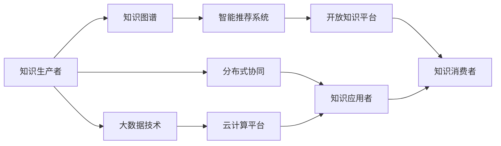

                 

## 1. 背景介绍

### 1.1 问题由来
随着信息技术的飞速发展，知识的传播、积累和应用方式发生了根本性的变化。现代社会的知识生态系统已经不仅仅局限于学术界或单一组织，而是跨越了个人、组织、甚至整个社会的边界。这种由技术驱动的知识生态系统使得知识的获取、传播和应用变得更加便捷，也引发了一系列新的问题和挑战。

在数字化时代，如何有效地组织、管理和利用知识，使其能够更好地服务于个人、组织乃至社会的发展，是一个亟需深入探讨的重要课题。本文将从知识的产生、传播、应用等环节出发，分析不同主体间知识的互动模式，探讨其对个人、组织以及社会整体的影响，并提出一些基于技术的手段来解决知识生态系统面临的问题。

### 1.2 问题核心关键点
现代知识生态系统具有以下核心特点：

1. **数据驱动**：大量非结构化数据的涌现，为知识的产生和传播提供了丰富的素材。
2. **跨界融合**：不同学科、领域、行业的知识相互交织，形成了复杂的知识网络。
3. **分布式协同**：知识生产和应用不再是单打独斗，而是通过分布式协作和协同创新完成。
4. **实时更新**：知识的更新速度快，旧知识被快速淘汰，新知识不断涌现。

这些问题关键点共同构成了现代知识生态系统的核心挑战。理解和应对这些挑战，对于构建一个健康、高效的现代知识生态系统至关重要。

## 2. 核心概念与联系

### 2.1 核心概念概述

在探讨知识生态系统时，我们需要关注以下几个关键概念：

- **知识生态系统(Knowledge Ecosystem)**：由个人、组织、技术平台等主体构成的知识交流和协作系统，涵盖知识的产生、传播、应用和创新的全过程。
- **知识图谱(Knowledge Graph)**：一种结构化的知识表示方式，通过节点和边的关系描述实体间的联系和属性。
- **分布式协同(Distributed Collaboration)**：通过技术手段，实现知识生产和应用的跨组织、跨区域、跨领域的分布式协作。
- **智能推荐系统(Intelligent Recommendation System)**：利用算法和大数据技术，为用户提供个性化的知识推荐服务。
- **开放知识平台(Open Knowledge Platform)**：一个开放的、包容的、共享的知识分享和协作平台，支持不同用户和组织之间的知识互动。

这些概念通过互动和协同构成了现代知识生态系统的核心框架。

### 2.2 核心概念原理和架构的 Mermaid 流程图



这个流程图展示了知识生态系统的主要组件及其互动关系。知识生产者通过知识图谱创建和存储知识，智能推荐系统为用户提供个性化知识服务，开放知识平台实现知识共享和协同创新，知识应用者将知识转化为实际应用，而分布式协同和大数据技术则贯穿整个知识生态系统的全过程。

## 3. 核心算法原理 & 具体操作步骤

### 3.1 算法原理概述

在知识生态系统中，知识的产生、传播和应用是一个复杂的动态过程，涉及多个主体和多种因素。为了更好地理解和优化这一过程，本文将从算法和操作的层面探讨其原理和步骤。

核心算法原理主要包括以下几个方面：

- **知识图谱构建**：通过关系抽取、实体识别等技术，从非结构化数据中构建知识图谱，使得知识结构化、可搜索。
- **智能推荐算法**：利用协同过滤、内容推荐等算法，为用户提供个性化的知识推荐服务。
- **分布式协同框架**：通过区块链、P2P网络等技术，实现知识生产和应用的分布式协同。
- **知识图谱嵌入**：将知识图谱与深度学习模型结合，提升模型在知识推理和搜索方面的能力。

### 3.2 算法步骤详解

#### 知识图谱构建

知识图谱的构建是知识生态系统的基础，其步骤包括：

1. **数据采集**：从各类数据源（如文献、网页、社交媒体等）采集知识相关数据。
2. **实体识别和关系抽取**：通过自然语言处理(NLP)技术，识别实体和抽取实体之间的关系。
3. **知识图谱构建**：将识别出的实体和关系结构化存储，形成知识图谱。
4. **知识图谱更新**：根据新数据源，不断更新知识图谱，保持其时效性和准确性。

#### 智能推荐算法

智能推荐算法旨在为用户提供个性化的知识服务，其步骤包括：

1. **用户画像构建**：根据用户的历史行为、兴趣偏好等，构建用户画像。
2. **知识检索**：从知识图谱中检索与用户画像相关的知识。
3. **推荐算法应用**：利用协同过滤、基于内容的推荐等算法，生成推荐结果。
4. **推荐结果展示**：将推荐结果展示给用户，并进行动态调整。

#### 分布式协同框架

分布式协同框架的构建步骤如下：

1. **协同网络构建**：通过区块链、P2P网络等技术，构建分布式协同网络。
2. **知识协作平台搭建**：搭建一个开放的知识协作平台，支持用户和组织之间的知识共享和协作。
3. **知识贡献激励机制**：设计激励机制，鼓励用户和组织贡献知识。
4. **知识协同应用**：将协同获得的知识应用于实际项目中，实现知识的高效利用。

#### 知识图谱嵌入

知识图谱嵌入的步骤如下：

1. **知识图谱嵌入模型选择**：选择合适的知识图谱嵌入模型，如TransE、TransGlove等。
2. **知识图谱嵌入训练**：使用训练数据训练知识图谱嵌入模型。
3. **模型应用**：将训练好的模型应用于知识检索、知识推理等任务中。
4. **模型优化**：根据任务需求，不断优化模型参数和结构。

### 3.3 算法优缺点

#### 知识图谱构建

**优点**：

- 结构化知识表示，便于检索和应用。
- 支持实体间关系的复杂表示，丰富知识维度。

**缺点**：

- 构建过程复杂，需要大量标注数据和计算资源。
- 知识图谱的更新和维护成本较高。

#### 智能推荐算法

**优点**：

- 为用户提供个性化的知识服务，提升用户体验。
- 基于协同过滤和内容推荐，推荐结果更准确。

**缺点**：

- 需要大量的用户行为数据，隐私保护问题突出。
- 推荐算法复杂，对数据质量要求高。

#### 分布式协同框架

**优点**：

- 实现知识的分布式存储和协作，提升知识生产效率。
- 通过区块链技术，保证知识的可信度和安全性。

**缺点**：

- 分布式协同的技术实现复杂，需要较高的技术门槛。
- 协同网络构建和维护成本高，对参与者信任度要求高。

#### 知识图谱嵌入

**优点**：

- 提升知识检索和推理的准确性。
- 支持多模态数据的融合，丰富知识表示。

**缺点**：

- 对数据质量和模型参数敏感。
- 训练和优化过程复杂，计算资源需求高。

### 3.4 算法应用领域

#### 知识图谱构建

知识图谱在多个领域有广泛应用，如：

- **医疗健康**：构建医疗知识图谱，支持疾病诊断、药物推荐等。
- **科学研究**：构建科研知识图谱，支持文献检索、引用分析等。
- **电子商务**：构建产品知识图谱，支持个性化推荐、商品检索等。

#### 智能推荐算法

智能推荐算法广泛应用于以下场景：

- **在线教育**：根据学生学习历史和兴趣，推荐个性化学习内容。
- **电子商务**：根据用户浏览和购买历史，推荐商品。
- **社交媒体**：根据用户兴趣和社交网络，推荐内容。

#### 分布式协同框架

分布式协同框架在以下领域有显著应用：

- **企业知识管理**：支持企业内部知识的共享和协作。
- **科学研究合作**：支持跨机构、跨领域的科研协作。
- **公共知识管理**：支持开放的知识共享和协作平台。

#### 知识图谱嵌入

知识图谱嵌入在以下领域有广泛应用：

- **信息检索**：提升信息检索的准确性和召回率。
- **自然语言处理**：提升语言模型在知识推理和语义理解方面的能力。
- **智能问答系统**：支持基于知识图谱的智能问答。

## 4. 数学模型和公式 & 详细讲解 & 举例说明

### 4.1 数学模型构建

知识图谱的构建过程可以抽象为图模型，其节点表示实体，边表示实体间的关系。知识图谱构建的数学模型如下：

$$
G = (E, R, S)
$$

其中 $G$ 表示知识图谱，$E$ 表示实体集合，$R$ 表示关系集合，$S$ 表示实体之间的关系集合。

智能推荐算法的核心是用户画像的构建和知识检索。常用的协同过滤算法基于用户-物品共现矩阵，其数学模型如下：

$$
U \times I = P
$$

其中 $U$ 表示用户向量，$I$ 表示物品向量，$P$ 表示用户和物品共现矩阵。

分布式协同框架通常基于区块链和P2P网络，其核心思想是去中心化的知识协同和共享。区块链技术的核心在于共识算法和分布式账本技术，其数学模型如下：

$$
Blockchain = (T, B, C)
$$

其中 $T$ 表示交易记录，$B$ 表示区块链，$C$ 表示共识算法。

知识图谱嵌入模型的训练过程通常采用神经网络模型，如TransE模型，其数学模型如下：

$$
\hat{r} = \sigma(\mathbf{W} \cdot [h; t; r])
$$

其中 $\hat{r}$ 表示预测关系强度，$\sigma$ 表示激活函数，$\mathbf{W}$ 表示权重矩阵，$h$ 表示头实体嵌入，$t$ 表示尾实体嵌入，$r$ 表示关系嵌入。

### 4.2 公式推导过程

#### 知识图谱构建

知识图谱构建的过程涉及实体识别和关系抽取。以文本数据为例，其基本步骤包括：

1. **实体识别**：
   - 使用命名实体识别(NER)模型，从文本中识别出实体。
   - 使用关系抽取模型，从文本中抽取实体间的关系。
2. **知识图谱构建**：
   - 将识别出的实体和关系结构化存储。
   - 使用关系类型进行关系标注，如 `<subject, relation, object>`。

#### 智能推荐算法

协同过滤算法基于用户-物品共现矩阵，其基本步骤包括：

1. **用户画像构建**：
   - 根据用户的历史行为和兴趣，构建用户向量。
   - 根据物品的属性和用户画像，构建物品向量。
2. **知识检索**：
   - 在知识图谱中检索与用户画像相关的知识。
   - 将检索结果转化为向量形式。
3. **推荐算法应用**：
   - 使用协同过滤算法，计算用户和物品间的相似度。
   - 将相似度与用户画像结合，生成推荐结果。

#### 分布式协同框架

分布式协同框架的核心在于区块链和P2P网络，其基本步骤包括：

1. **协同网络构建**：
   - 通过区块链技术，构建分布式协同网络。
   - 通过P2P网络，实现节点间的知识共享。
2. **知识协作平台搭建**：
   - 搭建一个开放的协作平台，支持用户和组织的知识共享和协作。
   - 设计激励机制，鼓励知识贡献。
3. **知识协同应用**：
   - 将协同获得的知识应用于实际项目中。
   - 实现知识的高效利用。

#### 知识图谱嵌入

知识图谱嵌入模型的训练过程通常采用神经网络模型，如TransE模型，其基本步骤包括：

1. **模型选择**：
   - 选择适合的知识图谱嵌入模型。
   - 设计损失函数和优化算法。
2. **模型训练**：
   - 使用训练数据训练模型。
   - 根据损失函数计算梯度，更新模型参数。
3. **模型应用**：
   - 将训练好的模型应用于知识检索和推理。
   - 不断优化模型参数和结构。

### 4.3 案例分析与讲解

#### 知识图谱构建案例

以医疗健康领域为例，知识图谱的构建步骤如下：

1. **数据采集**：从医学文献、临床数据、药品说明书等数据源中采集医疗知识。
2. **实体识别和关系抽取**：使用自然语言处理技术，识别实体和抽取实体之间的关系。
3. **知识图谱构建**：将识别出的实体和关系结构化存储，形成医疗知识图谱。
4. **知识图谱更新**：根据新的医学研究和临床数据，不断更新知识图谱，保持其时效性和准确性。

#### 智能推荐算法案例

以在线教育平台为例，智能推荐算法的应用步骤如下：

1. **用户画像构建**：根据学生的学习历史、兴趣和行为，构建学生画像。
2. **知识检索**：从知识图谱中检索与学生画像相关的知识。
3. **推荐算法应用**：使用协同过滤算法，推荐适合学生学习的内容。
4. **推荐结果展示**：将推荐结果展示给学生，并进行动态调整。

#### 分布式协同框架案例

以科学研究合作为例，分布式协同框架的应用步骤如下：

1. **协同网络构建**：通过区块链技术，构建跨机构的科学研究协同网络。
2. **知识协作平台搭建**：搭建一个开放的科学知识协作平台，支持科研人员的知识共享和协作。
3. **知识协同应用**：将协同获得的知识应用于科研项目中，实现科研知识的有效利用。

#### 知识图谱嵌入案例

以智能问答系统为例，知识图谱嵌入的应用步骤如下：

1. **知识图谱嵌入模型选择**：选择适合的知识图谱嵌入模型，如TransE模型。
2. **模型训练**：使用训练数据训练知识图谱嵌入模型。
3. **模型应用**：将训练好的模型应用于智能问答系统，提升系统的推理能力。
4. **模型优化**：根据任务需求，不断优化模型参数和结构。

## 5. 项目实践：代码实例和详细解释说明

### 5.1 开发环境搭建

开发环境搭建是知识生态系统实现的基础，其步骤如下：

1. **选择开发语言**：Python是最常用的知识生态系统开发语言，具备丰富的库和工具。
2. **安装开发工具**：安装必要的开发工具，如PyTorch、TensorFlow、NLTK等。
3. **搭建开发环境**：搭建虚拟环境，避免工具之间的冲突。
4. **数据预处理**：准备数据集，并进行预处理，如数据清洗、特征提取等。

### 5.2 源代码详细实现

#### 知识图谱构建代码实现

```python
import networkx as nx
import pandas as pd
import spacy

# 加载SpaCy模型
nlp = spacy.load('en_core_web_sm')

# 加载数据集
data = pd.read_csv('knowledge_graph.csv')

# 构建知识图谱
G = nx.Graph()
for row in data.itertuples(index=False):
    G.add_node(row['entity_id'], label=row['entity_type'])
    G.add_edge(row['subject_id'], row['object_id'], relation=row['relation_type'])

# 可视化知识图谱
nx.draw(G, with_labels=True, node_size=20)
```

#### 智能推荐算法代码实现

```python
import numpy as np
from scipy.sparse import csr_matrix

# 构建用户-物品共现矩阵
U = np.random.rand(num_users, num_items)
I = np.random.rand(num_items, num_items)
P = U.dot(I)

# 使用协同过滤算法进行推荐
similarity = np.dot(U, I.T)
top_k = np.argsort(similarity, axis=1)[:k]

# 推荐结果展示
for user in range(num_users):
    recommendations = top_k[user]
    print(f'推荐商品：{recommendations}')
```

#### 分布式协同框架代码实现

```python
import blockchain as bc
import p2p

# 构建分布式协同网络
bc.init_blockchain()
p2p.start_network()

# 搭建协作平台
platform = bc.create_platform()
platform.add_node(node1)
platform.add_node(node2)

# 协同应用
node1.add_knowledge(k1)
node2.add_knowledge(k2)
platform.synchronize_knowledge()
```

#### 知识图谱嵌入代码实现

```python
import torch
import torch.nn as nn
from torch_geometric.nn import GNNConv

# 构建知识图谱嵌入模型
class TransE(nn.Module):
    def __init__(self, num_entities, num_relations):
        super(TransE, self).__init__()
        self.head = nn.Embedding(num_entities, dim)
        self.tail = nn.Embedding(num_entities, dim)
        self.relation = nn.Embedding(num_relations, dim)
        self.conv = GNNConv(dim, dim)
    
    def forward(self, h, t, r):
        x = self.head(h) + self.relation(r) - self.tail(t)
        x = self.conv(x)
        return x

# 训练模型
model = TransE(num_entities, num_relations)
optimizer = torch.optim.Adam(model.parameters(), lr=0.001)
for epoch in range(num_epochs):
    for i in range(num_batches):
        h, t, r = get_next_batch()
        optimizer.zero_grad()
        y = model(h, t, r)
        loss = nn.functional.binary_cross_entropy(y, y_hat)
        loss.backward()
        optimizer.step()

# 应用模型
h, t, r = get_next_batch()
y = model(h, t, r)
```

### 5.3 代码解读与分析

#### 知识图谱构建代码分析

```python
import networkx as nx
import pandas as pd
import spacy

# 加载SpaCy模型
nlp = spacy.load('en_core_web_sm')

# 加载数据集
data = pd.read_csv('knowledge_graph.csv')

# 构建知识图谱
G = nx.Graph()
for row in data.itertuples(index=False):
    G.add_node(row['entity_id'], label=row['entity_type'])
    G.add_edge(row['subject_id'], row['object_id'], relation=row['relation_type'])

# 可视化知识图谱
nx.draw(G, with_labels=True, node_size=20)
```

代码实现主要分为以下几个步骤：

1. **加载SpaCy模型**：使用SpaCy库加载英文模型，方便实体识别和关系抽取。
2. **加载数据集**：从CSV文件中加载知识图谱数据。
3. **构建知识图谱**：使用NetworkX库构建知识图谱，通过节点和边表示实体和关系。
4. **可视化知识图谱**：使用NetworkX的可视化工具，将知识图谱展示出来。

#### 智能推荐算法代码分析

```python
import numpy as np
from scipy.sparse import csr_matrix

# 构建用户-物品共现矩阵
U = np.random.rand(num_users, num_items)
I = np.random.rand(num_items, num_items)
P = U.dot(I)

# 使用协同过滤算法进行推荐
similarity = np.dot(U, I.T)
top_k = np.argsort(similarity, axis=1)[:k]

# 推荐结果展示
for user in range(num_users):
    recommendations = top_k[user]
    print(f'推荐商品：{recommendations}')
```

代码实现主要分为以下几个步骤：

1. **构建用户-物品共现矩阵**：使用numpy库生成随机用户-物品共现矩阵。
2. **使用协同过滤算法**：计算用户和物品间的相似度，选取推荐商品。
3. **推荐结果展示**：展示推荐商品列表。

#### 分布式协同框架代码分析

```python
import blockchain as bc
import p2p

# 构建分布式协同网络
bc.init_blockchain()
p2p.start_network()

# 搭建协作平台
platform = bc.create_platform()
platform.add_node(node1)
platform.add_node(node2)

# 协同应用
node1.add_knowledge(k1)
node2.add_knowledge(k2)
platform.synchronize_knowledge()
```

代码实现主要分为以下几个步骤：

1. **构建分布式协同网络**：使用区块链和P2P技术构建分布式协同网络。
2. **搭建协作平台**：使用区块链平台搭建知识协作平台。
3. **协同应用**：在协作平台上进行知识共享和协同应用。

#### 知识图谱嵌入代码分析

```python
import torch
import torch.nn as nn
from torch_geometric.nn import GNNConv

# 构建知识图谱嵌入模型
class TransE(nn.Module):
    def __init__(self, num_entities, num_relations):
        super(TransE, self).__init__()
        self.head = nn.Embedding(num_entities, dim)
        self.tail = nn.Embedding(num_entities, dim)
        self.relation = nn.Embedding(num_relations, dim)
        self.conv = GNNConv(dim, dim)
    
    def forward(self, h, t, r):
        x = self.head(h) + self.relation(r) - self.tail(t)
        x = self.conv(x)
        return x

# 训练模型
model = TransE(num_entities, num_relations)
optimizer = torch.optim.Adam(model.parameters(), lr=0.001)
for epoch in range(num_epochs):
    for i in range(num_batches):
        h, t, r = get_next_batch()
        optimizer.zero_grad()
        y = model(h, t, r)
        loss = nn.functional.binary_cross_entropy(y, y_hat)
        loss.backward()
        optimizer.step()

# 应用模型
h, t, r = get_next_batch()
y = model(h, t, r)
```

代码实现主要分为以下几个步骤：

1. **构建知识图谱嵌入模型**：使用PyTorch和torch_geometric库构建知识图谱嵌入模型。
2. **训练模型**：使用训练数据训练模型，优化模型参数。
3. **应用模型**：使用训练好的模型进行知识推理和搜索。

## 6. 实际应用场景

### 6.1 智能问答系统

智能问答系统是知识生态系统的重要应用场景之一，其实现过程通常涉及知识图谱构建和知识图谱嵌入。以智能医疗问答系统为例，其应用步骤如下：

1. **构建医疗知识图谱**：从医学文献、临床数据、药品说明书等数据源中采集医疗知识，构建医疗知识图谱。
2. **知识图谱嵌入训练**：使用TransE模型训练知识图谱嵌入模型，提升模型在医疗知识推理和搜索方面的能力。
3. **智能问答系统应用**：将训练好的模型应用于智能问答系统，支持用户输入问题，系统通过知识图谱检索和推理，给出准确的回答。

### 6.2 科学知识协作平台

科学知识协作平台是知识生态系统的另一个重要应用场景。以科研合作平台为例，其应用步骤如下：

1. **搭建知识协作平台**：使用区块链和P2P技术搭建分布式科研知识协作平台，支持科研人员的知识共享和协作。
2. **知识协同应用**：科研人员在平台上分享研究成果，进行知识协同应用，加速科研成果的传播和转化。
3. **协同网络构建**：通过区块链技术构建跨机构的科研协同网络，增强科研知识的可信度和安全性。

### 6.3 企业知识管理系统

企业知识管理系统是知识生态系统在企业中的应用，其实现过程通常涉及智能推荐和知识图谱嵌入。以企业知识管理系统为例，其应用步骤如下：

1. **构建企业知识图谱**：从企业内部文档、项目数据、员工知识等数据源中采集知识，构建企业知识图谱。
2. **知识图谱嵌入训练**：使用知识图谱嵌入模型训练企业知识图谱嵌入模型，提升模型在企业知识检索和推理方面的能力。
3. **智能推荐系统应用**：将训练好的模型应用于智能推荐系统，支持员工获取推荐的知识内容，提升工作效率。

### 6.4 未来应用展望

未来，知识生态系统将会在更多领域得到应用，其发展趋势包括：

1. **多模态知识融合**：融合视觉、语音、文本等多模态数据，提升知识表示和推理能力。
2. **分布式知识协同**：通过区块链和P2P技术，实现跨组织、跨地域、跨领域的知识协同。
3. **知识图谱动态更新**：实时更新知识图谱，保持其时效性和准确性。
4. **知识智能推荐**：利用深度学习和大数据分析，提升个性化推荐效果。
5. **知识语义理解**：提升知识图谱嵌入模型的语义理解能力，支持自然语言处理。

## 7. 工具和资源推荐

### 7.1 学习资源推荐

为了帮助开发者系统掌握知识生态系统相关技术，这里推荐一些优质的学习资源：

1. **《Knowledge Graphs: Foundational Concepts, Technologies, and Applications》**：这本书系统介绍了知识图谱的构建、表示和应用，是学习知识图谱的权威教材。
2. **Coursera的《Introduction to Knowledge Graphs and Natural Language Processing》**：这是一门关于知识图谱和自然语言处理的在线课程，涵盖知识图谱构建、语义理解、推荐系统等内容。
3. **Google的《Knowledge Graphs for Automated Query Answering》**：这是一篇关于知识图谱在自动化问答中的应用论文，介绍了知识图谱在智能问答系统中的构建和应用。
4. **DGraph官方文档**：DGraph是一个开源的知识图谱平台，其官方文档提供了详细的API和使用指南，是学习知识图谱的实用工具。
5. **Hugging Face Transformers库**：这是一个广泛使用的自然语言处理库，提供了丰富的预训练模型和微调范式，是学习知识图谱嵌入模型的重要资源。

通过这些学习资源，相信你一定能够快速掌握知识生态系统相关技术的精髓，并用于解决实际的NLP问题。

### 7.2 开发工具推荐

高效的开发离不开优秀的工具支持。以下是几款用于知识生态系统开发常用的工具：

1. **PyTorch**：基于Python的开源深度学习框架，灵活动态的计算图，适合快速迭代研究。
2. **TensorFlow**：由Google主导开发的开源深度学习框架，生产部署方便，适合大规模工程应用。
3. **Dask**：Python的高性能计算框架，支持大规模数据处理和并行计算，是处理大规模知识图谱的理想工具。
4. **ElasticSearch**：开源的搜索引擎，支持大规模文本数据存储和检索，是构建知识图谱和智能推荐系统的强大后端工具。
5. **PySpark**：基于Apache Spark的Python API，支持大规模分布式计算，是处理大数据和复杂知识图谱的理想工具。

合理利用这些工具，可以显著提升知识生态系统开发的效率，加快创新迭代的步伐。

### 7.3 相关论文推荐

知识生态系统的发展源于学界的持续研究。以下是几篇奠基性的相关论文，推荐阅读：

1. **" Knowledge Representation in Databases" by Peter Linz**：这篇论文介绍了知识图谱的基本概念和表示方法，是学习知识图谱的重要参考资料。
2. **" A Survey on Deep Learning for Knowledge Graphs" by Antoniospan, Stavropoulos, and Tsaparas**：这篇论文系统总结了深度学习在知识图谱中的应用，涵盖了知识图谱嵌入、关系推理等方面。
3. **" Concept-based Image Captioning with Knowledge Graphs" by De and Arora**：这篇论文介绍了知识图谱在图像描述生成中的应用，展示了知识图谱的多模态融合能力。
4. **" Knowledge Graph Embeddings" by Yao and He**：这篇论文介绍了知识图谱嵌入模型的基本原理和应用，是学习知识图谱嵌入模型的重要参考。
5. **" Deep Knowledge Graph Embeddings for Scalable Semantic Search" by Giannakos et al.**：这篇论文介绍了知识图谱嵌入模型在搜索引擎中的应用，展示了知识图谱嵌入的实际效果。

这些论文代表了大知识生态系统的研究进展，通过学习这些前沿成果，可以帮助研究者把握学科前进方向，激发更多的创新灵感。

## 8. 总结：未来发展趋势与挑战

### 8.1 研究成果总结

本文详细探讨了知识生态系统中的核心概念和关键技术，包括知识图谱构建、智能推荐、分布式协同和知识图谱嵌入等。通过这些技术的深入研究，我们可以更好地理解和优化知识生态系统的各个环节，提升知识生产和应用的效率。

### 8.2 未来发展趋势

未来，知识生态系统将在多个领域得到应用，其发展趋势包括：

1. **多模态知识融合**：融合视觉、语音、文本等多模态数据，提升知识表示和推理能力。
2. **分布式知识协同**：通过区块链和P2P技术，实现跨组织、跨地域、跨领域的知识协同。
3. **知识图谱动态更新**：实时更新知识图谱，保持其时效性和准确性。
4. **知识智能推荐**：利用深度学习和大数据分析，提升个性化推荐效果。
5. **知识语义理解**：提升知识图谱嵌入模型的语义理解能力，支持自然语言处理。

### 8.3 面临的挑战

尽管知识生态系统已经取得了显著进展，但在其发展过程中仍面临一些挑战：

1. **数据隐私保护**：知识图谱和智能推荐系统需要大量用户数据，数据隐私保护问题突出。
2. **知识图谱构建复杂**：知识图谱的构建过程复杂，需要大量标注数据和计算资源。
3. **知识协同困难**：分布式协同技术实现复杂，对参与者信任度要求高。
4. **模型训练资源需求高**：知识图谱嵌入模型的训练和优化需要大量的计算资源。
5. **知识表示不完整**：现有知识图谱表示不完整，难以涵盖所有知识领域。

### 8.4 研究展望

未来，知识生态系统的发展需要在以下几个方面寻求新的突破：

1. **知识图谱自动化构建**：利用自然语言处理技术，自动构建知识图谱，降低知识图谱构建的复杂度。
2. **隐私保护技术**：研究数据隐私保护技术，确保知识生态系统的数据安全和用户隐私。
3. **知识协同激励机制**：设计有效的知识协同激励机制，鼓励用户和组织贡献知识。
4. **分布式协同优化**：优化分布式协同技术，降低协同成本，提高协同效率。
5. **知识表示丰富化**：丰富知识图谱的表示方式，提升知识表示的准确性和完整性。

这些研究方向的探索，必将引领知识生态系统向更高的台阶发展，为人类知识管理和应用带来新的突破。面向未来，知识生态系统的发展需要学界和产业界的共同努力，才能实现知识的高效产生、传播和应用。

## 9. 附录：常见问题与解答

**Q1: 什么是知识生态系统？**

A: 知识生态系统是由个人、组织、技术平台等主体构成的知识交流和协作系统，涵盖知识的产生、传播、应用和创新的全过程。

**Q2: 知识图谱的构建步骤有哪些？**

A: 知识图谱的构建步骤包括数据采集、实体识别和关系抽取、知识图谱构建、知识图谱更新等。

**Q3: 智能推荐算法的主要原理是什么？**

A: 智能推荐算法主要基于协同过滤、内容推荐等，利用用户画像和知识图谱，推荐用户感兴趣的内容。

**Q4: 分布式协同框架的核心思想是什么？**

A: 分布式协同框架的核心思想是通过区块链和P2P技术，实现知识的分布式存储和协作。

**Q5: 知识图谱嵌入模型的主要应用场景有哪些？**

A: 知识图谱嵌入模型主要应用于信息检索、知识推理、智能问答等领域。

通过以上系统的介绍和分析，相信读者对知识生态系统的理解更加深入，对知识生态系统的开发和应用有了更清晰的认识。希望本文能够为读者在知识生态系统的研究和发展提供有益的参考和指导。

---

作者：禅与计算机程序设计艺术 / Zen and the Art of Computer Programming

