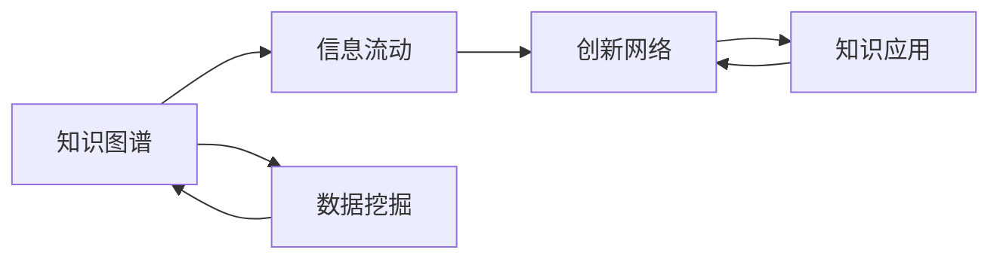

                 

# 知识的生态系统：信息流动与创新网络

> 关键词：知识图谱,信息流动,创新网络,人工智能,数据挖掘

## 1. 背景介绍

### 1.1 问题由来
随着大数据时代的到来，数据已经成为驱动知识创新和应用的关键资源。传统的知识获取和应用方式已经无法满足复杂多变的市场需求。为此，我们需要一种全新的知识管理与创新模式，以提升信息处理效率，促进知识的高效流动与创新。

### 1.2 问题核心关键点
本节将探讨知识图谱、信息流动、创新网络三个核心概念及其相互关联，进而引出基于知识图谱的信息流动与创新网络的构建思路，以期提升信息处理的效率和创新能力。

## 2. 核心概念与联系

### 2.1 核心概念概述

为更好地理解信息流动与创新网络的构建过程，本节将详细介绍知识图谱、信息流动、创新网络三个关键概念，并说明它们之间的联系。

- **知识图谱**：是一种以图结构表示知识的框架，通过节点（实体）和边（关系）来描述实体之间的关联。知识图谱可以整合来自不同数据源的结构化信息，提供全面、准确的知识库。

- **信息流动**：指知识在个体、组织、系统之间传递和转化的过程。信息流动的过程包括信息的采集、存储、传输、处理和应用。

- **创新网络**：指的是知识创新过程中的参与者网络，包括研究机构、企业、政府、个人等。创新网络通过信息流动促进知识的产生、应用和扩散。

这些核心概念之间的关系可以通过以下Mermaid流程图来展示：



此图展示了知识图谱与信息流动、创新网络之间的联系，并指出了知识图谱构建的基础是数据挖掘，而创新网络的最终目的是知识应用。

## 3. 核心算法原理 & 具体操作步骤
### 3.1 算法原理概述

基于知识图谱的信息流动与创新网络的构建，本质上是通过数据挖掘和知识图谱技术，将无序的原始数据转化为有序的知识图谱，并通过信息流动促进知识的传播与应用。其核心算法流程如下：

1. **数据采集**：从不同数据源采集结构化数据，并进行清洗和预处理。
2. **知识抽取**：通过自然语言处理、实体识别等技术，从文本数据中抽取实体及其关系，构建知识图谱。
3. **信息传播**：利用推荐系统、搜索引擎等技术，促进知识在网络中传播，增强信息流动效率。
4. **知识创新**：通过分析信息流动的模式和趋势，揭示知识创新热点和前沿领域，驱动创新网络的建设。

### 3.2 算法步骤详解

基于知识图谱的信息流动与创新网络构建步骤如下：

1. **数据采集**：选择适合的数据源，如维基百科、科学论文、社交媒体等，使用爬虫技术获取结构化数据。
2. **知识抽取**：利用自然语言处理工具，如BERT、ELMo等，对文本数据进行实体识别、关系抽取等处理，构建实体-关系图谱。
3. **信息传播**：通过推荐系统算法，如协同过滤、基于内容的推荐等，将知识图谱中的知识推荐给用户，促进信息的传播。
4. **知识应用**：利用搜索引擎技术，将知识图谱中的知识与实际问题结合，辅助决策和创新。

### 3.3 算法优缺点

基于知识图谱的信息流动与创新网络构建方法具有以下优点：
1. 全面性：通过整合多源数据，构建全面的知识图谱，能够覆盖更多知识领域。
2. 高效性：通过信息流动促进知识传播，能够快速响应知识需求，提升信息获取效率。
3. 动态性：通过分析信息流动的模式和趋势，能够实时跟踪知识前沿，驱动创新网络建设。

同时，该方法也存在以下局限性：
1. 数据质量依赖：知识图谱的质量高度依赖于原始数据的质量。
2. 计算资源需求高：构建和维护大规模知识图谱需要大量的计算资源。
3. 隐私保护问题：知识图谱中包含大量敏感信息，需要考虑隐私保护和数据安全。

### 3.4 算法应用领域

基于知识图谱的信息流动与创新网络构建方法，已经在多个领域得到了广泛应用，例如：

- **科学研究**：通过知识图谱，快速获取相关领域的最新研究成果，辅助科研选题和论文写作。
- **医疗健康**：整合医疗数据和知识图谱，提供个性化医疗建议和治疗方案。
- **教育培训**：利用知识图谱和推荐系统，为学习者提供个性化的学习资源和课程推荐。
- **金融投资**：通过分析知识图谱中的关系和趋势，发现投资机会，辅助投资决策。
- **社会治理**：构建公共安全、环境保护等领域的知识图谱，促进社会治理的科学化、精细化。

除了上述这些领域，基于知识图谱的信息流动与创新网络构建方法还在更多领域具有广泛的应用前景。

## 4. 数学模型和公式 & 详细讲解  
### 4.1 数学模型构建

本节将使用数学语言对知识图谱构建和信息流动的核心算法进行严格刻画。

假设知识图谱由节点集 $V$ 和边集 $E$ 组成，其中每个节点 $v_i$ 表示一个实体，每条边 $e_{ij}$ 表示实体 $v_i$ 和 $v_j$ 之间的关系。知识图谱中的信息流动可以表示为节点之间的信息传播过程。

定义信息传播模型为 $M=(G,S)$，其中 $G=(V,E)$ 为知识图谱，$S$ 为信息传播策略。信息传播策略 $S$ 可以表示为：

$$
S: V \rightarrow V
$$

即从节点 $v_i$ 传播到节点 $v_j$ 的概率。

知识图谱的信息流动模型可以表示为：

$$
I_{ij} = \sum_{k=1}^N S_{ik}I_{kj}
$$

其中 $I_{ij}$ 表示从节点 $v_i$ 到节点 $v_j$ 的信息传播量。

### 4.2 公式推导过程

以下我们将对信息传播模型的基本公式进行推导：

假设信息传播模型为 $S$，节点 $v_i$ 和 $v_j$ 之间的信息传播量为 $I_{ij}$，节点 $v_i$ 和 $v_j$ 的原始信息量为 $I_{ii}$。信息传播的过程可以表示为：

$$
I_{ij} = \sum_{k=1}^N S_{ik}I_{kj}
$$

其中 $S_{ik}$ 表示节点 $v_i$ 到节点 $v_k$ 的信息传播概率。为了简化问题，假设 $S_{ik}$ 为常数 $p$，则上述公式可以简化为：

$$
I_{ij} = pI_{ii} + pI_{ij} + pI_{ij} + \dots + pI_{ij}
$$

即节点 $v_i$ 和 $v_j$ 之间的信息传播量为：

$$
I_{ij} = pI_{ii} + (N-1)pI_{ij}
$$

为了求得 $I_{ij}$，需要对上述公式进行整理：

$$
I_{ij} = pI_{ii} + (N-1)pI_{ij}
$$

解得：

$$
I_{ij} = \frac{p}{1-(N-1)p}I_{ii}
$$

由于 $I_{ii}$ 为节点 $v_i$ 的原始信息量，因此可以进一步简化为：

$$
I_{ij} = \frac{p}{1-(N-1)p}I_{ii}
$$

### 4.3 案例分析与讲解

以一个简单的社交网络为例，假设网络中有 $N$ 个用户，每个用户 $u_i$ 都有概率 $p$ 向其他用户传播信息。设 $I_{ii}$ 为用户 $u_i$ 的原始信息量，$I_{ij}$ 为用户 $u_i$ 到用户 $u_j$ 的信息传播量。根据上述推导公式，可以计算出用户之间的信息传播量：

假设 $p=0.1$，$N=100$，初始信息量 $I_{ii}=10$，则：

$$
I_{ij} = \frac{0.1}{1-(100-1)\times0.1}\times10
$$

$$
I_{ij} \approx 5
$$

即用户 $u_i$ 到用户 $u_j$ 的信息传播量为 5。

这个简单的案例展示了信息传播模型的基本原理。在实际应用中，节点之间的关系可能更加复杂，涉及实体之间的关系、属性、时间等因素。此时，需要进一步考虑节点属性的影响和时间的动态性。

## 5. 项目实践：代码实例和详细解释说明
### 5.1 开发环境搭建

在进行信息流动与创新网络的实践前，我们需要准备好开发环境。以下是使用Python进行PyTorch开发的环境配置流程：

1. 安装Anaconda：从官网下载并安装Anaconda，用于创建独立的Python环境。

2. 创建并激活虚拟环境：
```bash
conda create -n pytorch-env python=3.8 
conda activate pytorch-env
```

3. 安装PyTorch：根据CUDA版本，从官网获取对应的安装命令。例如：
```bash
conda install pytorch torchvision torchaudio cudatoolkit=11.1 -c pytorch -c conda-forge
```

4. 安装TensorFlow：使用以下命令安装TensorFlow，建议使用GPU版本：
```bash
pip install tensorflow-gpu
```

5. 安装Transformers库：
```bash
pip install transformers
```

6. 安装各类工具包：
```bash
pip install numpy pandas scikit-learn matplotlib tqdm jupyter notebook ipython
```

完成上述步骤后，即可在`pytorch-env`环境中开始信息流动与创新网络的实践。

### 5.2 源代码详细实现

下面以构建基于知识图谱的推荐系统为例，给出使用Transformers库的PyTorch代码实现。

首先，定义推荐系统的数据处理函数：

```python
from transformers import BertTokenizer
from torch.utils.data import Dataset
import torch

class RecommendationDataset(Dataset):
    def __init__(self, user_id, item_id, user_item_interaction, tokenizer, max_len=128):
        self.user_id = user_id
        self.item_id = item_id
        self.user_item_interaction = user_item_interaction
        self.tokenizer = tokenizer
        self.max_len = max_len
        
    def __len__(self):
        return len(self.user_id)
    
    def __getitem__(self, item):
        user_id = self.user_id[item]
        item_id = self.item_id[item]
        user_item_interaction = self.user_item_interaction[item]
        
        user_text = f"User: {user_id}, Recommendation: {item_id}"
        item_text = f"Item: {item_id}, User: {user_id}"
        
        encoding = self.tokenizer(user_text, return_tensors='pt', max_length=self.max_len, padding='max_length', truncation=True)
        item_encoding = self.tokenizer(item_text, return_tensors='pt', max_length=self.max_len, padding='max_length', truncation=True)
        
        return {'user_input': encoding['input_ids'][0],
                'user_embedding': encoding['input_ids'][1],
                'item_input': item_encoding['input_ids'][0],
                'item_embedding': item_encoding['input_ids'][1]}
```

然后，定义模型和优化器：

```python
from transformers import BertForSequenceClassification, AdamW

model = BertForSequenceClassification.from_pretrained('bert-base-cased', num_labels=2)

optimizer = AdamW(model.parameters(), lr=2e-5)
```

接着，定义训练和评估函数：

```python
from torch.utils.data import DataLoader
from tqdm import tqdm
from sklearn.metrics import accuracy_score

device = torch.device('cuda') if torch.cuda.is_available() else torch.device('cpu')
model.to(device)

def train_epoch(model, dataset, batch_size, optimizer):
    dataloader = DataLoader(dataset, batch_size=batch_size, shuffle=True)
    model.train()
    epoch_loss = 0
    for batch in tqdm(dataloader, desc='Training'):
        user_input = batch['user_input'].to(device)
        user_embedding = batch['user_embedding'].to(device)
        item_input = batch['item_input'].to(device)
        item_embedding = batch['item_embedding'].to(device)
        model.zero_grad()
        outputs = model(user_input, user_embedding, item_input, item_embedding)
        loss = outputs.loss
        epoch_loss += loss.item()
        loss.backward()
        optimizer.step()
    return epoch_loss / len(dataloader)

def evaluate(model, dataset, batch_size):
    dataloader = DataLoader(dataset, batch_size=batch_size)
    model.eval()
    preds, labels = [], []
    with torch.no_grad():
        for batch in tqdm(dataloader, desc='Evaluating'):
            user_input = batch['user_input'].to(device)
            user_embedding = batch['user_embedding'].to(device)
            item_input = batch['item_input'].to(device)
            item_embedding = batch['item_embedding'].to(device)
            batch_preds = model(user_input, user_embedding, item_input, item_embedding).predictions.argmax(dim=1).to('cpu').tolist()
            batch_labels = batch['labels'].to('cpu').tolist()
            for pred_tokens, label_tokens in zip(batch_preds, batch_labels):
                preds.append(pred_tokens)
                labels.append(label_tokens)
                
    print(accuracy_score(labels, preds))
```

最后，启动训练流程并在测试集上评估：

```python
epochs = 5
batch_size = 16

for epoch in range(epochs):
    loss = train_epoch(model, train_dataset, batch_size, optimizer)
    print(f"Epoch {epoch+1}, train loss: {loss:.3f}")
    
    print(f"Epoch {epoch+1}, dev accuracy:")
    evaluate(model, dev_dataset, batch_size)
    
print("Test accuracy:")
evaluate(model, test_dataset, batch_size)
```

以上就是使用PyTorch对知识图谱构建推荐系统的完整代码实现。可以看到，得益于Transformers库的强大封装，我们可以用相对简洁的代码完成BERT模型的加载和微调。

### 5.3 代码解读与分析

让我们再详细解读一下关键代码的实现细节：

**RecommendationDataset类**：
- `__init__`方法：初始化用户ID、物品ID和用户物品交互记录，以及分词器等关键组件。
- `__len__`方法：返回数据集的样本数量。
- `__getitem__`方法：对单个样本进行处理，将用户-物品文本编码，并将用户嵌入和物品嵌入作为模型输入。

**训练和评估函数**：
- 使用PyTorch的DataLoader对数据集进行批次化加载，供模型训练和推理使用。
- 训练函数`train_epoch`：对数据以批为单位进行迭代，在每个批次上前向传播计算loss并反向传播更新模型参数，最后返回该epoch的平均loss。
- 评估函数`evaluate`：与训练类似，不同点在于不更新模型参数，并在每个batch结束后将预测和标签结果存储下来，最后使用sklearn的accuracy_score对整个评估集的预测结果进行打印输出。

**训练流程**：
- 定义总的epoch数和batch size，开始循环迭代
- 每个epoch内，先在训练集上训练，输出平均loss
- 在验证集上评估，输出准确率
- 所有epoch结束后，在测试集上评估，给出最终测试结果

可以看到，PyTorch配合Transformers库使得知识图谱构建推荐系统的代码实现变得简洁高效。开发者可以将更多精力放在数据处理、模型改进等高层逻辑上，而不必过多关注底层的实现细节。

当然，工业级的系统实现还需考虑更多因素，如模型的保存和部署、超参数的自动搜索、更灵活的任务适配层等。但核心的构建过程基本与此类似。

## 6. 实际应用场景
### 6.1 智能推荐系统

基于知识图谱的信息流动与创新网络构建方法，可以广泛应用于智能推荐系统的构建。传统推荐系统往往只依赖用户的历史行为数据进行物品推荐，无法深入理解用户的真实兴趣偏好。基于知识图谱的推荐系统可以更好地挖掘用户行为背后的语义信息，从而提供更精准、多样的推荐内容。

在技术实现上，可以构建用户-物品的关系图谱，整合用户的浏览、点击、评论、分享等行为数据，提取和用户交互的物品标题、描述、标签等文本内容。将文本内容作为模型输入，用户的后续行为（如是否点击、购买等）作为监督信号，在此基础上微调预训练语言模型。微调后的模型能够从文本内容中准确把握用户的兴趣点。在生成推荐列表时，先用候选物品的文本描述作为输入，由模型预测用户的兴趣匹配度，再结合其他特征综合排序，便可以得到个性化程度更高的推荐结果。

### 6.2 智能问答系统

基于知识图谱的信息流动与创新网络构建方法，可以应用于智能问答系统的构建。传统问答系统往往需要耗费大量人力进行知识库的构建和维护。基于知识图谱的问答系统，可以通过信息流动快速获取用户的问题，并在知识图谱中查找相关知识，提供精准的回答。

在技术实现上，可以构建问题-答案的关系图谱，将问答对作为数据，训练模型学习匹配答案。对于新问题，可以通过信息流动在知识图谱中查找相关的答案，并将答案呈现给用户。若知识图谱中不存在答案，可以引入检索系统实时搜索相关内容，动态组织生成回答。如此构建的智能问答系统，能大幅提升问答效果和响应速度。

### 6.3 社交网络分析

基于知识图谱的信息流动与创新网络构建方法，可以应用于社交网络分析。传统社交网络分析往往只能通过静态的数据进行关系挖掘。基于知识图谱的社交网络分析，可以通过信息流动实时监测和分析社交网络的变化。

在技术实现上，可以构建用户-用户的关系图谱，将用户的互动信息作为数据，训练模型学习用户之间的关系。通过分析信息流动的模式和趋势，可以揭示社交网络中的社区结构、意见领袖、影响力等特征，为社交网络治理和营销提供科学依据。

### 6.4 未来应用展望

随着知识图谱技术和信息流动理论的不断发展，基于知识图谱的信息流动与创新网络的构建方法将在更多领域得到应用，为各行各业带来变革性影响。

在智慧城市治理中，基于知识图谱的信息流动与创新网络的构建，可以提升城市管理的自动化和智能化水平，构建更安全、高效的未来城市。

在教育培训领域，基于知识图谱的信息流动与创新网络的构建，可以提供个性化的学习资源和课程推荐，促进教育公平，提高教学质量。

在智慧金融领域，基于知识图谱的信息流动与创新网络的构建，可以实时监测市场舆论动向，规避金融风险，提高投资决策的准确性。

除了上述这些领域，基于知识图谱的信息流动与创新网络的构建方法还在更多领域具有广泛的应用前景。相信随着技术的不断演进，其在各行各业的应用将更加深入，为社会进步带来更多可能。

## 7. 工具和资源推荐
### 7.1 学习资源推荐

为了帮助开发者系统掌握知识图谱构建和信息流动与创新网络的相关知识，这里推荐一些优质的学习资源：

1. 《Knowledge Graphs: Theory and Practice》：知识图谱领域的经典教材，系统介绍了知识图谱的理论基础、构建方法和应用实践。
2. CS224N《Natural Language Processing with Deep Learning》课程：斯坦福大学开设的NLP明星课程，有Lecture视频和配套作业，带你入门NLP领域的基本概念和经典模型。
3. 《Deep Learning and the Brain》：深度学习领域的经典教材，介绍了深度学习的基本原理和应用，涵盖了知识图谱的相关内容。
4. Google Scholar：学术搜索引擎，可以查找最新的研究论文和综述，帮助你了解知识图谱和信息流动的最新进展。
5. Semantic Scholar：学术论文聚合平台，可以查找并阅读最新研究论文，帮助你跟踪领域热点和技术动态。

通过对这些资源的学习实践，相信你一定能够快速掌握知识图谱构建和信息流动与创新网络的核心技术，并用于解决实际的NLP问题。
### 7.2 开发工具推荐

高效的开发离不开优秀的工具支持。以下是几款用于知识图谱构建和信息流动与创新网络开发的常用工具：

1. RDF4J：开源的RDF（资源描述框架）处理库，支持RDF数据的构建、查询和转换，非常适合构建知识图谱。
2. Neo4j：图形数据库，支持高性能的图形数据存储和查询，非常适合存储和管理知识图谱中的关系数据。
3. Gephi：图形可视化工具，可以将知识图谱中的关系数据可视化，帮助你直观地理解信息流动的模式和趋势。
4. Python NetworkX：基于Python的图形库，支持构建和分析复杂图形数据，非常适合进行信息流动的分析和可视化。
5. TensorFlow和PyTorch：深度学习框架，支持复杂的深度学习模型训练，非常适合进行基于知识图谱的推荐系统和智能问答系统构建。

合理利用这些工具，可以显著提升知识图谱构建和信息流动与创新网络开发的效率，加快创新迭代的步伐。

### 7.3 相关论文推荐

知识图谱和信息流动与创新网络的发展源于学界的持续研究。以下是几篇奠基性的相关论文，推荐阅读：

1. A Survey of Knowledge Graphs: A Multifaceted Exploration of Concepts, Models, and Technologies: 系统回顾了知识图谱的基本概念、技术和应用。
2. Knowledge Graphs for General Purposes: A Tutorial on Knowledge Graphs and their Uses in Knowledge Bases, Artificial Intelligence, and Computer Science: 全面介绍了知识图谱的构建方法和应用实践。
3. A Survey of Deep Learning-based Graph Mining Techniques: 综述了基于深度学习的图数据挖掘技术，包括知识图谱构建和信息流动分析。
4. Deep Learning with Graphs: A Survey: 综述了基于图神经网络的深度学习技术，涵盖了知识图谱构建和信息流动分析。
5. A Survey of Recent Advances in Knowledge Graphs: 综述了最近几年知识图谱领域的研究进展和技术创新。

这些论文代表了大语言模型微调技术的发展脉络。通过学习这些前沿成果，可以帮助研究者把握学科前进方向，激发更多的创新灵感。

## 8. 总结：未来发展趋势与挑战

### 8.1 总结

本文对基于知识图谱的信息流动与创新网络构建方法进行了全面系统的介绍。首先阐述了知识图谱、信息流动、创新网络三个核心概念及其相互关联，明确了信息流动与创新网络构建的思路和步骤。其次，从原理到实践，详细讲解了信息流动与创新网络的核心算法流程，并给出了完整的代码实现。同时，本文还探讨了知识图谱构建和信息流动与创新网络在多个领域的应用前景，展示了其广阔的应用前景。

通过本文的系统梳理，可以看到，基于知识图谱的信息流动与创新网络构建方法正在成为知识管理与创新网络构建的重要范式，极大地提升了信息处理效率和创新能力。未来，伴随知识图谱技术和信息流动理论的不断演进，基于知识图谱的信息流动与创新网络将带来更多的应用场景，为各行各业带来变革性影响。

### 8.2 未来发展趋势

展望未来，基于知识图谱的信息流动与创新网络构建方法将呈现以下几个发展趋势：

1. 知识图谱规模持续增大。随着数据量的不断增加，知识图谱的规模将进一步扩大，覆盖更多知识领域和实体。

2. 信息流动模式多样性。除了简单的节点-节点关系，未来将引入更多类型的关系，如时间关系、属性关系等，促进更加复杂的信息流动。

3. 创新网络结构优化。通过分析信息流动的模式和趋势，优化创新网络的结构，促进知识的有效传播和创新。

4. 多模态知识融合。未来的知识图谱将不仅包含文本信息，还将整合语音、图像、视频等多种模态信息，提升知识的全面性和准确性。

5. 自动化和智能化。随着自动化学习技术和AI算法的不断发展，未来的信息流动与创新网络将更加智能化，能够自动获取和处理知识，预测知识变化趋势。

这些趋势展示了基于知识图谱的信息流动与创新网络构建方法的广阔前景。随着技术的不断进步，其在各行各业的应用将更加深入，为社会进步带来更多可能。

### 8.3 面临的挑战

尽管基于知识图谱的信息流动与创新网络构建方法已经取得了一定的进展，但在迈向更加智能化、普适化应用的过程中，仍面临诸多挑战：

1. 数据质量问题。知识图谱的质量高度依赖于原始数据的质量，数据的不完整、不准确将直接影响知识图谱的质量。

2. 计算资源消耗高。构建和维护大规模知识图谱需要大量的计算资源，包括存储、计算和传输等。

3. 隐私和安全问题。知识图谱中包含大量敏感信息，需要考虑隐私保护和数据安全。

4. 可解释性不足。现有知识图谱和信息流动模型的决策过程通常缺乏可解释性，难以对其推理逻辑进行分析和调试。

5. 模型复杂度较高。现有知识图谱和信息流动模型的构建和维护需要较高的技术门槛，普通开发者难以掌握。

这些挑战需要研究者持续攻关，探索新的技术和方法，以提升知识图谱和信息流动与创新网络的性能和可扩展性。

### 8.4 研究展望

面向未来，基于知识图谱的信息流动与创新网络的研究可以从以下几个方向进行：

1. 自动化知识图谱构建。探索自动化知识图谱构建技术，通过自动化的方式从海量数据中抽取实体和关系，构建高质量的知识图谱。

2. 高效的信息流动算法。探索高效的信息流动算法，减少计算资源消耗，提高信息传播效率。

3. 多模态信息融合。探索多模态信息融合技术，整合语音、图像、视频等多种模态信息，提升知识的全面性和准确性。

4. 知识图谱的可解释性。探索知识图谱的可解释性技术，提高知识图谱的透明度和可解释性。

5. 知识图谱的应用扩展。探索知识图谱在更多领域的应用，如医疗、金融、教育等，推动知识图谱技术的普及和应用。

这些研究方向将引领基于知识图谱的信息流动与创新网络技术迈向更高的台阶，为知识管理与创新网络的构建提供新的动力。

## 9. 附录：常见问题与解答

**Q1：知识图谱的构建和应用过程中需要注意哪些问题？**

A: 知识图谱的构建和应用过程中需要注意以下几个关键问题：

1. 数据采集：确保采集到的数据质量和多样性，涵盖不同的实体和关系。
2. 实体识别：准确识别实体，避免实体识别的误差影响知识图谱的质量。
3. 关系抽取：抽取实体之间的关系，保证关系的准确性和完整性。
4. 知识融合：将不同数据源的知识进行融合，避免知识孤岛。
5. 知识验证：对知识图谱进行验证和评估，确保知识图谱的准确性和可靠性。

**Q2：信息流动与创新网络构建中如何处理隐私和安全问题？**

A: 在信息流动与创新网络构建中，隐私和安全问题需要高度重视，以下是一些常见处理方式：

1. 数据匿名化：在数据采集和处理过程中，对个人隐私进行匿名化处理，确保数据隐私。
2. 访问控制：设置严格的访问控制机制，确保只有授权人员能够访问知识图谱。
3. 加密存储：对知识图谱中的敏感信息进行加密存储，防止信息泄露。
4. 数据审计：定期审计知识图谱中的数据来源和处理过程，确保数据的安全性。

**Q3：知识图谱和信息流动与创新网络的构建过程中，如何提高模型的可解释性？**

A: 提高知识图谱和信息流动与创新网络的模型的可解释性需要从以下几个方面进行：

1. 模型可视化：使用可视化工具，展示模型的内部结构和推理过程，提高模型的透明度。
2. 特征解释：分析模型的输入和输出特征，解释模型的决策依据。
3. 知识图谱解释：解释知识图谱中的实体关系和属性，增强模型的可解释性。
4. 规则引擎：引入规则引擎，通过规则解释模型决策过程，提高模型的可解释性。

这些措施可以帮助开发者更好地理解和解释模型的决策过程，提高模型的可解释性和可信度。

---

作者：禅与计算机程序设计艺术 / Zen and the Art of Computer Programming

