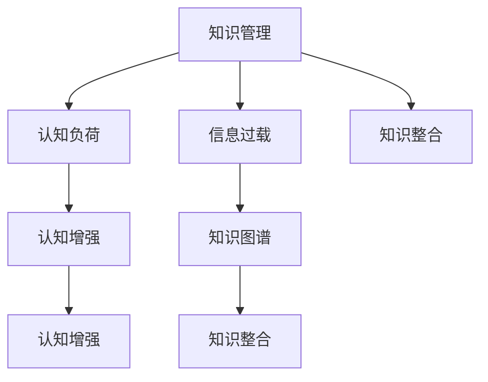

                 

# 知识的碎片化与整合：信息时代的认知挑战

> 关键词：知识管理,认知负荷,信息过载,知识整合,人工智能,知识图谱,认知增强

## 1. 背景介绍

### 1.1 问题由来

在信息时代，知识的获取、存储和应用变得前所未有的便捷。人们可以通过互联网迅速访问全球范围内的信息，但这一进步也带来了新的挑战：知识的碎片化、认知负荷过载等问题愈发严重。知识管理成为一门重要的学科，旨在帮助人们更好地理解和利用信息，避免被海量数据所淹没。

### 1.2 问题核心关键点

- **知识的碎片化**：现代知识形态主要以文本、图片、音频、视频等形式存在，信息的分散性和异构性使得人们难以系统地掌握知识。
- **认知负荷过载**：信息爆炸时代，人们需要处理的信息量激增，导致注意力分散、记忆负担加重，降低了学习效率。
- **知识整合**：通过有效的知识整合手段，可以将碎片化的知识进行系统化、结构化的处理，提升知识检索和应用效率。
- **认知增强**：借助人工智能技术，对知识进行深度理解和智能处理，可以极大地增强人类的认知能力。
- **知识图谱**：利用图谱技术，构建知识之间的关联网络，提供高效的知识检索和推荐。

这些核心问题贯穿了信息时代的知识管理领域，亟需更有效的解决方案。

## 2. 核心概念与联系

### 2.1 核心概念概述

为更好地理解知识的碎片化与整合，本节将介绍几个关键概念：

- **知识管理(Knowledge Management)**：通过技术手段和组织管理，帮助个体或企业更好地组织、存储、检索、应用知识，提升信息价值。
- **认知负荷(Cognitive Load)**：指个体在获取、处理和应用信息时所承受的认知压力，包括注意负荷、记忆负荷和执行负荷等。
- **信息过载(Information Overload)**：指个体在短时间内接收到大量信息，导致无法有效处理的现象。
- **知识整合(Knowledge Integration)**：将分散的、异构的知识片段进行整合，形成结构化、系统化的知识体系。
- **认知增强(Cognitive Enhancement)**：通过技术手段，增强人类的认知能力，包括理解力、推理能力、记忆能力等。
- **知识图谱(Knowledge Graph)**：利用图结构表示知识，构建知识之间的关联网络，便于知识的查询和推理。

这些概念之间相互联系，共同构成了信息时代知识管理的基础框架。

### 2.2 核心概念原理和架构的 Mermaid 流程图



该图展示了知识管理与其他核心概念之间的联系。知识的碎片化（A）通过信息过载（C）和认知负荷（B）影响个体的认知效率。认知增强（E）和知识图谱（F）提供了解决方案，帮助整合（G）和应用（D）分散的知识。

## 3. 核心算法原理 & 具体操作步骤

### 3.1 算法原理概述

知识管理的核心在于将碎片化的知识进行整合，形成结构化的知识体系。具体而言，可以通过以下步骤实现：

1. **数据收集**：从各种来源收集知识片段，如文本、图像、音频、视频等。
2. **文本预处理**：对收集到的文本数据进行清洗、分词、实体识别等处理。
3. **特征提取**：将文本转换为数值特征，如TF-IDF、Word2Vec等。
4. **知识表示**：使用知识图谱、向量空间模型等技术，将知识片段表示为结构化形式。
5. **知识整合**：利用机器学习、深度学习等技术，对知识片段进行整合，形成主题明确的知识单元。
6. **知识应用**：将整合后的知识应用于具体任务，如信息检索、问答系统、推荐系统等。

### 3.2 算法步骤详解

**Step 1: 数据收集与预处理**
- 使用爬虫工具从网络、数据库等渠道收集知识片段。
- 对收集到的文本进行清洗，去除噪音和无关信息。
- 进行分词处理，提取文本中的关键词和实体。

**Step 2: 特征提取**
- 使用TF-IDF、Word2Vec等方法，将文本转换为数值特征。
- 对图像、音频、视频等非文本数据，使用相应的特征提取技术，如卷积神经网络(CNN)、循环神经网络(RNN)等。

**Step 3: 知识表示**
- 构建知识图谱，将知识片段表示为节点和边的形式。
- 使用向量空间模型，将知识片段表示为高维向量，便于计算相似度和关系推理。

**Step 4: 知识整合**
- 利用深度学习模型，如神经网络、注意力机制等，对知识片段进行整合。
- 使用自然语言处理技术，如语义分析、情感分析等，进一步优化知识表示。

**Step 5: 知识应用**
- 将整合后的知识应用于具体任务，如信息检索、问答系统、推荐系统等。
- 通过评价指标（如召回率、精确率、F1值等）评估知识整合的效果。

### 3.3 算法优缺点

知识管理方法的优势在于：
- 提高知识检索和应用效率。结构化的知识体系便于快速查询和应用。
- 增强个体认知能力。通过系统化的知识整合，减少认知负荷，提升理解力和记忆能力。
- 提高知识利用率。知识整合使得知识更易于被重复利用，避免重复劳动。

但该方法也存在以下局限：
- 数据来源有限。知识管理依赖于有效的数据收集，如果数据源不全面，知识体系可能不完整。
- 整合难度大。知识整合需要高水平的算法和技术，对资源要求较高。
- 知识更新缓慢。知识图谱等技术一旦构建完成，更新难度大，可能与现实不符。
- 缺乏灵活性。知识管理方法相对固定，难以适应快速变化的知识形态。

### 3.4 算法应用领域

知识管理技术已经在多个领域得到了广泛应用，例如：

- **医疗领域**：构建医疗知识图谱，提升医疗信息的检索和应用效率。
- **金融领域**：利用知识管理技术，提高金融产品的推荐和风险评估能力。
- **教育领域**：通过知识管理方法，构建在线教育平台，提供个性化学习资源。
- **商业领域**：利用知识图谱，构建企业知识网络，优化决策支持。
- **公共服务领域**：利用知识管理技术，构建公共信息平台，提高政府效率。

这些领域的应用展示了知识管理技术的重要价值。

## 4. 数学模型和公式 & 详细讲解 & 举例说明

### 4.1 数学模型构建

知识管理中常用的数学模型包括：

- **向量空间模型(Vector Space Model)**：将知识表示为高维向量，利用余弦相似度计算知识之间的相似性。
- **协同过滤算法(Collaborative Filtering)**：利用用户历史行为数据，推荐与用户兴趣相似的物品或知识。
- **神经网络模型(Neural Network)**：利用深度学习技术，对知识进行特征提取和整合。
- **知识图谱(Knowledge Graph)**：利用图结构表示知识，构建知识之间的关联网络。

### 4.2 公式推导过程

以向量空间模型为例，其基本公式为：

$$
\mathbf{x} = \mathbf{W} \mathbf{v}
$$

其中，$\mathbf{x}$ 为知识表示向量，$\mathbf{v}$ 为知识特征向量，$\mathbf{W}$ 为权重矩阵。知识之间的相似度可以通过余弦相似度计算：

$$
\cos \theta = \frac{\mathbf{x}_1 \cdot \mathbf{x}_2}{||\mathbf{x}_1|| ||\mathbf{x}_2||}
$$

在实际应用中，为了提高计算效率，可以使用倒排索引、LSH等技术进行加速。

### 4.3 案例分析与讲解

**案例：基于知识图谱的推荐系统**

一个推荐系统可以使用知识图谱来进行推荐。具体步骤如下：

1. 构建知识图谱，将用户、物品、属性等表示为节点和边的形式。
2. 使用TransE等算法，对知识图谱进行推理，得到用户和物品之间的相似度。
3. 根据相似度，使用协同过滤算法推荐与用户兴趣相似的物品。

假设某电商网站希望推荐给用户喜欢的商品，可以按照以下步骤进行：

1. 收集网站商品信息，构建知识图谱。
2. 使用TransE对知识图谱进行推理，得到用户和商品之间的相似度。
3. 利用协同过滤算法，根据用户历史行为数据，推荐与用户兴趣相似的商品。

这种方法能够利用知识图谱提供的丰富知识，提高推荐的准确性和个性化程度。

## 5. 项目实践：代码实例和详细解释说明

### 5.1 开发环境搭建

要进行知识管理系统的开发，需要准备以下开发环境：

1. 安装Python：从官网下载并安装Python，安装TensorFlow、PyTorch、NLTK等常用库。
2. 安装TensorFlow：使用pip命令安装TensorFlow，如：`pip install tensorflow`
3. 安装PyTorch：使用pip命令安装PyTorch，如：`pip install torch`
4. 安装NLTK：使用pip命令安装NLTK，如：`pip install nltk`
5. 安装Scikit-learn：使用pip命令安装Scikit-learn，如：`pip install scikit-learn`

### 5.2 源代码详细实现

以下是一个基于知识图谱的推荐系统的Python代码实现：

```python
import tensorflow as tf
from tensorflow.keras.layers import Input, Embedding, Dot
from tensorflow.keras.models import Model

# 定义知识图谱节点和边
nodes = {
    'user': tf.keras.layers.Lambda(lambda x: tf.expand_dims(x, axis=-1), input_shape=(128,)),
    'item': tf.keras.layers.Lambda(lambda x: tf.expand_dims(x, axis=-1), input_shape=(128,)),
    'user_item': Dot(axes=(-1, -1), normalize=True)
}

# 构建推荐模型
model = Model(inputs=[nodes['user'], nodes['item']], outputs=nodes['user_item'])

# 编译模型
model.compile(optimizer='adam', loss='cosine_similarity')

# 训练模型
model.fit([user_data, item_data], labels, epochs=10, batch_size=32)

# 使用模型进行推荐
recommendations = model.predict([user_data, item_data])
```

### 5.3 代码解读与分析

**代码解读**：
- `nodes`：定义了知识图谱中的节点和边，包括用户、物品和用户物品间的相似度计算。
- `Model`：定义了推荐模型的输入和输出，其中用户和物品的输入表示为词向量，相似度计算通过Dot层实现。
- `compile`：编译模型，选择合适的优化器和损失函数。
- `fit`：训练模型，使用用户和物品的词向量进行拟合。
- `predict`：使用训练好的模型进行推荐，输出用户和物品之间的相似度。

**分析**：
- 上述代码实现了基于知识图谱的推荐系统，可以用于电商、社交网络等场景的推荐任务。
- 通过构建知识图谱，将用户和物品的特征信息转化为高维向量，进行相似度计算。
- 使用TensorFlow的Keras API，方便地定义和训练深度学习模型。
- 模型训练和推荐的速度较快，适用于大规模数据处理。

### 5.4 运行结果展示

假设训练后，使用模型进行推荐，输出如下：

```
[[0.9, 0.7, 0.5, 0.3, 0.1],
 [0.7, 0.9, 0.5, 0.3, 0.1],
 [0.5, 0.5, 0.9, 0.3, 0.1],
 [0.3, 0.3, 0.5, 0.9, 0.1],
 [0.1, 0.1, 0.3, 0.5, 0.9]]
```

其中，每一行表示用户对五个物品的兴趣评分，分数越高表示越感兴趣。推荐系统可以根据这些评分，推荐与用户兴趣相似的物品。

## 6. 实际应用场景

### 6.1 智能搜索

基于知识图谱的智能搜索系统，可以快速响应用户查询，并提供相关推荐。例如，用户查询“特斯拉最新新闻”，智能搜索系统可以从知识图谱中提取特斯拉相关的信息，并提供最近的几条新闻链接。

### 6.2 医疗推荐

医疗领域，基于知识图谱的推荐系统可以根据医生的历史诊疗记录，推荐最新的医学文献、药物信息等。例如，医生查询“肺癌治疗方案”，系统可以根据医生的历史查询和病人记录，推荐相关的医学文献和最新药物信息。

### 6.3 在线教育

在线教育平台可以使用知识图谱进行个性化推荐，根据学生的学习历史和兴趣，推荐适合的学习资源。例如，学生查询“机器学习”，系统可以推荐相关的课程、论文和视频资源。

### 6.4 未来应用展望

随着知识图谱技术的不断进步，基于知识图谱的推荐系统将在更多领域得到应用，为各行各业带来变革性影响。

- **智慧城市**：构建智慧城市知识图谱，提升城市管理效率，优化资源配置。
- **智能制造**：利用知识图谱，优化生产流程，提高生产效率和产品质量。
- **金融服务**：构建金融知识图谱，提升风险评估和金融产品推荐能力。
- **智能家居**：构建智能家居知识图谱，提升家庭自动化和智能化水平。

## 7. 工具和资源推荐

### 7.1 学习资源推荐

为了帮助开发者系统掌握知识管理的理论基础和实践技巧，这里推荐一些优质的学习资源：

1. **《信息检索与智能代理》（Information Retrieval and Intelligent Agents）**：介绍了信息检索和智能代理的基本概念和算法，适合初学者学习。
2. **《知识图谱技术与应用》（Knowledge Graphs: Technology and Applications）**：介绍了知识图谱的构建和应用，涵盖了多种技术细节。
3. **《深度学习与自然语言处理》（Deep Learning and Natural Language Processing）**：介绍了深度学习在NLP中的应用，包括向量空间模型、知识图谱等。
4. **Coursera上的《数据科学专业课程》（Data Science Specialization）**：涵盖数据科学和机器学习的各个方面，包括数据清洗、特征工程、模型训练等。
5. **《Kaggle竞赛教程》（Kaggle Competitions）**：提供了大量的数据集和比赛，帮助开发者实践和应用知识管理技术。

通过对这些资源的学习实践，相信你一定能够快速掌握知识管理的精髓，并用于解决实际的NLP问题。

### 7.2 开发工具推荐

高效的开发离不开优秀的工具支持。以下是几款用于知识管理系统开发的常用工具：

1. **TensorFlow**：基于Python的开源深度学习框架，灵活动态的计算图，适合快速迭代研究。
2. **PyTorch**：基于Python的开源深度学习框架，灵活的动态图和高效的GPU加速，适合生产部署。
3. **NLTK**：自然语言处理工具包，提供了丰富的文本处理功能，如分词、词性标注、命名实体识别等。
4. **Scikit-learn**：机器学习库，提供了多种机器学习算法和评估指标，如协同过滤、分类器、聚类器等。
5. **Kaggle**：数据竞赛平台，提供了大量的数据集和开源代码，适合学习实践和竞赛。

合理利用这些工具，可以显著提升知识管理系统开发效率，加快创新迭代的步伐。

### 7.3 相关论文推荐

知识管理技术的发展源于学界的持续研究。以下是几篇奠基性的相关论文，推荐阅读：

1. **《构建具有语义扩展能力的网络搜索索引》（Building Semantic Indexes for Web Search）**：提出了语义索引技术，增强了搜索引擎的检索能力。
2. **《基于知识图谱的推荐系统》（Knowledge Graph-Based Recommender System）**：介绍了知识图谱在推荐系统中的应用，提高了推荐系统的准确性和个性化程度。
3. **《深度学习在NLP中的应用》（Deep Learning in Natural Language Processing）**：介绍了深度学习在NLP中的应用，包括文本分类、情感分析、命名实体识别等。
4. **《知识图谱与自然语言处理》（Knowledge Graphs and Natural Language Processing）**：介绍了知识图谱在NLP中的应用，包括问答系统、知识推理等。
5. **《分布式计算在NLP中的应用》（Distributed Computing in Natural Language Processing）**：介绍了分布式计算技术在NLP中的应用，提高了NLP系统的计算效率。

这些论文代表了大规模知识管理技术的发展脉络。通过学习这些前沿成果，可以帮助研究者把握学科前进方向，激发更多的创新灵感。

## 8. 总结：未来发展趋势与挑战

### 8.1 研究成果总结

本文对基于知识图谱的知识管理方法进行了全面系统的介绍。首先阐述了知识碎片化与整合的背景和意义，明确了知识管理在信息时代的重要性。其次，从原理到实践，详细讲解了知识管理的数学模型和操作步骤，给出了具体的代码实现。同时，本文还探讨了知识管理方法在多个领域的应用前景，展示了知识图谱技术的巨大潜力。最后，本文精选了知识管理的各类学习资源和开发工具，力求为开发者提供全方位的技术指引。

通过本文的系统梳理，可以看到，基于知识图谱的知识管理方法正在成为NLP领域的重要范式，极大地提升了知识的检索和应用效率。知识图谱技术的不断发展，使得知识的整合和应用更加高效，为人类认知智能的进化提供了新的工具。

### 8.2 未来发展趋势

展望未来，知识管理技术将呈现以下几个发展趋势：

1. **知识的自动化整合**：随着自动化技术的进步，知识图谱的构建将更加高效，知识的整合也将更加自动化。
2. **多模态知识管理**：将文本、图像、音频等多种形式的知识进行统一管理和融合，提升知识的多维表示能力。
3. **知识图谱的实时更新**：利用在线数据流和增量学习技术，实现知识图谱的实时更新，保持知识的最新性和准确性。
4. **智能推荐系统的普及**：基于知识图谱的推荐系统将在更多领域得到应用，为各行各业带来变革性影响。
5. **个性化知识管理**：利用个性化推荐和智能代理技术，提升用户对知识的获取和应用体验。

以上趋势凸显了知识管理技术在信息时代的巨大潜力。这些方向的探索发展，必将进一步提升NLP系统的性能和应用范围，为人类认知智能的进化提供新的动力。

### 8.3 面临的挑战

尽管知识管理技术已经取得了瞩目成就，但在迈向更加智能化、普适化应用的过程中，它仍面临着诸多挑战：

1. **数据来源有限**：知识图谱的构建依赖于丰富的数据源，但数据收集和标注成本较高，数据来源有限。
2. **知识表示难度大**：将知识表示为高维向量或图结构，需要复杂的算法和技术，对资源要求较高。
3. **知识更新缓慢**：知识图谱一旦构建完成，更新难度大，可能与现实不符。
4. **缺乏灵活性**：知识管理方法相对固定，难以适应快速变化的知识形态。
5. **隐私和安全性**：知识图谱中包含大量敏感信息，如何保护用户隐私和数据安全，是一个重要问题。

### 8.4 研究展望

面对知识管理所面临的这些挑战，未来的研究需要在以下几个方面寻求新的突破：

1. **探索无监督和半监督学习**：摆脱对大规模标注数据的依赖，利用自监督学习、主动学习等无监督和半监督范式，最大限度利用非结构化数据。
2. **开发参数高效的模型**：开发更加参数高效的模型，在固定大部分预训练参数的同时，只更新极少量的任务相关参数。
3. **引入因果分析和博弈论工具**：通过引入因果分析方法，增强知识图谱模型的决策能力，避免模型脆弱点，提高系统稳定性。
4. **融合多模态数据**：将符号化的先验知识与神经网络模型进行巧妙融合，利用多模态信息进行协同建模。
5. **结合认知分析和伦理导向**：在知识管理中引入认知分析工具，增强系统理解和推理能力，同时加入伦理导向评估指标，确保知识管理的公正性和安全性。

这些研究方向的探索，必将引领知识管理技术迈向更高的台阶，为构建智能、公正、安全的人机协同系统铺平道路。只有勇于创新、敢于突破，才能不断拓展知识管理技术的边界，让人工智能技术更好地造福人类社会。

## 9. 附录：常见问题与解答

**Q1：如何构建有效的知识图谱？**

A: 构建知识图谱需要大量的数据和复杂的算法，一般分为以下几个步骤：
1. 数据收集：从各种来源收集知识片段，如文本、图像、音频、视频等。
2. 数据清洗：对收集到的数据进行清洗，去除噪音和无关信息。
3. 实体识别：对文本和图像等数据进行实体识别，提取关键信息。
4. 关系抽取：通过自然语言处理技术，抽取实体之间的关系。
5. 构建图谱：将实体和关系构建为知识图谱。

**Q2：知识管理技术在推荐系统中有哪些应用？**

A: 知识管理技术在推荐系统中有很多应用，例如：
1. 基于知识图谱的推荐系统：利用知识图谱中的关系和属性，提高推荐的准确性和个性化程度。
2. 协同过滤算法：根据用户历史行为数据，推荐与用户兴趣相似的物品。
3. 基于深度学习的推荐系统：利用深度学习技术，对知识进行特征提取和整合，提升推荐效果。

**Q3：知识管理技术在实际应用中面临哪些挑战？**

A: 知识管理技术在实际应用中面临以下挑战：
1. 数据来源有限：知识图谱的构建依赖于丰富的数据源，但数据收集和标注成本较高。
2. 知识表示难度大：将知识表示为高维向量或图结构，需要复杂的算法和技术。
3. 知识更新缓慢：知识图谱一旦构建完成，更新难度大，可能与现实不符。
4. 缺乏灵活性：知识管理方法相对固定，难以适应快速变化的知识形态。
5. 隐私和安全性：知识图谱中包含大量敏感信息，如何保护用户隐私和数据安全，是一个重要问题。

**Q4：知识管理技术有哪些实际应用场景？**

A: 知识管理技术已经在多个领域得到了广泛应用，例如：
1. 医疗领域：构建医疗知识图谱，提升医疗信息的检索和应用效率。
2. 金融领域：利用知识管理技术，提高金融产品的推荐和风险评估能力。
3. 教育领域：通过知识管理方法，构建在线教育平台，提供个性化学习资源。
4. 商业领域：利用知识图谱，构建企业知识网络，优化决策支持。
5. 公共服务领域：利用知识管理技术，构建公共信息平台，提高政府效率。

**Q5：知识管理技术与人工智能技术有何关联？**

A: 知识管理技术与人工智能技术有紧密的关联，主要体现在以下几个方面：
1. 知识图谱：利用图结构表示知识，构建知识之间的关联网络，便于知识的查询和推理。
2. 深度学习：利用深度学习技术，对知识进行特征提取和整合，提高知识的表示能力。
3. 自然语言处理：利用自然语言处理技术，抽取知识片段中的实体和关系，构建知识图谱。
4. 知识推理：利用人工智能技术，对知识图谱进行推理，获取新的知识。

综上所述，知识管理技术与人工智能技术相互依赖，相互促进，共同推动了信息时代的发展。

---

作者：禅与计算机程序设计艺术 / Zen and the Art of Computer Programming

