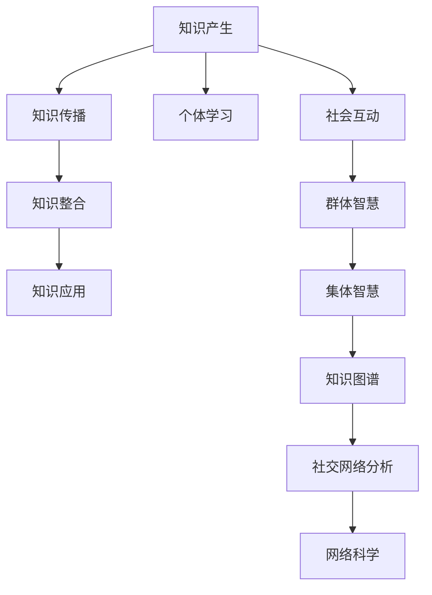

                 

# 知识的社会性：集体智慧的形成与传播

在数字化和网络化的浪潮下，知识的生产、传播、应用变得前所未有的便捷。这不仅改变了知识的物理形态和传播方式，还深刻影响了人类社会的发展轨迹和组织结构。本文将探讨知识的**社会性**，以及集体智慧的形成与传播机制，进而揭示其在现代社会中的重要作用和潜在挑战。

## 1. 背景介绍

在现代社会，知识不再仅仅存在于书籍、实验室和课堂中，它变得更加流动和多元化。随着互联网、大数据、人工智能等技术的兴起，知识的获取、存储、共享和应用变得前所未有的高效。知识的生产不再局限于专业领域，而是普及到每一个社会角落，形成了庞大的**知识网络**。

知识的**社会性**意味着，知识不再仅由个体产生和传播，而是由社会集体的互动和协作共同塑造。个体通过交流、合作、学习，构建起知识的共同体，在这个共同体中，知识的产生、传播和应用呈现出复杂的相互作用和动力系统。

## 2. 核心概念与联系

### 2.1 核心概念概述

为深入理解知识的**社会性**及其传播机制，本文将介绍几个关键概念：

- **知识社会性**：知识通过社会网络形成和传播的过程。这一过程涉及知识的产生、交流、整合与共享，受社会结构、文化、技术等因素影响。
- **集体智慧**：多个个体或群体共同创造和使用的智慧。集体智慧的形成依赖于知识的汇聚、整合与创新。
- **知识图谱**：以图结构表示知识关系的知识库。通过构建知识图谱，可以更直观地展现知识网络，分析知识流动和影响。
- **社交网络分析**：通过分析社交网络结构，识别关键节点和社区，揭示知识的传播和影响机制。
- **网络科学**：研究复杂网络的形成、演化和功能，提供知识传播网络的理论基础和分析工具。

### 2.2 核心概念原理和架构的 Mermaid 流程图



此图展示了知识社会性的核心概念及其相互作用。从个体学习到社会互动，再到集体智慧的形成与传播，每一步都离不开知识图谱的支撑和网络科学的理论指导。

## 3. 核心算法原理 & 具体操作步骤

### 3.1 算法原理概述

知识的社会性形成与传播过程可以抽象为一个复杂的网络过程。每个节点代表一个知识实体（如个体、组织、文章等），边代表知识的关系（如引用、合作、交流等）。通过网络科学和社交网络分析的方法，可以揭示知识流动的模式、影响力和关键节点。

### 3.2 算法步骤详解

1. **知识实体抽取与网络构建**：
   - 从大规模文本、论文、专利等数据中抽取知识实体，构建知识图谱。
   - 通过引用、合作、交流等关系，构建知识传播网络。

2. **社交网络分析**：
   - 使用中心性、社区结构、影响力等指标，分析知识传播网络的关键节点和社区。
   - 通过网络可视化工具，直观展示知识传播的路径和影响。

3. **知识图谱的动态更新**：
   - 实时更新知识图谱，跟踪新知识的出现、传播和应用。
   - 使用推荐算法，推荐相关知识和专家，促进知识的社会性传播。

4. **集体智慧的形成**：
   - 通过聚合众多个体智慧，形成集体智慧。
   - 使用机器学习算法，挖掘知识关联和模式，促进创新。

### 3.3 算法优缺点

**优点**：
- **高效性**：网络科学和社交网络分析的方法可以快速揭示知识传播的路径和影响。
- **全面性**：集体智慧的形成依赖于知识图谱的动态更新，能够覆盖更广泛的知识领域。
- **可扩展性**：算法可以处理大规模数据，适用于复杂的知识网络。

**缺点**：
- **数据质量问题**：知识抽取和网络构建依赖于高质量数据，错误的数据可能导致误导性分析。
- **算法复杂性**：算法需要处理大规模、复杂的数据结构，对计算资源和算法复杂度要求较高。
- **隐私和安全问题**：在处理敏感数据时，需要考虑隐私保护和数据安全。

### 3.4 算法应用领域

基于上述算法原理，知识的社会性形成与传播在多个领域中得到了广泛应用，例如：

- **科学研究**：通过分析科研论文的引用关系，识别科研热点和关键论文。
- **技术创新**：通过跟踪技术专利的引用和合作关系，预测技术发展趋势。
- **社会治理**：通过分析政策文件的引用关系，评估政策影响力和制定科学决策。
- **经济预测**：通过分析企业报告的引用关系，预测市场趋势和投资机会。
- **教育应用**：通过推荐课程和专家，促进知识的社会化传播。

## 4. 数学模型和公式 & 详细讲解 & 举例说明

### 4.1 数学模型构建

知识的传播网络可以表示为一个无向图 $G(V, E)$，其中 $V$ 表示节点集合，$E$ 表示边集合。每个节点 $v_i$ 代表一个知识实体，每个边 $e_{ij}$ 代表实体 $v_i$ 和 $v_j$ 之间的知识关系。

### 4.2 公式推导过程

定义节点 $v_i$ 的度数 $k_i$ 为与其相连的边数，中心性指标 $c_i$ 为节点在网络中的重要性。常用的中心性指标包括度中心性（Degree Centrality）、介数中心性（Betweenness Centrality）、特征向量中心性（Eigenvector Centrality）等。

度中心性：
$$ c_i = \sum_{j} A_{ij} $$
介数中心性：
$$ c_i = \sum_{j,k} \frac{\sigma_{jk}}{\sigma_j} $$
特征向量中心性：
$$ c_i = \sum_j A_{ij} c_j $$

其中 $A_{ij}$ 表示节点 $v_i$ 和 $v_j$ 之间是否有边相连，$\sigma_{jk}$ 表示从节点 $j$ 到节点 $k$ 的最短路径数。

### 4.3 案例分析与讲解

以科研论文的引用网络为例，分析其核心论文的识别和引用路径。通过计算每个论文的度中心性、介数中心性和特征向量中心性，可以识别出对后续研究影响最大的核心论文，并分析其引用路径和影响力。

假设某领域有一篇论文 $P$，通过分析其引用关系，发现其引用 $Q$ 和 $R$ 最多。进一步分析 $Q$ 和 $R$ 的引用路径，可以发现 $P$ 对 $Q$ 和 $R$ 产生了深远影响。通过进一步分析 $Q$ 和 $R$ 的引用路径，可以发现其对其他论文产生了类似的影响，形成了一个知识传播的“核心-辐射”网络。

## 5. 项目实践：代码实例和详细解释说明

### 5.1 开发环境搭建

1. **Python环境配置**：
   - 安装 Python 3.7+，推荐使用 Anaconda 或 Miniconda。
   - 安装必要的依赖包，如 NetworkX、Pandas、Scikit-learn 等。

2. **数据准备**：
   - 收集大规模文本、论文、专利等数据。
   - 使用正则表达式和自然语言处理工具，抽取知识实体和关系。

### 5.2 源代码详细实现

以下是一个使用 Python 和 NetworkX 库构建知识传播网络并分析关键节点的示例代码：

```python
import networkx as nx
import pandas as pd

# 加载数据
papers = pd.read_csv('papers.csv')
papers.head()

# 构建知识传播网络
G = nx.Graph()
for i in range(len(papers)):
    papers[i]['id']
    papers[i]['title']
    papers[i]['cites'] = int(papers[i]['cites'])
    papers[i]['degree'] = papers[i]['cites']
    G.add_node(papers[i]['id'], degree=papers[i]['degree'])
    G.add_edge(papers[i]['id'], papers[j]['id'] for j in papers.index if papers[j]['cites'] > 0)

# 计算中心性
c_dict = nx.degree_centrality(G)
max_c = max(c_dict.values())
max_c_id = [id for id, c in c_dict.items() if c == max_c]

# 输出核心论文
print('核心论文：', max_c_id)
```

### 5.3 代码解读与分析

- **数据加载**：使用 Pandas 库加载论文数据，包含论文 ID、标题和引用次数等字段。
- **网络构建**：使用 NetworkX 库构建知识传播网络，每个论文节点包含其引用次数和度数。
- **中心性计算**：使用 NetworkX 库计算节点度中心性，找到引用次数最多的核心论文。
- **输出结果**：输出核心论文的 ID，供进一步分析和应用。

### 5.4 运行结果展示

运行上述代码后，可以输出引用次数最多的核心论文 ID。这可以作为进一步分析和应用的基础。

## 6. 实际应用场景

### 6.1 科学研究

在科学研究中，通过分析论文的引用关系，可以识别出研究热点和关键论文。这对于学术界了解研究方向、跟踪最新进展具有重要意义。

### 6.2 技术创新

在技术创新中，通过分析专利的引用关系，可以预测技术发展趋势和创新点。这对于企业研发部门制定技术路线图和战略具有指导作用。

### 6.3 社会治理

在社会治理中，通过分析政策文件的引用关系，可以评估政策影响力和制定科学决策。这对于公共政策制定者和研究人员具有参考价值。

### 6.4 经济预测

在经济预测中，通过分析企业报告的引用关系，可以预测市场趋势和投资机会。这对于金融分析师和投资者具有参考价值。

### 6.5 教育应用

在教育应用中，通过推荐课程和专家，可以促进知识的社会化传播。这对于在线教育和知识共享平台具有重要意义。

## 7. 工具和资源推荐

### 7.1 学习资源推荐

1. **《网络科学导论》（Martin Karlin）**：网络科学的基础教材，涵盖网络结构、动态和复杂性的理论。
2. **Coursera 课程《网络科学导论》**：由斯坦福大学教授开设，提供网络科学的理论基础和实践案例。
3. **Kaggle 竞赛**：通过参与知识传播网络分析的竞赛，提升实践能力。

### 7.2 开发工具推荐

1. **NetworkX**：Python 中用于构建和分析复杂网络的工具。
2. **Gephi**：用于可视化复杂网络的工具。
3. **Cytoscape**：另一个可视化复杂网络的工具，支持更丰富的分析功能。

### 7.3 相关论文推荐

1. **《复杂网络：结构、性质和演化》（Albert-László Barabási）**：介绍复杂网络的结构、性质和演化规律。
2. **《网络科学的理论与方法》（Dmitri Krioukov）**：介绍网络科学的理论基础和应用方法。
3. **《社交网络的统计结构与动力学》（Zheng Yang, 苏健）**：介绍社交网络的统计结构和动力学规律。

## 8. 总结：未来发展趋势与挑战

### 8.1 研究成果总结

本文通过分析知识的社会性及其传播机制，揭示了其在科学研究、技术创新、社会治理、经济预测和教育应用中的重要作用。同时，介绍了基于网络科学和社交网络分析的知识传播网络构建和分析方法。

### 8.2 未来发展趋势

未来，随着数据的不断积累和技术的持续进步，知识的传播将更加高效和广泛。以下是可能的趋势：

1. **数据驱动的知识传播**：大规模数据的收集和分析，将促进知识的传播和应用。
2. **智能算法的应用**：机器学习、深度学习等算法将提升知识传播的智能化水平。
3. **跨学科的融合**：知识传播网络将越来越多地跨学科融合，形成更加综合的知识体系。
4. **隐私和安全保障**：在处理敏感数据时，隐私保护和数据安全将成为重要问题。
5. **全球化的知识网络**：全球化的网络将促进不同文化、语言和地域的知识交流。

### 8.3 面临的挑战

尽管知识传播的趋势向好，但在实际应用中仍面临一些挑战：

1. **数据质量问题**：高质量的数据是知识传播网络分析的基础，数据收集和清洗的难度较大。
2. **算法复杂性**：处理大规模、复杂的数据结构，需要高效的算法和计算资源。
3. **隐私和安全问题**：在处理敏感数据时，隐私保护和数据安全成为重要考虑因素。
4. **跨学科融合**：跨学科的知识传播需要协调不同领域的需求和目标。

### 8.4 研究展望

未来的研究将进一步探索以下方向：

1. **知识传播的动态分析**：实时跟踪知识传播的变化，提升知识更新的速度和效率。
2. **跨学科知识的整合**：促进不同学科之间的知识交流和融合，形成更加综合的知识体系。
3. **智能推荐系统**：开发智能推荐系统，促进知识的发现和传播。
4. **隐私和安全保障**：研究隐私保护和数据安全的新方法，确保知识传播的安全性。
5. **知识传播的社会影响**：分析知识传播对社会的影响，指导政策制定和公共决策。

## 9. 附录：常见问题与解答

### Q1: 什么是知识的社会性？

A: 知识的社会性是指知识通过社会网络形成和传播的过程。这一过程涉及知识的产生、交流、整合与共享，受社会结构、文化、技术等因素影响。

### Q2: 如何构建知识传播网络？

A: 构建知识传播网络需要从大规模数据中抽取知识实体和关系，使用图形数据库或网络分析工具。常用的工具包括 NetworkX 和 Gephi。

### Q3: 如何分析知识传播的关键节点？

A: 分析知识传播的关键节点需要使用中心性指标，如度中心性、介数中心性和特征向量中心性。常用的工具包括 NetworkX 和 Cytoscape。

### Q4: 知识传播对科学研究有何影响？

A: 知识传播可以识别研究热点和关键论文，有助于学术界了解研究方向和跟踪最新进展。

### Q5: 知识传播网络分析面临哪些挑战？

A: 数据质量问题、算法复杂性和隐私安全问题是知识传播网络分析的主要挑战。需要高质量的数据和高效的算法，同时保护隐私和数据安全。

