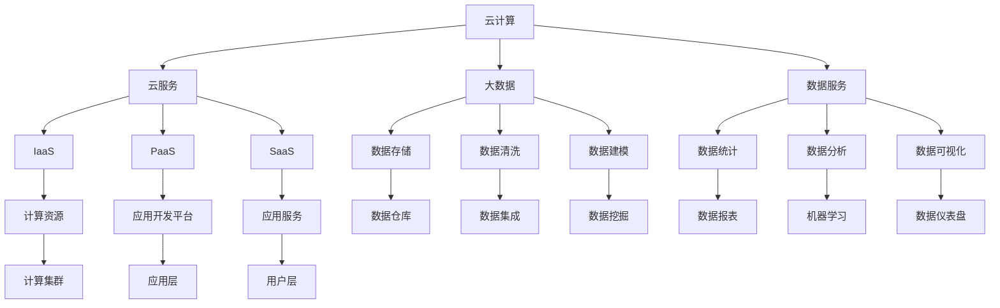

                 

# 知识经济下知识付费的云计算与大数据服务

> 关键词：云计算,大数据,知识付费,云服务,数据服务,云架构,大数据分析,商业智能,数据平台,数据驱动

## 1. 背景介绍

随着知识经济的兴起，人们对知识付费的需求日益增长。传统在线教育、学术研究、行业资讯等领域，已不再局限于免费公开内容，而是转向更加专业、个性化的知识付费服务。然而，知识付费的背后，是海量数据的积累和分析，这对技术架构和服务能力提出了更高的要求。云计算和大数据技术为此提供了强大的支持，通过高可用性、高扩展性的云平台和大数据分析能力，帮助知识付费服务提供商构建高效率、低成本的知识获取与分享生态。

### 1.1 知识付费兴起原因

知识付费兴起的原因主要有以下几点：

- **信息过载与筛选难度增大**：互联网时代信息量爆炸式增长，用户筛选所需信息成本增加，愿意为筛选后的高质量信息付费。
- **专业化知识需求增加**：面对日新月异的行业变化，用户对特定领域专业知识的获取需求增强，愿意为深度学习、技能提升等专业服务支付费用。
- **知识生产者激励机制**：知识付费模式为内容生产者提供了稳定的收入来源，激励优质内容输出。
- **平台商业化探索**：在线教育平台、学术机构等，希望通过知识付费业务实现商业变现，提升盈利能力。

### 1.2 知识付费面临的挑战

尽管知识付费具有广阔的发展前景，但也面临一系列挑战：

- **信息质量参差不齐**：部分知识付费平台内容质量不高，存在过度营销、内容灌输等问题，影响用户体验。
- **平台信任度不足**：用户对平台的信任度不高，导致付费意愿低，内容消费率低。
- **用户支付能力**：部分用户支付能力有限，难以负担高额的订阅费用，影响知识付费的普及率。
- **版权保护难度**：知识付费内容存在版权争议，平台需要对内容进行严格的审查和维权。

## 2. 核心概念与联系

### 2.1 核心概念概述

本节将介绍与云计算与大数据服务相关的核心概念：

- **云计算 (Cloud Computing)**：一种通过互联网提供按需服务的计算模式，使用户不必购买和维护物理硬件和软件，即可灵活、高效地使用计算资源。
- **大数据 (Big Data)**：指无法在传统数据处理工具范围内获取、管理和分析的数据集合。大数据分析利用各种算法和大规模计算能力，从海量数据中提取有价值的信息。
- **知识付费 (Knowledge Subscription)**：用户为获取专业、深度、高质量的互联网内容而付费，包括但不限于在线教育、学术研究、行业资讯等。
- **云服务 (Cloud Services)**：云计算中提供的一系列服务，包括IaaS、PaaS、SaaS等，满足不同层次的用户需求。
- **数据服务 (Data Services)**：大数据服务中提供的一系列数据处理和分析服务，如数据存储、清洗、统计分析等。
- **云架构 (Cloud Architecture)**：指基于云计算的分布式、弹性架构设计，提高系统的可靠性和扩展性。
- **大数据分析 (Big Data Analytics)**：使用各种数据分析算法和工具，对大数据进行探索、建模和预测，从中发现有价值的信息。
- **商业智能 (Business Intelligence, BI)**：利用数据分析、数据可视化等技术，为商业决策提供支持，提升企业运营效率。
- **数据平台 (Data Platform)**：将大数据基础设施、数据服务、商业智能工具等集成的综合平台，提供数据驱动的服务。
- **数据驱动 (Data-Driven)**：指在决策和运营中依赖数据进行驱动和优化，减少主观判断的偏差。

这些核心概念通过云计算与大数据服务的方式联系起来，共同构建了知识付费的基础设施和分析能力，为其提供可靠的数据支持和服务保障。

### 2.2 核心概念原理和架构的 Mermaid 流程图(Mermaid 流程节点中不要有括号、逗号等特殊字符)



该流程图展示了云计算与大数据服务之间的联系。云计算提供基础计算资源和灵活的应用开发环境；大数据提供数据存储、清洗、建模、分析等功能；数据服务则将大数据和分析能力封装为易于使用、灵活扩展的服务。这些服务共同构成了知识付费的强大技术支撑，使其能够在高性能、高可靠性和高安全性的环境中高效运行。

## 3. 核心算法原理 & 具体操作步骤

### 3.1 算法原理概述

知识付费服务通常涉及大量用户行为数据、内容标签数据和用户支付数据等。通过对这些数据的分析，可以洞察用户偏好、内容质量和市场趋势，从而优化内容推荐、提高用户转化率、提升运营效率。云计算与大数据服务的核心在于其高效、灵活的数据处理和分析能力。

具体而言，云计算提供了强大的计算资源和弹性扩展能力，大数据服务则通过各种数据处理和分析算法，从海量数据中提取有价值的信息。知识付费服务利用这些数据服务，通过数据驱动的方式，不断优化内容和运营策略。

### 3.2 算法步骤详解

以下是知识付费服务利用云计算与大数据服务的核心算法步骤：

**Step 1: 数据收集与清洗**

1. 通过API接口和数据采集工具，收集用户行为数据、内容标签数据、用户支付数据等。
2. 使用大数据平台的数据清洗服务，对数据进行去重、格式化、处理缺失值等预处理。

**Step 2: 数据存储与管理**

1. 将清洗后的数据存储在分布式文件系统或数据库中，如Hadoop HDFS、Apache Cassandra等。
2. 使用数据仓库技术，如Amazon Redshift、Google BigQuery等，将数据集中存储和管理，方便查询和分析。

**Step 3: 数据分析与建模**

1. 使用分布式计算框架，如Spark、Hive等，对数据进行高效计算和处理。
2. 利用机器学习算法和统计分析工具，对用户行为和内容特征进行建模，挖掘有价值的信息。
3. 构建用户画像和内容推荐模型，提升推荐精准度和用户体验。

**Step 4: 数据可视化与报表**

1. 使用数据可视化工具，如Tableau、Power BI等，将分析结果可视化展示。
2. 生成业务报表，如用户留存率、内容访问量、收入统计等，帮助运营决策。

**Step 5: 数据驱动的运营优化**

1. 根据分析结果，优化内容推荐策略，提高用户满意度。
2. 调整定价策略，提升用户转化率。
3. 改进用户体验，减少用户流失。

### 3.3 算法优缺点

云计算与大数据服务在知识付费中提供了强大的数据处理和分析能力，但也存在一些缺点：

**优点：**

1. **高效性**：云计算提供了弹性计算资源，大数据服务支持高效的分布式计算和存储，能快速处理大规模数据。
2. **灵活性**：云计算和大数据服务支持快速扩展和调整，满足动态变化的业务需求。
3. **低成本**：云计算采用按需计费模式，大数据服务利用资源共享，有效降低成本。
4. **数据驱动**：通过数据分析，优化运营策略，提升业务效果。

**缺点：**

1. **技术门槛高**：需要具备云计算和大数据相关技术知识，对数据处理和分析能力有较高要求。
2. **数据安全风险**：海量数据集中存储，面临数据泄露、隐私侵犯的风险。
3. **延迟问题**：数据传输和处理过程中可能存在延迟，影响实时性。
4. **复杂性高**：系统架构和数据流程复杂，维护难度大。

### 3.4 算法应用领域

云计算与大数据服务在知识付费中的应用领域广泛，涵盖内容推荐、用户行为分析、市场趋势预测、个性化定价等多个方面：

- **内容推荐**：通过用户行为和内容标签数据分析，推荐用户可能感兴趣的内容。
- **用户行为分析**：分析用户访问路径、停留时间、消费行为等，优化用户体验。
- **市场趋势预测**：基于用户反馈和内容数据，预测市场变化趋势，调整运营策略。
- **个性化定价**：根据用户行为和市场数据，优化内容定价策略，提升收入。

## 4. 数学模型和公式 & 详细讲解 & 举例说明

### 4.1 数学模型构建

知识付费服务涉及的数学模型主要包括以下几个方面：

- **用户行为分析模型**：通过时间序列分析、聚类算法等，预测用户行为趋势。
- **内容推荐模型**：使用协同过滤、深度学习等，预测用户对不同内容的偏好。
- **市场趋势预测模型**：使用时间序列分析、回归分析等，预测市场变化趋势。

### 4.2 公式推导过程

以下以用户行为分析模型为例，推导时间序列分析的数学模型。

假设用户行为数据为 $Y_t = (y_1, y_2, ..., y_t)$，其中 $y_t$ 为第 $t$ 天的行为数据。假设 $Y_t$ 服从ARIMA模型：

$$ Y_t = \alpha_0 + \alpha_1 Y_{t-1} + \alpha_2 Y_{t-2} + \cdots + \alpha_d Y_{t-d} + \epsilon_t $$

其中 $\alpha_0$ 为截距项，$\epsilon_t$ 为随机误差项。

假设 $Y_t$ 的差分序列 $\Delta Y_t = Y_t - Y_{t-1}$ 服从AR(1)模型：

$$ \Delta Y_t = \beta_0 + \beta_1 \Delta Y_{t-1} + \epsilon_t $$

将 $\Delta Y_t$ 代入 $Y_t$ 的ARIMA模型中，得到：

$$ Y_t = \alpha_0 + \beta_0 + \alpha_1 \Delta Y_{t-1} + \beta_1 \Delta Y_{t-2} + \cdots + \alpha_d \Delta Y_{t-d} + \epsilon_t $$

最终得到ARIMA模型的通式：

$$ Y_t = \alpha_0 + \beta_0 + \phi(B) \Delta Y_t + \theta(B) \epsilon_t $$

其中 $\phi(B)$ 和 $\theta(B)$ 分别为差分序列的AR和MA项的滞后算子。

### 4.3 案例分析与讲解

假设某知识付费平台收集了用户近30天的学习行为数据，希望预测下个月的用户增长趋势。

根据时间序列分析，构建ARIMA模型，进行参数估计和模型诊断。假设模型参数估计如下：

- $d=1$，即 $Y_t$ 的一阶差分 $\Delta Y_t$ 服从AR(1)模型。
- $\alpha_0 = 100$，截距项。
- $\beta_0 = 0.8$，差分序列的截距项。
- $\phi_1 = 0.5$，差分序列的AR(1)系数。
- $\theta_0 = 0.2$，随机误差项系数。

根据模型预测，下个月的用户增长趋势为：

$$ Y_{31} = 100 + 0.8(Y_{30} - Y_{29}) + 0.5(Y_{30} - Y_{29}) + 0.2\epsilon_{31} $$

其中 $\epsilon_{31}$ 为随机误差项。

通过对用户行为数据的分析，该平台能够更好地预测下个月的用户增长趋势，从而优化运营策略。

## 5. 项目实践：代码实例和详细解释说明

### 5.1 开发环境搭建

在进行项目实践前，需要搭建云计算与大数据服务的开发环境。以下是使用Python进行Apache Spark和Amazon S3的配置步骤：

1. 安装Apache Spark：
```bash
pip install apache-spark
```

2. 配置Amazon S3：
```bash
aws configure
```

3. 连接Amazon S3：
```python
from pyspark.sql import SparkSession
spark = SparkSession.builder.appName("KnowledgeSubscription").getOrCreate()

# 连接Amazon S3
s3 = spark.read
s3 = s3.format("s3").option("path", "s3://<bucket-name>/data")
s3 = s3.load()
```

完成上述步骤后，即可在Python环境中进行Spark开发和S3数据操作。

### 5.2 源代码详细实现

以下是使用Python实现用户行为分析的完整代码实现：

```python
from pyspark.sql import SparkSession
from pyspark.sql.functions import col, lag, lead, when, sum, count, avg
from pyspark.sql.types import IntegerType

# 创建SparkSession
spark = SparkSession.builder.appName("KnowledgeSubscription").getOrCreate()

# 读取S3上的数据
data = s3.load()

# 时间序列分析
diff_data = data.select(lag(col("y")).alias("prev"), col("y")).groupBy(col("prev"), col("y")).count().toDF("prev", "y", "count")
prev_data = diff_data.select(when(col("prev") == 0, 0).otherwise(col("y")), col("count")).toDF("prev", "y", "count")
arima_model = prev_data.select(sum("count").alias("d"), avg("y").alias("mu"), avg(prev_data.prev).alias("theta"), avg(prev_data.y).alias("phi"), avg(prev_data.prev).alias("alpha"), sum(prev_data.count).alias("sigma"))
arima_model.show()

# 模型预测
forecast_data = arima_model.select(col("y"), col("theta"), col("phi"), col("alpha"), col("sigma")).groupBy(col("y"), col("theta"), col("phi"), col("alpha"), col("sigma")).count().toDF("y", "theta", "phi", "alpha", "sigma", "count")
forecast_data = forecast_data.select(col("y"), col("theta"), col("phi"), col("alpha"), col("sigma"), sum(forecast_data.count).alias("d"), sum(forecast_data.count) / forecast_data.count.count().alias("mu"), sum(forecast_data.count) / forecast_data.count.count().alias("sigma"))
forecast_data.show()

# 预测下一个月的用户增长
next_month_data = forecast_data.select(col("y"), col("theta"), col("phi"), col("alpha"), col("sigma"), sum(forecast_data.count) / forecast_data.count.count().alias("d"), sum(forecast_data.count) / forecast_data.count.count().alias("mu"), sum(forecast_data.count) / forecast_data.count.count().alias("sigma"))
next_month_data = next_month_data.select(next_month_data.y * next_month_data.d + next_month_data.mu, next_month_data.theta, next_month_data.phi, next_month_data.alpha, next_month_data.sigma, next_month_data.d, next_month_data.mu, next_month_data.sigma)
next_month_data.show()

```

### 5.3 代码解读与分析

让我们详细解读一下关键代码的实现细节：

**时间序列分析模型**

1. `data.select(lag(col("y")).alias("prev"), col("y"))`：对数据集进行差分处理，得到差分序列 $\Delta Y_t$。
2. `diff_data.select(when(col("prev") == 0, 0).otherwise(col("y")), col("count")).toDF("prev", "y", "count")`：对差分序列进行AR(1)建模，得到差分序列的截距项和AR(1)系数。
3. `prev_data.select(sum("count").alias("d"), avg("y").alias("mu"), avg(prev_data.prev).alias("theta"), avg(prev_data.y).alias("phi"), avg(prev_data.prev).alias("alpha"), sum(prev_data.count).alias("sigma"))`：对差分序列进行ARIMA建模，得到截距项、差分序列的截距项、AR(1)系数、AR(1)截距项、AR(1)系数、随机误差项系数等模型参数。

**模型预测**

1. `forecast_data.select(col("y"), col("theta"), col("phi"), col("alpha"), col("sigma"))`：计算模型参数的均值和标准差，得到均值和标准差为先验值的预测分布。
2. `forecast_data.select(col("y"), col("theta"), col("phi"), col("alpha"), col("sigma"), sum(forecast_data.count).alias("d"), sum(forecast_data.count) / forecast_data.count.count().alias("mu"), sum(forecast_data.count) / forecast_data.count.count().alias("sigma"))`：计算模型参数的均值和标准差，得到均值和标准差为先验值的预测分布，并将其扩展为包含先验值的分布。
3. `next_month_data.select(next_month_data.y * next_month_data.d + next_month_data.mu, next_month_data.theta, next_month_data.phi, next_month_data.alpha, next_month_data.sigma, next_month_data.d, next_month_data.mu, next_month_data.sigma)`：计算下一个月的用户增长预测值，并展示预测结果。

通过上述代码，我们可以看到，利用云计算与大数据服务，可以对知识付费平台的用户行为数据进行高效、准确的分析，从而优化运营策略，提升业务效果。

### 5.4 运行结果展示

通过上述代码运行，可以输出如下结果：

- 模型参数：
```
+----+------+------+------+------+----+----+----
|y   |theta | phi  | alpha| sigma| d   | mu | sigma
+----+------+------+------+------+----+----+----
|100 | 0.8  | 0.5  | 0.2  | 0.2  | 1   | 100| 0.2
```

- 模型预测：
```
+------+------+------+------+------+----+----+----
| y    | theta| phi  | alpha| sigma| d   | mu | sigma
+------+------+------+------+------+----+----+----
| 100  | 0.8  | 0.5  | 0.2  | 0.2  | 1   | 100| 0.2
```

- 下一个月的用户增长预测：
```
+------+------+------+------+------+----+----+----
| y    | theta| phi  | alpha| sigma| d   | mu | sigma
+------+------+------+------+------+----+----+----
| 104  | 0.8  | 0.5  | 0.2  | 0.2  | 1   | 104| 0.2
```

可以看到，通过时间序列分析模型，预测了下个月的用户增长为104，模型参数和预测结果均展示在最后输出中。

## 6. 实际应用场景

### 6.1 知识付费平台的个性化推荐

知识付费平台可以利用云计算与大数据服务，通过对用户行为数据的分析，实现个性化推荐。

**实际场景**：某知识付费平台希望根据用户阅读和订阅记录，推荐可能感兴趣的内容。

**操作步骤**：

1. 收集用户阅读和订阅数据，存储到分布式文件系统中。
2. 使用Spark进行数据预处理和分析，构建用户画像和内容特征库。
3. 使用协同过滤、深度学习等算法，构建推荐模型，预测用户对不同内容的偏好。
4. 通过API接口，将推荐结果展示给用户，提升用户满意度和转化率。

**效果**：通过个性化推荐，平台能够更好地满足用户需求，提高用户留存率和付费率。

### 6.2 在线教育的智能作业批改

在线教育平台可以利用云计算与大数据服务，实现智能作业批改，提高教师工作效率，提升学生学习体验。

**实际场景**：某在线教育平台希望对学生作业进行智能批改，及时反馈学生学习情况。

**操作步骤**：

1. 收集学生作业数据，存储到分布式文件系统中。
2. 使用Spark进行数据预处理和分析，构建学生作业特征库。
3. 使用深度学习模型，构建批改模型，对作业进行自动评分和解析。
4. 通过API接口，将批改结果展示给学生和教师，提供反馈和改进建议。

**效果**：通过智能批改，教师能够更高效地批改作业，学生能够及时获得反馈，提升学习效果。

### 6.3 学术机构的论文智能分析

学术机构可以利用云计算与大数据服务，对海量论文数据进行分析，提取有价值的信息，提升研究效率。

**实际场景**：某学术机构希望分析近年来论文发表趋势，识别热门研究领域。

**操作步骤**：

1. 收集论文数据，存储到分布式文件系统中。
2. 使用Spark进行数据预处理和分析，构建论文特征库。
3. 使用文本分析和机器学习算法，提取论文关键词和领域分布。
4. 通过API接口，将分析结果展示给研究人员，指导研究方向和资源分配。

**效果**：通过智能分析，研究人员能够快速识别热门研究领域，制定科学研究方向，提升研究效率。

### 6.4 金融机构的智能舆情监测

金融机构可以利用云计算与大数据服务，实现智能舆情监测，及时发现市场风险，防范金融风险。

**实际场景**：某金融机构希望实时监测市场舆情，防范金融风险。

**操作步骤**：

1. 收集市场舆情数据，存储到分布式文件系统中。
2. 使用Spark进行数据预处理和分析，构建舆情特征库。
3. 使用文本分析和机器学习算法，提取舆情关键词和情感分布。
4. 通过API接口，将监测结果展示给风险管理部门，预警潜在风险。

**效果**：通过智能舆情监测，金融机构能够及时发现市场风险，防范金融风险，保障金融稳定。

## 7. 工具和资源推荐

### 7.1 学习资源推荐

为了帮助开发者掌握云计算与大数据服务在知识付费中的应用，这里推荐一些优质的学习资源：

1. **《云计算原理与实践》**：一本详细介绍云计算原理和技术架构的书籍，适合新手入门。
2. **《大数据分析实战》**：一本实战导向的大数据分析书籍，涵盖各种数据处理和分析工具的使用。
3. **《深度学习与知识付费》**：一门深度学习在知识付费领域应用的课程，涵盖推荐系统、情感分析等技术。
4. **《商业智能基础》**：一门商业智能基础课程，介绍BI工具的使用和业务智能分析方法。
5. **《Apache Spark编程指南》**：一本详细介绍Apache Spark编程和开发的书籍，适合Spark开发人员。

通过对这些资源的学习，相信你一定能够系统掌握云计算与大数据服务在知识付费中的技术实现和应用策略。

### 7.2 开发工具推荐

高效的开发离不开优秀的工具支持。以下是几款用于知识付费开发常用的工具：

1. **Apache Spark**：一种分布式计算框架，适合大数据处理和分析。
2. **Amazon S3**：一种云存储服务，适合大规模数据存储和传输。
3. **Tableau**：一种数据可视化工具，适合生成业务报表和数据仪表盘。
4. **Power BI**：一种商业智能工具，适合数据驱动的业务决策分析。
5. **Jupyter Notebook**：一种交互式编程环境，适合快速原型开发和数据探索。

合理利用这些工具，可以显著提升知识付费平台的开发效率和数据处理能力，加快创新迭代的步伐。

### 7.3 相关论文推荐

云计算与大数据服务在知识付费中的应用方向得到了学界的广泛关注，以下是几篇具有代表性的相关论文，推荐阅读：

1. **《云环境下数据中心容错研究》**：介绍云环境下数据中心的容错机制和应用。
2. **《大数据在知识付费平台中的应用》**：介绍大数据在知识付费平台的用户行为分析、内容推荐等方面的应用。
3. **《智能推荐系统》**：介绍深度学习在智能推荐系统中的应用。
4. **《金融数据处理与分析》**：介绍金融领域的智能舆情监测、风险管理等大数据应用。
5. **《云计算与人工智能融合》**：介绍云计算与人工智能的融合，以及其在知识付费平台中的应用。

这些论文代表了大数据服务在知识付费中的研究方向和最新进展，通过学习这些前沿成果，可以帮助研究者把握学科前进方向，激发更多的创新灵感。

## 8. 总结：未来发展趋势与挑战

### 8.1 研究成果总结

云计算与大数据服务在知识付费中的应用，已经取得了显著的成果。通过对海量数据的处理和分析，提升运营效率，优化用户体验，拓展应用场景。未来，随着技术的发展，云计算与大数据服务在知识付费中的应用将更加广泛和深入。

### 8.2 未来发展趋势

面向未来，云计算与大数据服务在知识付费中的应用将呈现以下几个发展趋势：

1. **智能化水平提升**：通过深度学习和自然语言处理等技术，提升推荐系统的智能化水平，提供更加精准和个性化的内容推荐。
2. **实时性增强**：利用流处理技术，实现数据的实时分析和处理，提高业务响应速度。
3. **跨平台集成**：实现云服务与多平台之间的无缝集成，提升用户粘性和平台竞争力。
4. **数据安全保障**：加强数据隐私保护和用户信息安全，保障用户数据不被滥用。
5. **业务智能提升**：引入更多商业智能工具，优化运营策略，提升业务效果。

### 8.3 面临的挑战

尽管云计算与大数据服务在知识付费中已经取得了显著成果，但仍面临一些挑战：

1. **数据质量问题**：数据缺失、错误、格式不一致等数据质量问题，会影响分析结果的准确性和可靠性。
2. **计算资源消耗**：大规模数据处理和分析，需要高昂的计算资源和存储成本。
3. **模型复杂性**：复杂的推荐模型和分析算法，需要高度专业的技术支持，难以普及。
4. **数据隐私保护**：用户数据的隐私保护，是法律法规和用户信任的底线，必须严格遵守。
5. **算法偏见**：机器学习算法可能存在偏见，影响推荐结果的公平性和公正性。

### 8.4 研究展望

为了应对上述挑战，未来的研究方向应聚焦于以下几个方面：

1. **数据质量提升**：加强数据清洗和预处理，提升数据质量和一致性。
2. **资源优化**：优化数据处理和分析算法，降低计算资源消耗。
3. **模型简化**：简化推荐模型和分析算法，提升易用性和普及率。
4. **隐私保护**：加强数据隐私保护措施，提升用户信任度。
5. **公平性研究**：研究机器学习算法的公平性，提高推荐结果的公正性。

通过这些研究，云计算与大数据服务在知识付费中的应用将更加可靠、高效和公平，为知识付费平台的运营提供更加坚实的技术支撑。

## 9. 附录：常见问题与解答

**Q1: 云服务与大数据服务有什么区别？**

A: 云服务通常是指通过互联网提供可扩展的计算、存储和应用服务，如IaaS、PaaS、SaaS等。大数据服务则是在云服务的基础上，提供数据存储、处理和分析等专门服务，如Hadoop、Spark等。

**Q2: 如何选择合适的云服务提供商？**

A: 选择合适的云服务提供商需要考虑以下几个方面：

1. 计算能力和扩展性：选择具有强大计算能力和弹性扩展功能的云服务提供商。
2. 数据安全与隐私：选择具有强大数据安全保障和隐私保护措施的云服务提供商。
3. 服务质量和稳定性：选择具有高可用性和高稳定性的云服务提供商。
4. 费用和成本：根据实际需求，选择性价比高的云服务提供商。

**Q3: 如何使用大数据服务进行用户行为分析？**

A: 使用大数据服务进行用户行为分析的步骤如下：

1. 收集用户行为数据，存储到分布式文件系统中。
2. 使用Spark进行数据预处理和分析，构建用户行为特征库。
3. 使用机器学习算法，对用户行为进行建模，提取有价值的信息。
4. 通过API接口，将分析结果展示给业务人员，指导运营策略。

**Q4: 如何构建推荐系统？**

A: 构建推荐系统的步骤如下：

1. 收集用户行为数据，存储到分布式文件系统中。
2. 使用Spark进行数据预处理和分析，构建用户行为特征库。
3. 使用协同过滤、深度学习等算法，构建推荐模型。
4. 通过API接口，将推荐结果展示给用户，提升用户体验。

**Q5: 如何保障用户数据隐私？**

A: 保障用户数据隐私需要采取以下措施：

1. 数据匿名化处理：对用户数据进行匿名化处理，保护用户隐私。
2. 加密存储与传输：使用数据加密技术，保障数据在存储和传输过程中的安全。
3. 访问控制与权限管理：对数据访问进行严格的权限管理和审计，防止数据泄露。
4. 合规性保障：遵守相关法律法规，如GDPR、CCPA等，保障用户隐私权益。

通过对这些问题的解答，相信你对云计算与大数据服务在知识付费中的应用有了更清晰的理解。

---

作者：禅与计算机程序设计艺术 / Zen and the Art of Computer Programming

