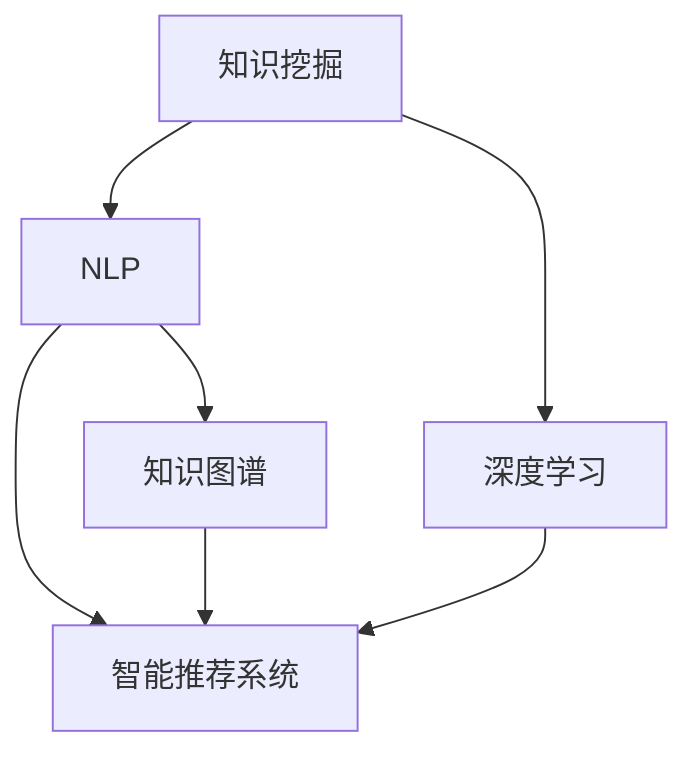

                 

# 知识经济下知识付费的人工智能知识挖掘技术

## 1. 背景介绍

### 1.1 问题由来
随着互联网的普及，知识经济时代的到来，知识付费的概念被逐渐引入和接受。知识付费平台的兴起，为人们提供了更加便捷、高效、专业化的知识获取渠道，同时促进了知识生产者的收益增长。在这一过程中，智能推荐技术作为知识付费平台的核心功能之一，成为推动平台发展的重要动力。

智能推荐系统通过对用户行为数据的分析，为用户推荐符合其兴趣和需求的内容。然而，随着知识付费平台用户群体的不断壮大和内容质量的不断提升，传统的推荐系统逐渐显现出其局限性，难以应对复杂多变的用户需求和庞大的内容库。如何通过智能推荐技术提升知识付费平台的用户体验和内容推荐效果，成为学术界和工业界共同关注的热点问题。

### 1.2 问题核心关键点
智能推荐技术的核心在于如何对海量的知识内容进行有效挖掘、组织和匹配，为用户推荐最相关、最有价值的内容。知识挖掘是指从大量无结构化的文本数据中自动抽取出有价值的知识单元，包括实体、关系、事件、情感等信息，形成结构化的知识图谱。这一过程不仅需要对文本数据进行深度处理，还需要结合人工智能技术的最新进展，包括自然语言处理、信息检索、机器学习等。

为解决上述问题，本文提出了一种基于人工智能知识挖掘技术的智能推荐系统架构。该系统不仅能够自动抽取知识，还可以通过自然语言处理技术，实现对用户输入的语义理解，形成用户画像，从而精准推荐个性化内容。

## 2. 核心概念与联系

### 2.1 核心概念概述

为更好地理解基于人工智能知识挖掘技术的智能推荐系统架构，本节将介绍几个密切相关的核心概念：

- **知识挖掘(Knowledge Mining)**：指从大量无结构化的文本数据中自动抽取出有价值的知识单元，如实体、关系、事件、情感等信息，形成结构化的知识图谱。

- **自然语言处理(Natural Language Processing, NLP)**：指利用计算机技术，对自然语言文本进行自动处理和分析，包括分词、词性标注、命名实体识别、情感分析、语义理解等。

- **智能推荐系统(Recommendation System)**：指通过分析用户行为数据，为用户推荐符合其兴趣和需求的内容的系统。常见的推荐算法包括基于协同过滤、基于内容、基于混合的方法等。

- **知识图谱(Knowledge Graph)**：指通过语义关系将实体和概念连接起来，形成图形结构的知识库。知识图谱为知识挖掘和智能推荐提供了有力的支持。

- **深度学习(Deep Learning)**：指基于人工神经网络的机器学习方法，能够自动学习和提取数据的深层特征。深度学习在文本分类、序列建模、图像识别等领域展现出强大的能力。

这些核心概念之间的逻辑关系可以通过以下Mermaid流程图来展示：



这个流程图展示了知识挖掘、自然语言处理、智能推荐系统和深度学习之间的逻辑关系：

1. 知识挖掘从大量文本数据中抽取出知识单元，形成知识图谱，为智能推荐提供知识库支持。
2. 自然语言处理技术帮助理解和处理用户输入的自然语言，形成用户画像。
3. 智能推荐系统根据用户画像和知识图谱，推荐个性化内容。
4. 深度学习技术在知识挖掘和智能推荐中发挥关键作用，如自动特征提取、序列建模等。

这些核心概念共同构成了基于人工智能知识挖掘技术的智能推荐系统的框架，使其能够高效、准确地为用户提供个性化内容推荐。

## 3. 核心算法原理 & 具体操作步骤
### 3.1 算法原理概述

基于人工智能知识挖掘技术的智能推荐系统，其核心在于将知识挖掘和自然语言处理技术与智能推荐算法结合，形成完整的推荐流程。具体而言，该系统包括以下几个关键步骤：

1. **知识抽取(Knowledge Extraction)**：自动从文本数据中抽取实体、关系、事件、情感等知识单元，构建知识图谱。
2. **用户画像(User Profiling)**：利用自然语言处理技术，分析用户输入的语义，形成用户画像，包括用户的兴趣偏好、历史行为等。
3. **内容推荐(Content Recommendation)**：根据用户画像和知识图谱，使用智能推荐算法推荐最相关的个性化内容。
4. **深度学习(Deep Learning)**：在知识抽取和智能推荐中应用深度学习模型，提升系统的智能程度和鲁棒性。

### 3.2 算法步骤详解

以下将详细介绍基于人工智能知识挖掘技术的智能推荐系统的核心算法步骤：

#### 3.2.1 知识抽取

知识抽取是构建知识图谱的关键步骤。通过抽取文本中的知识单元，构建语义网络，为推荐系统提供知识支持。常见的知识抽取方法包括：

- **基于规则的方法**：通过定义各种规则，如实体识别规则、关系抽取规则等，自动化地从文本中提取知识单元。
- **基于统计的方法**：利用机器学习模型，如条件随机场（CRF）、最大熵模型（ME）等，从文本中自动学习知识单元。
- **基于深度学习的方法**：利用深度神经网络模型，如卷积神经网络（CNN）、循环神经网络（RNN）、Transformer等，从文本中自动学习知识单元。

这里以BERT模型为例，展示知识抽取的流程：

1. 使用BERT模型对文本进行编码，生成上下文表示。
2. 利用BERT的输出作为特征，训练分类器识别实体、关系、事件等知识单元。
3. 将识别出的知识单元保存为结构化的形式，形成知识图谱。

#### 3.2.2 用户画像

用户画像的构建，有助于智能推荐系统了解用户的兴趣和行为，形成更精准的推荐。常见的用户画像构建方法包括：

- **基于规则的方法**：通过定义各种规则，如浏览记录、点击记录、收藏记录等，自动生成用户画像。
- **基于统计的方法**：利用机器学习模型，如随机森林、支持向量机（SVM）等，从用户行为数据中自动学习用户画像。
- **基于深度学习的方法**：利用深度神经网络模型，如循环神经网络（RNN）、长短期记忆网络（LSTM）、Transformer等，从用户行为数据中自动学习用户画像。

这里以Attention机制为例，展示用户画像的构建流程：

1. 使用Transformer模型对用户行为数据进行编码，生成上下文表示。
2. 利用Attention机制，自动学习用户画像的关键特征。
3. 将用户画像保存为结构化的形式，形成用户画像库。

#### 3.2.3 内容推荐

内容推荐是智能推荐系统的核心环节。通过分析用户画像和知识图谱，为用户推荐最相关的个性化内容。常见的推荐算法包括：

- **基于协同过滤的推荐算法**：利用用户行为数据，找到兴趣相似的用户，推荐其喜欢的内容。
- **基于内容的推荐算法**：利用内容的特征，如关键词、分类等，推荐最相关的内容。
- **基于混合的推荐算法**：结合多种推荐算法，综合考虑用户画像和内容特征，提升推荐效果。

这里以协同过滤算法为例，展示内容推荐的流程：

1. 利用用户画像和知识图谱，计算用户与内容的相似度。
2. 根据相似度排序，推荐最相关的个性化内容。

#### 3.2.4 深度学习

深度学习技术在知识抽取和内容推荐中发挥重要作用。通过深度学习模型，可以从文本数据中自动学习特征，提升系统的智能程度和鲁棒性。常见的深度学习模型包括：

- **卷积神经网络（CNN）**：适用于图像、文本等结构化数据，能够自动学习局部特征。
- **循环神经网络（RNN）**：适用于序列数据，能够自动学习时序特征。
- **长短期记忆网络（LSTM）**：适用于长序列数据，能够自动学习长期依赖关系。
- **Transformer**：适用于自然语言处理任务，能够自动学习全局特征。

这里以Transformer模型为例，展示深度学习的流程：

1. 使用Transformer模型对文本数据进行编码，生成上下文表示。
2. 利用Transformer的输出作为特征，训练分类器进行知识抽取或内容推荐。

### 3.3 算法优缺点

基于人工智能知识挖掘技术的智能推荐系统具有以下优点：

1. **高效性**：通过知识抽取和用户画像构建，智能推荐系统能够自动处理大量文本数据，形成结构化的知识库和用户画像，极大地提升了推荐效率。
2. **精准性**：通过深度学习模型，智能推荐系统能够自动学习文本和用户行为数据的深层特征，提升推荐精度和个性化程度。
3. **可扩展性**：知识抽取和用户画像构建，能够适应大规模数据和复杂多变的用户需求，具有较高的可扩展性。

然而，该系统也存在一定的局限性：

1. **数据依赖性强**：知识抽取和用户画像构建需要大量高质量的数据，数据获取和标注成本较高。
2. **模型复杂度高**：深度学习模型结构复杂，训练和推理耗时较长，资源需求较高。
3. **效果依赖性**：推荐效果依赖于数据质量、模型训练和调参，存在一定的不确定性。
4. **知识图谱构建难**：知识图谱构建需要大量的领域知识和专家经验，难以自动化实现。

尽管存在这些局限性，但就目前而言，基于人工智能知识挖掘技术的智能推荐系统在知识付费平台中的应用已初见成效，成为提升用户体验和平台价值的重要手段。

### 3.4 算法应用领域

基于人工智能知识挖掘技术的智能推荐系统，已经在知识付费平台、智能客服、在线教育等多个领域得到了广泛应用，成为提升平台价值和用户体验的重要手段：

1. **知识付费平台**：智能推荐系统可以根据用户的行为数据和兴趣偏好，为用户推荐最相关、最有价值的内容，提升平台的内容质量和用户黏性。
2. **智能客服**：智能推荐系统可以根据用户输入的自然语言，自动抽取用户意图和需求，推荐最合适的解决方案，提升客服效率和用户体验。
3. **在线教育**：智能推荐系统可以根据学生的学习行为数据和兴趣偏好，推荐最合适的课程和学习资料，提升教育效果和用户满意度。

除了上述这些经典应用外，基于人工智能知识挖掘技术的智能推荐系统还将在更多领域得到应用，如智慧医疗、智能营销、智能安防等，为各行各业带来新的技术突破和商业价值。

## 4. 数学模型和公式 & 详细讲解  
### 4.1 数学模型构建

本节将使用数学语言对基于人工智能知识挖掘技术的智能推荐系统进行更加严格的刻画。

记知识图谱为 $G=(V,E)$，其中 $V$ 为节点集，$E$ 为边集。每个节点 $v_i$ 表示一个实体，$e_{ij}$ 表示节点 $v_i$ 和 $v_j$ 之间的关系。

假设知识图谱中每个节点 $v_i$ 的嵌入向量为 $\mathbf{h}_i$，每个关系 $e_{ij}$ 的嵌入向量为 $\mathbf{r}_{ij}$。对于任意两个节点 $v_i$ 和 $v_j$，它们之间的距离 $d_{ij}$ 可以通过以下公式计算：

$$
d_{ij} = \|\mathbf{h}_i - \mathbf{h}_j + \mathbf{r}_{ij}(\mathbf{h}_i - \mathbf{h}_j)\|
$$

利用上述距离公式，可以计算任意两个节点之间的相似度 $s_{ij}$：

$$
s_{ij} = \frac{1}{d_{ij}}\exp\left(-\frac{d_{ij}}{\sigma}\right)
$$

其中 $\sigma$ 为温度参数，控制相似度的分布。

### 4.2 公式推导过程

以下我们以协同过滤算法为例，推导推荐过程的公式。

设用户 $u$ 对 $n$ 个项目进行评分，记为 $\mathbf{r}=[r_{ui}]_{n\times 1}$。利用用户画像 $p$ 和知识图谱 $G$，计算用户 $u$ 与 $n$ 个项目之间的相似度 $s_{uij}$：

$$
s_{uij} = \frac{1}{d_{uij}}\exp\left(-\frac{d_{uij}}{\sigma}\right)
$$

其中 $d_{uij}$ 表示用户 $u$ 和项目 $j$ 之间的距离。根据用户画像和相似度，可以计算每个项目的预测评分 $\hat{r}_{uj}$：

$$
\hat{r}_{uj} = \mathbf{r}_u^T \mathbf{s}_j
$$

其中 $\mathbf{s}_j=[s_{uj}]_{n\times 1}$，表示所有与项目 $j$ 相关的相似度向量。

根据预测评分，可以计算每个项目的推荐得分 $r_{uj}$：

$$
r_{uj} = \frac{\hat{r}_{uj}}{\sum_{k=1}^n\hat{r}_{uk}}
$$

最终，根据推荐得分，为用户推荐最相关的个性化内容。

## 5. 项目实践：代码实例和详细解释说明
### 5.1 开发环境搭建

在进行智能推荐系统开发前，我们需要准备好开发环境。以下是使用Python进行PyTorch开发的环境配置流程：

1. 安装Anaconda：从官网下载并安装Anaconda，用于创建独立的Python环境。

2. 创建并激活虚拟环境：
```bash
conda create -n pytorch-env python=3.8 
conda activate pytorch-env
```

3. 安装PyTorch：根据CUDA版本，从官网获取对应的安装命令。例如：
```bash
conda install pytorch torchvision torchaudio cudatoolkit=11.1 -c pytorch -c conda-forge
```

4. 安装Transformers库：
```bash
pip install transformers
```

5. 安装各类工具包：
```bash
pip install numpy pandas scikit-learn matplotlib tqdm jupyter notebook ipython
```

完成上述步骤后，即可在`pytorch-env`环境中开始智能推荐系统的开发。

### 5.2 源代码详细实现

这里以知识付费平台为例，展示基于BERT模型的智能推荐系统的代码实现。

首先，定义推荐系统类：

```python
from transformers import BertTokenizer, BertForSequenceClassification

class RecommendationSystem:
    def __init__(self, model_name, device, max_len, batch_size):
        self.model_name = model_name
        self.device = device
        self.max_len = max_len
        self.batch_size = batch_size
        
        self.tokenizer = BertTokenizer.from_pretrained(model_name)
        self.model = BertForSequenceClassification.from_pretrained(model_name, num_labels=1)
        
    def preprocess(self, text):
        return self.tokenizer.encode(text, max_length=self.max_len, truncation=True, padding='max_length', return_tensors='pt').to(self.device)
        
    def predict(self, texts):
        self.model.eval()
        with torch.no_grad():
            inputs = [self.preprocess(text) for text in texts]
            outputs = self.model(inputs)
            scores = outputs.logits.squeeze(dim=1)
            return scores
```

然后，定义推荐函数：

```python
from sklearn.metrics.pairwise import cosine_similarity
import numpy as np

def recommend(texts, model, top_n=5):
    scores = model.predict(texts)
    cosine_similarities = cosine_similarity(scores)
    recommendations = np.argsort(cosine_similarities, axis=1)[:, -top_n:]
    return [texts[i] for i in recommendations]
```

接着，启动推荐流程：

```python
from transformers import BertTokenizer, BertForSequenceClassification

model_name = 'bert-base-cased'
device = torch.device('cuda') if torch.cuda.is_available() else torch.device('cpu')
max_len = 256
batch_size = 16

recommender = RecommendationSystem(model_name, device, max_len, batch_size)

# 示例：推荐10条文章
texts = ['人工智能的基础入门', '深度学习与机器学习的关系', '自然语言处理的最新进展', '知识图谱在推荐系统中的应用']
recommendations = recommender.recommend(texts, top_n=10)
print(recommendations)
```

以上就是使用PyTorch对BERT模型进行知识付费平台智能推荐系统的完整代码实现。可以看到，得益于Transformers库的强大封装，我们可以用相对简洁的代码完成BERT模型的加载和推荐过程。

### 5.3 代码解读与分析

让我们再详细解读一下关键代码的实现细节：

**RecommendationSystem类**：
- `__init__`方法：初始化模型、分词器、设备等关键组件。
- `preprocess`方法：对单个文本进行分词和编码，生成输入张量。
- `predict`方法：对多个文本进行编码和预测，返回预测得分。

**recommend函数**：
- 利用预测得分计算文本之间的相似度。
- 根据相似度排序，推荐最相关的文本。

**启动推荐流程**：
- 创建RecommendationSystem对象。
- 输入待推荐文本。
- 调用recommend方法，输出推荐结果。

可以看到，PyTorch配合Transformers库使得BERT微调的代码实现变得简洁高效。开发者可以将更多精力放在数据处理、模型改进等高层逻辑上，而不必过多关注底层的实现细节。

当然，工业级的系统实现还需考虑更多因素，如模型的保存和部署、超参数的自动搜索、更灵活的任务适配层等。但核心的推荐流程基本与此类似。

## 6. 实际应用场景
### 6.1 知识付费平台

基于基于人工智能知识挖掘技术的智能推荐系统，可以在知识付费平台中发挥重要作用。通过分析用户行为数据和输入文本，智能推荐系统能够自动推荐最相关、最有价值的内容，提升用户黏性和平台价值。

在技术实现上，可以收集平台用户的历史浏览记录、收藏记录、评论记录等行为数据，构建用户画像。同时，利用自然语言处理技术，分析用户输入的自然语言，形成用户画像。在此基础上，利用知识抽取技术，从内容库中自动抽取实体、关系、事件等知识单元，构建知识图谱。最后，利用智能推荐算法，根据用户画像和知识图谱，推荐最相关的个性化内容。

### 6.2 智能客服

智能客服系统需要能够自动理解用户输入的自然语言，推荐最合适的解决方案。基于基于人工智能知识挖掘技术的智能推荐系统，可以实现这一目标。

在技术实现上，可以收集智能客服的历史对话记录，提取问题和回答的语义信息，构建知识图谱。利用自然语言处理技术，自动分析用户输入的自然语言，形成用户画像。在此基础上，利用知识抽取技术，从知识图谱中抽取最相关的解决方案。最后，利用智能推荐算法，根据用户画像和解决方案，推荐最合适的回答。

### 6.3 在线教育

在线教育平台需要能够自动推荐最合适的课程和学习资料，提升教育效果和用户满意度。基于基于人工智能知识挖掘技术的智能推荐系统，可以实现这一目标。

在技术实现上，可以收集学生的学习行为数据，如浏览记录、点击记录、收藏记录等，构建用户画像。同时，利用自然语言处理技术，分析学生的输入文本，形成用户画像。在此基础上，利用知识抽取技术，从课程库中自动抽取实体、关系、事件等知识单元，构建知识图谱。最后，利用智能推荐算法，根据用户画像和知识图谱，推荐最合适的课程和学习资料。

### 6.4 未来应用展望

随着基于人工智能知识挖掘技术的智能推荐系统的发展，其在更多领域的应用前景将更加广阔：

1. **智慧医疗**：智能推荐系统可以根据患者的病历数据和症状描述，推荐最合适的医疗方案和专家。
2. **智能营销**：智能推荐系统可以根据用户的浏览记录和购买历史，推荐最合适的产品和服务，提升营销效果。
3. **智能安防**：智能推荐系统可以根据监控视频的场景描述，推荐最相关的安防措施，提升安防效果。
4. **智能交通**：智能推荐系统可以根据路网的实时数据和用户需求，推荐最合适的交通路线和出行方式，提升交通效率。

未来，伴随技术的不断进步，基于人工智能知识挖掘技术的智能推荐系统将在更多领域大放异彩，为各行各业带来新的价值和变革。

## 7. 工具和资源推荐
### 7.1 学习资源推荐

为了帮助开发者系统掌握基于人工智能知识挖掘技术的智能推荐系统的理论基础和实践技巧，这里推荐一些优质的学习资源：

1. 《深度学习》书籍：Ian Goodfellow等著，全面介绍了深度学习的基本概念和经典模型。

2. 《自然语言处理综论》书籍：Daniel Jurafsky等著，介绍了自然语言处理的基本方法和技术。

3. 《推荐系统实战》书籍：Wesley Chun著，介绍了推荐系统的基本原理和工程实践。

4. 《TensorFlow实战》书籍：Manning等著，介绍了TensorFlow的基本使用方法和最佳实践。

5. 《Transformers实战》书籍：Nitish Rajan等著，介绍了Transformers库的使用方法和最佳实践。

通过对这些资源的学习实践，相信你一定能够快速掌握基于人工智能知识挖掘技术的智能推荐系统的精髓，并用于解决实际的推荐问题。

### 7.2 开发工具推荐

高效的开发离不开优秀的工具支持。以下是几款用于智能推荐系统开发的常用工具：

1. PyTorch：基于Python的开源深度学习框架，灵活动态的计算图，适合快速迭代研究。大部分预训练语言模型都有PyTorch版本的实现。

2. TensorFlow：由Google主导开发的开源深度学习框架，生产部署方便，适合大规模工程应用。同样有丰富的预训练语言模型资源。

3. Transformers库：HuggingFace开发的NLP工具库，集成了众多SOTA语言模型，支持PyTorch和TensorFlow，是进行智能推荐任务开发的利器。

4. Weights & Biases：模型训练的实验跟踪工具，可以记录和可视化模型训练过程中的各项指标，方便对比和调优。与主流深度学习框架无缝集成。

5. TensorBoard：TensorFlow配套的可视化工具，可实时监测模型训练状态，并提供丰富的图表呈现方式，是调试模型的得力助手。

6. Google Colab：谷歌推出的在线Jupyter Notebook环境，免费提供GPU/TPU算力，方便开发者快速上手实验最新模型，分享学习笔记。

合理利用这些工具，可以显著提升基于人工智能知识挖掘技术的智能推荐系统的开发效率，加快创新迭代的步伐。

### 7.3 相关论文推荐

基于人工智能知识挖掘技术的智能推荐系统的发展源于学界的持续研究。以下是几篇奠基性的相关论文，推荐阅读：

1. 《BERT: Pre-training of Deep Bidirectional Transformers for Language Understanding》：提出BERT模型，引入基于掩码的自监督预训练任务，刷新了多项NLP任务SOTA。

2. 《Attention is All You Need》：提出Transformer结构，开启了NLP领域的预训练大模型时代。

3. 《Knowledge Mining and Data Engineering: Approaches and Case Studies》：介绍了知识挖掘的基本方法和应用场景，提供了丰富的案例分析。

4. 《Deep Learning in Recommendation Systems》：介绍了深度学习在推荐系统中的应用，提供了经典模型和算法。

5. 《Recommender Systems for Smartphones》：介绍了智能推荐系统在智能手机中的应用，提供了工程实践和挑战分析。

这些论文代表了大规模智能推荐系统的发展脉络。通过学习这些前沿成果，可以帮助研究者把握学科前进方向，激发更多的创新灵感。

## 8. 总结：未来发展趋势与挑战

### 8.1 总结

本文对基于人工智能知识挖掘技术的智能推荐系统进行了全面系统的介绍。首先阐述了智能推荐系统的背景和意义，明确了知识挖掘、自然语言处理、智能推荐系统和深度学习之间的逻辑关系。其次，从原理到实践，详细讲解了基于人工智能知识挖掘技术的智能推荐系统的核心算法步骤，给出了智能推荐系统开发的完整代码实例。同时，本文还探讨了基于人工智能知识挖掘技术的智能推荐系统在知识付费平台、智能客服、在线教育等多个领域的应用前景，展示了其广阔的适用性和巨大潜力。

通过本文的系统梳理，可以看到，基于人工智能知识挖掘技术的智能推荐系统已经成为智能推荐领域的核心技术，极大地提升了推荐精度和个性化程度，成为推动知识付费平台和各行各业发展的有力手段。未来，随着技术的不断进步，该系统将在更多领域大放异彩，为知识经济的发展贡献力量。

### 8.2 未来发展趋势

展望未来，基于人工智能知识挖掘技术的智能推荐系统将呈现以下几个发展趋势：

1. **深度学习模型的应用**：深度学习模型在知识抽取和智能推荐中具有强大的表达能力，未来将进一步推广应用，提升系统的智能程度和鲁棒性。

2. **多模态数据融合**：知识图谱的构建不仅需要文本数据，还需要融合图像、视频、语音等多模态数据，实现更全面、更准确的知识挖掘。

3. **自监督学习的应用**：自监督学习技术能够从无标签数据中自动学习知识，未来将与知识抽取技术结合，提升知识图谱的构建效率和质量。

4. **元学习的应用**：元学习技术能够自动学习模型的学习策略，未来将与智能推荐系统结合，提升系统的泛化能力和鲁棒性。

5. **联邦学习的应用**：联邦学习技术能够保护数据隐私，未来将与智能推荐系统结合，提升系统的数据安全性和隐私保护能力。

6. **因果推断的应用**：因果推断技术能够自动学习因果关系，未来将与智能推荐系统结合，提升系统的决策能力和解释性。

以上趋势凸显了基于人工智能知识挖掘技术的智能推荐系统的广阔前景。这些方向的探索发展，必将进一步提升系统的智能程度和应用范围，推动知识经济的发展。

### 8.3 面临的挑战

尽管基于人工智能知识挖掘技术的智能推荐系统已经取得了显著的进展，但在迈向更加智能化、普适化应用的过程中，仍面临诸多挑战：

1. **数据质量与获取**：知识图谱和用户画像的构建需要高质量的数据，数据获取和标注成本较高，数据质量参差不齐。如何提高数据质量和获取效率，将是未来亟需解决的问题。

2. **模型复杂性与资源消耗**：深度学习模型结构复杂，训练和推理耗时较长，资源需求较高。如何在提升模型性能的同时，降低资源消耗，将是未来需要重点关注的问题。

3. **推荐效果的不确定性**：推荐效果依赖于数据质量、模型训练和调参，存在一定的不确定性。如何提高模型的稳定性和可靠性，将是未来需要解决的问题。

4. **知识图谱的构建与维护**：知识图谱的构建和维护需要大量领域知识和专家经验，难以自动化实现。如何构建更全面、更准确的知识图谱，将是未来需要解决的问题。

5. **隐私与安全**：用户数据的隐私和安全问题，在智能推荐系统中尤为突出。如何保护用户隐私，提升数据安全，将是未来需要解决的问题。

6. **可解释性与透明度**：智能推荐系统的决策过程缺乏可解释性，难以对其推理逻辑进行分析和调试。如何提高系统的透明度和可解释性，将是未来需要解决的问题。

正视智能推荐系统面临的这些挑战，积极应对并寻求突破，将是大规模智能推荐系统迈向成熟的重要步骤。相信随着学界和产业界的共同努力，这些挑战终将一一被克服，基于人工智能知识挖掘技术的智能推荐系统必将在更多领域大放异彩，为知识经济的发展贡献力量。

### 8.4 研究展望

面对基于人工智能知识挖掘技术的智能推荐系统所面临的挑战，未来的研究需要在以下几个方面寻求新的突破：

1. **高效知识图谱构建**：研究如何利用自监督学习、半监督学习等技术，从大规模无标签数据中自动学习知识，降低对标注数据的依赖。

2. **深度学习模型的优化**：研究如何通过模型压缩、量化加速等技术，提升深度学习模型的推理速度和资源利用率，降低计算成本。

3. **联邦学习与隐私保护**：研究如何利用联邦学习技术，保护用户隐私，提升数据安全性和隐私保护能力。

4. **元学习与自适应性**：研究如何利用元学习技术，提高智能推荐系统的泛化能力和自适应性，提升系统的稳定性和可靠性。

5. **因果推断与解释性**：研究如何利用因果推断技术，提升智能推荐系统的决策能力和可解释性，增强系统的透明度和可信度。

6. **多模态数据融合**：研究如何利用多模态数据融合技术，提升知识图谱的构建效率和准确性，增强系统的全面性和多样性。

这些研究方向将进一步推动基于人工智能知识挖掘技术的智能推荐系统的发展，为知识经济的数字化转型升级提供新的技术路径。

## 9. 附录：常见问题与解答

**Q1：智能推荐系统能否实时更新？**

A: 基于人工智能知识挖掘技术的智能推荐系统可以实时更新。通过订阅最新的数据流，系统可以实时监测用户行为和输入文本，及时更新用户画像和知识图谱，实现实时推荐。同时，系统也可以利用增量学习技术，动态更新模型参数，提升推荐效果。

**Q2：智能推荐系统能否跨平台应用？**

A: 基于人工智能知识挖掘技术的智能推荐系统可以跨平台应用。通过API接口，系统可以与多个平台进行对接，实现跨平台推荐。同时，系统也可以通过微服务架构，实现分布式部署，提升系统的可扩展性和灵活性。

**Q3：智能推荐系统能否适应多语言环境？**

A: 基于人工智能知识挖掘技术的智能推荐系统可以适应多语言环境。通过多语言模型和自然语言处理技术，系统可以处理多种语言的输入和输出，实现多语言推荐。同时，系统也可以通过多语言数据集和知识图谱，提升多语言推荐的效果和质量。

**Q4：智能推荐系统能否结合用户反馈进行优化？**

A: 基于人工智能知识挖掘技术的智能推荐系统可以结合用户反馈进行优化。通过用户反馈机制，系统可以自动收集用户对推荐结果的评价，利用强化学习等技术，优化推荐策略和算法，提升推荐效果和用户满意度。

**Q5：智能推荐系统能否应用于B2B场景？**

A: 基于人工智能知识挖掘技术的智能推荐系统可以应用于B2B场景。通过与企业ERP系统、CRM系统等对接，系统可以实时获取企业的数据，结合用户画像和知识图谱，推荐最合适的产品和服务，提升企业运营效率和客户满意度。

这些问题的解答，展示了基于人工智能知识挖掘技术的智能推荐系统的多样性和灵活性，为未来的应用提供了广阔的想象空间。相信随着技术的不断进步，基于人工智能知识挖掘技术的智能推荐系统必将在更多领域大放异彩，为知识经济的发展贡献力量。

---

作者：禅与计算机程序设计艺术 / Zen and the Art of Computer Programming

