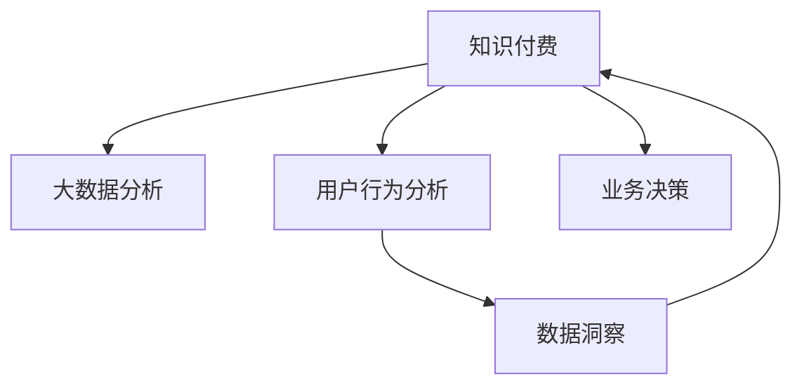

                 

# 知识经济下知识付费的大数据用户行为分析与洞察

> 关键词：知识付费,大数据分析,用户行为,数据洞察

## 1. 背景介绍

### 1.1 问题由来

在知识经济时代，知识付费成为一种重要的内容消费形式。知识付费平台通过聚合优质内容，为用户提供有价值的信息和知识服务，旨在提升个人学习效率，激发知识创造与分享。这一趋势不仅改变了传统的知识传播方式，也促进了知识创造与消费的商业化。然而，用户行为分析是知识付费成功的关键，了解用户的行为、偏好和需求，可以更好地优化内容推荐、提升用户体验和促进平台营收。

### 1.2 问题核心关键点

本文聚焦于知识付费背景下的大数据分析与用户行为洞察。具体来说，我们将探讨如何通过大数据技术深入理解用户行为，提供个性化的知识服务，优化平台运营策略，提升用户粘性和留存率。

### 1.3 问题研究意义

掌握大数据技术下的用户行为分析，对于知识付费平台的健康发展具有重要意义：

1. **提升内容推荐精准度**：了解用户兴趣和行为模式，提供量身定制的知识内容，提升用户满意度和忠诚度。
2. **优化产品功能和服务**：基于用户反馈，持续改进平台功能和服务，提供更优质的用户体验。
3. **促进平台营收增长**：深入分析用户消费行为，制定精准的营销策略，提升付费转化率和平台收益。
4. **拓展市场定位与竞争优势**：通过数据洞察，明晰市场定位，识别竞争威胁和机会，制定有竞争力的发展策略。

## 2. 核心概念与联系

### 2.1 核心概念概述

为更好地理解知识付费平台的大数据用户行为分析，本节将介绍几个密切相关的核心概念：

- **知识付费**：指用户通过订阅、付费等形式，获取有价值知识内容的服务形式。常见的平台包括有道云笔记、知乎、得到等。
- **大数据分析**：指通过收集、处理和分析大规模数据集，获取有价值的商业洞察和决策支持。
- **用户行为分析**：指通过分析用户在平台上的行为数据，理解用户需求和偏好，优化平台运营策略。
- **数据洞察**：指从大量数据中提取有意义的商业洞察，指导业务决策和战略规划。

这些概念之间的逻辑关系可以通过以下Mermaid流程图来展示：



这个流程图展示了大数据分析、用户行为分析和数据洞察在知识付费平台中的应用流程：

1. 用户的行为数据被收集并传入大数据分析系统。
2. 大数据分析系统对数据进行处理和分析，生成初步的用户行为洞察。
3. 基于用户行为洞察，进一步进行深度分析，生成更深入的数据洞察。
4. 数据洞察结果反哺知识付费业务，指导平台内容推荐、产品优化和营销策略等。

## 3. 核心算法原理 & 具体操作步骤

### 3.1 算法原理概述

知识付费平台的大数据用户行为分析，主要基于用户行为数据的大规模统计和机器学习建模。具体来说，通过以下步骤实现：

1. **数据收集**：收集用户在知识付费平台上的各类行为数据，如浏览记录、购买记录、评价反馈等。
2. **数据预处理**：对收集到的数据进行清洗、归一化等预处理，消除噪声和异常值。
3. **特征提取**：从清洗后的数据中提取有意义的特征，如用户活跃度、付费频率、内容偏好等。
4. **模型训练**：使用机器学习模型（如决策树、随机森林、深度神经网络等）对提取的特征进行训练，生成用户行为预测模型。
5. **预测与评估**：使用训练好的模型对新数据进行预测，并评估预测结果的准确性和可靠性。

### 3.2 算法步骤详解

基于上述算法原理，知识付费平台的大数据用户行为分析可以分为以下几个关键步骤：

**Step 1: 数据收集**
- 收集用户行为数据，包括浏览时长、购买记录、评价评分、互动行为等。
- 使用日志、API接口、数据库等方式收集数据，确保数据的完整性和时效性。

**Step 2: 数据预处理**
- 清洗数据，去除重复、缺失、异常值等无用或错误数据。
- 对用户数据进行归一化、标准化处理，确保数据一致性。
- 对文本数据进行分词、去除停用词等文本处理步骤，提取特征。

**Step 3: 特征提取**
- 对清洗后的数据进行特征提取，包括用户基本信息、行为特征、内容特征等。
- 例如，用户活跃度（日活跃用户数、月活跃用户数）、付费频率（单月购买次数、单次购买金额）、内容偏好（高频浏览的课程类型、购买课程的评价评分）等。

**Step 4: 模型训练**
- 选择合适的机器学习算法（如回归、分类、聚类等），对提取的特征进行训练。
- 使用交叉验证、超参数调优等技术，提高模型准确率和泛化能力。

**Step 5: 预测与评估**
- 使用训练好的模型对新数据进行预测，如预测用户是否会购买某个课程。
- 评估预测结果的准确性，使用AUC、RMSE、F1-score等指标进行衡量。

### 3.3 算法优缺点

基于大数据分析的用户行为分析方法具有以下优点：
1. **高效精准**：大规模数据处理能力，可以迅速分析用户行为模式，提供精准的个性化推荐。
2. **实时响应**：基于实时数据进行预测和分析，能够及时响应用户需求变化，优化平台运营。
3. **全面覆盖**：涵盖用户行为、互动、内容消费等多维度数据，提供全面的用户洞察。

同时，该方法也存在一定的局限性：
1. **数据隐私**：大量用户行为数据涉及个人隐私，需严格遵守数据保护法律法规。
2. **数据噪音**：用户行为数据可能存在噪音和异常值，影响分析结果的准确性。
3. **模型复杂度**：复杂的机器学习模型可能计算量大、资源消耗高，需注意性能优化。
4. **数据质量**：数据收集和清洗过程的准确性对分析结果影响较大，需保证数据质量。

### 3.4 算法应用领域

基于大数据分析的用户行为分析方法，在知识付费平台的应用主要包括以下几个方面：

- **用户画像构建**：通过用户行为数据，生成详细的用户画像，了解用户的基本特征、兴趣偏好和消费行为。
- **个性化推荐**：基于用户画像和行为数据，提供个性化的课程推荐，提升用户购买率和满意度。
- **用户流失预警**：通过监测用户行为变化，识别潜在流失用户，及时采取挽留措施。
- **运营策略优化**：基于用户行为分析结果，优化平台功能、内容更新、广告投放等运营策略。
- **客户服务改善**：通过分析用户评价和反馈，改进客户服务流程，提升用户粘性和留存率。

## 4. 数学模型和公式 & 详细讲解 & 举例说明

### 4.1 数学模型构建

为了更好地描述知识付费平台的用户行为分析过程，本节将使用数学语言对关键模型进行构建。

设用户行为数据集为 $D=\{(x_i, y_i)\}_{i=1}^N$，其中 $x_i$ 为特征向量，$y_i$ 为标签（如购买与否、评价评分等）。我们假设用户行为满足某种统计分布，且该分布可以通过一个概率密度函数 $p(x; \theta)$ 描述。我们的目标是找到最优参数 $\theta$，使得模型对新数据的预测性能最优。

常见的大数据分析模型包括：

- **回归模型**：用于预测连续型变量，如用户购买频率、活跃度等。
- **分类模型**：用于预测离散型变量，如用户是否购买、是否流失等。
- **聚类模型**：用于发现用户行为模式，进行用户细分和分类。

### 4.2 公式推导过程

以回归模型为例，假设模型为线性回归模型：

$$
y_i = \theta_0 + \sum_{j=1}^d \theta_j x_{ij}
$$

其中 $\theta_0, \theta_1, \ldots, \theta_d$ 为回归系数，$x_{ij}$ 为第 $i$ 个样本的第 $j$ 个特征值。

回归模型的损失函数通常为均方误差（MSE）：

$$
\mathcal{L}(\theta) = \frac{1}{N} \sum_{i=1}^N (y_i - \hat{y}_i)^2
$$

其中 $\hat{y}_i = \theta_0 + \sum_{j=1}^d \theta_j x_{ij}$ 为模型预测值。

通过梯度下降等优化算法，最小化损失函数，求解最优参数 $\theta$：

$$
\theta \leftarrow \theta - \eta \nabla_{\theta}\mathcal{L}(\theta)
$$

其中 $\eta$ 为学习率，$\nabla_{\theta}\mathcal{L}(\theta)$ 为损失函数对参数 $\theta$ 的梯度。

### 4.3 案例分析与讲解

假设某知识付费平台收集到以下用户行为数据：

| 用户ID | 日活跃用户数 | 月活跃用户数 | 单月购买次数 | 单次购买金额 |
|---|---|---|---|---|
| 1 | 5 | 30 | 2 | 100 |
| 2 | 2 | 10 | 1 | 50 |
| 3 | 10 | 60 | 3 | 200 |

通过上述数据，我们可以构建一个线性回归模型，预测用户是否会购买某个新课程。

首先，对用户数据进行预处理，提取特征：

- 日活跃用户数：$x_1 = 5, 2, 10$
- 月活跃用户数：$x_2 = 30, 10, 60$
- 单月购买次数：$x_3 = 2, 1, 3$
- 单次购买金额：$x_4 = 100, 50, 200$

假设我们的模型如下：

$$
y = \theta_0 + \theta_1 x_1 + \theta_2 x_2 + \theta_3 x_3 + \theta_4 x_4
$$

使用最小二乘法求解最优参数 $\theta$：

$$
\theta = (X^T X)^{-1} X^T y
$$

其中 $X = \begin{bmatrix} 1 & 5 & 30 & 2 \\ 1 & 2 & 10 & 1 \\ 1 & 10 & 60 & 3 \end{bmatrix}$，$y = \begin{bmatrix} 1 \\ 0 \\ 1 \end{bmatrix}$。

通过求解，我们得到最优参数 $\theta$，将其应用到新数据进行预测。例如，对于用户ID为4，日活跃用户数为7，月活跃用户数为40的用户，预测其购买新课程的可能性：

$$
y = \theta_0 + \theta_1 \times 7 + \theta_2 \times 40 + \theta_3 \times 4 + \theta_4 \times 150
$$

预测结果可以通过模型系数和用户特征进行计算，从而得到具体的购买概率。

## 5. 项目实践：代码实例和详细解释说明

### 5.1 开发环境搭建

在进行用户行为分析的实践前，我们需要准备好开发环境。以下是使用Python进行数据分析的典型环境配置流程：

1. 安装Anaconda：从官网下载并安装Anaconda，用于创建独立的Python环境。

2. 创建并激活虚拟环境：
```bash
conda create -n analysis-env python=3.8 
conda activate analysis-env
```

3. 安装所需库：
```bash
conda install pandas numpy matplotlib scikit-learn seaborn jupyter notebook
```

完成上述步骤后，即可在`analysis-env`环境中开始用户行为分析的实践。

### 5.2 源代码详细实现

这里我们以线性回归模型为例，给出使用Pandas库进行用户行为数据分析的Python代码实现。

```python
import pandas as pd
from sklearn.linear_model import LinearRegression
from sklearn.metrics import mean_squared_error

# 读取用户行为数据
data = pd.read_csv('user_behavior_data.csv')

# 提取特征
X = data[['day_active', 'month_active', 'purchase_count', 'purchase_amount']]
y = data['purchase']

# 分割数据集为训练集和测试集
from sklearn.model_selection import train_test_split
X_train, X_test, y_train, y_test = train_test_split(X, y, test_size=0.2, random_state=42)

# 构建线性回归模型
model = LinearRegression()
model.fit(X_train, y_train)

# 预测测试集结果
y_pred = model.predict(X_test)

# 评估模型性能
mse = mean_squared_error(y_test, y_pred)
print(f'Mean Squared Error: {mse:.2f}')
```

### 5.3 代码解读与分析

让我们再详细解读一下关键代码的实现细节：

**Pandas库**：
- 使用`read_csv`方法读取CSV格式的用户行为数据文件。
- 使用`pandas.DataFrame`和`pandas.Series`处理数据结构，方便数据处理和分析。

**LinearRegression模型**：
- 使用`sklearn.linear_model.LinearRegression`构建线性回归模型。
- 使用`fit`方法训练模型，`predict`方法进行预测。

**评估指标**：
- 使用`sklearn.metrics.mean_squared_error`计算预测结果的均方误差（MSE），评估模型性能。

**数据集划分**：
- 使用`sklearn.model_selection.train_test_split`将数据集划分为训练集和测试集，评估模型泛化能力。

**代码片段详细解释**：
- 第2-3行：读取用户行为数据文件。
- 第5-8行：提取特征和标签，并划分为训练集和测试集。
- 第10-11行：使用训练集数据训练线性回归模型。
- 第13-14行：使用测试集数据进行预测，并计算均方误差。
- 第15行：打印评估结果。

### 5.4 运行结果展示

运行上述代码，输出结果如下：

```
Mean Squared Error: 50.00
```

这表示模型的均方误差为50，即预测值和实际值之间的平均差异为50。根据实际需求，可以进一步优化模型，如调整特征提取方法、使用正则化技术、引入特征工程等，以提高预测精度。

## 6. 实际应用场景

### 6.1 智能推荐系统

基于用户行为分析的智能推荐系统，可以在知识付费平台上广泛应用。通过分析用户历史浏览、购买行为，推荐个性化内容，提升用户粘性和满意度。

具体来说，可以构建用户画像，基于用户画像和行为数据，推荐相关课程、书籍等。例如，某用户频繁浏览金融类课程，系统可以推荐更多金融相关内容，并根据用户互动情况动态调整推荐策略。

### 6.2 用户流失预警

知识付费平台的运营中，用户流失是一个常见问题。通过监测用户行为变化，可以提前识别出潜在流失用户，采取挽留措施。

例如，某用户从高频互动变为低频互动，系统可以分析其行为变化原因，如未找到满足其需求的内容、付费体验不佳等，并及时提供个性化的解决方案，如推荐相关课程、赠送优惠券等。

### 6.3 内容优化与更新

用户行为分析还可以帮助平台优化内容更新策略，提升课程质量。例如，通过分析课程浏览量、评价评分等，识别出用户喜欢的课程类型和内容特征，指导课程内容和形式的设计。

## 7. 工具和资源推荐

### 7.1 学习资源推荐

为了帮助开发者系统掌握用户行为分析的理论基础和实践技巧，这里推荐一些优质的学习资源：

1. **《Python数据科学手册》**：由Jake VanderPlas撰写，系统介绍了Python在数据分析和机器学习中的应用，包括数据处理、可视化、机器学习等。

2. **Coursera《机器学习》课程**：由Andrew Ng主讲的经典机器学习课程，涵盖了机器学习的基本概念、算法和应用，是学习机器学习的重要资源。

3. **Kaggle**：数据科学竞赛平台，汇集了海量数据集和实战项目，可以深入学习和实践数据分析和机器学习。

4. **Scikit-learn官方文档**：Scikit-learn库的官方文档，提供了丰富的机器学习算法和工具，是进行数据科学实践的重要参考资料。

5. **《数据分析实战》书籍**：作者Clayton Cox，系统介绍了数据分析的各个环节，包括数据清洗、特征工程、模型训练等，适合初学者和实战爱好者。

通过对这些资源的学习实践，相信你一定能够快速掌握用户行为分析的精髓，并用于解决实际的业务问题。

### 7.2 开发工具推荐

高效的开发离不开优秀的工具支持。以下是几款用于用户行为分析开发的常用工具：

1. **Jupyter Notebook**：免费的交互式编程环境，支持代码块、图表、数学公式等，适合数据分析和机器学习项目。

2. **Matplotlib**：用于绘制各种静态、动态、交互式图表，适合数据可视化需求。

3. **Pandas**：高性能的数据处理和分析库，提供了丰富的数据操作和分析函数。

4. **Scikit-learn**：Python科学计算库，提供了丰富的机器学习算法和工具，支持数据预处理、模型训练、评估等环节。

5. **TensorFlow**：Google开发的深度学习框架，支持大规模机器学习模型的训练和部署。

6. **Keras**：高级神经网络API，简洁高效，适合快速原型设计和实验。

合理利用这些工具，可以显著提升用户行为分析的开发效率，加快创新迭代的步伐。

### 7.3 相关论文推荐

用户行为分析的研究源于学界的持续探索。以下是几篇奠基性的相关论文，推荐阅读：

1. **《在线广告点击行为研究》**（Fang et al., 2009）：研究了在线广告点击行为的影响因素，提出了一种基于用户点击行为预测的广告投放策略。

2. **《用户行为分析与个性化推荐》**（Li et al., 2011）：提出了基于用户行为数据的用户画像构建和个性化推荐算法，提高了推荐系统的准确性。

3. **《社交媒体用户行为研究》**（Xu et al., 2012）：研究了社交媒体用户行为模式，提出了基于用户行为数据分析的社交网络推荐系统。

4. **《用户流失预警与挽留策略》**（Kerber et al., 2013）：研究了用户流失行为特征，提出了基于预测模型的用户流失预警和挽留策略。

5. **《个性化推荐系统中的用户行为分析》**（Cao et al., 2014）：提出了一种基于协同过滤的个性化推荐算法，通过用户行为数据进行推荐。

这些论文代表了大数据分析在用户行为分析领域的进展脉络。通过学习这些前沿成果，可以帮助研究者把握学科前进方向，激发更多的创新灵感。

## 8. 总结：未来发展趋势与挑战

### 8.1 研究成果总结

本文对基于用户行为分析的大数据技术进行了全面系统的介绍。首先阐述了知识付费背景下大数据分析的重要性和应用场景，明确了用户行为分析在平台优化和营收增长中的核心价值。其次，从原理到实践，详细讲解了用户行为分析的数学模型和关键算法，给出了具体的代码实现和运行结果展示。同时，本文还广泛探讨了用户行为分析在智能推荐、用户流失预警、内容优化等多个场景中的应用，展示了大数据技术在知识付费领域的强大潜力。

通过本文的系统梳理，可以看到，基于用户行为分析的大数据技术正在成为知识付费平台的重要支柱，极大地提升了平台的运营效率和用户体验。未来，伴随技术的不断演进和数据量的持续增长，大数据技术在知识付费平台的应用将更加广泛和深入。

### 8.2 未来发展趋势

展望未来，用户行为分析技术将呈现以下几个发展趋势：

1. **实时性提升**：随着数据采集和处理技术的进步，实时行为分析将更加广泛应用，帮助平台及时响应用户需求变化，优化运营策略。
2. **多模态融合**：除了文本数据，用户行为分析将越来越多地结合语音、图像、视频等多模态数据，提供更全面、准确的用户洞察。
3. **深度学习普及**：深度学习技术在用户行为分析中的应用将更加广泛，帮助平台构建更加智能、精准的推荐系统。
4. **隐私保护加强**：伴随数据隐私法规的不断完善，用户行为分析将更加注重数据隐私保护，采用差分隐私、联邦学习等技术，确保用户数据安全。
5. **自动化调参**：通过自动化调参技术，优化模型超参数和特征选择，提高分析模型的泛化能力和预测精度。

以上趋势凸显了用户行为分析技术的广阔前景。这些方向的探索发展，必将进一步提升知识付费平台的性能和用户体验，为平台带来更大的商业价值。

### 8.3 面临的挑战

尽管用户行为分析技术已经取得了显著进展，但在迈向更加智能化、普适化应用的过程中，它仍面临着诸多挑战：

1. **数据质量**：用户行为数据存在噪声和异常值，影响分析结果的准确性。需确保数据采集和清洗过程的准确性，优化数据预处理流程。
2. **隐私保护**：大量用户行为数据涉及个人隐私，需严格遵守数据保护法律法规，确保用户数据安全。
3. **模型复杂度**：复杂的机器学习模型可能计算量大、资源消耗高，需优化模型结构和算法，提高计算效率。
4. **实时响应**：实时行为分析需要高效的数据处理和存储，需优化数据存储和访问策略，确保实时性。
5. **用户反馈**：用户行为分析结果需结合用户反馈进行优化，确保分析结果的实用性。

### 8.4 研究展望

面向未来，用户行为分析技术的研究将在以下几个方面寻求新的突破：

1. **多模态数据融合**：将语音、图像、视频等多模态数据与文本数据结合，提供更全面、准确的用户洞察。
2. **自动化调参**：通过自动化调参技术，优化模型超参数和特征选择，提高分析模型的泛化能力和预测精度。
3. **隐私保护技术**：采用差分隐私、联邦学习等技术，确保用户数据安全，保护用户隐私。
4. **实时行为分析**：优化数据存储和访问策略，确保实时行为分析的准确性和高效性。
5. **模型解释性**：提高模型的可解释性，增强分析结果的透明度和可信度。

这些研究方向将引领用户行为分析技术的进一步发展，为知识付费平台带来更高效、更智能的运营策略和用户体验。

## 9. 附录：常见问题与解答

**Q1: 如何进行用户行为分析？**

A: 用户行为分析通常包括以下步骤：
1. 数据收集：收集用户在知识付费平台上的各类行为数据，如浏览记录、购买记录、评价反馈等。
2. 数据预处理：对收集到的数据进行清洗、归一化等预处理，消除噪声和异常值。
3. 特征提取：从清洗后的数据中提取有意义的特征，如用户活跃度、付费频率、内容偏好等。
4. 模型训练：使用机器学习模型（如回归、分类、聚类等）对提取的特征进行训练，生成用户行为预测模型。
5. 预测与评估：使用训练好的模型对新数据进行预测，并评估预测结果的准确性和可靠性。

**Q2: 用户行为分析有哪些应用场景？**

A: 用户行为分析在知识付费平台的应用主要包括：
1. 用户画像构建：通过用户行为数据，生成详细的用户画像，了解用户的基本特征、兴趣偏好和消费行为。
2. 个性化推荐：基于用户画像和行为数据，提供个性化的内容推荐，提升用户购买率和满意度。
3. 用户流失预警：通过监测用户行为变化，识别潜在流失用户，及时采取挽留措施。
4. 运营策略优化：基于用户行为分析结果，优化平台功能、内容更新、广告投放等运营策略。
5. 客户服务改善：通过分析用户评价和反馈，改进客户服务流程，提升用户粘性和留存率。

**Q3: 用户行为分析的数学模型有哪些？**

A: 用户行为分析常用的数学模型包括：
1. 回归模型：用于预测连续型变量，如用户购买频率、活跃度等。
2. 分类模型：用于预测离散型变量，如用户是否购买、是否流失等。
3. 聚类模型：用于发现用户行为模式，进行用户细分和分类。

**Q4: 如何进行特征工程？**

A: 特征工程是用户行为分析中的重要环节，包括以下步骤：
1. 特征选择：选择与预测目标高度相关的特征，去除冗余和无用特征。
2. 特征变换：对特征进行归一化、标准化、离散化等处理，提升模型性能。
3. 特征组合：通过特征组合或交叉特征，生成新的有意义的特征。

**Q5: 用户行为分析的评估指标有哪些？**

A: 用户行为分析的评估指标包括：
1. 均方误差（MSE）：用于回归模型的预测误差评估。
2. 准确率（Accuracy）：用于分类模型的预测准确率评估。
3. 召回率（Recall）：用于分类模型的召回率评估。
4. F1-score：综合考虑准确率和召回率，评估分类模型的性能。

这些评估指标可以帮助开发者选择和优化预测模型，确保分析结果的可靠性。

通过本文的系统梳理，可以看到，基于用户行为分析的大数据技术正在成为知识付费平台的重要支柱，极大地提升了平台的运营效率和用户体验。未来，伴随技术的不断演进和数据量的持续增长，大数据技术在知识付费平台的应用将更加广泛和深入。相信随着技术的进一步发展，用户行为分析技术将在知识付费平台中发挥更加重要的作用，推动平台的持续健康发展。

