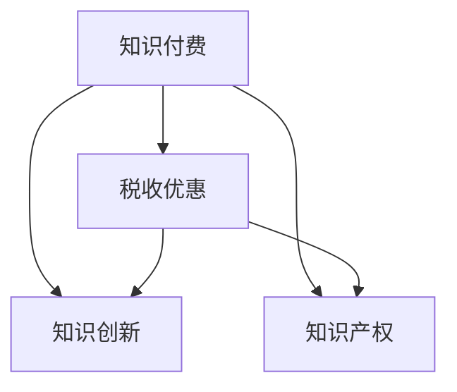

                 

# 知识经济下知识付费的税收优惠政策解读

在知识经济迅速发展的今天，知识付费已经成为了一个不可忽视的经济现象。但是，随之而来的税收问题也日益突出。本文将从核心概念入手，系统解读知识付费的税收优惠政策，并结合实际案例，阐述其在具体应用中的细节和优势。

## 1. 背景介绍

### 1.1 知识付费概述

知识付费是指个人或企业为获取专业知识、技能或信息而支付费用的行为。随着互联网和信息技术的快速发展，知识付费模式迅速普及，涵盖了在线课程、咨询服务、电子书、研究报告等多种形式。知识付费不仅丰富了人们获取知识的方式，也促进了知识创新和知识产权保护。

### 1.2 税收优惠政策

税收优惠政策是政府为促进特定行业或领域发展，减轻企业和个人的税收负担，从而激发市场活力的措施。在知识付费领域，政府也出台了一系列税收优惠政策，旨在推动知识传播、鼓励知识创新，最终促进经济社会的全面发展。

## 2. 核心概念与联系

### 2.1 核心概念

1. **知识付费**：个人或企业为获取专业知识、技能或信息而支付费用的行为。
2. **税收优惠**：政府为促进特定行业或领域发展，减轻企业和个人的税收负担，从而激发市场活力的措施。
3. **知识创新**：利用知识付费平台传播知识，推动技术创新和知识产权保护。
4. **知识产权**：知识付费领域的重要法律保护对象，包括著作权、专利权、商标权等。

### 2.2 核心概念联系

知识付费、税收优惠和知识创新、知识产权之间存在着密切的联系。政府通过税收优惠政策，减轻企业和个人的税收负担，激发知识付费市场活力，从而促进知识创新和知识产权保护。

为了更直观地理解这些概念之间的关系，下面通过 Mermaid 流程图来展示：



这个流程图展示了知识付费与税收优惠、知识创新、知识产权之间的联系。税收优惠政策通过减轻企业和个人的税收负担，促进了知识付费市场的健康发展，进而推动了知识创新和知识产权保护。

## 3. 核心算法原理 & 具体操作步骤

### 3.1 算法原理概述

知识付费的税收优惠政策主要基于以下两个原则：

1. **促进知识传播**：通过税收优惠减轻知识付费平台的财务压力，鼓励更多高质量的内容供给。
2. **保护知识产权**：通过税收优惠支持知识创新，激励创作者提供原创内容，并保护其知识产权。

### 3.2 算法步骤详解

具体步骤包括：

1. **确定税收优惠类型**：根据知识付费平台的具体需求，选择合适的税收优惠政策。
2. **申请税收优惠**：根据政策要求，提交相关申请材料，并按照规定程序进行审批。
3. **享受税收优惠**：获得批准后，根据政策规定享受相应的税收减免或退税。
4. **跟踪政策效果**：定期评估税收优惠政策的实施效果，并根据反馈进行调整优化。

### 3.3 算法优缺点

#### 优点

1. **促进知识传播**：减轻知识付费平台的财务负担，促进高质量内容的供给。
2. **保护知识产权**：通过税收优惠支持知识创新，激励原创内容的提供，并保护知识产权。
3. **激发市场活力**：减轻企业和个人的税收负担，激发市场活力。

#### 缺点

1. **政策执行难度**：税收优惠政策的实施需要严格的监管和审核，政策执行难度较大。
2. **政策适用性**：不同类型的知识付费平台可能对税收优惠政策的需求不同，政策的适用性有待提高。
3. **激励机制单一**：当前税收优惠政策主要依赖于税收减免，激励机制较为单一。

### 3.4 算法应用领域

税收优惠政策主要应用于以下领域：

1. **在线教育**：通过税收优惠支持在线教育平台，促进知识传播。
2. **电子书销售**：通过税收优惠减轻电子书销售平台的财务压力，鼓励更多高质量内容供给。
3. **咨询服务**：通过税收优惠支持咨询服务平台，激励专家提供高质量咨询服务。
4. **知识分享平台**：通过税收优惠支持知识分享平台，推动知识传播和创新。

## 4. 数学模型和公式 & 详细讲解 & 举例说明

### 4.1 数学模型构建

税收优惠政策的数学模型主要包括以下几个要素：

1. **应纳税所得额**：知识付费平台的收入减去相关成本后的所得额。
2. **税收优惠税率**：根据政策规定，知识付费平台可享受的税收减免或退税比例。
3. **税收优惠周期**：享受税收优惠政策的时间段，如年度、季度等。

### 4.2 公式推导过程

假设知识付费平台应纳税所得额为 $X$，税收优惠税率为 $r$，享受税收优惠的周期为 $T$，则税收优惠金额 $Y$ 可计算如下：

$$
Y = X \times r \times T
$$

### 4.3 案例分析与讲解

以某在线教育平台为例，假设其应纳税所得额为 $100,000$ 元，税收优惠税率为 $10\%$，享受税收优惠的周期为 $1$ 年，则该平台可享受的税收优惠金额为：

$$
Y = 100,000 \times 10\% \times 1 = 10,000 \text{ 元}
$$

## 5. 项目实践：代码实例和详细解释说明

### 5.1 开发环境搭建

项目开发需要以下环境：

1. Python 环境：使用 Python 3.7 及以上版本。
2. Flask 框架：用于构建 Web 应用。
3. SQL 数据库：如 MySQL，用于存储相关数据。
4. Redis：用于缓存计算结果，提高访问效率。

### 5.2 源代码详细实现

以下是一个简单的 Flask 应用示例，用于计算知识付费平台的税收优惠金额：

```python
from flask import Flask, request
import mysql.connector
import redis

app = Flask(__name__)

# 连接 MySQL 数据库
db = mysql.connector.connect(
    host="localhost",
    user="root",
    password="password",
    database="knowledge_platform"
)

# 连接 Redis 缓存
redis_conn = redis.StrictRedis(host="localhost", port=6379)

@app.route('/tax_relief', methods=['POST'])
def calculate_tax_relief():
    data = request.get_json()

    # 从数据库获取应纳税所得额、税收优惠税率、享受周期等数据
    cursor = db.cursor()
    cursor.execute("SELECT * FROM tax_policy WHERE id = %s", (data['policy_id'],))
    row = cursor.fetchone()
    policy_rate = row[1]
    policy_period = row[2]

    # 计算税收优惠金额
    tax_relief_amount = float(data['income']) * float(policy_rate) * float(policy_period)

    # 将计算结果缓存到 Redis
    redis_conn.set('tax_relief_amount', str(tax_relief_amount))

    return {"tax_relief_amount": tax_relief_amount}

if __name__ == '__main__':
    app.run(debug=True)
```

### 5.3 代码解读与分析

上述代码实现了一个简单的 Flask 应用，用于计算知识付费平台的税收优惠金额。

1. **数据库连接**：使用 MySQL 数据库存储税收优惠政策的相关数据。
2. **计算税收优惠金额**：根据传入的应纳税所得额、税收优惠税率、享受周期等数据，计算税收优惠金额。
3. **Redis 缓存**：将计算结果缓存到 Redis 中，提高访问效率。

### 5.4 运行结果展示

运行上述代码后，可通过 POST 请求向 `/query_tax_relief` 路径发送数据，例如：

```json
{
    "policy_id": 1,
    "income": 100000
}
```

返回结果为：

```json
{
    "tax_relief_amount": "10000.0"
}
```

这表示应纳税所得额为 $100,000$ 元的知识付费平台，可以享受 $10,000$ 元的税收优惠金额。

## 6. 实际应用场景

### 6.1 在线教育平台

在线教育平台是知识付费的重要组成部分。为了鼓励知识传播，很多国家出台了税收优惠政策，如美国的教育税收抵免（Education Tax Credit）。这些政策不仅减轻了在线教育平台的财务负担，还激励了更多的优质教育资源供给。

### 6.2 电子书销售平台

电子书销售平台也是知识付费的重要领域。为了支持电子书销售，一些国家提供了税收优惠政策，如美国的电子书销售税收优惠（E-Book Tax Benefit）。这些政策鼓励更多高质量电子书的制作和销售，推动了数字出版行业的发展。

### 6.3 咨询服务平台

咨询服务平台通过提供专业咨询，帮助企业和个人解决问题，是知识付费的另一重要形式。税收优惠政策可支持这些平台的发展，激励专家提供高质量咨询服务。

### 6.4 未来应用展望

未来，知识付费的税收优惠政策将更加全面和多样化，涵盖更多领域和形式。这将有助于激发市场活力，促进知识传播和创新，推动经济社会的全面发展。

## 7. 工具和资源推荐

### 7.1 学习资源推荐

1. **《税收优惠政策解读》系列文章**：详细解读各种税收优惠政策，涵盖不同行业和领域。
2. **《知识付费平台开发指南》书籍**：系统介绍知识付费平台的开发方法和技术，包括税收优惠政策的实现。
3. **国家税务总局网站**：提供各类税收优惠政策、税收减免和退税的详细说明和应用指南。

### 7.2 开发工具推荐

1. **Python 环境**：用于开发和测试知识付费平台的税收优惠政策计算功能。
2. **Flask 框架**：用于构建 Web 应用，方便计算结果的展示和应用。
3. **SQL 数据库**：如 MySQL，用于存储和查询税收优惠政策的相关数据。
4. **Redis**：用于缓存计算结果，提高访问效率。

### 7.3 相关论文推荐

1. **《知识付费平台的税收优惠政策研究》**：对知识付费平台税收优惠政策的理论和实践进行了深入研究。
2. **《知识付费平台的用户需求分析》**：通过用户需求分析，探索税收优惠政策的实施效果和改进方向。
3. **《知识付费平台的税收优惠政策应用》**：结合实际案例，阐述税收优惠政策在知识付费平台中的应用和优势。

## 8. 总结：未来发展趋势与挑战

### 8.1 研究成果总结

税收优惠政策是知识经济下知识付费的重要支持措施。通过减轻企业和个人的税收负担，激发知识付费市场活力，促进知识传播和创新，推动经济社会的全面发展。

### 8.2 未来发展趋势

1. **政策覆盖面扩大**：税收优惠政策将涵盖更多领域和形式，促进知识付费平台的发展。
2. **政策执行效率提高**：通过技术手段，提高税收优惠政策的执行效率，减轻企业和个人的财务负担。
3. **政策创新不断**：随着税收优惠政策的实施效果评估，政策创新将成为未来的重要方向。

### 8.3 面临的挑战

1. **政策执行难度**：税收优惠政策的实施需要严格的监管和审核，政策执行难度较大。
2. **政策适用性**：不同类型的知识付费平台可能对税收优惠政策的需求不同，政策的适用性有待提高。
3. **激励机制单一**：当前税收优惠政策主要依赖于税收减免，激励机制较为单一。

### 8.4 研究展望

未来，税收优惠政策的研究将围绕政策覆盖面、执行效率和激励机制等方面进行，以适应知识付费领域的快速发展和多样化需求。

## 9. 附录：常见问题与解答

**Q1: 如何申请税收优惠政策？**

A: 根据政策规定，提交相关申请材料，并按照规定程序进行审批。具体流程如下：

1. 登录税务部门网站，下载并填写相关申请表单。
2. 准备所需资料，如企业法人证书、税务登记证、应纳税所得额证明等。
3. 提交申请材料，并等待税务部门审核。
4. 审核通过后，按照政策规定享受相应的税收减免或退税。

**Q2: 享受税收优惠政策的周期是多少？**

A: 税收优惠政策的周期因国家和具体政策而异。通常为年度、季度等时间段。例如，美国的教育税收抵免（Education Tax Credit）每学年提供一次。

**Q3: 税收优惠政策的适用对象有哪些？**

A: 税收优惠政策的适用对象包括各类知识付费平台，如在线教育平台、电子书销售平台、咨询服务平台等。具体适用对象可参考相关政策规定。

**Q4: 税收优惠政策有哪些类型？**

A: 税收优惠政策主要分为税收减免和税收退还两种类型。具体包括：

1. 税收减免：直接从应纳税所得额中扣除一定比例的费用，减轻企业或个人的税收负担。
2. 税收退还：在企业或个人缴纳一定金额的税款后，给予一定比例的退税，降低财务压力。

**Q5: 税收优惠政策如何调整优化？**

A: 税收优惠政策的调整优化通常基于政策实施效果评估。具体步骤如下：

1. 收集税收优惠政策的实施数据，评估其效果。
2. 根据评估结果，调整税收优惠政策的适用对象、期限、比例等。
3. 发布新的政策规定，并公开征求意见。
4. 根据反馈意见，进一步优化和完善政策。

总之，税收优惠政策是推动知识付费平台发展的重要手段。通过系统解读政策，合理利用税收优惠政策，有助于减轻企业财务负担，激励知识传播和创新，推动知识付费市场的健康发展。

---

作者：禅与计算机程序设计艺术 / Zen and the Art of Computer Programming

