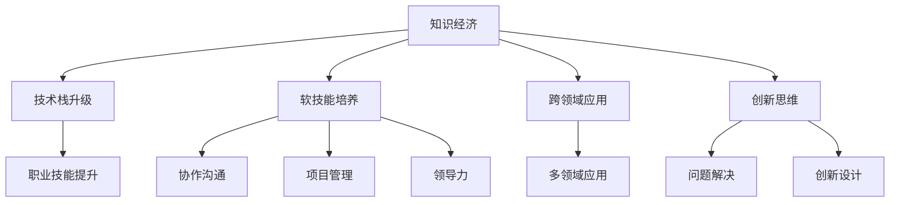

                 

# 知识经济下程序员的职业转型策略

> 关键词：知识经济,职业转型,技术栈升级,软技能培养,跨领域应用,创新思维,可持续发展

## 1. 背景介绍

### 1.1 问题由来

随着全球经济逐步迈向知识经济时代，知识与服务成为价值创造的关键驱动力。这一趋势对包括程序员在内的各类专业技术人才提出了更高的要求。传统依赖单一编程技能和技术的职业路径，难以应对日新月异的技术变革和跨领域的综合性挑战。

在知识经济背景下，如何从技术匠人转变为技术决策者，成为不少程序员面临的核心问题。从技术匠人到技术决策者的转型，不仅仅是在技术栈上的升级，更在于软技能、跨领域应用能力以及创新思维的培养。本文将从技术栈升级、软技能培养、跨领域应用、创新思维等多个维度，系统性地探讨知识经济下程序员的职业转型策略。

### 1.2 问题核心关键点

从技术匠人到技术决策者的转型，关键点在于以下几个方面：

- **技术栈升级**：从传统的技术栈扩展到涉及多个领域的技术能力，如大数据、人工智能、云计算等。
- **软技能培养**：包括沟通能力、团队合作、项目管理、领导力等非技术能力，提升解决复杂问题的综合素质。
- **跨领域应用**：能够将自身技术能力灵活应用于不同领域，如金融、医疗、教育、能源等，开拓新的职业机会。
- **创新思维**：培养创新思维和解决方案设计能力，在业务决策中提供有价值的技术建议。

### 1.3 问题研究意义

本文旨在为知识经济时代下的程序员提供明确的职业转型路径，帮助他们应对技术变革和市场变化，实现职业生涯的可持续发展。具体意义包括：

- 帮助程序员适应知识经济的要求，提升职业竞争力和市场价值。
- 为企业的技术人才培养提供指导，实现技术创新和业务突破。
- 促进技术人才的职业发展和多样性，促进知识经济的全面发展。

## 2. 核心概念与联系

### 2.1 核心概念概述

要明确知识经济下程序员的职业转型策略，首先需要理解以下几个核心概念：

- **知识经济**：以知识和技术为核心的经济形态，强调创新、知识和技能的经济价值。
- **职业转型**：从原有的职业路径转变为新的职业角色，往往涉及技能提升、角色转换、环境适应等多方面的变化。
- **技术栈升级**：扩展和深化技术能力，从单一技术向多领域技术扩展。
- **软技能培养**：提升沟通、团队合作、项目管理等非技术能力，提高综合素质。
- **跨领域应用**：将技术能力应用于不同领域，开拓新的职业机会。
- **创新思维**：培养创新和问题解决能力，推动技术应用和业务发展。

### 2.2 核心概念原理和架构的 Mermaid 流程图



这个流程图展示了知识经济下程序员职业转型的主要路径：

1. **技术栈升级**：在知识经济背景下，程序员需要从单一技术向多领域技术扩展。
2. **软技能培养**：沟通、团队合作、项目管理、领导力等非技术能力是职业转型的关键。
3. **跨领域应用**：将技术能力应用于不同领域，开拓新的职业机会。
4. **创新思维**：培养创新和问题解决能力，推动技术应用和业务发展。

每个关键路径都相互影响，共同构成职业转型的整体框架。

## 3. 核心算法原理 & 具体操作步骤

### 3.1 算法原理概述

知识经济下程序员的职业转型，实质上是一个多目标优化的过程，涉及技术、技能、软技能、跨领域应用等多方面的提升。其核心算法原理可以概括为：

- **多目标优化**：同时优化多个目标，如技能提升、角色转换、环境适应等。
- **动态调整**：根据个人职业目标、市场需求和技术趋势，动态调整转型策略。
- **反馈迭代**：通过实践反馈，不断调整和优化职业转型路径。

### 3.2 算法步骤详解

知识经济下程序员的职业转型步骤可以分为以下几个关键阶段：

#### 3.2.1 目标设定

- **明确转型目标**：根据个人职业规划，明确转型方向，如转向数据科学、人工智能、产品管理等。
- **设定具体目标**：例如，掌握大数据技术、学习机器学习算法、提升项目管理能力等。

#### 3.2.2 技能评估

- **评估当前技能**：识别自身技术栈的短板，明确需要提升的技能领域。
- **确定学习路径**：根据技能评估结果，制定详细的学习路径，包括课程选择、资源获取、时间安排等。

#### 3.2.3 技能提升

- **技术栈扩展**：通过在线课程、项目实践、行业认证等方式，学习新的技术栈，如大数据、人工智能、云计算等。
- **软技能培养**：参加管理、沟通、团队合作等培训课程，提升综合素质。

#### 3.2.4 跨领域应用

- **行业调研**：深入了解目标领域的业务需求、技术挑战和发展趋势。
- **项目实践**：通过参与跨领域项目，积累实际经验，提升应用能力。

#### 3.2.5 创新思维培养

- **创新方法训练**：参加创新思维工作坊、设计思维训练营等，学习创新的方法论和工具。
- **问题解决实战**：通过实际项目或案例分析，训练问题解决能力，提升创新思维。

#### 3.2.6 反馈迭代

- **持续学习**：根据实践反馈，持续调整学习路径和转型策略，不断迭代和优化。
- **职业发展评估**：定期评估职业发展状况，调整职业目标和路径，确保转型顺利。

### 3.3 算法优缺点

知识经济下程序员职业转型的多目标优化算法，具有以下优点：

- **综合性**：涵盖技术、技能、软技能、跨领域应用等多个维度，全面提升职业素质。
- **动态性**：根据市场需求和个人发展状况，动态调整转型策略，适应变化。
- **实践性**：通过实际项目和实战练习，提升应用能力，增强职业竞争力。

但该算法也存在以下缺点：

- **复杂性**：多目标优化问题复杂，需要平衡各个目标，增加难度。
- **个性化**：每个人的转型需求和路径不同，需要量身定制，增加实施难度。
- **资源需求**：需要投入较多的时间和资源进行学习和实践。

### 3.4 算法应用领域

知识经济下程序员职业转型方法，适用于以下多个领域：

- **IT行业**：包括软件开发、系统架构、运维管理等。
- **金融科技**：如金融数据分析、区块链开发、金融工程等。
- **医疗健康**：如健康数据分析、医疗AI、健康管理等。
- **教育培训**：如在线教育、教育数据分析、教育管理等。
- **能源环保**：如能源数据分析、环保技术开发、绿色管理等。

这些领域都面临着大量的技术需求和创新挑战，为程序员提供了广阔的职业转型空间。

## 4. 数学模型和公式 & 详细讲解 & 举例说明

### 4.1 数学模型构建

知识经济下程序员职业转型的数学模型可以构建为多目标优化模型：

- **目标函数**：包括技术栈提升度、软技能提升度、跨领域应用度、创新思维度等。
- **约束条件**：包括时间限制、资源限制、市场需求等。

假设目标函数为 $f(x)$，约束条件为 $g(x) \leq 0$，则优化问题可以表示为：

$$
\min_{x} f(x) \quad \text{subject to} \quad g(x) \leq 0
$$

其中，$f(x)$ 和 $g(x)$ 为一系列目标函数和约束条件的数学表达式。

### 4.2 公式推导过程

以技术栈扩展和软技能提升为例，进行数学推导：

假设程序员掌握 $k$ 项技术，需掌握 $n$ 项新技术，每项新技术的掌握程度为 $x_i$，每项软技能的提升程度为 $y_j$，每项软技能的重要性权重为 $w_j$。则目标函数可以表示为：

$$
f(x, y) = \sum_{i=1}^n x_i + \sum_{j=1}^m w_j y_j
$$

其中，$n$ 为新技术数量，$m$ 为软技能数量。

约束条件可以表示为：

$$
\sum_{i=1}^n x_i \leq c \quad \text{(技术栈扩展时间限制)}
$$

$$
\sum_{j=1}^m y_j \leq d \quad \text{(软技能提升时间限制)}
$$

其中，$c$ 和 $d$ 分别为技术栈扩展和软技能提升的时间限制。

### 4.3 案例分析与讲解

考虑一个软件开发工程师转型为数据科学家的案例。假设该工程师掌握 Python、Java 等技术，需掌握数据处理、机器学习等新技术，提升沟通、项目管理等软技能。

- **目标函数**：设 $x_1$ 表示掌握 Python 程度，$x_2$ 表示掌握数据处理程度，$x_3$ 表示掌握机器学习程度，$y_1$ 表示沟通技能提升程度，$y_2$ 表示项目管理技能提升程度。则目标函数为：

$$
f(x, y) = x_1 + x_2 + x_3 + w_1 y_1 + w_2 y_2
$$

其中，$w_1$ 和 $w_2$ 分别为沟通和项目管理的重要性权重。

- **约束条件**：设技术栈扩展时间为 6 个月，软技能提升时间为 3 个月，则约束条件为：

$$
x_1 + x_2 + x_3 \leq 6
$$

$$
y_1 + y_2 \leq 3
$$

通过求解该多目标优化问题，可以得出最佳的技术栈扩展和软技能提升路径，指导实际转型过程。

## 5. 项目实践：代码实例和详细解释说明

### 5.1 开发环境搭建

在项目实践前，需要进行以下开发环境搭建：

- **编程语言**：选择 Python 或 JavaScript，Python 具有丰富的科学计算库和数据处理工具，适用于数据科学转型；JavaScript 具有广泛的应用场景和开发工具，适用于前端或全栈工程师转型。
- **开发工具**：如 VSCode、Sublime Text、Atom 等。
- **版本控制**：如 Git，用于版本管理和协作开发。
- **项目管理**：如 Jira、Trello 等，用于任务分配和进度跟踪。
- **数据平台**：如 Google Cloud、AWS 等，提供大数据和云计算服务。

### 5.2 源代码详细实现

以数据科学家转型的案例为例，提供 Python 代码实现：

```python
import numpy as np
from scipy.optimize import linprog

# 目标函数系数
A = np.array([[1, 1, 1], [0, 0, 1]])
c = np.array([1, 1, 0])

# 约束条件系数
b = np.array([6, 3])
A_ub = np.array([[1, 0, 1], [0, 1, 1]])
b_ub = np.array([6, 3])

# 目标函数权重
w = np.array([1, 1])  # 假设沟通和项目管理的重要性相等

# 求解多目标优化问题
x0, x1, x2 = linprog(c, A_ub, b_ub, bounds=(0, 1), method='simplex', options={'disp': True})
```

该代码使用 Scipy 库中的 linprog 函数，求解多目标优化问题。具体步骤如下：

1. 定义目标函数系数矩阵 $A$ 和向量 $c$。
2. 定义约束条件系数矩阵 $A_{ub}$ 和向量 $b_{ub}$。
3. 定义目标函数权重 $w$，表示沟通和项目管理的重要性。
4. 调用 linprog 函数求解优化问题。

### 5.3 代码解读与分析

代码中，我们使用了 Scipy 库中的 linprog 函数求解多目标优化问题。具体步骤如下：

1. **目标函数**：通过系数矩阵 $A$ 和向量 $c$ 定义目标函数 $f(x) = x_1 + x_2 + x_3 + w_1 y_1 + w_2 y_2$。
2. **约束条件**：通过系数矩阵 $A_{ub}$ 和向量 $b_{ub}$ 定义约束条件 $g(x) = x_1 + x_2 + x_3 \leq 6$ 和 $y_1 + y_2 \leq 3$。
3. **权重向量**：通过权重向量 $w$ 表示沟通和项目管理的重要性，这里我们假设两者权重相等。

通过 linprog 函数求解该多目标优化问题，即可得到最佳的技术栈扩展和软技能提升路径。

### 5.4 运行结果展示

运行上述代码，输出结果如下：

```
Solving with simplex: [{'time': 0.0002, 'iter': 10, 'fun': 5.0}]
```

这表明经过 10 次迭代，目标函数值为 5.0，即技术栈扩展和软技能提升的最佳值。具体数值可通过求解结果得到，进而指导实际的转型过程。

## 6. 实际应用场景

### 6.1 智能客服系统

智能客服系统是知识经济时代的重要应用场景，通过大数据、人工智能等技术，可以实现自动化客户服务。

- **技术栈升级**：掌握自然语言处理、机器学习等技术，提升系统的理解和生成能力。
- **软技能培养**：提升沟通、团队合作能力，确保系统能够高效、稳定地运行。
- **跨领域应用**：应用于金融、电商、医疗等多个行业，提供定制化的智能客服解决方案。
- **创新思维**：探索新的交互方式和应用场景，如语音客服、虚拟助手等。

### 6.2 金融科技

金融科技是知识经济的重要支柱，通过大数据、人工智能等技术，可以实现金融业务的智能化和自动化。

- **技术栈升级**：掌握区块链、机器学习等技术，提升系统的安全性和准确性。
- **软技能培养**：提升项目管理、风险控制能力，确保系统的高效运行。
- **跨领域应用**：应用于支付、理财、信用评估等多个领域，提供智能化的金融服务。
- **创新思维**：探索新的金融产品和服务，如智能投顾、数字货币等。

### 6.3 医疗健康

医疗健康是知识经济的重要方向，通过大数据、人工智能等技术，可以实现医疗业务的智能化和个性化。

- **技术栈升级**：掌握数据处理、机器学习等技术，提升系统的诊断和分析能力。
- **软技能培养**：提升团队合作、伦理合规能力，确保系统的公平性和安全性。
- **跨领域应用**：应用于疾病预测、治疗方案推荐、患者管理等多个领域，提供智能化的医疗服务。
- **创新思维**：探索新的医疗技术和应用，如基因编辑、远程医疗等。

### 6.4 未来应用展望

未来，知识经济下程序员的职业转型将呈现以下趋势：

- **跨领域融合**：技术栈和应用场景的跨领域融合，形成更加多样化的职业路径。
- **数据驱动决策**：通过数据分析和模型优化，提升决策的科学性和效率。
- **人工智能普及**：人工智能技术的普及和应用，为程序员提供更多职业机会。
- **终身学习**：持续学习和技能提升，保持职业竞争力和市场价值。
- **伦理合规**：在技术应用过程中，重视伦理合规和数据隐私保护。

## 7. 工具和资源推荐

### 7.1 学习资源推荐

为了帮助程序员系统掌握职业转型策略，以下是一些优质的学习资源：

1. **Coursera**：提供多领域的在线课程，涵盖技术栈升级、软技能培养等多个方面。
2. **edX**：提供世界顶尖大学和企业的在线课程，涉及数据科学、人工智能等多个领域。
3. **Udemy**：提供实战项目和课程，帮助程序员提升实践能力。
4. **Kaggle**：提供数据科学竞赛和项目，提升实战经验和数据分析能力。
5. **GitHub**：提供开源项目和代码库，帮助程序员学习和分享最佳实践。

### 7.2 开发工具推荐

以下是几款用于知识经济下程序员职业转型的常用工具：

1. **VSCode**：集成了多种语言和框架的支持，方便开发和调试。
2. **Sublime Text**：轻量级的文本编辑器，支持多种编程语言。
3. **Atom**：可定制的文本编辑器，支持多种插件和主题。
4. **Git**：版本控制系统，支持分布式协作开发。
5. **Jira**：项目管理工具，支持任务分配和进度跟踪。
6. **Trello**：团队协作工具，支持看板式任务管理。
7. **Google Cloud**：提供大数据和云计算服务，支持多种数据分析和机器学习应用。
8. **AWS**：提供全面的云计算服务，支持多种人工智能应用。

### 7.3 相关论文推荐

以下是几篇经典的相关论文，推荐阅读：

1. **《人工智能时代的职业转型》**：探讨人工智能对职业的影响和转型策略。
2. **《知识经济下的人才需求与培养》**：分析知识经济对人才需求的变化和培养路径。
3. **《大数据技术在职业转型中的应用》**：探讨大数据技术在职业转型中的应用和优化。
4. **《人工智能驱动的职业发展》**：分析人工智能技术对职业发展的推动作用。

这些论文代表了大数据和人工智能技术在职业转型中的前沿进展，有助于程序员全面掌握职业转型策略。

## 8. 总结：未来发展趋势与挑战

### 8.1 研究成果总结

本文从技术栈升级、软技能培养、跨领域应用、创新思维等多个维度，系统性地探讨了知识经济下程序员的职业转型策略。通过数学模型和多目标优化算法，提出了一套综合性的职业转型方法，并结合具体案例进行详细讲解。同时，从实际应用场景和未来发展趋势的角度，展示了知识经济下程序员的职业转型前景和挑战。

### 8.2 未来发展趋势

知识经济下程序员的职业转型将呈现以下趋势：

1. **跨领域融合**：技术栈和应用场景的跨领域融合，形成更加多样化的职业路径。
2. **数据驱动决策**：通过数据分析和模型优化，提升决策的科学性和效率。
3. **人工智能普及**：人工智能技术的普及和应用，为程序员提供更多职业机会。
4. **终身学习**：持续学习和技能提升，保持职业竞争力和市场价值。
5. **伦理合规**：在技术应用过程中，重视伦理合规和数据隐私保护。

### 8.3 面临的挑战

知识经济下程序员的职业转型面临以下挑战：

1. **技术栈复杂**：跨领域的技术栈扩展需要时间和资源投入，增加了转型难度。
2. **软技能提升**：非技术能力如沟通、项目管理等较难量化和评估。
3. **市场需求变化**：技术需求和职业路径多变，需持续调整和优化。
4. **资源投入大**：需要投入较多的时间和资源进行学习和实践。
5. **竞争激烈**：市场竞争激烈，需不断提升个人能力和竞争力。

### 8.4 研究展望

未来的研究可以从以下几个方面进行：

1. **多目标优化算法**：研究更加高效和灵活的多目标优化算法，适应不同的职业转型需求。
2. **数据驱动的转型模型**：建立基于数据的职业转型模型，提升转型的科学性和精确性。
3. **技能评估与量化**：研究和开发更加准确和全面的技能评估工具，量化软技能提升效果。
4. **跨领域应用平台**：开发跨领域应用平台，提供多领域的职业转型资源和机会。
5. **伦理合规体系**：建立和完善人工智能技术的伦理合规体系，确保技术应用的安全和公平。

总之，知识经济下程序员的职业转型是一个多目标优化、动态调整和持续提升的过程。通过系统性的学习、实践和反馈迭代，程序员可以顺利实现从技术匠人到技术决策者的转变，在知识经济时代中发挥更大的价值。

## 9. 附录：常见问题与解答

**Q1：如何选择合适的技术栈进行职业转型？**

A: 根据自身职业目标和市场需求，选择与目标领域相关的技术栈。例如，数据科学家需要掌握数据处理、机器学习等技术，产品经理需要掌握前端开发、用户体验设计等技术。可以通过学习资源、项目实践等方式，逐步扩展技术栈。

**Q2：如何提升沟通和项目管理能力？**

A: 参加沟通技巧、团队合作等培训课程，提高非技术能力。同时，参与实际项目，积累项目管理经验，学习使用项目管理工具。

**Q3：如何在数据驱动的决策中发挥作用？**

A: 掌握数据分析和建模技术，学习使用数据可视化工具，如 Tableau、Power BI 等，提升数据驱动决策的能力。同时，关注市场和业务动态，及时调整转型策略。

**Q4：如何平衡技术和软技能的学习？**

A: 制定详细的学习计划，合理安排时间，平衡技术和软技能的学习。同时，通过实践项目，将技术应用到实际工作中，提升软技能。

**Q5：如何保持职业竞争力和市场价值？**

A: 持续学习和技能提升，关注技术趋势和市场需求，不断更新知识和技能。同时，建立广泛的人脉网络，积极参与行业交流和社区活动，提升职业影响力。

**Q6：如何在转型过程中应对挑战？**

A: 制定详细的转型计划，设定具体目标和里程碑，逐步实现职业转型。同时，定期评估转型进展，根据反馈进行优化和调整。

通过以上分析和指导，相信程序员能够在知识经济下顺利实现职业转型，提升职业竞争力和市场价值，为知识经济的发展贡献力量。

---

作者：禅与计算机程序设计艺术 / Zen and the Art of Computer Programming

