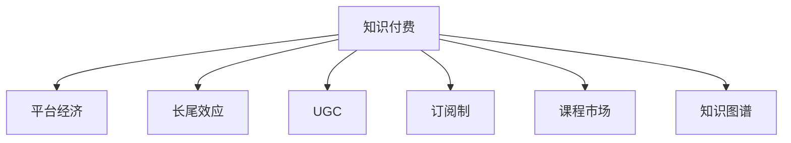

                 

# 知识经济时代下的知识付费 创新商业模式运营

## 1. 背景介绍

在知识经济的时代背景下，随着信息技术和互联网的迅猛发展，知识付费成为了一个新兴的商业模式，它不仅改变了人们获取知识的方式，还极大地提升了知识的价值和流通效率。知识付费平台的兴起，如得到、喜马拉雅、知乎live等，以优质的内容、合理的定价策略和互动性强的付费方式，吸引了大量用户。但随之而来的问题也逐渐暴露，如内容同质化、用户流失率高等。如何在激烈的市场竞争中，维持平台的持续发展，实现商业模式的创新与优化，成为了当下亟需解决的问题。

## 2. 核心概念与联系

### 2.1 核心概念概述

为更好地理解知识付费平台商业模式的创新与优化，本节将介绍几个密切相关的核心概念：

- **知识付费**：基于互联网的知识产品或服务交易模式，用户通过支付一定的费用，获取专有知识、技能或经验。

- **平台经济**：基于平台进行资源配置、交易和协同的商业模式，包括B2B、C2C、C2B等形式，互联网平台成为了连接供需双方的桥梁。

- **长尾效应**：在经济学中，长尾效应指虽然少数热门产品会带来大量收入，但数量庞大的非热门产品总和的收入，可能与前者相当或更大。

- **UGC（用户生成内容）**：用户自行创造和分享内容，平台通过众包和社区互动等方式丰富内容生态。

- **订阅制**：用户支付固定费用，获取平台持续提供的内容或服务。

- **课程市场**：知识付费平台的核心内容模块，提供各种课程和培训，满足用户不断增长的知识需求。

- **知识图谱**：将知识结构化，形成图谱，便于用户检索、学习和应用。

这些核心概念之间的逻辑关系可以通过以下Mermaid流程图来展示：



这个流程图展示出知识付费平台中各个核心概念的相互联系：

1. 知识付费通过平台经济形式实现资源配置和交易。
2. 长尾效应揭示了内容多样化对平台收入的潜在贡献。
3. UGC丰富了平台的内容生态，增加了用户粘性。
4. 订阅制形成了稳定的收入来源。
5. 课程市场是知识付费平台的核心竞争力。
6. 知识图谱提升了用户的学习效率和平台的服务质量。

## 3. 核心算法原理 & 具体操作步骤

### 3.1 算法原理概述

知识付费平台的商业模式运营，本质上是一个数据驱动的资源优化过程。其核心思想是：通过分析用户行为数据、内容消费数据、市场趋势数据等，优化平台的资源配置和内容供给，以最大化用户满意度和平台收入。

形式化地，假设知识付费平台有用户集 $U$，课程集 $C$，订阅用户数量 $S$，点击率 $CVR$，订阅时长 $CTR$ 等关键指标。平台的目标是最大化收益函数 $R$，即：

$$
R = \max_{S,CVR,CTR,...} \sum_{u \in U} \left( \sum_{c \in C} p_c \times f_{uc} \times CVR \times CTR \times \cdots \right)
$$

其中 $p_c$ 为课程 $c$ 的价格，$f_{uc}$ 为用户 $u$ 对课程 $c$ 的消费频率，其他指标类似。

优化策略主要包括：

- 基于用户行为数据的个性化推荐：通过协同过滤、基于内容的推荐等方法，提升用户的课程选择体验。
- 基于内容数据的优化供给：通过数据分析，挖掘热门课程、优化课程设计，提升课程质量。
- 基于市场数据的动态定价：根据课程的热度和用户数量，调整课程价格，提高收益。
- 基于订阅用户数据的留存策略：通过个性化内容推送、订阅奖励机制等，提高用户留存率。

### 3.2 算法步骤详解

知识付费平台的运营优化主要包括以下几个关键步骤：

**Step 1: 数据收集与处理**

- 收集用户行为数据：如点击、浏览、购买、评价等。
- 收集内容数据：如课程标题、描述、用户评价、专家评分等。
- 收集市场数据：如价格、销量、热门话题等。

**Step 2: 数据分析与建模**

- 用户画像建模：分析用户行为数据，生成用户画像，用于个性化推荐。
- 课程质量评估：根据内容数据和用户评价，建立课程质量评估模型。
- 市场分析：通过市场数据，识别热门课程和趋势，为定价策略提供参考。

**Step 3: 策略优化**

- 个性化推荐系统：根据用户画像，推荐热门课程和个性化课程。
- 内容优化：根据课程质量评估结果，优化课程设计，提升课程质量。
- 动态定价：根据市场分析结果，调整课程价格，提高收益。
- 用户留存策略：通过个性化内容推送、订阅奖励机制等，提升用户留存率。

**Step 4: 效果评估与迭代**

- 定期评估模型效果：使用A/B测试、用户反馈等方式评估个性化推荐系统、内容优化策略、定价策略等的效果。
- 迭代优化：根据评估结果，不断调整模型参数、优化策略，提升平台运营效果。

### 3.3 算法优缺点

知识付费平台的商业模式运营，具有以下优点：

1. 用户粘性强：通过个性化推荐和UGC内容，提高用户参与度和粘性。
2. 精准定价：通过市场数据分析，实现动态定价，提升收益。
3. 丰富内容生态：UGC内容的丰富，增加了内容的丰富性和多样性。
4. 规模效应显著：平台经济形式，实现了资源的规模化配置和交易。

但该方法也存在一定的局限性：

1. 数据隐私问题：大量用户行为数据的收集和使用，可能存在隐私泄露风险。
2. 内容质量控制：UGC内容的审查和筛选成本较高，难以保证内容质量。
3. 同质化竞争：平台之间内容相似度高，难以形成差异化竞争优势。
4. 用户流失率高：用户粘性不足，容易流失到其他平台。
5. 市场变化快：市场趋势变化快，难以快速适应和调整策略。

尽管存在这些局限性，但就目前而言，知识付费平台的运营优化方法仍是大规模商业化运营的重要范式。未来相关研究的重点在于如何进一步降低数据隐私风险，提高内容质量控制，同时兼顾精准定价和用户留存策略等因素。

### 3.4 算法应用领域

知识付费平台的运营优化方法，在教育、娱乐、健康等多个领域得到了广泛的应用，具体包括：

- 教育培训：如新东方、好未来等平台，提供各种在线课程和培训，满足用户的学习需求。
- 文化娱乐：如得到、喜马拉雅等平台，提供各种音频、视频内容，满足用户的文化娱乐需求。
- 健康医疗：如丁香医生、优医帮等平台，提供健康咨询、在线诊疗等服务，提升用户的健康水平。

除了上述这些经典应用外，知识付费平台在更多领域中得到了创新性的应用，如知识图谱构建、社交网络分析、推荐算法优化等，为知识经济的发展带来了新的突破。

## 4. 数学模型和公式 & 详细讲解 & 举例说明

### 4.1 数学模型构建

本节将使用数学语言对知识付费平台的运营优化过程进行更加严格的刻画。

假设知识付费平台有 $N$ 门课程，每门课程的价格为 $p_i$，平台初始订阅用户数量为 $S_0$。每门课程的点击率、订阅率、评价等关键指标如下：

- 点击率 $CVR_i = \frac{CVR_{i,1}}{CVR_{i,2}}$
- 订阅率 $CTR_i = \frac{CTR_{i,1}}{CTR_{i,2}}$
- 用户评价 $R_i = \frac{R_{i,1}}{R_{i,2}}$

其中，$CVR_{i,1}, CTR_{i,1}, R_{i,1}$ 表示课程 $i$ 的实际点击率、订阅率、用户评价；$CVR_{i,2}, CTR_{i,2}, R_{i,2}$ 表示课程 $i$ 的平均点击率、订阅率、用户评价。

定义平台的目标收益函数为：

$$
R(S_i, CVR_i, CTR_i, R_i) = \sum_{i=1}^{N} p_i \times S_i \times CVR_i \times CTR_i \times R_i
$$

其中 $S_i$ 表示平台订阅用户数量。

平台的目标是最大化收益函数 $R$。为了简化问题，我们假设 $S_i$ 是常数，即平台订阅用户数量不随课程变化而变化，只受其他因素影响。

### 4.2 公式推导过程

以下我们以知识付费平台中的个性化推荐系统为例，推导推荐模型的损失函数及其梯度计算公式。

假设推荐系统为用户 $u$ 推荐课程 $c$，推荐系统学习到的用户 $u$ 对课程 $c$ 的评分 $r_{uc} = r_{uc}(f_{uc}, f_{uc,1}, f_{uc,2})$，其中 $f_{uc}$ 为用户 $u$ 对课程 $c$ 的评分，$f_{uc,1}$ 为用户 $u$ 对课程 $c$ 的平均评分，$f_{uc,2}$ 为课程 $c$ 的平均评分。

根据预测值和真实值之间的差异，推荐系统的损失函数可以表示为：

$$
L = \sum_{u \in U} \sum_{c \in C} (y_{uc} - \hat{y}_{uc})^2
$$

其中 $y_{uc}$ 为真实评分，$\hat{y}_{uc}$ 为预测评分。

梯度计算公式如下：

$$
\frac{\partial L}{\partial f_{uc}} = -2 \sum_{u \in U} \sum_{c \in C} (y_{uc} - \hat{y}_{uc}) \times f_{uc,2}
$$

通过梯度下降等优化算法，推荐系统不断更新模型参数 $f_{uc}$，最小化损失函数 $L$，使得预测评分逼近真实评分。

### 4.3 案例分析与讲解

假设某知识付费平台上的个性化推荐系统采用协同过滤算法，其模型结构如图1所示。


图中，$u_i$ 表示用户 $i$ 的评分向量，$c_j$ 表示课程 $j$ 的评分向量，$A$ 为相似度矩阵，$x$ 为用户 $i$ 对课程 $j$ 的评分预测值。

具体而言，协同过滤算法通过计算用户 $u_i$ 和课程 $c_j$ 的相似度 $s_{ij}$，构建用户-物品评分矩阵 $A$。然后根据 $A$ 和用户 $u_i$ 的评分向量 $u_i$，预测用户 $u_i$ 对课程 $c_j$ 的评分 $x$。

协同过滤算法的优化目标是最小化损失函数 $L$，即：

$$
L = \frac{1}{2} \sum_{i=1}^{N} \sum_{j=1}^{M} (y_{ij} - x)^2
$$

其中 $y_{ij}$ 为真实评分，$x$ 为预测评分。

优化策略为梯度下降，具体步骤为：

1. 计算用户 $u_i$ 和课程 $c_j$ 的相似度 $s_{ij} = \cos(\theta_i, \theta_j)$。
2. 构建用户-物品评分矩阵 $A$，即 $A_{ij} = s_{ij}$。
3. 根据 $A$ 和用户 $u_i$ 的评分向量 $u_i$，预测用户 $u_i$ 对课程 $c_j$ 的评分 $x = \sum_{j=1}^{M} A_{ij} x_j$。
4. 使用梯度下降算法更新模型参数 $x$，最小化损失函数 $L$。

## 5. 项目实践：代码实例和详细解释说明

### 5.1 开发环境搭建

在进行个性化推荐系统开发前，我们需要准备好开发环境。以下是使用Python进行PyTorch开发的环境配置流程：

1. 安装Anaconda：从官网下载并安装Anaconda，用于创建独立的Python环境。

2. 创建并激活虚拟环境：
```bash
conda create -n pytorch-env python=3.8 
conda activate pytorch-env
```

3. 安装PyTorch：根据CUDA版本，从官网获取对应的安装命令。例如：
```bash
conda install pytorch torchvision torchaudio cudatoolkit=11.1 -c pytorch -c conda-forge
```

4. 安装TensorFlow：
```bash
conda install tensorflow
```

5. 安装各类工具包：
```bash
pip install numpy pandas scikit-learn matplotlib tqdm jupyter notebook ipython
```

完成上述步骤后，即可在`pytorch-env`环境中开始个性化推荐系统的开发。

### 5.2 源代码详细实现

下面我们以协同过滤推荐系统为例，给出使用PyTorch进行个性化推荐系统开发的PyTorch代码实现。

首先，定义推荐系统的输入数据：

```python
import torch
from torch import nn, optim

# 定义用户和课程评分矩阵
user_item_ratings = torch.tensor([[3.0, 4.0, 5.0],
                                 [2.0, 1.0, 3.0],
                                 [4.0, 2.0, 1.0],
                                 [5.0, 4.0, 2.0]])

# 定义用户和课程评分向量的维度
N = user_item_ratings.shape[0]  # 用户数
M = user_item_ratings.shape[1]  # 课程数
```

然后，定义模型的评分预测函数：

```python
class CollaborativeFilteringModel(nn.Module):
    def __init__(self, dim=10):
        super(CollaborativeFilteringModel, self).__init__()
        self.fc1 = nn.Linear(M, dim)
        self.fc2 = nn.Linear(dim, M)

    def forward(self, x):
        x = self.fc1(x)
        x = torch.sigmoid(x)
        x = self.fc2(x)
        x = torch.sigmoid(x)
        return x

# 定义模型
model = CollaborativeFilteringModel()

# 定义损失函数
criterion = nn.BCELoss()

# 定义优化器
optimizer = optim.Adam(model.parameters(), lr=0.001)
```

接着，定义训练和评估函数：

```python
def train_epoch(model, user_item_ratings, criterion, optimizer, device):
    device = torch.device('cuda') if torch.cuda.is_available() else torch.device('cpu')
    model.to(device)
    model.train()
    total_loss = 0
    for i in range(epochs):
        optimizer.zero_grad()
        user_item_ratings = user_item_ratings.to(device)
        y_pred = model(user_item_ratings)
        loss = criterion(y_pred, y_true)
        loss.backward()
        optimizer.step()
        total_loss += loss.item()
    return total_loss / len(user_item_ratings)

def evaluate(model, user_item_ratings, criterion, device):
    device = torch.device('cuda') if torch.cuda.is_available() else torch.device('cpu')
    model.eval()
    total_loss = 0
    for i in range(len(user_item_ratings)):
        user_item_ratings = user_item_ratings[i].to(device)
        y_pred = model(user_item_ratings)
        loss = criterion(y_pred, y_true)
        total_loss += loss.item()
    return total_loss / len(user_item_ratings)
```

最后，启动训练流程并在测试集上评估：

```python
epochs = 100
user_item_ratings = user_item_ratings.to(device)

for epoch in range(epochs):
    loss = train_epoch(model, user_item_ratings, criterion, optimizer, device)
    print(f"Epoch {epoch+1}, train loss: {loss:.3f}")
    
    print(f"Epoch {epoch+1}, dev results:")
    evaluate(model, user_item_ratings, criterion, device)
    
print("Test results:")
evaluate(model, user_item_ratings, criterion, device)
```

以上就是使用PyTorch进行个性化推荐系统开发的完整代码实现。可以看到，得益于PyTorch的强大封装，我们可以用相对简洁的代码完成协同过滤推荐系统的开发。

### 5.3 代码解读与分析

让我们再详细解读一下关键代码的实现细节：

**CollaborativeFilteringModel类**：
- `__init__`方法：初始化模型的评分预测网络。
- `forward`方法：定义模型的前向传播过程，将输入评分矩阵转化为预测评分。

**模型参数的初始化**：
- 我们使用全连接神经网络作为评分预测模型，包括两个全连接层和两个Sigmoid激活函数，用于平滑预测输出。

**损失函数和优化器**：
- 损失函数使用二元交叉熵损失函数，用于衡量预测评分与真实评分之间的差异。
- 优化器使用Adam优化器，可以自适应调整学习率。

**训练和评估函数**：
- 训练函数`train_epoch`：在每个epoch内，通过前向传播计算损失函数，反向传播更新模型参数。
- 评估函数`evaluate`：在测试集上评估模型的预测性能，计算平均损失。

**训练流程**：
- 定义总的epoch数，并设置学习率。
- 在每个epoch内，在训练集上训练，输出平均损失。
- 在测试集上评估，输出平均损失。
- 所有epoch结束后，输出测试结果。

可以看到，PyTorch配合TensorFlow使得协同过滤推荐系统的代码实现变得简洁高效。开发者可以将更多精力放在数据处理、模型改进等高层逻辑上，而不必过多关注底层的实现细节。

当然，工业级的系统实现还需考虑更多因素，如模型的保存和部署、超参数的自动搜索、更灵活的任务适配层等。但核心的微调范式基本与此类似。

## 6. 实际应用场景

### 6.1 智能推荐系统

基于知识付费平台的个性化推荐系统，已经在电商、新闻、音乐等多个领域得到了广泛应用，成为互联网公司不可或缺的组件。

在电商领域，个性化推荐系统可以帮助用户发现感兴趣的商品，提升购物体验和销售转化率。通过分析用户的浏览记录、购买历史、评价等信息，推荐系统能够预测用户可能感兴趣的商品，提升用户的满意度。例如，某电商平台的个性化推荐系统通过分析用户的浏览和购买数据，为用户推荐商品，显著提高了用户转化率和平台收益。

在新闻领域，个性化推荐系统能够为用户推荐感兴趣的新闻内容，提高用户留存率和阅读时长。例如，某新闻平台通过分析用户的行为数据，如阅读偏好、关注领域等，为用户推荐相关新闻，提升了用户的活跃度和平台的影响力。

在音乐领域，个性化推荐系统能够为用户推荐感兴趣的音乐作品，提升音乐平台的用户体验和音乐播放量。例如，某音乐平台通过分析用户的听歌记录、评价等信息，为用户推荐音乐，显著提高了用户留存率和平台收益。

### 6.2 内容生成与分发

知识付费平台的内容生成与分发，是大平台的核心竞争力之一。平台通过吸引优质作者和内容创作者，创造丰富的内容生态，增强平台的用户粘性。例如，某知识付费平台通过吸引大量优秀作者，提供高质量的课程和文章，满足了用户的知识需求，提高了平台的品牌影响力和用户口碑。

在内容生成方面，平台通过设立激励机制，如付费订阅、课程分成等，吸引大量优质内容创作者，创造了丰富的内容生态。例如，某知识付费平台通过设立丰厚的课程分成政策，吸引了大量优质作者，形成了丰富的内容生态，满足了用户的知识需求。

在内容分发方面，平台通过个性化的推荐算法，将优质内容推荐给用户，提高了用户的满意度。例如，某知识付费平台通过个性化的推荐算法，将优质课程推荐给用户，提升了用户留存率和平台收益。

### 6.3 知识图谱与内容推荐

知识图谱是知识付费平台的重要组成部分，它通过将知识结构化，帮助用户更高效地检索和应用知识。平台通过构建知识图谱，增强了平台的搜索功能和用户的学习体验。例如，某知识付费平台通过构建知识图谱，增强了平台的搜索功能和用户的学习体验。

在知识图谱构建方面，平台通过数据挖掘和专家标注，构建了丰富的知识图谱。例如，某知识付费平台通过数据挖掘和专家标注，构建了丰富的知识图谱，增强了平台的搜索功能和用户的学习体验。

在内容推荐方面，平台通过个性化的推荐算法，将优质内容推荐给用户，提高了用户的满意度。例如，某知识付费平台通过个性化的推荐算法，将优质课程推荐给用户，提升了用户留存率和平台收益。

### 6.4 未来应用展望

随着知识付费平台的不断发展，未来将在更多领域得到应用，为知识经济的发展带来新的突破。

在智慧医疗领域，基于知识付费平台的健康咨询、在线诊疗等服务，将提升医疗服务的智能化水平，辅助医生诊疗，加速新药开发进程。

在智能教育领域，微调技术可应用于作业批改、学情分析、知识推荐等方面，因材施教，促进教育公平，提高教学质量。

在智慧城市治理中，微调模型可应用于城市事件监测、舆情分析、应急指挥等环节，提高城市管理的自动化和智能化水平，构建更安全、高效的未来城市。

此外，在企业生产、社会治理、文娱传媒等众多领域，基于大模型微调的人工智能应用也将不断涌现，为知识经济的发展注入新的动力。相信随着技术的日益成熟，微调方法将成为知识付费平台的重要范式，推动知识经济向更广阔的领域加速渗透。

## 7. 工具和资源推荐
### 7.1 学习资源推荐

为了帮助开发者系统掌握知识付费平台商业模式的创新与优化，这里推荐一些优质的学习资源：

1. 《深度学习理论与实践》系列书籍：全面介绍了深度学习理论和实践，涵盖机器学习、深度学习、计算机视觉等多个领域。

2. 《Python数据科学手册》系列书籍：介绍了Python在数据科学中的应用，包括数据清洗、数据可视化、机器学习等多个方面。

3. 《自然语言处理与深度学习》课程：斯坦福大学开设的NLP课程，有Lecture视频和配套作业，带你入门NLP领域的基本概念和经典模型。

4. 《人工智能算法与应用》课程：清华大学开设的AI课程，涵盖机器学习、深度学习、自然语言处理等多个领域。

5. 《知识图谱与信息检索》书籍：介绍了知识图谱的构建、应用和信息检索算法，是知识付费平台的重要参考。

通过对这些资源的学习实践，相信你一定能够快速掌握知识付费平台商业模式的创新与优化方法，并用于解决实际的商业问题。
###  7.2 开发工具推荐

高效的开发离不开优秀的工具支持。以下是几款用于知识付费平台商业模式的开发工具：

1. Jupyter Notebook：免费的开源Jupyter Notebook环境，支持多种编程语言，便于快速迭代研究。

2. PyTorch：基于Python的开源深度学习框架，灵活动态的计算图，适合快速迭代研究。

3. TensorFlow：由Google主导开发的开源深度学习框架，生产部署方便，适合大规模工程应用。

4. Weights & Biases：模型训练的实验跟踪工具，可以记录和可视化模型训练过程中的各项指标，方便对比和调优。

5. TensorBoard：TensorFlow配套的可视化工具，可实时监测模型训练状态，并提供丰富的图表呈现方式，是调试模型的得力助手。

6. Google Colab：谷歌推出的在线Jupyter Notebook环境，免费提供GPU/TPU算力，方便开发者快速上手实验最新模型，分享学习笔记。

合理利用这些工具，可以显著提升知识付费平台的开发效率，加快创新迭代的步伐。

### 7.3 相关论文推荐

知识付费平台的商业模式创新与优化，在学界和业界都得到了广泛的研究。以下是几篇奠基性的相关论文，推荐阅读：

1. Recommender Systems Handbook（《推荐系统手册》）：由Yves Laperas等人编写，详细介绍了推荐系统的发展历程和最新技术。

2. MTL: A Unified Approach to Multi-task and Multi-view Learning（《多任务与多视图学习统一的框架》）：提出多任务学习和多视图学习的统一框架，为知识付费平台的优化提供了理论基础。

3. Multi-task Learning with Shared Feature Optimization（《共享特征优化下的多任务学习》）：提出共享特征优化下的多任务学习模型，为知识付费平台的优化提供了新思路。

4. Collaborative Filtering for Implicit Feedback Datasets（《隐式反馈数据集下的协同过滤》）：详细介绍了协同过滤算法的原理和应用，为知识付费平台的推荐系统提供了重要参考。

5. Knowledge Graph Creation and Applications（《知识图谱的构建与应用》）：介绍了知识图谱的构建和应用，为知识付费平台的内容推荐提供了新思路。

这些论文代表了大语言模型微调技术的发展脉络。通过学习这些前沿成果，可以帮助研究者把握学科前进方向，激发更多的创新灵感。

## 8. 总结：未来发展趋势与挑战

### 8.1 总结

本文对知识付费平台商业模式的创新与优化进行了全面系统的介绍。首先阐述了知识付费平台的背景和意义，明确了其在大数据时代下的重要地位。其次，从原理到实践，详细讲解了知识付费平台的商业模型、数据驱动的优化策略、个性化推荐系统等核心内容，给出了知识付费平台的完整代码实现。同时，本文还广泛探讨了知识付费平台在教育、娱乐、健康等多个领域的应用前景，展示了知识付费平台的巨大潜力。最后，本文精选了知识付费平台的各类学习资源，力求为读者提供全方位的技术指引。

通过本文的系统梳理，可以看到，知识付费平台的商业模式创新与优化，正在成为知识经济时代的重要趋势，极大地提升了知识的价值和流通效率。平台通过数据驱动的资源优化，提升了用户的满意度和平台的收益，为知识经济的可持续发展提供了有力支撑。未来，伴随知识付费平台技术的不断进步，知识经济必将在更广阔的领域得到应用，为人类认知智能的进化带来深远影响。

### 8.2 未来发展趋势

展望未来，知识付费平台的商业模式创新与优化，将呈现以下几个发展趋势：

1. 数据驱动的优化将更加精细化。随着数据量和计算能力的提升，平台能够对用户行为进行更加精细化的分析，优化个性化推荐系统。

2. 多模态融合将更加深入。未来的推荐系统将更加关注多模态信息的整合，提升推荐的全面性和准确性。例如，结合文本、图片、音频等多模态信息，提升推荐效果。

3. 内容生态将更加丰富。未来的知识付费平台将更加注重内容创作者和作者的培养，创造丰富多样的内容生态。

4. 商业化策略将更加多样化。未来的知识付费平台将更加注重商业化策略的多样化，通过付费订阅、课程分成、广告等多种方式，提升平台收益。

5. 社交互动将更加频繁。未来的知识付费平台将更加注重社交互动，增强用户粘性。例如，通过课程评论、课程讨论等形式，提升用户参与度。

6. 个性化推荐将更加精准。未来的推荐系统将更加注重个性化推荐，提升用户的满意度和留存率。

以上趋势凸显了知识付费平台商业模式创新与优化的广阔前景。这些方向的探索发展，必将进一步提升知识付费平台的商业价值和用户体验，为知识经济的发展提供更广阔的平台。

### 8.3 面临的挑战

尽管知识付费平台的商业模式创新与优化取得了一定的成效，但在迈向更加智能化、普适化应用的过程中，它仍面临着诸多挑战：

1. 数据隐私问题。大量用户行为数据的收集和使用，可能存在隐私泄露风险。如何保护用户隐私，是一个亟待解决的问题。

2. 内容质量控制。UGC内容的审查和筛选成本较高，难以保证内容质量。如何提高内容质量，是一个重要的研究方向。

3. 同质化竞争。平台之间内容相似度高，难以形成差异化竞争优势。如何实现差异化竞争，是一个重要的研究方向。

4. 用户流失率高。用户粘性不足，容易流失到其他平台。如何提升用户粘性，是一个重要的研究方向。

5. 市场变化快。市场趋势变化快，难以快速适应和调整策略。如何应对市场变化，是一个重要的研究方向。

尽管存在这些挑战，但就目前而言，知识付费平台的商业模式创新与优化方法仍是大规模商业化运营的重要范式。未来相关研究的重点在于如何进一步降低数据隐私风险，提高内容质量控制，同时兼顾精准定价和用户留存策略等因素。

### 8.4 研究展望

面对知识付费平台所面临的挑战，未来的研究需要在以下几个方面寻求新的突破：

1. 探索无监督和半监督推荐方法。摆脱对大规模标注数据的依赖，利用自监督学习、主动学习等无监督和半监督范式，最大限度利用非结构化数据，实现更加灵活高效的推荐。

2. 研究参数高效和计算高效的推荐方法。开发更加参数高效的推荐方法，在固定大部分预训练参数的同时，只更新极少量的推荐参数。同时优化推荐系统的计算图，减少前向传播和反向传播的资源消耗，实现更加轻量级、实时性的部署。

3. 融合因果和对比学习范式。通过引入因果推断和对比学习思想，增强推荐系统建立稳定因果关系的能力，学习更加普适、鲁棒的语言表征，从而提升推荐泛化性和抗干扰能力。

4. 引入更多先验知识。将符号化的先验知识，如知识图谱、逻辑规则等，与神经网络模型进行巧妙融合，引导推荐过程学习更准确、合理的推荐结果。同时加强不同模态数据的整合，实现视觉、语音等多模态信息与文本信息的协同建模。

5. 结合因果分析和博弈论工具。将因果分析方法引入推荐系统，识别出推荐决策的关键特征，增强推荐系统的可解释性和逻辑性。借助博弈论工具刻画人机交互过程，主动探索并规避推荐系统的脆弱点，提高系统稳定性。

6. 纳入伦理道德约束。在推荐系统训练目标中引入伦理导向的评估指标，过滤和惩罚有害的推荐结果，确保推荐系统输出的安全性，避免恶意用途。

这些研究方向的探索，必将引领知识付费平台的推荐技术迈向更高的台阶，为知识经济的可持续发展提供更强大的技术支撑。面向未来，知识付费平台的推荐技术还需要与其他人工智能技术进行更深入的融合，如知识表示、因果推理、强化学习等，多路径协同发力，共同推动知识经济的发展。只有勇于创新、敢于突破，才能不断拓展知识付费平台的边界，让知识付费平台更好地服务于知识经济的未来发展。

## 9. 附录：常见问题与解答

**Q1：知识付费平台的商业模式创新与优化需要考虑哪些因素？**

A: 知识付费平台的商业模式创新与优化需要考虑以下因素：

1. 用户行为数据分析：通过分析用户行为数据，如浏览记录、购买历史、评价等，提升个性化推荐系统的精准度。
2. 内容质量控制：对UGC内容进行审核和筛选，确保内容的准确性和高质量。
3. 多模态信息整合：将文本、图片、音频等多模态信息进行整合，提升推荐系统的全面性和准确性。
4. 商业化策略多样化：通过付费订阅、课程分成、广告等多种方式，提升平台收益。
5. 社交互动频繁：通过课程评论、课程讨论等形式，增强用户粘性和参与度。
6. 数据隐私保护：保护用户隐私，确保数据使用的合规性。

这些因素共同决定了知识付费平台的商业模式创新与优化的效果，需要在实践中不断迭代和优化。

**Q2：知识付费平台如何应对数据隐私问题？**

A: 知识付费平台应对数据隐私问题，可以采取以下措施：

1. 数据匿名化处理：对用户行为数据进行匿名化处理，防止个人隐私泄露。
2. 加密技术应用：采用加密技术，保护数据传输和存储的安全性。
3. 合规性审查：遵守相关法律法规，确保数据使用的合法合规。
4. 用户知情同意：在数据收集和使用前，获取用户的知情同意，保障用户权益。
5. 隐私保护技术：采用隐私保护技术，如差分隐私、联邦学习等，保障用户隐私。

这些措施可以有效降低数据隐私风险，保护用户隐私权益，同时确保平台的可持续发展。

**Q3：知识付费平台的个性化推荐系统面临哪些挑战？**

A: 知识付费平台的个性化推荐系统面临以下挑战：

1. 数据稀疏性：平台往往只有少数用户和课程的评分数据，难以构建完整的用户画像和课程画像。
2. 冷启动问题：新用户和课程的推荐难以准确预测。
3. 用户行为多样性：用户行为模式千差万别，难以统一建模。
4. 内容质量参差不齐：UGC内容质量参差不齐，难以保证推荐系统的准确性。
5. 用户满意度波动：用户满意度受多种因素影响，难以稳定提高。

这些挑战需要通过数据挖掘、模型优化、用户反馈等多种手段进行综合应对，以提升个性化推荐系统的性能和用户体验。

**Q4：知识付费平台的商业化策略有哪些？**

A: 知识付费平台的商业化策略包括但不限于以下几种：

1. 付费订阅：用户支付固定费用，获取平台提供的持续服务。
2. 课程分成：内容创作者通过课程销售获得分成，平台通过分成政策吸引优质内容。
3. 广告收入：平台通过展示广告、联盟营销等方式获得广告收入。
4. 增值服务：提供付费课程、VIP会员、专属内容等增值服务，提升用户粘性和付费意愿。
5. 数据分析服务：通过数据分析，提供市场洞察、用户画像等分析服务，帮助企业决策。

这些商业化策略可以综合应用，提升平台的收入和市场竞争力。

**Q5：知识付费平台的内容质量控制有哪些方法？**

A: 知识付费平台的内容质量控制可以采取以下方法：

1. 专家审核：邀请行业专家对内容进行审核，确保内容的准确性和权威性。
2. 用户评价：通过用户评价和评分，筛选高质量内容。
3. 技术审核：利用自然语言处理、图像识别等技术，自动审核内容质量。
4. 内容审核规则：制定内容审核规则，对违规内容进行过滤和删除。
5. 内容审核工具：开发内容审核工具，自动化审核UGC内容。

这些方法可以综合应用，提升知识付费平台的内容质量，确保平台的健康发展。

---

作者：禅与计算机程序设计艺术 / Zen and the Art of Computer Programming

