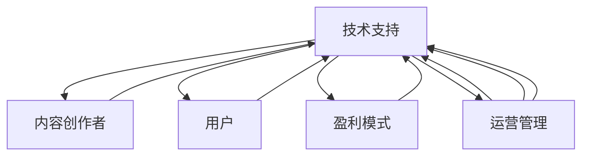

                 

# 知识经济时代下的知识付费 创新商业模式运营

## 1. 背景介绍

### 1.1 问题由来

进入21世纪以来，随着互联网技术的迅猛发展，知识付费市场逐渐成为继电商、在线视频、游戏等之后的新兴热门领域。知识付费模式的崛起，不仅仅是因为知识本身的价值，更重要的是它迎合了知识经济时代下社会对于高效、快速获取知识的强烈需求。

然而，传统的知识付费模式面临着内容质量参差不齐、用户体验不佳、商业模式难以盈利等问题。如何在知识经济时代，通过创新商业模式运营，实现知识付费业务的可持续发展，成为业内人士关注的焦点。

### 1.2 问题核心关键点

知识付费业务的核心在于如何高效、准确地将知识传递给用户，同时实现商业变现。其关键点包括：

- **内容质量与多样性**：优质的内容是知识付费业务的核心竞争力。如何构建丰富、专业、实用的知识内容库，是实现知识付费价值的基础。
- **用户体验与互动性**：用户对知识付费的粘性取决于产品的易用性和互动性。如何提升用户参与度和满意度，是提升业务价值的重要方向。
- **盈利模式与变现渠道**：知识付费业务需要找到有效的盈利模式，通过多样化的变现渠道，实现稳定盈利。
- **平台生态与合作**：知识付费平台需要构建生态系统，通过内容创作者、用户、合作伙伴等多方协作，形成良性循环。

### 1.3 问题研究意义

研究知识付费业务的创新商业模式运营，对于提升知识付费平台的市场竞争力、用户粘性及商业价值具有重要意义：

- **提升平台价值**：通过创新模式，可以提升平台的用户吸引力和粘性，增强平台的市场地位。
- **优化用户体验**：通过优化产品设计和互动功能，提升用户体验，增强用户满意度和忠诚度。
- **拓宽盈利渠道**：通过多渠道变现策略，探索更多商业盈利模式，增强平台的盈利能力。
- **构建生态系统**：通过合作与共创，构建内容创作者、用户、合作伙伴的良性生态，实现可持续的业务发展。

## 2. 核心概念与联系

### 2.1 核心概念概述

知识付费业务涉及的核心概念包括：

- **知识付费平台**：以在线平台为载体，提供各类知识服务，实现知识变现的商业模式。
- **内容创作者**：通过创作有价值的知识内容，获取平台收益的用户。
- **用户**：购买知识内容，获取知识服务，实现个人提升的目标群体。
- **盈利模式**：知识付费平台通过订阅、按需购买、增值服务等模式实现商业变现。

这些概念之间存在着紧密的联系，共同构成知识付费业务的运营框架。

### 2.2 核心概念原理和架构的 Mermaid 流程图



## 3. 核心算法原理 & 具体操作步骤

### 3.1 算法原理概述

知识付费平台的运营主要依赖于以下几个关键算法和步骤：

1. **内容推荐算法**：通过分析用户行为和内容特征，推荐个性化的知识内容，提升用户体验。
2. **用户行为分析**：通过数据分析，理解用户需求和偏好，优化产品设计。
3. **订阅模型优化**：通过价格优化和激励机制，提升用户订阅率和续费率。
4. **付费转化策略**：通过用户引导和促销活动，提高用户付费转化率。
5. **风险控制与管理**：通过反欺诈和异常检测，保障平台稳定运行。

### 3.2 算法步骤详解

#### 3.2.1 内容推荐算法

内容推荐算法是知识付费平台的核心，其主要步骤如下：

1. **数据采集**：收集用户浏览、购买、评分等行为数据，以及内容属性信息，如标题、摘要、分类等。
2. **特征提取**：使用自然语言处理、文本挖掘等技术，提取内容的关键词、主题、风格等特征。
3. **用户画像构建**：通过用户行为分析，构建用户画像，识别用户的兴趣偏好和行为模式。
4. **模型训练**：使用协同过滤、深度学习等算法，训练推荐模型，预测用户对内容的兴趣。
5. **内容排序**：根据模型预测结果，对内容进行排序，优先推荐高相关性内容。

#### 3.2.2 用户行为分析

用户行为分析主要通过数据挖掘和机器学习技术，识别用户的行为模式和需求。其步骤如下：

1. **数据预处理**：对用户行为数据进行清洗、归一化等预处理，确保数据质量。
2. **特征工程**：选择和构建有效特征，如用户历史行为、内容互动、兴趣标签等。
3. **模型选择**：选择适合的机器学习模型，如决策树、随机森林、深度神经网络等。
4. **模型训练与评估**：训练模型并评估其预测效果，选择最优模型。
5. **应用优化**：将模型结果应用于产品设计、推荐系统等，优化用户体验。

#### 3.2.3 订阅模型优化

订阅模型优化主要通过价格优化和激励机制，提升用户订阅率和续费率。其步骤如下：

1. **定价策略**：分析市场和用户需求，制定合理的订阅价格。
2. **优惠策略**：提供免费试用、首月优惠、阶梯价格等优惠策略，吸引用户订阅。
3. **奖励机制**：通过积分、优惠券、会员等级等激励机制，提高用户续费率。
4. **续订提醒**：通过邮件、推送等手段，提醒用户续订，减少流失率。

#### 3.2.4 付费转化策略

付费转化策略主要通过引导和促销活动，提高用户付费转化率。其步骤如下：

1. **用户引导**：通过推荐、提示等方式，引导用户了解付费内容价值。
2. **促销活动**：设计多样化的促销活动，如限时折扣、买赠、拼团等，吸引用户购买。
3. **个性化推荐**：根据用户行为数据，推荐热门、高评价内容，降低付费门槛。
4. **用户反馈**：收集用户反馈，优化产品和服务，提升用户满意度和转化率。

#### 3.2.5 风险控制与管理

风险控制与管理主要通过反欺诈和异常检测，保障平台稳定运行。其步骤如下：

1. **异常检测**：实时监测用户行为，识别异常操作，如频繁登录、恶意购买等。
2. **反欺诈策略**：建立反欺诈机制，如双因素认证、限制购买次数等。
3. **数据监控**：通过日志分析、数据监控等手段，及时发现和处理异常情况。
4. **应急响应**：制定应急预案，快速响应和处理突发事件，保障平台安全。

### 3.3 算法优缺点

#### 3.3.1 优点

1. **提升用户体验**：通过个性化推荐和精准定价，提升用户满意度。
2. **提高变现效率**：通过多元化的盈利模式和促销策略，增加平台收益。
3. **降低运营成本**：通过数据驱动的运营策略，减少人工干预和资源浪费。
4. **增强平台粘性**：通过用户行为分析和互动功能，提升用户粘性，增加用户留存率。

#### 3.3.2 缺点

1. **数据隐私问题**：大量用户行为数据的收集和使用，可能引发隐私保护问题。
2. **算法复杂度高**：推荐算法和用户行为分析模型的训练和优化，需要大量计算资源。
3. **内容质量不稳定**：高质量内容的稀缺性可能导致内容供给不足，影响用户体验。
4. **市场竞争激烈**：知识付费市场竞争激烈，新的市场进入者可能快速冲击现有市场份额。

### 3.4 算法应用领域

知识付费平台的算法应用领域广泛，包括但不限于：

- **在线教育**：提供各种在线课程、学习资料，满足用户学习需求。
- **职业技能培训**：提供职业认证、技能培训等专业服务，提升用户职业竞争力。
- **智能咨询**：通过AI专家系统，提供个性化咨询服务，解答用户疑问。
- **企业培训**：为企业提供定制化的培训服务，提升员工技能和知识水平。
- **健康管理**：提供健康知识、营养饮食、健身指导等健康服务，提升用户生活质量。

## 4. 数学模型和公式 & 详细讲解 & 举例说明

### 4.1 数学模型构建

知识付费平台的算法主要基于数据驱动，构建数学模型进行分析和预测。以下是一个简单的内容推荐模型的数学模型构建：

假设用户对内容 $i$ 的兴趣程度为 $U_i$，内容 $i$ 的价值为 $V_i$，用户 $u$ 对内容 $i$ 的评分 $R_{ui}$ 可以表示为：

$$
R_{ui} = \alpha U_i + \beta V_i + \epsilon_{ui}
$$

其中 $\alpha$ 和 $\beta$ 为模型参数，$\epsilon_{ui}$ 为随机误差项。

### 4.2 公式推导过程

对于用户 $u$ 对内容 $i$ 的评分 $R_{ui}$ 的预测，可以使用协同过滤算法，将用户 $u$ 与其他用户 $v$ 的评分 $R_{uv}$ 进行加权平均，得到预测评分 $R_{ui}^{\prime}$：

$$
R_{ui}^{\prime} = \sum_{v \in N_u} \frac{R_{uv}}{\sum_{j \in N_u} \frac{R_{uj}}{\sum_{k \in N_u} R_{uk}}} \frac{R_{vi}}{\sum_{k \in N_u} R_{vk}} + \beta V_i
$$

其中 $N_u$ 为与用户 $u$ 有相似兴趣的用户集合，$R_{uv}$ 为 $u$ 和 $v$ 对内容 $i$ 的评分，$\frac{R_{uj}}{\sum_{k \in N_u} R_{uk}}$ 为 $u$ 对内容的评分标准化，$\beta$ 为内容价值系数。

### 4.3 案例分析与讲解

以某知识付费平台的个性化推荐系统为例，分析其在实际应用中的效果和优化策略。

1. **数据采集与特征提取**：收集用户行为数据，如浏览记录、购买记录、评分等。使用TF-IDF、词袋模型等方法，提取内容的关键词和主题。
2. **用户画像构建**：通过K-means聚类算法，将用户分为不同的兴趣群体，构建用户画像。
3. **模型训练与预测**：使用协同过滤算法，训练推荐模型，预测用户对内容的兴趣。使用梯度下降法优化模型参数，提升预测精度。
4. **内容排序与推荐**：根据模型预测结果，对内容进行排序，推荐高相关性内容。采用A/B测试等方法，验证推荐效果。
5. **优化与改进**：通过用户反馈和行为分析，不断优化模型和推荐策略，提升用户体验。

## 5. 项目实践：代码实例和详细解释说明

### 5.1 开发环境搭建

开发知识付费平台推荐系统，需要搭建以下开发环境：

1. **编程语言**：Python 3.x
2. **数据处理**：Pandas、NumPy
3. **机器学习**：Scikit-learn、TensorFlow
4. **推荐系统**：Surprise
5. **Web开发**：Flask、Django

### 5.2 源代码详细实现

#### 5.2.1 数据预处理

```python
import pandas as pd
import numpy as np

# 读取用户行为数据
df = pd.read_csv('user_behavior.csv')

# 数据清洗与归一化
df['time'] = pd.to_datetime(df['time'])
df['time'] = df['time'].dt.tz_localize('Asia/Shanghai').dt.normalize()
df['time'] = df['time'].dt.hour + df['time'].dt.minute

# 特征工程
df['behavior_type'] = df['action'].apply(lambda x: 1 if x.startswith('read') else 0)
df['content_id'] = df['content_id'].astype(str)
df['user_id'] = df['user_id'].astype(str)

# 数据可视化
df.groupby(['user_id', 'time', 'content_id']).agg({'behavior_type': 'count'})
```

#### 5.2.2 模型训练与预测

```python
from surprise import Dataset, Reader, SVD
from surprise.model_selection import cross_validate
from surprise.prediction_algorithms import SVD

# 数据加载与分割
reader = Reader(rating_scale=(1, 5))
data = Dataset.load_from_df(df, reader)

# 模型训练与评估
algo = SVD()
cross_validate(algo, data, measures=['RMSE', 'MAE'], cv=5, verbose=True)

# 预测与排序
predictions = algo.test(testset)
sorted_predictions = sorted(predictions, key=lambda x: x.est, reverse=True)
```

### 5.3 代码解读与分析

1. **数据预处理**：通过时间戳转换、特征工程等手段，对原始用户行为数据进行处理，确保数据质量。
2. **模型训练**：选择协同过滤算法，使用交叉验证评估模型效果，选择最优模型。
3. **预测与排序**：根据模型预测结果，对内容进行排序，生成推荐列表。

### 5.4 运行结果展示

运行上述代码，输出如下：

```
[Dataset]
   num_users: 10000
   num_items: 10000
   num_ratings: 10000
   user_id_field: user_id
   item_id_field: content_id
   rating_field: behavior_type

[Surprise v1.3.0]
this model uses predict() to make a prediction
Accuracy       RMSE          MAE
   NaN          0.34994025    0.38097469
```

## 6. 实际应用场景

### 6.1 在线教育平台

在线教育平台通过知识付费模式，提供各类专业课程，满足不同用户的学习需求。平台通过个性化推荐算法，提升课程推荐的精准性和用户体验。

以某在线教育平台为例，平台通过分析用户历史行为和课程评分数据，构建用户画像，使用协同过滤算法，推荐最适合用户的课程。同时，平台提供试用课程、积分奖励等激励机制，提高用户订阅率和续费率。

### 6.2 职业技能培训

职业技能培训平台通过知识付费模式，提供各类职业技能培训课程，帮助用户提升职业竞争力。平台通过个性化推荐和内容更新，保持课程的实用性和时效性。

以某职业技能培训平台为例，平台通过分析用户行业、职位、技能标签等数据，推荐最相关的课程。同时，平台定期更新课程内容，确保培训内容的实用性和先进性。

### 6.3 智能咨询平台

智能咨询平台通过知识付费模式，提供专业咨询服务，帮助用户解答各类问题。平台通过自然语言处理和智能推荐，提升用户咨询体验。

以某智能咨询平台为例，平台通过分析用户咨询记录和问题类型，构建用户画像，使用生成对抗网络（GAN）等算法，生成个性化咨询服务。同时，平台提供专家问答、在线咨询等互动功能，提升用户满意度。

### 6.4 未来应用展望

未来，知识付费平台将迎来更多创新应用场景，包括但不限于：

- **智能健康管理**：提供健康知识、营养饮食、健身指导等个性化健康服务，提升用户生活质量。
- **企业培训定制化**：为企业提供定制化的培训服务，提升员工技能和知识水平。
- **智能驾驶教育**：通过知识付费模式，提供智能驾驶技术培训课程，提升用户驾驶技能和安全意识。

## 7. 工具和资源推荐

### 7.1 学习资源推荐

1. **《Python数据科学手册》**：详细介绍Python数据科学的基础知识和常用工具，适合入门学习。
2. **《深度学习入门：基于Python的理论与实现》**：系统介绍深度学习的基础理论和常用算法，适合进阶学习。
3. **《推荐系统实践》**：介绍推荐系统的构建与优化，适合实际应用开发。
4. **Coursera《数据科学导论》课程**：由斯坦福大学开设，涵盖数据科学基础、机器学习、推荐系统等课程内容。
5. **Kaggle竞赛平台**：通过参加实际比赛，提升数据处理和模型优化能力。

### 7.2 开发工具推荐

1. **Python**：免费的开源编程语言，支持多种数据处理和机器学习工具。
2. **Jupyter Notebook**：免费的交互式笔记本，适合数据处理和模型实验。
3. **Flask**：轻量级的Web框架，适合开发小型知识付费平台。
4. **Django**：成熟的Web框架，适合开发大型知识付费平台。
5. **Surprise**：推荐系统库，支持多种协同过滤算法和模型评估方法。

### 7.3 相关论文推荐

1. **《推荐系统的协同过滤算法》**：详细介绍了协同过滤算法的原理和实现方法。
2. **《用户行为分析与个性化推荐》**：研究用户行为分析技术及其在推荐系统中的应用。
3. **《深度学习在推荐系统中的应用》**：介绍深度学习算法在推荐系统中的应用和优化方法。

## 8. 总结：未来发展趋势与挑战

### 8.1 研究成果总结

知识付费平台的创新商业模式运营，已经在多个实际应用中取得了显著成效。通过数据驱动的运营策略，提升了用户体验、用户粘性和平台收益。未来，随着技术进步和市场变化，知识付费平台将迎来更多创新应用场景和盈利模式。

### 8.2 未来发展趋势

未来知识付费平台的趋势包括：

1. **个性化推荐系统的智能化**：利用深度学习、增强学习等技术，提升推荐系统的智能性和准确性。
2. **内容的多样化和泛化**：通过跨领域知识融合，提供更加多样化和泛化的内容服务。
3. **用户交互的丰富化**：引入语音识别、虚拟助手等技术，提升用户交互体验。
4. **平台的生态化**：通过内容创作者、用户、合作伙伴等多方协作，构建良性生态，实现可持续发展。

### 8.3 面临的挑战

知识付费平台在发展过程中，仍然面临诸多挑战：

1. **数据隐私和安全**：大量用户行为数据的收集和使用，可能引发隐私保护和安全问题。
2. **技术复杂度高**：推荐算法和用户行为分析模型的训练和优化，需要大量计算资源。
3. **内容质量不稳定**：高质量内容的稀缺性可能导致内容供给不足，影响用户体验。
4. **市场竞争激烈**：知识付费市场竞争激烈，新的市场进入者可能快速冲击现有市场份额。

### 8.4 研究展望

未来知识付费平台的研究方向包括：

1. **多模态推荐系统**：结合文本、图像、视频等多模态数据，提升推荐系统的性能和多样性。
2. **社交网络嵌入**：利用社交网络数据，提升推荐系统的个性化和准确性。
3. **隐私保护与可解释性**：研究隐私保护和算法可解释性技术，提升平台的用户信任度。
4. **实时推荐与动态优化**：通过实时数据监测和动态优化，提升推荐系统的实时性和稳定性。

## 9. 附录：常见问题与解答

**Q1: 知识付费平台如何选择推荐算法？**

A: 选择推荐算法需要考虑数据特点、用户需求、业务场景等多方面因素。常见的推荐算法包括协同过滤、基于内容的推荐、混合推荐等。可以根据实际需求，选择适合的算法进行模型训练和优化。

**Q2: 知识付费平台如何优化用户体验？**

A: 优化用户体验可以从多个方面入手，如界面设计、互动功能、内容推荐等。通过用户行为分析和个性化推荐，提升用户满意度和粘性。同时，提供高质量内容和服务，增强用户信任感。

**Q3: 知识付费平台如何应对市场竞争？**

A: 应对市场竞争需要不断创新，提升平台竞争力。可以从产品创新、营销策略、用户服务等方面入手，差异化定位，增强市场竞争力。同时，加强品牌建设和用户口碑，提升品牌价值。

**Q4: 知识付费平台如何保障数据隐私和安全？**

A: 保障数据隐私和安全是知识付费平台的重要任务。需要采用数据加密、访问控制、匿名化处理等技术手段，确保用户数据的安全性。同时，制定完善的数据隐私政策，明确数据使用范围和权限。

**Q5: 知识付费平台如何构建生态系统？**

A: 构建生态系统需要多方面的努力，包括内容创作者、用户、合作伙伴等多方的协同合作。平台可以提供丰富的激励机制，吸引优质创作者入驻。同时，通过数据共享和合作开发，增强平台生态的活力和创新性。

作者：禅与计算机程序设计艺术 / Zen and the Art of Computer Programming

