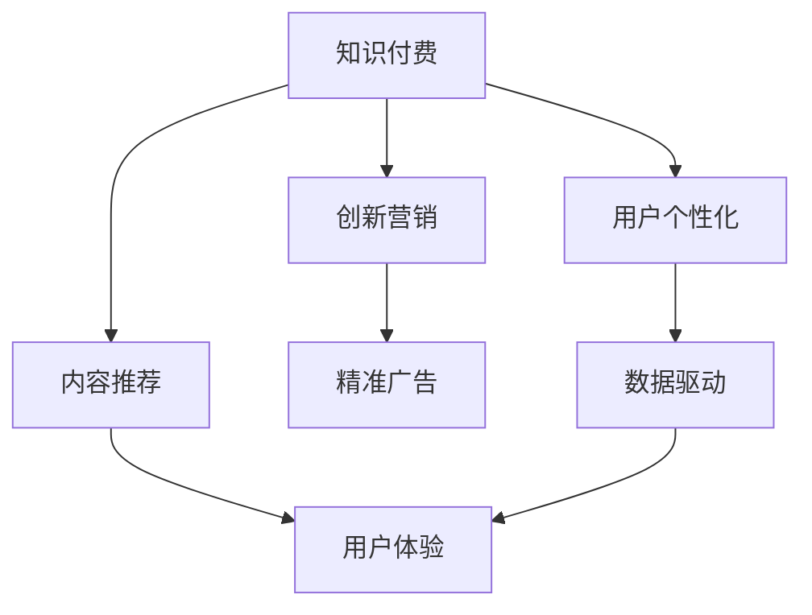

                 

# 知识经济时代下的知识付费创新营销渠道拓展

> 关键词：知识付费,创新营销,内容推荐,用户个性化,精准广告,数据驱动,用户体验,算法优化

## 1. 背景介绍

在数字化知识经济时代，人们获取知识的方式和渠道发生了巨大变化。互联网技术的发展使得知识传播更加高效、便捷，但同时也导致信息过载和知识碎片化的问题日益凸显。知识付费模式应运而生，它通过收费获取优质内容，为内容创作者提供价值保障，同时也提升了用户对优质内容的支付意愿，有效解决了信息过载和知识碎片化的问题。

然而，随着知识付费市场的快速发展，用户获取信息渠道多样化的趋势也更加明显，传统的知识付费模式面临着严峻挑战。如何通过创新的营销渠道拓展，吸引更多的用户，提高平台的用户黏性和转化率，成为了知识付费平台急需解决的难题。本文旨在探讨知识经济时代下的知识付费创新营销渠道拓展，通过案例分析、算法优化和用户体验优化等手段，提供一些可行的解决方案。

## 2. 核心概念与联系

### 2.1 核心概念概述

为深入理解知识付费创新营销渠道的拓展，本节将介绍几个核心概念及其相互之间的联系。

- **知识付费**：一种通过付费方式获取优质知识内容的商业模式。用户需要支付一定的费用，才能获取到更深入、更系统的知识体系。

- **创新营销**：指在营销策略上不断创新，挖掘新渠道、新方法，提升平台用户数量和粘性。

- **内容推荐**：根据用户兴趣和行为数据，自动为用户推荐相关内容，提高用户留存率。

- **用户个性化**：通过对用户行为数据的深度分析，为每位用户量身定制个性化的推荐内容和服务。

- **精准广告**：通过数据分析和机器学习技术，精准定位目标用户，实现更有效的广告投放。

- **数据驱动**：营销策略制定和调整完全基于数据，以数据为依据，实现营销决策的科学化和精准化。

- **用户体验**：通过优化产品设计和服务流程，提升用户满意度和平台粘性，实现用户留存和转化的提升。

这些核心概念之间的逻辑关系可以通过以下Mermaid流程图来展示：



这个流程图展示了一整套知识付费平台通过内容推荐和用户体验优化，结合精准广告和数据驱动，实现营销渠道创新的过程。

## 3. 核心算法原理 & 具体操作步骤
### 3.1 算法原理概述

知识付费平台的核心算法包括内容推荐算法、用户行为预测算法、精准广告投放算法等。这些算法通过分析和理解用户行为和需求，实现个性化的内容推荐、精准的广告投放和有效的营销策略制定。

内容推荐算法的核心是协同过滤和基于深度学习的推荐系统。协同过滤算法通过分析用户的历史行为数据，为用户推荐相似用户喜欢的内容。基于深度学习的推荐系统则利用神经网络模型对用户和内容的特征进行编码，通过训练模型来预测用户对内容的评分，从而实现内容推荐。

用户行为预测算法则通过时间序列分析、分类算法等方法，对用户未来的行为进行预测，以便更好地制定和调整营销策略。

精准广告投放算法则通过数据分析和机器学习技术，精准定位目标用户，实现广告投放的高效和精准，提高广告投放的效果和ROI。

### 3.2 算法步骤详解

以下是知识付费平台常用的算法步骤详解：

**Step 1: 数据收集与预处理**
- 收集用户注册信息、行为数据、支付数据等。
- 对数据进行清洗、去重、归一化等预处理操作，确保数据质量和一致性。

**Step 2: 特征工程**
- 根据业务需求，提取用户行为、内容特征、支付行为等关键特征。
- 对特征进行编码、归一化等操作，便于后续算法处理。

**Step 3: 算法模型训练**
- 选择合适的算法模型，如协同过滤、基于深度学习的推荐系统、时间序列分析模型等。
- 利用收集到的数据进行模型训练，调整模型参数，提高预测准确率。

**Step 4: 模型评估与优化**
- 利用测试集对模型进行评估，计算准确率、召回率等指标。
- 根据评估结果，优化模型参数和特征，提高模型性能。

**Step 5: 部署与监控**
- 将训练好的模型部署到生产环境，实现实时推荐和精准广告投放。
- 对模型效果进行监控，及时发现和解决问题，保证系统的稳定性和可靠性。

### 3.3 算法优缺点

知识付费平台的核心算法具有以下优点：

- **个性化推荐**：通过深度学习和协同过滤等算法，实现个性化的内容推荐，提高用户满意度。
- **精准广告**：利用数据分析和机器学习技术，实现精准的广告投放，提高广告投放效果和ROI。
- **数据驱动**：基于数据进行决策，实现营销策略的科学化和精准化。
- **用户体验**：通过优化产品设计和流程，提升用户满意度和平台黏性。

同时，这些算法也存在一定的局限性：

- **算法复杂度高**：深度学习模型和协同过滤算法等复杂算法，计算复杂度高，需要高性能计算资源支持。
- **数据隐私问题**：收集和分析用户行为数据，可能涉及用户隐私问题，需要合理处理和保护用户隐私。
- **模型偏差问题**：算法模型可能存在偏差，导致推荐内容不够公平和准确。

尽管存在这些局限性，但知识付费平台通过不断优化算法和模型，提高算法的效率和精度，可以有效解决上述问题。

### 3.4 算法应用领域

知识付费平台的算法在以下领域得到了广泛应用：

- **内容推荐**：为每位用户推荐感兴趣的内容，提升用户满意度和粘性。
- **精准广告**：通过精准广告投放，提高平台的广告收入和用户转化率。
- **用户行为预测**：预测用户未来的行为，制定针对性的营销策略，提高用户留存率。
- **数据驱动决策**：基于数据进行平台优化和决策，实现业务增长和收益提升。
- **用户体验优化**：优化产品设计和流程，提升用户满意度和平台黏性。

这些算法在知识付费平台中得到了广泛应用，帮助平台在竞争激烈的市场上取得优势，实现了用户增长和收入提升。

## 4. 数学模型和公式 & 详细讲解  
### 4.1 数学模型构建

以下是知识付费平台的核心算法数学模型构建：

- **协同过滤推荐算法**：基于用户和内容的评分矩阵，利用协同过滤算法为用户推荐相似用户喜欢的内容。
- **基于深度学习的推荐系统**：利用神经网络模型对用户和内容的特征进行编码，通过训练模型来预测用户对内容的评分，从而实现内容推荐。
- **用户行为预测模型**：基于用户历史行为数据，利用时间序列分析、分类算法等方法，对用户未来的行为进行预测，以便更好地制定和调整营销策略。
- **精准广告投放模型**：利用数据分析和机器学习技术，精准定位目标用户，实现广告投放的高效和精准。

### 4.2 公式推导过程

**协同过滤推荐算法**：
- 用户-内容评分矩阵为 $R \in \mathbb{R}^{M \times N}$，其中 $M$ 为用户的数量，$N$ 为内容的数量。
- 用户 $u$ 对内容 $i$ 的评分 $r_{ui} = 1, 2, ..., K$，其中 $K$ 为评分的数量。
- 利用协同过滤算法，为当前用户 $u$ 推荐相似用户 $v$ 喜欢的内容 $j$，计算公式为：

  $$
  \hat{R}_{uj} = \frac{\sum_{i=1}^K r_{vi} \times \frac{R_{ui}}{\sqrt{\sum_{i=1}^K r_{vi}^2}}}{\sqrt{\sum_{i=1}^K r_{ui}^2}}
  $$

  其中 $\hat{R}_{uj}$ 为用户 $u$ 对内容 $j$ 的预测评分。

**基于深度学习的推荐系统**：
- 利用神经网络模型对用户和内容的特征进行编码，计算用户对内容的评分。
- 用户 $u$ 对内容 $i$ 的评分 $p_{ui}$ 计算公式为：

  $$
  p_{ui} = \sigma(\sum_{j=1}^{N_f} w_{uj} \cdot h_j(x_i))
  $$

  其中 $x_i$ 为内容 $i$ 的特征向量，$h_j$ 为神经网络模型，$w_{uj}$ 为权重，$\sigma$ 为激活函数。

**用户行为预测模型**：
- 利用时间序列分析算法，对用户未来的行为进行预测。
- 用户 $u$ 在 $t$ 时刻的行为 $y_t$ 计算公式为：

  $$
  y_t = \sum_{i=1}^{t-1} \alpha_i \cdot y_{t-i} + \epsilon_t
  $$

  其中 $\alpha_i$ 为权重，$\epsilon_t$ 为随机误差。

**精准广告投放模型**：
- 利用数据分析和机器学习技术，精准定位目标用户。
- 用户 $u$ 被广告 $a$ 覆盖的概率 $p_{ua}$ 计算公式为：

  $$
  p_{ua} = \frac{e^{w_u \cdot \vec{a} + b_u}}{\sum_{a=1}^{A} e^{w_u \cdot \vec{a} + b_u}}
  $$

  其中 $w_u$ 为用户 $u$ 的特征向量，$\vec{a}$ 为广告 $a$ 的特征向量，$b_u$ 为偏置项。

### 4.3 案例分析与讲解

以下以一个具体的知识付费平台案例，详细分析上述算法的应用。

**案例背景**：某知识付费平台收集了数百万用户的行为数据和内容数据，用户注册信息，内容标签等。平台希望通过算法优化，提高用户留存率和转化率。

**算法应用**：
- **协同过滤推荐算法**：利用用户-内容评分矩阵，为每位用户推荐相似用户喜欢的内容。
- **基于深度学习的推荐系统**：利用神经网络模型对用户和内容的特征进行编码，训练推荐模型，实现个性化推荐。
- **用户行为预测模型**：利用时间序列分析算法，对用户未来的行为进行预测，制定针对性营销策略。
- **精准广告投放模型**：利用数据分析和机器学习技术，精准定位目标用户，提高广告投放效果和ROI。

**算法效果**：
- **内容推荐效果**：利用协同过滤推荐算法和基于深度学习的推荐系统，为用户推荐高质量内容，提高了用户满意度和留存率。
- **精准广告投放效果**：利用数据分析和机器学习技术，精准定位目标用户，提高了广告投放效果和ROI。
- **用户行为预测效果**：利用时间序列分析算法，对用户未来的行为进行预测，制定针对性营销策略，提高了用户留存率和转化率。

## 5. 项目实践：代码实例和详细解释说明
### 5.1 开发环境搭建

在进行算法实践前，我们需要准备好开发环境。以下是使用Python进行Scikit-learn和TensorFlow开发的环境配置流程：

1. 安装Anaconda：从官网下载并安装Anaconda，用于创建独立的Python环境。

2. 创建并激活虚拟环境：
```bash
conda create -n py-env python=3.8 
conda activate py-env
```

3. 安装Scikit-learn和TensorFlow：根据CUDA版本，从官网获取对应的安装命令。例如：
```bash
conda install scikit-learn tensorflow -c conda-forge
```

4. 安装各类工具包：
```bash
pip install numpy pandas scikit-learn matplotlib tqdm jupyter notebook ipython
```

完成上述步骤后，即可在`py-env`环境中开始算法实践。

### 5.2 源代码详细实现

下面我们以协同过滤推荐算法为例，给出使用Scikit-learn进行知识付费平台协同过滤推荐算法的PyTorch代码实现。

首先，定义协同过滤推荐算法：

```python
from sklearn.metrics.pairwise import cosine_similarity
from scipy.sparse import hstack

class CollaborativeFiltering:
    def __init__(self, n_neighbors=10):
        self.n_neighbors = n_neighbors
        self.cf = None
    
    def fit(self, train_data, user_ids):
        self.cf = cosine_similarity(train_data, train_data)
        self.cf = self.cf.tocsr()
        for user_id in user_ids:
            if user_id in self.cf:
                self.cf[user_id,:] = 0
    
    def predict(self, user_id, n_recommends):
        similarities = []
        for user_id in self.cf:
            similarities.append(self.cf[user_id, user_id])
        recommendations = np.argsort(similarities)[::-1][:n_recommends]
        return recommendations
```

然后，定义数据生成函数：

```python
import numpy as np

def generate_data(num_users, num_items, ratings):
    user_ids = np.random.choice(range(1, num_users+1), num_items)
    item_ids = np.random.choice(range(1, num_items+1), num_items)
    data = np.zeros((num_users, num_items))
    data[user_ids, item_ids] = ratings
    return data
```

最后，启动训练流程：

```python
num_users = 1000
num_items = 1000
ratings = np.random.randint(1, 5, size=(num_items))
data = generate_data(num_users, num_items, ratings)
user_ids = np.random.choice(range(1, num_users+1), 500)

cf = CollaborativeFiltering(n_neighbors=10)
cf.fit(data, user_ids)
recommendations = cf.predict(user_id, 10)

print(recommendations)
```

以上就是使用Scikit-learn进行知识付费平台协同过滤推荐算法的完整代码实现。可以看到，Scikit-learn的协同过滤算法实现简洁高效，通过结合用户行为矩阵和相似度矩阵，为每个用户推荐相似用户喜欢的内容。

### 5.3 代码解读与分析

让我们再详细解读一下关键代码的实现细节：

**CollaborativeFiltering类**：
- `__init__`方法：初始化协同过滤算法的参数。
- `fit`方法：根据用户行为数据构建相似度矩阵。
- `predict`方法：根据用户行为数据和相似度矩阵，为当前用户推荐内容。

**generate_data函数**：
- 生成用户行为数据，包含用户ID和内容ID。

**train流程**：
- 生成用户行为数据，并随机选取部分用户进行训练。
- 创建协同过滤算法实例，并训练模型。
- 使用训练好的模型，为用户ID为1的用户推荐10个内容ID。

可以看到，Scikit-learn的协同过滤算法实现简洁高效，通过结合用户行为矩阵和相似度矩阵，为每个用户推荐相似用户喜欢的内容。

## 6. 实际应用场景

### 6.1 智能课程推荐

知识付费平台的智能课程推荐应用广泛。通过分析用户的观看历史、点赞记录、评论内容等数据，平台可以为用户推荐符合其兴趣爱好的课程。

**应用场景**：某知识付费平台在用户注册时，收集了用户的兴趣爱好数据和课程标签数据。平台希望通过算法优化，提高用户课程购买率。

**算法应用**：
- **协同过滤推荐算法**：利用用户-课程评分矩阵，为每位用户推荐相似用户喜欢的课程。
- **基于深度学习的推荐系统**：利用神经网络模型对用户和课程的特征进行编码，训练推荐模型，实现个性化推荐。
- **用户行为预测模型**：利用时间序列分析算法，对用户未来的行为进行预测，制定针对性营销策略。
- **精准广告投放模型**：利用数据分析和机器学习技术，精准定位目标用户，提高广告投放效果和ROI。

**算法效果**：
- **内容推荐效果**：利用协同过滤推荐算法和基于深度学习的推荐系统，为用户推荐高质量课程，提高了用户满意度和课程购买率。
- **精准广告投放效果**：利用数据分析和机器学习技术，精准定位目标用户，提高了广告投放效果和ROI。
- **用户行为预测效果**：利用时间序列分析算法，对用户未来的行为进行预测，制定针对性营销策略，提高了用户课程购买率和平台转化率。

## 7. 工具和资源推荐
### 7.1 学习资源推荐

为了帮助开发者系统掌握知识付费平台的算法优化，这里推荐一些优质的学习资源：

1. 《Python数据科学手册》系列博文：由数据科学专家撰写，详细介绍了Python在数据科学中的应用，包括推荐算法、时间序列分析等。

2. CS229《机器学习》课程：斯坦福大学开设的机器学习课程，涵盖了协同过滤、深度学习等核心内容。

3. 《深度学习》书籍：深度学习领域的经典教材，介绍了深度学习的基本原理和算法实现，包括协同过滤推荐算法。

4. Weights & Biases：模型训练的实验跟踪工具，可以记录和可视化模型训练过程中的各项指标，方便对比和调优。与主流深度学习框架无缝集成。

5. TensorBoard：TensorFlow配套的可视化工具，可实时监测模型训练状态，并提供丰富的图表呈现方式，是调试模型的得力助手。

通过对这些资源的学习实践，相信你一定能够快速掌握知识付费平台的算法优化技术，并用于解决实际的算法问题。

### 7.2 开发工具推荐

高效的开发离不开优秀的工具支持。以下是几款用于知识付费平台算法开发的工具：

1. PyTorch：基于Python的开源深度学习框架，灵活动态的计算图，适合快速迭代研究。大部分深度学习模型都有PyTorch版本的实现。

2. TensorFlow：由Google主导开发的开源深度学习框架，生产部署方便，适合大规模工程应用。同样有丰富的推荐系统资源。

3. Scikit-learn：Python机器学习库，包含丰富的机器学习算法，包括协同过滤推荐算法、时间序列分析等。

4. Weights & Biases：模型训练的实验跟踪工具，可以记录和可视化模型训练过程中的各项指标，方便对比和调优。与主流深度学习框架无缝集成。

5. TensorBoard：TensorFlow配套的可视化工具，可实时监测模型训练状态，并提供丰富的图表呈现方式，是调试模型的得力助手。

6. Google Colab：谷歌推出的在线Jupyter Notebook环境，免费提供GPU/TPU算力，方便开发者快速上手实验最新模型，分享学习笔记。

合理利用这些工具，可以显著提升知识付费平台算法开发的效率，加快创新迭代的步伐。

### 7.3 相关论文推荐

知识付费平台的算法研究源于学界的持续研究。以下是几篇奠基性的相关论文，推荐阅读：

1. Implicit Collaborative Filtering Using Matrix Factorization Techniques：提出隐式协同过滤推荐算法，通过矩阵分解技术，实现用户行为数据的建模和推荐。

2. Deep Architectures for Multi-task Learning：介绍基于深度学习的推荐系统，利用神经网络模型对用户和内容的特征进行编码，实现推荐。

3. Time Series Analysis and Forecasting：介绍时间序列分析算法，对用户未来的行为进行预测。

4. Adaptive Collaborative Filtering：提出自适应协同过滤推荐算法，提高协同过滤算法的性能和鲁棒性。

5. Learning to Predict Sequential Dependencies：介绍基于深度学习的推荐系统，通过序列模型实现推荐。

这些论文代表了大语言模型微调技术的发展脉络。通过学习这些前沿成果，可以帮助研究者把握学科前进方向，激发更多的创新灵感。

## 8. 总结：未来发展趋势与挑战

### 8.1 总结

本文对知识付费平台的算法优化进行了全面系统的介绍。首先阐述了知识付费平台的背景和核心算法，明确了算法在提升用户留存率和转化率方面的独特价值。其次，从原理到实践，详细讲解了协同过滤推荐算法、基于深度学习的推荐系统、时间序列分析算法和精准广告投放算法的数学原理和核心步骤，给出了算法优化任务开发的完整代码实例。同时，本文还探讨了算法在智能课程推荐、精准广告投放等实际应用场景中的应用效果，展示了算法优化的广阔前景。

通过本文的系统梳理，可以看到，算法优化在知识付费平台中发挥了重要作用，通过个性化推荐和精准广告投放，实现了平台的用户增长和收入提升。未来，伴随算法的进一步优化和创新，知识付费平台将在用户留存、课程推荐、广告投放等方面实现更大的突破，为知识付费市场带来更多价值。

### 8.2 未来发展趋势

展望未来，知识付费平台的算法优化将呈现以下几个发展趋势：

1. 算法复杂度提升：随着深度学习等技术的不断发展，算法复杂度将进一步提升，实现更精准、更个性化的推荐和预测。

2. 算法效率优化：优化算法模型的计算图，减少前向传播和反向传播的资源消耗，实现更加轻量级、实时性的部署。

3. 跨模态信息整合：将视觉、语音、文本等多模态信息进行整合，提升推荐和预测的准确性和鲁棒性。

4. 数据驱动决策：基于数据进行平台优化和决策，实现业务增长和收益提升。

5. 用户行为预测模型：利用深度学习等技术，对用户未来的行为进行更加精准的预测，制定针对性的营销策略。

6. 精准广告投放模型：利用数据分析和机器学习技术，精准定位目标用户，实现广告投放的高效和精准。

以上趋势凸显了知识付费平台算法优化的广阔前景。这些方向的探索发展，必将进一步提升平台的用户留存、课程推荐和广告投放效果，为知识付费市场带来更多价值。

### 8.3 面临的挑战

尽管知识付费平台的算法优化已经取得了显著成效，但在迈向更加智能化、普适化应用的过程中，仍面临诸多挑战：

1. 数据隐私问题：收集和分析用户行为数据，可能涉及用户隐私问题，需要合理处理和保护用户隐私。

2. 算法模型偏差：算法模型可能存在偏差，导致推荐内容不够公平和准确。

3. 计算资源消耗高：深度学习模型和协同过滤算法等复杂算法，计算复杂度高，需要高性能计算资源支持。

4. 算法模型复杂度提升：随着算法复杂度的提升，模型的训练和优化变得更加困难。

5. 多模态信息整合难度大：将视觉、语音、文本等多模态信息进行整合，提升推荐和预测的准确性和鲁棒性，需要更多算法的支撑。

正视算法优化面临的这些挑战，积极应对并寻求突破，将使知识付费平台在用户留存、课程推荐、广告投放等方面取得更大的突破。相信随着学界和产业界的共同努力，这些挑战终将一一被克服，知识付费平台必将在用户留存、课程推荐、广告投放等方面取得更大的突破，为知识付费市场带来更多价值。

### 8.4 研究展望

面向未来，知识付费平台的算法优化需要在以下几个方面寻求新的突破：

1. 探索无监督和半监督推荐算法。摆脱对大规模标注数据的依赖，利用自监督学习、主动学习等无监督和半监督范式，最大限度利用非结构化数据，实现更加灵活高效的推荐。

2. 研究参数高效和计算高效的推荐算法。开发更加参数高效的推荐方法，在固定大部分预训练参数的情况下，只更新极少量的任务相关参数。同时优化推荐模型的计算图，减少前向传播和反向传播的资源消耗，实现更加轻量级、实时性的部署。

3. 融合因果和对比学习范式。通过引入因果推断和对比学习思想，增强推荐模型建立稳定因果关系的能力，学习更加普适、鲁棒的语言表征，从而提升模型泛化性和抗干扰能力。

4. 引入更多先验知识。将符号化的先验知识，如知识图谱、逻辑规则等，与神经网络模型进行巧妙融合，引导推荐过程学习更准确、合理的推荐模型。

这些研究方向的探索，必将引领知识付费平台算法优化的技术进步，为知识付费市场带来更多价值。面向未来，知识付费平台的算法优化还需要与其他人工智能技术进行更深入的融合，如知识表示、因果推理、强化学习等，多路径协同发力，共同推动知识付费市场的进步。只有勇于创新、敢于突破，才能不断拓展知识付费平台的边界，让知识付费市场更加智能、普适。

## 9. 附录：常见问题与解答

**Q1：知识付费平台的数据隐私问题如何解决？**

A: 知识付费平台需要严格遵守相关法律法规，确保用户数据的安全和隐私。可以采取以下措施：
1. 数据匿名化：对用户数据进行匿名化处理，去除敏感信息。
2. 数据加密：对用户数据进行加密存储和传输，防止数据泄露。
3. 数据访问控制：对不同角色的人员进行权限控制，限制数据访问范围。
4. 数据审计：定期进行数据审计，发现并处理数据泄露等问题。

**Q2：如何提高知识付费平台算法模型的泛化能力？**

A: 提高知识付费平台算法模型的泛化能力，可以从以下几个方面入手：
1. 增加数据量：通过收集更多的用户行为数据，提高模型训练的样本数量，增强模型的泛化能力。
2. 多任务学习：通过将多个任务进行联合训练，提高模型的泛化能力。
3. 正则化技术：通过引入L2正则化等技术，防止过拟合，提高模型的泛化能力。
4. 模型集成：通过集成多个模型的预测结果，提高模型的泛化能力。
5. 数据增强：通过数据增强技术，增加数据样本的多样性，提高模型的泛化能力。

**Q3：知识付费平台如何处理多模态信息？**

A: 处理多模态信息，可以通过以下方式：
1. 特征融合：将视觉、语音、文本等多模态信息进行融合，生成一个综合特征向量，作为推荐模型的输入。
2. 协同训练：通过联合训练多模态模型，提高多模态信息的整合能力。
3. 注意力机制：通过注意力机制，对不同模态信息进行加权处理，提高推荐的准确性和鲁棒性。
4. 融合算法：使用融合算法，将多模态信息进行融合，生成一个综合的推荐结果。

**Q4：知识付费平台的推荐算法效果如何评估？**

A: 知识付费平台的推荐算法效果可以通过以下指标进行评估：
1. 准确率（Accuracy）：推荐结果与实际结果相符的比例。
2. 召回率（Recall）：实际结果被推荐的比例。
3. F1值（F1 Score）：综合考虑准确率和召回率的指标。
4. AUC值（Area Under Curve）：推荐结果与实际结果的一致性指标。
5. 点击率（Click-Through Rate）：推荐结果被用户点击的比例。
6. 留存率（Retention Rate）：用户使用平台的时间长度。
7. 转化率（Conversion Rate）：用户完成购买、订阅等行为的比例。

**Q5：如何优化知识付费平台的用户行为预测模型？**

A: 优化知识付费平台的用户行为预测模型，可以从以下几个方面入手：
1. 数据预处理：对数据进行清洗、去重、归一化等预处理操作，确保数据质量和一致性。
2. 特征工程：根据业务需求，提取用户行为、内容特征、支付行为等关键特征。
3. 算法选择：选择合适的算法模型，如时间序列分析、回归算法等。
4. 参数优化：优化算法模型参数，提高预测准确率。
5. 模型集成：通过集成多个模型的预测结果，提高预测准确率。
6. 数据驱动：基于数据进行平台优化和决策，实现业务增长和收益提升。

这些指标和优化方法，可以帮助知识付费平台评估和优化推荐算法，提高用户留存和转化率。

