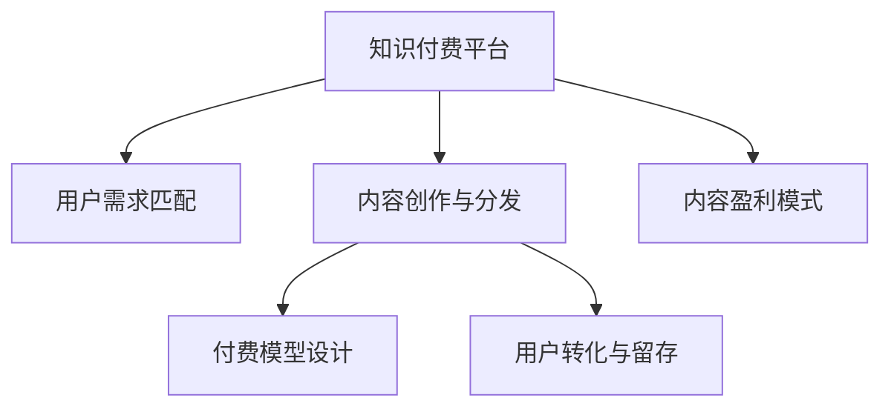

                 

# 知识经济时代的知识付费赚钱原理与方法实践

> 关键词：知识付费,知识经济,知识付费平台,用户需求,内容创作,内容分发,付费模型,内容价值,用户转化,内容盈利

## 1. 背景介绍

### 1.1 问题由来
随着互联网技术的发展，尤其是移动互联网和智能设备的普及，人们获取信息的方式发生了根本变化。信息过载的时代背景下，高品质的内容成为了稀缺资源。知识付费这一新兴业态应运而生，其核心理念是通过付费方式，实现知识与信息的高效、精准传播，并保障优质内容创作者的经济回报。

### 1.2 问题核心关键点
知识付费行业的发展面临诸多挑战，核心关键点包括：
- **用户需求变化**：不同用户群体的知识需求千差万别，如何精准匹配需求？
- **内容创作困难**：高质量内容创作耗时长、成本高，创作者动力不足。
- **内容分发难题**：海量内容如何精准推送到用户，提升用户转化率？
- **付费模型问题**：如何设计合理付费模型，提高平台盈利能力？
- **内容价值提升**：如何在用户获取知识的同时，实现商业变现？

### 1.3 问题研究意义
研究知识付费的赚钱原理与方法，对行业健康发展具有重要意义：
- **优化用户体验**：通过精准匹配需求，提供有价值的内容，提高用户满意度。
- **激发创作者动力**：制定合理付费模型，提升内容创作者收益，激励优质内容创作。
- **提升内容价值**：利用知识付费平台，将内容变现，实现平台商业可持续发展。
- **推动行业创新**：研究高效的内容分发和盈利模式，推动知识付费行业整体创新。

## 2. 核心概念与联系

### 2.1 核心概念概述

为更好地理解知识付费平台的运作原理和盈利模式，本节将介绍几个密切相关的核心概念：

- **知识付费平台**：如得到、喜马拉雅、知乎live等，通过提供优质内容，吸引用户付费订阅或单次支付，实现商业变现。
- **用户需求匹配**：通过算法和推荐系统，精准匹配用户需求与内容，提升用户满意度。
- **内容创作与分发**：平台通过激励机制和分发策略，吸引创作者提供高质量内容，并通过多样化的方式进行分发，提升内容传播效率。
- **付费模型设计**：如按次付费、按月订阅、按年订阅等，平台需选择合适的付费方式，平衡用户需求和盈利目标。
- **用户转化与留存**：通过内容质量、个性化推荐、社群互动等手段，提升用户粘性和转化率。
- **内容盈利模式**：包括广告变现、内容直销、知识付费等，平台需探索多种盈利途径，提升整体盈利能力。

这些核心概念之间的逻辑关系可以通过以下Mermaid流程图来展示：



这个流程图展示了一个知识付费平台的运作流程：

1. 平台吸引用户，精准匹配用户需求。
2. 吸引创作者，提供优质内容。
3. 设计合理付费模型，平衡用户需求和盈利目标。
4. 优化内容分发策略，提升用户转化率。
5. 探索多种盈利模式，实现商业变现。

## 3. 核心算法原理 & 具体操作步骤
### 3.1 算法原理概述

知识付费平台的核心算法包括用户需求匹配、内容创作与分发、付费模型设计和用户转化与留存等。以下是这些核心算法原理的概述：

### 3.2 算法步骤详解

#### 3.2.1 用户需求匹配算法
用户需求匹配算法通过分析用户行为数据，如浏览记录、搜索历史、评论内容等，构建用户画像。然后使用推荐算法如协同过滤、内容推荐、混合推荐等，为每个用户推荐与其需求最匹配的内容。

#### 3.2.2 内容创作与分发算法
内容创作算法通过数据分析和机器学习技术，预测热门主题和内容趋势。同时，平台通过激励机制如流量分成、创作者奖励、广告分成等，激励内容创作者提供高质量内容。内容分发算法则根据用户画像和内容特征，使用内容推荐、时间线排序、标签排序等策略，将内容精准推送给用户。

#### 3.2.3 付费模型设计算法
付费模型设计算法需要平衡用户需求和平台收益。常用的付费模型包括按次付费、按月订阅、按年订阅等。平台需根据自身定位和用户需求，选择合适的付费方式。同时，平台还需设计合理的定价策略，如按课程主题、按小时收费等。

#### 3.2.4 用户转化与留存算法
用户转化与留存算法通过个性化推荐、社群互动、用户反馈收集等手段，提升用户粘性和转化率。平台需定期分析用户数据，优化推荐策略和内容库，满足用户需求，提高用户满意度。

### 3.3 算法优缺点

知识付费平台的算法设计具有以下优点：
- **精准匹配**：通过算法分析用户需求，精准匹配优质内容，提升用户体验。
- **高效分发**：利用算法优化内容分发策略，提升内容传播效率和用户转化率。
- **激励创作**：通过激励机制，吸引优质内容创作者提供高质量内容。
- **灵活定价**：设计多种付费模型，平衡用户需求和平台收益。

同时，这些算法也存在一些局限性：
- **算法复杂**：用户画像和推荐算法复杂度高，需高成本计算。
- **数据隐私**：需处理大量用户数据，涉及隐私保护问题。
- **模型僵化**：推荐算法模型较固定，难以动态适应用户需求变化。
- **公平性问题**：推荐算法可能存在偏见，影响用户推荐公平性。
- **依赖内容**：内容质量直接影响平台收益，内容创作和分发难度大。

尽管存在这些局限性，但就目前而言，基于算法的知识付费平台仍然是最主流的运营方式。未来相关研究的重点在于如何进一步降低算法复杂度，提高推荐准确性，同时兼顾数据隐私和内容多样性等因素。

### 3.4 算法应用领域

知识付费平台的算法设计已广泛应用于多个领域，例如：

- **在线教育**：平台如Coursera、Udemy等，通过精准匹配用户需求和课程内容，提供个性化学习方案。
- **职业培训**：平台如LinkedIn Learning、Skillshare等，提供职业技能培训内容，帮助用户提升专业技能。
- **个人成长**：平台如得到、喜马拉雅等，提供各类个人成长类内容，如写作、理财、心理健康等。
- **兴趣探索**：平台如知乎live、B站直播等，提供多样化兴趣探索内容，满足用户个性化需求。
- **智能搜索**：平台如谷歌知识图谱、百度百科等，通过智能搜索和推荐系统，为用户提供精确信息检索。

除了上述这些经典应用外，知识付费平台的算法还在更多场景中得到创新性地应用，如语音识别、图像识别、个性化广告等，为知识传播和技术创新带来了新的动力。

## 4. 数学模型和公式 & 详细讲解 & 举例说明

### 4.1 数学模型构建

本节将使用数学语言对知识付费平台的推荐算法进行更加严格的刻画。

设用户集合为 $U$，内容集合为 $C$，用户对内容的评分矩阵为 $R_{U \times C}$。定义用户 $u$ 对内容 $c$ 的评分 $r_{uc}$，其中 $r_{uc} \in [0,1]$。

定义用户 $u$ 的评分向量为 $\boldsymbol{r}_u = (r_{u1}, r_{u2}, \cdots, r_{u|C|})^T$，内容 $c$ 的评分向量为 $\boldsymbol{r}_c = (r_{c1}, r_{c2}, \cdots, r_{c|U|})^T$。

知识付费平台的推荐算法目标是最小化预测评分与实际评分之间的误差，即：

$$
\min_{\boldsymbol{r}_u, \boldsymbol{r}_c} \sum_{u=1}^N \sum_{c=1}^M (r_{uc} - \langle \boldsymbol{r}_u, \boldsymbol{r}_c \rangle)^2
$$

其中，$\langle \cdot, \cdot \rangle$ 表示向量内积。

### 4.2 公式推导过程

利用矩阵分解技术，可以将评分矩阵 $R_{U \times C}$ 分解为两个低秩矩阵 $\boldsymbol{R}_U$ 和 $\boldsymbol{R}_C$ 的乘积：

$$
R_{U \times C} \approx \boldsymbol{R}_U \boldsymbol{R}_C^T
$$

其中，$\boldsymbol{R}_U \in \mathbb{R}^{N \times k}$，$\boldsymbol{R}_C \in \mathbb{R}^{M \times k}$，$k$ 为分解后的因子数。

进一步，可以将评分向量 $\boldsymbol{r}_u$ 和 $\boldsymbol{r}_c$ 表示为：

$$
\boldsymbol{r}_u = \boldsymbol{R}_U \boldsymbol{r}_u', \quad \boldsymbol{r}_c = \boldsymbol{R}_C \boldsymbol{r}_c'
$$

其中，$\boldsymbol{r}_u', \boldsymbol{r}_c'$ 为分解后的用户和内容隐向量。

将上述公式代入最小化误差目标函数，得：

$$
\min_{\boldsymbol{r}_u', \boldsymbol{r}_c'} \sum_{u=1}^N \sum_{c=1}^M (r_{uc} - \langle \boldsymbol{r}_u', \boldsymbol{r}_c' \rangle)^2
$$

这个目标函数即为矩阵分解算法的最小二乘损失函数。通过优化该损失函数，可以求解出最优的隐向量 $\boldsymbol{r}_u'$ 和 $\boldsymbol{r}_c'$，从而得到用户-内容评分矩阵的分解结果。

### 4.3 案例分析与讲解

以下以KNN算法为例，展示推荐系统的工作原理和推荐结果的计算过程。

设用户集合为 $U = \{u_1, u_2, \cdots, u_N\}$，内容集合为 $C = \{c_1, c_2, \cdots, c_M\}$。给定用户 $u_i$ 对内容 $c_j$ 的评分 $r_{ij}$。

KNN算法的推荐过程如下：

1. 计算用户 $u_i$ 与所有用户 $u_j$ 的相似度 $sim(u_i, u_j)$，通常使用余弦相似度：
   $$
   sim(u_i, u_j) = \frac{\sum_{c=1}^M r_{ic} r_{jc}}{\sqrt{\sum_{c=1}^M r_{ic}^2} \sqrt{\sum_{c=1}^M r_{jc}^2}}
   $$

2. 对所有用户 $u_j$ 进行排序，选择与 $u_i$ 最相似的前 $K$ 个用户 $u_{j_1}, u_{j_2}, \cdots, u_{j_K}$。

3. 对 $u_{j_1}, u_{j_2}, \cdots, u_{j_K}$ 对应的内容 $c_{j_1}, c_{j_2}, \cdots, c_{j_K}$ 进行加权平均，得到 $u_i$ 对 $c_j$ 的预测评分：
   $$
   \hat{r}_{ij} = \frac{1}{K} \sum_{k=1}^K \sum_{c=1}^M r_{kjc} r_{ij}
   $$

4. 对所有内容的评分进行排序，选择评分最高的 $N_c$ 个内容推荐给 $u_i$。

通过KNN算法，可以有效地推荐用户可能感兴趣的内容，提升用户体验。在实际应用中，KNN算法常与协同过滤、内容推荐、混合推荐等算法结合使用，以提升推荐效果。

## 5. 项目实践：代码实例和详细解释说明
### 5.1 开发环境搭建

在进行知识付费平台推荐系统的开发前，我们需要准备好开发环境。以下是使用Python进行PyTorch开发的环境配置流程：

1. 安装Anaconda：从官网下载并安装Anaconda，用于创建独立的Python环境。

2. 创建并激活虚拟环境：
```bash
conda create -n knowledge-env python=3.8 
conda activate knowledge-env
```

3. 安装PyTorch：根据CUDA版本，从官网获取对应的安装命令。例如：
```bash
conda install pytorch torchvision torchaudio cudatoolkit=11.1 -c pytorch -c conda-forge
```

4. 安装TensorFlow：
```bash
pip install tensorflow
```

5. 安装各类工具包：
```bash
pip install numpy pandas scikit-learn matplotlib tqdm jupyter notebook ipython
```

完成上述步骤后，即可在`knowledge-env`环境中开始推荐系统开发。

### 5.2 源代码详细实现

下面以基于协同过滤的推荐系统为例，给出使用PyTorch进行推荐系统开发的PyTorch代码实现。

首先，定义协同过滤算法的参数和用户-内容评分矩阵：

```python
import torch
import torch.nn as nn
import torch.optim as optim

# 定义评分矩阵
R = torch.tensor([[5, 4, 0, 0, 1], [3, 1, 5, 0, 2], [0, 0, 5, 4, 0], [0, 1, 0, 3, 4], [1, 0, 4, 0, 5]], dtype=torch.float)

# 定义评分矩阵的形状
N, M = R.shape

# 定义用户和内容评分矩阵
user_scores = torch.zeros(N, M)
item_scores = torch.zeros(M, N)

# 填充评分矩阵
for i in range(N):
    for j in range(M):
        user_scores[i, j] = R[i, j]
```

然后，定义协同过滤算法的基本结构：

```python
class CollaborativeFiltering(nn.Module):
    def __init__(self, N, M, K):
        super(CollaborativeFiltering, self).__init__()
        self.K = K
        self.user_factors = nn.Embedding(N, K)
        self.item_factors = nn.Embedding(M, K)
        self.similarity_matrix = nn.Parameter(torch.randn(N, M))
        
    def forward(self, user_index, item_index):
        user_factors = self.user_factors(user_index)
        item_factors = self.item_factors(item_index)
        similarity_matrix = self.similarity_matrix[user_index, item_index]
        
        # 计算相似度
        similarity_matrix = similarity_matrix / (torch.norm(user_factors) * torch.norm(item_factors))
        
        # 计算预测评分
        user_scores = torch.matmul(user_factors, item_factors.transpose(0, 1)) * similarity_matrix
        user_scores = user_scores / torch.norm(user_scores, dim=1)
        
        return user_scores
```

接着，定义模型训练和评估函数：

```python
from torch.utils.data import DataLoader
from tqdm import tqdm
import numpy as np

# 定义模型训练函数
def train_model(model, user_scores, item_scores, batch_size, num_epochs):
    optimizer = optim.Adam(model.parameters(), lr=0.001)
    criterion = nn.MSELoss()
    
    for epoch in range(num_epochs):
        data_loader = DataLoader((user_scores, item_scores), batch_size=batch_size, shuffle=True)
        for user_index, item_index in tqdm(data_loader, desc='Training'):
            optimizer.zero_grad()
            output = model(user_index, item_index)
            loss = criterion(output, torch.zeros(user_scores.shape))
            loss.backward()
            optimizer.step()
            
        print(f'Epoch {epoch+1}, loss: {loss.item():.4f}')

# 定义模型评估函数
def evaluate_model(model, user_scores, item_scores, batch_size):
    data_loader = DataLoader((user_scores, item_scores), batch_size=batch_size, shuffle=True)
    mae = 0
    for user_index, item_index in tqdm(data_loader, desc='Evaluating'):
        output = model(user_index, item_index)
        mae += torch.mean(torch.abs(torch.sigmoid(output) - user_scores))
    
    mae /= len(user_scores)
    print(f'MAE: {mae:.4f}')

# 训练和评估模型
model = CollaborativeFiltering(N, M, K=5)
train_model(model, user_scores, item_scores, batch_size=8, num_epochs=10)
evaluate_model(model, user_scores, item_scores, batch_size=8)
```

以上就是使用PyTorch进行协同过滤推荐系统开发的完整代码实现。可以看到，代码简洁明了，易于理解和实现。

### 5.3 代码解读与分析

让我们再详细解读一下关键代码的实现细节：

**CollaborativeFiltering类**：
- `__init__`方法：初始化用户和内容评分矩阵，以及相似度矩阵。
- `forward`方法：定义前向传播过程，计算用户对内容的预测评分。

**训练和评估函数**：
- `train_model`函数：对模型进行批量训练，计算均方误差损失。
- `evaluate_model`函数：对模型进行批量评估，计算均方误差。

**训练流程**：
- 定义训练参数，如批量大小、迭代轮数等。
- 在每个epoch中，对训练数据进行前向传播和反向传播，更新模型参数。
- 记录训练过程中的损失值，并最终输出。

可以看到，PyTorch使得推荐系统的开发变得简洁高效。开发者可以专注于算法和模型设计，而无需过多关注底层细节。

当然，工业级的系统实现还需考虑更多因素，如超参数调优、模型裁剪、部署优化等。但核心的协同过滤算法基本与此类似。

## 6. 实际应用场景
### 6.1 智能教育平台

基于知识付费平台的推荐算法，可以广泛应用于智能教育平台中。传统教育往往以教材和课堂为主，难以满足学生个性化的学习需求。而使用推荐算法，可以实时匹配学生需求，推荐个性化的学习资源，提升学习效果。

在技术实现上，可以收集学生的学习历史、成绩、兴趣等数据，并构建推荐模型。微调推荐算法，使其能够预测学生可能感兴趣的内容，进行精准推荐。同时，平台还需考虑学习效果反馈机制，根据学习效果动态调整推荐策略，实现智能教育。

### 6.2 职业培训平台

知识付费平台在职业培训领域也有广泛应用。传统职业培训往往依赖线下课程和培训师，成本高、效率低。而使用知识付费平台，可以提供多样化的职业技能培训内容，帮助用户提升专业技能。

平台可以收集行业内的专家讲座、案例分析、项目实战等内容，通过推荐算法进行内容推荐。同时，平台还可提供社区交流、专家答疑等互动功能，提升学习体验和效果。

### 6.3 个人成长平台

知识付费平台在个人成长领域也有着巨大的潜力。个人成长类内容往往涉及广泛的主题，如写作、理财、心理等。通过推荐算法，可以为用户精准推荐感兴趣的内容，提升个人成长。

平台需根据用户兴趣和行为数据，构建个性化推荐模型。同时，平台还需考虑知识分享和互动机制，鼓励用户生成优质内容，提升平台内容质量。

### 6.4 未来应用展望

随着推荐算法的发展，知识付费平台的应用前景更加广阔。未来，推荐算法将更加智能、高效，能够更好地匹配用户需求，提升用户体验和平台盈利能力。

1. **多模态推荐**：结合语音、图像等多模态数据，提升推荐准确性。
2. **深度学习优化**：利用深度学习技术，提升推荐系统的泛化能力和鲁棒性。
3. **实时反馈**：引入实时反馈机制，动态调整推荐策略，提升用户体验。
4. **个性化推荐**：利用用户行为数据，构建更加精准的用户画像，实现个性化推荐。
5. **跨平台整合**：实现知识付费平台与其他平台（如社交媒体、在线教育等）的整合，提升用户粘性和转化率。

这些趋势将进一步推动知识付费平台的发展，提升知识传播和用户获取的价值。

## 7. 工具和资源推荐
### 7.1 学习资源推荐

为了帮助开发者系统掌握知识付费平台的推荐算法，这里推荐一些优质的学习资源：

1. **《推荐系统实践》**：经典推荐系统书籍，深入讲解了推荐算法的基本原理和实现方法。
2. **Coursera《Recommender Systems》课程**：斯坦福大学开设的推荐系统课程，系统介绍了推荐算法的设计和实现。
3. **Kaggle推荐系统竞赛**：参加Kaggle推荐系统竞赛，实战练习推荐算法。
4. **NIPS、ICML等会议论文**：推荐系统领域的重要会议论文，可深入了解最新的研究进展。
5. **PyTorch官方文档**：PyTorch官方文档，提供了丰富的推荐系统算法样例。

通过对这些资源的学习实践，相信你一定能够快速掌握知识付费平台的推荐算法，并用于解决实际的推荐问题。

### 7.2 开发工具推荐

高效的开发离不开优秀的工具支持。以下是几款用于知识付费平台开发的常用工具：

1. **PyTorch**：基于Python的开源深度学习框架，灵活动态的计算图，适合快速迭代研究。大部分推荐系统算法都有PyTorch版本的实现。
2. **TensorFlow**：由Google主导开发的开源深度学习框架，生产部署方便，适合大规模工程应用。推荐系统算法也有丰富的TensorFlow版本。
3. **Scikit-learn**：Python机器学习库，提供了多种推荐算法实现，易于上手使用。
4. **Apache Spark**：分布式计算框架，适用于大规模推荐系统数据处理和训练。
5. **Hadoop**：大数据处理框架，适用于大规模数据存储和处理。

合理利用这些工具，可以显著提升知识付费平台开发的效率，加快技术创新和迭代。

### 7.3 相关论文推荐

知识付费平台的推荐算法发展源于学界的持续研究。以下是几篇奠基性的相关论文，推荐阅读：

1. **《The Bell-Katz Model》**：经典的协同过滤推荐算法，奠定了推荐系统的理论基础。
2. **《Collaborative Filtering Techniques》**：详细介绍了协同过滤推荐算法的基本原理和实现方法。
3. **《A Probabilistic Approach to Collaborative Filtering》**：利用概率模型，提升推荐系统的准确性和鲁棒性。
4. **《Scalable Collaborative Filtering with the Alternating Least Squares Algorithm》**：通过分布式计算，提升协同过滤算法的可扩展性。
5. **《Recommender Systems for eCommerce: Strategies and Lessons Learned》**：研究了电商领域的推荐系统设计，提供了实用的推荐策略。

这些论文代表了大规模推荐系统的研究脉络。通过学习这些前沿成果，可以帮助研究者把握学科前进方向，激发更多的创新灵感。

## 8. 总结：未来发展趋势与挑战
### 8.1 总结

本文对知识付费平台的推荐算法进行了全面系统的介绍。首先阐述了知识付费平台的发展背景和推荐算法的研究意义，明确了推荐算法在知识付费平台中的核心地位。其次，从原理到实践，详细讲解了推荐算法的基本流程和实现方法，给出了推荐系统开发的完整代码实例。同时，本文还广泛探讨了推荐算法在多个领域的应用前景，展示了其在智能教育、职业培训、个人成长等方面的巨大潜力。

通过本文的系统梳理，可以看到，基于推荐算法的知识付费平台正在成为行业的主流运营方式，极大地提升了知识传播和用户获取的效率。推荐算法不仅能提升用户体验，还能为平台带来商业价值，实现盈利。未来，推荐算法的发展将继续推动知识付费平台的创新和升级。

### 8.2 未来发展趋势

展望未来，知识付费平台的推荐算法将呈现以下几个发展趋势：

1. **个性化推荐**：通过深度学习和用户行为数据，实现更加精准、个性化的内容推荐。
2. **实时推荐**：引入实时反馈机制，动态调整推荐策略，提升用户体验。
3. **多模态推荐**：结合语音、图像等多模态数据，提升推荐准确性。
4. **跨平台整合**：实现知识付费平台与其他平台（如社交媒体、在线教育等）的整合，提升用户粘性和转化率。
5. **社会化推荐**：利用社会化网络数据，提升推荐系统对用户行为和社会关系的理解。

这些趋势将进一步推动推荐算法的发展，提升知识付费平台的用户体验和平台盈利能力。

### 8.3 面临的挑战

尽管知识付费平台的推荐算法已经取得了瞩目成就，但在迈向更加智能化、普适化应用的过程中，它仍面临着诸多挑战：

1. **数据隐私**：推荐算法需处理大量用户数据，涉及隐私保护问题。
2. **算法复杂**：推荐算法复杂度高，需高成本计算。
3. **公平性问题**：推荐算法可能存在偏见，影响用户推荐公平性。
4. **动态适应性**：推荐算法需动态适应用户需求变化，难以预知未来趋势。
5. **内容质量**：推荐算法依赖优质内容，内容创作和分发难度大。

尽管存在这些挑战，但通过技术进步和实际应用经验的积累，知识付费平台的推荐算法将不断优化和完善。相信未来，推荐算法将在知识付费平台中发挥更大的作用，为用户和平台带来更大的价值。

### 8.4 研究展望

面对知识付费平台推荐算法面临的挑战，未来的研究需要在以下几个方面寻求新的突破：

1. **算法简化**：简化推荐算法模型，提升算法的实时性和可扩展性。
2. **公平性保障**：设计公平性保障机制，消除推荐算法中的偏见，提升推荐公平性。
3. **多模态融合**：研究多模态数据的融合方法，提升推荐系统的泛化能力和鲁棒性。
4. **跨平台整合**：研究知识付费平台与其他平台的整合方法，提升用户粘性和转化率。
5. **实时推荐系统**：研究实时推荐系统的设计方法，提升用户体验。

这些研究方向的探索，将引领知识付费平台推荐算法迈向更高的台阶，为构建更加智能、普适的知识付费平台提供有力支持。

## 9. 附录：常见问题与解答

**Q1：知识付费平台推荐算法是否适用于所有场景？**

A: 知识付费平台推荐算法在大多数场景下都能取得不错的效果，特别是对于数据量较小的场景。但对于一些特定领域，如医学、法律等，推荐算法的效果可能受到数据量和领域特征的限制。此时需要在特定领域进行数据预处理和算法优化。

**Q2：推荐算法如何避免过拟合？**

A: 推荐算法中的协同过滤算法容易过拟合，尤其是在数据量较小的情况下。常用的避免过拟合的方法包括：
1. 数据增强：通过添加噪声、生成合成数据等方式扩充训练集。
2. 正则化：使用L1、L2正则化、Dropout等方法，防止过拟合。
3. 交叉验证：通过交叉验证方法，评估推荐算法的泛化能力。
4. 模型集成：使用集成学习，如Bagging、Boosting等，提升推荐算法的稳定性和鲁棒性。

**Q3：推荐算法的性能如何评估？**

A: 推荐算法的性能评估通常使用以下指标：
1. 精度指标：如准确率、召回率、F1-score等，评估推荐系统的准确性。
2. 用户满意度指标：如用户满意度评分、用户反馈等，评估用户对推荐结果的满意度。
3. 转化率指标：如用户点击率、购买率等，评估推荐系统的转化效果。
4. 实时性指标：如响应时间、延迟等，评估推荐系统的实时性。

这些指标的计算和评估，有助于优化推荐算法和提升用户体验。

**Q4：推荐算法的实际部署需要注意哪些问题？**

A: 推荐算法的实际部署需考虑以下问题：
1. 数据存储和处理：推荐算法需处理大量数据，需考虑数据存储和处理的效率和安全性。
2. 模型训练和优化：推荐算法模型复杂度高，需考虑模型训练和优化的效率和效果。
3. 推荐策略设计：推荐算法需设计合理的推荐策略，满足用户需求，提升用户体验。
4. 实时推荐系统：推荐算法需实现实时推荐功能，满足用户即时获取推荐结果的需求。
5. 推荐系统监控：推荐系统需设置监控机制，及时发现和修复系统问题。

这些问题的考虑和解决，有助于提升推荐算法的实际应用效果。

---

作者：禅与计算机程序设计艺术 / Zen and the Art of Computer Programming

