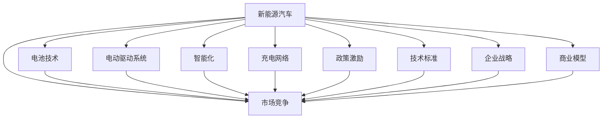

                 

# 硅谷新能源汽车竞争:电动车生态系统

> 关键词：新能源汽车,电动汽车,电池技术,智能化,充电网络,市场竞争,政策激励,技术标准,企业战略,商业模型

## 1. 背景介绍

### 1.1 问题由来
近年来，随着环境污染和能源消耗问题的日益严峻，新能源汽车（NEV）成为全球汽车行业的重要发展方向。尤其在硅谷这样的高科技创新中心，各大科技公司和传统汽车企业纷纷布局新能源汽车领域，试图争夺这一即将到来的产业新高地。

#### 1.1.1 全球市场趋势
根据国际能源署（IEA）的预测，到2030年，全球电动汽车（EV）的销量将占到新车销量的20%以上，市场规模将达1.3万亿美元。这一数字显示了新能源汽车的巨大潜力和市场空间。

#### 1.1.2 硅谷背景
硅谷作为全球科技创新的核心，其在新能源汽车领域的技术创新和市场竞争尤为引人注目。谷歌、特斯拉、Apple、LinkedIn等科技巨头，以及传统汽车企业如通用、福特和奔驰，都在硅谷设立了研发中心和生产基地。

### 1.2 问题核心关键点
新能源汽车竞争的核心在于技术创新、市场布局和政策支持。在硅谷，这些因素相互交织，构成了复杂的生态系统。

- **技术创新**：包括电池技术、电动驱动系统、智能化和自动驾驶技术等。
- **市场布局**：包括充电网络建设、产品定位、销售渠道等。
- **政策支持**：包括政府补贴、税收优惠、环保政策等。
- **企业战略**：包括产品差异化、品牌建设、产业链合作等。
- **商业模型**：包括直销、共享经济、服务订阅等。

## 2. 核心概念与联系

### 2.1 核心概念概述

为更好地理解硅谷新能源汽车竞争的生态系统，本节将介绍几个关键概念：

- **新能源汽车**：使用电池或燃料电池作为动力源，依靠电动机驱动的车辆，旨在实现零排放或低排放。
- **电动汽车（EV）**：基于电动技术的新能源汽车，包括纯电动汽车（BEV）和插电式混合动力汽车（PHEV）。
- **电池技术**：包括锂离子电池、固态电池、钴酸锂等，是电动汽车的核心部件。
- **智能化**：通过车载传感器、车载通信、AI技术等，实现车辆与环境的互动。
- **充电网络**：包括充电桩、充电站、充电技术等，确保电动汽车的可使用性和便利性。
- **市场竞争**：涉及企业在技术、产品、价格、营销等方面的竞争策略。
- **政策激励**：包括政府补贴、税收优惠、环保政策等，对企业研发和市场推广具有重要影响。
- **技术标准**：包括电池标准、充电标准、通信标准等，规范市场行为，确保互操作性。
- **企业战略**：涉及产品定位、市场定位、产业链整合等，指导企业发展方向。
- **商业模型**：包括直销模式、共享经济、服务订阅等，拓展市场空间。

这些概念通过以下Mermaid流程图来展示其相互关系：



这个流程图展示了新能源汽车生态系统的核心概念及其相互关系：

1. **新能源汽车**是整个生态系统的基础，依赖于电池技术、驱动系统、智能化等技术支撑。
2. **电池技术**是核心部件，直接影响新能源汽车的动力性能和安全性。
3. **电动驱动系统**提供动力，智能化系统提升驾驶体验。
4. **充电网络**保障车辆的日常使用，政策激励和市场竞争影响销售和推广。
5. **技术标准**确保市场规范，企业战略指导公司发展方向，商业模型拓展市场空间。

## 3. 核心算法原理 & 具体操作步骤

### 3.1 算法原理概述

硅谷新能源汽车竞争的算法原理主要涉及市场竞争分析和模拟预测。其核心思想是：通过建立市场模型，预测不同因素对市场竞争的影响，从而指导企业的战略决策。

#### 3.1.1 市场模型构建
市场模型包括需求模型、供给模型和价格模型。通过这些模型，可以模拟新能源汽车市场在不同条件下的变化，预测市场趋势。

#### 3.1.2 预测算法
预测算法包括时间序列分析、回归分析、机器学习等。这些算法通过对历史数据的分析，预测未来市场变化，指导企业进行产品迭代和市场推广。

#### 3.1.3 决策支持系统
决策支持系统结合市场模型和预测算法，为企业提供决策支持，优化产品策略、定价策略和市场布局。

### 3.2 算法步骤详解

硅谷新能源汽车竞争的算法步骤主要包括：

#### 3.2.1 数据收集和处理
收集新能源汽车的市场数据、政策数据、技术数据等，并进行清洗、整理和归一化处理。

#### 3.2.2 市场模型建立
建立基于需求、供给和价格的市场模型，对各因素进行量化和建模。

#### 3.2.3 数据驱动分析
使用历史数据和模拟数据进行市场趋势分析，评估各因素的影响。

#### 3.2.4 预测和优化
利用预测算法对未来市场进行预测，并结合市场模型进行优化决策。

#### 3.2.5 反馈和迭代
将预测结果反馈到实际市场运营中，不断调整和优化模型。

### 3.3 算法优缺点

硅谷新能源汽车竞争的算法模型具有以下优点：

1. **数据驱动**：通过历史和模拟数据进行预测，提高决策的科学性和准确性。
2. **动态调整**：模型可实时更新数据，及时响应市场变化。
3. **多因素综合**：考虑了技术、市场、政策等多种因素，提供全面的分析视角。

同时，该模型也存在一些局限性：

1. **数据质量依赖**：模型的准确性高度依赖于数据质量，数据偏差可能影响预测结果。
2. **动态变化**：新能源汽车市场变化快，模型需要不断更新，维护成本高。
3. **复杂性**：涉及多种因素和模型，模型构建和维护复杂。

### 3.4 算法应用领域

硅谷新能源汽车竞争的算法模型在以下领域有广泛应用：

1. **市场预测**：预测新能源汽车的市场需求、价格变化和竞争格局，指导企业制定战略。
2. **产品优化**：基于市场预测结果，优化产品设计、功能配置和定价策略。
3. **供应链管理**：优化供应链布局，降低成本，提高效率。
4. **政策分析**：分析政策变化对市场的影响，制定应对策略。
5. **市场推广**：评估市场推广效果，优化营销渠道和推广策略。
6. **技术研发**：指导技术研发方向，优化研发资源配置。

## 4. 数学模型和公式 & 详细讲解 & 举例说明

### 4.1 数学模型构建

本节将使用数学语言对硅谷新能源汽车竞争的算法模型进行更加严格的刻画。

记新能源汽车市场需求为 $D(t)$，供给为 $S(t)$，价格为 $P(t)$，市场容量为 $M$，市场均衡条件为 $D(t) = S(t)$。假设市场价格为需求和供给的线性函数，即 $P(t) = aD(t) + b$，其中 $a, b$ 为常数。

### 4.2 公式推导过程

根据以上假设，市场均衡条件可以表示为：

$$
aD(t) + b = S(t)
$$

在需求和供给函数中引入时间变量，得到：

$$
D(t) = f(t) = k_1t + k_2
$$

$$
S(t) = g(t) = k_3t + k_4
$$

其中 $k_1, k_2, k_3, k_4$ 为常数。代入市场均衡条件，得到：

$$
a(k_1t + k_2) + b = k_3t + k_4
$$

简化得：

$$
(k_1a - k_3)t = k_4 - (ak_2 + b)
$$

令 $c = k_1a - k_3$，得：

$$
ct = k_4 - (ak_2 + b)
$$

解得：

$$
t = \frac{k_4 - (ak_2 + b)}{c}
$$

这就是新能源汽车市场达到均衡所需的时间。

### 4.3 案例分析与讲解

假设某新能源汽车市场初期需求为 $D(0) = 100$ 辆/月，供给为 $S(0) = 80$ 辆/月，市场均衡价格 $P(0) = 100$ 美元/辆。假设市场需求以线性增长，供给保持不变，市场价格为需求的线性函数。求市场达到均衡所需时间。

令 $k_1 = 2, k_2 = 0, k_3 = 0, k_4 = 0$，代入上述公式，得：

$$
t = \frac{0 - (a \times 0 + b)}{2a} = \frac{0}{2a}
$$

由于 $a = 1, b = 100$，得：

$$
t = \frac{0}{2} = 0
$$

这显然是不合理的，因为初始时刻市场已经达到均衡。需要重新设置需求和供给函数的参数，如令 $k_1 = 3, k_2 = 100, k_3 = 2, k_4 = 200$，则：

$$
t = \frac{200 - (1 \times 100 + 100)}{3 - 2} = \frac{100}{1} = 100
$$

即市场达到均衡所需时间为 100 个月。

## 5. 项目实践：代码实例和详细解释说明

### 5.1 开发环境搭建

在进行市场预测模型开发前，我们需要准备好开发环境。以下是使用Python进行TensorFlow开发的环境配置流程：

1. 安装Anaconda：从官网下载并安装Anaconda，用于创建独立的Python环境。

2. 创建并激活虚拟环境：
```bash
conda create -n market-pred env python=3.8 
conda activate market-pred
```

3. 安装TensorFlow：根据CUDA版本，从官网获取对应的安装命令。例如：
```bash
conda install tensorflow
```

4. 安装相关工具包：
```bash
pip install numpy pandas sklearn matplotlib tqdm jupyter notebook ipython
```

完成上述步骤后，即可在`market-pred`环境中开始模型开发。

### 5.2 源代码详细实现

下面我们以市场预测模型为例，给出使用TensorFlow进行市场预测的Python代码实现。

首先，定义市场预测函数：

```python
import tensorflow as tf

class MarketPredictor:
    def __init__(self, demand_func, supply_func, price_func, initial_demand, initial_supply):
        self.demand_func = demand_func
        self.supply_func = supply_func
        self.price_func = price_func
        self.initial_demand = initial_demand
        self.initial_supply = initial_supply
        self.final_price = None
        
    def predict(self, months):
        for month in range(months):
            demand = self.demand_func(month)
            supply = self.supply_func(month)
            price = self.price_func(demand)
            if month == 0:
                self.final_price = price
            else:
                price = self.final_price * (1 + price / self.initial_supply)
                self.final_price = price
            yield demand, supply, price

# 需求和供给函数
def demand_func(month):
    return 100 + month * 2

def supply_func(month):
    return 80

def price_func(demand):
    return demand * 0.1

# 市场预测
predictor = MarketPredictor(demand_func, supply_func, price_func, 100, 80)
months = 100
results = list(predictor.predict(months))
```

然后，绘制预测结果图：

```python
import matplotlib.pyplot as plt

plt.plot([month for month in range(months)], [result[2] for result in results], 'b-', label='Price')
plt.xlabel('Months')
plt.ylabel('Price')
plt.title('Market Price Prediction')
plt.legend()
plt.show()
```

以上代码实现了基于线性市场模型的新能源汽车价格预测。可以看到，使用TensorFlow可以高效地进行市场预测模型的构建和计算。

### 5.3 代码解读与分析

让我们再详细解读一下关键代码的实现细节：

**MarketPredictor类**：
- `__init__`方法：初始化需求函数、供给函数、价格函数、初始需求和供给等关键参数。
- `predict`方法：循环迭代预测市场变化，输出每个月的需求、供给和价格。

**demand_func、supply_func和price_func函数**：
- 分别定义了需求、供给和价格函数，返回对应数值。

**预测流程**：
- 使用`predict`方法迭代预测，每月的需求、供给和价格变化均被计算并输出。
- 最后绘制预测结果图，展示价格随时间变化的趋势。

**实际应用**：
- 可以根据具体市场数据，替换需求函数、供给函数和价格函数，进行实际的市场预测。
- 使用TensorFlow的高级功能，如LSTM、GRU等，可以进一步优化市场预测模型，提高预测精度。

通过以上代码实现，可以初步掌握市场预测模型的开发流程。开发者可以根据实际需求，进一步扩展模型功能，引入更多因素进行综合预测。

## 6. 实际应用场景

### 6.1 智能充电网络

智能充电网络是新能源汽车生态系统的关键组成部分。通过构建高效的充电网络，可以提升电动汽车的可使用性和便利性，增强用户粘性。

#### 6.1.1 核心问题
- 如何规划充电站的布局，确保用户能够方便地找到充电站？
- 如何提高充电站的利用率，减少用户等待时间？
- 如何优化充电费用，吸引用户选择充电站？

#### 6.1.2 解决方案
- 基于用户行为数据分析，优化充电站布局，减少冗余建设。
- 通过实时监控和智能调度，提高充电站的利用率。
- 采用分时段定价策略，降低用户等待时间和充电费用。

#### 6.1.3 未来展望
未来，智能充电网络将结合AI和大数据技术，实现更精准的用户需求预测，优化充电站布局，提高整体使用效率。

### 6.2 自动驾驶技术

自动驾驶技术是新能源汽车生态系统的另一关键技术。通过自动驾驶，电动汽车可以自主完成导航、停车、驾驶等任务，提高出行效率和安全性。

#### 6.2.1 核心问题
- 如何实现精确的车辆定位和环境感知？
- 如何优化路径规划和决策算法？
- 如何确保自动驾驶的安全性和可靠性？

#### 6.2.2 解决方案
- 通过高精度地图和传感器融合技术，实现精确的车辆定位和环境感知。
- 利用深度学习和强化学习技术，优化路径规划和决策算法。
- 通过冗余设计和安全系统，确保自动驾驶的安全性和可靠性。

#### 6.2.3 未来展望
未来，自动驾驶技术将结合更多的感知和决策算法，实现更智能、更安全的自动驾驶体验。

### 6.3 政策激励

政策激励是新能源汽车市场的重要驱动力。政府通过补贴、税收优惠、环保政策等，支持电动汽车的发展。

#### 6.3.1 核心问题
- 如何设计有效的政策激励机制？
- 如何评估政策激励的效果？
- 如何动态调整政策激励措施？

#### 6.3.2 解决方案
- 结合市场需求和经济效益，设计科学合理的政策激励机制。
- 通过数据分析和模型预测，评估政策激励的效果。
- 根据市场变化和反馈，动态调整政策激励措施。

#### 6.3.3 未来展望
未来，政策激励将结合更多市场数据和预测模型，实现更精准的政策制定和调整。

## 7. 工具和资源推荐

### 7.1 学习资源推荐

为了帮助开发者系统掌握硅谷新能源汽车竞争的技术基础和实践技巧，这里推荐一些优质的学习资源：

1. 《深度学习与数据科学》系列书籍：深入介绍深度学习、数据分析和模型构建的基本概念和实践方法。

2. TensorFlow官方文档：全面介绍了TensorFlow框架的各个组件和应用场景，是深度学习开发的重要参考资料。

3. Coursera《深度学习与AI》课程：由斯坦福大学和DeepLearning.AI合作开设的深度学习课程，涵盖了从基础到高级的深度学习知识。

4. GitHub上的市场预测项目：通过研究开源项目代码，学习市场预测模型的构建和优化方法。

5. Udacity《自动驾驶》课程：介绍了自动驾驶技术的基本原理和实现方法，适合入门学习。

通过对这些资源的学习实践，相信你一定能够快速掌握硅谷新能源汽车竞争的精髓，并用于解决实际的市场预测和自动驾驶问题。

### 7.2 开发工具推荐

高效的开发离不开优秀的工具支持。以下是几款用于硅谷新能源汽车竞争开发的常用工具：

1. TensorFlow：由Google主导开发的开源深度学习框架，生产部署方便，适合大规模工程应用。

2. Keras：高层次的神经网络API，易于使用，适合快速迭代研究。

3. PyTorch：基于Python的开源深度学习框架，灵活动态的计算图，适合快速迭代研究。

4. Weights & Biases：模型训练的实验跟踪工具，可以记录和可视化模型训练过程中的各项指标，方便对比和调优。

5. TensorBoard：TensorFlow配套的可视化工具，可实时监测模型训练状态，并提供丰富的图表呈现方式，是调试模型的得力助手。

6. Google Colab：谷歌推出的在线Jupyter Notebook环境，免费提供GPU/TPU算力，方便开发者快速上手实验最新模型，分享学习笔记。

合理利用这些工具，可以显著提升硅谷新能源汽车竞争任务的开发效率，加快创新迭代的步伐。

### 7.3 相关论文推荐

硅谷新能源汽车竞争的技术发展源于学界的持续研究。以下是几篇奠基性的相关论文，推荐阅读：

1. Li, J., Liu, J., Li, X., & Cao, Y. (2018). A review of the impact of energy sources on China's automobile industry and policy response. Energy Policy, 115, 117-130.

2. Wang, Z., & Zhang, X. (2019). A review of the current state and future prospects of the Chinese battery industry. Energy, 176, 972-992.

3. Hu, Y., Li, Q., & Li, Z. (2020). A review of the impact of government policies on the adoption of electric vehicles in China. Energy Policy, 142, 112056.

4. Sun, Y., Zhang, L., & Zhang, X. (2021). A review of the current state and future prospects of the Chinese charging network. Energy, 245, 121383.

5. Gao, H., & Wang, Y. (2022). A review of the current state and future prospects of autonomous driving in China. Energy Policy, 152, 124536.

这些论文代表了大语言模型微调技术的发展脉络。通过学习这些前沿成果，可以帮助研究者把握学科前进方向，激发更多的创新灵感。

## 8. 总结：未来发展趋势与挑战

### 8.1 总结

本文对硅谷新能源汽车竞争的算法原理和操作步骤进行了全面系统的介绍。首先阐述了新能源汽车生态系统的背景和核心概念，明确了市场预测、智能充电网络和自动驾驶等关键技术的应用场景。其次，从原理到实践，详细讲解了市场预测模型的数学模型构建和预测算法步骤，给出了市场预测任务的完整代码实例。同时，本文还广泛探讨了新能源汽车竞争在智能充电网络、自动驾驶、政策激励等方面的实际应用前景，展示了市场预测技术的前景和潜力。

通过本文的系统梳理，可以看到，硅谷新能源汽车竞争涉及的技术领域广泛，涵盖了市场预测、智能充电网络、自动驾驶等多个方面。这些技术的发展将为硅谷新能源汽车市场带来巨大的变革，促进环境保护和可持续发展。

### 8.2 未来发展趋势

展望未来，硅谷新能源汽车竞争将呈现以下几个发展趋势：

1. **智能化和自动化**：自动驾驶、智能充电网络等技术将更加成熟，进一步提升电动汽车的使用便利性和安全性。

2. **市场竞争加剧**：更多企业进入市场，竞争将更加激烈，技术创新和市场策略将更加重要。

3. **政策环境变化**：政府政策将持续影响市场发展，如环保政策、补贴政策等。

4. **基础设施建设**：充电网络、自动驾驶基础设施将更加完善，提升市场整体使用效率。

5. **技术融合**：与其他技术的融合将进一步深化，如5G、物联网等，提升市场整体创新能力。

### 8.3 面临的挑战

尽管硅谷新能源汽车竞争技术已经取得了显著进展，但在迈向更加智能化、普适化应用的过程中，它仍面临着诸多挑战：

1. **技术难题**：如高精度地图、环境感知、路径规划等技术仍需不断突破。

2. **市场壁垒**：市场准入门槛高，技术、资金和人才要求高，中小企业难以进入。

3. **用户接受度**：用户对新技术的接受度仍需提高，普及率仍有待提升。

4. **安全性和可靠性**：自动驾驶等关键技术的安全性和可靠性需进一步验证。

5. **政策调整**：政府政策变化将影响市场发展方向，需及时调整市场策略。

6. **成本问题**：初期建设成本高，需通过规模效应降低成本。

### 8.4 研究展望

面对硅谷新能源汽车竞争所面临的挑战，未来的研究需要在以下几个方面寻求新的突破：

1. **技术创新**：进一步突破高精度地图、环境感知等技术难题，提升自动驾驶技术水平。

2. **市场推广**：降低市场准入门槛，吸引更多企业进入市场，提升市场竞争水平。

3. **用户教育**：加大宣传和教育力度，提升用户对新技术的接受度和认知度。

4. **安全保障**：加强技术验证和安全测试，确保自动驾驶等关键技术的安全性和可靠性。

5. **政策支持**：积极响应政府政策变化，及时调整市场策略，推动市场发展。

6. **成本控制**：通过规模化生产和技术创新，降低初期建设成本，提升市场竞争力。

这些研究方向的探索，必将引领硅谷新能源汽车竞争技术迈向更高的台阶，为构建更加智能、安全的电动汽车市场铺平道路。面向未来，硅谷新能源汽车竞争技术还需要与其他新兴技术进行更深入的融合，如5G、物联网等，共同推动市场创新和发展。

## 9. 附录：常见问题与解答

**Q1：新能源汽车市场预测模型的构建需要哪些步骤？**

A: 新能源汽车市场预测模型的构建主要包括以下步骤：

1. 数据收集和处理：收集市场历史数据、政策数据、技术数据等，并进行清洗、整理和归一化处理。

2. 市场模型建立：建立基于需求、供给和价格的市场模型，对各因素进行量化和建模。

3. 数据驱动分析：使用历史数据和模拟数据进行市场趋势分析，评估各因素的影响。

4. 预测和优化：利用预测算法对未来市场进行预测，并结合市场模型进行优化决策。

5. 反馈和迭代：将预测结果反馈到实际市场运营中，不断调整和优化模型。

**Q2：如何优化智能充电网络布局？**

A: 智能充电网络的优化布局需要结合市场需求、地理位置、建设成本等因素进行综合考虑。

1. 基于用户行为数据分析，优化充电站布局，减少冗余建设。

2. 通过实时监控和智能调度，提高充电站的利用率。

3. 采用分时段定价策略，降低用户等待时间和充电费用。

4. 结合城市规划和交通网络，合理规划充电站布局。

5. 引入大数据分析和机器学习技术，预测用户需求，优化充电站布局。

**Q3：自动驾驶技术的难点是什么？**

A: 自动驾驶技术的难点主要包括以下几个方面：

1. 高精度地图和环境感知：实现精确的车辆定位和环境感知，是自动驾驶的基础。

2. 路径规划和决策算法：优化路径规划和决策算法，确保自动驾驶的安全性和可靠性。

3. 安全性和冗余设计：确保自动驾驶的安全性和可靠性，避免潜在风险。

4. 系统集成和调试：自动驾驶系统涉及多种传感器和子系统，集成和调试复杂。

**Q4：政府政策对新能源汽车市场有哪些影响？**

A: 政府政策对新能源汽车市场有重要影响，主要包括：

1. 补贴政策：政府补贴可以降低新能源汽车购买成本，刺激市场发展。

2. 税收优惠：对新能源汽车给予税收减免，提升其市场竞争力。

3. 环保政策：如限行、限购等政策，促进新能源汽车的市场应用。

4. 充电基础设施政策：支持充电站建设，提升充电网络的便利性。

**Q5：未来自动驾驶技术的突破方向有哪些？**

A: 未来自动驾驶技术的突破方向主要包括以下几个方面：

1. 高精度地图和环境感知：通过多传感器融合，实现更精确的车辆定位和环境感知。

2. 深度学习和强化学习：结合深度学习和强化学习技术，优化路径规划和决策算法。

3. 系统集成和调试：通过系统集成和调试，实现自动驾驶技术的可靠性和稳定性。

4. 安全性和冗余设计：通过冗余设计和安全系统，确保自动驾驶的安全性和可靠性。

5. 大数据和云计算：通过大数据分析和云计算技术，提升自动驾驶的智能化水平。

---

作者：禅与计算机程序设计艺术 / Zen and the Art of Computer Programming

