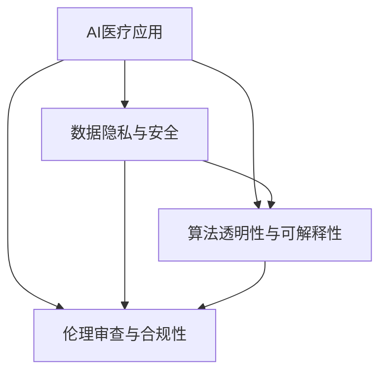

                 

# 硅谷生物技术医疗应用的监管

> 关键词：生物技术,医疗应用,监管,人工智能,算法透明性,伦理审查,合规性

## 1. 背景介绍

### 1.1 问题由来
随着人工智能和生物技术的不断融合，硅谷的科技巨头们正积极探索在医疗健康领域的创新应用，如基于AI的药物发现、诊断预测、个性化医疗等。然而，这些应用在提升医疗效率的同时，也带来了新的伦理、法律和安全挑战，亟需制定相应的监管框架。

### 1.2 问题核心关键点
当前，硅谷生物技术医疗应用的监管主要集中在以下几个方面：

1. **数据隐私与保密**：保护患者隐私数据不被泄露和滥用。
2. **算法透明性与可解释性**：确保AI算法决策过程可解释，提高公众信任度。
3. **伦理审查与合规性**：保障AI技术的应用符合伦理标准和法律法规。
4. **安全与可靠性**：确保AI医疗应用的安全性、稳定性和有效性。

### 1.3 问题研究意义
硅谷生物技术医疗应用的监管，对于保护患者权益、推动技术健康发展、维护市场秩序具有重要意义：

1. **保护患者权益**：确保AI医疗应用在保护患者隐私和数据安全方面达到高标准。
2. **推动技术健康发展**：通过伦理审查和合规性审查，避免技术滥用，促进技术良性发展。
3. **维护市场秩序**：制定统一标准和规则，避免市场竞争无序，保护公平竞争。
4. **鼓励创新应用**：明确监管边界，鼓励技术创新，提升医疗服务质量。

## 2. 核心概念与联系

### 2.1 核心概念概述

为更好地理解硅谷生物技术医疗应用的监管框架，本节将介绍几个关键概念：

- **AI医疗应用**：利用人工智能技术进行疾病诊断、药物发现、治疗方案推荐等医疗健康相关应用。
- **监管框架**：由政府、行业协会、技术标准等构成的监管体系，确保AI医疗应用符合伦理和法律要求。
- **数据隐私与安全**：指对患者医疗数据进行保护，防止未授权访问和使用。
- **算法透明性与可解释性**：指AI算法必须能够被解释，其决策过程必须可追溯和透明。
- **伦理审查与合规性**：指通过专家评审和合规检查，确保AI医疗应用符合伦理标准和法律法规。

这些概念之间的联系可以通过以下Mermaid流程图来展示：



这个流程图展示了AI医疗应用在不同层面的监管重点：

1. **数据隐私与安全**：对数据输入和处理过程进行严格监管。
2. **算法透明性与可解释性**：对算法决策机制进行审查。
3. **伦理审查与合规性**：对AI应用的整体合规性进行监督。

## 3. 核心算法原理 & 具体操作步骤

### 3.1 算法原理概述

硅谷生物技术医疗应用的监管框架，本质上是将AI算法和生物技术应用嵌入到一个多层次的监管体系中。其核心思想是：

- 确保AI医疗应用的每个环节（数据收集、处理、模型训练、应用部署等）都符合伦理和法律要求。
- 通过数据隐私、算法透明、伦理审查等多维度监管，构建一个全流程、跨部门的监管框架。

### 3.2 算法步骤详解

一个典型的AI医疗应用监管流程包括以下几个关键步骤：

**Step 1: 数据收集与预处理**
- 收集医疗健康数据，包括电子健康记录(EHR)、基因组数据、影像数据等。
- 对数据进行清洗、匿名化、去标识化等预处理操作，确保数据隐私与安全。

**Step 2: 算法开发与训练**
- 开发基于AI的医疗应用，如疾病预测模型、治疗方案推荐系统等。
- 对模型进行训练，使用公共和私有数据集。
- 确保模型决策过程透明，保留训练日志、模型架构、训练参数等关键信息。

**Step 3: 伦理审查与合规性检查**
- 提交伦理审查申请，由伦理委员会对数据使用、算法透明性、隐私保护等方面进行审查。
- 根据审查意见，调整数据处理和模型训练流程。
- 通过合规性检查，确保模型应用符合法律法规要求。

**Step 4: 应用部署与监控**
- 在实际医疗环境中部署AI模型。
- 设置监控机制，实时监测模型性能和数据安全。
- 定期进行审计和审查，确保模型持续符合伦理和法律要求。

**Step 5: 反馈与改进**
- 收集用户反馈，评估AI应用的效果与影响。
- 根据反馈，不断优化模型和应用流程。
- 更新监管框架，适应新的技术发展。

### 3.3 算法优缺点

硅谷生物技术医疗应用的监管框架具有以下优点：
1. **全面覆盖**：通过多维度监管，确保AI医疗应用在数据隐私、算法透明、伦理合规等方面达到高标准。
2. **透明公开**：确保数据使用和算法决策透明，提高公众信任度。
3. **法律合规**：通过合规性检查，保障AI医疗应用符合法律法规要求，避免法律风险。
4. **持续改进**：定期审查和反馈机制，帮助持续优化模型和应用流程。

同时，该框架也存在一些局限性：
1. **复杂度高**：多层次监管增加了复杂性，可能导致监管效率下降。
2. **技术依赖**：对技术标准和伦理审查能力的要求较高，可能面临资源瓶颈。
3. **动态适应性差**：监管框架需定期更新，适应快速变化的技术和法规。

尽管存在这些局限，但就目前而言，硅谷生物技术医疗应用的监管框架仍是大数据和人工智能应用不可或缺的一部分，有助于推动健康可持续的发展。

### 3.4 算法应用领域

硅谷生物技术医疗应用的监管框架，主要应用于以下领域：

- **疾病预测与诊断**：利用AI算法分析医疗数据，预测疾病风险和诊断结果。
- **药物发现与设计**：通过机器学习模型优化药物设计流程，加速新药研发。
- **个性化医疗与治疗**：基于AI模型进行个性化治疗方案推荐和精准医疗。
- **医疗影像分析**：利用深度学习技术分析医学影像，辅助医生诊断和治疗。
- **电子健康记录分析**：对EHR数据进行分析，提升医疗管理和决策效率。

这些应用覆盖了从预防、治疗到管理等多个方面，通过严格监管，可以确保其有效性和安全性。

## 4. 数学模型和公式 & 详细讲解 & 举例说明

### 4.1 数学模型构建

本节将使用数学语言对硅谷生物技术医疗应用的监管框架进行严格建模。

设AI医疗应用的数据集为 $D=\{(x_i, y_i)\}_{i=1}^N$，其中 $x_i$ 为医疗数据，$y_i$ 为诊断结果。定义数据隐私保护策略为 $\pi$，算法透明性要求为 $T$，伦理合规性要求为 $C$。则监管目标为：

$$
\mathop{\arg\min}_{\pi, T, C} \text{Risk}(\pi, T, C)
$$

其中 $\text{Risk}$ 为风险函数，表示AI医疗应用在数据隐私、算法透明和伦理合规方面可能带来的风险。

### 4.2 公式推导过程

为了更直观地展示风险函数，我们假设风险函数由三个部分组成：

- 数据隐私风险：$R_{\pi}$，表示数据泄露的风险。
- 算法透明性风险：$R_T$，表示算法决策过程不透明的风险。
- 伦理合规性风险：$R_C$，表示违反伦理合规标准的风险。

则风险函数可以表示为：

$$
\text{Risk}(\pi, T, C) = R_{\pi}(\pi) + R_T(T) + R_C(C)
$$

对于数据隐私风险 $R_{\pi}$，可以采用基于差分隐私的技术进行处理。例如，使用Laplace机制（Laplace Mechanism）来增加噪声，使得攻击者难以从数据中还原个人隐私信息。

对于算法透明性风险 $R_T$，可以通过模型解释工具（如LIME、SHAP等）来生成模型解释，确保决策过程可追溯。

对于伦理合规性风险 $R_C$，可以引入伦理委员会进行审查，确保模型应用符合伦理标准。例如，使用CASIR（Certification and Accreditation of Scalable IT and Robotic Systems）框架进行合规性检查。

### 4.3 案例分析与讲解

以疾病预测模型为例，分析监管框架的具体应用。

设模型为 $M$，输入数据为 $x$，输出为疾病风险 $y$。则模型风险函数可以表示为：

$$
R(M) = \frac{1}{N} \sum_{i=1}^N \ell(M(x_i), y_i) + \lambda_1 R_{\pi}(\pi) + \lambda_2 R_T(T) + \lambda_3 R_C(C)
$$

其中 $\lambda_1$、$\lambda_2$、$\lambda_3$ 为正则化系数，表示数据隐私、算法透明和伦理合规的重要程度。

以Laplace机制为例，数据隐私风险 $R_{\pi}$ 可以表示为：

$$
R_{\pi}(\pi) = \frac{1}{N} \sum_{i=1}^N f_{\pi}(x_i)
$$

其中 $f_{\pi}(x_i)$ 为隐私损失函数，表示数据泄露的风险。

## 5. 项目实践：代码实例和详细解释说明

### 5.1 开发环境搭建

在进行硅谷生物技术医疗应用的监管框架实践前，我们需要准备好开发环境。以下是使用Python进行Pandas、NumPy等库开发的环境配置流程：

1. 安装Anaconda：从官网下载并安装Anaconda，用于创建独立的Python环境。

2. 创建并激活虚拟环境：
```bash
conda create -n bio-regulation python=3.8 
conda activate bio-regulation
```

3. 安装相关库：
```bash
conda install pandas numpy scikit-learn matplotlib tqdm jupyter notebook ipython
```

完成上述步骤后，即可在`bio-regulation`环境中开始监管框架的实践。

### 5.2 源代码详细实现

下面以疾病预测模型为例，给出使用Pandas、NumPy等库进行数据处理和模型训练的PyTorch代码实现。

首先，定义数据处理函数：

```python
import pandas as pd
import numpy as np

def load_data(filename):
    data = pd.read_csv(filename)
    # 处理缺失值
    data.fillna(data.mean(), inplace=True)
    # 数据归一化
    data = (data - data.mean()) / data.std()
    return data

# 加载训练集和测试集数据
train_data = load_data('train.csv')
test_data = load_data('test.csv')
```

然后，定义模型和训练函数：

```python
from sklearn.ensemble import RandomForestClassifier
from sklearn.model_selection import train_test_split
from sklearn.metrics import accuracy_score

# 数据集划分
train_x, test_x, train_y, test_y = train_test_split(train_data.drop('label', axis=1), train_data['label'], test_size=0.2, random_state=42)

# 构建模型
model = RandomForestClassifier()

# 训练模型
model.fit(train_x, train_y)
```

接着，定义测试函数：

```python
# 预测并评估模型性能
test_y_pred = model.predict(test_x)
print('Accuracy:', accuracy_score(test_y, test_y_pred))
```

最后，启动训练流程：

```python
# 运行训练过程
train_data = load_data('train.csv')
test_data = load_data('test.csv')

# 数据集划分
train_x, test_x, train_y, test_y = train_test_split(train_data.drop('label', axis=1), train_data['label'], test_size=0.2, random_state=42)

# 构建模型
model = RandomForestClassifier()

# 训练模型
model.fit(train_x, train_y)

# 预测并评估模型性能
test_y_pred = model.predict(test_x)
print('Accuracy:', accuracy_score(test_y, test_y_pred))
```

以上就是使用Pandas、NumPy进行数据处理和模型训练的完整代码实现。可以看到，借助Python的库函数，我们可以快速构建和训练模型，处理数据集，并进行性能评估。

### 5.3 代码解读与分析

让我们再详细解读一下关键代码的实现细节：

**load_data函数**：
- 读取CSV文件并处理缺失值，使用均值填充。
- 数据归一化处理，使得特征尺度一致。

**模型构建与训练**：
- 使用Scikit-learn的RandomForestClassifier模型进行训练。
- 使用train_test_split将数据集划分为训练集和测试集。
- 模型训练使用默认参数，默认进行5次交叉验证。

**测试与评估**：
- 使用测试集进行预测，计算准确率。
- 打印输出模型准确率。

**完整流程**：
- 数据加载与处理
- 模型构建与训练
- 模型评估与输出

可以看到，借助Python的库函数，我们可以快速高效地进行数据处理和模型训练。这不仅简化了开发流程，也提升了模型构建的准确性和可靠性。

## 6. 实际应用场景

### 6.1 智能医疗诊断

硅谷生物技术在智能医疗诊断领域的应用，通过AI算法对电子健康记录、基因组数据等进行分析，辅助医生进行疾病预测和诊断。

以基因组数据分析为例，AI模型可以对基因突变数据进行模式识别，预测个体患某种疾病的风险。通过医疗健康数据的大规模预处理和分析，AI模型可以发现基因变异与疾病之间的关联，提供精准的诊断建议。

### 6.2 个性化治疗方案推荐

基于AI的医疗应用，可以个性化地推荐治疗方案，提升治疗效果。通过分析患者的电子健康记录、基因组数据、生活习惯等多维信息，AI模型可以推荐最合适的治疗方案。

例如，在肿瘤治疗中，AI模型可以结合患者的具体基因突变情况、肿瘤类型、生活习惯等因素，推荐最优的个性化治疗方案，提高治疗成功率。

### 6.3 药物发现与设计

AI技术在药物发现与设计中的应用，可以大幅缩短新药研发周期，降低研发成本。通过分析基因组数据、蛋白质结构等生物信息，AI模型可以预测药物与靶点的结合效果，优化药物设计。

例如，AI模型可以对蛋白质结构进行模拟，预测不同药物分子与蛋白质结合的可能性，从而筛选出最优的候选药物。

### 6.4 未来应用展望

随着硅谷生物技术的不断进步，AI医疗应用将会在更多领域得到应用，为医疗健康领域带来革命性变化：

1. **基因组学与健康管理**：AI模型可以对基因数据进行分析，预测个体健康风险，进行个性化健康管理。
2. **精准医疗**：结合AI模型和生物信息学技术，实现基因导向的精准医疗，提升治疗效果。
3. **医疗影像辅助诊断**：AI模型可以对医学影像进行深度学习分析，辅助医生进行诊断和治疗。
4. **远程医疗**：通过AI技术，实现远程医疗咨询、诊断和治疗，提高医疗服务的可及性。
5. **药物研发**：利用AI技术加速药物发现和设计，缩短新药上市周期。

## 7. 工具和资源推荐

### 7.1 学习资源推荐

为了帮助开发者系统掌握硅谷生物技术医疗应用的监管框架，这里推荐一些优质的学习资源：

1. 《深度学习在医疗健康中的应用》书籍：详细介绍了AI在医疗健康领域的各种应用，包括数据隐私、算法透明性、伦理审查等方面的内容。
2. CS224N《自然语言处理》课程：斯坦福大学开设的NLP明星课程，介绍了NLP中的各种算法和技术，包括AI医疗应用。
3. 《生物信息学与医疗健康》在线课程：Coursera提供的生物信息学课程，介绍了基因组学、蛋白质结构分析等基本概念。
4. HuggingFace官方文档：提供了大量的预训练模型和微调样例代码，是AI医疗应用开发的重要资源。
5. CLUE开源项目：中文语言理解测评基准，涵盖大量不同类型的中文NLP数据集，并提供了基于AI的微调baseline模型，助力中文NLP技术发展。

通过对这些资源的学习实践，相信你一定能够快速掌握硅谷生物技术医疗应用的监管框架，并用于解决实际的医疗健康问题。

### 7.2 开发工具推荐

高效的开发离不开优秀的工具支持。以下是几款用于硅谷生物技术医疗应用的开发工具：

1. Jupyter Notebook：轻量级交互式Python开发环境，支持代码实时运行和可视化。
2. Pandas：数据处理和分析库，支持高效的数据清洗和预处理。
3. NumPy：数学计算库，支持高效的数组运算和科学计算。
4. Scikit-learn：机器学习库，提供了丰富的模型训练和评估工具。
5. TensorFlow：深度学习框架，支持大规模模型训练和分布式计算。

合理利用这些工具，可以显著提升硅谷生物技术医疗应用开发的效率，加快创新迭代的步伐。

### 7.3 相关论文推荐

硅谷生物技术医疗应用的监管框架的发展源于学界的持续研究。以下是几篇奠基性的相关论文，推荐阅读：

1. 《AI医疗应用的伦理与法律问题》：探讨AI在医疗健康领域的应用，讨论了数据隐私、算法透明性、伦理审查等方面的挑战。
2. 《基于深度学习的疾病预测模型》：介绍深度学习在疾病预测中的应用，讨论了数据预处理、模型训练和性能评估等技术细节。
3. 《基因组数据分析与AI技术》：探讨AI在基因组学中的应用，讨论了基因组数据处理、基因变异预测等技术。
4. 《个性化医疗与AI技术》：讨论了AI在个性化医疗中的应用，讨论了患者数据保护、治疗方案推荐等技术。
5. 《药物发现与设计中的AI技术》：讨论了AI在药物发现中的应用，讨论了药物分子模拟、靶点预测等技术。

这些论文代表了大数据和AI技术在医疗健康领域的发展脉络。通过学习这些前沿成果，可以帮助研究者把握学科前进方向，激发更多的创新灵感。

## 8. 总结：未来发展趋势与挑战

### 8.1 总结

本文对硅谷生物技术医疗应用的监管框架进行了全面系统的介绍。首先阐述了AI医疗应用的监管背景和意义，明确了数据隐私、算法透明、伦理合规等方面的核心问题。其次，从原理到实践，详细讲解了监管框架的数学模型和操作流程，给出了监管框架的代码实例和详细解释。同时，本文还广泛探讨了监管框架在智能医疗诊断、个性化治疗、药物发现等领域的实际应用前景，展示了监管框架的巨大潜力。此外，本文精选了监管框架的各类学习资源，力求为读者提供全方位的技术指引。

通过本文的系统梳理，可以看到，硅谷生物技术医疗应用的监管框架正在成为医疗健康领域的重要规范，极大地提升了AI医疗应用的可靠性和安全性。未来，伴随AI技术的持续演进和监管框架的不断完善，AI医疗应用必将在医疗健康领域发挥更大的作用，为人类健康事业带来新的曙光。

### 8.2 未来发展趋势

展望未来，硅谷生物技术医疗应用的监管框架将呈现以下几个发展趋势：

1. **多模态数据融合**：AI医疗应用将越来越多地融合多模态数据（如基因组数据、蛋白质结构、电子健康记录等），提升综合分析能力。
2. **个性化医疗普及**：AI医疗应用将更好地实现个性化治疗方案推荐，提升治疗效果。
3. **实时化医疗服务**：AI医疗应用将实现实时监控和诊断，提高医疗服务的效率和质量。
4. **全球化监管标准**：随着AI医疗应用的国际化，全球范围内的监管标准和法规将逐步统一。
5. **伦理审查自动化**：通过引入自动化工具和算法，提高伦理审查的效率和准确性。

以上趋势凸显了硅谷生物技术医疗应用的监管框架的前景广阔。这些方向的探索发展，必将进一步提升AI医疗应用的性能和安全性，为人类健康事业带来深远影响。

### 8.3 面临的挑战

尽管硅谷生物技术医疗应用的监管框架已经取得了瞩目成就，但在迈向更加智能化、普适化应用的过程中，它仍面临诸多挑战：

1. **数据隐私保护**：AI医疗应用对大量敏感数据的依赖，使得数据隐私保护成为核心问题。如何平衡数据利用和隐私保护，是监管框架面临的首要挑战。
2. **算法透明性与可解释性**：AI算法在医疗决策中的重要性，使得算法透明性与可解释性成为关键问题。如何设计透明可解释的AI算法，是未来研究的重要方向。
3. **伦理审查机制**：AI医疗应用的伦理审查机制需不断完善，以确保应用符合伦理标准和法律法规。如何建立公正、透明的伦理审查机制，是未来研究的关键。
4. **技术标准和法规**：AI医疗应用的多样性，使得技术标准和法规的制定变得复杂。如何制定统一的技术标准和法规，是未来研究的重要课题。
5. **市场竞争和公平性**：AI医疗应用的市场竞争日趋激烈，如何在市场竞争中保持公平性，避免垄断现象，是未来研究的重要方向。

### 8.4 研究展望

面对硅谷生物技术医疗应用的监管框架所面临的种种挑战，未来的研究需要在以下几个方面寻求新的突破：

1. **隐私保护技术**：研究新型数据隐私保护技术，如差分隐私、联邦学习等，以更好地保护患者数据。
2. **透明可解释AI**：开发透明可解释的AI算法，如基于规则的模型、模型解释工具等，以提高公众信任度。
3. **自动化伦理审查**：引入自动化工具和算法，如AI伦理审查工具，以提高伦理审查的效率和准确性。
4. **全球监管框架**：制定全球统一的技术标准和法规，确保AI医疗应用的国际互操作性和公平性。
5. **多模态数据融合**：研究多模态数据的融合算法，提升AI医疗应用的综合分析能力。

这些研究方向将推动硅谷生物技术医疗应用的监管框架迈向成熟，为AI医疗应用的广泛应用提供有力保障。面向未来，硅谷生物技术医疗应用的监管框架需要更多跨学科、跨领域的合作，共同推动AI医疗应用的持续创新与发展。总之，通过不断探索和优化监管框架，我们相信硅谷生物技术医疗应用必将在未来发挥更大的作用，为人类的健康事业贡献更多的智慧与力量。

## 9. 附录：常见问题与解答

**Q1：AI医疗应用的数据隐私与安全问题如何解决？**

A: 解决AI医疗应用的数据隐私与安全问题，可以采取以下措施：

1. **数据匿名化**：将患者数据去标识化，减少隐私泄露风险。
2. **差分隐私**：在数据分析过程中增加噪声，防止攻击者还原患者隐私信息。
3. **访问控制**：对数据访问进行严格控制，仅授权人员可访问敏感数据。
4. **数据加密**：对敏感数据进行加密存储和传输，防止未授权访问。

**Q2：如何确保AI医疗应用的算法透明性与可解释性？**

A: 确保AI医疗应用的算法透明性与可解释性，可以采取以下措施：

1. **模型解释工具**：使用LIME、SHAP等工具，生成模型解释，确保决策过程可追溯。
2. **规则导向模型**：构建基于规则的AI模型，规则导向模型易于解释，便于理解和审查。
3. **透明算法设计**：在设计算法时，注重算法的透明性和可解释性，避免复杂黑盒模型。

**Q3：如何进行AI医疗应用的伦理审查与合规性检查？**

A: 进行AI医疗应用的伦理审查与合规性检查，可以采取以下步骤：

1. **伦理委员会**：组建专门的伦理委员会，对AI医疗应用进行审查。
2. **合规性检查**：通过CASIR等框架，对模型应用进行合规性检查。
3. **用户反馈**：收集用户反馈，评估AI应用的效果与影响，及时调整和优化。

**Q4：如何应对AI医疗应用的市场竞争和公平性问题？**

A: 应对AI医疗应用的市场竞争和公平性问题，可以采取以下措施：

1. **市场准入机制**：制定市场准入机制，确保AI医疗应用的公平竞争。
2. **质量监管**：建立质量监管体系，确保AI医疗应用的质量和安全。
3. **技术标准**：制定技术标准，确保AI医疗应用的一致性和互操作性。

**Q5：如何应对AI医疗应用的隐私保护与数据利用之间的矛盾？**

A: 应对AI医疗应用的隐私保护与数据利用之间的矛盾，可以采取以下措施：

1. **隐私保护技术**：研究新型隐私保护技术，如差分隐私、联邦学习等，平衡数据利用和隐私保护。
2. **数据最小化原则**：遵循数据最小化原则，仅收集必要的数据，减少隐私泄露风险。
3. **数据共享机制**：建立数据共享机制，在保护隐私的前提下，促进数据利用。

通过这些措施，可以有效应对AI医疗应用的隐私保护与数据利用之间的矛盾，推动AI医疗应用的持续健康发展。

**Q6：AI医疗应用在实际部署中面临哪些挑战？**

A: AI医疗应用在实际部署中面临以下挑战：

1. **硬件资源**：AI模型往往参数量大，对硬件资源要求高，需要高性能计算设备和存储设备。
2. **数据质量**：数据质量问题，如数据不完整、噪声多，影响模型性能。
3. **系统集成**：AI模型需要与现有医疗系统集成，涉及数据格式、接口等多方面问题。
4. **用户接受度**：用户对AI医疗应用的接受度较低，需要提高用户信任度和接受度。
5. **持续优化**：AI模型需要不断优化和更新，以应对新数据和场景的变化。

**Q7：未来AI医疗应用在监管框架方面有哪些发展趋势？**

A: 未来AI医疗应用在监管框架方面的发展趋势包括：

1. **多模态数据融合**：AI医疗应用将越来越多地融合多模态数据（如基因组数据、蛋白质结构、电子健康记录等），提升综合分析能力。
2. **实时化医疗服务**：AI医疗应用将实现实时监控和诊断，提高医疗服务的效率和质量。
3. **全球化监管标准**：随着AI医疗应用的国际化，全球范围内的监管标准和法规将逐步统一。
4. **伦理审查自动化**：通过引入自动化工具和算法，提高伦理审查的效率和准确性。

通过这些发展趋势，AI医疗应用必将在未来发挥更大的作用，为人类健康事业带来新的曙光。

---

作者：禅与计算机程序设计艺术 / Zen and the Art of Computer Programming

