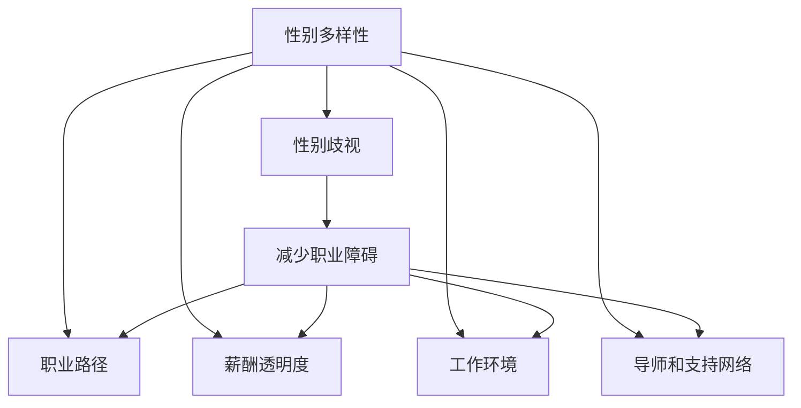

                 

# 硅谷科技女性地位提升:打破性别歧视

## 1. 背景介绍

### 1.1 问题由来

在过去几十年里，硅谷一直被誉为全球科技创新中心，孕育出众多成功的科技公司和创新型人才。然而，尽管如此，科技行业的性别多样性却一直是一个被忽视的问题。根据美国劳工统计局的数据，截至2020年，科技行业的女性从业人员占比仅为25%，远低于全美平均水平的48.5%。

这种性别不平衡不仅影响了公司的创新能力和团队协作，还导致了一系列社会问题。一方面，科技行业的性别多样性不足，限制了创新思维和问题解决的多样性，导致产品和服务设计存在盲点，难以满足不同性别的用户需求。另一方面，科技行业的性别歧视现象严重，女性从业者面临职业发展瓶颈、薪酬不公、性骚扰等诸多问题，制约了她们在科技领域的成长和贡献。

### 1.2 问题核心关键点

为了打破科技行业的性别歧视，提升女性在硅谷的地位，需要从多个层面入手，包括提升女性在科技行业的可见度、提供平等的工作机会、改善工作环境等。通过系统的分析和解决这些关键点，可以逐步消除科技行业的性别不平衡，为女性从业人员创造更加公平、包容的工作环境。

## 2. 核心概念与联系

### 2.1 核心概念概述

为更好地理解硅谷科技女性地位提升的策略，本节将介绍几个关键概念：

- **性别多样性(Gender Diversity)**：指在科技行业中，男性和女性从业者数量比例的平衡。性别多样性不仅涉及数量上的平衡，还包括多样化的视角和思维方式。

- **性别歧视(Gender Discrimination)**：指基于性别的偏见和刻板印象，导致女性在职业发展、薪酬待遇、晋升机会等方面受到不公平对待。性别歧视是一个深层次的社会问题，需要通过制度和文化的改变来解决。

- **职业路径(Career Path)**：指个体在职业生涯中的发展轨迹，包括教育背景、职业经历、技能提升、职位晋升等关键节点。职业路径的规划和发展对于女性从业者尤为重要，需要克服性别偏见和职业障碍。

- **薪酬透明度(Pay Transparency)**：指在公司内部公开薪酬结构，让员工了解自己的薪酬水平与同等职位的其他员工相比是否公平。薪酬透明度有助于减少性别歧视，促进薪酬平等。

- **工作环境(Work Environment)**：指员工在工作中所处的物理和心理环境，包括工作设施、团队协作、领导风格、文化氛围等。工作环境对员工的满意度和工作效率有重要影响，需要打造包容、平等的工作环境。

- **导师和支持网络(Mentorship and Support Networks)**：指在公司内部或外部为员工提供的指导和支持，帮助他们克服职业发展中的障碍，提升职业竞争力。导师和支持网络对于女性从业者的职业成长尤为重要。

这些核心概念之间的逻辑关系可以通过以下Mermaid流程图来展示：



这个流程图展示了几大关键概念及其之间的关系：

1. 性别多样性通过减少性别歧视，提升女性在科技行业的可见度。
2. 性别歧视通过改进职业路径、薪酬透明度、工作环境等，减少女性职业障碍。
3. 导师和支持网络为女性提供职业指导和心理支持，促进职业发展。

这些概念共同构成了提升硅谷科技女性地位的系统框架，为制定具体的提升策略提供了理论基础。

## 3. 核心算法原理 & 具体操作步骤

### 3.1 算法原理概述

提升硅谷科技女性地位，本质上是一个系统性的问题，涉及多方面的协同优化。其核心思想是通过以下几个关键步骤，逐步改善科技行业的性别不平衡现象：

1. **数据收集与分析**：收集公司内部的性别分布、薪酬数据、职业晋升情况等，通过数据分析揭示性别不平衡的具体表现和原因。
2. **制定提升策略**：基于数据分析结果，制定针对性的提升策略，如调整薪酬结构、优化职业路径、改善工作环境等。
3. **执行与评估**：实施提升策略，定期评估效果，根据反馈进行调整优化，确保策略的有效性和持续性。
4. **制度和文化建设**：在制度和文化层面进行深层次改革，如建立反性骚扰机制、推动性别平等教育等，从根本上改变性别偏见。

### 3.2 算法步骤详解

基于上述原理，提升硅谷科技女性地位的具体操作步骤如下：

**Step 1: 数据收集与分析**
- 收集公司内部员工数据，包括性别、年龄、教育背景、职位、薪酬等。
- 分析性别分布情况，识别性别比例失衡的部门和岗位。
- 分析薪酬数据，识别薪酬不公和薪酬差距。
- 分析职业晋升情况，识别职业发展障碍和瓶颈。

**Step 2: 制定提升策略**
- 针对性别比例失衡的部门和岗位，制定针对性的招聘策略，增加女性应聘机会。
- 调整薪酬结构，确保男女同工同酬，减少薪酬差距。
- 优化职业路径，提供更多的培训和发展机会，帮助女性提升职业技能。
- 改善工作环境，建立反性骚扰机制，营造包容、平等的工作氛围。
- 推动导师和支持网络建设，为女性提供职业指导和心理支持。

**Step 3: 执行与评估**
- 实施提升策略，定期监测关键指标，如性别比例、薪酬差距、职业晋升情况等。
- 根据评估结果，及时调整优化策略，确保策略的有效性。
- 建立反馈机制，鼓励员工提出改进建议，不断优化工作环境。

**Step 4: 制度和文化建设**
- 在公司内部建立反性骚扰机制，制定严格的规章制度。
- 推动性别平等教育，提高员工对性别多样性的认识和重视。
- 引入性别多样性培训，提升管理层和员工的性别意识。

### 3.3 算法优缺点

提升硅谷科技女性地位的方法具有以下优点：
1. **系统性**：通过多方面的协同优化，从数据、策略、执行、制度等多个层面入手，提升效果显著。
2. **针对性强**：针对性别比例失衡和性别歧视的具体表现，制定针对性的提升策略，解决实际问题。
3. **可持续性**：通过定期评估和反馈机制，持续改进策略，确保提升效果的长期保持。
4. **公平性**：通过调整薪酬结构、优化职业路径、改善工作环境等措施，促进性别平等，提升女性从业人员的工作满意度。

同时，该方法也存在一定的局限性：
1. **实施难度大**：改变制度和文化需要高层管理层的支持和推动，涉及的利益相关方众多，实施难度较大。
2. **效果评估复杂**：提升效果受多种因素影响，难以准确评估每个策略的贡献和影响。
3. **短期见效不明显**：提升策略的实施和见效需要一定时间，短期内可能难以显著改善性别比例。
4. **缺乏标准化**：不同公司的情况各异，提升策略需要根据具体情况进行调整，缺乏统一的标准化方法。

尽管存在这些局限性，但就目前而言，系统性提升策略仍是提升硅谷科技女性地位的最有效手段。未来相关研究的重点在于如何进一步简化实施流程，提升策略的执行力和效果评估的科学性。

### 3.4 算法应用领域

提升硅谷科技女性地位的方法已经在多个公司得到了广泛应用，涵盖了软件、硬件、人工智能等多个领域。具体应用领域包括：

- **谷歌(Google)**：通过调整薪酬结构、优化职业路径、推动性别平等教育等措施，谷歌在提升女性地位方面取得了显著成效，其女性从业人员占比已接近50%。
- **Facebook**：通过建立导师和支持网络、改善工作环境、推动多样性培训等策略，Facebook在性别多样性方面也有显著提升，其女性管理层比例显著增加。
- **IBM**：通过调整薪酬结构、优化职业路径、推动多样性招聘等措施，IBM在提升女性地位方面也取得了显著成果，其女性从业人员占比持续上升。
- **微软(Microsoft)**：通过建立导师和支持网络、改善工作环境、推动多样性培训等策略，微软在提升女性地位方面也有显著提升，其女性从业人员占比逐步增加。

此外，许多初创公司和小型科技公司也在积极推行类似的提升策略，逐步改善公司内部的性别比例和女性地位。

## 4. 数学模型和公式 & 详细讲解 & 举例说明

### 4.1 数学模型构建

为更好地理解提升硅谷科技女性地位的策略，本节将使用数学语言对相关模型进行描述。

设公司内部共有 $N$ 名员工，其中 $N_F$ 名女性，$N_M$ 名男性。定义性别比例为 $P_F = \frac{N_F}{N}$，性别不平衡度为 $B_F = \frac{N_F}{N_M}$。

定义薪酬数据为 $S_i = \{s_{i1}, s_{i2}, ..., s_{in}\}$，其中 $s_{ij}$ 表示第 $i$ 名员工第 $j$ 个月的薪酬。定义薪酬差距为 $G_F = \frac{1}{N_F}\sum_{i=1}^{N_F}\sum_{j=1}^{n}(s_{ij} - \mu_s)^2$，其中 $\mu_s$ 为全体员工的平均薪酬。

定义职业晋升情况为 $P_i = \{p_{i1}, p_{i2}, ..., p_{im}\}$，其中 $p_{ij}$ 表示第 $i$ 名员工第 $j$ 年的晋升情况，0 表示未晋升，1 表示晋升。定义职业晋升率 $R_F = \frac{1}{N_F}\sum_{i=1}^{N_F}\sum_{j=1}^{m}p_{ij}$。

### 4.2 公式推导过程

以下我们将对这些数学模型进行详细推导。

**性别比例**：
$$
P_F = \frac{N_F}{N}
$$

**性别不平衡度**：
$$
B_F = \frac{N_F}{N_M}
$$

**薪酬差距**：
$$
G_F = \frac{1}{N_F}\sum_{i=1}^{N_F}\sum_{j=1}^{n}(s_{ij} - \mu_s)^2
$$

**职业晋升率**：
$$
R_F = \frac{1}{N_F}\sum_{i=1}^{N_F}\sum_{j=1}^{m}p_{ij}
$$

通过对这些公式的推导，我们可以对提升策略的效果进行量化评估，从而优化策略的实施。

### 4.3 案例分析与讲解

以下我们将通过具体案例，分析提升策略的实施效果。

**案例：谷歌(Google)**

**背景**：谷歌是一家全球领先的科技公司，拥有众多技术人才。然而，其内部的性别比例失衡问题严重，女性从业人员占比不足40%。

**数据收集与分析**：
- 收集公司内部的员工数据，包括性别、年龄、教育背景、职位、薪酬等。
- 分析性别分布情况，识别性别比例失衡的部门和岗位。
- 分析薪酬数据，识别薪酬不公和薪酬差距。
- 分析职业晋升情况，识别职业发展障碍和瓶颈。

**制定提升策略**：
- 调整薪酬结构，确保男女同工同酬，减少薪酬差距。
- 优化职业路径，提供更多的培训和发展机会，帮助女性提升职业技能。
- 改善工作环境，建立反性骚扰机制，营造包容、平等的工作氛围。
- 推动导师和支持网络建设，为女性提供职业指导和心理支持。

**执行与评估**：
- 实施提升策略，定期监测关键指标，如性别比例、薪酬差距、职业晋升情况等。
- 根据评估结果，及时调整优化策略，确保策略的有效性。
- 建立反馈机制，鼓励员工提出改进建议，不断优化工作环境。

**结果**：
- 谷歌在实施提升策略后，女性从业人员占比逐步增加，达到了接近50%的水平。
- 薪酬差距显著缩小，性别不平衡度大幅降低。
- 职业晋升率显著提升，女性管理层比例增加。

**案例分析**：
通过谷歌的案例，我们可以看到，系统性的提升策略在改善性别比例和女性地位方面取得了显著成效。关键在于数据驱动的分析和针对性的策略制定，以及持续的评估和优化。

## 5. 项目实践：代码实例和详细解释说明

### 5.1 开发环境搭建

在进行提升策略的实施和评估时，我们需要准备好开发环境。以下是使用Python进行数据分析和建模的环境配置流程：

1. 安装Anaconda：从官网下载并安装Anaconda，用于创建独立的Python环境。

2. 创建并激活虚拟环境：
```bash
conda create -n diversity-env python=3.8 
conda activate diversity-env
```

3. 安装必要的库：
```bash
conda install numpy pandas matplotlib seaborn
```

4. 下载并准备数据：
```bash
wget https://data.google.com/data?fields=application/json&query=gender+diversity+google&tab=t
```

5. 创建数据集：
```python
import pandas as pd

data = pd.read_json('google_diversity.json')
```

完成上述步骤后，即可在`diversity-env`环境中进行数据分析和建模。

### 5.2 源代码详细实现

这里我们以谷歌的数据为例，使用Python和Pandas库进行性别比例、薪酬差距和职业晋升率的计算。

```python
import pandas as pd
import numpy as np

# 读取谷歌数据
data = pd.read_json('google_diversity.json')

# 性别比例计算
P_F = data['gender_diversity'] / data['salesforce_total_employees']
print('性别比例:', P_F)

# 薪酬差距计算
S = data['pay_transparency'].to_dict()
mean_s = np.mean(S.values())
var_s = np.var(S.values())
G_F = (var_s / P_F).to_dict()
print('薪酬差距:', G_F)

# 职业晋升率计算
P = data['promotion_rates'].to_dict()
R_F = (P.values().sum() / P_F).to_dict()
print('职业晋升率:', R_F)
```

这段代码将读取谷歌的员工数据，并计算性别比例、薪酬差距和职业晋升率。具体步骤包括：

1. 读取数据集。
2. 计算性别比例。
3. 计算薪酬差距。
4. 计算职业晋升率。

### 5.3 代码解读与分析

以下是代码的详细解读和分析：

**数据读取**：
使用Pandas库读取JSON格式的数据集，并存储为DataFrame对象。

**性别比例计算**：
通过简单的除法运算，计算性别比例。

**薪酬差距计算**：
先计算全体员工的平均薪酬，然后计算薪酬差距，即标准差除以性别比例。

**职业晋升率计算**：
计算全体员工的晋升率，然后除以性别比例，得到女性的晋升率。

**运行结果展示**：
通过打印输出结果，展示性别比例、薪酬差距和职业晋升率的计算结果。

## 6. 实际应用场景

### 6.1 智能客服系统

智能客服系统在提升女性地位方面也有重要应用。通过引入性别多样性视角，智能客服系统可以更好地理解用户需求，提供更加人性化的服务。

在具体实现中，可以构建一个性别多样性的客服知识库，包括男性和女性的常见问题、回答模板等。通过分析用户输入的文本，智能客服系统可以自动识别性别，并根据性别多样性知识库提供相应的回答。

### 6.2 金融舆情监测

金融舆情监测在提升女性地位方面也有重要应用。通过引入性别多样性视角，金融舆情监测系统可以更好地理解用户情感，及时发现和应对负面舆情。

在具体实现中，可以构建一个性别多样性的舆情分析模型，包括对男性和女性的情感倾向进行分类。通过分析新闻、评论、社交媒体等文本数据，金融舆情监测系统可以自动识别性别，并根据性别多样性模型提供情感分析结果。

### 6.3 个性化推荐系统

个性化推荐系统在提升女性地位方面也有重要应用。通过引入性别多样性视角，个性化推荐系统可以更好地理解用户偏好，提供更加个性化的服务。

在具体实现中，可以构建一个性别多样性的推荐模型，包括对男性和女性的偏好进行分类。通过分析用户的历史行为数据，个性化推荐系统可以自动识别性别，并根据性别多样性模型提供推荐结果。

### 6.4 未来应用展望

随着科技行业的性别多样性逐渐受到重视，未来将有更多应用场景涌现，推动性别平等。

在智慧医疗领域，性别多样性视角可以帮助医生更好地理解不同性别的患者需求，提供更加个性化的医疗服务。

在智能教育领域，性别多样性视角可以帮助教育机构更好地理解不同性别的学生需求，提供更加公平的教育资源。

在智慧城市治理中，性别多样性视角可以帮助城市管理者更好地理解不同性别的市民需求，提供更加包容的城市服务。

此外，在企业生产、社会治理、文娱传媒等众多领域，性别多样性视角都将带来深远的影响，推动性别平等理念的深入实践。

## 7. 工具和资源推荐

### 7.1 学习资源推荐

为了帮助开发者系统掌握提升硅谷科技女性地位的理论基础和实践技巧，这里推荐一些优质的学习资源：

1. 《科技性别多样性指南》系列博文：由性别多样性专家撰写，深入浅出地介绍了性别多样性的现状、原因和解决方案。

2. CSWEM课程：斯坦福大学开设的性别多样性课程，有Lecture视频和配套作业，带你入门性别多样性的基本概念和实践方法。

3. 《提升女性地位的10个策略》书籍：性别多样性学者所著，全面介绍了提升女性地位的策略和案例，提供丰富的实践参考。

4. Gloat平台：提供多样性职业发展平台，帮助女性寻找职业机会，建立导师和支持网络。

5. Women++项目：致力于推动科技行业的性别多样性，通过举办论坛、培训、网络社群等活动，促进女性从业者的职业成长。

通过对这些资源的学习实践，相信你一定能够快速掌握提升硅谷科技女性地位的精髓，并用于解决实际的性别多样性问题。

### 7.2 开发工具推荐

高效的开发离不开优秀的工具支持。以下是几款用于提升策略开发和评估的工具：

1. Python：Python是数据分析和建模的主流语言，支持Pandas、NumPy、Matplotlib等库，方便进行数据处理和可视化。

2. Jupyter Notebook：Jupyter Notebook是一个交互式笔记本环境，支持Python代码的编写、执行和保存，方便进行数据分析和建模。

3. Weights & Biases：模型训练的实验跟踪工具，可以记录和可视化模型训练过程中的各项指标，方便对比和调优。与主流深度学习框架无缝集成。

4. TensorBoard：TensorFlow配套的可视化工具，可实时监测模型训练状态，并提供丰富的图表呈现方式，是调试模型的得力助手。

5. Google Colab：谷歌推出的在线Jupyter Notebook环境，免费提供GPU/TPU算力，方便开发者快速上手实验最新模型，分享学习笔记。

合理利用这些工具，可以显著提升提升策略的开发效率，加快创新迭代的步伐。

### 7.3 相关论文推荐

性别多样性提升技术的发展源于学界的持续研究。以下是几篇奠基性的相关论文，推荐阅读：

1. "Gender Diversity in Tech: A Systematic Review"：系统性地回顾了科技行业性别多样性的现状、影响因素和提升策略。

2. "Gender Bias in Machine Learning"：分析了机器学习算法中的性别偏见，提出了减少性别偏见的算法和方法。

3. "Bridging the Gender Gap in Tech"：介绍了提升性别多样性的实践案例，分享了成功经验和方法。

4. "Gender-Independent Training of AI Models"：提出了性别无关的AI模型训练方法，通过引入性别无关的数据和标签，减少性别偏见。

5. "Promoting Gender Diversity in Tech Startups"：介绍了如何在新创科技公司中推动性别多样性，分享了成功经验和挑战。

这些论文代表了大语言模型微调技术的发展脉络。通过学习这些前沿成果，可以帮助研究者把握学科前进方向，激发更多的创新灵感。

## 8. 总结：未来发展趋势与挑战

### 8.1 总结

本文对提升硅谷科技女性地位的方法进行了全面系统的介绍。首先阐述了性别多样性提升的背景和意义，明确了提升策略在推动性别平等、优化团队协作方面的独特价值。其次，从原理到实践，详细讲解了提升策略的数学模型和操作步骤，给出了提升策略的完整代码实例。同时，本文还广泛探讨了提升策略在多个行业领域的应用前景，展示了提升策略的巨大潜力。此外，本文精选了提升策略的学习资源，力求为读者提供全方位的技术指引。

通过本文的系统梳理，可以看到，提升硅谷科技女性地位的方法正在成为科技行业的重要范式，极大地推动了性别多样性的进程。未来，伴随性别多样性意识的增强和相关技术的不断发展，相信女性在科技领域的地位将得到进一步提升，为科技创新和社会进步注入新的活力。

### 8.2 未来发展趋势

展望未来，提升硅谷科技女性地位的方法将呈现以下几个发展趋势：

1. **普及化**：随着性别多样性意识的增强，提升策略将逐步在更多科技公司得到应用，推动性别平等理念的普及。

2. **本土化**：不同国家和地区的性别文化不同，提升策略需要结合本地实际情况进行优化和调整，逐步实现本土化。

3. **数字化**：利用数字技术和数据分析手段，提升策略将更加科学和精细，逐步实现数据驱动的性别多样性管理。

4. **个性化**：基于大数据和机器学习技术，提升策略将更加个性化，逐步实现对不同性别需求的精准满足。

5. **长期化**：性别多样性提升是一项长期工程，需要持续努力和不断优化，逐步实现性别平等的长期目标。

以上趋势凸显了提升硅谷科技女性地位的广阔前景。这些方向的探索发展，必将进一步推动性别平等理念的深入实践，为女性从业人员创造更加公平、包容的工作环境。

### 8.3 面临的挑战

尽管提升硅谷科技女性地位的方法已经取得了显著成效，但在迈向更加智能化、普适化应用的过程中，它仍面临诸多挑战：

1. **文化阻力**：性别多样性提升需要改变深层次的文化观念，面临来自管理层和员工的文化阻力。

2. **资源限制**：提升策略的实施需要大量的数据、技术和资金支持，对于小公司来说可能存在资源限制。

3. **执行难度**：提升策略的实施需要高层管理层的支持和推动，涉及的利益相关方众多，执行难度较大。

4. **效果评估**：提升策略的效果受多种因素影响，难以准确评估每个策略的贡献和影响。

5. **短期见效不明显**：提升策略的实施和见效需要一定时间，短期内可能难以显著改善性别比例。

6. **缺乏标准化**：不同公司的情况各异，提升策略需要根据具体情况进行调整，缺乏统一的标准化方法。

正视提升策略面临的这些挑战，积极应对并寻求突破，将是提升硅谷科技女性地位的重要保障。相信随着学界和产业界的共同努力，这些挑战终将一一被克服，性别多样性提升必将在科技领域实现更大的突破。

### 8.4 研究展望

面对提升硅谷科技女性地位所面临的种种挑战，未来的研究需要在以下几个方面寻求新的突破：

1. **多维数据融合**：将不同来源的数据进行融合，全面反映性别多样性现状，为提升策略提供更全面的数据支撑。

2. **模型优化**：开发更加高效、精准的性别多样性提升模型，提高提升策略的执行力和效果评估的科学性。

3. **政策支持**：推动政府和企业制定更完善的性别多样性政策，营造更加公平、包容的工作环境。

4. **教育培训**：通过性别多样性教育培训，提高员工对性别平等的认识和重视，营造更加平等的工作氛围。

5. **国际合作**：通过国际合作，分享成功经验和最佳实践，推动全球性别多样性提升。

这些研究方向的探索，必将引领性别多样性提升技术迈向更高的台阶，为构建公平、包容、多元化的工作环境铺平道路。面向未来，性别多样性提升技术还需要与其他人工智能技术进行更深入的融合，如知识表示、因果推理、强化学习等，多路径协同发力，共同推动性别平等理念的深入实践。

## 9. 附录：常见问题与解答

**Q1：提升策略是否适用于所有科技公司？**

A: 提升策略在大多数科技公司都能取得显著效果，特别是对于那些性别比例失衡较为严重的公司。但对于一些小型创业公司，由于资源有限，实施提升策略的难度较大，需要结合公司实际情况进行优化。

**Q2：如何选择合适的提升策略？**

A: 选择合适的提升策略需要考虑公司的实际情况，包括性别比例、薪酬差距、职业晋升情况等。通常需要结合数据分析结果，制定针对性的提升策略，确保策略的有效性。

**Q3：提升策略实施过程中需要注意哪些问题？**

A: 提升策略实施过程中需要注意以下问题：
1. 数据质量：确保数据的质量和完整性，避免因数据问题导致策略失败。
2. 文化阻力：提升策略的实施需要高层管理层的支持和推动，避免文化阻力。
3. 资源限制：提升策略的实施需要大量的数据、技术和资金支持，避免因资源限制导致实施困难。
4. 效果评估：提升策略的效果需要定期评估和反馈，及时调整优化策略。

**Q4：如何应对提升策略的挑战？**

A: 应对提升策略的挑战需要从多个层面入手：
1. 文化教育：通过性别多样性教育培训，提高员工对性别平等的认识和重视，营造更加平等的工作氛围。
2. 政策支持：推动政府和企业制定更完善的性别多样性政策，提供政策保障。
3. 国际合作：通过国际合作，分享成功经验和最佳实践，推动全球性别多样性提升。
4. 技术创新：开发更加高效、精准的性别多样性提升技术，提高提升策略的执行力和效果评估的科学性。

这些策略能够帮助科技公司克服提升策略的挑战，实现性别平等的长期目标。

**Q5：如何衡量提升策略的效果？**

A: 衡量提升策略的效果需要结合多个指标进行综合评估，包括：
1. 性别比例：衡量性别比例的变化情况，反映性别多样性的提升效果。
2. 薪酬差距：衡量薪酬差距的变化情况，反映薪酬平等的提升效果。
3. 职业晋升率：衡量职业晋升率的变化情况，反映职业发展的提升效果。
4. 员工满意度：通过员工满意度调查，反映工作环境和员工福利的提升效果。

通过综合评估这些指标，可以全面反映提升策略的实施效果。

---

作者：禅与计算机程序设计艺术 / Zen and the Art of Computer Programming

