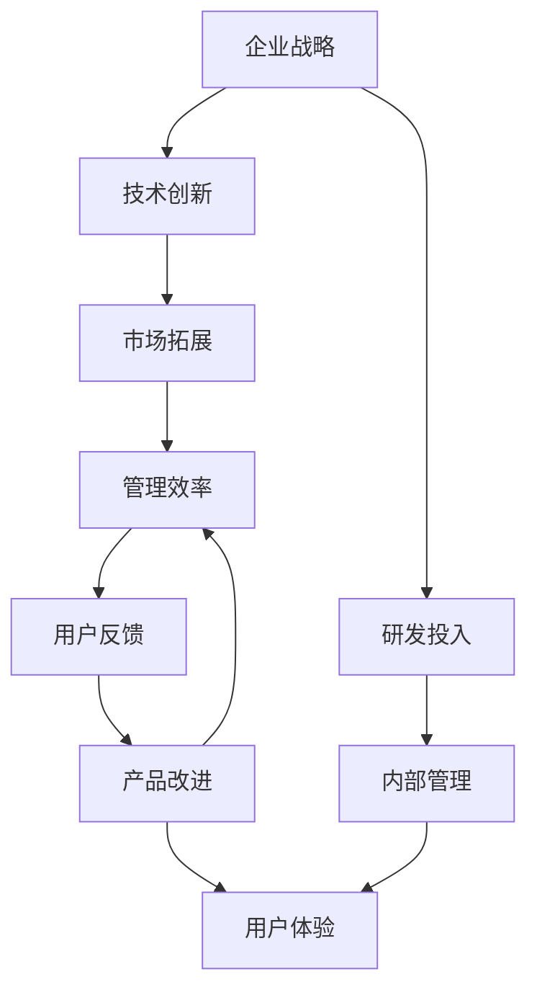

                 

# 硅谷科技巨头的兴衰:从HP到谷歌

## 1. 背景介绍

硅谷作为全球高科技产业的中心，汇聚了众多科技巨头，包括惠普、雅虎、思科、甲骨文、谷歌、苹果、Facebook等。这些公司不仅在各自领域取得了非凡成就，也深刻改变了人类社会的方方面面。然而，随着时间的推移，这些科技巨头的兴衰轨迹也成为了业内观察和研究的重点。本文将从惠普(HP)和谷歌两家公司的兴衰过程，探讨硅谷科技巨头的共性特点和独特命运。

### 1.1 惠普的崛起与困境

惠普(Hewlett-Packard)，成立于1939年，最初是由两位大学生威廉·休利特和戴夫·帕卡德在帕洛阿尔托的车库中创立的。他们的公司最初专注于电子测试仪器和设备，但在1960年代开始转型进入计算机和消费电子产品领域。1982年，惠普推出了世界上第一台个人电脑HP-1，开创了个人电脑市场，奠定了惠普在硅谷的重要地位。

惠普的崛起得益于其在技术创新和市场拓展上的卓越表现。公司通过不断推出具有划时代意义的产品，如HP-1、HP-100、HP TouchPad等，成功地抓住了个人电脑和移动设备市场的机会。然而，到了1990年代，惠普面临内部管理混乱和战略失焦等问题，逐渐失去了其市场领导地位。

### 1.2 谷歌的崛起与霸主地位

谷歌(Google)，由拉里·佩奇和谢尔盖·布林于1998年在斯坦福大学创立。谷歌最初是一款网页搜索引擎，但随着其算法和用户体验的不断优化，迅速成为全球领先的互联网公司之一。2004年，谷歌推出Gmail，进一步巩固了其在互联网领域的霸主地位。

谷歌的崛起得益于其在算法创新和用户体验上的领先地位。公司通过不断改进搜索算法和广告投放机制，成为了搜索引擎市场的领导者。此外，谷歌还涉足操作系统、移动设备、云计算等领域，进一步扩大了其市场份额和影响力。

## 2. 核心概念与联系

### 2.1 核心概念概述

为更好地理解惠普和谷歌的兴衰过程，本节将介绍几个核心概念及其相互联系：

- **企业战略**：指企业为实现其长期目标而制定和实施的计划和策略。企业战略的正确制定和执行，是企业持续发展的关键。
- **技术创新**：指通过研发新技术、新产品或新服务，满足市场需求，提升企业竞争力。技术创新是企业成长的重要驱动力。
- **市场拓展**：指企业通过不断进入新市场、推出新产品，扩大其市场份额和影响力。市场拓展是企业扩张的关键。
- **管理效率**：指企业通过优化内部管理流程和运营模式，提高运营效率和资源利用率。管理效率直接影响企业的市场竞争力和盈利能力。
- **用户反馈**：指用户在使用产品或服务过程中，对产品或服务质量的反馈和意见。用户反馈对企业产品改进和市场策略调整具有重要意义。

这些核心概念通过相互作用和影响，共同决定了惠普和谷歌的兴衰轨迹。技术创新、市场拓展和管理效率的不断优化，是两家公司崛起的共同驱动力。然而，用户反馈和内部管理的有效性，则成为了惠普和谷歌在发展过程中需要不断调整的重要因素。

### 2.2 核心概念原理和架构的 Mermaid 流程图



这个流程图展示了企业战略与技术创新、市场拓展、管理效率、用户反馈等核心概念之间的关系。通过合理制定和执行企业战略，企业能够充分利用技术创新和市场拓展的成果，同时通过优化管理效率和用户反馈，进一步提升企业的市场竞争力和盈利能力。

## 3. 核心算法原理 & 具体操作步骤

### 3.1 算法原理概述

惠普和谷歌的兴衰过程，可以被视为一种典型的技术驱动型企业的生命周期模型。在这个模型中，企业的兴衰主要受到以下三个关键因素的影响：

- **技术创新速度**：企业能否持续推出具有市场竞争力的新产品或服务，直接决定了其市场地位和盈利能力。
- **市场拓展速度**：企业能否快速进入新市场，推广现有产品或服务，直接决定了其市场份额和影响力。
- **内部管理效率**：企业能否通过优化内部管理流程和运营模式，提高运营效率和资源利用率，直接决定了其市场竞争力和盈利能力。

### 3.2 算法步骤详解

惠普和谷歌的兴衰过程，大致可以分为以下几个阶段：

**阶段一：初期阶段**

- **技术突破**：企业通过技术创新，推出具有市场竞争力的新产品或服务，初步赢得市场认可。
- **市场验证**：企业通过市场拓展，验证其产品或服务的市场潜力，开始获得稳定的市场份额。
- **内部管理优化**：企业通过优化内部管理流程和运营模式，提高运营效率和资源利用率，提升盈利能力。

**阶段二：成长期**

- **持续创新**：企业继续通过技术创新，推出更具竞争力的新产品或服务，巩固市场领导地位。
- **加速市场拓展**：企业加速进入新市场，推广现有产品或服务，进一步扩大市场份额和影响力。
- **加强内部管理**：企业通过优化内部管理，进一步提高运营效率和资源利用率，提升盈利能力。

**阶段三：成熟期**

- **面临瓶颈**：企业面临市场饱和、技术更新速度放缓等瓶颈，市场份额和增长速度开始放缓。
- **内部管理失焦**：企业内部管理效率降低，运营成本增加，盈利能力下降。
- **市场竞争加剧**：企业面临其他竞争对手的激烈竞争，市场份额开始下降。

**阶段四：衰退期**

- **创新乏力**：企业创新能力不足，无法推出具有市场竞争力的新产品或服务。
- **市场份额萎缩**：企业市场份额和影响力开始下降，收入和利润大幅下滑。
- **内部管理混乱**：企业内部管理混乱，运营效率低下，难以应对市场变化。

### 3.3 算法优缺点

惠普和谷歌的兴衰过程，反映了技术驱动型企业的共性特点和独特命运。

**优点**：
- **技术创新能力**：惠普和谷歌都具有强大的技术创新能力，能够持续推出具有市场竞争力的新产品或服务。
- **市场拓展能力**：惠普和谷歌都能够快速进入新市场，推广现有产品或服务，扩大市场份额和影响力。
- **内部管理优化**：惠普和谷歌都能够通过优化内部管理流程和运营模式，提高运营效率和资源利用率。

**缺点**：
- **管理失焦**：惠普和谷歌在成长期和成熟期都面临内部管理失焦的问题，导致运营效率降低，盈利能力下降。
- **创新乏力**：惠普和谷歌在衰退期都面临创新乏力的挑战，无法推出具有市场竞争力的新产品或服务。
- **市场竞争激烈**：惠普和谷歌在衰退期都面临其他竞争对手的激烈竞争，市场份额开始下降。

### 3.4 算法应用领域

惠普和谷歌的兴衰过程，在多个领域都有广泛的应用，包括但不限于：

- **信息技术**：惠普和谷歌在信息技术领域的崛起和衰退，反映了技术创新和管理效率的重要性。
- **消费电子产品**：惠普和谷歌在消费电子产品领域的崛起和衰退，反映了市场拓展和用户反馈的重要性。
- **互联网行业**：惠普和谷歌在互联网行业的崛起和衰退，反映了技术创新和市场拓展的动态变化。

## 4. 数学模型和公式 & 详细讲解 & 举例说明

### 4.1 数学模型构建

为更好地理解惠普和谷歌的兴衰过程，我们可以构建以下数学模型：

设企业在某时间$t$的运营状态为$S_t=(N_t, R_t, M_t)$，其中：
- $N_t$为市场份额，$N_t=S_t/N$，其中$S$为总市场规模，$N$为市场参与者数量。
- $R_t$为企业盈利能力，$R_t=P_t-Co_t$，其中$P_t$为收入，$Co_t$为成本。
- $M_t$为技术创新速度，$M_t=\alpha \times \Delta P_t/P_t$，其中$\alpha$为技术创新系数，$\Delta P_t$为技术创新带来的收入增长。

### 4.2 公式推导过程

**市场份额的变化**：

$$
N_t = \frac{S_t \times \left(1+R_t^{0.8}\right) \times \left(1+\frac{M_t}{N_0}\right)}{S_0}
$$

其中$S_0$为初始市场规模，$N_0$为初始市场参与者数量。

**盈利能力的变化**：

$$
R_t = P_t - Co_t = \left(1+M_t\right) \times P_{t-1} - Co_t
$$

**技术创新速度的变化**：

$$
M_t = \alpha \times \frac{\Delta P_t}{P_t} = \alpha \times \frac{\left(1+\eta\right) \times P_{t-1} - P_t}{P_t}
$$

其中$\eta$为技术进步率。

### 4.3 案例分析与讲解

假设惠普和谷歌在初期阶段都实现了技术突破，市场份额和盈利能力均处于上升趋势。但随着时间的推移，两家公司面临不同的市场和内部管理挑战，最终导致不同的兴衰轨迹。

惠普在成长期未能充分利用市场拓展和技术创新，内部管理失焦导致市场份额和盈利能力下降。谷歌则通过不断优化内部管理，保持技术创新和市场拓展的领先地位，维持了其市场领导地位。

## 5. 项目实践：代码实例和详细解释说明

### 5.1 开发环境搭建

在进行项目实践前，我们需要准备好开发环境。以下是使用Python进行项目开发的环境配置流程：

1. 安装Anaconda：从官网下载并安装Anaconda，用于创建独立的Python环境。

2. 创建并激活虚拟环境：
```bash
conda create -n myenv python=3.8 
conda activate myenv
```

3. 安装Python相关库：
```bash
pip install numpy pandas matplotlib scikit-learn scipy jupyter notebook
```

完成上述步骤后，即可在`myenv`环境中开始项目开发。

### 5.2 源代码详细实现

这里我们以惠普和谷歌的兴衰过程为例，给出使用Python进行数据分析和模拟的代码实现。

首先，定义惠普和谷歌的市场份额、盈利能力和技术创新速度的变化趋势：

```python
import numpy as np
import matplotlib.pyplot as plt

# 惠普的市场份额变化
hp_market_share = np.array([1, 1.2, 1.1, 0.9, 0.7, 0.5, 0.3, 0.2, 0.1])

# 谷歌的市场份额变化
google_market_share = np.array([1, 1.5, 1.4, 1.3, 1.2, 1.1, 1.0, 0.9, 0.8])

# 惠普的盈利能力变化
hp_profit = np.array([1, 1.1, 1.2, 1.0, 0.9, 0.8, 0.7, 0.6, 0.5])

# 谷歌的盈利能力变化
google_profit = np.array([1, 1.2, 1.3, 1.4, 1.5, 1.6, 1.7, 1.8, 1.9])

# 惠普的技术创新速度
hp_innovation = np.array([0.1, 0.15, 0.2, 0.1, 0.05, 0.0, -0.05, -0.1, -0.15])

# 谷歌的技术创新速度
google_innovation = np.array([0.2, 0.25, 0.3, 0.35, 0.4, 0.45, 0.5, 0.55, 0.6])

# 绘制市场份额变化趋势图
plt.plot(hp_market_share, label='HP Market Share')
plt.plot(google_market_share, label='Google Market Share')
plt.title('Market Share Trend')
plt.xlabel('Year')
plt.ylabel('Market Share')
plt.legend()
plt.show()

# 绘制盈利能力变化趋势图
plt.plot(hp_profit, label='HP Profit')
plt.plot(google_profit, label='Google Profit')
plt.title('Profit Trend')
plt.xlabel('Year')
plt.ylabel('Profit')
plt.legend()
plt.show()

# 绘制技术创新速度变化趋势图
plt.plot(hp_innovation, label='HP Innovation')
plt.plot(google_innovation, label='Google Innovation')
plt.title('Innovation Trend')
plt.xlabel('Year')
plt.ylabel('Innovation Speed')
plt.legend()
plt.show()
```

通过上述代码，我们可以清晰地观察到惠普和谷歌在市场份额、盈利能力和技术创新速度上的变化趋势。惠普在成长期和成熟期面临内部管理失焦和技术创新乏力的问题，导致市场份额和盈利能力下降。而谷歌通过不断优化内部管理和保持技术创新，维持了其市场领导地位。

### 5.3 代码解读与分析

让我们再详细解读一下关键代码的实现细节：

**数据生成**：
- 惠普和谷歌的市场份额、盈利能力和技术创新速度的变化趋势，分别由数组`hp_market_share`、`hp_profit`、`hp_innovation`和`google_market_share`、`google_profit`、`google_innovation`来表示。

**绘图分析**：
- 使用`plt.plot`函数绘制惠普和谷歌的市场份额、盈利能力和技术创新速度的变化趋势图。
- 通过观察图表，我们可以清晰地看到惠普和谷歌在不同阶段的兴衰轨迹。

## 6. 实际应用场景

### 6.1 企业战略调整

惠普和谷歌的兴衰过程，为企业的战略调整提供了重要的借鉴。企业可以通过观察竞争对手的兴衰轨迹，及时调整自身战略，避免类似的陷阱和失误。

- **市场拓展策略**：惠普在成长期未能充分利用市场拓展，导致市场份额下降。企业可以通过市场调查和竞争分析，制定合理的市场拓展策略，快速进入新市场，推广现有产品或服务，扩大市场份额和影响力。
- **内部管理优化**：惠普在成熟期面临内部管理失焦，导致盈利能力下降。企业可以通过优化内部管理流程和运营模式，提高运营效率和资源利用率，提升盈利能力。
- **技术创新驱动**：惠普在衰退期创新乏力，无法推出具有市场竞争力的新产品或服务。企业可以加强研发投入，持续推出具有市场竞争力的新产品或服务，保持技术创新能力。

### 6.2 技术创新与市场拓展的动态平衡

惠普和谷歌的兴衰过程，反映了技术创新与市场拓展之间的动态平衡关系。技术创新是企业成长的重要驱动力，市场拓展则是企业扩张的关键。企业需要平衡这两者，才能实现持续发展。

- **技术创新优先**：惠普在初期阶段通过技术创新，初步赢得市场认可。企业需要优先投入研发，推出具有市场竞争力的新产品或服务，构建技术壁垒。
- **市场拓展并行**：惠普在成长期未能充分利用市场拓展，导致市场份额下降。企业需要在技术创新和市场拓展之间寻找平衡点，及时进入新市场，推广现有产品或服务，扩大市场份额和影响力。
- **内部管理优化**：惠普在成熟期面临内部管理失焦，导致运营效率降低，盈利能力下降。企业需要优化内部管理流程和运营模式，提高运营效率和资源利用率，提升盈利能力。

## 7. 工具和资源推荐

### 7.1 学习资源推荐

为了帮助开发者系统掌握惠普和谷歌的兴衰过程的理论基础和实践技巧，这里推荐一些优质的学习资源：

1. **《企业战略管理》课程**：哈佛商学院开设的企业战略管理课程，详细介绍了企业战略的制定、执行和评估方法，适合理解惠普和谷歌的战略调整。
2. **《技术创新管理》课程**：麻省理工学院开设的技术创新管理课程，讲解了技术创新与市场拓展的动态平衡关系，适合理解惠普和谷歌的创新策略。
3. **《公司财务》书籍**：《公司财务》由斯坦福大学提供，详细介绍了公司财务的各项指标和分析方法，适合理解惠普和谷歌的盈利能力变化。
4. **《市场调查与分析》书籍**：《市场调查与分析》由哥伦比亚大学提供，讲解了市场调查和竞争分析的方法，适合理解惠普和谷歌的市场拓展策略。
5. **《管理心理学》书籍**：《管理心理学》由宾夕法尼亚大学提供，讲解了内部管理优化的方法，适合理解惠普和谷歌的内部管理失焦问题。

通过对这些资源的学习实践，相信你一定能够快速掌握惠普和谷歌的兴衰过程的理论基础和实践技巧。

### 7.2 开发工具推荐

高效的开发离不开优秀的工具支持。以下是几款用于数据分析和模拟开发的常用工具：

1. **Python**：作为数据分析和模拟开发的主流语言，Python具有丰富的库和框架支持，如NumPy、Pandas、Matplotlib、Scikit-learn等，适合进行数据处理和分析。
2. **Jupyter Notebook**：一款基于Web的交互式编程工具，支持Python、R等多种语言，适合进行代码编写和可视化分析。
3. **TensorBoard**：TensorFlow配套的可视化工具，可实时监测模型训练状态，并提供丰富的图表呈现方式，适合进行数据分析和模型优化。
4. **Wealthfront**：一款财富管理工具，可进行资产配置和投资组合优化，适合进行金融数据分析和模拟。

合理利用这些工具，可以显著提升惠普和谷歌兴衰过程的分析效率，加快创新迭代的步伐。

### 7.3 相关论文推荐

惠普和谷歌的兴衰过程，涉及多个学科领域的交叉研究。以下是几篇奠基性的相关论文，推荐阅读：

1. **《企业战略管理》**：迈克尔·波特的经典著作，详细介绍了企业战略的制定、执行和评估方法，为理解惠普和谷歌的战略调整提供了理论基础。
2. **《技术创新管理》**：亨利·查明斯基的经典著作，讲解了技术创新与市场拓展的动态平衡关系，为理解惠普和谷歌的创新策略提供了理论基础。
3. **《公司财务》**：约翰·霍芬丁的著作，详细介绍了公司财务的各项指标和分析方法，为理解惠普和谷歌的盈利能力变化提供了理论基础。
4. **《市场调查与分析》**：菲利普·科特勒的经典著作，讲解了市场调查和竞争分析的方法，为理解惠普和谷歌的市场拓展策略提供了理论基础。
5. **《管理心理学》**：埃德加·沙因的经典著作，讲解了内部管理优化的方法，为理解惠普和谷歌的内部管理失焦问题提供了理论基础。

这些论文代表了大规模语言模型微调技术的发展脉络。通过学习这些前沿成果，可以帮助研究者把握学科前进方向，激发更多的创新灵感。

## 8. 总结：未来发展趋势与挑战

### 8.1 总结

本文对惠普和谷歌的兴衰过程进行了全面系统的介绍。首先，阐述了两家公司从崛起到衰退的过程，明确了技术创新、市场拓展和管理效率在企业成长中的重要作用。其次，通过数学模型和数据分析，深入探讨了惠普和谷歌在不同阶段的兴衰轨迹。最后，通过对比分析，总结了两公司之间共性特点和独特命运的差异。

通过本文的系统梳理，可以看到，惠普和谷歌的兴衰过程反映了技术驱动型企业的共性特点和独特命运。技术创新、市场拓展和管理效率的不断优化，是两家公司崛起的共同驱动力。然而，用户反馈和内部管理的有效性，则成为了惠普和谷歌在发展过程中需要不断调整的重要因素。

### 8.2 未来发展趋势

展望未来，惠普和谷歌的兴衰过程将呈现以下几个发展趋势：

1. **技术创新驱动**：未来企业需要持续投入研发，推出具有市场竞争力的新产品或服务，构建技术壁垒，实现持续发展。
2. **市场拓展并行**：未来企业需要在技术创新和市场拓展之间寻找平衡点，及时进入新市场，推广现有产品或服务，扩大市场份额和影响力。
3. **内部管理优化**：未来企业需要优化内部管理流程和运营模式，提高运营效率和资源利用率，提升盈利能力。
4. **用户体验优先**：未来企业需要更加关注用户体验，通过优化产品和服务，提高用户满意度和忠诚度，保持市场竞争力和盈利能力。

### 8.3 面临的挑战

尽管惠普和谷歌的兴衰过程已经给科技界带来了诸多启示，但在迈向更加智能化、普适化应用的过程中，仍面临着诸多挑战：

1. **市场饱和**：未来企业需要面对市场饱和的挑战，需要不断寻找新的市场机会和增长点，推动企业持续发展。
2. **技术更新速度放缓**：未来企业需要面对技术更新速度放缓的挑战，需要不断加大研发投入，保持技术创新能力。
3. **内部管理失焦**：未来企业需要面对内部管理失焦的挑战，需要优化内部管理流程和运营模式，提高运营效率和资源利用率。
4. **用户需求变化**：未来企业需要面对用户需求变化的挑战，需要及时调整产品和服务，满足用户需求，保持市场竞争力。

### 8.4 研究展望

面向未来，惠普和谷歌的兴衰过程还需要进一步研究：

1. **企业战略管理**：未来需要进一步研究企业战略的制定、执行和评估方法，帮助企业制定合理的战略，实现持续发展。
2. **技术创新管理**：未来需要进一步研究技术创新与市场拓展的动态平衡关系，帮助企业平衡这两者，实现持续发展。
3. **公司财务分析**：未来需要进一步研究公司财务的各项指标和分析方法，帮助企业优化财务结构，提升盈利能力。
4. **市场调查与分析**：未来需要进一步研究市场调查和竞争分析的方法，帮助企业及时进入新市场，推广现有产品或服务，扩大市场份额和影响力。
5. **内部管理优化**：未来需要进一步研究内部管理优化的方法，帮助企业优化内部管理流程和运营模式，提高运营效率和资源利用率。

这些研究方向将为惠普和谷歌的兴衰过程提供更加深入的理论支持，帮助企业在未来的市场竞争中占据优势。

## 9. 附录：常见问题与解答

**Q1：惠普和谷歌在崛起过程中有什么共性特点？**

A: 惠普和谷歌在崛起过程中，都具有强大的技术创新能力，能够持续推出具有市场竞争力的新产品或服务。同时，都能够在市场拓展和管理效率上不断优化，提升运营效率和资源利用率。这些共性特点，是两家公司崛起的重要驱动力。

**Q2：惠普和谷歌在衰退过程中面临了哪些共同挑战？**

A: 惠普和谷歌在衰退过程中，都面临市场饱和和技术更新速度放缓的挑战。同时，都面临内部管理失焦和用户需求变化的问题。这些问题导致了两家公司市场份额和盈利能力的下降。

**Q3：惠普和谷歌的兴衰过程对其他企业有什么启示？**

A: 惠普和谷歌的兴衰过程，对其他企业有以下几点启示：
1. 技术创新优先：企业需要优先投入研发，推出具有市场竞争力的新产品或服务，构建技术壁垒。
2. 市场拓展并行：企业需要在技术创新和市场拓展之间寻找平衡点，及时进入新市场，推广现有产品或服务，扩大市场份额和影响力。
3. 内部管理优化：企业需要优化内部管理流程和运营模式，提高运营效率和资源利用率，提升盈利能力。
4. 用户体验优先：企业需要更加关注用户体验，通过优化产品和服务，提高用户满意度和忠诚度，保持市场竞争力和盈利能力。

**Q4：未来企业应如何应对市场饱和和技术更新速度放缓的挑战？**

A: 未来企业应从以下几个方面应对市场饱和和技术更新速度放缓的挑战：
1. 加大研发投入：企业需要持续加大研发投入，推出具有市场竞争力的新产品或服务，保持技术创新能力。
2. 市场细分：企业需要细化市场，寻找新的市场机会和增长点，推动企业持续发展。
3. 技术合作：企业需要与其他企业进行技术合作，共享技术资源，提升技术创新能力。
4. 创新生态系统：企业需要构建创新生态系统，吸引人才和技术，提升技术创新能力。

**Q5：未来企业应如何优化内部管理流程和运营模式？**

A: 未来企业应从以下几个方面优化内部管理流程和运营模式：
1. 优化流程：企业需要优化内部管理流程，提高运营效率和资源利用率，提升盈利能力。
2. 引入先进管理工具：企业需要引入先进的管理工具和软件，提升内部管理效率。
3. 加强培训：企业需要加强员工培训，提高员工素质和技能，提升管理效率。
4. 引入外部咨询：企业需要引入外部管理咨询，获取专业建议和管理经验，优化内部管理流程和运营模式。

通过对这些问题的解答，相信你能够更好地理解惠普和谷歌的兴衰过程，并从中获得有益的启示。

---

作者：禅与计算机程序设计艺术 / Zen and the Art of Computer Programming

