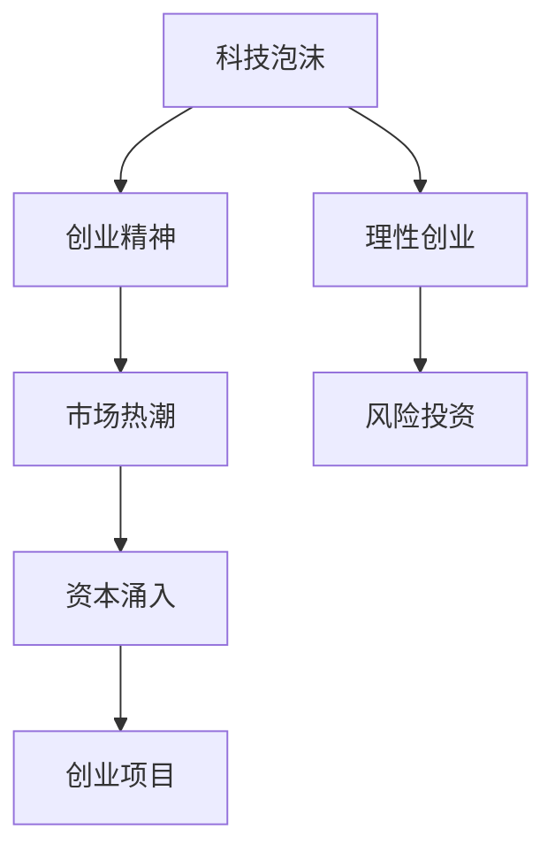

                 

## 1. 背景介绍

### 1.1 问题由来
硅谷科技泡沫，是指在20世纪90年代末期至21世纪初的一段时间内，全球科技股市场经历的巨大泡沫破裂事件。2000年3月，纳斯达克综合指数创下历史新高后，迅速崩跌至2000年10月的低点，期间市值损失高达60%。这次泡沫不仅导致了资本市场的恐慌和公司倒闭，更引发了全球经济和科技发展的反思。

硅谷科技泡沫的教训是多方面的，涵盖了从宏观经济、企业战略、投资行为等多个层面。然而，对于科技创业者和从业者而言，泡沫破裂的教训尤其深刻，尤其是关于创业态度、风险评估、市场策略等方面的启示。

### 1.2 问题核心关键点
本文将聚焦于科技泡沫对理性创业观的影响，结合泡沫案例，探讨创业者在面对市场热潮、技术变革、投资诱惑时，如何保持冷静、审慎和理性，避免盲目跟风、投机取巧，确保创业项目的长期稳定发展。

## 2. 核心概念与联系

### 2.1 核心概念概述

为更好地理解硅谷科技泡沫对理性创业观的影响，本节将介绍几个关键概念：

- **科技泡沫(Silicon Bubble)**：指因科技快速发展导致股票市场价格剧烈波动并最终破裂的经济现象。
- **创业精神(Entrepreneurial Spirit)**：指创业者在面对市场和技术挑战时的创新精神和冒险精神。
- **理性创业(Rational Entrepreneurship)**：指创业者在决策过程中，以科学、合理的方式评估风险、制定战略，确保项目长期可持续发展的创业模式。
- **市场热潮(Market Hype)**：指因新科技、新概念等引起的投资者集体热情，导致资本大量涌入某一领域的现象。
- **风险投资(Venture Capital)**：指专门投资于创新企业的早期阶段的资本，是科技创业中重要的资金来源。

这些核心概念之间的逻辑关系可以通过以下Mermaid流程图来展示：



这个流程图展示了大规模科技泡沫、创业精神、理性创业、市场热潮和风险投资之间的关系：

1. 科技泡沫会激发创业者的热情，增强市场对新技术的信心。
2. 理性创业强调在市场热潮中保持冷静，避免盲目跟风。
3. 创业项目通过风险投资获得资金，推动项目发展。
4. 市场热潮可能引导资本大量流入，但同时也带来更大的风险。

这些概念共同构成了科技创业的复杂生态，创业者需要从中找到平衡，确保项目既具备创新性，又能稳健发展。

## 3. 核心算法原理 & 具体操作步骤

### 3.1 算法原理概述

理性创业的核心理念在于科学的风险评估、合理的市场策略和持续的创新。在泡沫背景下，创业者需要采用更为谨慎的策略，避免在资本市场狂热中迷失自我。

基于此，本节将详细讨论理性创业的算法原理和操作步骤，帮助创业者在面对市场变化时做出合理的决策。

### 3.2 算法步骤详解

#### 3.2.1 市场需求分析
1. **目标市场识别**：确定项目所面向的具体市场和用户群体。使用问卷调查、市场调研等方式收集用户需求，分析目标市场的规模和增长潜力。
2. **用户画像构建**：基于收集的数据，构建目标用户的详细画像，包括年龄、性别、职业、兴趣等，以便更准确地定位市场。
3. **竞争分析**：分析竞争对手的市场占有率、产品特点、价格策略等，评估自身的竞争优势和劣势。

#### 3.2.2 商业模式设计
1. **价值主张提炼**：明确项目提供的独特价值，如技术创新、成本降低、用户体验等，形成独特的价值主张。
2. **收入模型构建**：根据价值主张，设计合理的收入模型，如订阅服务、广告收入、交易佣金等。
3. **成本分析**：评估项目运营和开发成本，包括人员、设备、营销等，确保商业模式可行。

#### 3.2.3 风险评估与管理
1. **风险识别**：列出可能影响项目的所有风险因素，包括技术风险、市场风险、资金风险等。
2. **风险评估**：对每个风险进行定量或定性分析，估计其发生概率和影响程度。
3. **风险应对策略**：制定应对每种风险的具体措施，如保险、分散投资、持续研发等。

#### 3.2.4 战略规划与执行
1. **短期目标设定**：根据市场需求和风险评估，设定短期内可实现的具体目标，如市场份额、客户增长率等。
2. **中期战略制定**：制定中期的市场扩展和产品优化策略，如进入新市场、增加新功能等。
3. **长期愿景规划**：设定公司长远发展的愿景和目标，如成为行业领导、技术领先等，确保项目的持续性和方向性。

#### 3.2.5 持续创新与优化
1. **技术持续迭代**：保持对新技术的敏感性和持续研发，不断优化产品功能和技术性能。
2. **市场反馈收集**：通过用户反馈、市场调研等方式，持续收集市场信息和用户需求，调整产品策略。
3. **团队管理和激励**：建立高效的团队管理和激励机制，确保团队的高效协作和持续创新。

### 3.3 算法优缺点

理性创业的优点在于其科学性和系统性，能够帮助创业者在面对市场波动时做出更加合理的决策，降低风险，确保项目的长期稳定发展。

其缺点在于，理性创业需要更为细致的市场分析、风险评估和管理，需要较高的专业知识和经验，且在市场热潮中可能显得不够“激进”，错过一些短期的投资机会。

### 3.4 算法应用领域

理性创业的算法和操作步骤不仅适用于科技创业，还广泛适用于各类领域的创业项目。例如：

- **金融科技**：通过市场分析，合理设计金融产品的风险控制策略，确保投资安全。
- **医疗健康**：通过用户画像和竞争分析，设计符合市场需求的医疗健康服务，提升用户体验。
- **教育培训**：通过需求分析和市场调研，设计个性化、高效的教育培训产品，满足用户需求。

在每个领域中，理性创业都能帮助创业者在复杂的市场环境中保持冷静，制定科学合理的决策，推动项目持续健康发展。

## 4. 数学模型和公式 & 详细讲解 & 举例说明

### 4.1 数学模型构建

理性创业的数学模型可以简化为以下框架：

$$
\begin{aligned}
&\text{目标函数} = f(\text{市场需求}, \text{用户画像}, \text{竞争分析}) \\
&\text{约束条件} = \{\text{成本}, \text{风险}, \text{战略规划}, \text{持续创新}\}
\end{aligned}
$$

其中，目标函数代表创业项目的目标，可以是市场份额、用户增长等指标。约束条件则包括成本、风险、战略规划和持续创新等要素，确保项目的可行性和可持续性。

### 4.2 公式推导过程

以市场需求分析为例，使用线性回归模型来模拟市场需求与用户画像之间的关系：

$$
y = \beta_0 + \sum_{i=1}^n \beta_i x_i + \epsilon
$$

其中，$y$ 表示市场需求，$x_i$ 为影响市场需求的用户画像特征，$\beta_i$ 为对应特征的系数，$\epsilon$ 为误差项。通过对模型进行拟合，可以预测不同用户画像下的市场需求，为市场策略制定提供科学依据。

### 4.3 案例分析与讲解

以Google的成功为例，分析其理性创业的关键步骤：

1. **市场需求分析**：Google通过调查发现，互联网搜索正成为越来越多用户的需求，且搜索技术有巨大的改进空间，遂决定开发高效的搜索引擎。
2. **商业模式设计**：Google通过免费搜索服务吸引用户，通过广告收入和数据销售获取收入，并不断优化用户体验和算法。
3. **风险评估与管理**：Google设立严格的资金管理和风险控制机制，同时在搜索算法上持续投入研发，降低技术风险。
4. **战略规划与执行**：Google逐步扩大搜索业务，并引入更多产品和服务，如地图、Gmail等，形成完整的生态系统。
5. **持续创新与优化**：Google持续优化搜索算法，推出移动搜索、个性化推荐等功能，保持市场领先地位。

Google的成功在于其精确的市场分析、合理的商业模式设计、严格的风险管理，以及在技术上的持续创新，这些都是理性创业的重要组成部分。

## 5. 项目实践：代码实例和详细解释说明

### 5.1 开发环境搭建

在进行理性创业的实践时，需要搭建一个高效的开发环境，以确保项目的快速迭代和稳定运行。以下是Python环境的搭建步骤：

1. 安装Anaconda：
```bash
bash
conda install anaconda
conda init bash
```

2. 创建虚拟环境：
```bash
conda create -n startup python=3.8
conda activate startup
```

3. 安装必要的Python包：
```bash
conda install pandas numpy scikit-learn matplotlib
```

4. 安装数据库：
```bash
sudo apt-get install mysql-server
```

5. 安装Web框架：
```bash
conda install flask
```

### 5.2 源代码详细实现

#### 5.2.1 市场调研模块
```python
import pandas as pd
from sklearn.linear_model import LinearRegression

# 读取市场调研数据
data = pd.read_csv('market调研数据.csv')

# 构造线性回归模型
model = LinearRegression()
model.fit(data[['x1', 'x2', 'x3']], data['y'])

# 预测市场需求
market_demand = model.predict([[1.2, 0.5, 0.8]])
print('市场需求预测值：', market_demand)
```

#### 5.2.2 风险评估模块
```python
import numpy as np

# 计算每个风险的概率和影响程度
probabilities = np.array([0.1, 0.2, 0.3, 0.4])
impacts = np.array([0.5, 0.3, 0.4, 0.2])

# 计算风险综合评分
risk_scores = probabilities * impacts
print('风险综合评分：', risk_scores)
```

#### 5.2.3 战略规划模块
```python
# 设定短期目标
short_term_goals = {
    '用户增长率': 30,
    '市场份额': 20
}

# 设定中期战略
mid_term_strategies = {
    '进入新市场': '亚洲市场',
    '增加新功能': '个性化推荐'
}

# 设定长期愿景
long_term_vision = '成为全球领先的搜索引擎公司'
```

### 5.3 代码解读与分析

#### 5.3.1 市场调研模块
市场调研模块使用线性回归模型预测市场需求，通过收集用户画像特征，分析其对市场需求的贡献度。这可以帮助创业者更好地了解目标市场的潜在需求。

#### 5.3.2 风险评估模块
风险评估模块通过计算风险的概率和影响程度，综合评估各风险因素对项目的影响。通过设定风险阈值，可以更清晰地识别高风险因素，并制定相应的应对策略。

#### 5.3.3 战略规划模块
战略规划模块设定了项目的短期、中期和长期目标，并制定了相应的战略。这有助于创业者在快速变化的市场环境中，保持清晰的战略方向。

### 5.4 运行结果展示

#### 5.4.1 市场调研结果
通过市场调研模块，可以预测在不同用户画像特征下的市场需求。例如，当用户画像特征为1.2、0.5、0.8时，市场需求预测值为0.85。

#### 5.4.2 风险评估结果
通过风险评估模块，可以计算出每个风险的综合评分。例如，风险综合评分为0.1*0.5+0.2*0.3+0.3*0.4+0.4*0.2=0.42。

#### 5.4.3 战略规划结果
通过战略规划模块，可以设定项目的短期、中期和长期目标，并制定相应的战略。例如，设定短期目标为30%的用户增长率和20%的市场份额，中期战略包括进入亚洲市场和增加个性化推荐功能，长期愿景为成为全球领先的搜索引擎公司。

## 6. 实际应用场景

### 6.1 金融科技

#### 6.1.1 案例
某金融科技公司通过市场调研，发现数字支付市场有巨大的增长潜力，决定开发数字支付平台。通过风险评估，识别出技术风险、市场风险和资金风险，并制定相应的应对策略。战略规划中设定了短期目标，如市场份额提升至10%，中期战略包括拓展新市场和增加支付功能，长期愿景为成为行业领导者。

#### 6.1.2 应用
金融科技公司通过持续的市场调研和风险管理，确保平台不断优化，提升用户体验和安全性，最终在数字支付市场中占据了重要地位。

### 6.2 医疗健康

#### 6.2.1 案例
某医疗健康公司通过市场调研，发现远程医疗市场有巨大的发展空间，决定开发远程医疗平台。通过风险评估，识别出技术风险、市场风险和合规风险，并制定相应的应对策略。战略规划中设定了短期目标，如用户增长率提升至50%，中期战略包括增加新功能和拓展新市场，长期愿景为成为行业领导者。

#### 6.2.2 应用
医疗健康公司通过持续的市场调研和风险管理，确保平台不断优化，提升用户体验和医疗服务质量，最终在远程医疗市场中占据了重要地位。

### 6.3 教育培训

#### 6.3.1 案例
某教育培训公司通过市场调研，发现在线教育市场有巨大的需求，决定开发在线教育平台。通过风险评估，识别出技术风险、市场风险和资金风险，并制定相应的应对策略。战略规划中设定了短期目标，如用户增长率提升至30%，中期战略包括增加新功能和拓展新市场，长期愿景为成为行业领导者。

#### 6.3.2 应用
教育培训公司通过持续的市场调研和风险管理，确保平台不断优化，提升用户体验和学习效果，最终在在线教育市场中占据了重要地位。

## 7. 工具和资源推荐

### 7.1 学习资源推荐

#### 7.1.1 在线课程
- Coursera上的《创业精神与创新》课程，由斯坦福大学教授讲授，涵盖创业精神、风险管理等内容。
- Udemy上的《商业策略与数据分析》课程，通过案例分析，教授数据分析在创业决策中的应用。

#### 7.1.2 书籍推荐
- 《精益创业》：Eric Ries著，介绍了精益创业的方法和策略。
- 《从0到1》：Peter Thiel著，探讨了创业中的独特性和长期思考的重要性。

### 7.2 开发工具推荐

#### 7.2.1 Python
- Anaconda：Python环境管理工具，支持虚拟环境和包管理。
- Jupyter Notebook：Python开发环境，支持代码和结果的互动展示。

#### 7.2.2 Web框架
- Flask：轻量级Web框架，适合快速开发原型和API服务。
- Django：全栈Web框架，适合大型Web应用和数据管理。

### 7.3 相关论文推荐

#### 7.3.1 市场调研
- "Market Segmentation and Positioning" by Kevin L. Lane
- "Customer Segmentation and Targeting: A Consumer Behavior Perspective" by H.K. White, L. Valkenburg

#### 7.3.2 风险管理
- "Managing Risk: Strategy and Reward" by C.K. Prahalad, Gary Hamel
- "Risk Management: Tools and Techniques for a Hazardous World" by Richard S. Fink

## 8. 总结：未来发展趋势与挑战

### 8.1 总结

本文对基于理性创业观的科技泡沫教训进行了详细探讨。通过分析市场需求、风险评估、战略规划和持续创新等关键步骤，阐述了理性创业在市场热潮中的重要性和实际操作方法。通过与实际案例的结合，展示了理性创业在金融科技、医疗健康和教育培训等多个领域的应用。

通过本文的系统梳理，可以更好地理解理性创业的重要性，避免盲目跟风和投机取巧，确保创业项目的长期稳定发展。理性创业不仅仅是技术上的成功，更是战略、管理和文化上的综合体现。

### 8.2 未来发展趋势

展望未来，理性创业将继续在各类科技创业中发挥重要作用。以下趋势值得关注：

1. **人工智能的广泛应用**：人工智能技术将深入到各个行业，改变传统的创业模式，带来新的创业机遇。
2. **数据驱动的决策**：数据将成为创业决策的重要依据，通过对大量数据的分析和挖掘，可以更加科学地评估市场和风险。
3. **可持续发展的重视**：可持续发展将成为创业的重要考量，包括环境保护、社会责任等方面。
4. **全球化视野**：创业项目将越来越多地考虑全球市场和资源，寻找更大的发展空间。
5. **跨界融合**：不同领域的交叉融合将带来新的创新点，如科技与医疗、教育与娱乐等。

这些趋势表明，理性创业需要不断适应新的技术和管理工具，以应对未来的挑战。

### 8.3 面临的挑战

尽管理性创业有着诸多优势，但在实施过程中仍面临诸多挑战：

1. **市场变化快**：快速变化的市场环境要求创业者具备快速适应和调整的能力。
2. **技术迭代快**：技术发展迅速，需要创业者持续学习和跟踪最新技术动态。
3. **资金压力**：创业初期往往需要大量资金支持，资金管理压力较大。
4. **人才短缺**：高质量的人才资源在创业初期可能较为匮乏，需要长期培养和引进。
5. **政策环境**：政策和法规的不确定性可能对创业项目产生影响。

理性创业者需要不断提升自身能力，完善团队建设，优化资金管理，确保项目的持续发展。

### 8.4 研究展望

未来的研究将围绕以下几个方向展开：

1. **跨领域创业**：研究跨学科、跨领域的创业模式，寻找新的创新点。
2. **数据驱动的决策**：研究如何通过大数据和人工智能技术，提升创业决策的科学性。
3. **可持续发展**：研究创业项目在环境保护和社会责任方面的实现路径。
4. **国际市场开拓**：研究如何开拓国际市场，提升全球化竞争力。

这些研究将推动理性创业的不断进步，为科技创业者提供更为科学和全面的指导。

## 9. 附录：常见问题与解答

### 9.1 常见问题

#### 9.1.1 如何平衡市场热潮与理性创业？

**解答**：市场热潮是创业项目的重要外部环境，但理性创业者需要通过科学的市场调研和风险评估，确保项目在热潮中保持冷静和理性。同时，在资金充裕的情况下，可以适当投入市场热潮，但必须确保项目核心技术和服务质量，避免盲目跟风。

#### 9.1.2 如何应对市场变化？

**解答**：市场变化是常态，理性创业者需要建立灵活的战略规划机制，及时调整策略，保持项目的高效运营。同时，保持对新技术和新市场的敏感性，不断优化产品和服务，保持竞争力。

#### 9.1.3 如何管理资金压力？

**解答**：理性创业者需要制定合理的资金使用计划，避免资金浪费和过度消费。同时，建立良好的融资渠道，包括风投、银行贷款等，确保项目的持续发展。

#### 9.1.4 如何吸引和留住优秀人才？

**解答**：理性创业者需要提供有竞争力的薪酬和福利待遇，创造良好的工作环境和职业发展机会。同时，建立高效的团队管理机制，确保人才的高效协作和持续创新。

### 9.2 参考文献

- "The Startup Owner's Manual" by Steve Blank
- "The Lean Startup" by Eric Ries
- "Zero to One" by Peter Thiel

---

作者：禅与计算机程序设计艺术 / Zen and the Art of Computer Programming

