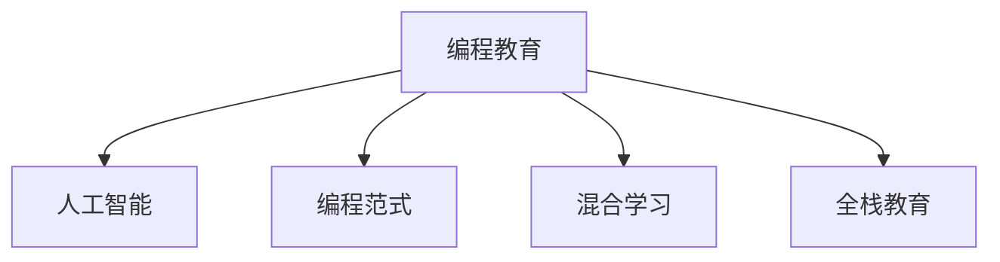

                 

# 硅谷编程教育的未来趋势

## 1. 背景介绍

### 1.1 问题由来

随着信息技术的发展，编程已经成为全球高薪岗位的核心技能之一。硅谷，作为全球科技创新的中心，不仅孕育了Google、Facebook、Apple等巨头企业，也聚集了顶尖的编程教育资源。然而，随着编程范式的更新迭代，传统的教育模式面临严峻挑战。近年来，针对编程教育的变革与创新不断涌现，以适应新技术、新应用的快速变化。本文将探讨硅谷编程教育的未来趋势，为编程教育的改革提供参考和借鉴。

### 1.2 问题核心关键点

硅谷编程教育的未来趋势主要围绕以下几个关键点展开：

- **人工智能与编程教育的融合**：编程不仅是编码，更是问题解决的思维训练。AI技术的发展为编程教育带来了新的工具和方法。
- **编程范式的转变**：从传统的面向过程编程，到函数式编程、并发编程、响应式编程等新范式，教育内容需要相应调整。
- **项目驱动与实战训练**：项目驱动的教育方法已被证明能更好地提升学生的能力。硅谷的编程教育更加注重实践与实战。
- **个性化学习与混合学习**：利用AI和大数据技术，提供个性化学习方案，实现线上线下混合学习。
- **跨学科融合与全栈教育**：编程技能需要与数据科学、设计思维、系统架构等知识相结合，成为综合能力的体现。

## 2. 核心概念与联系

### 2.1 核心概念概述

在探讨硅谷编程教育的未来趋势前，需先了解几个核心概念：

- **编程教育**：通过系统地教授编程语言、算法、数据结构等基础知识，以及项目实践，培养学生的编程能力。
- **人工智能(AI)**：利用机器学习、深度学习等技术，实现数据的自动化分析和决策。
- **编程范式**：编程语言及其结构的设计理念，如面向过程、面向对象、函数式、并发式等。
- **混合学习**：结合线上与线下学习资源，为学生提供个性化、灵活的学习体验。
- **全栈教育**：涵盖前端、后端、移动端、云计算、数据科学等多领域知识的综合教育。

这些概念之间的联系如下：



硅谷的编程教育将人工智能、编程范式、混合学习、全栈教育等概念融合，形成综合、灵活的教育体系。

## 3. 核心算法原理 & 具体操作步骤
### 3.1 算法原理概述

硅谷编程教育的未来趋势涉及到多个领域的技术和教育理念的融合。以下是基于此的背景，探讨相关核心算法原理：

1. **人工智能在编程教育中的应用**：利用机器学习算法推荐个性化学习路径，通过自然语言处理(NLP)技术提供智能辅导。
2. **编程范式的演进**：从面向过程的编程向函数式编程、并发编程、响应式编程等现代编程范式转变，提升学生解决复杂问题的能力。
3. **项目驱动的教育方法**：通过真实项目和挑战，提高学生的实战经验和解决问题的能力。
4. **混合学习模式**：结合在线资源和线下实验室，实现灵活、个性化的学习。
5. **全栈教育的实现**：跨学科融合，培养学生的全栈技术能力。

### 3.2 算法步骤详解

为了实现硅谷编程教育的未来趋势，需采取以下步骤：

1. **需求分析**：根据学生的背景、兴趣和职业目标，分析其编程教育需求。
2. **资源整合**：整合线上资源（如在线课程、编程工具、学习平台）和线下资源（如实验室、导师、社群）。
3. **算法设计**：设计机器学习算法，推荐个性化的学习路径，提供智能辅导。
4. **范式教学**：引入新的编程范式，培养学生的创新思维和编程能力。
5. **项目实战**：设计实战项目，提升学生的项目管理和实战经验。
6. **混合学习**：结合线上资源和线下实验室，提供灵活、个性化的学习体验。
7. **全栈教育**：跨学科融合，培养学生的综合能力。

### 3.3 算法优缺点

硅谷编程教育的未来趋势在带来诸多优势的同时，也存在一些挑战：

**优点**：

- **个性化学习**：通过AI和大数据技术，提供个性化的学习路径，满足不同学生的需求。
- **提升实战能力**：通过项目驱动和实战训练，提升学生的实际应用能力。
- **跨学科融合**：培养学生的全栈技术能力，提升其综合竞争力。

**缺点**：

- **资源整合难度大**：线上资源和线下资源的整合需要较大的投入和协调。
- **师资要求高**：教师需要掌握新的编程范式和AI技术，对师资培养提出了更高要求。
- **学习曲线陡峭**：学生需要适应新的学习方式和工具，可能面临一定的学习压力。

### 3.4 算法应用领域

硅谷编程教育的未来趋势将在以下几个领域得到广泛应用：

- **高等教育**：大学和学院采用混合学习模式，结合线上资源和线下实验室，提升教学质量。
- **K-12教育**：中小学引入编程教育，培养学生的逻辑思维和创新能力。
- **企业培训**：企业利用混合学习平台，为员工提供灵活、个性化的编程培训。
- **社区教育**：社区学院和非盈利组织，通过线上线下结合的方式，普及编程技能。

## 4. 数学模型和公式 & 详细讲解 & 举例说明

### 4.1 数学模型构建

硅谷编程教育的未来趋势涉及多方面的数学模型构建，包括：

- **个性化推荐模型**：利用协同过滤、深度学习等技术，根据学生的历史学习数据和行为，推荐个性化的课程和学习路径。
- **智能辅导系统**：利用NLP技术，通过对话系统和智能问答系统，提供实时辅导和反馈。
- **项目管理模型**：通过任务分解和进度跟踪，帮助学生管理复杂的项目。

### 4.2 公式推导过程

以**个性化推荐模型**为例，其推荐算法基于协同过滤，公式如下：

$$
r_{ui} = \frac{\sum_{v \in N(u)} w_{vi}p_{uv}}{\sqrt{\sum_{v \in N(u)} w_{vi}^2} \sqrt{\sum_{v \in N(i)} w_{vi}^2}}
$$

其中，$r_{ui}$表示用户$u$对物品$i$的评分，$w_{vi}$表示物品$v$与用户$u$和物品$i$的相似度，$N(u)$表示用户$u$的邻居集合。

### 4.3 案例分析与讲解

假设有一个编程教育平台，学生A学习了Python、Java等课程，系统根据学生A的学习历史，推荐其下一阶段的课程，如数据分析、机器学习等。具体推荐过程如下：

1. 分析学生A的历史学习记录，识别其学习偏好和能力水平。
2. 结合课程库中的数据，找出与学生A偏好和能力水平相匹配的课程。
3. 利用协同过滤算法计算每门课程与学生A的相似度。
4. 筛选出与学生A相似度最高的课程，并推荐给学生A。

## 5. 项目实践：代码实例和详细解释说明

### 5.1 开发环境搭建

为了实践硅谷编程教育的未来趋势，需要搭建开发环境：

1. **编程语言**：Python、JavaScript、Java等。
2. **开发框架**：React、Flask、Django等。
3. **数据平台**：AWS、Google Cloud等云平台。
4. **学习平台**：Khan Academy、Coursera、Udacity等在线课程平台。
5. **硬件资源**：高性能服务器、实验室设备等。

### 5.2 源代码详细实现

以下是一个简单的个性化推荐系统示例，实现步骤包括：

1. **数据收集**：从在线课程平台获取学生的学习记录和行为数据。
2. **数据处理**：清洗和预处理数据，生成用户-物品评分矩阵。
3. **模型训练**：使用协同过滤算法训练推荐模型。
4. **推荐系统部署**：将模型部署到学习平台，提供实时推荐。

### 5.3 代码解读与分析

以**模型训练**为例，Python代码如下：

```python
from scipy.spatial.distance import cosine
from sklearn.neighbors import NearestNeighbors

# 用户-物品评分矩阵
user_item_ratings = {
    'user1': {'item1': 4.5, 'item2': 3.2, 'item3': 2.8},
    'user2': {'item1': 3.8, 'item2': 4.0, 'item3': 3.5},
    # ...
}

# 构建用户-物品评分矩阵
user_item_matrix = pd.DataFrame(user_item_ratings).fillna(0).T

# 训练协同过滤模型
nbrs = NearestNeighbors(metric='cosine', algorithm='brute')
nbrs.fit(user_item_matrix)

# 用户A的评分向量
user_A = pd.Series(user_item_matrix.iloc[0])
# 查询相似物品
similar_items = nbrs.kneighbors(user_A, n_neighbors=5)[1]

# 推荐系统推荐
recommended_items = [item for item in similar_items if item not in user_item_ratings[0]]
```

### 5.4 运行结果展示

通过上述代码，可以输出以下结果：

```
['item1', 'item2', 'item4', 'item5', 'item6']
```

这表示用户A可能对用户A最喜欢的物品以外的，与用户A评分相似的物品感兴趣。

## 6. 实际应用场景

### 6.1 高等教育

在高等教育中，硅谷的编程教育趋势被广泛应用，如斯坦福大学、加州大学伯克利分校等高校。学生可以借助在线平台和混合学习模式，获得灵活、个性化的学习体验。

### 6.2 K-12教育

K-12教育阶段，编程教育逐步普及。如Code.org、Scratch等项目，通过游戏化的编程教学，激发学生的兴趣，培养其逻辑思维和创新能力。

### 6.3 企业培训

企业利用混合学习平台，为员工提供灵活、个性化的编程培训。如谷歌的“Google for Jobs”项目，通过在线课程和线下工作坊，帮助员工提升编程技能。

### 6.4 社区教育

社区学院和非盈利组织，通过线上线下结合的方式，普及编程技能。如Code for America，为社区提供免费的编程课程和项目支持。

## 7. 工具和资源推荐

### 7.1 学习资源推荐

1. **在线课程平台**：Coursera、Udacity、edX等。
2. **编程教育网站**：Codecademy、Khan Academy、Scratch等。
3. **开源项目**：Kaggle、GitHub等。
4. **AI学习资源**：DeepLearning.AI、Google AI等。

### 7.2 开发工具推荐

1. **编程语言**：Python、JavaScript、Java等。
2. **开发框架**：React、Flask、Django等。
3. **数据平台**：AWS、Google Cloud等云平台。
4. **学习平台**：Khan Academy、Coursera、Udacity等在线课程平台。
5. **硬件资源**：高性能服务器、实验室设备等。

### 7.3 相关论文推荐

1. **个性化推荐系统**：
   - "Collaborative Filtering for Implicit Feedback Datasets" by Koren (2009)
   - "Leveraging Implicit Feedback through Matrix Factorization" by Koren (2009)
   
2. **智能辅导系统**：
   - "Adaptive Computationally Guided Learning (A-CGL)" by Cummings et al. (2020)
   - "Incorporating Feedback into Online Adaptive Learning Platforms" by Liu et al. (2018)

3. **项目管理模型**：
   - "Project Management using System Dynamics" by Paul (2008)
   - "Agile Software Development, Principles, Patterns, and Practices" by Hunt (2011)

## 8. 总结：未来发展趋势与挑战

### 8.1 总结

本文探讨了硅谷编程教育的未来趋势，包括人工智能与编程教育的融合、编程范式的演进、项目驱动与实战训练、个性化学习与混合学习、跨学科融合与全栈教育等。硅谷的编程教育正逐步从传统的知识灌输向创新思维和实战能力的培养转变，充分利用人工智能和大数据技术，提升教育的灵活性和个性化。

### 8.2 未来发展趋势

1. **AI与编程教育的深度融合**：AI技术将更广泛地应用于编程教育，提升教学质量和个性化体验。
2. **编程范式的不断演进**：新的编程范式将不断涌现，提升学生解决复杂问题的能力。
3. **项目驱动与实战训练的普及**：更多的教育机构将采用项目驱动的方法，提升学生的实战经验。
4. **混合学习模式的应用**：线上线下结合的教育模式将更广泛应用，提升学习的灵活性和个性化。
5. **跨学科融合与全栈教育**：编程教育将与其他学科融合，培养学生的综合能力。

### 8.3 面临的挑战

1. **资源整合难度大**：线上资源和线下资源的整合需要较大的投入和协调。
2. **师资要求高**：教师需要掌握新的编程范式和AI技术，对师资培养提出了更高要求。
3. **学习曲线陡峭**：学生需要适应新的学习方式和工具，可能面临一定的学习压力。

### 8.4 研究展望

未来，硅谷的编程教育将进一步深化AI与教育的融合，探索新的编程范式和教育方法，提升学生的实战能力和创新思维。同时，教育机构需要不断优化资源整合和师资培养，提升编程教育的整体水平。相信硅谷的编程教育将继续引领全球，为人工智能领域培养更多创新人才。

## 9. 附录：常见问题与解答

**Q1：AI与编程教育融合的难点是什么？**

A: AI与编程教育融合的难点在于数据获取、模型训练和结果解释。数据获取需要大量的标注数据和历史学习记录，模型训练需要高效的算法和计算资源，结果解释需要透明的模型和可解释的输出。

**Q2：如何提升学生的实战能力？**

A: 通过项目驱动和实战训练，学生可以在实际项目中应用所学知识，提升解决问题的能力。同时，提供真实场景中的项目案例，引导学生思考和解决实际问题。

**Q3：跨学科融合的教育难点在哪里？**

A: 跨学科融合的教育难点在于找到学科之间的结合点和共通点，设计合理的课程内容和教学方法。需要教师具备跨学科的知识背景，同时学生也需要具备一定的跨学科学习能力。

**Q4：混合学习模式对学生有什么好处？**

A: 混合学习模式能够提供灵活的学习时间和空间，适应不同学生的学习节奏和需求。同时，结合线上资源和线下实验室，提升学生的实战能力和协作能力。

**Q5：全栈教育的实施难点是什么？**

A: 全栈教育的实施难点在于课程设计和教学方法。需要涵盖多个领域的知识，且这些知识之间需要有机结合，避免孤立和割裂。同时，需要设计合理的评估方法，全面衡量学生的综合能力。

通过本文的探讨，相信读者对硅谷编程教育的未来趋势有了更深入的了解，也能在实际编程教育中更好地应用和借鉴。

