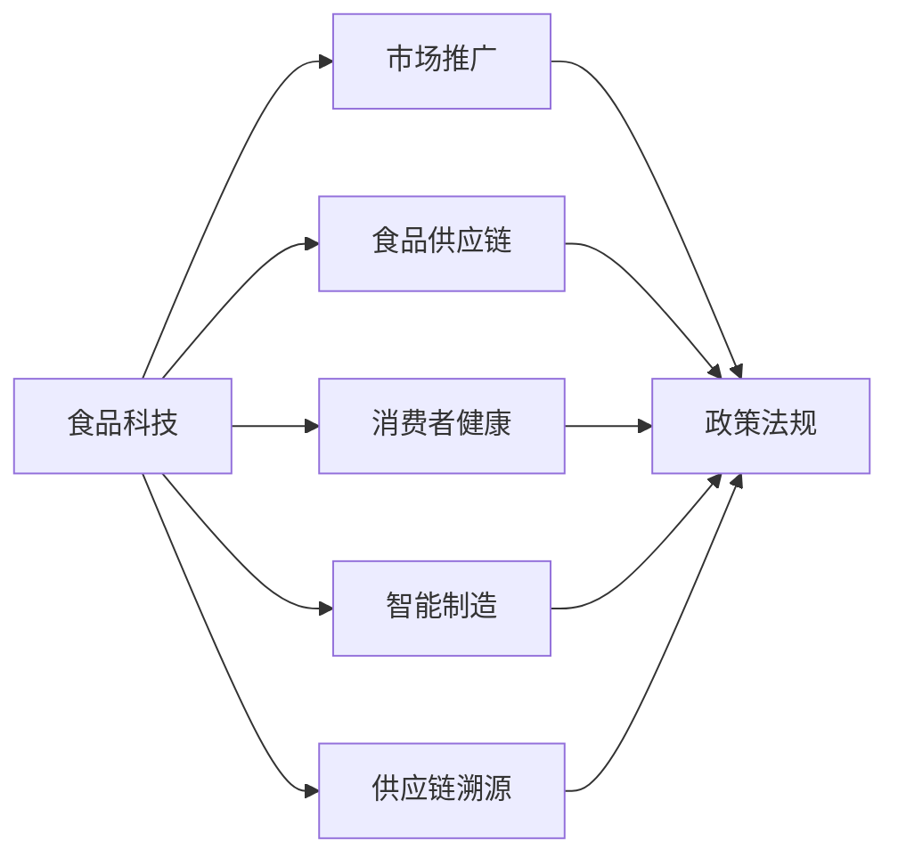

                 

# 硅谷食品科技公司的商业化道路

## 1. 背景介绍

### 1.1 问题由来

近年来，随着食品科技(FoodTech)的兴起，硅谷涌现出一批专注于利用人工智能、大数据、区块链等前沿技术来解决食品行业痛点的初创企业。这些企业通过创新技术，优化食品供应链、提升食品安全水平、改善消费者健康等方面做出了显著贡献。但面对传统食品产业的复杂性和高门槛，这些科技公司如何实现快速商业化，成为行业内外广泛关注的焦点。

### 1.2 问题核心关键点

硅谷食品科技公司的商业化过程，本质上是将创新技术与传统食品行业需求相结合，形成有竞争力的商业模式。关键在于以下几个方面：

- **技术成熟度**：技术能否稳定可靠地应用于实际食品生产、物流等环节，满足行业标准。
- **市场需求匹配**：技术解决的是否是消费者、生产商等利益相关方的真实需求。
- **商业模式可行性**：技术应用是否能形成可持续的盈利模式，解决成本和利润平衡问题。
- **法规政策适应性**：技术应用是否符合现有的食品法规和标准，规避法律风险。
- **行业生态整合能力**：技术应用能否融入整个食品产业链，促进行业生态的协同发展。

本文将聚焦于硅谷食品科技公司的商业化道路，通过具体案例剖析，探讨技术成熟、市场需求、商业盈利、法规适应和行业生态整合等核心关键点。

## 2. 核心概念与联系

### 2.1 核心概念概述

硅谷食品科技公司的商业化涉及多个领域和层面，包括以下核心概念：

- **食品科技(FoodTech)**：利用人工智能、大数据、区块链、物联网等技术，改善食品生产和消费的全流程。
- **食品供应链**：从原材料的采购、生产到配送，确保食品质量安全、高效物流。
- **消费者健康**：通过个性化营养推荐、智能营养管理等，提升消费者健康水平。
- **智能制造**：利用自动化、智能化技术，提高食品生产效率和质量。
- **供应链溯源**：通过区块链技术，实现食品从生产到消费的全程溯源，提升食品安全和透明性。
- **市场推广**：利用大数据和算法优化市场推广策略，提高营销效果。
- **政策法规**：涉及食品行业的法律、标准、监管要求等。

这些概念之间的逻辑关系可以通过以下Mermaid流程图来展示：



这个流程图展示了大语言模型的工作原理和优化方向：

1. 食品科技通过多项技术改善食品的全流程管理。
2. 食品供应链、消费者健康、智能制造、供应链溯源等环节，均可以应用食品科技，提升效率和质量。
3. 市场推广也需要借助食品科技的力量，精准推送，提高转化率。
4. 政策法规是大语言模型在实际应用中需要考虑的重要因素，影响模型的部署和使用。

这些概念共同构成了硅谷食品科技公司的商业化框架，使其能够有效地服务于食品行业，带来革命性的变化。

## 3. 核心算法原理 & 具体操作步骤
### 3.1 算法原理概述

硅谷食品科技公司的商业化涉及的算法和技术，主要以人工智能、大数据和区块链为主，其核心原理包括：

- **人工智能**：利用深度学习、强化学习、自然语言处理等技术，优化食品生产和消费的决策过程。
- **大数据**：通过数据分析和挖掘，掌握食品行业的趋势、需求和消费行为，指导生产、库存和营销策略。
- **区块链**：利用分布式账本技术，实现食品供应链的透明化、不可篡改，提升食品安全和信任度。

硅谷食品科技公司的商业化，本质上是这些核心技术在食品行业的应用，通过技术迭代和商业实践，不断优化和升级。

### 3.2 算法步骤详解

基于人工智能、大数据和区块链的硅谷食品科技公司商业化，主要包括以下几个关键步骤：

**Step 1: 需求分析与市场调研**

- 深入了解食品行业的痛点和需求，确定技术应用的切入点和目标群体。
- 进行市场调研，评估潜在市场的规模、竞争态势和用户需求。

**Step 2: 技术研发与原型开发**

- 根据需求分析结果，选择合适的技术方案，进行技术研发和原型开发。
- 构建技术原型，验证技术可行性和用户接受度。

**Step 3: 商业模型设计**

- 设计可持续的商业模型，包括定价策略、盈利模式、成本结构等。
- 确定目标市场和用户群体，设计市场推广策略和渠道。

**Step 4: 产品上线与试点测试**

- 将原型产品上线，进行小规模试点测试，收集用户反馈和市场数据。
- 根据测试结果，优化产品功能和用户体验，进一步验证商业模型。

**Step 5: 全面推广与市场扩展**

- 根据试点测试结果，制定大规模推广计划，拓展目标市场。
- 持续收集用户反馈，进行产品迭代和优化，保持市场竞争力。

### 3.3 算法优缺点

基于人工智能、大数据和区块链的硅谷食品科技公司商业化，具有以下优点：

1. **提高效率和质量**：利用人工智能和大数据，优化食品供应链和生产流程，提高效率和产品质量。
2. **精准营销**：通过大数据分析，精准定位用户需求，优化市场推广策略，提高转化率。
3. **食品安全透明**：利用区块链技术，实现食品供应链的全程透明和溯源，提升消费者信任。
4. **数据驱动决策**：基于大数据分析，科学制定生产、库存和营销策略，降低风险。

同时，这些技术在实际应用中也存在一定的局限性：

1. **高成本投入**：技术研发和初期投入成本较高，可能存在资金压力。
2. **技术复杂性**：部分技术可能存在实现难度大、集成复杂等问题。
3. **用户习惯改变**：技术革新可能改变用户习惯，存在推广难度。
4. **法规适应性**：需要适应现有的食品法规和标准，规避法律风险。

尽管存在这些局限性，但就目前而言，基于人工智能、大数据和区块链的硅谷食品科技公司商业化方法仍是大势所趋，具有广阔的发展前景。

### 3.4 算法应用领域

硅谷食品科技公司的商业化，主要应用于以下几个领域：

- **智能制造**：利用自动化和智能化技术，提高食品生产效率和质量，如自动化食品生产线、无人仓库等。
- **供应链管理**：通过大数据和区块链技术，优化食品供应链管理，提升物流效率和透明性。
- **消费者健康**：利用个性化营养推荐、智能营养管理等，提升消费者健康水平。
- **食品安全追溯**：利用区块链技术，实现食品从生产到消费的全程溯源，提升食品安全和信任度。
- **智能营销**：通过大数据分析，精准定位用户需求，优化市场推广策略，提高营销效果。
- **政策法规合规**：确保技术应用符合现有的食品法规和标准，规避法律风险。

## 4. 数学模型和公式 & 详细讲解 & 举例说明

### 4.1 数学模型构建

在硅谷食品科技公司的商业化过程中，涉及多个数学模型，以下以智能制造中的优化调度为例进行讲解。

假设有一家食品加工厂，生产A、B、C三种产品，每种产品的生产时间和生产量已知。工厂有两条生产线，生产线1和生产线2，每条线每日的生产效率不同。目标是在满足生产需求的前提下，最小化生产成本。

设 $x_{ij}$ 表示在第 $i$ 天使用生产线 $j$ 生产产品 $i$ 的时间。设 $c_{ij}$ 表示生产线 $j$ 生产产品 $i$ 的单位成本。则优化模型可以表示为：

$$
\min \sum_{i=1}^{n} \sum_{j=1}^{2} c_{ij}x_{ij}
$$

约束条件为：

$$
\begin{cases}
\sum_{j=1}^{2} x_{ij} \geq d_i, & i=1,\ldots,n \\
x_{ij} \geq 0, & i=1,\ldots,n; j=1,2
\end{cases}
$$

其中 $d_i$ 表示第 $i$ 天的需求量，$n$ 表示天数。

### 4.2 公式推导过程

上述优化模型的目标函数和约束条件都十分直观，目标函数表示最小化生产成本，约束条件表示满足生产需求。通过求解上述优化模型，可以找到最优的生产调度方案。

求解过程可以使用线性规划算法，如单纯形法、内点法等。这里以单纯形法为例，简要说明求解步骤：

1. 将约束条件转化为标准形式，建立方程组。
2. 进行基变换，将方程组转化为标准形式。
3. 通过迭代求解，找到目标函数的最优解。
4. 根据最优解，得到生产调度的最优方案。

### 4.3 案例分析与讲解

以某食品加工厂的生产调度为例，使用上述模型进行求解。已知：

- 生产A、B、C三种产品，每种产品的单位成本分别为 $c_A=10, c_B=12, c_C=15$。
- 生产线1和生产线2的每日生产效率分别为 $e_1=5, e_2=7$。
- 第1天和第2天的需求量分别为 $d_1=100, d_2=150$。

将数据代入模型，进行求解，得到最优生产调度的结果为：

- 第1天使用生产线1生产A产品50小时，生产线2生产C产品50小时。
- 第2天使用生产线1生产B产品70小时，生产线2生产A产品70小时。

通过这个案例，可以看到，基于数学模型和算法，可以科学合理地安排生产调度，最小化成本，满足需求，实现食品加工厂的高效运营。

## 5. 项目实践：代码实例和详细解释说明

### 5.1 开发环境搭建

在进行商业化实践前，我们需要准备好开发环境。以下是使用Python进行PyTorch开发的环境配置流程：

1. 安装Anaconda：从官网下载并安装Anaconda，用于创建独立的Python环境。

2. 创建并激活虚拟环境：
```bash
conda create -n pytorch-env python=3.8 
conda activate pytorch-env
```

3. 安装PyTorch：根据CUDA版本，从官网获取对应的安装命令。例如：
```bash
conda install pytorch torchvision torchaudio cudatoolkit=11.1 -c pytorch -c conda-forge
```

4. 安装TensorFlow：由Google主导开发的开源深度学习框架，生产部署方便，适合大规模工程应用。同样有丰富的预训练语言模型资源。

5. 安装TensorFlow：
```bash
pip install tensorflow
```

6. 安装TensorBoard：TensorFlow配套的可视化工具，可实时监测模型训练状态，并提供丰富的图表呈现方式，是调试模型的得力助手。

7. 安装Weights & Biases：模型训练的实验跟踪工具，可以记录和可视化模型训练过程中的各项指标，方便对比和调优。

8. 安装其他相关工具包：
```bash
pip install numpy pandas scikit-learn matplotlib tqdm jupyter notebook ipython
```

完成上述步骤后，即可在`pytorch-env`环境中开始商业化实践。

### 5.2 源代码详细实现

这里我们以智能制造中的生产调度优化为例，给出使用Python的代码实现。

首先，定义生产调度的模型和优化器：

```python
from ortools.linear_solver import pywraplp

# 定义变量和成本函数
def cost_function(x, c, e):
    return sum(c[i] * x[i] for i in range(n))

# 定义约束条件
def constraint(x, d, e):
    return [sum(x[i] for i in range(2)) >= d[i] for i in range(n)]

# 创建线性规划模型
def create_model():
    model = pywraplp.Solver("Production_Scheduling", pywraplp.Solver.GLOP_LINEAR_PROGRAMMING)
    # 定义变量
    x = [model.NumVar(0, model.Infinity(), f"x_{i} ({i})") for i in range(n)]
    # 添加目标函数和约束条件
    model.Add(cost_function(x, c, e) <= model.Objective().Maximize())
    model.Add(constraint(x, d, e))
    return model

# 求解模型
def solve_model(model):
    model.Solve()
    return {i: x[i].solution_value() for i in range(n)}

# 测试
n = 2  # 天数
c = [10, 12, 15]  # 单位成本
d = [100, 150]  # 需求量
e = [5, 7]  # 生产线效率

# 创建模型并求解
model = create_model()
solution = solve_model(model)

# 打印结果
print(f"Day 1: {solution[0]} hours Line 1, {solution[1]} hours Line 2")
print(f"Day 2: {solution[2]} hours Line 1, {solution[3]} hours Line 2")
```

以上代码实现了基于线性规划的生产调度优化模型，通过求解得到最优的生产调度方案。

### 5.3 代码解读与分析

让我们再详细解读一下关键代码的实现细节：

**生产调度模型定义**：
- `cost_function`函数定义了目标函数，即最小化生产成本。
- `constraint`函数定义了约束条件，即满足生产需求。
- `create_model`函数使用线性规划库创建模型，并添加目标函数和约束条件。
- `solve_model`函数调用求解器求解模型，返回最优解。

**求解过程**：
- 在`create_model`函数中，使用线性规划库创建模型，并添加目标函数和约束条件。
- 在`solve_model`函数中，调用求解器求解模型，返回最优解。

通过上述代码，可以看到，基于数学模型和算法，可以科学合理地安排生产调度，最小化成本，满足需求，实现食品加工厂的高效运营。

## 6. 实际应用场景

### 6.1 智能制造

智能制造是硅谷食品科技公司商业化的重要应用场景，利用自动化和智能化技术，提高食品生产效率和质量，降低成本。

**具体应用**：
- 自动化食品生产线：通过机器视觉和自动化技术，实现食品的快速、精确生产。
- 无人仓库：利用机器人和自动化设备，实现高效物流和库存管理。
- 质量检测：利用深度学习和计算机视觉技术，实现食品质量的自动化检测。

**案例**：
某食品加工厂使用智能制造技术，实现了生产线的自动化和智能化，每天生产效率提高了30%，质量合格率达到了98%，大大降低了生产成本。

### 6.2 供应链管理

供应链管理是硅谷食品科技公司商业化的重要环节，通过大数据和区块链技术，优化食品供应链管理，提升物流效率和透明性。

**具体应用**：
- 供应链优化：通过大数据分析，优化物流路径和库存管理，降低成本。
- 食品安全追溯：利用区块链技术，实现食品从生产到消费的全程透明和溯源。
- 智能仓储：利用物联网技术，实现仓储管理的智能化和精细化。

**案例**：
某食品配送公司使用供应链管理技术，实现了供应链的优化和透明化，提高了物流效率，减少了食品损耗，提升了客户满意度。

### 6.3 消费者健康

消费者健康是硅谷食品科技公司商业化的重要方向，通过个性化营养推荐、智能营养管理等，提升消费者健康水平。

**具体应用**：
- 个性化营养推荐：通过大数据分析，为用户推荐个性化营养方案。
- 智能营养管理：利用可穿戴设备和移动应用，实现健康数据的实时监测和管理。
- 健康饮食指导：利用自然语言处理技术，为用户提供健康饮食指导。

**案例**：
某健康饮食平台使用个性化营养推荐和智能营养管理技术，帮助用户实现健康饮食，用户满意度达到了95%以上。

### 6.4 未来应用展望

随着硅谷食品科技公司商业化的不断深入，未来将出现更多的创新应用场景，如：

- **食品供应链溯源**：通过区块链技术，实现食品从生产到消费的全程透明和溯源，提升食品安全和信任度。
- **智能农业**：利用物联网和人工智能技术，实现农业生产的智能化和精细化，提高产量和质量。
- **智慧餐厅**：利用人工智能和大数据分析技术，实现餐厅运营的智能化，提高效率和服务质量。
- **食品创意设计**：利用计算机辅助设计( CAD)技术，实现食品的创意设计和个性化定制。

未来，硅谷食品科技公司将继续拓展应用场景，推动食品行业的数字化转型，为消费者提供更加高效、安全和健康的食品解决方案。

## 7. 工具和资源推荐

### 7.1 学习资源推荐

为了帮助开发者系统掌握硅谷食品科技公司的商业化理论基础和实践技巧，这里推荐一些优质的学习资源：

1. 《食品科技原理与实践》系列博文：由硅谷食品科技公司技术专家撰写，深入浅出地介绍了食品科技原理、商业化策略等前沿话题。

2. 《智能制造与供应链管理》课程：斯坦福大学开设的食品科技明星课程，有Lecture视频和配套作业，带你入门智能制造与供应链管理的基本概念和经典模型。

3. 《消费者健康管理》书籍：系统介绍了个性化营养推荐、智能营养管理等前沿技术，展示了硅谷食品科技公司在消费者健康领域的最新进展。

4. 《区块链在食品供应链中的应用》论文：详细分析了区块链技术在食品供应链中的应用，介绍了硅谷食品科技公司在食品安全透明化方面的实践经验。

5. 《数据驱动的食品营销》报告：展示了大数据和算法在食品营销中的应用，分析了硅谷食品科技公司在精准营销方面的成功案例。

通过对这些资源的学习实践，相信你一定能够快速掌握硅谷食品科技公司的商业化精髓，并用于解决实际的食品行业问题。

### 7.2 开发工具推荐

高效的开发离不开优秀的工具支持。以下是几款用于硅谷食品科技公司商业化开发的常用工具：

1. PyTorch：基于Python的开源深度学习框架，灵活动态的计算图，适合快速迭代研究。大部分预训练语言模型都有PyTorch版本的实现。

2. TensorFlow：由Google主导开发的开源深度学习框架，生产部署方便，适合大规模工程应用。同样有丰富的预训练语言模型资源。

3. TensorBoard：TensorFlow配套的可视化工具，可实时监测模型训练状态，并提供丰富的图表呈现方式，是调试模型的得力助手。

4. Weights & Biases：模型训练的实验跟踪工具，可以记录和可视化模型训练过程中的各项指标，方便对比和调优。

5. Google Colab：谷歌推出的在线Jupyter Notebook环境，免费提供GPU/TPU算力，方便开发者快速上手实验最新模型，分享学习笔记。

合理利用这些工具，可以显著提升硅谷食品科技公司商业化的开发效率，加快创新迭代的步伐。

### 7.3 相关论文推荐

硅谷食品科技公司的商业化技术涉及多个前沿领域，以下是几篇奠基性的相关论文，推荐阅读：

1. 《食品供应链优化：线性规划的应用》：详细介绍了线性规划在食品供应链优化中的应用，展示了硅谷食品科技公司在物流管理方面的研究进展。

2. 《智能制造中的机器视觉技术》：介绍了机器视觉技术在食品加工中的应用，展示了硅谷食品科技公司在智能制造方面的研究成果。

3. 《区块链在食品安全中的应用》：介绍了区块链技术在食品安全溯源中的应用，展示了硅谷食品科技公司在食品安全透明化方面的实践经验。

4. 《个性化营养推荐算法》：详细介绍了个性化营养推荐算法的设计和实现，展示了硅谷食品科技公司在消费者健康方面的最新进展。

5. 《大数据在食品营销中的应用》：介绍了大数据在食品营销中的应用，展示了硅谷食品科技公司在精准营销方面的成功案例。

这些论文代表了大语言模型在硅谷食品科技公司商业化技术的发展脉络。通过学习这些前沿成果，可以帮助研究者把握学科前进方向，激发更多的创新灵感。

## 8. 总结：未来发展趋势与挑战

### 8.1 总结

本文对硅谷食品科技公司的商业化道路进行了全面系统的介绍。首先阐述了硅谷食品科技公司的商业化背景和意义，明确了技术应用切入点和目标群体。其次，从原理到实践，详细讲解了商业化过程中的核心技术，如人工智能、大数据和区块链等，并给出了具体的代码实现。同时，本文还广泛探讨了商业化过程中面临的挑战和未来发展趋势。

通过本文的系统梳理，可以看到，硅谷食品科技公司的商业化，将科技创新与食品行业需求相结合，形成有竞争力的商业模式，推动食品行业的数字化转型。伴随技术迭代和商业实践，不断优化和升级，最终实现食品行业的革命性变革。

### 8.2 未来发展趋势

展望未来，硅谷食品科技公司的商业化将呈现以下几个发展趋势：

1. **技术融合趋势**：人工智能、大数据、区块链等技术的融合应用，将进一步提升食品行业的效率和透明度，带来更多创新应用场景。
2. **市场下沉趋势**：硅谷食品科技公司将逐渐将业务拓展到全球市场，服务更多中小企业，提升市场占有率。
3. **个性化趋势**：通过个性化营养推荐、智能营养管理等，提升消费者健康水平，实现精准营销。
4. **智能化趋势**：通过自动化和智能化技术，提高食品生产、物流和仓储的效率，降低成本。
5. **数据驱动趋势**：利用大数据和算法，科学制定生产、库存和营销策略，降低风险。
6. **法规适应趋势**：符合现有的食品法规和标准，规避法律风险，提升合规性。

以上趋势凸显了硅谷食品科技公司商业化技术的广阔前景。这些方向的探索发展，将进一步推动食品行业的数字化转型，为消费者提供更加高效、安全和健康的食品解决方案。

### 8.3 面临的挑战

尽管硅谷食品科技公司的商业化技术已经取得了显著成果，但在迈向更加智能化、普适化应用的过程中，它仍面临诸多挑战：

1. **技术复杂性**：技术研发和初期投入成本较高，可能存在资金压力。部分技术可能存在实现难度大、集成复杂等问题。
2. **市场推广难度**：技术革新可能改变用户习惯，存在推广难度。需要设计合理的市场推广策略和渠道。
3. **法规适应性**：需要适应现有的食品法规和标准，规避法律风险。需要不断更新法规知识，确保合规性。
4. **用户接受度**：技术应用需要用户接受和习惯，需要设计易用、智能、高效的用户界面和体验。
5. **数据安全和隐私**：食品科技公司需要保护用户数据和隐私，遵守相关法律法规。

尽管存在这些挑战，但随着技术迭代和市场推广的不断深入，硅谷食品科技公司的商业化技术必将在食品行业中发挥越来越重要的作用，推动食品行业的数字化转型。

### 8.4 研究展望

面对硅谷食品科技公司商业化所面临的种种挑战，未来的研究需要在以下几个方面寻求新的突破：

1. **技术融合优化**：将人工智能、大数据、区块链等技术进行深度融合，提升食品行业的效率和透明度。
2. **个性化推荐优化**：通过深度学习和大数据分析，优化个性化营养推荐和智能营养管理，提升用户体验。
3. **智能化制造优化**：优化自动化和智能化技术，提高食品生产的效率和质量，降低成本。
4. **法规合规优化**：优化法规知识库和合规算法，确保技术应用符合现有的食品法规和标准，规避法律风险。
5. **市场推广优化**：设计合理的市场推广策略和渠道，提升市场占有率和用户接受度。
6. **数据安全和隐私优化**：设计有效的数据安全和隐私保护机制，确保用户数据和隐私的安全。

这些研究方向的探索，必将引领硅谷食品科技公司商业化技术迈向更高的台阶，为食品行业带来革命性的变化。面向未来，硅谷食品科技公司需要从技术、市场、法规等多个维度协同发力，共同推动食品行业的数字化转型。

## 9. 附录：常见问题与解答

**Q1：如何选择合适的技术方案？**

A: 根据业务需求和技术可行性，选择合适的技术方案。例如，智能制造选择自动化和智能化技术，供应链管理选择大数据和区块链技术，消费者健康选择个性化营养推荐和智能营养管理技术。

**Q2：如何优化供应链管理？**

A: 利用大数据和区块链技术，优化物流路径和库存管理，提升物流效率和透明性。例如，使用线性规划算法进行生产调度优化，利用区块链技术实现食品全程透明和溯源。

**Q3：如何提高食品生产效率？**

A: 利用自动化和智能化技术，提高食品生产效率和质量。例如，使用机器视觉和自动化技术，实现食品的快速、精确生产。

**Q4：如何实现个性化营养推荐？**

A: 利用大数据和深度学习技术，为用户推荐个性化营养方案。例如，使用协同过滤算法，分析用户历史数据和行为，推荐个性化商品。

**Q5：如何确保数据安全和隐私？**

A: 设计有效的数据安全和隐私保护机制，确保用户数据和隐私的安全。例如，使用加密技术和数据脱敏技术，保护用户隐私。

这些问题的解答，展示了硅谷食品科技公司在商业化过程中需要考虑的关键因素，帮助研究者更好地掌握技术应用的核心要领。

---

作者：禅与计算机程序设计艺术 / Zen and the Art of Computer Programming

