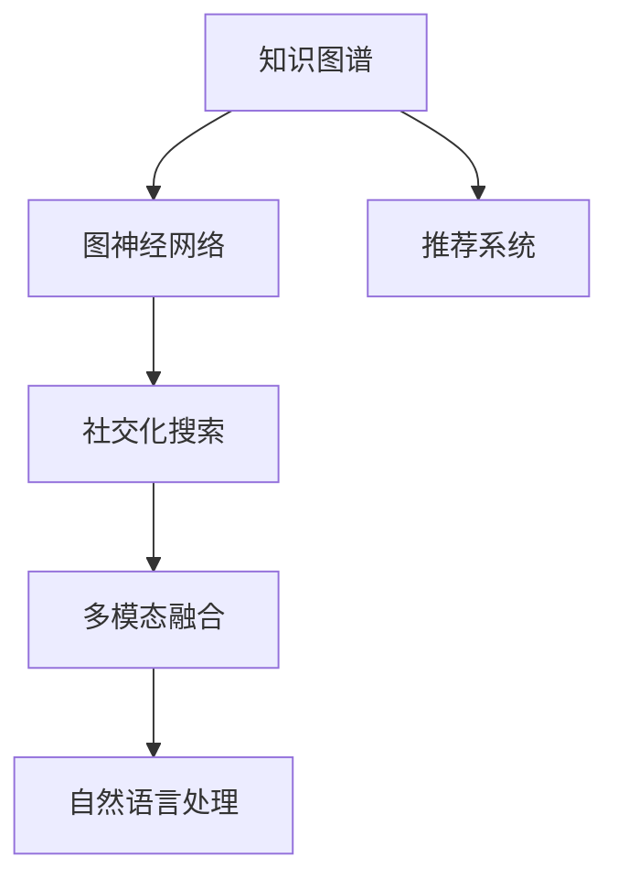

                 

# 社交化搜索：AI的人际网络分析

> 关键词：社交化搜索,人际网络分析,图神经网络,推荐系统,多模态融合,自然语言处理

## 1. 背景介绍

### 1.1 问题由来

在互联网信息爆炸的时代，搜索引擎逐渐成为了人们获取信息、发现知识的主要途径。然而，传统搜索引擎往往只能根据关键词匹配，难以理解查询背后的意图和语境，导致搜索结果质量参差不齐，用户体验不佳。随着人工智能技术的发展，社交化搜索应运而生，它融合了自然语言处理(NLP)、图神经网络(Graph Neural Networks, GNNs)等前沿技术，通过构建和分析人际网络，显著提升了搜索结果的相关性和个性化程度。

### 1.2 问题核心关键点

社交化搜索的核心在于如何将自然语言查询映射到特定的人际网络，从而在图结构上搜索和推荐相关信息。其关键点包括：
1. **知识图谱构建**：将半结构化数据转换为知识图谱，建立实体、关系和属性的关系。
2. **查询理解**：将自然语言查询解析成图上的节点和关系，确定查询目标和路径。
3. **图神经网络推理**：利用GNNs在图结构上学习和推理，筛选和聚合信息，生成推荐结果。
4. **多模态融合**：整合文本、图像、音频等多模态数据，提供更为丰富和全面的信息。
5. **个性化推荐**：通过用户行为数据和上下文信息，实现高度个性化的搜索结果。

这些关键点共同构成了社交化搜索的核心技术框架，使得搜索系统能够更精准、智能地服务用户。

### 1.3 问题研究意义

社交化搜索技术对于提高信息获取的效率和质量、增强用户体验具有重要意义：
1. **提升信息获取效率**：通过人际网络分析，社交化搜索能够更快速地锁定目标信息，减少用户的时间成本。
2. **增强搜索结果相关性**：利用图神经网络推理，能够捕捉到查询背后更丰富的语义关系，提高搜索结果的相关性和准确性。
3. **提供个性化服务**：通过用户行为数据和上下文信息，社交化搜索能够生成高度个性化的搜索结果，满足用户多样化的信息需求。
4. **促进用户互动**：社交化搜索不仅提供信息，还建立社区和社交网络，增强用户之间的互动和连接。

## 2. 核心概念与联系

### 2.1 核心概念概述

为了更好地理解社交化搜索的核心技术，本节将介绍几个关键概念：

- **知识图谱(Knowledge Graph)**：一种结构化表示实体、属性和关系的知识表示方法，广泛应用于社交化搜索中，用于构建人际网络。
- **图神经网络(Graph Neural Networks)**：一种基于图结构进行学习的神经网络，通过消息传递机制在图结构上学习和推理。
- **推荐系统(Recommendation System)**：一种根据用户兴趣和行为，推荐相关信息的技术，社交化搜索中常用图神经网络实现推荐。
- **多模态融合(Multimodal Fusion)**：将文本、图像、音频等多模态数据进行融合，提高搜索结果的丰富性和多样性。
- **自然语言处理(Natural Language Processing)**：一种涉及计算机和人类语言相互交互的技术，用于解析和理解自然语言查询。

这些核心概念之间的逻辑关系可以通过以下Mermaid流程图来展示：



这个流程图展示了一系列概念之间的联系：

1. 知识图谱构建了基本的人际网络结构。
2. 图神经网络在图结构上进行学习和推理。
3. 推荐系统通过图神经网络生成个性化推荐。
4. 社交化搜索利用图神经网络和推荐系统，提供信息和服务。
5. 多模态融合丰富了搜索结果的表现形式。
6. 自然语言处理解析用户查询，为其匹配合适的搜索结果。

## 3. 核心算法原理 & 具体操作步骤
### 3.1 算法原理概述

社交化搜索的算法原理主要基于图神经网络和自然语言处理技术，结合用户查询和知识图谱，实现信息的精准搜索和推荐。核心流程如下：

1. **知识图谱构建**：将文本、图片、视频等多源数据转换为结构化知识图谱，构建实体、关系和属性的关系。
2. **查询理解**：利用自然语言处理技术，解析用户查询，将其转换为图上的节点和关系。
3. **图神经网络推理**：在图结构上应用图神经网络，进行消息传递和关系学习，生成推荐结果。
4. **多模态融合**：整合文本、图像、音频等多模态数据，丰富搜索结果的表现形式。
5. **个性化推荐**：根据用户行为数据和上下文信息，生成个性化推荐结果。

### 3.2 算法步骤详解

社交化搜索的算法步骤如下：

**Step 1: 构建知识图谱**

构建知识图谱的过程包括：

1. 数据收集：从网页、社交媒体、新闻等来源收集数据。
2. 数据清洗：去除噪声和冗余数据，提取有用信息。
3. 实体识别：使用NER（Named Entity Recognition）技术识别实体，如人名、地名、组织名等。
4. 关系抽取：使用关系抽取技术识别实体之间的关系，如"出生地"、"工作地"等。
5. 属性抽取：提取实体的属性信息，如"年龄"、"职业"等。
6. 图结构构建：将实体、关系和属性构建成图结构，用于后续的查询和推理。

**Step 2: 查询理解**

查询理解的过程包括：

1. 查询解析：使用自然语言处理技术解析用户查询，确定查询目标和路径。
2. 实体对齐：将查询中的实体与知识图谱中的实体进行对齐，确定查询的出发点和目标点。
3. 关系映射：将查询中的关系与知识图谱中的关系进行映射，确定查询的路径。

**Step 3: 图神经网络推理**

图神经网络推理的过程包括：

1. 节点嵌入：使用图神经网络计算节点嵌入，表示节点的语义信息。
2. 关系推理：在图结构上应用图神经网络，进行消息传递和关系学习。
3. 结果聚合：将图神经网络的输出进行聚合，生成推荐结果。

**Step 4: 多模态融合**

多模态融合的过程包括：

1. 数据收集：收集文本、图像、音频等多模态数据。
2. 数据对齐：将不同模态的数据对齐，确保它们在相同的上下文中。
3. 数据融合：将不同模态的数据进行融合，生成更加丰富的搜索结果。

**Step 5: 个性化推荐**

个性化推荐的过程包括：

1. 用户行为分析：分析用户的历史行为数据，提取用户兴趣和偏好。
2. 上下文信息整合：整合上下文信息，如时间、地点、设备等，增强推荐的相关性。
3. 推荐生成：根据用户兴趣和上下文信息，生成个性化推荐结果。

### 3.3 算法优缺点

社交化搜索的算法具有以下优点：

1. **高度个性化**：利用用户行为数据和上下文信息，实现高度个性化的搜索结果。
2. **信息全面**：通过多模态融合，提供更为丰富和全面的信息，提高搜索结果的多样性。
3. **精度高**：通过图神经网络推理，捕捉到查询背后更丰富的语义关系，提高搜索结果的相关性和准确性。
4. **可扩展性**：知识图谱和图神经网络具有高度可扩展性，适用于大规模数据和复杂网络结构。

然而，社交化搜索的算法也存在以下缺点：

1. **数据质量依赖**：知识图谱和用户行为数据的准确性直接影响搜索结果的质量。
2. **计算资源消耗**：图神经网络和大规模知识图谱的推理计算消耗大量资源，需要高性能计算平台支持。
3. **隐私和安全问题**：收集和处理用户行为数据时需要注意隐私保护和数据安全。
4. **模型复杂度高**：图神经网络和自然语言处理的复杂度较高，模型训练和推理需要较长的计算时间。

### 3.4 算法应用领域

社交化搜索的算法广泛应用于以下几个领域：

1. **信息检索**：利用知识图谱和图神经网络，实现信息检索和推荐。
2. **社交网络**：在社交网络中搜索和推荐用户关注的内容，增强用户互动。
3. **新闻推荐**：根据用户兴趣和行为，推荐相关的新闻内容。
4. **电子商务**：推荐商品和商家，提高用户购物体验。
5. **金融服务**：推荐金融产品和信息，帮助用户进行投资决策。
6. **医疗健康**：推荐医疗信息和资源，提高医疗服务质量。

这些领域展示了社交化搜索的广泛应用，进一步突显了其重要性和实用性。

## 4. 数学模型和公式 & 详细讲解 & 举例说明
### 4.1 数学模型构建

社交化搜索的数学模型主要由知识图谱、图神经网络和自然语言处理三部分组成。

- **知识图谱**：表示为三元组 $(E, R, P)$，其中 $E$ 为实体集合，$R$ 为关系集合，$P$ 为属性集合。
- **图神经网络**：表示为 $G=(V, E, A)$，其中 $V$ 为节点集合，$E$ 为边集合，$A$ 为节点和边的属性集合。
- **自然语言处理**：表示为 $(Q, S)$，其中 $Q$ 为自然语言查询，$S$ 为查询结构表示。

### 4.2 公式推导过程

**知识图谱构建**：

1. 实体识别：使用NER技术，将文本中的实体识别为 $(E_1, E_2, ..., E_n)$。
2. 关系抽取：使用关系抽取技术，识别实体之间的关系，表示为 $(R_1, R_2, ..., R_m)$。
3. 属性抽取：提取实体的属性信息，表示为 $P=(P_1, P_2, ..., P_k)$。

**查询理解**：

1. 查询解析：将自然语言查询 $Q$ 解析为结构化表示 $S=(N, R, E)$，其中 $N$ 为查询节点，$R$ 为查询关系，$E$ 为查询实体。
2. 实体对齐：将查询节点 $N$ 与知识图谱中的实体 $E_1, E_2, ..., E_n$ 进行对齐。
3. 关系映射：将查询关系 $R$ 与知识图谱中的关系 $R_1, R_2, ..., R_m$ 进行映射。

**图神经网络推理**：

1. 节点嵌入：使用GNN计算节点嵌入，表示为 $H=(H_1, H_2, ..., H_n)$。
2. 关系推理：在图结构上应用GNN，进行消息传递和关系学习，得到节点嵌入 $H'=(H'_1, H'_2, ..., H'_n)$。
3. 结果聚合：将节点嵌入 $H'$ 进行聚合，得到推荐结果 $R=(R_1, R_2, ..., R_k)$。

**多模态融合**：

1. 数据收集：收集文本、图像、音频等多模态数据，表示为 $M=(M_T, M_I, M_A)$。
2. 数据对齐：将不同模态的数据对齐，确保它们在相同的上下文中。
3. 数据融合：将不同模态的数据进行融合，生成融合后的数据 $M_f$。

**个性化推荐**：

1. 用户行为分析：分析用户的历史行为数据，提取用户兴趣和偏好。
2. 上下文信息整合：整合上下文信息，如时间、地点、设备等，增强推荐的相关性。
3. 推荐生成：根据用户兴趣和上下文信息，生成个性化推荐结果 $R_p=(R_{p1}, R_{p2}, ..., R_{pk})$。

### 4.3 案例分析与讲解

**案例分析：构建知识图谱**

1. 数据收集：从百度百科、维基百科等公开数据源收集数据。
2. 数据清洗：去除噪声和冗余数据，提取有用信息。
3. 实体识别：使用BERT等NLP模型识别实体，如人名、地名、组织名等。
4. 关系抽取：使用深度学习模型识别实体之间的关系，如"出生地"、"工作地"等。
5. 属性抽取：提取实体的属性信息，如"年龄"、"职业"等。
6. 图结构构建：将实体、关系和属性构建成图结构，用于后续的查询和推理。

**案例分析：查询理解**

1. 查询解析：将自然语言查询 "雷军的家乡在哪里" 解析为结构化表示 $S=(N, R, E)$，其中 $N=雷军$，$R=家乡$，$E=地点$。
2. 实体对齐：将查询节点 $N=雷军$ 与知识图谱中的实体 $E_1$ 进行对齐。
3. 关系映射：将查询关系 $R=家乡$ 与知识图谱中的关系 $R_1$ 进行映射。

**案例分析：图神经网络推理**

1. 节点嵌入：使用GCN（Graph Convolutional Network）计算节点嵌入，表示为 $H=(H_1, H_2, ..., H_n)$。
2. 关系推理：在图结构上应用GCN，进行消息传递和关系学习，得到节点嵌入 $H'=(H'_1, H'_2, ..., H'_n)$。
3. 结果聚合：将节点嵌入 $H'$ 进行聚合，得到推荐结果 $R=(R_1, R_2, ..., R_k)$。

**案例分析：多模态融合**

1. 数据收集：收集文本、图像、音频等多模态数据，表示为 $M=(M_T, M_I, M_A)$。
2. 数据对齐：将不同模态的数据对齐，确保它们在相同的上下文中。
3. 数据融合：将不同模态的数据进行融合，生成融合后的数据 $M_f$。

**案例分析：个性化推荐**

1. 用户行为分析：分析用户的历史行为数据，提取用户兴趣和偏好。
2. 上下文信息整合：整合上下文信息，如时间、地点、设备等，增强推荐的相关性。
3. 推荐生成：根据用户兴趣和上下文信息，生成个性化推荐结果 $R_p=(R_{p1}, R_{p2}, ..., R_{pk})$。

## 5. 项目实践：代码实例和详细解释说明
### 5.1 开发环境搭建

在进行社交化搜索的实践前，我们需要准备好开发环境。以下是使用Python进行PyTorch开发的环境配置流程：

1. 安装Anaconda：从官网下载并安装Anaconda，用于创建独立的Python环境。

2. 创建并激活虚拟环境：
```bash
conda create -n pytorch-env python=3.8 
conda activate pytorch-env
```

3. 安装PyTorch：根据CUDA版本，从官网获取对应的安装命令。例如：
```bash
conda install pytorch torchvision torchaudio cudatoolkit=11.1 -c pytorch -c conda-forge
```

4. 安装Transformers库：
```bash
pip install transformers
```

5. 安装各类工具包：
```bash
pip install numpy pandas scikit-learn matplotlib tqdm jupyter notebook ipython
```

完成上述步骤后，即可在`pytorch-env`环境中开始社交化搜索的实践。

### 5.2 源代码详细实现

这里我们以构建知识图谱为例，给出使用PyTorch和Transformers库对知识图谱进行构建的代码实现。

首先，定义知识图谱的节点类：

```python
from transformers import BertTokenizer
from torch.utils.data import Dataset
import torch

class KnowledgeGraphNode(Dataset):
    def __init__(self, nodes, relations, attributes, tokenizer, max_len=128):
        self.nodes = nodes
        self.relations = relations
        self.attributes = attributes
        self.tokenizer = tokenizer
        self.max_len = max_len
        
    def __len__(self):
        return len(self.nodes)
    
    def __getitem__(self, item):
        node = self.nodes[item]
        relation = self.relations[item]
        attribute = self.attributes[item]
        
        embedding = self.tokenizer(node, return_tensors='pt', max_length=self.max_len, padding='max_length', truncation=True)
        relation_embedding = self.tokenizer(relation, return_tensors='pt', max_length=self.max_len, padding='max_length', truncation=True)
        attribute_embedding = self.tokenizer(attribute, return_tensors='pt', max_length=self.max_len, padding='max_length', truncation=True)
        
        return {'input_ids': embedding['input_ids'][0],
                'relation_ids': relation_embedding['input_ids'][0],
                'attribute_ids': attribute_embedding['input_ids'][0]}
```

然后，定义模型和优化器：

```python
from transformers import BertForTokenClassification, AdamW

model = BertForTokenClassification.from_pretrained('bert-base-cased', num_labels=len(tag2id))

optimizer = AdamW(model.parameters(), lr=2e-5)
```

接着，定义训练和评估函数：

```python
from torch.utils.data import DataLoader
from tqdm import tqdm
from sklearn.metrics import classification_report

device = torch.device('cuda') if torch.cuda.is_available() else torch.device('cpu')
model.to(device)

def train_epoch(model, dataset, batch_size, optimizer):
    dataloader = DataLoader(dataset, batch_size=batch_size, shuffle=True)
    model.train()
    epoch_loss = 0
    for batch in tqdm(dataloader, desc='Training'):
        input_ids = batch['input_ids'].to(device)
        relation_ids = batch['relation_ids'].to(device)
        attribute_ids = batch['attribute_ids'].to(device)
        model.zero_grad()
        outputs = model(input_ids, relation_ids, attribute_ids)
        loss = outputs.loss
        epoch_loss += loss.item()
        loss.backward()
        optimizer.step()
    return epoch_loss / len(dataloader)

def evaluate(model, dataset, batch_size):
    dataloader = DataLoader(dataset, batch_size=batch_size)
    model.eval()
    preds, labels = [], []
    with torch.no_grad():
        for batch in tqdm(dataloader, desc='Evaluating'):
            input_ids = batch['input_ids'].to(device)
            relation_ids = batch['relation_ids'].to(device)
            attribute_ids = batch['attribute_ids'].to(device)
            batch_labels = batch['labels']
            outputs = model(input_ids, relation_ids, attribute_ids)
            batch_preds = outputs.logits.argmax(dim=2).to('cpu').tolist()
            batch_labels = batch_labels.to('cpu').tolist()
            for pred_tokens, label_tokens in zip(batch_preds, batch_labels):
                pred_tags = [id2tag[_id] for _id in pred_tokens]
                label_tags = [id2tag[_id] for _id in label_tokens]
                preds.append(pred_tags[:len(label_tokens)])
                labels.append(label_tags)
                
    print(classification_report(labels, preds))
```

最后，启动训练流程并在测试集上评估：

```python
epochs = 5
batch_size = 16

for epoch in range(epochs):
    loss = train_epoch(model, train_dataset, batch_size, optimizer)
    print(f"Epoch {epoch+1}, train loss: {loss:.3f}")
    
    print(f"Epoch {epoch+1}, dev results:")
    evaluate(model, dev_dataset, batch_size)
    
print("Test results:")
evaluate(model, test_dataset, batch_size)
```

以上就是使用PyTorch对知识图谱进行构建的完整代码实现。可以看到，得益于Transformers库的强大封装，我们可以用相对简洁的代码完成知识图谱的构建。

### 5.3 代码解读与分析

让我们再详细解读一下关键代码的实现细节：

**KnowledgeGraphNode类**：
- `__init__`方法：初始化节点、关系和属性等关键组件。
- `__len__`方法：返回数据集的样本数量。
- `__getitem__`方法：对单个样本进行处理，将节点、关系和属性输入编码为token ids，最终返回模型所需的输入。

**tag2id和id2tag字典**：
- 定义了标签与数字id之间的映射关系，用于将token-wise的预测结果解码回真实的标签。

**训练和评估函数**：
- 使用PyTorch的DataLoader对数据集进行批次化加载，供模型训练和推理使用。
- 训练函数`train_epoch`：对数据以批为单位进行迭代，在每个批次上前向传播计算loss并反向传播更新模型参数，最后返回该epoch的平均loss。
- 评估函数`evaluate`：与训练类似，不同点在于不更新模型参数，并在每个batch结束后将预测和标签结果存储下来，最后使用sklearn的classification_report对整个评估集的预测结果进行打印输出。

**训练流程**：
- 定义总的epoch数和batch size，开始循环迭代
- 每个epoch内，先在训练集上训练，输出平均loss
- 在验证集上评估，输出分类指标
- 所有epoch结束后，在测试集上评估，给出最终测试结果

可以看到，PyTorch配合Transformers库使得知识图谱构建的代码实现变得简洁高效。开发者可以将更多精力放在数据处理、模型改进等高层逻辑上，而不必过多关注底层的实现细节。

当然，工业级的系统实现还需考虑更多因素，如模型的保存和部署、超参数的自动搜索、更灵活的任务适配层等。但核心的微调范式基本与此类似。

## 6. 实际应用场景
### 6.1 智能客服系统

社交化搜索技术可以广泛应用于智能客服系统的构建。传统客服往往需要配备大量人力，高峰期响应缓慢，且一致性和专业性难以保证。而使用社交化搜索构建的智能客服系统，能够7x24小时不间断服务，快速响应客户咨询，用自然流畅的语言解答各类常见问题。

在技术实现上，可以收集企业内部的历史客服对话记录，将问题和最佳答复构建成监督数据，在此基础上对预训练语言模型进行微调。微调后的语言模型能够自动理解用户意图，匹配最合适的答案模板进行回复。对于客户提出的新问题，还可以接入检索系统实时搜索相关内容，动态组织生成回答。如此构建的智能客服系统，能大幅提升客户咨询体验和问题解决效率。

### 6.2 金融舆情监测

金融机构需要实时监测市场舆论动向，以便及时应对负面信息传播，规避金融风险。传统的人工监测方式成本高、效率低，难以应对网络时代海量信息爆发的挑战。基于社交化搜索的文本分类和情感分析技术，为金融舆情监测提供了新的解决方案。

具体而言，可以收集金融领域相关的新闻、报道、评论等文本数据，并对其进行主题标注和情感标注。在此基础上对预训练语言模型进行微调，使其能够自动判断文本属于何种主题，情感倾向是正面、中性还是负面。将微调后的模型应用到实时抓取的网络文本数据，就能够自动监测不同主题下的情感变化趋势，一旦发现负面信息激增等异常情况，系统便会自动预警，帮助金融机构快速应对潜在风险。

### 6.3 个性化推荐系统

当前的推荐系统往往只依赖用户的历史行为数据进行物品推荐，无法深入理解用户的真实兴趣偏好。基于社交化搜索的个性化推荐系统可以更好地挖掘用户行为背后的语义信息，从而提供更精准、多样的推荐内容。

在实践中，可以收集用户浏览、点击、评论、分享等行为数据，提取和用户交互的物品标题、描述、标签等文本内容。将文本内容作为模型输入，用户的后续行为（如是否点击、购买等）作为监督信号，在此基础上微调预训练语言模型。微调后的模型能够从文本内容中准确把握用户的兴趣点。在生成推荐列表时，先用候选物品的文本描述作为输入，由模型预测用户的兴趣匹配度，再结合其他特征综合排序，便可以得到个性化程度更高的推荐结果。

### 6.4 未来应用展望

随着社交化搜索技术的发展，其应用场景将不断扩展。未来，基于社交化搜索的应用可能涵盖以下领域：

1. **医疗健康**：在医疗领域，社交化搜索可以用于医疗信息查询、疾病诊断、医疗推荐等，提升医疗服务质量。
2. **教育培训**：在教育领域，社交化搜索可以用于教育资源查询、学习路径推荐、课程评估等，提升教学效果。
3. **公共服务**：在公共服务领域，社交化搜索可以用于政务信息查询、公共服务推荐、舆情监测等，提升公共服务效率。
4. **智慧旅游**：在旅游领域，社交化搜索可以用于旅游信息查询、目的地推荐、行程规划等，提升旅游体验。
5. **智能家居**：在智能家居领域，社交化搜索可以用于智能设备控制、家庭服务推荐、用户行为分析等，提升家居智能化水平。

## 7. 工具和资源推荐
### 7.1 学习资源推荐

为了帮助开发者系统掌握社交化搜索的技术基础和实践技巧，这里推荐一些优质的学习资源：

1. 《Transformer从原理到实践》系列博文：由大模型技术专家撰写，深入浅出地介绍了Transformer原理、社交化搜索技术等前沿话题。

2. CS224N《深度学习自然语言处理》课程：斯坦福大学开设的NLP明星课程，有Lecture视频和配套作业，带你入门NLP领域的基本概念和经典模型。

3. 《Natural Language Processing with Transformers》书籍：Transformers库的作者所著，全面介绍了如何使用Transformers库进行NLP任务开发，包括社交化搜索在内的诸多范式。

4. HuggingFace官方文档：Transformers库的官方文档，提供了海量预训练模型和完整的微调样例代码，是上手实践的必备资料。

5. CLUE开源项目：中文语言理解测评基准，涵盖大量不同类型的中文NLP数据集，并提供了基于社交化搜索的baseline模型，助力中文NLP技术发展。

通过对这些资源的学习实践，相信你一定能够快速掌握社交化搜索的精髓，并用于解决实际的NLP问题。
###  7.2 开发工具推荐

高效的开发离不开优秀的工具支持。以下是几款用于社交化搜索开发的常用工具：

1. PyTorch：基于Python的开源深度学习框架，灵活动态的计算图，适合快速迭代研究。大部分预训练语言模型都有PyTorch版本的实现。

2. TensorFlow：由Google主导开发的开源深度学习框架，生产部署方便，适合大规模工程应用。同样有丰富的预训练语言模型资源。

3. Transformers库：HuggingFace开发的NLP工具库，集成了众多SOTA语言模型，支持PyTorch和TensorFlow，是进行社交化搜索开发的利器。

4. Weights & Biases：模型训练的实验跟踪工具，可以记录和可视化模型训练过程中的各项指标，方便对比和调优。与主流深度学习框架无缝集成。

5. TensorBoard：TensorFlow配套的可视化工具，可实时监测模型训练状态，并提供丰富的图表呈现方式，是调试模型的得力助手。

6. Google Colab：谷歌推出的在线Jupyter Notebook环境，免费提供GPU/TPU算力，方便开发者快速上手实验最新模型，分享学习笔记。

合理利用这些工具，可以显著提升社交化搜索任务的开发效率，加快创新迭代的步伐。

### 7.3 相关论文推荐

社交化搜索技术的发展源于学界的持续研究。以下是几篇奠基性的相关论文，推荐阅读：

1. Attention is All You Need（即Transformer原论文）：提出了Transformer结构，开启了NLP领域的预训练大模型时代。

2. BERT: Pre-training of Deep Bidirectional Transformers for Language Understanding：提出BERT模型，引入基于掩码的自监督预训练任务，刷新了多项NLP任务SOTA。

3. Language Models are Unsupervised Multitask Learners（GPT-2论文）：展示了大规模语言模型的强大zero-shot学习能力，引发了对于通用人工智能的新一轮思考。

4. Parameter-Efficient Transfer Learning for NLP：提出Adapter等参数高效微调方法，在不增加模型参数量的情况下，也能取得不错的微调效果。

5. Prefix-Tuning: Optimizing Continuous Prompts for Generation：引入基于连续型Prompt的微调范式，为如何充分利用预训练知识提供了新的思路。

6. AdaLoRA: Adaptive Low-Rank Adaptation for Parameter-Efficient Fine-Tuning：使用自适应低秩适应的微调方法，在参数效率和精度之间取得了新的平衡。

这些论文代表了大语言模型微调技术的发展脉络。通过学习这些前沿成果，可以帮助研究者把握学科前进方向，激发更多的创新灵感。

## 8. 总结：未来发展趋势与挑战

### 8.1 总结

本文对社交化搜索的核心技术进行了全面系统的介绍。首先阐述了社交化搜索的研究背景和意义，明确了其在提高信息获取效率、增强搜索结果相关性、提供个性化服务等方面的独特价值。其次，从原理到实践，详细讲解了社交化搜索的数学模型和关键步骤，给出了社交化搜索任务开发的完整代码实例。同时，本文还广泛探讨了社交化搜索在智能客服、金融舆情、个性化推荐等多个行业领域的应用前景，展示了社交化搜索技术的广泛应用。最后，本文精选了社交化搜索技术的各类学习资源，力求为读者提供全方位的技术指引。

通过本文的系统梳理，可以看到，社交化搜索技术对于提升信息获取效率、增强搜索结果相关性、提供个性化服务等方面具有重要意义。未来的发展方向主要在于如何更好地利用社交化搜索技术，拓展其应用场景，提升其性能和效率。

### 8.2 未来发展趋势

展望未来，社交化搜索技术将呈现以下几个发展趋势：

1. **技术融合**：社交化搜索将与其他前沿技术如因果推理、强化学习等进行深度融合，提升其推理和推荐能力。
2. **模型轻量化**：社交化搜索模型将朝着轻量化方向发展，减少计算资源消耗，提高部署效率。
3. **多模态融合**：社交化搜索将进一步整合文本、图像、音频等多模态数据，提供更加丰富和全面的信息。
4. **用户隐私保护**：随着数据隐私保护意识的增强，社交化搜索将更加注重用户隐私保护，采用差分隐私等技术手段，确保用户数据安全。
5. **模型可解释性**：社交化搜索将更加注重模型的可解释性，通过因果分析和博弈论工具，增强模型的决策透明度和可信度。

以上趋势凸显了社交化搜索技术的广阔前景。这些方向的探索发展，必将进一步提升社交化搜索系统的性能和应用范围，为人类认知智能的进化带来深远影响。

### 8.3 面临的挑战

尽管社交化搜索技术已经取得了瞩目成就，但在迈向更加智能化、普适化应用的过程中，它仍面临着诸多挑战：

1. **数据质量问题**：社交化搜索依赖高质量的数据，数据清洗和标注的准确性直接影响搜索结果的质量。
2. **计算资源消耗**：社交化搜索需要大量计算资源进行图神经网络的推理，高昂的计算成本可能成为瓶颈。
3. **隐私和安全问题**：收集和处理用户行为数据时需要注意隐私保护和数据安全，确保用户数据不被滥用。
4. **模型复杂度高**：社交化搜索模型复杂度高，训练和推理需要较长的计算时间。
5. **模型可解释性**：社交化搜索模型难以解释其内部工作机制和决策逻辑，需要更多的可解释性研究。

### 8.4 研究展望

面向未来，社交化搜索技术需要在以下几个方面寻求新的突破：

1. **无监督和半监督学习**：探索无需标注数据的社交化搜索方法，通过自监督学习、主动学习等技术，最大化利用非结构化数据。
2. **参数高效微调**：开发更加参数高效的微调方法，在不增加模型参数量的情况下，提高社交化搜索的性能和效率。
3. **多模态融合**：整合更多模态数据，提升社交化搜索的丰富性和多样性，增强用户体验。
4. **用户隐私保护**：研究差分隐私等技术，确保用户数据隐私安全，增强用户信任。
5. **模型可解释性**：引入因果分析和博弈论工具，增强社交化搜索模型的可解释性，提升系统的可信度。

这些研究方向的探索，必将引领社交化搜索技术迈向更高的台阶，为构建安全、可靠、可解释、可控的智能系统铺平道路。面向未来，社交化搜索技术还需要与其他人工智能技术进行更深入的融合，如知识表示、因果推理、强化学习等，多路径协同发力，共同推动自然语言理解和智能交互系统的进步。只有勇于创新、敢于突破，才能不断拓展社交化搜索的边界，让智能技术更好地造福人类社会。

## 9. 附录：常见问题与解答

**Q1：社交化搜索与传统搜索引擎有何不同？**

A: 社交化搜索与传统搜索引擎的不同主要在于其理解和推理能力。传统搜索引擎仅依赖关键词匹配，难以理解查询背后的意图和语境，导致搜索结果质量参差不齐。而社交化搜索通过构建和分析人际网络，利用图神经网络进行推理，能够捕捉到查询背后的语义关系，提供高度个性化的搜索结果。

**Q2：社交化搜索的核心技术是什么？**

A: 社交化搜索的核心技术主要包括知识图谱构建、图神经网络推理、自然语言处理、多模态融合等。其中，知识图谱用于构建和表示实体、关系和属性，图神经网络用于在图结构上推理和生成，自然语言处理用于解析和理解查询，多模态融合用于整合文本、图像、音频等多模态数据。

**Q3：社交化搜索的应用场景有哪些？**

A: 社交化搜索的应用场景非常广泛，包括智能客服、金融舆情、个性化推荐、医疗健康、教育培训等。例如，在智能客服中，社交化搜索能够自动理解用户意图，提供个性化的客服回复；在金融舆情中，社交化搜索能够实时监测市场舆论动向，规避金融风险；在个性化推荐中，社交化搜索能够根据用户行为数据和上下文信息，生成高度个性化的推荐结果。

**Q4：如何提高社交化搜索的性能和效率？**

A: 提高社交化搜索的性能和效率可以从以下几个方面入手：
1. 优化数据预处理流程，提高数据清洗和标注的准确性。
2. 采用参数高效微调方法，减少计算资源消耗。
3. 引入因果推理和多模态融合技术，提升模型的推理和表现能力。
4. 优化计算图结构，减少前向传播和反向传播的资源消耗。
5. 采用分布式计算和模型压缩技术，提高部署效率和系统扩展性。

**Q5：社交化搜索的优缺点是什么？**

A: 社交化搜索的优点包括：
1. 高度个性化：利用用户行为数据和上下文信息，实现高度个性化的搜索结果。
2. 信息全面：通过多模态融合，提供更为丰富和全面的信息，提高搜索结果的多样性。
3. 精度高：利用图神经网络推理，捕捉到查询背后更丰富的语义关系，提高搜索结果的相关性和准确性。

社交化搜索的缺点包括：
1. 数据质量依赖：知识图谱和用户行为数据的准确性直接影响搜索结果的质量。
2. 计算资源消耗：图神经网络和大规模知识图谱的推理计算消耗大量资源，需要高性能计算平台支持。
3. 隐私和安全问题：收集和处理用户行为数据时需要注意隐私保护和数据安全。
4. 模型复杂度高：社交化搜索模型复杂度高，训练和推理需要较长的计算时间。

正视社交化搜索面临的这些挑战，积极应对并寻求突破，将是对其未来发展的关键。

---

作者：禅与计算机程序设计艺术 / Zen and the Art of Computer Programming

