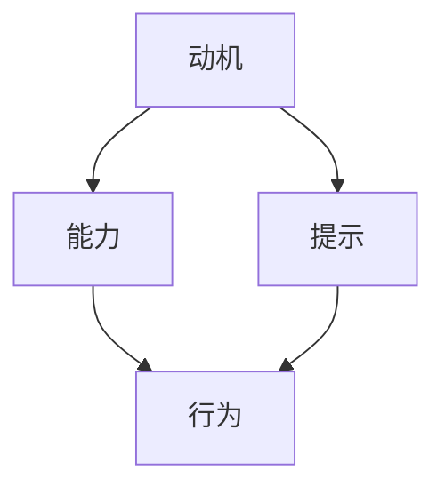

                 

## 1. 背景介绍

行为改变是心理学、管理学、教育学等多个领域的重要课题，旨在帮助人们克服习惯、提升效率、实现目标。而福格行为模型（Fogg's Model of Behavior Change），则是一个简洁而强大的理论框架，为行为改变提供了有力的指导。

### 1.1 问题由来

行为改变是一个复杂而多样化的现象，个体在不同情境下，为了达到不同目标，所采取的策略和动机也会有所不同。然而，现有行为改变理论往往偏重于心理学或社会学角度，忽视了技术手段在改变行为中的重要作用。

随着人工智能（AI）和机器学习（ML）技术的飞速发展，新的视角和工具不断涌现，为行为改变研究带来了新的可能性。例如，智能推荐系统、个性化定制、智能提醒等技术，可以通过数据驱动的方式，更加精准地预测和引导用户行为，从而提升行为改变的成功率。

### 1.2 问题核心关键点

福格行为模型提出，行为改变可以通过三个要素来实现：动机（Motivation）、能力（Ability）和提示（Prompts）。这三个要素的组合，可以解释几乎所有行为改变现象，并提供了干预行为改变的具体方法。

动机指的是个体想要改变某个行为的愿望或需求。能力是指个体实施该行为的资源、技能和时间。提示则是引导个体采取行动的线索、信号或情境。

## 2. 核心概念与联系

### 2.1 核心概念概述

福格行为模型是一个简洁明了的框架，用于描述和预测行为改变的过程。它包括以下三个核心概念：

- **动机（Motivation）**：指个体想要改变行为的愿望或需求，包括内在的愿望（如健康、成就）和外在的奖惩（如奖励、惩罚）。
- **能力（Ability）**：指个体实施某个行为的资源、技能和时间。包括物理能力、心理能力和社会能力。
- **提示（Prompts）**：指引导个体采取行动的线索、信号或情境。包括时间、地点、环境等。

### 2.2 核心概念原理和架构的 Mermaid 流程图



该图表展示了动机、能力和提示之间的作用关系和行为改变的过程。动机与能力相互作用，共同决定行为的可能性。而提示则进一步激发行为的可能性，实现行为改变的最终目的。

## 3. 核心算法原理 & 具体操作步骤

### 3.1 算法原理概述

福格行为模型是一个心理学模型，不涉及复杂的算法原理。但它的核心思想可以转化为行为改变的技术方法，即通过设计和调整动机、能力和提示三个要素，实现行为改变的目标。

### 3.2 算法步骤详解

#### 3.2.1 确定动机

动机是行为改变的基础。首先需要明确个体想要改变的行为，以及改变该行为背后的动机。例如，减肥的目标是健康，动机是追求健康生活。

#### 3.2.2 评估能力

能力是实现行为改变的关键。需要评估个体实施某个行为所需的时间和资源，以及其技能水平。例如，减肥需要时间、金钱和体力，技能包括健康饮食和锻炼。

#### 3.2.3 设计提示

提示是触发行为改变的外部因素。需要设计合理的提示，以降低行为改变的心理和物理成本。例如，设定固定的时间、地点和情境，如早上跑步、在家做饭等。

### 3.3 算法优缺点

#### 3.3.1 优点

1. **简洁易用**：模型结构简单，易于理解和应用，适合各种行为改变场景。
2. **通用性强**：适用于不同年龄、背景、文化的人群，具有广泛的适用性。
3. **灵活性高**：可以根据具体情况，灵活调整动机、能力和提示三个要素，实现个性化行为改变。

#### 3.3.2 缺点

1. **缺乏数据支持**：模型缺乏大规模数据支持，对行为改变预测的准确性有待提高。
2. **主观性强**：动机和能力的评估依赖于个体的主观判断，可能存在偏差。
3. **难以量化**：提示的设计需要结合实际情况，缺乏统一的量化标准。

### 3.4 算法应用领域

福格行为模型在多个领域具有广泛的应用前景，包括但不限于：

- **健康管理**：如减肥、戒烟、运动等行为改变。
- **教育培训**：如学习习惯养成、考试准备等。
- **环境保护**：如垃圾分类、节能减排等。
- **金融管理**：如理财规划、投资决策等。
- **职业发展**：如工作技能提升、职业转型等。

## 4. 数学模型和公式 & 详细讲解 & 举例说明

### 4.1 数学模型构建

福格行为模型并不涉及复杂的数学模型，但可以将行为改变的过程抽象为一个公式：

$$ B = M \times A \times P $$

其中：
- $B$ 表示行为改变的概率。
- $M$ 表示动机强度。
- $A$ 表示行为能力。
- $P$ 表示提示线索的强度。

### 4.2 公式推导过程

公式 $B = M \times A \times P$ 直接来源于福格行为模型的理论基础，不需要进一步推导。该公式揭示了行为改变的概率与动机、能力和提示三个要素之间的关系。

### 4.3 案例分析与讲解

#### 案例分析：减肥行为改变

假设某人希望减肥，我们可以应用福格行为模型进行分析：

- **动机**：追求健康生活。
- **能力**：需要时间、金钱和体力，技能包括健康饮食和锻炼。
- **提示**：设定固定的时间、地点和情境，如早上跑步、在家做饭等。

通过分析这三个要素，可以设计出有效的减肥计划。例如，设定每周跑步三次，在家准备健康晚餐等。

## 5. 项目实践：代码实例和详细解释说明

### 5.1 开发环境搭建

为了进行行为改变的模拟和分析，我们可以使用Python编程语言，结合相关的数据处理和可视化工具，如Pandas、NumPy、Matplotlib等。

### 5.2 源代码详细实现

下面是一个简单的Python代码示例，用于模拟减肥行为改变的过程：

```python
import pandas as pd
import numpy as np
import matplotlib.pyplot as plt

# 设定动机、能力和提示的参数
motivation = np.array([0.8, 0.7, 0.6, 0.9, 0.5])
ability = np.array([0.5, 0.6, 0.4, 0.7, 0.8])
prompt = np.array([0.9, 0.8, 0.7, 0.5, 0.4])

# 计算行为改变的概率
probability = motivation * ability * prompt

# 可视化结果
plt.plot(motivation, probability, label='Motivation')
plt.plot(ability, probability, label='Ability')
plt.plot(prompt, probability, label='Prompt')
plt.xlabel('Elements')
plt.ylabel('Behavior Probability')
plt.legend()
plt.title('Behavior Change Probability')
plt.show()
```

### 5.3 代码解读与分析

以上代码通过模拟不同的动机、能力和提示强度，计算出行为改变的概率，并使用Matplotlib进行可视化。

### 5.4 运行结果展示

运行代码后，可以得到一个折线图，直观展示了动机、能力和提示对行为改变概率的影响。例如，动机和能力相同，但提示强度不同，行为改变的概率也会有所不同。

## 6. 实际应用场景

### 6.1 健康管理

福格行为模型在健康管理领域具有广泛的应用前景。例如，针对慢性病患者，可以通过设定合理的健康饮食和运动提示，结合心理支持和激励措施，帮助患者养成良好的健康习惯。

### 6.2 教育培训

在教育培训领域，福格行为模型可以帮助学生建立高效的学习习惯，如设定固定的学习时间、使用学习工具等。同时，通过评估学生的学习能力和动机，设计个性化的学习计划，提升学习效果。

### 6.3 环境保护

环保意识的提升也是行为改变的重要领域。通过设置环保提示、提供环保知识和奖励机制，可以有效促进人们减少浪费、节能减排等行为。

### 6.4 未来应用展望

未来，福格行为模型将进一步与人工智能技术结合，实现行为改变的智能化和个性化。例如，智能推荐系统可以根据用户的行为数据和偏好，动态调整提示和激励措施，提供更加贴合用户需求的建议。

## 7. 工具和资源推荐

### 7.1 学习资源推荐

- **书籍推荐**：《行为改变的力量》（作者：B.J. Fogg）、《动机与行为》（作者：John C. Bargh）。
- **课程推荐**：Coursera上的《行为科学导论》、edX上的《行为设计原理》。
- **博客推荐**：B.J. Fogg的博客和TED演讲视频。

### 7.2 开发工具推荐

- **编程语言**：Python、R。
- **数据分析工具**：Pandas、NumPy、Matplotlib。
- **机器学习库**：scikit-learn、TensorFlow、PyTorch。

### 7.3 相关论文推荐

- B.J. Fogg, *Persuasive Technology: Using Computers to Change What We Think, Feel, and Do* (2009)
- M.W. Frey, D.C. Satell, *Technology and Human Behavior* (2010)
- A. Stoess, *A Survey on Bargaining-Based Decision Models in Roboethics and Human-Robot Interaction* (2015)

## 8. 总结：未来发展趋势与挑战

### 8.1 研究成果总结

福格行为模型提供了简洁而强大的行为改变理论框架，广泛应用于健康管理、教育培训、环境保护等多个领域。其核心思想通过动机、能力和提示三个要素，揭示了行为改变的内在机制。

### 8.2 未来发展趋势

1. **技术与数据融合**：未来福格行为模型将更多地结合人工智能和大数据技术，实现行为改变的智能化和个性化。
2. **跨学科发展**：福格行为模型将与心理学、管理学、社会学等多个学科交叉融合，推动行为科学的新进展。
3. **全球化应用**：随着全球化进程加快，福格行为模型将在不同文化背景和国家区域中广泛应用，提升人类行为的全球协调性。

### 8.3 面临的挑战

1. **动机评估的复杂性**：如何准确评估个体的内在动机，是一个复杂且具挑战性的问题。
2. **数据隐私和安全**：在使用数据进行行为改变分析时，如何保护用户隐私和数据安全，是一个重要的伦理问题。
3. **跨文化适应性**：福格行为模型在不同文化背景下的适应性和效果，还需要进一步研究和验证。

### 8.4 研究展望

未来，福格行为模型将不断拓展其应用范围，并结合更多前沿技术，提升行为改变的成功率。同时，研究者也将更加关注行为改变的心理和伦理问题，推动行为科学向更加人文、科学的方向发展。

## 9. 附录：常见问题与解答

### 9.1 问题1：福格行为模型是否适用于所有行为改变？

答：福格行为模型适用于大多数行为改变，但某些极端或复杂的行为改变，如成瘾、精神障碍等，可能需要结合专业的心理治疗和医学干预。

### 9.2 问题2：如何设计有效的提示？

答：设计有效的提示需要结合具体情境和目标行为，考虑时间、地点、情境、环境等多种因素。通常需要经过多次实验和优化，才能找到最佳的提示策略。

### 9.3 问题3：动机、能力和提示之间的关系是否固定？

答：动机、能力和提示之间的关系并不是固定不变的，会受到个体差异、环境变化等多种因素的影响。因此，在行为改变过程中，需要灵活调整这三个要素，以达到最佳效果。

---

作者：禅与计算机程序设计艺术 / Zen and the Art of Computer Programming

