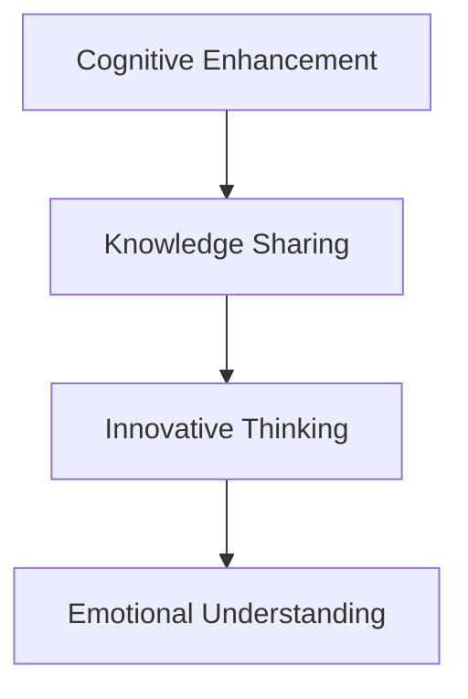

                 

# 科技与人文的交汇：人类计算的独特价值

## 1. 背景介绍

### 1.1 问题由来

人类计算（Human Computation）的概念近年来愈发受到关注，这一领域将人机协同计算与认知科学、心理学等传统学科结合，致力于挖掘人类计算的潜力，探索计算与思考的深度交融。人类计算之所以获得广泛关注，是因为其在智能决策、复杂问题解决、创新思维等方面展现了独特的价值，而科技的迅猛发展也为其实现提供了更多可能。

在传统计算机的强大计算能力之外，人类拥有独特的认知优势，例如逻辑推理、创造力、情感理解等。科技与人类计算的结合，可以大幅提升计算任务的效率与效果。例如，在人工智能领域，机器学习模型虽然在推理与计算方面有出色表现，但在理解和创造方面依然无法与人类匹敌。因此，结合人类的认知优势，成为未来计算科技发展的重要方向。

### 1.2 问题核心关键点

人类计算的核心关键点在于其独特的人机结合方式。这种结合方式主要包括以下几个方面：

- **认知增强**：借助科技手段提升人类认知能力，如记忆增强、逻辑推理支持等。
- **知识共享**：将人类积累的知识、经验和智慧转化为可计算的模型和算法。
- **创新思维**：利用人类复杂的创造性思维，激发新的计算模型和应用场景。
- **情感理解**：结合人类情感智能，优化计算任务的社会适应性和用户体验。

本文将从认知增强、知识共享、创新思维和情感理解四个维度，探讨人类计算的独特价值，并分析其对计算科技未来发展的潜在影响。

## 2. 核心概念与联系

### 2.1 核心概念概述

为更好地理解人类计算的概念及其应用，以下将详细解析几个核心概念：

- **认知增强**：通过科技手段提升人类的认知能力，包括记忆力、逻辑推理、模式识别等。
- **知识共享**：将人类积累的知识和智慧，转化为可计算的模型和算法，实现知识的有效传递和共享。
- **创新思维**：利用人类复杂的创造性思维，生成新的计算模型和应用场景，解决复杂问题。
- **情感理解**：结合人类的情感智能，优化计算任务的社会适应性和用户体验，提升人机交互的自然性和情感共鸣。

### 2.2 核心概念原理和架构的 Mermaid 流程图



以上流程图展示了人类计算中几个核心概念之间的联系：

1. 认知增强是基础，通过科技手段提升人类的认知能力。
2. 知识共享在认知增强的基础上，将人类积累的知识和智慧转化为可计算的模型和算法。
3. 创新思维通过知识共享，结合人类的创造性思维，生成新的计算模型和应用场景。
4. 情感理解进一步优化人机交互，提升计算任务的社会适应性和用户体验。

这些概念共同构成了人类计算的框架，使得科技与人类的认知、知识、创新和情感紧密结合，为解决复杂问题提供了新的路径。

## 3. 核心算法原理 & 具体操作步骤

### 3.1 算法原理概述

人类计算的算法原理主要基于认知心理学、认知神经科学的研究成果，结合计算科技的实际需求，构建人机协同的计算模型。其核心思想是通过科技手段增强人类的认知能力，将人类的智慧和知识转化为可计算的形式，从而实现更高效、更智能的计算。

具体来说，人类计算的算法包括以下几个步骤：

1. **认知增强**：使用科技手段辅助人类的认知能力，如增强记忆、改善逻辑推理等。
2. **知识共享**：将人类积累的知识和智慧，转化为可计算的模型和算法，实现知识的传递和共享。
3. **创新思维**：利用人类复杂的创造性思维，生成新的计算模型和应用场景。
4. **情感理解**：结合人类的情感智能，优化计算任务的社会适应性和用户体验。

### 3.2 算法步骤详解

#### 3.2.1 认知增强

**步骤1：认知评估**
- 使用心理测试、神经科学实验等方法，评估个体的认知能力。
- 收集和分析认知数据，如记忆力、注意力、逻辑推理能力等。

**步骤2：认知增强**
- 基于评估结果，选择合适的科技手段进行认知增强，如使用记忆增强剂、认知训练软件等。
- 通过科技手段辅助认知过程，提升记忆力和逻辑推理能力。

#### 3.2.2 知识共享

**步骤1：知识提取**
- 利用自然语言处理（NLP）技术，从文本中提取人类积累的知识，如科学论文、工程文档等。
- 将提取的知识转化为结构化数据，便于计算机处理和分析。

**步骤2：知识编码**
- 使用符号化方法或机器学习模型，将提取的知识编码为可计算的形式。
- 例如，将科学原理转化为数学模型，将工程经验转化为算法流程。

#### 3.2.3 创新思维

**步骤1：创新启发**
- 结合人类复杂的创造性思维，生成新的计算模型和应用场景。
- 通过头脑风暴、设计思维等方法，激发新的计算创意。

**步骤2：创新实现**
- 将创新思维转化为具体的计算模型和算法。
- 例如，设计新的机器学习算法、生成智能决策模型等。

#### 3.2.4 情感理解

**步骤1：情感识别**
- 利用情感计算技术，识别和分析用户的情感状态。
- 例如，使用面部表情识别、语音情感分析等技术。

**步骤2：情感优化**
- 结合情感智能，优化计算任务的社会适应性和用户体验。
- 例如，调整计算界面的情感设计，提升用户满意度。

### 3.3 算法优缺点

人类计算的算法具有以下优点：

- **人机协同**：结合人类和机器的优势，提高计算任务的效率和效果。
- **灵活性**：能够根据具体任务和情境，灵活调整计算策略和手段。
- **创新性**：利用人类的创造性思维，生成新的计算模型和应用场景。

同时，人类计算的算法也存在一些缺点：

- **依赖个体差异**：个体的认知能力和知识储备不同，对认知增强和知识共享的效果有较大影响。
- **技术门槛高**：需要较高水平的技术手段和专业知识，实现起来较为复杂。
- **情感理解的复杂性**：情感计算技术的准确性和可靠性仍需进一步提升。

### 3.4 算法应用领域

人类计算的算法已经在多个领域展现了其独特价值：

- **教育**：利用认知增强和知识共享技术，提升教育质量和效果。
- **医疗**：结合人类情感智能，优化医疗决策和治疗方案，提升患者体验。
- **金融**：利用创新思维和知识共享，设计新的金融算法和模型，优化投资决策。
- **艺术**：通过创新思维和情感理解，生成新的艺术作品和表现形式，推动艺术创新。
- **游戏**：结合认知增强和情感理解，设计更具有挑战性和情感共鸣的游戏内容。

这些应用领域展示了人类计算的多样性和广泛性，为计算科技带来了新的发展方向和潜力。

## 4. 数学模型和公式 & 详细讲解 & 举例说明

### 4.1 数学模型构建

为了更准确地理解人类计算的算法原理，以下将构建一个简化的数学模型。

假设人类计算任务的目标是将人类知识 $K$ 转化为可计算的算法 $A$，进而生成计算结果 $C$。我们可以将这一过程建模如下：

$$
C = A(K)
$$

其中，$A$ 是一个将知识 $K$ 映射到计算结果 $C$ 的函数。

### 4.2 公式推导过程

接下来，我们推导一个简单的例子，展示如何将人类的逻辑推理过程转化为计算模型。

**案例：求解数学问题**

人类通过以下步骤解决数学问题：

1. 读取题目并理解问题。
2. 提取关键信息并回忆相关知识。
3. 通过逻辑推理得出解决方案。
4. 验证结果并确认正确性。

这个过程可以转化为计算模型，如下所示：

**步骤1：问题理解**
- 读取并理解题目内容。
- 将问题转化为数学表达形式。

**步骤2：知识提取**
- 回忆相关数学知识和规则。
- 将知识编码为计算表达式。

**步骤3：逻辑推理**
- 根据问题特点和已知条件，进行逻辑推理。
- 将推理过程转化为计算操作。

**步骤4：结果验证**
- 对计算结果进行验证，确认正确性。

通过上述步骤，我们可以将人类逻辑推理转化为计算模型，具体如下：

$$
C = f(K, x)
$$

其中 $K$ 表示人类积累的数学知识，$x$ 表示问题的具体信息。$f$ 是一个将知识 $K$ 和问题信息 $x$ 映射到计算结果 $C$ 的函数。

### 4.3 案例分析与讲解

假设我们要解决如下数学问题：

**问题：解方程 $x^2 - 3x + 2 = 0$**

**步骤1：问题理解**
- 读取问题，理解需要解方程的数学问题。

**步骤2：知识提取**
- 回忆二次方程的解法，将问题转化为二次方程形式。
- 将解法编码为计算表达式。

**步骤3：逻辑推理**
- 应用二次方程的解法，进行推理求解。
- 将推理过程转化为计算操作，得到 $x_1 = 1, x_2 = 2$。

**步骤4：结果验证**
- 验证解的正确性，确认结果。

通过以上步骤，我们将人类逻辑推理过程转化为计算模型，实现了计算自动化。这种转化过程体现了人类计算的精髓，即在理解问题和知识的基础上，通过逻辑推理得出结论。

## 5. 项目实践：代码实例和详细解释说明

### 5.1 开发环境搭建

进行人类计算的开发，首先需要搭建合适的开发环境。以下以Python和PyTorch为例，介绍开发环境搭建流程。

1. 安装Python：从官网下载并安装最新版本的Python，确保环境稳定。

2. 安装PyTorch：从官网下载并安装最新版本的PyTorch，并配置好所需的依赖库。

3. 安装相关库：安装自然语言处理、机器学习等库，如NLTK、scikit-learn、TensorFlow等。

4. 安装认知增强工具：选择适合的认知增强工具，如认知训练软件、记忆增强剂等。

5. 安装情感计算工具：安装情感识别和分析工具，如面部表情识别库、语音情感分析库等。

完成上述步骤后，即可在开发环境中进行人类计算的实践开发。

### 5.2 源代码详细实现

以下是一个简单的示例代码，展示如何使用PyTorch进行人类计算任务。

```python
import torch
from torch import nn

# 定义知识库
knowledge = {
    "math_knowledge": [
        "x^2 - 3x + 2 = 0",
        "x^2 + bx + c = 0 的解为 (-b ± √(b^2 - 4ac)) / (2a)"
    ]
}

# 定义问题
problem = "x^2 - 3x + 2 = 0"

# 定义模型
class MathModel(nn.Module):
    def __init__(self):
        super().__init__()
        self.layers = nn.Sequential(
            nn.Linear(1, 1),
            nn.ReLU()
        )

    def forward(self, x):
        return self.layers(x)

# 定义训练过程
def train_model(model, knowledge, problem):
    optimizer = torch.optim.Adam(model.parameters(), lr=0.001)
    criterion = nn.MSELoss()

    # 训练模型
    for epoch in range(1000):
        model.train()
        x = torch.tensor([float(problem)])
        y = torch.tensor([float(knowledge["math_knowledge"][1])])
        optimizer.zero_grad()
        output = model(x)
        loss = criterion(output, y)
        loss.backward()
        optimizer.step()

    # 验证模型
    model.eval()
    x = torch.tensor([float(problem)])
    output = model(x)
    print(f"Solution: {output.item()}")

# 训练模型
model = MathModel()
train_model(model, knowledge, problem)
```

### 5.3 代码解读与分析

上述代码展示了如何使用PyTorch构建一个简单的数学模型，并通过训练过程将人类知识转化为计算模型。

**步骤1：知识库定义**
- 通过Python字典定义知识库，包含数学知识。

**步骤2：问题定义**
- 将问题定义为字符串形式，用于训练模型。

**步骤3：模型定义**
- 使用PyTorch定义一个简单的神经网络模型，包含一个线性层和一个ReLU激活函数。

**步骤4：训练过程**
- 定义训练过程中的优化器、损失函数等。
- 在每个epoch中，使用输入问题 $x$ 进行前向传播，计算输出 $y$，并通过损失函数 $criterion$ 计算误差。
- 反向传播更新模型参数，重复训练直到收敛。

**步骤5：模型验证**
- 使用训练好的模型对新问题进行验证，输出计算结果。

通过以上步骤，我们将人类知识 $K$ 转化为计算模型 $A$，实现了知识的自动化表达和计算。这种实现过程体现了人类计算的核心价值，即将人类智慧与科技手段结合，实现更高效、更智能的计算。

## 6. 实际应用场景

### 6.1 教育领域

在教育领域，人类计算可以极大地提升教育质量和效果。传统的教育方式主要依赖于教师和教科书，无法满足学生的个性化需求。通过结合人类计算技术，可以构建智能化的学习平台，提供个性化学习建议和实时反馈，帮助学生更高效地掌握知识。

例如，一个智能学习系统可以结合学生的认知能力和知识储备，推荐适合的教材和练习题，并实时评估学习效果。系统可以通过情感分析技术，了解学生的学习状态，提供针对性的激励和帮助，提升学习体验。

### 6.2 医疗领域

在医疗领域，人类计算可以优化医疗决策和治疗方案，提升医疗服务的质量和效率。传统的医疗方式主要依赖于医生的经验和直觉，无法保证医疗决策的科学性和精确性。通过结合人类计算技术，可以构建智能化的医疗系统，辅助医生进行决策和治疗。

例如，一个智能医疗系统可以结合患者的病历和医学知识，提供精准的诊断和治疗方案。系统可以通过情感智能技术，了解患者的情感状态，提供心理支持和康复建议，提升患者满意度。

### 6.3 金融领域

在金融领域，人类计算可以设计新的金融算法和模型，优化投资决策和风险控制。传统的金融方式主要依赖于数据分析和统计模型，无法充分考虑人类的情感和心理因素。通过结合人类计算技术，可以构建智能化的金融系统，辅助投资者进行决策和风险控制。

例如，一个智能投资系统可以结合市场的情感信息和投资者情绪，生成更准确的市场预测和投资策略。系统可以通过情感分析技术，了解市场和投资者的情感状态，提供及时的决策建议，提升投资效果。

### 6.4 未来应用展望

随着科技的不断进步，人类计算将在更多领域得到应用，为人类社会带来深刻的变革。

- **智能城市**：结合人类计算和物联网技术，构建智能化的城市管理系统，提升城市管理和公共服务的智能化水平。
- **智慧农业**：结合人类计算和传感器技术，构建智能化的农业管理系统，提升农业生产的效率和质量。
- **智能交通**：结合人类计算和智能驾驶技术，构建智能化的交通管理系统，提升交通管理和安全保障的智能化水平。

未来，人类计算将与更多领域的科技手段结合，推动各行业的智能化转型，提升人类生活质量。

## 7. 工具和资源推荐

### 7.1 学习资源推荐

为帮助开发者系统掌握人类计算的理论基础和实践技巧，以下是几组推荐的学习资源：

1. **《人类计算基础》（Human Computation Foundation）**：一本系统介绍人类计算原理和应用的书籍，涵盖认知增强、知识共享、创新思维和情感理解等多个方面。

2. **MIT OpenCourseWare《Human-Computer Interaction》**：麻省理工学院开设的关于人机交互的公开课程，涵盖人机协同计算的多个领域，适合入门学习。

3. **Coursera《Computational Cognition》**：Coursera上由多所大学合作开设的认知计算课程，系统介绍认知计算的基础知识和应用场景。

4. **《认知计算》（Cognitive Computing）**：一本介绍认知计算原理和应用的书籍，涵盖机器学习、自然语言处理、情感计算等多个领域。

5. **ArXiv论文库**：收集和分享认知计算和人类计算相关论文，涵盖最新研究成果和前沿技术。

### 7.2 开发工具推荐

高效的工具和框架是实现人类计算的关键。以下是几组推荐的开发工具：

1. **Python**：Python语言简洁易用，适合人类计算的实现和研究。

2. **PyTorch**：基于Python的深度学习框架，支持神经网络和知识图谱等多种计算模型。

3. **TensorFlow**：Google开发的深度学习框架，支持分布式计算和大规模模型训练。

4. **NLTK**：自然语言处理工具包，支持文本分析、情感计算等功能。

5. **TensorBoard**：TensorFlow配套的可视化工具，实时监测计算过程和模型性能。

### 7.3 相关论文推荐

人类计算领域的研究日益增多，以下是几篇具有代表性的相关论文：

1. **《人类计算：智能与计算的融合》（Human Computation: The Fusion of Intelligence and Computation）**：论文探讨了人类计算的原理和应用，强调了人机协同的重要性。

2. **《认知计算的未来：走向智能社会》（The Future of Cognitive Computing: Towards an Intelligent Society）**：论文分析了认知计算在社会中的应用前景，提出了未来发展方向。

3. **《认知增强与人类计算》（Cognitive Enhancement and Human Computation）**：论文探讨了认知增强技术在人类计算中的应用，强调了技术手段对认知能力的提升作用。

4. **《情感计算与人类计算》（Emotion Computing and Human Computation）**：论文分析了情感计算技术在人类计算中的应用，提出了情感智能优化人机交互的方法。

## 8. 总结：未来发展趋势与挑战

### 8.1 总结

本文从认知增强、知识共享、创新思维和情感理解四个维度，全面系统地介绍了人类计算的核心概念和应用。通过对比传统计算与人类计算的优劣，展示了人类计算的独特价值和潜力。

人类计算以其人机协同的特点，结合人类的认知优势和科技手段，实现了更高效、更智能的计算。在教育、医疗、金融等多个领域，人类计算展示了其广阔的应用前景，推动了各行业的智能化转型。

### 8.2 未来发展趋势

未来，人类计算将在以下方向持续发展：

1. **多模态计算**：结合视觉、听觉、触觉等多种感官信息，提升计算任务的感知能力。

2. **情感智能**：结合情感计算技术，提升计算任务的情感理解和用户体验。

3. **知识图谱**：构建和应用知识图谱，增强计算任务的智能决策能力。

4. **智能协作**：结合人类计算和人工智能，构建智能化的协作系统，提升团队工作效率。

5. **个性化计算**：结合认知增强技术，提供个性化的计算服务，满足用户的多样化需求。

### 8.3 面临的挑战

尽管人类计算具有广阔的发展前景，但在实际应用中也面临诸多挑战：

1. **技术复杂性**：实现人类计算需要高度复杂的技术手段，对开发者的技术水平要求较高。

2. **数据隐私**：结合人类计算需要收集和分析大量的个人信息，如何保护用户隐私成为一个重要问题。

3. **模型可解释性**：人类计算的复杂性和多样性使得模型的可解释性成为挑战，需要开发更透明的计算模型。

4. **计算效率**：人类计算需要与科技手段结合，但在计算效率和资源消耗方面仍需进一步优化。

### 8.4 研究展望

面对这些挑战，未来需要在以下方向进行深入研究：

1. **简化技术手段**：开发更易用的技术工具和框架，降低开发者入门的技术门槛。

2. **保护用户隐私**：设计隐私保护机制，确保用户数据的安全和隐私。

3. **提升模型可解释性**：开发更透明、可解释的计算模型，提高模型的可信度。

4. **优化计算效率**：结合机器学习和人工智能技术，提升计算效率和资源利用率。

综上所述，人类计算以其人机协同的特点，展示了计算科技新的发展方向和潜力。通过进一步的技术探索和应用实践，人类计算必将在更多领域发挥其独特价值，推动各行业的智能化转型。

## 9. 附录：常见问题与解答

### 9.1 常见问题

**Q1：什么是人类计算？**

A: 人类计算是将人类计算能力和知识与科技手段结合，实现人机协同计算的过程。

**Q2：人类计算的核心优势是什么？**

A: 人类计算的核心优势在于其人机协同的特点，结合人类的认知优势和科技手段，实现更高效、更智能的计算。

**Q3：人类计算的主要应用领域有哪些？**

A: 人类计算在教育、医疗、金融、智能城市等多个领域具有广泛的应用前景。

**Q4：人类计算的挑战有哪些？**

A: 人类计算面临的技术复杂性、数据隐私、模型可解释性等挑战，需要进一步优化和改进。

**Q5：未来人类计算的发展方向有哪些？**

A: 未来人类计算将向多模态计算、情感智能、知识图谱、智能协作和个性化计算等方向发展。

**Q6：如何实现人类计算的智能化转型？**

A: 结合认知增强、知识共享、创新思维和情感理解，利用科技手段提升人类的认知能力和计算能力，实现智能化的转型。

### 9.2 解答

本文对人类计算的概念及其应用进行了全面系统的介绍。通过对比传统计算与人类计算的优劣，展示了人类计算的独特价值和潜力。在实际应用中，结合人类计算和科技手段，可以显著提升计算任务的效率和效果，推动各行业的智能化转型。面对技术复杂性、数据隐私、模型可解释性等挑战，需要进一步研究和优化，使人类计算在更多领域发挥其独特价值。

