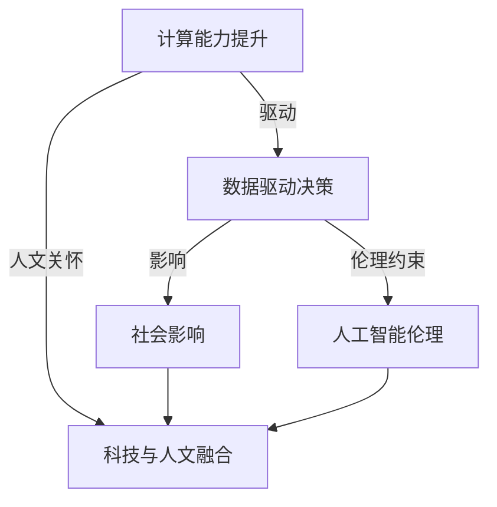

                 

# 科技与社会：人类计算的双重影响与思考

> 关键词：计算能力提升, 数据驱动决策, 社会影响, 人工智能伦理, 科技与人文融合

## 1. 背景介绍

### 1.1 问题由来
科技与社会的交融日益紧密，计算能力的大幅提升，尤其是人工智能(AI)和机器学习(ML)技术的飞速发展，深刻改变了人类社会的生产模式、工作方式和生活习惯。然而，这种变革带来的影响并非全然积极，其中既有推动社会进步的正面效应，也存在可能引发伦理危机和数据隐私问题的负面影响。因此，有必要深入探讨计算技术的双重影响，探索如何在科技进步的同时，确保技术应用的正向价值。

### 1.2 问题核心关键点
1. **计算能力提升**：自20世纪以来，计算机的计算能力每过十年就翻一番，这一趋势在AI和ML技术推动下更是加速。计算能力的提升使得数据处理和分析的速度大幅提高，从金融交易到基因测序，从智慧城市到个性化医疗，计算技术的支撑无处不在。

2. **数据驱动决策**：计算技术的进步，使得大数据分析成为决策的重要支撑。通过对海量数据的深入分析，可以预见市场趋势、优化资源配置、提高决策效率。然而，这也意味着数据的安全和隐私问题变得愈加复杂，数据滥用和隐私泄露风险增加。

3. **社会影响**：计算技术的广泛应用，带来了就业结构变化、信息不对称加剧、个人隐私受侵等多重社会问题。如何在享受技术红利的同时，规避其潜在的负面影响，成为当前科技社会的重要课题。

4. **人工智能伦理**：AI伦理问题，如算法偏见、决策透明度、责任归属等，已经成为社会关注的焦点。如何构建公平、透明、可解释的AI系统，确保技术应用符合伦理原则，成为技术发展中不可或缺的一环。

5. **科技与人文融合**：科技发展不仅要追求技术的进步，还应关注其对人类社会文化、价值观的深远影响。如何实现科技与人文的有机融合，推动社会健康发展，是当前科技社会的重要任务。

这些关键点构成了探讨计算技术对社会影响的框架，有助于我们全面理解科技与社会互动的复杂性。

## 2. 核心概念与联系

### 2.1 核心概念概述

为了深入理解计算技术对社会的影响，需首先明确一些核心概念：

- **计算能力提升**：指随着计算机硬件和软件技术的进步，计算处理速度、存储容量和能效比等指标的持续提升。

- **数据驱动决策**：指基于大数据分析，对社会和经济活动进行科学决策的过程。数据驱动决策提高了决策的准确性和效率，但也带来数据安全与隐私保护等挑战。

- **社会影响**：指计算技术在改变生产模式、工作方式、生活质量等方面的广泛影响。这包括但不限于就业结构变化、信息不对称、隐私泄露等。

- **人工智能伦理**：涉及AI系统设计、开发、应用过程中的伦理问题，包括算法偏见、决策透明度、责任归属等，旨在确保AI技术的安全、公平和可信。

- **科技与人文融合**：指在技术发展中注重其对人类文化、价值观的影响，推动科技与人类社会的和谐共生。

这些概念彼此关联，共同构成了科技与社会互动的复杂系统。

### 2.2 核心概念原理和架构的 Mermaid 流程图



该图展示了计算能力提升如何通过数据驱动决策，进一步影响社会，并受到人工智能伦理的约束，同时也强调了科技与人文融合的重要性。

## 3. 核心算法原理 & 具体操作步骤

### 3.1 算法原理概述

计算能力提升和技术进步，特别是AI和ML技术的不断发展，使得数据驱动决策成为可能。算法和模型通过分析海量数据，挖掘数据中的模式和趋势，提供科学的决策依据。然而，这一过程并非无懈可击，其可能带来的社会影响和伦理问题需要深入考量。

### 3.2 算法步骤详解

1. **数据收集与预处理**：
   - 从不同来源收集相关数据，包括结构化数据、半结构化数据和非结构化数据。
   - 清洗数据，去除噪声和冗余，确保数据质量。
   - 进行数据标准化和归一化，便于模型训练。

2. **特征工程**：
   - 根据业务需求，选择和构建特征，提取有用信息。
   - 使用降维技术，减少特征维度，提升模型效率。
   - 进行特征交叉和组合，丰富模型表达能力。

3. **模型训练与优化**：
   - 选择适合问题的模型，如线性回归、决策树、随机森林、神经网络等。
   - 使用训练集对模型进行训练，调整模型参数。
   - 使用验证集评估模型性能，避免过拟合。
   - 使用测试集验证最终模型的泛化能力。

4. **决策部署与监控**：
   - 将训练好的模型部署到生产环境。
   - 实时监控模型表现，根据反馈进行模型更新和优化。
   - 记录决策过程，确保决策透明和可解释。

### 3.3 算法优缺点

**优点**：
1. **提高决策效率**：大数据分析使得决策过程更为科学，提升了决策效率和准确性。
2. **优化资源配置**：通过对数据的深入分析，能够优化资源配置，提升社会整体效益。
3. **增强预测能力**：AI和ML模型具有强大的预测能力，能够预见市场趋势和社会变化。

**缺点**：
1. **数据隐私风险**：大量数据收集和分析带来了隐私泄露的风险，可能侵害个人隐私。
2. **算法偏见**：模型可能存在偏见，导致不公平的决策结果。
3. **技术复杂性**：大数据分析和AI模型的复杂性增加，需要专业知识和技能。
4. **决策透明性**：模型的决策过程复杂，难以解释，降低了决策透明性。

### 3.4 算法应用领域

数据驱动决策和计算技术在多个领域得到广泛应用：

- **金融**：风险评估、投资分析、欺诈检测等。
- **医疗**：疾病诊断、治疗方案、基因测序等。
- **交通**：智能交通管理、行车路线优化、事故预测等。
- **零售**：客户行为分析、库存管理、营销策略等。
- **能源**：能源消耗预测、智能电网管理、碳排放监测等。

## 4. 数学模型和公式 & 详细讲解 & 举例说明

### 4.1 数学模型构建

以回归问题为例，假设存在一个线性回归模型 $y = wx + b$，其中 $y$ 是目标变量，$x$ 是特征向量，$w$ 是权重向量，$b$ 是偏置项。回归模型的目标是最小化损失函数 $L(y, \hat{y})$，其中 $\hat{y}$ 是模型的预测值。

常见的损失函数包括均方误差（MSE）、平均绝对误差（MAE）等，以均方误差为例，其定义为：

$$
L(y, \hat{y}) = \frac{1}{N}\sum_{i=1}^N (y_i - \hat{y}_i)^2
$$

其中 $N$ 是样本数量，$y_i$ 和 $\hat{y}_i$ 分别是第 $i$ 个样本的真实值和预测值。

### 4.2 公式推导过程

回归模型通过梯度下降法（Gradient Descent）进行训练，每次迭代更新参数 $w$ 和 $b$：

$$
w \leftarrow w - \eta \nabla_{w} L(y, \hat{y})
$$
$$
b \leftarrow b - \eta \nabla_{b} L(y, \hat{y})
$$

其中 $\eta$ 是学习率，$\nabla_{w} L(y, \hat{y})$ 和 $\nabla_{b} L(y, \hat{y})$ 分别是损失函数对 $w$ 和 $b$ 的梯度。

### 4.3 案例分析与讲解

以线性回归模型为例，假设有一组数据 $(y_1, x_1), (y_2, x_2), \ldots, (y_n, x_n)$，使用均方误差损失函数，通过梯度下降法训练模型。具体步骤如下：

1. 初始化 $w$ 和 $b$。
2. 计算每个样本的预测值 $\hat{y}_i = wx_i + b$。
3. 计算损失函数 $L(y_i, \hat{y}_i)$。
4. 计算梯度 $\nabla_{w} L(y, \hat{y})$ 和 $\nabla_{b} L(y, \hat{y})$。
5. 更新 $w$ 和 $b$。
6. 重复步骤2-5，直至收敛或达到预设迭代次数。

## 5. 项目实践：代码实例和详细解释说明

### 5.1 开发环境搭建

1. **Python 环境**：安装Python 3.8及以上版本。
2. **依赖库**：安装 NumPy、Pandas、Scikit-Learn、Matplotlib、SciPy 等库。
3. **数据集**：准备用于回归分析的数据集。

### 5.2 源代码详细实现

以下是一个简单的线性回归模型的 Python 实现：

```python
import numpy as np
import pandas as pd
from sklearn.linear_model import LinearRegression
from sklearn.metrics import mean_squared_error

# 准备数据集
data = pd.read_csv('data.csv')
X = data.iloc[:, :-1].values
y = data.iloc[:, -1].values

# 训练模型
model = LinearRegression()
model.fit(X, y)

# 预测并评估模型
y_pred = model.predict(X)
mse = mean_squared_error(y, y_pred)

print(f"均方误差为：{mse}")
```

### 5.3 代码解读与分析

1. **数据准备**：使用 Pandas 读取数据集，将其转换为 NumPy 数组。
2. **模型训练**：使用 Scikit-Learn 的 LinearRegression 类，对数据进行线性回归模型训练。
3. **模型评估**：使用均方误差评估模型性能。
4. **输出结果**：打印均方误差。

## 6. 实际应用场景

### 6.1 金融风险管理

金融领域的数据驱动决策，如信用评分、市场预测等，均依赖于计算能力的提升和数据驱动模型。然而，大规模数据处理和复杂模型训练，可能带来数据隐私和算法偏见等问题。如何在使用大数据分析提升决策效率的同时，保障数据安全和公平性，成为金融风险管理的核心挑战。

### 6.2 个性化医疗

在医疗领域，计算技术通过分析海量患者数据，为个性化医疗提供支持。然而，数据隐私和算法偏见问题同样不容忽视。如何在确保患者隐私的同时，提供高效、公平的个性化医疗服务，成为科技与社会互动的重要课题。

### 6.3 智能交通

智能交通系统通过分析实时交通数据，优化交通管理。然而，算法偏见可能导致某些区域或群体受到不公平的待遇。如何构建公平、透明的智能交通系统，确保交通管理决策的公正性，是计算技术在社会应用中的重要考量。

### 6.4 未来应用展望

未来，计算技术将继续深入社会各个领域，带来更广泛的变革。然而，技术进步的同时，也需要关注其可能带来的伦理问题和社会影响。如何在享受技术红利的同时，确保技术应用的正向价值，将是未来科技社会的重要课题。

## 7. 工具和资源推荐

### 7.1 学习资源推荐

1. **《机器学习》(周志华)**
   - 本书系统介绍了机器学习的基本概念、算法原理和实际应用，是学习机器学习的经典教材。

2. **《数据科学导论》(Michael L. Stonebraker)**
   - 该书介绍了数据科学的基本方法和工具，涵盖数据处理、数据分析、机器学习等多个方面。

3. **Coursera 《Machine Learning》**
   - 由斯坦福大学教授 Andrew Ng 主讲的机器学习课程，涵盖了机器学习的基础理论和实践技巧。

4. **Kaggle 竞赛平台**
   - 提供大量数据集和竞赛题目，是练习和应用机器学习技术的良好平台。

5. **DeepLearning.AI 《AI For Everyone》**
   - 由吴恩达教授主讲的AI入门课程，涵盖了AI的基本概念和应用场景。

### 7.2 开发工具推荐

1. **Jupyter Notebook**
   - 用于编写和执行Python代码，支持丰富的数学公式和图表展示。

2. **Google Colab**
   - 提供免费的GPU资源，支持在线Jupyter Notebook环境，方便快速迭代和测试。

3. **PyTorch**
   - 流行的深度学习框架，支持动态计算图和GPU加速，适合进行大规模计算。

4. **TensorFlow**
   - 由Google开发的深度学习框架，支持分布式计算和GPU加速，适合生产环境应用。

5. **Scikit-Learn**
   - 简单易用的机器学习库，提供了多种算法和评估工具，适合快速原型开发。

### 7.3 相关论文推荐

1. **《数据驱动的决策制定：理论与实践》(David A. Bell)**
   - 介绍了数据驱动决策的理论基础和实际应用，是理解数据驱动决策的重要参考文献。

2. **《人工智能伦理：挑战与应对》(Harvard Business Review)**
   - 探讨了AI伦理问题，包括算法偏见、决策透明度、责任归属等，提供了丰富的案例分析。

3. **《计算社会系统：设计与分析》(Annette Treutwein)**
   - 介绍了计算技术对社会系统的影响，探讨了计算技术在社会应用中的伦理和社会影响。

## 8. 总结：未来发展趋势与挑战

### 8.1 研究成果总结

本文探讨了计算技术对社会的多重影响，从计算能力提升到数据驱动决策，再到社会影响和伦理问题，全面分析了科技与社会的互动。通过案例分析和代码实现，展示了计算技术在实际应用中的潜力和挑战。

### 8.2 未来发展趋势

未来，计算技术的进步将继续深刻影响社会各个领域，带来更广泛的变革。然而，技术进步的同时，也需要注意其可能带来的伦理问题和社会影响。以下是几个重要的发展趋势：

1. **计算能力的持续提升**：随着量子计算、光子计算等新技术的发展，计算能力将进一步提升，推动更多领域的技术革新。
2. **数据驱动决策的普及**：大数据分析将成为决策制定的重要工具，广泛应用于各个行业。
3. **人工智能伦理的完善**：AI伦理问题将受到越来越多的关注，构建公平、透明、可解释的AI系统成为重要目标。
4. **社会影响的全面评估**：计算技术对社会的影响将更加广泛，需要全面评估其带来的正面和负面效应。
5. **科技与人文的融合**：科技发展不仅要追求技术的进步，还需关注其对人类社会文化、价值观的影响。

### 8.3 面临的挑战

尽管计算技术带来了许多积极影响，但也面临着诸多挑战：

1. **数据隐私保护**：大规模数据处理带来隐私泄露风险，数据保护和隐私管理成为重要课题。
2. **算法偏见**：AI模型可能存在偏见，导致不公平的决策结果，需要采取措施消除偏见。
3. **技术复杂性**：计算技术的复杂性增加，需要专业知识和技能，需要更多人参与科技教育。
4. **决策透明性**：AI模型的复杂性导致决策过程难以解释，需要提高决策透明性和可解释性。
5. **伦理问题**：计算技术的应用可能带来伦理问题，如责任归属、公平性等，需要建立相应的伦理框架。

### 8.4 研究展望

为应对计算技术带来的挑战，未来研究需要在以下几个方面进行深入探索：

1. **数据隐私保护技术**：研究数据匿名化、差分隐私等技术，保护数据隐私。
2. **公平性算法**：开发无偏见的机器学习算法，消除模型偏见。
3. **计算模型可解释性**：研究可解释性算法，提高模型的决策透明性。
4. **伦理框架构建**：建立计算技术应用的伦理框架，确保技术应用的公正性。
5. **科技与人文融合**：推动科技与人文的有机融合，促进社会健康发展。

## 9. 附录：常见问题与解答

**Q1：如何保障数据隐私？**

A: 保障数据隐私的关键在于数据匿名化和差分隐私。数据匿名化通过去除或模糊化敏感信息，防止个人隐私泄露。差分隐私通过添加噪声，确保个体数据无法被单独识别，同时保证数据整体统计特征不变。

**Q2：如何解决算法偏见问题？**

A: 解决算法偏见需要从数据和模型两个方面入手。在数据收集阶段，确保数据的多样性和代表性。在模型训练阶段，使用公平性算法，消除模型偏见。此外，定期评估模型性能，确保其公平性。

**Q3：如何提高AI模型的可解释性？**

A: 提高AI模型的可解释性需要研究可解释性算法，如LIME、SHAP等，分析模型的决策过程。同时，通过可视化工具，如t-SNE、UMAP等，展示模型特征和决策边界。

**Q4：如何构建公平、透明的AI系统？**

A: 构建公平、透明的AI系统需要建立伦理框架，确保模型设计和应用的公正性。引入多方参与机制，包括技术专家、伦理学家、政策制定者等，共同监督模型的设计和应用。

**Q5：如何平衡技术进步与社会责任？**

A: 平衡技术进步与社会责任需要多方协作。技术开发者需要注重伦理问题，设计公平、透明的AI系统。政策制定者需要制定相应的法律法规，保护公众利益。公众需要了解技术应用的影响，积极参与监督和反馈。

---

作者：禅与计算机程序设计艺术 / Zen and the Art of Computer Programming

