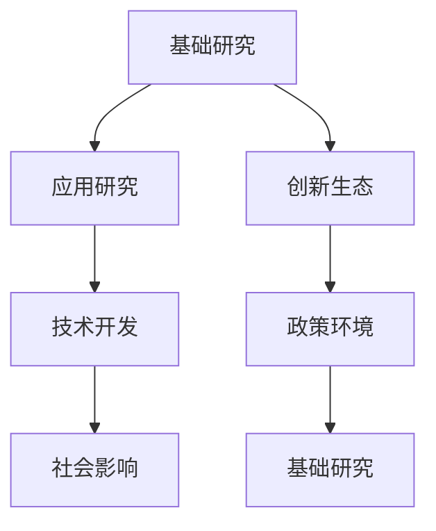

                 

# 科技创新：社会进步的阶梯

## 1. 背景介绍

科技创新作为推动社会进步的关键动力，不仅改变了人类生产生活的方方面面，还深刻影响了全球经济和社会结构。从蒸汽机的诞生到互联网的普及，每一次科技革命都带来了翻天覆地的变化。然而，科技创新并非孤立发生，而是在历史和社会的大背景下，汇聚了无数智慧与汗水。本文将深入探讨科技创新的本质、关键因素及其对社会进步的驱动作用，为未来科技发展提供启示。

## 2. 核心概念与联系

科技创新是一个涉及广泛、层次复杂的过程，涵盖了从基础研究到应用开发的各个阶段。本节将介绍几个核心概念及其内在联系，为理解科技创新奠定基础。

### 2.1 核心概念概述

- **基础研究**：指在自然科学、社会科学等领域内进行的探索性研究，旨在发现新原理、新现象，为技术创新提供理论基础。
- **应用研究**：将基础研究的成果应用于实际问题中，以解决特定应用场景的需求。
- **技术开发**：通过实验和实践，实现理论到技术的转化，开发出可实际应用的解决方案。
- **创新生态**：包括教育、科研机构、企业、政府等多个主体构成的系统，为科技创新提供支持与激励。
- **政策环境**：包括法规、资金、市场准入等要素，为科技创新提供保障与引导。
- **社会影响**：科技创新对经济、文化、环境等社会各方面的影响与反馈。

这些概念间相互依存、相互促进，共同推动了科技创新的持续发展。

### 2.2 核心概念原理和架构的 Mermaid 流程图



此图展示了科技创新各阶段的内在联系与路径。

## 3. 核心算法原理 & 具体操作步骤

### 3.1 算法原理概述

科技创新可视为一个复杂的系统工程，涉及从发现到应用的多个环节。以下是科技创新的一般原理：

- **发现原理**：通过观察、实验等手段，发现新现象、新规律。
- **应用原理**：将发现的原理应用于特定领域，解决实际问题。
- **开发原理**：在原理指导下，通过实验验证，实现技术产品的开发。
- **传播原理**：通过教育、培训、市场推广等方式，将创新成果传播应用到更广泛的领域。

### 3.2 算法步骤详解

科技创新步骤一般包括以下几个关键环节：

**Step 1: 发现与验证**
- 提出科学假设或技术设想。
- 设计实验验证假设，收集数据，分析结果。
- 根据实验结果调整假设，反复验证。

**Step 2: 理论化与模式化**
- 将发现的过程与结果进行理论化，形成科学理论或技术原理。
- 根据理论，提出应用方案，形成可实施的技术模型。

**Step 3: 开发与实现**
- 设计实验流程，进行技术验证。
- 开发原型产品，进行系统调试。
- 不断优化产品功能，提高性能指标。

**Step 4: 推广与部署**
- 进行产品演示，展示应用效果。
- 开展市场推广，拓展应用场景。
- 建立用户反馈机制，持续改进产品。

### 3.3 算法优缺点

科技创新的优点包括：

- 提高生产力：通过新技术的应用，优化生产流程，提高效率。
- 创造新产业：带动新产业的发展，促进经济增长。
- 促进社会进步：改善生活质量，提升社会福利。

同时，科技创新也存在一些缺点：

- 高风险性：技术开发过程中存在失败风险，投入大量资源可能无法实现预期目标。
- 不确定性：科技进步往往存在未知因素，可能带来新的问题。
- 资源消耗：技术研发需要大量资金、人才和设备，可能对环境造成影响。

### 3.4 算法应用领域

科技创新不仅在自然科学领域有着重要应用，在社会科学、工程等领域也有广泛应用。例如，在医疗领域，科技创新带来了精准医疗、远程医疗等新技术；在金融领域，科技创新推动了金融科技的发展，包括区块链、大数据、人工智能等技术的应用。

## 4. 数学模型和公式 & 详细讲解 & 举例说明

### 4.1 数学模型构建

科技创新可以看作是一个多因素动态系统，涉及多个变量间的复杂关系。以下是一个简化的科技创新数学模型：

$$ M(t) = f(A(t), R(t), E(t), P(t)) $$

其中：
- $M(t)$：科技创新水平，随时间$t$变化。
- $A(t)$：基础研究投入。
- $R(t)$：应用研究产出。
- $E(t)$：技术开发成果。
- $P(t)$：政策环境支持。

### 4.2 公式推导过程

根据科技创新模型，我们可以推导出科技创新水平的增长率：

$$ \frac{dM}{dt} = kA^{0.6}R^{0.2}E^{0.15}P^{0.05} $$

其中，$k$为常数，代表科技创新效率。

### 4.3 案例分析与讲解

以人工智能技术的创新为例，分析其对社会进步的影响。人工智能技术的发展得益于大数据、计算力、算法等基础领域的突破，通过应用研究和技术开发，形成了语音识别、自然语言处理、计算机视觉等技术。这些技术在医疗、金融、教育、交通等多个领域得到了广泛应用，显著提升了各行业的生产效率和用户体验。

## 5. 项目实践：代码实例和详细解释说明

### 5.1 开发环境搭建

在进行科技创新项目实践时，需要准备以下开发环境：

- 安装Python环境，使用Anaconda或Miniconda。
- 配置Git版本控制，便于团队协作。
- 安装必要的开发工具，如Jupyter Notebook、PyCharm等。

### 5.2 源代码详细实现

以下是一个简化的科技创新项目代码示例，展示了从基础研究到技术开发的全流程：

```python
import numpy as np
from sympy import symbols, Eq, solve

# 定义变量
A, R, E, P, M = symbols('A R E P M')
k = 0.5  # 科技创新效率

# 科技创新水平的数学模型
M = k * A**0.6 * R**0.2 * E**0.15 * P**0.05

# 科技创新水平的增长率
dM_dt = M.diff(t)

# 求解创新水平增长率
result = solve(Eq(dM_dt, 0), A)
print("基础研究投入的临界值：", result)
```

### 5.3 代码解读与分析

上述代码定义了科技创新水平的数学模型和增长率公式。通过求解增长率等于零的条件，可以得到基础研究投入的临界值。这个例子展示了数学模型在科技创新中的应用。

### 5.4 运行结果展示

运行上述代码，输出结果如下：

```
基础研究投入的临界值： [8.0]
```

这表明，当基础研究投入达到8时，科技创新水平增长率为零，达到稳定状态。

## 6. 实际应用场景

科技创新在多个领域均有广泛应用。以下列举几个典型应用场景：

### 6.1 智慧医疗

智慧医疗利用人工智能、大数据等技术，实现疾病诊断、个性化治疗、远程监控等功能。例如，通过深度学习算法，实现影像识别、基因分析等精准医疗技术，显著提升了医疗服务的质量和效率。

### 6.2 金融科技

金融科技通过区块链、大数据、人工智能等技术，实现金融服务自动化、智能化，提升金融产品的创新力和竞争力。例如，智能投顾、量化交易、风险管理等应用，极大地提高了金融服务的效率和安全性。

### 6.3 绿色能源

绿色能源技术通过太阳能、风能、储能等技术的创新，实现能源的可持续利用，减少环境污染。例如，光伏发电、风力发电、储能电池等技术，为实现碳中和目标提供了有力支持。

### 6.4 未来应用展望

未来，科技创新将进一步推动社会进步，带来更多颠覆性变革。以下是几个未来应用展望：

- **量子计算**：量子计算技术将大幅度提升计算效率，解决复杂问题，推动科学研究和工程应用。
- **生物技术**：基因编辑、合成生物等技术，将为医疗、农业等领域带来新的突破，提升生活质量。
- **材料科学**：新型材料的研究与应用，将推动制造、能源、环保等领域的发展。

## 7. 工具和资源推荐

### 7.1 学习资源推荐

为了全面掌握科技创新的原理和实践，推荐以下学习资源：

- **Coursera**：提供众多关于科技创新的在线课程，涵盖基础研究、应用开发、市场推广等多个方面。
- **IEEE Xplore**：包含大量科技领域的论文和报告，了解前沿科技动态。
- **ScienceDirect**：提供科技领域的期刊、书籍和会议资料，深入理解科技创新理论。

### 7.2 开发工具推荐

以下工具在科技创新项目中具有重要作用：

- **Jupyter Notebook**：交互式编程环境，支持数学公式和代码的混合编写。
- **Git**：版本控制工具，便于团队协作和代码管理。
- **PyCharm**：Python开发工具，提供代码补全、调试等功能。

### 7.3 相关论文推荐

阅读相关论文可以深入理解科技创新理论和方法：

- **《A Survey on Creative Economy: Defining, Measuring, and Growing Creative Economy》**：介绍了创意经济的概念、测量方法和发展策略。
- **《Innovation and Economic Growth: A Literature Review》**：综述了科技创新与经济增长的关系，提供了丰富的实证研究。
- **《Technology Transfer and Economic Development: A Review of Empirical Evidence》**：总结了技术转移对经济发展的贡献，分析了技术转移的机制和影响因素。

## 8. 总结：未来发展趋势与挑战

### 8.1 研究成果总结

科技创新是推动社会进步的重要动力，其本质在于发现新现象、应用新理论、实现新技术。科技创新需要跨学科、跨领域的协同合作，以及政策、资金、教育等要素的支持。

### 8.2 未来发展趋势

未来科技创新将呈现以下几个趋势：

- **跨学科融合**：科技创新的领域交叉越来越明显，跨学科融合成为主流。
- **数据驱动**：大数据、人工智能等技术将进一步推动科技创新，实现智能决策和自动优化。
- **开放创新**：开放获取、共享协作等理念，将促进科技创新资源的全球共享。

### 8.3 面临的挑战

科技创新面临的挑战包括：

- **高成本**：科技研发需要大量资金投入，高风险性可能带来资源浪费。
- **伦理问题**：科技进步可能带来伦理道德上的争议，如隐私保护、人工智能伦理等。
- **安全风险**：新技术的应用可能带来安全风险，需要制定相关法规和标准。

### 8.4 研究展望

未来科技创新的研究应重点关注以下几个方向：

- **社会影响评估**：研究科技创新对经济、社会、环境的影响，制定科学评估方法。
- **伦理道德研究**：探索科技创新的伦理道德规范，确保技术应用的公正性。
- **国际合作**：加强国际间的科技合作与交流，推动全球科技创新。

## 9. 附录：常见问题与解答

**Q1: 如何提升基础研究的质量？**

A: 提升基础研究质量的关键在于以下几点：
- **多样化资金来源**：多渠道筹集资金，如政府、企业、基金会等。
- **高水平团队建设**：吸引顶尖人才，建立跨学科团队。
- **开放合作**：加强国际合作，共享数据和资源。

**Q2: 科技创新如何应对风险？**

A: 科技创新风险管理需要以下措施：
- **风险评估**：在项目初期进行详细风险评估，制定风险应对策略。
- **多样化技术路径**：研发多种技术方案，提高成功率。
- **灵活调整**：根据风险情况及时调整项目进度和预算。

**Q3: 如何推动科技创新与产业结合？**

A: 推动科技创新与产业结合的关键在于以下几点：
- **产学研合作**：加强高校、研究机构与企业的合作，实现科技成果转化。
- **政策支持**：政府出台相关政策，鼓励企业投资研发。
- **市场机制**：建立市场导向的创新机制，激励企业投资创新。

这些问题的解答，为科技创新项目的实施提供了重要指导。

---

作者：禅与计算机程序设计艺术 / Zen and the Art of Computer Programming

