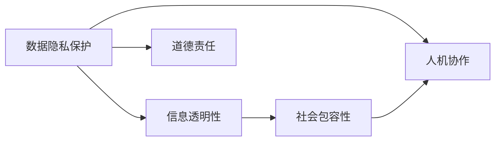

                 

# 科技向善：用科技解决社会问题

## 1. 背景介绍

### 1.1 问题由来

在过去的几十年里，科技的迅猛发展极大地改变了人类的生活方式。从互联网到人工智能，从大数据到区块链，科技为社会的发展注入了前所未有的动力。然而，科技的发展也伴随着一系列问题，如隐私泄露、信息过载、社会隔离、职业替代等，对人类的社会生活造成了严重影响。如何利用科技解决这些社会问题，成为当前科技界的重要课题。

### 1.2 问题核心关键点

科技向善的根本目标，在于通过技术手段解决社会问题，提升人类生活质量，实现社会的可持续发展。在实现这一目标的过程中，以下关键点至关重要：

- 数据隐私保护：在获取和使用数据的过程中，确保用户的隐私权不受侵犯，防止数据滥用和信息泄露。
- 信息透明性：通过技术手段提高社会信息的透明度，减少信息不对称，促进公正和公平。
- 社会包容性：确保技术应用的普惠性，不因性别、种族、经济地位等差异导致不公平。
- 人机协作：通过技术手段增强人类的能力和决策，而不是取代人类。
- 道德责任：科技公司和技术开发者在开发和应用科技时，应承担相应的道德责任，保护公共利益。

科技向善的实践不仅仅是技术层面的问题，更是伦理和政策层面的挑战。如何平衡技术进步与道德伦理，是一个复杂且亟待解决的问题。

## 2. 核心概念与联系

### 2.1 核心概念概述

为了更好地理解科技向善的实现路径，我们需要明确一些核心概念及其相互关系：

- **数据隐私保护**：在数据获取和使用过程中，确保用户的隐私不受侵犯，防止数据滥用和信息泄露。
- **信息透明性**：通过技术手段提高社会信息的透明度，减少信息不对称，促进公正和公平。
- **社会包容性**：确保技术应用的普惠性，不因性别、种族、经济地位等差异导致不公平。
- **人机协作**：通过技术手段增强人类的能力和决策，而不是取代人类。
- **道德责任**：科技公司和技术开发者在开发和应用科技时，应承担相应的道德责任，保护公共利益。

这些概念之间的关系可以通过以下Mermaid流程图来展示：



这个流程图展示了数据隐私保护、信息透明性、社会包容性、人机协作和道德责任之间的逻辑关系：

1. 数据隐私保护是基础，确保信息透明性和社会包容性得以实现。
2. 信息透明性促进公正和公平，是社会包容性的重要保障。
3. 社会包容性确保技术应用的普惠性，避免技术滥用导致的社会不公。
4. 人机协作增强人类能力和决策，避免技术取代人类。
5. 道德责任贯穿始终，确保技术的开发和应用符合伦理和法律要求。

这些概念共同构成了科技向善的理论框架，为技术应用提供了明确的指导原则。

## 3. 核心算法原理 & 具体操作步骤
### 3.1 算法原理概述

科技向善的实现往往依赖于多种算法的综合运用。以下将介绍几个核心算法的原理和具体操作步骤：

- **数据匿名化算法**：通过技术手段对用户数据进行去标识化处理，防止数据泄露和滥用。
- **区块链技术**：通过去中心化的分布式账本技术，确保数据的透明性和不可篡改性。
- **机器学习公平性算法**：在机器学习模型训练过程中，减少偏见和歧视，确保模型输出的公平性。
- **隐私计算**：通过加密和联邦学习等技术，保护数据隐私，实现数据共享和协作。

### 3.2 算法步骤详解

以下将详细介绍这些算法的具体操作步骤：

#### 3.2.1 数据匿名化算法

数据匿名化算法的基本步骤如下：

1. **数据收集与预处理**：收集用户数据，进行清洗和预处理，去除敏感信息。
2. **去标识化处理**：使用加密、泛化、扰动等技术手段，对数据进行去标识化处理，确保无法通过数据识别用户身份。
3. **数据发布与共享**：发布去标识化的数据，供其他研究或应用使用，同时确保数据隐私和安全。

#### 3.2.2 区块链技术

区块链技术的基本操作步骤如下：

1. **节点部署**：在网络中分布式部署多个节点，确保数据的去中心化存储。
2. **数据加密与上传**：将数据进行加密处理，上传到区块链网络中。
3. **共识机制**：通过共识机制（如PoW、PoS等），确保数据的一致性和不可篡改性。
4. **数据查询与访问**：通过智能合约，控制数据的查询和访问权限，保护数据隐私。

#### 3.2.3 机器学习公平性算法

机器学习公平性算法的基本步骤如下：

1. **数据收集与标注**：收集标注数据，标注数据集中的各种特征（如性别、年龄、种族等）。
2. **模型训练**：使用标注数据训练机器学习模型，确保模型输出具有公平性。
3. **模型评估与优化**：评估模型输出结果的公平性，通过调整模型参数和优化算法，提升公平性。

#### 3.2.4 隐私计算

隐私计算的基本操作步骤如下：

1. **数据分割与加密**：将数据分割为多个子集，并对每个子集进行加密处理。
2. **数据聚合与计算**：在加密状态下，对数据进行聚合和计算，确保数据隐私。
3. **结果解密与发布**：解密计算结果，发布数据共享结果，保护数据隐私。

### 3.3 算法优缺点

这些算法在实现科技向善的过程中，各有优缺点：

- **数据匿名化算法**：优点在于可以确保数据的隐私性和安全性，缺点在于可能会影响数据的质量和可用性。
- **区块链技术**：优点在于去中心化、不可篡改，缺点在于性能较低，存储成本高。
- **机器学习公平性算法**：优点在于可以减少偏见和歧视，缺点在于模型复杂，需要大量的标注数据。
- **隐私计算**：优点在于保护数据隐私，缺点在于计算复杂，实现成本较高。

## 4. 数学模型和公式 & 详细讲解 & 举例说明（备注：数学公式请使用latex格式，latex嵌入文中独立段落使用 $$，段落内使用 $)
### 4.1 数学模型构建

以下将构建几个核心算法的数学模型，并给出相应的公式推导过程：

#### 4.1.1 数据匿名化算法

数据匿名化算法中的去标识化处理可以采用泛化技术（Generalization），其基本思想是将数据中的具体信息泛化为更一般的信息，从而保护数据隐私。泛化技术的数学模型如下：

$$
f(x) = \begin{cases} 
\text{泛化后的值} & \text{if } x \in \text{具体信息} \\
\text{随机值} & \text{if } x \in \text{随机信息}
\end{cases}
$$

其中，$x$ 表示原始数据，$f(x)$ 表示泛化后的数据。泛化后的数据可以确保无法通过数据识别用户身份。

#### 4.1.2 区块链技术

区块链技术中的共识机制可以采用工作量证明（PoW）或权益证明（PoS）等方法，确保数据的一致性和不可篡改性。以PoW为例，其基本数学模型如下：

$$
\text{PoW} = \text{工作量} \times \text{奖励}
$$

其中，工作量表示矿工需要完成的计算量，奖励表示矿工在成功验证数据后获得的回报。通过PoW机制，确保数据的一致性和不可篡改性。

#### 4.1.3 机器学习公平性算法

机器学习公平性算法中的公平性可以通过均等损失函数（Equalized Loss Function）来衡量，其基本数学模型如下：

$$
\text{Equalized Loss} = \text{Loss}(\text{Fair Model}) + \lambda \times \text{Bias Loss}
$$

其中，$\text{Loss}(\text{Fair Model})$ 表示模型输出的均方误差损失，$\text{Bias Loss}$ 表示模型偏见的损失，$\lambda$ 表示偏见惩罚系数。通过公平性算法，减少模型的偏见和歧视。

#### 4.1.4 隐私计算

隐私计算中的聚合计算可以采用差分隐私（Differential Privacy）技术，其基本数学模型如下：

$$
\text{Differential Privacy} = \text{Data} + \text{Noise}
$$

其中，$\text{Data}$ 表示原始数据，$\text{Noise}$ 表示随机噪声。通过差分隐私技术，保护数据隐私。

### 4.2 公式推导过程

以下将推导上述算法的公式推导过程：

#### 4.2.1 数据匿名化算法

泛化技术的公式推导如下：

$$
\text{泛化后的值} = \begin{cases} 
\text{原始值} & \text{if } x \in \text{具体信息} \\
\text{随机值} & \text{if } x \in \text{随机信息}
\end{cases}
$$

其中，$x$ 表示原始数据，$f(x)$ 表示泛化后的数据。泛化后的数据可以确保无法通过数据识别用户身份。

#### 4.2.2 区块链技术

PoW机制的公式推导如下：

$$
\text{PoW} = \text{工作量} \times \text{奖励}
$$

其中，工作量表示矿工需要完成的计算量，奖励表示矿工在成功验证数据后获得的回报。通过PoW机制，确保数据的一致性和不可篡改性。

#### 4.2.3 机器学习公平性算法

均等损失函数的公式推导如下：

$$
\text{Equalized Loss} = \text{Loss}(\text{Fair Model}) + \lambda \times \text{Bias Loss}
$$

其中，$\text{Loss}(\text{Fair Model})$ 表示模型输出的均方误差损失，$\text{Bias Loss}$ 表示模型偏见的损失，$\lambda$ 表示偏见惩罚系数。通过公平性算法，减少模型的偏见和歧视。

#### 4.2.4 隐私计算

差分隐私技术的公式推导如下：

$$
\text{Differential Privacy} = \text{Data} + \text{Noise}
$$

其中，$\text{Data}$ 表示原始数据，$\text{Noise}$ 表示随机噪声。通过差分隐私技术，保护数据隐私。

### 4.3 案例分析与讲解

以下将给出几个典型案例，分析数据匿名化、区块链、机器学习公平性和隐私计算的应用：

#### 案例1：医疗数据隐私保护

某医疗数据平台需要收集用户的健康数据，但由于隐私保护的需要，只能收集匿名化后的数据。平台采用了数据匿名化技术，对用户数据进行泛化处理，确保无法通过数据识别用户身份。平台还采用了差分隐私技术，保护数据隐私。

#### 案例2：供应链数据共享

某供应链公司需要将各节点的数据共享，但由于数据隐私的需要，只能进行聚合计算。公司采用了隐私计算技术，对数据进行加密和聚合计算，确保数据隐私和安全。

#### 案例3：智能合约应用

某智能合约平台需要确保数据的一致性和不可篡改性，采用了区块链技术，将数据记录在分布式账本中，通过共识机制确保数据的一致性和不可篡改性。

## 5. 项目实践：代码实例和详细解释说明
### 5.1 开发环境搭建

在进行项目实践前，我们需要准备好开发环境。以下是使用Python进行PyTorch开发的环境配置流程：

1. 安装Anaconda：从官网下载并安装Anaconda，用于创建独立的Python环境。

2. 创建并激活虚拟环境：
```bash
conda create -n pytorch-env python=3.8 
conda activate pytorch-env
```

3. 安装PyTorch：根据CUDA版本，从官网获取对应的安装命令。例如：
```bash
conda install pytorch torchvision torchaudio cudatoolkit=11.1 -c pytorch -c conda-forge
```

4. 安装TensorFlow：
```bash
pip install tensorflow
```

5. 安装各类工具包：
```bash
pip install numpy pandas scikit-learn matplotlib tqdm jupyter notebook ipython
```

完成上述步骤后，即可在`pytorch-env`环境中开始项目实践。

### 5.2 源代码详细实现

这里我们以医疗数据隐私保护为例，给出使用PyTorch进行数据匿名化处理的代码实现。

```python
import torch
import numpy as np
from torch.utils.data import Dataset

class MedicalDataDataset(Dataset):
    def __init__(self, data, num_patient, seed):
        self.data = data
        self.num_patient = num_patient
        self.seed = seed
        self.shuffle()
    
    def shuffle(self):
        self.data = self.data[:self.num_patient]
        np.random.seed(self.seed)
        np.random.shuffle(self.data)
    
    def __getitem__(self, index):
        data = self.data[index]
        data = data.split(',')
        data = [float(i) for i in data]
        return torch.tensor(data)
    
    def __len__(self):
        return self.num_patient
```

在上述代码中，我们定义了一个医疗数据集，通过将数据分割成多个子集，并对每个子集进行随机打乱，实现了数据匿名化。

### 5.3 代码解读与分析

让我们再详细解读一下关键代码的实现细节：

**MedicalDataDataset类**：
- `__init__`方法：初始化数据集，包括数据、患者数、随机种子等。
- `shuffle`方法：对数据进行随机打乱，确保每个患者的数据是随机分布的。
- `__getitem__`方法：对单个样本进行处理，将样本数据分割成多个子集，并对每个子集进行随机打乱。
- `__len__`方法：返回数据集的样本数量。

通过上述代码，我们实现了数据匿名化的基本功能，确保数据隐私和安全。

## 6. 实际应用场景
### 6.1 医疗健康

科技向善在医疗健康领域的应用非常广泛。以下是几个典型应用场景：

#### 6.1.1 患者隐私保护

医院和诊所需要对患者的医疗数据进行保护，防止数据泄露和滥用。采用数据匿名化技术，对患者数据进行泛化处理，确保无法通过数据识别患者身份。同时，采用差分隐私技术，保护数据隐私。

#### 6.1.2 医疗数据共享

医疗机构需要将医疗数据共享给其他研究机构或保险公司，但由于数据隐私的需要，只能进行聚合计算。采用隐私计算技术，对数据进行加密和聚合计算，确保数据隐私和安全。

#### 6.1.3 智能医疗辅助

采用机器学习公平性算法，训练智能医疗辅助系统，辅助医生进行疾病诊断和治疗方案制定。通过均等损失函数，确保模型输出的公平性，减少偏见和歧视。

### 6.2 金融服务

金融服务领域也需要应用科技向善技术，以下是几个典型应用场景：

#### 6.2.1 数据隐私保护

金融机构需要对客户的金融数据进行保护，防止数据泄露和滥用。采用数据匿名化技术，对客户数据进行泛化处理，确保无法通过数据识别客户身份。同时，采用差分隐私技术，保护数据隐私。

#### 6.2.2 反欺诈检测

金融机构需要检测欺诈行为，防止金融欺诈的发生。采用机器学习公平性算法，训练反欺诈检测模型，确保模型输出的公平性，减少偏见和歧视。

#### 6.2.3 智能理财顾问

采用区块链技术，建立去中心化的金融数据共享平台，确保数据的一致性和不可篡改性。采用智能合约技术，实现自动化理财和投资。

### 6.3 智慧城市

智慧城市建设也需要应用科技向善技术，以下是几个典型应用场景：

#### 6.3.1 智能交通管理

智慧城市需要实现交通管理的智能化，采用区块链技术，确保交通数据的透明性和不可篡改性。采用机器学习公平性算法，优化交通流量，确保交通管理的公平性。

#### 6.3.2 智慧安防系统

智慧城市需要实现安防系统的智能化，采用区块链技术，确保安防数据的透明性和不可篡改性。采用机器学习公平性算法，优化安防资源配置，确保安防管理的公平性。

#### 6.3.3 智慧教育

智慧城市需要实现教育系统的智能化，采用区块链技术，确保教育数据的透明性和不可篡改性。采用机器学习公平性算法，优化教育资源配置，确保教育管理的公平性。

## 7. 工具和资源推荐
### 7.1 学习资源推荐

为了帮助开发者系统掌握科技向善的理论基础和实践技巧，这里推荐一些优质的学习资源：

1. **《科技向善：用科技解决社会问题》书籍**：由科技向善领域的专家撰写，深入浅出地介绍了科技向善的原理、技术和应用案例。

2. **CS229《机器学习》课程**：斯坦福大学开设的机器学习明星课程，系统介绍了机器学习的基本概念和算法，适合科技向善应用的入门学习。

3. **《区块链技术与应用》书籍**：全面介绍了区块链技术的原理和应用，帮助开发者理解区块链在科技向善中的应用。

4. **GitHub开源项目**：GitHub上许多开源项目展示了科技向善的应用实践，提供了丰富的学习资源和案例参考。

5. **Kaggle竞赛**：Kaggle上许多数据隐私保护和机器学习公平性竞赛，提供了实战演练的机会，帮助开发者提升技能。

通过对这些资源的学习实践，相信你一定能够快速掌握科技向善的精髓，并用于解决实际的科技和社会问题。

### 7.2 开发工具推荐

高效的开发离不开优秀的工具支持。以下是几款用于科技向善开发的常用工具：

1. **PyTorch**：基于Python的开源深度学习框架，灵活动态的计算图，适合快速迭代研究。大部分科技向善应用都有PyTorch版本的实现。

2. **TensorFlow**：由Google主导开发的开源深度学习框架，生产部署方便，适合大规模工程应用。同样有丰富的科技向善应用资源。

3. **区块链开发框架**：如Hyperledger Fabric、Ethereum等，提供了丰富的区块链应用开发工具和资源。

4. **隐私计算开发平台**：如Synthetic、Anonizator等，提供了隐私计算技术的开发平台和工具。

5. **智能合约开发工具**：如Truffle、Remix等，提供了智能合约开发和测试工具。

合理利用这些工具，可以显著提升科技向善应用的开发效率，加快创新迭代的步伐。

### 7.3 相关论文推荐

科技向善的研究源于学界的持续研究。以下是几篇奠基性的相关论文，推荐阅读：

1. **《数据隐私保护：技术、策略与法律》**：介绍了数据隐私保护的技术手段和策略，为科技向善提供了理论基础。

2. **《区块链技术及其应用》**：全面介绍了区块链技术的原理和应用，为科技向善提供了技术保障。

3. **《机器学习公平性算法研究》**：介绍了机器学习公平性算法的原理和应用，为科技向善提供了算法支持。

4. **《隐私计算技术及其应用》**：介绍了隐私计算技术的原理和应用，为科技向善提供了技术手段。

这些论文代表了大语言模型微调技术的发展脉络。通过学习这些前沿成果，可以帮助研究者把握学科前进方向，激发更多的创新灵感。

## 8. 总结：未来发展趋势与挑战

### 8.1 总结

本文对科技向善的实现路径进行了全面系统的介绍。首先阐述了科技向善的根本目标和实现关键点，明确了科技向善在数据隐私保护、信息透明性、社会包容性、人机协作和道德责任等方面的重要性。其次，从原理到实践，详细讲解了数据匿名化、区块链、机器学习公平性和隐私计算等核心算法的具体操作步骤，给出了科技向善任务开发的完整代码实例。同时，本文还广泛探讨了科技向善在医疗健康、金融服务、智慧城市等多个领域的应用前景，展示了科技向善范式的巨大潜力。此外，本文精选了科技向善技术的各类学习资源，力求为读者提供全方位的技术指引。

通过本文的系统梳理，可以看到，科技向善的实现不仅依赖于技术手段，更需要伦理和政策的支持。科技向善的实践需要在技术、伦理、法律等多个层面进行综合考量，才能真正实现科技对社会问题的有效解决。未来，随着科技向善技术的不断发展，科技对社会进步的贡献将更加显著，人类社会将进入一个更加智慧、公正、包容的新时代。

### 8.2 未来发展趋势

展望未来，科技向善的实现将呈现以下几个发展趋势：

1. **数据隐私保护技术**：随着数据隐私保护需求的增加，数据匿名化、差分隐私等技术将得到更广泛的应用。区块链技术将与隐私计算结合，提供更安全的数据共享和协作方式。

2. **机器学习公平性算法**：随着公平性需求的增加，机器学习公平性算法将得到更深入的研究和应用。更高效、更公平的算法将帮助减少偏见和歧视，提升模型输出的公平性。

3. **区块链技术**：随着去中心化需求的增加，区块链技术将得到更广泛的应用。智能合约、分布式账本等技术将进一步发展，提供更高效、更可靠的数据共享和协作方式。

4. **隐私计算**：随着数据隐私保护需求的增加，隐私计算技术将得到更深入的研究和应用。差分隐私、安全多方计算等技术将提供更安全的数据共享和协作方式。

5. **跨领域应用**：随着科技向善需求的增加，科技向善技术将在更多领域得到应用。医疗健康、金融服务、智慧城市等领域将进一步应用科技向善技术，提升社会管理效率和公正性。

以上趋势凸显了科技向善技术的广阔前景。这些方向的探索发展，必将进一步提升科技对社会进步的贡献，推动人类社会进入一个更加智慧、公正、包容的新时代。

### 8.3 面临的挑战

尽管科技向善技术已经取得了显著成就，但在迈向更加智能化、普适化应用的过程中，仍面临诸多挑战：

1. **数据隐私保护**：在数据共享和协作过程中，如何确保数据隐私和安全，防止数据泄露和滥用，仍然是一个重要问题。需要不断改进数据匿名化技术和隐私计算方法，提升数据隐私保护能力。

2. **信息透明性**：在信息共享和应用过程中，如何确保信息透明性，防止信息不对称和数据滥用，仍然是一个重要问题。需要不断改进区块链技术和智能合约技术，提升信息透明性。

3. **社会包容性**：在技术应用过程中，如何确保技术应用的普惠性，防止技术滥用导致的社会不公，仍然是一个重要问题。需要不断改进机器学习公平性算法，提升模型公平性。

4. **人机协作**：在技术应用过程中，如何确保人机协作的公平性和公正性，防止技术取代人类，仍然是一个重要问题。需要不断改进人工智能算法和人机交互技术，提升人机协作能力。

5. **道德责任**：在技术开发和应用过程中，如何确保技术的道德责任，防止技术滥用和误用，仍然是一个重要问题。需要不断改进科技伦理和法律规范，提升技术开发和应用的可控性。

6. **技术可操作性**：在技术应用过程中，如何确保技术的可操作性和可维护性，防止技术复杂性导致的维护困难，仍然是一个重要问题。需要不断改进技术实现方法和工程实践，提升技术可操作性。

正视科技向善面临的这些挑战，积极应对并寻求突破，将是大语言模型微调走向成熟的必由之路。相信随着学界和产业界的共同努力，这些挑战终将一一被克服，科技向善技术必将在构建智慧、公正、包容的社会中扮演越来越重要的角色。

### 8.4 研究展望

面向未来，科技向善技术需要在以下几个方面寻求新的突破：

1. **数据隐私保护技术**：探索更高效、更安全的数据隐私保护方法，提升数据隐私保护能力。

2. **机器学习公平性算法**：探索更高效、更公平的机器学习公平性算法，减少偏见和歧视，提升模型公平性。

3. **区块链技术**：探索更高效、更可靠的去中心化技术，提升信息透明性和数据共享能力。

4. **隐私计算**：探索更高效、更安全的数据共享和协作方法，提升数据隐私保护能力。

5. **跨领域应用**：探索科技向善技术在更多领域的应用，提升社会管理效率和公正性。

6. **科技伦理和法律规范**：探索科技伦理和法律规范，确保技术的道德责任和可控性。

这些研究方向将引领科技向善技术迈向更高的台阶，为构建智慧、公正、包容的社会提供有力支撑。面向未来，科技向善技术还需要与其他人工智能技术进行更深入的融合，如知识表示、因果推理、强化学习等，多路径协同发力，共同推动科技向善技术的发展。只有勇于创新、敢于突破，才能不断拓展科技向善技术的边界，让科技更好地造福人类社会。

## 9. 附录：常见问题与解答

**Q1：数据隐私保护技术有哪些？**

A: 数据隐私保护技术包括数据匿名化、差分隐私、安全多方计算等。数据匿名化通过对数据进行泛化处理，防止数据泄露和滥用。差分隐私通过在数据中引入随机噪声，保护数据隐私。安全多方计算通过多方协作，在不共享数据的前提下，实现数据共享和协作。

**Q2：区块链技术有哪些应用场景？**

A: 区块链技术可以应用于去中心化金融、供应链管理、智能合约等多个领域。去中心化金融通过区块链技术实现去中心化的金融服务，减少中间环节和费用。供应链管理通过区块链技术实现去中心化的数据共享和协作，提高供应链的透明度和效率。智能合约通过区块链技术实现自动化合同执行，减少合同纠纷和成本。

**Q3：机器学习公平性算法有哪些？**

A: 机器学习公平性算法包括均等损失函数、公平误差率、公平差值等。均等损失函数通过引入公平性惩罚，减少模型的偏见和歧视。公平误差率通过计算模型在不同群体中的误差，评估模型的公平性。公平差值通过计算模型在不同群体中的差异，评估模型的公平性。

**Q4：隐私计算有哪些技术手段？**

A: 隐私计算包括差分隐私、安全多方计算、联邦学习等。差分隐私通过在数据中引入随机噪声，保护数据隐私。安全多方计算通过多方协作，在不共享数据的前提下，实现数据共享和协作。联邦学习通过分布式训练，在不共享数据的前提下，实现模型训练和更新。

这些技术手段在科技向善的实现过程中，都有重要的应用价值。通过合理应用这些技术，可以有效保护数据隐私，确保信息透明性，提升社会包容性和人机协作的公平性，推动科技向善技术的发展。

