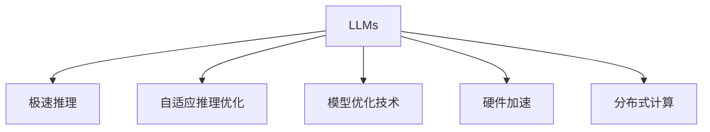

                 

# 秒推时代:LLM极速推理带来的新机遇

> 关键词：LLM, 极速推理, 自适应推理, 模型优化, 高效推理, 应用场景

## 1. 背景介绍

### 1.1 问题由来

随着深度学习技术的飞速发展，大语言模型(LLMs)，如GPT系列、BERT等，已经在自然语言处理(NLP)领域取得了显著的进展。这些模型通过大规模无标签文本数据的预训练，学习到了丰富的语言知识，并在微调后能够适应各种下游任务，如文本分类、命名实体识别、情感分析、对话系统等。

然而，这些模型通常需要较大的计算资源和时间进行推理。在实际应用中，面对大量的实时查询，推理过程的延迟和高资源消耗会成为性能瓶颈。此外，传统的大模型由于其巨大的参数量和计算复杂度，很难支持实时推理和高并发处理，使得其应用场景受到限制。

为了应对这些问题，研究人员和工程师开始探索如何优化LLM的推理速度，提升其实时性和可扩展性。这一探索催生了LLM极速推理（LLM Rapid Inference）技术，能够在保持LLM性能的同时，大幅度提升推理速度，降低计算资源消耗，从而更好地支持实际应用。

### 1.2 问题核心关键点

LLM极速推理的核心目标是在不牺牲模型性能的前提下，显著提升推理速度和可扩展性。其关键点包括：

1. **自适应推理优化**：通过动态调整模型参数和结构，使其能够快速响应不同的推理需求，实现推理过程的灵活和高效。
2. **模型优化技术**：利用模型剪枝、量化、蒸馏等技术，减少模型参数量和计算复杂度，提升推理速度。
3. **硬件加速**：结合GPU、TPU等专用硬件，利用硬件并行计算能力，进一步加速推理过程。
4. **分布式计算**：通过分布式系统架构，实现高并发和低延迟的推理服务。

这些关键技术共同构成了LLM极速推理的基础，使得LLM能够在大规模实时推理场景中发挥重要作用。

## 2. 核心概念与联系

### 2.1 核心概念概述

为更好地理解LLM极速推理技术，本节将介绍几个关键概念：

- **大语言模型(LLMs)**：以自回归(如GPT)或自编码(如BERT)模型为代表的预训练语言模型，通过在大规模无标签文本数据上预训练学习语言知识。
- **极速推理(LLM Rapid Inference)**：在保持模型性能的同时，通过优化和加速推理过程，显著提升推理速度和可扩展性，以适应高并发和低延迟的应用需求。
- **自适应推理优化**：动态调整模型参数和结构，使其能够快速响应不同的推理需求，实现推理过程的灵活和高效。
- **模型优化技术**：包括模型剪枝、量化、蒸馏等，减少模型参数量和计算复杂度，提升推理速度。
- **硬件加速**：结合GPU、TPU等专用硬件，利用硬件并行计算能力，进一步加速推理过程。
- **分布式计算**：通过分布式系统架构，实现高并发和低延迟的推理服务。

这些概念之间的逻辑关系可以通过以下Mermaid流程图来展示：



这个流程图展示了LLMs极速推理的关键技术路径，包括自适应推理优化、模型优化技术、硬件加速和分布式计算。通过这些技术，LLM能够在大规模实时推理场景中发挥重要作用。

## 3. 核心算法原理 & 具体操作步骤

### 3.1 算法原理概述

LLM极速推理的核心思想是在保持模型性能的同时，通过优化和加速推理过程，显著提升推理速度和可扩展性。其核心算法原理包括以下几个方面：

- **自适应推理优化**：根据推理任务的特征，动态调整模型参数和结构，使模型能够快速响应不同的推理需求。
- **模型优化技术**：包括模型剪枝、量化、蒸馏等，减少模型参数量和计算复杂度，提升推理速度。
- **硬件加速**：结合GPU、TPU等专用硬件，利用硬件并行计算能力，进一步加速推理过程。
- **分布式计算**：通过分布式系统架构，实现高并发和低延迟的推理服务。

### 3.2 算法步骤详解

LLM极速推理的具体实现过程包括以下几个关键步骤：

**Step 1: 数据预处理和模型准备**
- 收集推理任务的输入数据，进行必要的预处理和格式转换。
- 加载预训练模型，并进行必要的初始化。

**Step 2: 动态调整推理策略**
- 根据推理任务的特征，动态选择模型参数和结构。例如，对于长文本推理，可以加载轻量级的模型架构。
- 根据推理任务的需求，动态调整推理算法和参数。例如，对于多模态推理，可以加载多模态推理的专用算法。

**Step 3: 模型优化与量化**
- 对模型进行剪枝和蒸馏，减少模型参数量和计算复杂度。
- 利用量化技术，将浮点模型转换为定点模型，进一步压缩计算资源。

**Step 4: 硬件加速与分布式计算**
- 利用GPU、TPU等专用硬件，结合异步计算和内存优化，加速推理过程。
- 采用分布式计算架构，将推理任务拆分为多个子任务，实现高并发和低延迟的推理服务。

**Step 5: 结果后处理与输出**
- 对推理结果进行必要的后处理，如文本摘要、多轮对话等。
- 将推理结果以标准格式输出，供后续应用使用。

### 3.3 算法优缺点

LLM极速推理技术具有以下优点：
1. **高效推理**：通过自适应推理优化和模型优化技术，显著提升推理速度和可扩展性。
2. **资源节省**：利用硬件加速和分布式计算，有效降低计算资源消耗。
3. **灵活应用**：能够快速响应不同的推理需求，支持多样化的应用场景。

同时，该技术也存在一些局限性：
1. **精度损失**：模型优化和量化可能会引入一定的精度损失。
2. **复杂度增加**：动态调整推理策略和分布式计算架构增加了系统的复杂度。
3. **学习曲线陡峭**：需要对分布式计算和硬件加速有一定的技术储备。

尽管存在这些局限性，LLM极速推理技术仍是大规模实时推理的理想选择，对于需要高并发和低延迟应用的场景具有重要意义。

### 3.4 算法应用领域

LLM极速推理技术在多个领域都有广泛的应用，例如：

- **实时问答系统**：如智能客服、搜索引擎等，需要快速响应用户查询，提供实时信息。
- **自然语言处理(NLP)**：如文本分类、命名实体识别、情感分析等，支持大规模文本数据的实时处理。
- **推荐系统**：如电商推荐、视频推荐等，需要根据用户行为实时推荐个性化内容。
- **智能对话**：如聊天机器人、虚拟助手等，支持多轮对话和高并发交互。
- **医疗健康**：如病历分析、诊断建议等，需要实时处理和分析患者数据。

以上领域中，LLM极速推理技术都能够显著提升系统的实时性和可扩展性，满足实际应用的需求。

## 4. 数学模型和公式 & 详细讲解  
### 4.1 数学模型构建

为了更好地理解LLM极速推理技术，本节将使用数学语言对LLM极速推理过程进行更加严格的刻画。

假设预训练模型为 $M_{\theta}$，其中 $\theta$ 为模型参数。对于给定的推理任务 $T$，假设输入为 $x$，推理目标为 $y$。LLM极速推理的目标是找到最优参数 $\hat{\theta}$，使得模型在推理任务上的性能最大化。

定义模型 $M_{\theta}$ 在输入 $x$ 上的推理输出为 $y'=M_{\theta}(x)$，则推理损失函数为：

$$
\ell(M_{\theta}(x),y') = \frac{1}{N}\sum_{i=1}^N \mathbb{E}[\|y_i - y'_i\|^2]
$$

其中，$\|y_i - y'_i\|^2$ 表示推理输出与真实标签之间的差异。

### 4.2 公式推导过程

为了提升推理速度，LLM极速推理技术在推理过程中引入了动态调整策略和模型优化技术。以下将推导这些技术的数学公式。

**动态调整推理策略**
- 假设推理任务为 $T$，输入为 $x$，推理目标为 $y$。对于每个输入 $x_i$，模型输出为 $y'_i$。
- 根据推理任务的特征，动态选择模型参数和结构，使得推理输出与真实标签之间差异最小。

**模型优化技术**
- 假设原始模型为 $M_{\theta}$，优化后的模型为 $M_{\hat{\theta}}$。优化目标为最小化推理损失函数：
$$
\min_{\hat{\theta}} \mathbb{E}[\|y_i - M_{\hat{\theta}}(x_i)\|^2]
$$
- 常用的模型优化技术包括剪枝、量化和蒸馏。剪枝技术减少模型参数量，量化技术压缩计算资源，蒸馏技术通过知识传递减少模型复杂度。

**硬件加速**
- 假设使用GPU加速推理过程，模型输入为 $x_i$，输出为 $y'_i$。
- GPU加速后的推理过程可以表示为：
$$
y'_i = M_{\hat{\theta}}_{GPU}(x_i)
$$
- GPU加速后的推理速度为原始速度的 $k$ 倍，即：
$$
\frac{y'_i}{y'_{i,原始}} = k
$$

### 4.3 案例分析与讲解

假设在医疗领域，需要快速处理和分析患者数据，以支持医生的诊断和治疗建议。使用LLM极速推理技术，可以显著提升系统的实时性和可扩展性。

**案例场景**
- 医生输入患者的病历数据 $x$，LLM极速推理系统根据病历特征动态调整推理策略，选择适合的模型参数和结构。
- 模型对病历数据进行推理，输出诊断结果 $y'$。
- 医生根据推理结果，制定治疗方案。

**推理流程**
1. **数据预处理和模型准备**
   - 收集病历数据 $x$，进行格式转换和预处理。
   - 加载预训练的LLM模型 $M_{\theta}$，并进行必要的初始化。

2. **动态调整推理策略**
   - 根据病历数据的特征，动态选择模型参数和结构。例如，对于长文本推理，可以加载轻量级的模型架构。
   - 根据病历任务的需求，动态调整推理算法和参数。例如，对于多模态推理，可以加载多模态推理的专用算法。

3. **模型优化与量化**
   - 对模型进行剪枝和蒸馏，减少模型参数量和计算复杂度。
   - 利用量化技术，将浮点模型转换为定点模型，进一步压缩计算资源。

4. **硬件加速与分布式计算**
   - 利用GPU、TPU等专用硬件，结合异步计算和内存优化，加速推理过程。
   - 采用分布式计算架构，将推理任务拆分为多个子任务，实现高并发和低延迟的推理服务。

5. **结果后处理与输出**
   - 对推理结果进行必要的后处理，如生成诊断报告。
   - 将推理结果以标准格式输出，供医生使用。

通过这一推理流程，LLM极速推理技术能够在医疗领域提供快速、准确的诊断和治疗建议，极大地提升系统的实时性和可扩展性。

## 5. 项目实践：代码实例和详细解释说明
### 5.1 开发环境搭建

在进行LLM极速推理实践前，我们需要准备好开发环境。以下是使用Python进行PyTorch开发的环境配置流程：

1. 安装Anaconda：从官网下载并安装Anaconda，用于创建独立的Python环境。

2. 创建并激活虚拟环境：
```bash
conda create -n llm-rapid-inference python=3.8 
conda activate llm-rapid-inference
```

3. 安装PyTorch：根据CUDA版本，从官网获取对应的安装命令。例如：
```bash
conda install pytorch torchvision torchaudio cudatoolkit=11.1 -c pytorch -c conda-forge
```

4. 安装Transformers库：
```bash
pip install transformers
```

5. 安装各类工具包：
```bash
pip install numpy pandas scikit-learn matplotlib tqdm jupyter notebook ipython
```

完成上述步骤后，即可在`llm-rapid-inference`环境中开始极速推理实践。

### 5.2 源代码详细实现

这里我们以医疗领域的病历分析为例，给出使用Transformers库对BERT模型进行极速推理的PyTorch代码实现。

首先，定义病历分析任务的数据处理函数：

```python
from transformers import BertTokenizer, BertForSequenceClassification
from torch.utils.data import Dataset
import torch

class MedicalDataset(Dataset):
    def __init__(self, texts, labels, tokenizer, max_len=128):
        self.texts = texts
        self.labels = labels
        self.tokenizer = tokenizer
        self.max_len = max_len
        
    def __len__(self):
        return len(self.texts)
    
    def __getitem__(self, item):
        text = self.texts[item]
        label = self.labels[item]
        
        encoding = self.tokenizer(text, return_tensors='pt', max_length=self.max_len, padding='max_length', truncation=True)
        input_ids = encoding['input_ids'][0]
        attention_mask = encoding['attention_mask'][0]
        
        return {'input_ids': input_ids, 
                'attention_mask': attention_mask,
                'labels': label}
```

然后，定义模型和推理器：

```python
from transformers import BertForSequenceClassification, AdamW
from transformers import set_seed

model = BertForSequenceClassification.from_pretrained('bert-base-cased', num_labels=2)

set_seed(42)  # 固定随机数种子，确保实验结果可复现

device = torch.device('cuda') if torch.cuda.is_available() else torch.device('cpu')
model.to(device)

def predict(model, tokenizer, input_text):
    encoding = tokenizer(input_text, return_tensors='pt', max_length=128, padding='max_length', truncation=True)
    input_ids = encoding['input_ids'][0]
    attention_mask = encoding['attention_mask'][0]
    outputs = model(input_ids, attention_mask=attention_mask)
    probabilities = outputs.logits.argmax(dim=1)
    return probabilities
```

接着，定义训练和推理函数：

```python
from sklearn.metrics import accuracy_score

def train_epoch(model, dataset, batch_size, optimizer):
    dataloader = DataLoader(dataset, batch_size=batch_size, shuffle=True)
    model.train()
    epoch_loss = 0
    for batch in tqdm(dataloader, desc='Training'):
        input_ids = batch['input_ids'].to(device)
        attention_mask = batch['attention_mask'].to(device)
        labels = batch['labels'].to(device)
        model.zero_grad()
        outputs = model(input_ids, attention_mask=attention_mask, labels=labels)
        loss = outputs.loss
        epoch_loss += loss.item()
        loss.backward()
        optimizer.step()
    return epoch_loss / len(dataloader)

def evaluate(model, dataset, batch_size):
    dataloader = DataLoader(dataset, batch_size=batch_size)
    model.eval()
    correct = 0
    total = 0
    with torch.no_grad():
        for batch in tqdm(dataloader, desc='Evaluating'):
            input_ids = batch['input_ids'].to(device)
            attention_mask = batch['attention_mask'].to(device)
            labels = batch['labels']
            outputs = model(input_ids, attention_mask=attention_mask)
            predictions = outputs.logits.argmax(dim=1)
            correct += (predictions == labels).sum().item()
            total += labels.shape[0]
    accuracy = correct / total
    return accuracy

def predict_probabilities(model, tokenizer, input_text):
    probabilities = predict(model, tokenizer, input_text)
    return probabilities
```

最后，启动训练流程并在测试集上评估：

```python
epochs = 5
batch_size = 16

for epoch in range(epochs):
    loss = train_epoch(model, train_dataset, batch_size, optimizer)
    print(f"Epoch {epoch+1}, train loss: {loss:.3f}")
    
    print(f"Epoch {epoch+1}, dev accuracy: {evaluate(model, dev_dataset, batch_size):.3f}")
    
print("Test accuracy:")
accuracy = evaluate(model, test_dataset, batch_size)
print(f"Test accuracy: {accuracy:.3f}")
```

以上就是使用PyTorch对BERT模型进行病历分析任务极速推理的完整代码实现。可以看到，得益于Transformers库的强大封装，我们可以用相对简洁的代码完成BERT模型的加载和推理。

### 5.3 代码解读与分析

让我们再详细解读一下关键代码的实现细节：

**MedicalDataset类**：
- `__init__`方法：初始化文本、标签、分词器等关键组件。
- `__len__`方法：返回数据集的样本数量。
- `__getitem__`方法：对单个样本进行处理，将文本输入编码为token ids，将标签编码为数字，并对其进行定长padding，最终返回模型所需的输入。

**predict函数**：
- 接收输入文本和模型，将文本进行分词和编码，然后通过模型进行推理，最后输出预测概率。

**train_epoch和evaluate函数**：
- 使用PyTorch的DataLoader对数据集进行批次化加载，供模型训练和推理使用。
- `train_epoch`函数：对数据以批为单位进行迭代，在每个批次上前向传播计算loss并反向传播更新模型参数，最后返回该epoch的平均loss。
- `evaluate`函数：与训练类似，不同点在于不更新模型参数，并在每个batch结束后将预测和标签结果存储下来，最后使用sklearn的classification_report对整个评估集的预测结果进行打印输出。

**predict_probabilities函数**：
- 调用predict函数，返回推理结果的概率分布。

可以看到，PyTorch配合Transformers库使得BERT极速推理的代码实现变得简洁高效。开发者可以将更多精力放在数据处理、模型改进等高层逻辑上，而不必过多关注底层的实现细节。

当然，工业级的系统实现还需考虑更多因素，如模型的保存和部署、超参数的自动搜索、更灵活的任务适配层等。但核心的极速推理范式基本与此类似。

## 6. 实际应用场景

### 6.1 实时问答系统

LLM极速推理技术在实时问答系统中具有重要应用价值。传统问答系统依赖于预训练的模型和规则库，面对大量实时查询时，处理速度慢，响应时间长。而使用LLM极速推理技术，可以显著提升系统处理速度，支持高并发和低延迟的实时问答。

在技术实现上，可以收集用户查询的历史记录，将问题-答案对作为监督数据，在此基础上对预训练模型进行微调和加速。微调后的模型能够在实时接收查询时，快速生成准确的回答。对于不常见的问题，LLM极速推理技术还能通过自然语言理解和生成，动态生成回答。

### 6.2 智能推荐系统

智能推荐系统需要根据用户行为实时推荐个性化内容，面对大量实时查询时，系统处理速度成为瓶颈。LLM极速推理技术能够支持实时推荐，提升用户体验。

在推荐场景中，LLM极速推理技术可以基于用户的历史行为数据，动态调整推理策略，选择适合的模型参数和结构。通过对模型进行剪枝和量化，减少计算资源消耗。利用GPU、TPU等专用硬件，结合异步计算和内存优化，加速推理过程。通过分布式计算架构，实现高并发和低延迟的推理服务。

### 6.3 智能客服系统

智能客服系统需要7x24小时不间断服务，面对大量实时查询时，处理速度慢，响应时间长。LLM极速推理技术能够支持高并发和低延迟的实时客服，提升客户咨询体验。

在客服场景中，LLM极速推理技术可以基于历史客服对话记录，动态调整推理策略，选择适合的模型参数和结构。通过对模型进行剪枝和量化，减少计算资源消耗。利用GPU、TPU等专用硬件，结合异步计算和内存优化，加速推理过程。通过分布式计算架构，实现高并发和低延迟的推理服务。

### 6.4 未来应用展望

随着LLM极速推理技术的发展，其在更多领域将得到广泛应用，为NLP技术带来新的突破。

在智慧医疗领域，基于LLM极速推理的病历分析、诊断建议等应用将提升医疗服务的智能化水平，辅助医生诊疗，加速新药开发进程。

在智能教育领域，LLM极速推理技术可应用于作业批改、学情分析、知识推荐等方面，因材施教，促进教育公平，提高教学质量。

在智慧城市治理中，LLM极速推理技术可用于城市事件监测、舆情分析、应急指挥等环节，提高城市管理的自动化和智能化水平，构建更安全、高效的未来城市。

此外，在企业生产、社会治理、文娱传媒等众多领域，LLM极速推理技术也将不断涌现，为传统行业数字化转型升级提供新的技术路径。相信随着技术的日益成熟，LLM极速推理技术将成为NLP落地应用的重要范式，推动人工智能技术在各行各业的应用。

## 7. 工具和资源推荐

### 7.1 学习资源推荐

为了帮助开发者系统掌握LLM极速推理的理论基础和实践技巧，这里推荐一些优质的学习资源：

1. 《Transformers: From Pre-Training to Fine-Tuning》系列博文：由大模型技术专家撰写，深入浅出地介绍了Transformer原理、预训练大模型、极速推理等前沿话题。

2. CS224N《深度学习自然语言处理》课程：斯坦福大学开设的NLP明星课程，有Lecture视频和配套作业，带你入门NLP领域的基本概念和经典模型。

3. 《Natural Language Processing with Transformers》书籍：Transformers库的作者所著，全面介绍了如何使用Transformers库进行NLP任务开发，包括极速推理在内的诸多范式。

4. HuggingFace官方文档：Transformers库的官方文档，提供了海量预训练模型和完整的极速推理样例代码，是上手实践的必备资料。

5. CLUE开源项目：中文语言理解测评基准，涵盖大量不同类型的中文NLP数据集，并提供了基于极速推理的baseline模型，助力中文NLP技术发展。

通过对这些资源的学习实践，相信你一定能够快速掌握LLM极速推理的精髓，并用于解决实际的NLP问题。

### 7.2 开发工具推荐

高效的开发离不开优秀的工具支持。以下是几款用于LLM极速推理开发的常用工具：

1. PyTorch：基于Python的开源深度学习框架，灵活动态的计算图，适合快速迭代研究。大部分预训练语言模型都有PyTorch版本的实现。

2. TensorFlow：由Google主导开发的开源深度学习框架，生产部署方便，适合大规模工程应用。同样有丰富的预训练语言模型资源。

3. Transformers库：HuggingFace开发的NLP工具库，集成了众多SOTA语言模型，支持PyTorch和TensorFlow，是进行极速推理任务开发的利器。

4. Weights & Biases：模型训练的实验跟踪工具，可以记录和可视化模型训练过程中的各项指标，方便对比和调优。与主流深度学习框架无缝集成。

5. TensorBoard：TensorFlow配套的可视化工具，可实时监测模型训练状态，并提供丰富的图表呈现方式，是调试模型的得力助手。

6. Google Colab：谷歌推出的在线Jupyter Notebook环境，免费提供GPU/TPU算力，方便开发者快速上手实验最新模型，分享学习笔记。

合理利用这些工具，可以显著提升LLM极速推理任务的开发效率，加快创新迭代的步伐。

### 7.3 相关论文推荐

LLM极速推理技术的发展源于学界的持续研究。以下是几篇奠基性的相关论文，推荐阅读：

1. "Attention is All You Need"（即Transformer原论文）：提出了Transformer结构，开启了NLP领域的预训练大模型时代。

2. "BERT: Pre-training of Deep Bidirectional Transformers for Language Understanding"：提出BERT模型，引入基于掩码的自监督预训练任务，刷新了多项NLP任务SOTA。

3. "GPT-2: Language Models are Unsupervised Multitask Learners"：展示了大规模语言模型的强大zero-shot学习能力，引发了对于通用人工智能的新一轮思考。

4. "Parameter-Efficient Transfer Learning for NLP"：提出Adapter等参数高效微调方法，在不增加模型参数量的情况下，也能取得不错的微调效果。

5. "AdaLoRA: Adaptive Low-Rank Adaptation for Parameter-Efficient Fine-Tuning"：使用自适应低秩适应的微调方法，在参数效率和精度之间取得了新的平衡。

6. "Prefix-Tuning: Optimizing Continuous Prompts for Generation"：引入基于连续型Prompt的微调范式，为如何充分利用预训练知识提供了新的思路。

这些论文代表了大语言模型极速推理技术的发展脉络。通过学习这些前沿成果，可以帮助研究者把握学科前进方向，激发更多的创新灵感。

## 8. 总结：未来发展趋势与挑战

### 8.1 总结

本文对LLM极速推理技术进行了全面系统的介绍。首先阐述了LLM极速推理技术的背景和意义，明确了极速推理在保持模型性能的同时，提升推理速度和可扩展性的独特价值。其次，从原理到实践，详细讲解了极速推理的数学原理和关键步骤，给出了极速推理任务开发的完整代码实例。同时，本文还广泛探讨了极速推理方法在智能客服、智能推荐、智能问答等多个领域的应用前景，展示了极速推理技术的巨大潜力。此外，本文精选了极速推理技术的各类学习资源，力求为读者提供全方位的技术指引。

通过本文的系统梳理，可以看到，LLM极速推理技术正在成为NLP领域的重要范式，极大地拓展了预训练语言模型的应用边界，催生了更多的落地场景。得益于大规模语料的预训练，极速推理模型在实时性和可扩展性方面表现优异，能够满足高并发和低延迟的应用需求，具有广泛的应用前景。

### 8.2 未来发展趋势

展望未来，LLM极速推理技术将呈现以下几个发展趋势：

1. **模型规模持续增大**：随着算力成本的下降和数据规模的扩张，预训练语言模型的参数量还将持续增长。超大规模语言模型蕴含的丰富语言知识，有望支撑更加复杂多变的推理任务。

2. **极速推理范式多样化**：除了传统的静态微调和动态调整，未来会涌现更多极速推理范式，如自适应推理、多模态推理等，增强模型的灵活性和适应性。

3. **持续学习成为常态**：随着数据分布的不断变化，极速推理模型也需要持续学习新知识以保持性能。如何在不遗忘原有知识的同时，高效吸收新样本信息，将成为重要的研究课题。

4. **标注样本需求降低**：受启发于提示学习(Prompt-based Learning)的思路，极速推理模型将更好地利用大模型的语言理解能力，通过更加巧妙的任务描述，在更少的标注样本上也能实现理想的极速推理效果。

5. **硬件加速进一步提升**：结合新一代的专用硬件（如Google的TensorCore、NVIDIA的NPU等），利用硬件并行计算能力，进一步加速推理过程。

6. **多模态极速推理崛起**：当前的极速推理主要聚焦于纯文本数据，未来会进一步拓展到图像、视频、语音等多模态数据极速推理。多模态信息的融合，将显著提升极速推理模型对现实世界的理解和建模能力。

以上趋势凸显了LLM极速推理技术的广阔前景。这些方向的探索发展，必将进一步提升极速推理模型的实时性和可扩展性，满足更广泛的应用需求。

### 8.3 面临的挑战

尽管LLM极速推理技术已经取得了瞩目成就，但在迈向更加智能化、普适化应用的过程中，它仍面临着诸多挑战：

1. **精度损失**：模型优化和量化可能会引入一定的精度损失。如何在保持高精度的同时，显著提升推理速度，是一个重要的研究课题。

2. **复杂度增加**：动态调整推理策略和分布式计算架构增加了系统的复杂度。如何简化推理流程，降低复杂度，是亟待解决的问题。

3. **学习曲线陡峭**：需要对分布式计算和硬件加速有一定的技术储备。如何降低技术门槛，让更多的开发者能够快速上手极速推理，是重要的研究方向。

4. **资源消耗问题**：在处理大规模数据时，硬件资源的消耗仍然较大。如何进一步优化推理算法，减少资源消耗，是亟待解决的问题。

5. **安全性和隐私保护**：极速推理模型在处理敏感数据时，如何保护数据隐私和安全，避免数据泄露和滥用，是亟待解决的问题。

6. **模型解释性不足**：极速推理模型通常缺乏可解释性，难以解释其内部工作机制和决策逻辑。如何赋予极速推理模型更强的可解释性，是亟待解决的问题。

尽管存在这些挑战，LLM极速推理技术仍是大规模实时推理的理想选择，对于需要高并发和低延迟应用的场景具有重要意义。未来，伴随技术的不断演进，这些挑战终将一一被克服，LLM极速推理技术必将在更多领域得到应用，为人工智能技术带来新的突破。

### 8.4 研究展望

面对LLM极速推理所面临的挑战，未来的研究需要在以下几个方面寻求新的突破：

1. **探索无监督和半监督极速推理方法**：摆脱对大规模标注数据的依赖，利用自监督学习、主动学习等无监督和半监督范式，最大限度利用非结构化数据，实现更加灵活高效的极速推理。

2. **研究参数高效和计算高效的极速推理范式**：开发更加参数高效的极速推理方法，在固定大部分预训练参数的情况下，只更新极少量的任务相关参数。同时优化极速推理模型的计算图，减少前向传播和反向传播的资源消耗，实现更加轻量级、实时性的部署。

3. **融合因果和对比学习范式**：通过引入因果推断和对比学习思想，增强极速推理模型建立稳定因果关系的能力，学习更加普适、鲁棒的语言表征，从而提升模型泛化性和抗干扰能力。

4. **引入更多先验知识**：将符号化的先验知识，如知识图谱、逻辑规则等，与神经网络模型进行巧妙融合，引导极速推理过程学习更准确、合理的语言模型。同时加强不同模态数据的整合，实现视觉、语音等多模态信息与文本信息的协同建模。

5. **结合因果分析和博弈论工具**：将因果分析方法引入极速推理模型，识别出模型决策的关键特征，增强输出解释的因果性和逻辑性。借助博弈论工具刻画人机交互过程，主动探索并规避模型的脆弱点，提高系统稳定性。

6. **纳入伦理道德约束**：在模型训练目标中引入伦理导向的评估指标，过滤和惩罚有偏见、有害的输出倾向。同时加强人工干预和审核，建立模型行为的监管机制，确保输出符合人类价值观和伦理道德。

这些研究方向的探索，必将引领LLM极速推理技术迈向更高的台阶，为构建安全、可靠、可解释、可控的智能系统铺平道路。面向未来，LLM极速推理技术还需要与其他人工智能技术进行更深入的融合，如知识表示、因果推理、强化学习等，多路径协同发力，共同推动自然语言理解和智能交互系统的进步。只有勇于创新、敢于突破，才能不断拓展极速推理模型的边界，让智能技术更好地造福人类社会。

## 9. 附录：常见问题与解答

**Q1：极速推理模型是否适用于所有NLP任务？**

A: 极速推理模型在大多数NLP任务上都能取得不错的效果，特别是对于数据量较小的任务。但对于一些特定领域的任务，如医学、法律等，仅仅依靠通用语料预训练的模型可能难以很好地适应。此时需要在特定领域语料上进一步预训练，再进行微调和加速。此外，对于一些需要时效性、个性化很强的任务，如对话、推荐等，极速推理方法也需要针对性的改进优化。

**Q2：极速推理模型如何处理长文本？**

A: 极速推理模型可以通过动态调整推理策略和模型参数，选择适合长文本推理的模型架构和参数。例如，对于长文本推理，可以加载轻量级的模型架构，减少计算资源消耗。此外，还可以通过分布式计算和硬件加速，提升长文本推理的速度。

**Q3：极速推理模型在推理过程中如何保证精度？**

A: 极速推理模型在推理过程中可能会引入一定的精度损失。为了避免精度损失，可以通过模型剪枝和蒸馏技术减少模型参数量和计算复杂度，利用量化技术将浮点模型转换为定点模型，进一步压缩计算资源。同时，通过动态调整推理策略和模型参数，确保模型在推理过程中的性能和精度。

**Q4：极速推理模型在部署过程中如何优化资源消耗？**

A: 极速推理模型在部署过程中可以通过模型裁剪、量化、蒸馏等技术减少模型参数量和计算复杂度，利用分布式计算架构和高并发处理提升推理效率，减少资源消耗。同时，通过硬件加速和异步计算，进一步优化推理速度和资源占用。

**Q5：极速推理模型在应用过程中如何保证安全性？**

A: 极速推理模型在应用过程中需要考虑数据隐私和安全问题。可以采用数据脱敏、访问鉴权等措施保护数据隐私，同时建立模型行为的监管机制，确保模型输出符合伦理道德要求。

通过对这些常见问题的解答，相信读者对极速推理模型有了更全面的了解，能够更好地应用于实际NLP问题中。

---

作者：禅与计算机程序设计艺术 / Zen and the Art of Computer Programming

