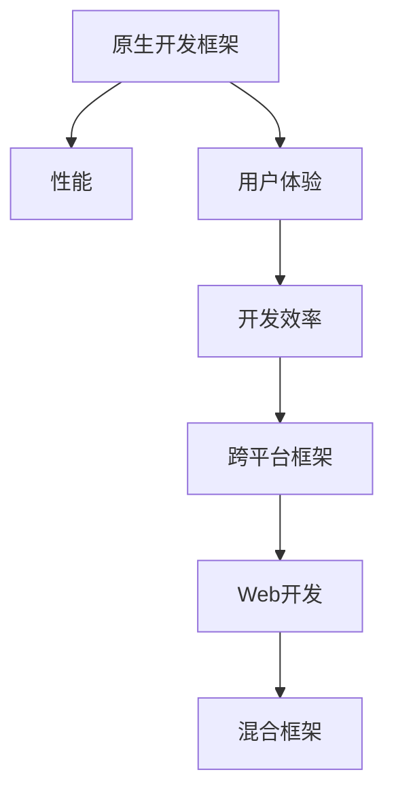

                 

# 移动端开发框架：为智能手机提升体验

> 关键词：移动端开发框架，用户体验，原生开发，跨平台，Web开发，混合应用，性能优化

## 1. 背景介绍

### 1.1 问题由来
移动设备的普及为应用程序开发带来了前所未有的机遇，但同时也带来了新的挑战。一方面，全球智能手机用户数已经超过20亿，应用程序市场需求庞大。另一方面，各平台间的技术差异显著，开发人员面临着开发效率和用户体验的挑战。这需要新的开发框架来提高开发效率、改善用户体验，并在不同的移动平台间实现无缝连接。

### 1.2 问题核心关键点
移动端开发框架（Mobile Development Framework）通过提供一套标准的编程接口和工具链，帮助开发人员在各种移动设备上快速、高效地构建应用程序。目前，主要有三种主流框架：原生开发框架、跨平台框架和混合框架。每种框架都有其优势和局限性，需要根据具体项目需求选择合适的技术方案。

## 2. 核心概念与联系

### 2.1 核心概念概述

为更好地理解移动端开发框架的原理和架构，本节将介绍几个关键概念：

- **原生开发框架**：如iOS的Swift语言、Android的Java和Kotlin语言，为移动平台提供高度定制化的应用程序，提供最理想的性能和用户体验，但需要学习新的编程语言和环境。

- **跨平台框架**：如React Native、Flutter等，使用一套代码实现跨多个移动平台的程序，减少了学习和维护成本，但部分功能可能不如原生框架表现优秀。

- **混合框架**：如Cordova、PhoneGap等，结合了Web开发和原生框架的优势，允许开发者使用HTML、CSS和JavaScript编写应用程序，并在原生环境运行，同时保持Web开发的灵活性和原生框架的性能。

这些核心概念之间的逻辑关系可以通过以下Mermaid流程图来展示：



这个流程图展示了几大移动开发框架的概念及其之间的关系：

1. 原生开发框架通过高度定制化的程序实现，能够提供最佳的性能和用户体验。
2. 跨平台框架使用一套代码实现跨平台程序，节省了开发成本和维护成本。
3. 混合框架结合了Web开发和原生框架的优点，既能保持Web的灵活性，又能享受原生框架的性能。

这些概念共同构成了移动开发的技术基础，使得开发人员能够在不同的移动平台间实现高效、灵活的应用程序开发。

## 3. 核心算法原理 & 具体操作步骤
### 3.1 算法原理概述

移动端开发框架的核心算法原理主要涉及以下三个方面：

1. **代码编译和执行**：框架通过编译器将开发人员编写的代码转化为移动平台的机器码，并进行执行。
2. **跨平台适配**：框架利用虚拟机技术或模板引擎，使一套代码能够在不同平台间实现，同时保证不同平台间的兼容性。
3. **性能优化**：框架通过优化算法和架构设计，提升程序的执行效率，确保在不同平台上的性能表现。

### 3.2 算法步骤详解

以下是使用Flutter框架进行移动端开发的具体操作步骤：

**Step 1: 安装Flutter**
1. 访问Flutter官网，下载并安装Flutter SDK。
2. 将Flutter添加到系统环境变量中。

**Step 2: 配置开发环境**
1. 安装Android Studio或Xcode，配置Flutter插件。
2. 设置Android或iOS模拟器，进行应用程序测试。

**Step 3: 创建项目**
1. 使用命令行或IDE创建新Flutter项目，定义项目的结构和目录。
2. 配置项目依赖和插件。

**Step 4: 编写代码**
1. 编写Dart代码，定义应用程序的逻辑和结构。
2. 使用Flutter提供的UI组件，构建应用程序界面。

**Step 5: 测试和发布**
1. 在模拟器和真实设备上进行测试，调试代码。
2. 优化性能，确保在不同设备上表现稳定。
3. 打包应用程序，发布到Google Play Store或App Store。

### 3.3 算法优缺点

移动端开发框架具有以下优点：

1. **跨平台开发**：一套代码实现多平台，大幅提高开发效率。
2. **快速迭代**：开发和部署周期短，易于快速响应市场需求。
3. **易于维护**：统一的技术栈，减少代码维护成本。
4. **用户一致性**：统一的UI组件和设计规范，确保不同平台间用户体验一致。

但同时也存在一些缺点：

1. **性能不足**：部分组件可能在性能上不如原生框架表现优秀。
2. **兼容性问题**：跨平台框架在不同设备上的表现可能存在差异。
3. **学习成本**：需要学习新的开发框架和工具，增加了学习成本。

### 3.4 算法应用领域

移动端开发框架在多个领域得到了广泛应用：

1. **企业应用**：用于构建企业内部管理、客户服务等应用程序。
2. **电子商务**：构建移动端购物、支付等电商功能。
3. **游戏开发**：开发移动平台上的游戏应用程序。
4. **教育培训**：开发在线教育、技能培训等应用程序。
5. **社交媒体**：构建社交网络、即时通讯等应用程序。
6. **旅游和美食**：开发旅游导览、美食推荐等应用程序。

这些应用场景表明，移动端开发框架已经成为现代应用程序开发不可或缺的一部分，大大提升了开发效率和用户体验。

## 4. 数学模型和公式 & 详细讲解 & 举例说明

### 4.1 数学模型构建

以Flutter为例，其数学模型主要涉及以下两个方面：

1. **UI布局模型**：使用Flexbox和Cascading Style Sheet（CSS）定义应用程序的布局。
2. **动画模型**：通过Tween动画实现平滑过渡效果。

### 4.2 公式推导过程

以下是Flutter中Flexbox布局的公式推导：

$$
\text{FlexItem} = \left\{ \begin{aligned}
& \text{Position:} \sum_i \left( x_i + \frac{1}{2} w_i \right), \\
& \text{Width:} \frac{1}{n} \left( \sum_i w_i - \sum_i \frac{1}{2} w_i \right), \\
& \text{Height:} h, \\
& \text{Baseline:} b_i
\end{aligned} \right.
$$

其中 $x_i$ 为FlexItem在父容器中的x坐标，$w_i$ 为FlexItem的宽度，$h$ 为FlexItem的高度，$b_i$ 为FlexItem的基线位置，$n$ 为FlexItem的数量。

### 4.3 案例分析与讲解

假设有一个包含两个FlexItem的容器，第一个FlexItem的宽度为100，高度为50，基线为0；第二个FlexItem的宽度为150，高度为100，基线为50。容器的宽度为200，高度为150。按照上述公式计算，第一个FlexItem的布局位置为(50, 50)，宽度为100，高度为50，基线为0；第二个FlexItem的布局位置为(150, 50)，宽度为50，高度为100，基线为50。

## 5. 项目实践：代码实例和详细解释说明
### 5.1 开发环境搭建

为了快速上手Flutter开发，开发者需要搭建以下开发环境：

1. 安装Flutter SDK和Flutter CLI。
2. 配置Android Studio或Xcode，添加Flutter插件。
3. 安装Flutter依赖工具，如Gradle、Flutter语言服务、Flutter Fast。
4. 创建新的Flutter项目，编写项目目录结构。
5. 配置项目依赖，添加必要的插件。

### 5.2 源代码详细实现

下面是一个简单的Flutter应用程序实现，用于在移动端显示当前日期和时间：

```dart
import 'package:flutter/material.dart';

void main() {
  runApp(MyApp());
}

class MyApp extends StatelessWidget {
  @override
  Widget build(BuildContext context) {
    return MaterialApp(
      home: Scaffold(
        appBar: AppBar(title: Text('Date and Time')),
        body: Center(child: DateTimeWidget()),
      ),
    );
  }
}

class DateTimeWidget extends StatefulWidget {
  @override
  DateTimeWidgetState createState() => DateTimeWidgetState();
}

class DateTimeWidgetState extends State<DateTimeWidget> {
  final DateTime now = DateTime.now();

  @override
  Widget build(BuildContext context) {
    return DateTimePicker(
      initialDateTime: now,
      firstDate: DateTime(2020, 1, 1),
      lastDate: DateTime(2099, 12, 31),
      onChanged: (DateTime newTime) {
        setState(() {
          now = newTime;
        });
      },
    );
  }
}
```

### 5.3 代码解读与分析

上述代码实现了Flutter应用程序的基本结构，包含以下要点：

1. 创建Flutter项目，定义项目目录结构。
2. 在项目中使用MaterialApp，创建Material设计风格的UI界面。
3. 在UI界面中添加Scaffold，定义APP Bar和body部分。
4. 在body部分添加DateTimeWidget，显示当前日期和时间。
5. 使用DateTimePicker，实现日期和时间的双向选择功能。

Flutter框架提供了丰富的UI组件和动画效果，使得开发者可以轻松地构建高质量的移动应用程序。

### 5.4 运行结果展示

运行上述代码，Flutter应用程序将显示一个日期和时间选择器，用户可以选择日期和时间，并显示在屏幕上。这展示了Flutter框架的高效和灵活性，能够在不同移动设备上提供一致的用户体验。

## 6. 实际应用场景
### 6.1 移动端社交应用

Flutter框架可以用于开发移动端的社交应用，如微信、微博等。通过Flutter，开发人员可以在不同平台间实现一致的用户界面，同时保持应用的性能和用户体验。

### 6.2 企业移动应用

企业可以使用Flutter框架快速构建内部管理系统，如人力资源、财务管理、客户服务等应用程序。通过统一的UI组件和开发框架，企业可以实现跨部门协作，提升工作效率。

### 6.3 电子商务应用

电子商务平台可以使用Flutter框架开发移动端的购物、支付等功能。通过跨平台框架，电商平台可以提供一致的购物体验，同时减少开发和维护成本。

### 6.4 教育培训应用

教育培训平台可以使用Flutter框架开发在线课程、技能培训等功能。通过Flutter提供的动画和交互效果，开发者可以创造生动有趣的教学体验，提升学习效果。

### 6.5 旅游和美食应用

旅游和美食应用可以使用Flutter框架开发导览、美食推荐等功能。通过统一的UI设计和开发框架，这些应用可以在不同平台间提供一致的体验，吸引更多的用户。

### 6.6 金融应用

金融应用可以使用Flutter框架开发移动端的支付、理财等功能。通过跨平台框架，金融应用可以提供一致的用户界面，提升用户的安全性和便利性。

## 7. 工具和资源推荐
### 7.1 学习资源推荐

为了帮助开发者掌握Flutter框架的使用，这里推荐一些优质的学习资源：

1. Flutter官网文档：Flutter官方文档，包含丰富的API文档和开发指南，是学习Flutter框架的必备资源。
2. Flutter教程：Flutter官网提供的交互式教程，涵盖基础和高级内容，适合初学者和有经验开发者。
3. Flutter开发手册：由Google官方发布，详细介绍了Flutter框架的架构和技术细节，是深入学习Flutter框架的参考资料。
4. Flutter最佳实践：由社区开发者编写，总结了Flutter框架的最佳实践和开发经验，是提升开发效率的宝贵资源。
5. Flutter应用开发实战：实战项目案例，帮助开发者掌握Flutter框架的实际应用，提升开发技能。

### 7.2 开发工具推荐

Flutter框架的开发需要以下工具支持：

1. Flutter SDK和CLI：用于开发和打包Flutter应用程序。
2. Android Studio或Xcode：用于调试和测试Flutter应用程序。
3. Gradle：Flutter应用程序的构建工具，用于依赖管理和包管理。
4. Dart语言服务：用于编写和调试Flutter代码，提供代码自动完成和错误提示功能。
5. Flutter Fast：用于加速Flutter应用程序的编译和构建，提升开发效率。

### 7.3 相关论文推荐

Flutter框架的发展源于学界的持续研究。以下是几篇奠基性的相关论文，推荐阅读：

1. Dart: A Language for Web, Mobile, and Server Applications：Dart语言的规范文档，详细介绍了Dart语言的特点和设计理念。
2. Flutter: Building Native Mobile Apps with a Single Language：Flutter框架的官方论文，介绍了Flutter框架的架构和技术实现。
3. Flutter: A Cross-Platform Development Framework for Mobile Apps：Flutter框架的学术论文，详细介绍了Flutter框架的性能优化和跨平台实现。

这些论文代表了Flutter框架的发展脉络，有助于开发者理解其核心原理和设计思想。

## 8. 总结：未来发展趋势与挑战
### 8.1 研究成果总结

本文对Flutter框架进行了全面系统的介绍，包括其背景、核心概念、算法原理、操作步骤和实际应用场景。通过详细的案例分析和代码实践，展示了Flutter框架的优势和使用方法。Flutter框架在移动开发领域的应用前景广阔，已经成为现代应用程序开发的重要工具。

### 8.2 未来发展趋势

展望未来，Flutter框架将呈现以下几个发展趋势：

1. **性能提升**：通过优化算法和架构设计，提升应用程序的执行效率，确保在不同平台上的性能表现。
2. **跨平台能力增强**：进一步提升跨平台适配能力，支持更多移动平台和操作系统。
3. **开发工具完善**：提供更加强大的开发工具和插件，提升开发效率和用户体验。
4. **生态系统扩展**：吸引更多第三方插件和开发者参与，构建更加丰富的生态系统。
5. **社区和文档支持**：通过社区和文档支持，提升Flutter框架的普及度和使用率。

以上趋势表明，Flutter框架将在移动开发领域持续发展，成为重要的开发工具。

### 8.3 面临的挑战

尽管Flutter框架已经取得了显著成就，但在其发展过程中也面临一些挑战：

1. **学习曲线陡峭**：开发者需要学习Dart语言和Flutter框架，学习成本较高。
2. **性能优化困难**：在性能要求高的场景下，Flutter框架的性能表现可能不如原生框架。
3. **社区支持不足**：部分功能可能缺乏社区支持和插件，限制了框架的灵活性和扩展性。
4. **安全性问题**：部分插件和组件可能存在安全性问题，需要开发者自行处理。
5. **生态系统不稳定**：第三方插件和库可能存在兼容性问题，影响应用程序的稳定性和一致性。

### 8.4 研究展望

针对上述挑战，未来的研究需要在以下几个方面寻求新的突破：

1. **简化学习曲线**：开发更加易用的开发工具和插件，降低学习成本。
2. **优化性能**：研究新的性能优化技术，提升Flutter框架的性能表现。
3. **增强安全性**：开发更安全的插件和组件，确保应用程序的安全性。
4. **扩展生态系统**：吸引更多开发者和第三方库，丰富Flutter框架的生态系统。
5. **加强社区支持**：提供更好的社区支持和技术文档，提升Flutter框架的普及度。

这些研究方向的探索，将进一步推动Flutter框架的发展，使其在移动开发领域发挥更大的作用。

## 9. 附录：常见问题与解答

**Q1: Flutter框架是否适用于所有移动平台？**

A: Flutter框架目前支持iOS和Android平台，可以跨平台开发。但部分功能和组件可能在其他移动平台上表现不佳。

**Q2: Flutter框架与原生开发框架相比，在性能上是否有差距？**

A: Flutter框架的性能表现不如原生框架，但在大多数场景下已经足够应对。部分性能要求高的场景，可能需要结合原生开发进行优化。

**Q3: 使用Flutter框架开发应用程序时，有哪些常见的性能优化技巧？**

A: 使用Flutter框架开发应用程序时，常见的性能优化技巧包括：

1. 使用高效的UI组件和布局模型，如Flexbox和Cascading Style Sheet。
2. 使用动画优化技巧，如Tween动画，提升平滑过渡效果。
3. 使用状态管理工具，如Provider和Bloc，优化组件之间的数据流动。
4. 使用Gradle构建工具，优化应用包的大小和依赖管理。
5. 使用代码优化工具，如分析工具和代码重构工具，提升开发效率。

**Q4: Flutter框架的使用是否需要学习新的编程语言？**

A: 使用Flutter框架开发应用程序，需要学习Dart语言。但Dart语言的学习曲线相对平滑，具备Java和C++等语言的基础即可上手。

**Q5: 使用Flutter框架开发应用程序时，有哪些常见的开发技巧？**

A: 使用Flutter框架开发应用程序时，常见的开发技巧包括：

1. 使用Material Design和Cupertino设计风格，确保UI的一致性和美观性。
2. 使用依赖管理工具，如Pub和Flutter Dependency，管理项目依赖和插件。
3. 使用状态管理工具，如Provider和Bloc，管理应用程序的状态和数据流。
4. 使用开发工具，如Dart语言服务和Flutter Fast，提升开发效率和代码质量。
5. 使用性能优化工具，如性能分析和代码重构工具，提升应用程序的性能表现。

通过这些开发技巧和性能优化方法，Flutter框架可以高效、灵活地实现移动应用程序的开发。

---

作者：禅与计算机程序设计艺术 / Zen and the Art of Computer Programming

