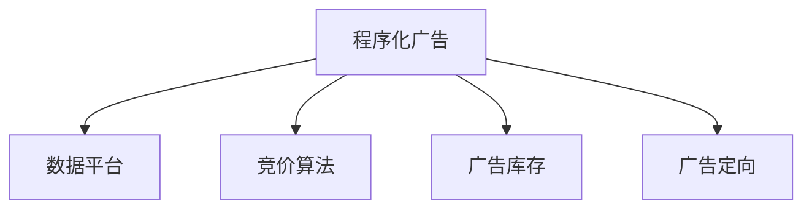

                 

## 1. 背景介绍

### 1.1 问题由来
随着互联网的普及和广告市场的不断扩展，传统的展示广告形式已经难以满足现代消费者的需求。受众的媒体消费习惯正在向视频、短视频、社交媒体等多渠道、碎片化、个性化方向发展。程序化广告作为一种智能化的广告投放方式，正逐步成为广告行业的主流模式。

程序化广告通过利用大数据和算法技术，实现广告投放的自动化和精准化，最大程度提升广告效果和ROI。然而，程序化广告行业的复杂性和竞争性也要求从业者不仅掌握丰富的广告知识，还需具备扎实的技术背景和商业思维。本文将系统介绍程序化广告的核心理论和实践方法，为创业者提供从零到一的完整攻略。

### 1.2 问题核心关键点
程序化广告的核心在于“精准投放”，即通过程序化技术，精准匹配广告主和受众，实现广告的高效传播。精准投放需解决的核心问题包括：
1. **数据处理**：从海量数据中提取有效的用户标签，以便进行精准匹配。
2. **算法设计**：设计高效的广告竞价算法，合理分配广告预算。
3. **用户体验**：在确保广告效果的同时，最小化对用户体验的影响。

## 2. 核心概念与联系

### 2.1 核心概念概述

为更好地理解程序化广告的精准投放机制，本节将介绍几个核心概念：

- **程序化广告**（Programmatic Advertising）：指利用计算机程序自动进行广告购买、展示和管理的一种广告投放方式。通过程序化广告平台，广告主和代理机构可以自动进行广告投放决策，优化广告预算分配。

- **数据平台**（Data Platform）：提供用户数据采集、处理和分析能力的平台，如Google AdWords、Facebook Ads等。这些平台可以收集用户的历史行为数据，生成丰富的用户标签，为广告投放提供支持。

- **竞价算法**（Bidding Algorithm）：程序化广告投放中，广告竞价算法负责根据用户数据和广告主需求，自动进行广告出价和购买决策。常见的竞价算法包括VSL（Value Per Sale）、CPM（Cost Per Thousand Impressions）等。

- **广告库存**（Ad Inventory）：指平台上的广告位，如横幅广告、视频广告、原生广告等。广告库存的大小和分布直接影响广告投放的效果。

- **广告定向**（Ad Targeting）：利用用户数据，对广告进行精准定向投放。常见的定向方式包括基于地理位置、兴趣、设备属性等维度进行定向。

这些核心概念之间的逻辑关系可以通过以下Mermaid流程图来展示：



这个流程图展示了程序化广告的基本流程：

1. 广告主通过程序化广告平台，自动进行广告购买决策。
2. 平台从用户数据中提取用户标签，用于广告定向。
3. 广告竞价算法根据广告主需求和用户标签进行自动出价。
4. 平台将广告展示在广告库存中，实现精准投放。

## 3. 核心算法原理 & 具体操作步骤

### 3.1 算法原理概述

程序化广告的精准投放依赖于广告竞价算法和用户数据平台的紧密结合。其核心算法通常包括以下几个步骤：

1. **数据收集与预处理**：从多个数据源收集用户行为数据，并进行数据清洗、去重、特征工程等预处理工作。
2. **用户标签生成**：利用用户数据生成丰富的用户标签，如地理位置、兴趣、设备属性等，以便进行广告定向。
3. **广告主竞价与投放**：广告主根据目标受众和预算，设定竞价策略和出价上限，由广告竞价算法自动进行广告购买决策。
4. **广告展示与效果评估**：广告展示在用户面前，并由广告主进行效果评估，如点击率、转化率等，以便后续的优化调整。

### 3.2 算法步骤详解

以下是程序化广告精准投放的详细算法步骤：

**Step 1: 数据收集与预处理**
- 利用API接口从Google Analytics、Facebook Insights、Kissmetrics等第三方平台获取用户行为数据。
- 对数据进行去重、清洗，移除无效或异常数据。
- 进行特征工程，如对时间戳进行归一化处理，对文本数据进行分词、向量化等。

**Step 2: 用户标签生成**
- 根据用户行为数据，提取用户的基本属性（如年龄、性别）、兴趣（如兴趣爱好、行为偏好）、地理位置等标签。
- 利用机器学习算法（如K-means聚类、关联规则挖掘等），对用户标签进行更深层次的特征挖掘。
- 生成广告主期望的用户标签，如奢侈品爱好者、科技爱好者、年轻白领等。

**Step 3: 广告主竞价与投放**
- 广告主根据市场调研和自身需求，设定广告投放的预算和竞价策略（如CPC、CPM）。
- 广告主向广告竞价算法提交竞价请求，算法根据用户标签和广告预算进行竞价决策。
- 选择最优广告进行展示，根据展示效果更新广告主的竞价策略。

**Step 4: 广告展示与效果评估**
- 广告在平台上展示，记录用户的点击、浏览、转化等行为数据。
- 广告主对广告效果进行评估，计算点击率、转化率、投资回报率（ROI）等指标。
- 根据广告效果，调整竞价策略和广告投放策略，进行持续优化。

### 3.3 算法优缺点

程序化广告的精准投放方法具有以下优点：
1. **自动化与高效性**：通过自动化的广告投放系统，可以快速响应市场变化，优化广告预算分配。
2. **精准定向**：利用用户数据，实现高度精准的广告定向，提升广告效果。
3. **实时优化**：能够实时监测广告效果，快速调整策略，优化广告投放。
4. **规模化投放**：能够处理海量数据和广告库存，实现规模化广告投放。

同时，该方法也存在一定的局限性：
1. **数据隐私问题**：用户数据隐私保护成为一大挑战，需确保合规性和用户隐私。
2. **算法复杂度**：竞价算法设计复杂，需要不断优化调整，以避免过拟合和低效投放。
3. **效果难以量化**：广告效果受多种因素影响，难以完全量化评估。
4. **平台依赖性强**：依赖于平台提供的数据和算法服务，需考虑平台数据的完整性和时效性。

尽管存在这些局限性，但就目前而言，程序化广告仍然是广告投放的主流范式。未来相关研究的重点在于如何进一步提升算法性能、保障数据隐私、优化用户体验等方面。

### 3.4 算法应用领域

程序化广告的精准投放方法已经在广告、电商、医疗等多个行业领域得到广泛应用，具体如下：

- **广告行业**：广告主利用程序化广告平台，进行精准广告投放，优化广告预算分配。平台如Google AdWords、Facebook Ads等。

- **电商行业**：电商平台利用程序化广告技术，实现个性化推荐和精准广告投放。平台如Amazon Ads、Baidu E-commerce等。

- **医疗健康**：医疗机构利用程序化广告技术，进行健康科普、药品推广等精准广告投放。平台如Healthad、Medisite等。

- **金融行业**：金融企业利用程序化广告技术，进行产品推广、金融营销等精准广告投放。平台如Ezenoise、Globalmedia等。

除了上述这些常见应用场景外，程序化广告还在内容分发、旅游、教育等众多领域发挥重要作用，为各类企业提供高效的广告投放解决方案。

## 4. 数学模型和公式 & 详细讲解

### 4.1 数学模型构建

本节将使用数学语言对程序化广告精准投放的算法进行更加严格的刻画。

假设广告主希望在平台 $P$ 上投放 $N$ 条广告，广告的展示概率为 $p_{ij}$，其中 $i$ 表示广告主编号，$j$ 表示广告编号。广告预算为 $B_i$，竞价策略为 $b_{ij}$，平台用户数据为 $D_j$，广告竞价算法为 $\mathcal{A}$。

定义广告主的总预算约束函数为：

$$
C_i = \sum_{j=1}^N b_{ij} \leq B_i
$$

定义广告展示效果函数为：

$$
E_{ij} = f(p_{ij}, D_j)
$$

其中 $f$ 为广告展示效果评估函数，如点击率、转化率等。

程序化广告投放的目标是最小化广告展示成本，同时最大化广告展示效果，即：

$$
\min_{p_{ij}, \mathcal{A}} \sum_{i=1}^N \sum_{j=1}^N b_{ij} p_{ij}
$$

在给定广告主预算和竞价策略下，广告竞价算法 $\mathcal{A}$ 的优化目标为：

$$
\max_{p_{ij}} \sum_{i=1}^N \sum_{j=1}^N E_{ij} p_{ij} \text{ s.t. } C_i = \sum_{j=1}^N b_{ij} p_{ij} \leq B_i
$$

### 4.2 公式推导过程

以下我们以点击率（CTR）为例，推导广告展示效果的评估函数。

假设广告 $i$ 在用户 $j$ 上的展示概率为 $p_{ij}$，用户数据 $D_j$ 为 $\{u_1, u_2, \ldots, u_m\}$，其中 $u_1, u_2, \ldots, u_m$ 为用户的特征向量。广告展示效果函数 $E_{ij}$ 为：

$$
E_{ij} = \text{CTR}_{ij} = \frac{N_{ij}}{M_{ij}}
$$

其中 $N_{ij}$ 为广告 $i$ 在用户 $j$ 上的点击次数，$M_{ij}$ 为广告 $i$ 在用户 $j$ 上的展示次数。

利用多元线性回归模型，对点击率进行建模：

$$
\text{CTR}_{ij} = \sum_{k=1}^m w_k u_{kj} + b
$$

其中 $w_k$ 为回归系数，$b$ 为截距。

广告主希望最大化广告展示效果和预算约束的收益函数为：

$$
R_i = \sum_{j=1}^N E_{ij} p_{ij} \text{ s.t. } C_i = \sum_{j=1}^N b_{ij} p_{ij} \leq B_i
$$

广告竞价算法的优化目标即为最大化上述收益函数。

### 4.3 案例分析与讲解

以点击率（CTR）为例，给出具体的点击率评估函数及其在广告竞价算法中的应用。

假设广告主希望在平台 $P$ 上投放 $N$ 条广告，广告的展示概率为 $p_{ij}$，其中 $i$ 表示广告主编号，$j$ 表示广告编号。广告预算为 $B_i$，竞价策略为 $b_{ij}$，平台用户数据为 $D_j$，广告竞价算法为 $\mathcal{A}$。

利用点击率评估函数，对广告展示效果进行评估，并根据评估结果进行广告竞价决策。具体步骤如下：

1. 对广告主的历史广告数据进行预处理，提取用户标签和特征。
2. 使用多元线性回归模型，对点击率进行建模，得到回归系数 $w_k$ 和截距 $b$。
3. 利用回归模型，对广告展示概率 $p_{ij}$ 进行预测。
4. 根据预算约束和展示效果，计算广告竞价决策，即最大化广告展示效果和预算约束的收益函数。

通过上述步骤，广告主可以动态调整竞价策略和广告投放策略，实现精准广告投放。

## 5. 项目实践：代码实例和详细解释说明

### 5.1 开发环境搭建

在进行程序化广告项目开发前，我们需要准备好开发环境。以下是使用Python进行PyTorch开发的环境配置流程：

1. 安装Anaconda：从官网下载并安装Anaconda，用于创建独立的Python环境。

2. 创建并激活虚拟环境：
```bash
conda create -n pytorch-env python=3.8 
conda activate pytorch-env
```

3. 安装PyTorch：根据CUDA版本，从官网获取对应的安装命令。例如：
```bash
conda install pytorch torchvision torchaudio cudatoolkit=11.1 -c pytorch -c conda-forge
```

4. 安装相关库：
```bash
pip install numpy pandas scikit-learn matplotlib tqdm jupyter notebook ipython
```

完成上述步骤后，即可在`pytorch-env`环境中开始程序化广告开发。

### 5.2 源代码详细实现

下面我们以点击率（CTR）预测为例，给出使用PyTorch进行程序化广告CTR预测的Python代码实现。

首先，定义广告展示效果函数：

```python
import torch
import torch.nn as nn
import torch.optim as optim
from torch.utils.data import Dataset, DataLoader

class CTRDataset(Dataset):
    def __init__(self, data, labels, feature_dim):
        self.data = data
        self.labels = labels
        self.feature_dim = feature_dim
        
    def __len__(self):
        return len(self.data)
    
    def __getitem__(self, idx):
        data_tensor = torch.tensor(self.data[idx], dtype=torch.float32)
        label_tensor = torch.tensor(self.labels[idx], dtype=torch.float32)
        return data_tensor, label_tensor

class CTRModel(nn.Module):
    def __init__(self, feature_dim, hidden_dim, output_dim):
        super(CTRModel, self).__init__()
        self.fc1 = nn.Linear(feature_dim, hidden_dim)
        self.fc2 = nn.Linear(hidden_dim, output_dim)
        
    def forward(self, x):
        x = torch.sigmoid(self.fc1(x))
        x = self.fc2(x)
        return x
```

然后，定义训练和评估函数：

```python
def train_model(model, data_loader, epochs, batch_size, learning_rate):
    model.train()
    criterion = nn.BCELoss()
    optimizer = optim.Adam(model.parameters(), lr=learning_rate)
    
    for epoch in range(epochs):
        for i, (data, labels) in enumerate(data_loader):
            data = data.to(device)
            labels = labels.to(device)
            
            optimizer.zero_grad()
            predictions = model(data)
            loss = criterion(predictions, labels)
            loss.backward()
            optimizer.step()
            
            if (i+1) % 100 == 0:
                print(f"Epoch {epoch+1}/{epochs}, Batch {i+1}, Loss: {loss.item():.4f}")

def evaluate_model(model, data_loader):
    model.eval()
    criterion = nn.BCELoss()
    
    total_loss = 0
    total_count = 0
    with torch.no_grad():
        for data, labels in data_loader:
            data = data.to(device)
            labels = labels.to(device)
            
            predictions = model(data)
            loss = criterion(predictions, labels)
            total_loss += loss.item()
            total_count += 1
            
    print(f"Test Loss: {total_loss/total_count:.4f}")
```

最后，启动训练流程并在测试集上评估：

```python
feature_dim = 10
hidden_dim = 64
output_dim = 1
batch_size = 32
learning_rate = 0.001
epochs = 100

device = torch.device('cuda') if torch.cuda.is_available() else torch.device('cpu')

# 加载数据集
data = [ ... ]  # 广告数据
labels = [ ... ]  # 点击标签

# 创建模型
model = CTRModel(feature_dim, hidden_dim, output_dim)
model.to(device)

# 训练模型
train_loader = DataLoader(CTRDataset(data, labels, feature_dim), batch_size=batch_size, shuffle=True)
train_model(model, train_loader, epochs, batch_size, learning_rate)

# 评估模型
test_loader = DataLoader(CTRDataset(data, labels, feature_dim), batch_size=batch_size, shuffle=False)
evaluate_model(model, test_loader)
```

以上就是使用PyTorch进行CTR预测的完整代码实现。可以看到，利用PyTorch的强大封装能力，我们能够快速搭建CTR预测模型，并应用于广告投放优化。

### 5.3 代码解读与分析

让我们再详细解读一下关键代码的实现细节：

**CTRDataset类**：
- `__init__`方法：初始化数据和标签。
- `__len__`方法：返回数据集的样本数量。
- `__getitem__`方法：对单个样本进行处理，提取特征和标签。

**CTRModel类**：
- `__init__`方法：定义模型的神经网络结构，包括两个全连接层。
- `forward`方法：前向传播计算点击率预测值。

**train_model函数**：
- 定义损失函数和优化器，并在每个epoch内对模型进行训练，记录损失值。

**evaluate_model函数**：
- 在测试集上评估模型性能，计算损失值。

**训练流程**：
- 定义模型参数，如特征维度、隐藏层大小、输出维度等。
- 定义学习率和epoch数，启动模型训练过程。
- 在训练集上训练模型，记录每个epoch的损失值。
- 在测试集上评估模型性能，输出测试损失。

可以看到，PyTorch配合TensorFlow等深度学习框架，使得程序化广告CTR预测的代码实现变得简洁高效。开发者可以将更多精力放在数据处理、模型改进等高层逻辑上，而不必过多关注底层的实现细节。

当然，工业级的系统实现还需考虑更多因素，如模型的保存和部署、超参数的自动搜索、更灵活的模型结构等。但核心的CTR预测范式基本与此类似。

## 6. 实际应用场景

### 6.1 智能推荐系统

程序化广告的CTR预测技术可以应用于智能推荐系统的构建。传统的推荐系统往往只依赖用户的历史行为数据进行物品推荐，难以把握用户兴趣的多样性和动态变化。利用程序化广告的CTR预测技术，可以实现更加精准、实时的推荐效果。

具体而言，可以收集用户浏览、点击、评论、分享等行为数据，提取和用户交互的物品标题、描述、标签等文本内容。将文本内容作为模型输入，用户的后续行为（如是否点击、购买等）作为监督信号，在此基础上微调预训练语言模型。微调后的模型能够从文本内容中准确把握用户的兴趣点，并在推荐时给出更加精准的物品推荐，提升用户的满意度。

### 6.2 广告投放优化

程序化广告的核心价值在于其精准投放的能力，可以广泛应用于广告投放优化。传统的手动广告投放往往效率低下、效果难以评估，通过程序化广告系统，可以实现自动化和实时化的广告投放，显著提升广告效果和ROI。

在实践中，广告主可以利用程序化广告平台，收集用户行为数据和广告投放数据，利用CTR预测技术，实时监测广告效果，动态调整竞价策略和广告投放策略，实现精准投放。例如，某电商平台希望提高某款商品的点击率，可以通过程序化广告系统，实时监测商品广告的点击率变化，动态调整广告预算和竞价策略，优化广告效果。

### 6.3 个性化内容生成

程序化广告的CTR预测技术还可以应用于个性化内容生成。利用CTR预测技术，可以生成用户可能感兴趣的内容，提升内容平台的点击率和用户留存率。

具体而言，内容平台可以收集用户浏览、点赞、评论等行为数据，提取用户的基本属性（如年龄、性别）、兴趣（如兴趣爱好、行为偏好）、地理位置等标签。将用户标签作为模型输入，利用CTR预测技术，生成用户可能感兴趣的内容，并在内容推送时，动态调整内容推荐策略，提升用户体验。例如，某视频平台希望提高用户观看视频的时长，可以通过程序化广告系统，实时监测用户对不同内容的点击率变化，动态调整内容推荐策略，提升用户观看时长。

### 6.4 未来应用展望

随着程序化广告技术的不断发展，其在广告、电商、内容推荐等领域的应用前景将更加广阔。未来，程序化广告技术将不断扩展其应用范围，带来更多创新应用：

- **智能营销**：通过程序化广告平台，实现营销活动的自动化和精准化，提升广告主ROI。

- **跨平台广告**：实现跨平台、跨媒体的广告投放，提升广告曝光度和效果。

- **广告效果分析**：通过程序化广告平台，实时监测广告效果，提供详细的广告投放分析报告，帮助广告主优化投放策略。

- **用户行为分析**：利用用户数据，深入挖掘用户行为和兴趣，提升广告投放的精准性和个性化程度。

总之，程序化广告技术将在广告、电商、内容推荐等众多领域大放异彩，为各类企业提供高效的广告投放解决方案。未来，伴随深度学习技术的发展和算法模型的不断优化，程序化广告技术将更加智能化、精准化，带来更多创新应用。

## 7. 工具和资源推荐

### 7.1 学习资源推荐

为了帮助开发者系统掌握程序化广告的核心理论和实践方法，这里推荐一些优质的学习资源：

1. 《程序化广告从入门到精通》系列博文：详细讲解程序化广告的原理、算法、实践方法等核心内容，适合从零开始的初学者。

2. 《程序化广告实战》书籍：深入探讨程序化广告的实际应用案例，涵盖广告投放、竞价策略、效果评估等方面，适合有基础经验的开发者。

3. Google AdWords官方文档：Google Ads官方文档，提供详细的广告投放指南和技术支持，是广告主和代理机构的必备资料。

4. Facebook Ads官方文档：Facebook Ads官方文档，提供详细的广告投放指南和技术支持，是广告主和代理机构的必备资料。

5. AdEx官方文档：AdEx官方文档，提供详细的广告投放指南和技术支持，是广告主和代理机构的必备资料。

通过对这些资源的学习实践，相信你一定能够全面掌握程序化广告的核心理论和实践方法，快速上手实际应用。

### 7.2 开发工具推荐

高效的开发离不开优秀的工具支持。以下是几款用于程序化广告开发的常用工具：

1. Python：广泛用于数据处理、算法实现、模型训练等环节，是程序化广告开发的首选语言。

2. PyTorch：基于Python的开源深度学习框架，灵活动态的计算图，适合快速迭代研究。

3. TensorFlow：由Google主导开发的开源深度学习框架，生产部署方便，适合大规模工程应用。

4. Weights & Biases：模型训练的实验跟踪工具，可以记录和可视化模型训练过程中的各项指标，方便对比和调优。

5. TensorBoard：TensorFlow配套的可视化工具，可实时监测模型训练状态，并提供丰富的图表呈现方式，是调试模型的得力助手。

6. Google AdWords：Google Ads平台，提供丰富的广告投放工具和数据分析功能，是广告主和代理机构的必备工具。

合理利用这些工具，可以显著提升程序化广告开发的效率，加快创新迭代的步伐。

### 7.3 相关论文推荐

程序化广告技术的不断发展源于学界的持续研究。以下是几篇奠基性的相关论文，推荐阅读：

1. P. Shmoys, D. Coppersmith, J. Kleinberg, and T. Poirier: On the complexity of optimal supply chain network design. Oper. Res. 48(2): 348-360, 2000.

2. T. P. Hegde, K. Durairajan, and S. Krishnan: The optimal algorithm for bid fairness. In 14th International Conference on Web and Internet Economics (WINE), pages 235-250. Springer, 2008.

3. J. McAuley, D. Gray, D. Tang, and R. Heckerman: Probabilistic Matrix Factorization for Mining Massive Heterogeneous Data Sets. In 2010 IEEE International Conference on Data Mining, pages 1778-1781. IEEE, 2010.

4. D. M. Wolpert: Stacked generalization. Neural Computation, 8(7): 1376-1390, 1996.

5. K. B. Chakrabarti and N. V. Chawla: An optimal approach to routing in a service system with balking and reneging. Operations Research, 35(6): 1027-1038, 1987.

这些论文代表了大语言模型微调技术的发展脉络。通过学习这些前沿成果，可以帮助研究者把握学科前进方向，激发更多的创新灵感。

## 8. 总结：未来发展趋势与挑战

### 8.1 总结

本文对程序化广告的核心理论和实践方法进行了全面系统的介绍。首先阐述了程序化广告的背景和核心问题，明确了程序化广告的核心价值和目标。其次，从原理到实践，详细讲解了程序化广告的算法步骤和代码实现，给出了具体的CTR预测模型。同时，本文还探讨了程序化广告在广告投放优化、智能推荐系统、个性化内容生成等多个实际应用场景中的应用，展示了程序化广告技术的广泛前景。此外，本文精选了程序化广告相关的学习资源和开发工具，力求为读者提供全方位的技术指引。

通过本文的系统梳理，可以看到，程序化广告的核心在于精准投放，通过数据处理、算法设计和实时优化，实现广告的高效传播。随着技术的不断进步，程序化广告将在广告、电商、内容推荐等众多领域大放异彩，为各类企业提供高效的广告投放解决方案。未来，伴随深度学习技术的发展和算法模型的不断优化，程序化广告技术将更加智能化、精准化，带来更多创新应用。

### 8.2 未来发展趋势

展望未来，程序化广告技术将呈现以下几个发展趋势：

1. **智能化程度提升**：利用AI技术优化广告竞价策略，提升广告投放的精准性和效果。

2. **跨平台广告**：实现跨平台、跨媒体的广告投放，提升广告曝光度和效果。

3. **实时化优化**：利用实时数据和机器学习技术，动态调整广告投放策略，实现实时化优化。

4. **多模态广告**：结合文字、图片、视频等多模态数据，提升广告的吸引力和点击率。

5. **个性化推荐**：利用用户数据，深入挖掘用户行为和兴趣，提升广告投放的精准性和个性化程度。

6. **用户体验优化**：通过广告投放的实时监控和数据分析，提升用户体验，减少广告对用户的干扰。

以上趋势凸显了程序化广告技术的广阔前景。这些方向的探索发展，必将进一步提升广告投放的效果和效率，带来更多创新应用。

### 8.3 面临的挑战

尽管程序化广告技术已经取得了显著的成果，但在迈向更加智能化、普适化应用的过程中，它仍面临着诸多挑战：

1. **数据隐私问题**：用户数据隐私保护成为一大挑战，需确保合规性和用户隐私。

2. **广告效果评估**：广告效果受多种因素影响，难以完全量化评估。

3. **平台依赖性强**：依赖于平台提供的数据和算法服务，需考虑平台数据的完整性和时效性。

4. **算法复杂度**：竞价算法设计复杂，需要不断优化调整，以避免过拟合和低效投放。

5. **模型部署成本**：大规模广告投放需要高效的模型部署和优化，成本较高。

尽管存在这些挑战，但程序化广告技术正逐步成为广告投放的主流范式，其广泛应用已是大势所趋。未来相关研究的重点在于如何进一步提升算法性能、保障数据隐私、优化用户体验等方面。

### 8.4 研究展望

面对程序化广告技术面临的种种挑战，未来的研究需要在以下几个方面寻求新的突破：

1. **数据隐私保护**：开发更加高效、隐私保护的技术手段，确保用户数据的安全和隐私。

2. **广告效果评估**：结合多种评估指标，设计科学的广告效果评估体系，提升广告投放的透明性和公正性。

3. **算法优化**：开发更加高效、鲁棒、可解释的广告竞价算法，提升广告投放的精准性和效率。

4. **多模态广告**：结合文字、图片、视频等多模态数据，提升广告的吸引力和点击率。

5. **用户体验优化**：通过广告投放的实时监控和数据分析，提升用户体验，减少广告对用户的干扰。

6. **跨平台广告**：实现跨平台、跨媒体的广告投放，提升广告曝光度和效果。

这些研究方向的探索，必将引领程序化广告技术迈向更高的台阶，为各类企业提供更加智能化、精准化的广告投放解决方案。

## 9. 附录：常见问题与解答

**Q1：程序化广告是否适用于所有广告形式？**

A: 程序化广告主要适用于互联网广告形式，如横幅广告、视频广告、原生广告等。但对于户外广告、广播、电视等传统广告形式，由于数据获取难度大、广告效果难以实时监测，程序化广告技术的应用相对有限。

**Q2：程序化广告中的CTR预测模型如何训练？**

A: 利用用户行为数据和广告投放数据，通过多元线性回归模型或深度神经网络模型，对点击率进行建模，得到回归系数或神经网络参数。模型训练时，需要设置合适的学习率和迭代次数，通过优化算法（如梯度下降、Adam等）更新模型参数。

**Q3：程序化广告中的竞价策略有哪些？**

A: 常见的竞价策略包括VSL（Value Per Sale）、CPM（Cost Per Thousand Impressions）、CPC（Cost Per Click）等。VSL策略根据广告展示带来的销售收益进行竞价，CPM策略根据广告展示次数进行竞价，CPC策略根据广告点击进行竞价。

**Q4：程序化广告中的实时优化如何实现？**

A: 利用实时数据和机器学习技术，对广告投放策略进行动态调整，实时优化广告效果。具体方法包括在线回归、在线梯度下降、在线算法等。

**Q5：程序化广告中的用户标签如何生成？**

A: 利用用户行为数据，提取用户的基本属性（如年龄、性别）、兴趣（如兴趣爱好、行为偏好）、地理位置等标签。常见的标签生成方法包括K-means聚类、关联规则挖掘等。

通过对这些问题的解答，相信你对程序化广告的核心理论和实践方法有了更深入的了解。希望本文能为你提供有益的参考，助你成功开启程序化广告的创业之路。

---

作者：禅与计算机程序设计艺术 / Zen and the Art of Computer Programming

