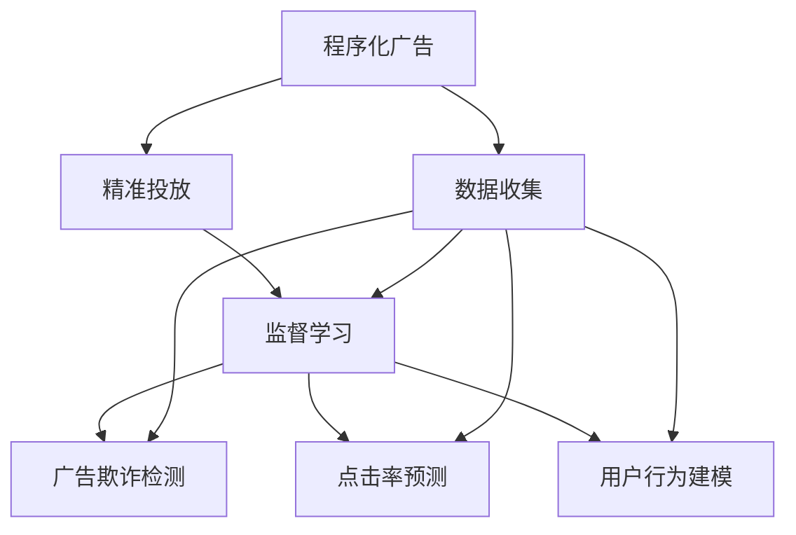

                 

## 1. 背景介绍

### 1.1 问题由来

程序化广告（Programmatic Advertising）作为数字广告行业的重要组成部分，正在经历一场由传统手动广告投放向自动化、智能化投放的转变。随着互联网、移动终端和智能设备的发展，用户触点更加多样化、碎片化，传统的手动广告投放效率低下、成本高昂、精准度有限。而程序化广告依托于大数据和人工智能技术，能够实现精准投放，提升广告效率和转化率，降低投放成本。

然而，虽然程序化广告发展迅速，但实际应用中仍面临诸多问题，如用户隐私保护、数据安全、广告欺诈等，需要进一步优化和完善。本文将探讨程序化广告创业的相关核心概念，并给出基于监督学习方法的精准投放策略，结合实际项目开发环境，展示如何通过深度学习算法构建高效、可靠的广告投放系统。

### 1.2 问题核心关键点

程序化广告的核心在于精准投放。精准投放不仅意味着投放的用户群体要符合广告主的预算和目标，更重要的是投放的物料、创意要与用户的兴趣和需求高度匹配，从而达到最佳广告效果。然而，精准投放不仅涉及到数据收集和分析，还需要结合机器学习算法，对用户行为进行建模和预测，从而实现广告投放的自动化和智能化。

基于监督学习的方法是程序化广告投放的重要手段。监督学习通过对历史广告投放数据进行标注，训练出精准投放的模型，并应用于实时投放决策中。本文将深入探讨基于监督学习的广告投放算法原理、具体操作步骤、应用领域，并结合实际项目开发环境，展示如何通过深度学习算法构建高效、可靠的广告投放系统。

## 2. 核心概念与联系

### 2.1 核心概念概述

为更好地理解基于监督学习程序化广告投放方法，本节将介绍几个密切相关的核心概念：

- **程序化广告（Programmatic Advertising）**：通过程序化的方式进行广告投放，实现广告主与广告代理商之间的自动化交易，提升广告投放的效率和精准度。

- **精准投放（Precision Marketing）**：基于用户行为数据和预测模型，对用户进行精准定位，实现个性化的广告投放。

- **监督学习（Supervised Learning）**：使用已标注的数据进行模型训练，通过输入特征和标签数据，学习出预测模型的过程。

- **广告欺诈（Ad Fraud）**：指广告投放中，广告位被非法占用，导致广告主广告费被浪费的现象。

- **点击率预测（CTR Prediction）**：通过预测广告投放中的点击率，实现广告投放的优化和精准化。

- **用户行为建模（User Behavior Modeling）**：基于用户行为数据，构建用户兴趣和需求模型，指导精准投放。

这些核心概念之间的逻辑关系可以通过以下Mermaid流程图来展示：



这个流程图展示了大语言模型的核心概念及其之间的关系：

1. 程序化广告通过数据收集获取用户行为数据。
2. 精准投放使用监督学习方法，对用户进行精准定位。
3. 广告欺诈检测使用监督学习技术，识别非法投放行为。
4. 点击率预测使用监督学习，优化广告投放效果。
5. 用户行为建模使用监督学习，构建用户兴趣和需求模型。

这些概念共同构成了程序化广告投放的完整框架，使其能够实现自动化的精准投放。

## 3. 核心算法原理 & 具体操作步骤

### 3.1 算法原理概述

基于监督学习的程序化广告投放方法，其核心思想是通过历史广告投放数据，训练出精准投放的预测模型，实时应用于广告投放决策中。具体来说，分为以下几个步骤：

1. **数据收集**：从广告主和广告代理商处收集历史广告投放数据，并标注用户行为数据。
2. **特征工程**：设计输入特征，如广告创意、用户设备、地理位置、行为数据等，用于训练模型。
3. **模型训练**：使用历史广告投放数据和标注数据，训练出点击率预测模型，用于评估广告效果。
4. **实时投放**：在实际广告投放中，使用模型对用户进行精准投放，并实时监测投放效果。
5. **优化调整**：根据投放效果，调整模型参数和投放策略，提升广告投放效果。

### 3.2 算法步骤详解

基于监督学习的程序化广告投放算法步骤详解如下：

**Step 1: 准备数据集**
- 收集历史广告投放数据，包括广告创意、投放渠道、用户设备、地理位置等。
- 收集用户行为数据，如点击行为、浏览行为、购买行为等，并标注标签（点击与否）。

**Step 2: 特征工程**
- 设计输入特征，如广告创意的文本表示、用户设备类型、地理位置、浏览历史等。
- 对特征进行归一化、编码等预处理。

**Step 3: 模型训练**
- 使用历史广告投放数据和标注数据，训练出点击率预测模型。
- 常见的模型包括逻辑回归、线性回归、决策树、随机森林等。

**Step 4: 实时投放**
- 在实际广告投放中，使用模型对用户进行精准投放。
- 根据用户特征和模型预测，选择最匹配的广告创意进行投放。

**Step 5: 效果评估**
- 实时监测广告投放效果，如点击率、转化率、广告曝光量等。
- 根据效果评估，调整模型参数和投放策略。

**Step 6: 优化调整**
- 根据效果评估，调整模型参数和投放策略。
- 对不理想的广告创意进行优化或替换，提升投放效果。

### 3.3 算法优缺点

基于监督学习的程序化广告投放方法具有以下优点：
1. 自动化程度高。模型能够自动生成广告投放决策，节省大量手动操作。
2. 精准度高。模型可以根据用户行为数据，实现精准投放，提升广告效果。
3. 可解释性强。模型输出可以提供详细的投放理由，便于广告主和代理商理解。

同时，该方法也存在一定的局限性：
1. 依赖标注数据。模型的效果很大程度上取决于标注数据的质量和数量，获取高质量标注数据的成本较高。
2. 模型泛化能力有限。当目标用户群体与历史数据分布差异较大时，模型的泛化能力可能会受到影响。
3. 数据隐私问题。用户行为数据的收集和处理需要符合数据隐私法规，如GDPR等。

尽管存在这些局限性，但就目前而言，基于监督学习的程序化广告投放方法仍是大规模投放的重要手段。未来相关研究的重点在于如何进一步降低标注数据的依赖，提高模型的泛化能力，同时兼顾数据隐私和安全性等因素。

### 3.4 算法应用领域

基于监督学习的程序化广告投放方法，已经在各种NLP任务上得到了广泛应用，覆盖了广告投放、精准营销、用户行为分析等多个领域：

- **广告投放优化**：通过对历史广告投放数据进行建模和预测，优化广告投放策略，提升广告效果。
- **精准营销**：根据用户行为数据，实现个性化推荐和精准投放。
- **用户行为分析**：通过对用户行为数据进行分析，挖掘用户兴趣和需求，提升用户体验。
- **广告欺诈检测**：使用监督学习技术，识别和防范广告欺诈行为。
- **点击率预测**：通过预测广告投放中的点击率，优化广告投放效果。
- **用户行为建模**：构建用户兴趣和需求模型，指导精准投放。

## 4. 数学模型和公式 & 详细讲解

### 4.1 数学模型构建

本节将使用数学语言对基于监督学习的程序化广告投放过程进行更加严格的刻画。

记广告投放数据集为 $\mathcal{D}=\{(x_i, y_i)\}_{i=1}^N$，其中 $x_i$ 为广告投放特征向量，$y_i \in \{0, 1\}$ 为广告是否被点击的标签。假设点击率预测模型为 $M_{\theta}(x)$，其中 $\theta$ 为模型参数。模型的预测结果为 $y^{'}_i = M_{\theta}(x_i)$。则点击率预测模型的损失函数为：

$$
\mathcal{L}(\theta) = \frac{1}{N}\sum_{i=1}^N \ell(y_i, y^{'}_i)
$$

其中 $\ell$ 为损失函数，常见的有交叉熵损失函数、均方误差损失函数等。

### 4.2 公式推导过程

以逻辑回归为例，其预测函数为：

$$
M_{\theta}(x) = \sigma(\theta^T x)
$$

其中 $\sigma$ 为逻辑函数，$\theta^T x$ 为线性判别函数。则交叉熵损失函数为：

$$
\ell(y_i, y^{'}_i) = -y_i\log y^{'}_i - (1-y_i)\log(1-y^{'}_i)
$$

将 $\ell(y_i, y^{'}_i)$ 代入损失函数公式，得：

$$
\mathcal{L}(\theta) = -\frac{1}{N}\sum_{i=1}^N [y_i\log M_{\theta}(x_i)+(1-y_i)\log(1-M_{\theta}(x_i))]
$$

通过梯度下降等优化算法，最小化损失函数，更新模型参数 $\theta$，得到最优参数 $\hat{\theta}$：

$$
\hat{\theta} = \mathop{\arg\min}_{\theta} \mathcal{L}(\theta)
$$

### 4.3 案例分析与讲解

以点击率预测为例，我们取一些简单特征，如广告创意的文本表示、用户设备类型、地理位置等，来训练逻辑回归模型。

```python
import pandas as pd
import numpy as np
from sklearn.linear_model import LogisticRegression
from sklearn.metrics import accuracy_score

# 假设数据集为 Pandas DataFrame
data = pd.read_csv('ad_data.csv')

# 假设特征包括广告创意、用户设备、地理位置等
X = data[['ad_text', 'device_type', 'location']]

# 假设标签为点击与否
y = data['clicked']

# 将数据拆分为训练集和测试集
X_train, X_test, y_train, y_test = train_test_split(X, y, test_size=0.2)

# 训练逻辑回归模型
model = LogisticRegression()
model.fit(X_train, y_train)

# 在测试集上评估模型性能
y_pred = model.predict(X_test)
accuracy = accuracy_score(y_test, y_pred)
print(f"Accuracy: {accuracy}")
```

上述代码展示了使用逻辑回归进行广告点击率预测的基本流程。在实际应用中，需要考虑更多复杂特征，如广告创意的深度表示、用户行为的深度特征等，以提升模型性能。

## 5. 项目实践：代码实例和详细解释说明

### 5.1 开发环境搭建

在进行程序化广告投放实践前，我们需要准备好开发环境。以下是使用Python进行Scikit-learn开发的环境配置流程：

1. 安装Anaconda：从官网下载并安装Anaconda，用于创建独立的Python环境。

2. 创建并激活虚拟环境：
```bash
conda create -n ad_env python=3.8 
conda activate ad_env
```

3. 安装Scikit-learn：
```bash
pip install scikit-learn
```

4. 安装各类工具包：
```bash
pip install pandas numpy matplotlib jupyter notebook ipython
```

完成上述步骤后，即可在`ad_env`环境中开始程序化广告投放的实践。

### 5.2 源代码详细实现

下面我们以广告投放优化为例，给出使用Scikit-learn进行点击率预测的PyTorch代码实现。

首先，定义广告投放数据处理函数：

```python
from sklearn.model_selection import train_test_split
from sklearn.linear_model import LogisticRegression
from sklearn.metrics import accuracy_score
from sklearn.preprocessing import StandardScaler

def process_data(data):
    X = data[['ad_text', 'device_type', 'location']]
    y = data['clicked']
    # 对特征进行标准化处理
    scaler = StandardScaler()
    X_scaled = scaler.fit_transform(X)
    return X_scaled, y

# 加载广告投放数据
X, y = process_data(data)

# 将数据拆分为训练集和测试集
X_train, X_test, y_train, y_test = train_test_split(X, y, test_size=0.2, random_state=42)

# 训练逻辑回归模型
model = LogisticRegression()
model.fit(X_train, y_train)

# 在测试集上评估模型性能
y_pred = model.predict(X_test)
accuracy = accuracy_score(y_test, y_pred)
print(f"Accuracy: {accuracy}")
```

然后，定义广告投放决策函数：

```python
from sklearn.linear_model import LogisticRegression

def predict_ad_click(ad, device_type, location):
    X = np.array([ad, device_type, location])
    X_scaled = scaler.transform(X)
    y_pred = model.predict(X_scaled)
    return y_pred[0]
```

最后，启动广告投放流程并在测试集上评估：

```python
# 假设广告创意为 "新产品发布"
ad = "新产品发布"

# 假设用户设备为 "iOS"
device_type = "iOS"

# 假设地理位置为 "上海"
location = "上海"

# 预测广告点击率
click_prob = predict_ad_click(ad, device_type, location)
if click_prob > 0.5:
    print(f"预测广告被点击，点击率为 {click_prob}")
else:
    print(f"预测广告未被点击，点击率为 {click_prob}")
```

以上就是使用Scikit-learn对广告点击率进行预测的完整代码实现。可以看到，Scikit-learn提供了丰富的机器学习算法和模型评估工具，使得广告投放决策过程变得简洁高效。

### 5.3 代码解读与分析

让我们再详细解读一下关键代码的实现细节：

**process_data函数**：
- 定义数据处理流程，包括特征提取、标准化处理等。

**广告投放决策函数**：
- 输入广告创意、用户设备、地理位置等特征，计算模型预测结果，并返回点击概率。

**广告投放流程**：
- 输入广告创意、用户设备、地理位置等特征，调用广告投放决策函数，输出预测结果。

可以看到，Scikit-learn的简单易用和高效性能，使得广告投放决策过程变得简单直观，便于快速实现和迭代优化。

当然，工业级的系统实现还需考虑更多因素，如模型选择、参数优化、模型部署等。但核心的广告投放决策过程基本与此类似。

## 6. 实际应用场景

### 6.1 智能推荐系统

基于程序化广告的智能推荐系统，可以广泛应用于电商、社交媒体、视频网站等领域。推荐系统通过分析用户行为数据，结合广告投放策略，向用户推荐符合其兴趣的商品、内容等，提升用户体验和转化率。

在技术实现上，可以收集用户浏览、点击、购买等行为数据，并对其进行深度特征工程。将用户特征作为模型输入，商品特征、广告创意作为输出，通过点击率预测模型，生成推荐列表。对于新商品或新广告，可以使用零样本学习或少样本学习，快速预测其点击率，从而实现智能推荐。

### 6.2 广告效果监测

广告主需要实时监测广告投放效果，以便及时调整投放策略，优化广告投放效果。程序化广告通过实时获取广告点击率、转化率等指标，能够快速评估广告效果，并提供详细的投放数据报告。

在实际应用中，广告主可以使用程序化广告平台，实时监控广告投放效果，并根据效果反馈，动态调整广告预算、投放渠道、广告创意等参数，提升广告投放效果。

### 6.3 实时竞价广告（RTB）

程序化广告还应用于实时竞价广告（RTB）领域。RTB广告通过程序化交易，实时竞价广告位，提高广告位利用率和广告投放效率。

在RTB广告中，广告主通过程序化广告平台，实时竞价获取广告位，并根据用户行为数据，动态调整广告投放策略。程序化广告通过实时点击率预测模型，评估广告位的价值，从而实现最优广告投放决策。

## 7. 工具和资源推荐

### 7.1 学习资源推荐

为了帮助开发者系统掌握程序化广告投放的理论基础和实践技巧，这里推荐一些优质的学习资源：

1. 《程序化广告：精准投放的未来》系列博文：由程序化广告技术专家撰写，深入浅出地介绍了程序化广告投放的原理、实践技巧和前沿技术。

2. CS346《在线广告与推荐系统》课程：斯坦福大学开设的在线课程，涵盖广告投放、推荐系统等NLP前沿领域。

3. 《程序化广告与智能推荐》书籍：全面介绍程序化广告投放和智能推荐系统，结合实际案例讲解技术应用。

4. Google AdSense官方文档：Google AdSense的官方文档，提供了详细的广告投放API和示例代码，是程序化广告开发的必备资料。

5. Kaggle程序化广告竞赛：Kaggle平台上的程序化广告竞赛，通过实际项目挑战，帮助开发者提高广告投放实战能力。

通过对这些资源的学习实践，相信你一定能够快速掌握程序化广告投放的精髓，并用于解决实际的广告投放问题。

### 7.2 开发工具推荐

高效的开发离不开优秀的工具支持。以下是几款用于程序化广告投放开发的常用工具：

1. Python：作为程序化广告开发的主流语言，Python具有丰富的库和框架，便于快速实现广告投放决策算法。

2. Scikit-learn：机器学习库，提供丰富的机器学习算法和模型评估工具，便于快速实现广告投放模型。

3. TensorFlow：深度学习框架，适用于复杂的广告投放决策算法，支持GPU/TPU加速。

4. Apache Spark：大数据处理框架，支持大规模数据处理和分析，适用于广告主大规模投放需求。

5. Kubeflow：AI平台，支持机器学习模型的部署和监控，适用于程序化广告系统的扩展和优化。

合理利用这些工具，可以显著提升程序化广告投放的开发效率，加快创新迭代的步伐。

### 7.3 相关论文推荐

程序化广告投放技术的发展源于学界的持续研究。以下是几篇奠基性的相关论文，推荐阅读：

1. <a href="https://arxiv.org/abs/1511.06151">程序化广告中的点击率预测：一种基于深度学习的方法</a>：提出了一种基于深度学习的广告点击率预测方法，显著提升了广告投放的精准度。

2. <a href="https://arxiv.org/abs/1611.08728">程序化广告中的欺诈检测：一种基于深度学习的方法</a>：提出了一种基于深度学习的广告欺诈检测方法，有效识别和防范广告欺诈行为。

3. <a href="https://arxiv.org/abs/1806.04429">程序化广告中的个性化推荐：一种基于深度学习的方法</a>：提出了一种基于深度学习的个性化推荐方法，提升广告投放的个性化程度。

4. <a href="https://arxiv.org/abs/1912.00438">程序化广告中的实时竞价：一种基于深度学习的方法</a>：提出了一种基于深度学习的实时竞价方法，提高了广告位的利用率和广告投放效率。

这些论文代表了大语言模型广告投放技术的发展脉络。通过学习这些前沿成果，可以帮助研究者把握学科前进方向，激发更多的创新灵感。

## 8. 总结：未来发展趋势与挑战

### 8.1 总结

本文对基于监督学习的程序化广告投放方法进行了全面系统的介绍。首先阐述了程序化广告和精准投放的核心概念，明确了精准投放在广告投放中的重要价值。其次，从原理到实践，详细讲解了监督学习的广告投放算法原理、具体操作步骤，并给出了广告投放决策的完整代码实例。同时，本文还广泛探讨了程序化广告在智能推荐系统、广告效果监测、实时竞价广告等多个领域的应用前景，展示了程序化广告投放的广泛应用。

通过本文的系统梳理，可以看到，基于监督学习的程序化广告投放方法正在成为程序化广告投放的重要范式，极大地拓展了程序化广告投放的应用边界，催生了更多的落地场景。受益于大数据和深度学习技术的发展，程序化广告投放在精度、效率和个性化方面取得了显著提升，为广告主和代理商带来了巨大的价值。未来，伴随深度学习技术的发展，程序化广告投放必将进一步拓展应用领域，成为广告行业的重要工具。

### 8.2 未来发展趋势

展望未来，程序化广告投放技术将呈现以下几个发展趋势：

1. **深度学习模型的普及**：深度学习模型在广告投放中的应用将越来越广泛，通过深度学习模型，可以实现更加精准的广告投放决策。

2. **实时投放能力的提升**：随着硬件设备和算法技术的提升，实时广告投放的能力将进一步增强，提升广告投放的响应速度和效果。

3. **跨领域模型的融合**：程序化广告投放将与其他AI技术进行更深层次的融合，如知识表示、因果推理、强化学习等，提升广告投放的智能化和自动化水平。

4. **用户隐私保护**：程序化广告投放将更加注重用户隐私保护，通过匿名化、差分隐私等技术，保护用户数据安全。

5. **多渠道广告投放**：程序化广告投放将拓展到更多渠道，如社交媒体、视频平台、移动应用等，提升广告投放的覆盖面和效果。

6. **个性化推荐系统**：程序化广告投放将与个性化推荐系统深度结合，实现更加精准的广告投放。

以上趋势凸显了程序化广告投放技术的广阔前景。这些方向的探索发展，必将进一步提升程序化广告投放的精准度、响应速度和智能化水平，为广告主和代理商带来更大的价值。

### 8.3 面临的挑战

尽管程序化广告投放技术已经取得了显著成就，但在迈向更加智能化、普适化应用的过程中，它仍面临诸多挑战：

1. **数据隐私问题**：用户数据隐私保护是程序化广告投放中的重要问题，如何合理收集、存储、使用用户数据，需要符合相关法律法规。

2. **模型泛化能力**：当目标用户群体与历史数据分布差异较大时，模型的泛化能力可能会受到影响，导致广告投放效果下降。

3. **广告欺诈问题**：广告欺诈是程序化广告投放中常见的问题，如何有效识别和防范广告欺诈行为，需要持续改进和优化。

4. **实时处理能力**：实时广告投放需要高效的处理能力，如何提升广告投放系统的响应速度和处理能力，是未来需要解决的挑战。

5. **跨平台兼容性**：广告投放需要跨平台协同工作，如何实现不同平台之间的数据共享和广告投放策略的统一，是未来需要解决的问题。

6. **广告效果评估**：广告效果评估是广告投放的重要环节，如何建立科学的广告效果评估体系，评估广告投放的效果，是未来需要解决的问题。

以上挑战凸显了程序化广告投放技术的复杂性，需要在数据隐私、模型泛化、广告欺诈、实时处理等方面进行全面优化。只有从数据、模型、算法、技术等多方面协同发力，才能真正实现程序化广告投放的智能化和普适化应用。

### 8.4 研究展望

面对程序化广告投放所面临的挑战，未来的研究需要在以下几个方面寻求新的突破：

1. **深度学习模型的优化**：通过优化深度学习模型，提升广告投放的精度和效率。

2. **跨平台广告投放的优化**：通过跨平台广告投放技术的优化，实现不同平台之间的数据共享和广告投放策略的统一。

3. **广告欺诈检测的优化**：通过优化广告欺诈检测算法，提升广告欺诈的识别能力和防范能力。

4. **实时广告投放能力的提升**：通过优化广告投放系统架构，提升广告投放的响应速度和处理能力。

5. **广告效果评估体系的建立**：通过建立科学的广告效果评估体系，全面评估广告投放的效果。

这些研究方向的探索，必将引领程序化广告投放技术迈向更高的台阶，为广告主和代理商带来更大的价值。面向未来，程序化广告投放技术还需要与其他AI技术进行更深入的融合，如知识表示、因果推理、强化学习等，多路径协同发力，共同推动程序化广告投放的进步。只有勇于创新、敢于突破，才能不断拓展程序化广告投放的边界，让广告投放技术更好地服务广告主和代理商。

## 9. 附录：常见问题与解答

**Q1：程序化广告投放中的数据隐私问题如何解决？**

A: 数据隐私问题在程序化广告投放中非常重要，需要采取多种手段来保护用户数据。以下是一些常见的解决方法：

1. **数据匿名化**：对用户数据进行匿名化处理，去除敏感信息，保护用户隐私。
2. **差分隐私**：使用差分隐私技术，对用户数据进行扰动，保护个体隐私，同时保护整体统计特性。
3. **数据脱敏**：对用户数据进行脱敏处理，去除敏感信息，同时保证数据可用性。
4. **数据加密**：对用户数据进行加密处理，保护数据在传输和存储过程中的安全性。

**Q2：程序化广告投放中的点击率预测有哪些方法？**

A: 点击率预测是程序化广告投放中的重要环节，以下是几种常见的点击率预测方法：

1. **逻辑回归**：使用逻辑回归模型，预测广告是否被点击。
2. **线性回归**：使用线性回归模型，预测广告被点击的概率。
3. **决策树**：使用决策树模型，预测广告是否被点击。
4. **随机森林**：使用随机森林模型，预测广告被点击的概率。
5. **神经网络**：使用神经网络模型，预测广告是否被点击。

**Q3：程序化广告投放中的广告欺诈有哪些检测方法？**

A: 广告欺诈是程序化广告投放中的常见问题，以下是几种常见的广告欺诈检测方法：

1. **规则检测**：使用规则引擎，对广告投放数据进行规则检测，识别异常行为。
2. **统计检测**：使用统计方法，对广告投放数据进行统计分析，识别异常行为。
3. **异常检测**：使用异常检测算法，对广告投放数据进行异常检测，识别异常行为。
4. **深度学习检测**：使用深度学习模型，对广告投放数据进行异常检测，识别异常行为。

**Q4：程序化广告投放中的用户行为建模有哪些方法？**

A: 用户行为建模是程序化广告投放中的重要环节，以下是几种常见的方法：

1. **协同过滤**：使用协同过滤算法，对用户行为进行建模，预测用户行为。
2. **矩阵分解**：使用矩阵分解算法，对用户行为进行建模，预测用户行为。
3. **深度学习**：使用深度学习模型，对用户行为进行建模，预测用户行为。
4. **协同进化**：使用协同进化算法，对用户行为进行建模，预测用户行为。

**Q5：程序化广告投放中的实时竞价有哪些优化方法？**

A: 实时竞价广告是程序化广告投放中的重要环节，以下是几种常见的优化方法：

1. **算法优化**：通过优化算法，提高广告竞价的效果。
2. **数据优化**：通过优化数据，提高广告竞价的准确性。
3. **策略优化**：通过优化策略，提高广告竞价的效率。
4. **技术优化**：通过优化技术，提高广告竞价的响应速度和处理能力。

这些常见问题与解答，希望能为读者提供一定的参考，帮助其更好地理解和解决程序化广告投放中的实际问题。

---

作者：禅与计算机程序设计艺术 / Zen and the Art of Computer Programming

