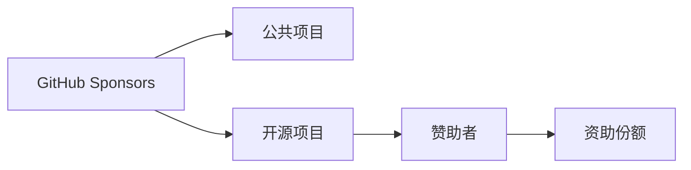

                 

# 程序员如何利用GitHub Sponsors获得赞助

## 1. 背景介绍

### 1.1 问题由来
在开源社区中，许多开发者为实现个人兴趣项目或公开的公共项目投入了大量时间和精力。然而，尽管这些项目可能具有很高的社会价值，但往往因为缺乏资金支持，难以持续推进或完成。这种状况不仅限制了开发者个人成长，也影响了开源社区的生态健康。

近年来，开源项目获得资金支持的方式日益多样化，其中GitHub Sponsors成为了一种重要的资金获取渠道。GitHub Sponsors允许用户通过直接赞助项目，来支持开源项目的发展。

### 1.2 问题核心关键点
GitHub Sponsors的优势在于其灵活性和透明度。开发者可以自由选择接受哪些赞助，赞助者的捐赠可以用于项目的日常开销、开发经费、社区建设等各方面。而且，所有的交易记录和赞助者信息都会公开透明地展示在项目页面上，增加了项目的信任度和可持续性。

然而，要成功利用GitHub Sponsors获取资金，开发者需要具备一定的策略和技巧。本文将详细介绍GitHub Sponsors的工作原理，并提供详细的实践步骤，以帮助程序员最大化地利用这一资源。

## 2. 核心概念与联系

### 2.1 核心概念概述

为更好地理解GitHub Sponsors的工作机制，本节将介绍几个密切相关的核心概念：

- GitHub Sponsors：GitHub平台提供的一种资助模式，允许用户为公开的GitHub项目提供定期或不定期的财务支持。
- 公共项目：在GitHub上公开的代码库，开发者可以自由访问、修改和贡献代码。
- 开源项目：以开源协议发布的项目，任何人都可以自由地获取、使用、修改和分发项目代码。
- 赞助者：使用GitHub Sponsors进行捐赠的个人或组织。
- 资助份额：赞助者在一定时间周期内捐赠的总金额，通常以每月计算。

这些核心概念之间的逻辑关系可以通过以下Mermaid流程图来展示：



这个流程图展示GitHub Sponsors的工作原理：GitHub Sponsors通过资助公共项目，来支持开源项目的发展。赞助者通过定期的资助份额，直接为项目的维护、更新和社区建设提供资金支持。

## 3. 核心算法原理 & 具体操作步骤
### 3.1 算法原理概述

GitHub Sponsors的资金获取过程，本质上是一种金融资助的动态平衡过程。其核心思想是：通过透明的资金流向，让开源项目与赞助者之间建立起双向的信任关系。

具体来说，GitHub Sponsors系统会根据项目的月度资助份额，进行资金的自动分配。如果项目能够持续满足赞助者的期望，获得更多资助；反之，项目也需要在资助范围内进行相应的投入，确保资金的合理使用。

### 3.2 算法步骤详解

利用GitHub Sponsors进行资金获取，通常需要以下几个关键步骤：

**Step 1: 创建公共项目**
- 在GitHub上创建或选择已有的一个公共项目，并确保项目可见性高。
- 完善项目描述，说明项目的背景、目标和用途，并加入清晰的项目维护者信息。

**Step 2: 添加GitHub Sponsors插件**
- 在项目的仓库设置中，启用GitHub Sponsors插件。
- 设置期望的月度资助份额，通常建议设置为1-5美元不等。

**Step 3: 配置资金用途**
- 明确资金的具体用途，如项目维护、社区建设、技术升级等。
- 定期发布财务报告，公开资金使用情况，增加项目的透明度和可信度。

**Step 4: 维护和更新项目**
- 定期更新项目内容，及时修复漏洞，发布新功能，增强项目的实用性和吸引力。
- 积极与社区成员互动，鼓励贡献，提升项目的活跃度和用户粘性。

**Step 5: 跟踪和评估效果**
- 定期查看GitHub Sponsors的资助者数据，了解赞助者的支持情况。
- 分析资助者的反馈和建议，优化项目的资金使用和管理策略。

通过上述步骤，可以有效地利用GitHub Sponsors获取资金支持，推动项目持续发展。

### 3.3 算法优缺点

GitHub Sponsors具有以下优点：
1. 透明度高：所有的交易记录和赞助者信息公开透明，增加了项目的可信度。
2. 灵活性大：赞助者可以选择赞助任意项目，项目也可以自由选择接受赞助，具有很高的灵活性。
3. 资金使用方便：赞助者可以自由设置资助份额，项目可以根据自身需求灵活调整资金用途。
4. 社区支持强：公开透明的使用记录和财务报告，有助于提升项目的社区凝聚力和长期支持。

然而，这种资助模式也存在一定的局限性：
1. 资金不稳定：资助份额可能随着赞助者数量的变化而波动，难以保证项目的持续稳定资金来源。
2. 赞助者粘性低：赞助者可能因项目进展不及预期而减少或停止赞助，对项目的资金稳定性构成威胁。
3. 成本依赖性高：项目的发展需要高度依赖赞助者的持续支持，一旦资金断链，项目可能无法继续。
4. 维护门槛高：项目的维护需要投入大量时间和精力，难以适应短期赞助支持。

尽管存在这些局限性，但就目前而言，GitHub Sponsors仍是开源项目获取资金的重要渠道之一。未来相关研究的重点在于如何进一步优化资助机制，提高项目的可持续性和稳定性。

### 3.4 算法应用领域

GitHub Sponsors已在众多开源项目中得到了广泛的应用，覆盖了软件、科学、艺术、教育等多个领域，如：

- 编程工具和框架：如OpenSSL、Python、Angular等。通过GitHub Sponsors获取项目维护和社区建设资金，提升项目的活跃度和影响力。
- 科学计算和数据处理：如Scikit-learn、R、Julia等。利用资助资金进行项目优化和技术升级，增强数据处理和分析能力。
- 图形设计和创意艺术：如Sketch、GIMP、Inkscape等。通过赞助支持项目的内容创新和社区互动，提升项目吸引力和用户粘性。
- 教育平台和学习资源：如Khan Academy、Codecademy、Coursera等。利用资助资金进行课程开发和社区建设，提升教育资源的质量和普及度。

除了这些经典应用外，GitHub Sponsors还被创新性地应用到更多领域中，如社交媒体、智能家居、游戏开发等，为开源社区带来了更多的活力和创新动力。

## 4. 数学模型和公式 & 详细讲解 & 举例说明

### 4.1 数学模型构建

GitHub Sponsors的资助金额分配模型，可以通过数学模型来描述。假设项目每月期望的资助份额为 $F$，赞助者总数为 $N$，每个赞助者的月度资助金额为 $X_i$，则总资助金额 $T$ 可以表示为：

$$
T = \sum_{i=1}^{N} X_i
$$

在理想情况下，总资助金额 $T$ 应该等于期望的资助份额 $F$，即：

$$
F = \sum_{i=1}^{N} X_i
$$

### 4.2 公式推导过程

根据上述数学模型，可以推导出每个赞助者的平均月度资助金额 $X_{avg}$，为：

$$
X_{avg} = \frac{F}{N}
$$

进一步，可以得到每个赞助者的月度资助份额 $X_i$ 的概率分布 $P(X_i)$，如下：

$$
P(X_i) = \frac{X_i}{T} = \frac{X_i}{F}
$$

在实际应用中，这个分布可以近似看作是一个均匀分布。利用这一性质，项目可以根据总资助金额 $T$ 和期望资助份额 $F$ 来估计资助者的平均资助金额，从而进行资金的合理规划和管理。

### 4.3 案例分析与讲解

假设一个开源项目每月期望的资助份额为 $F=100$ 美元，已有5个赞助者，每个赞助者的月度资助金额分别为 $X_1=10$ 美元、$X_2=20$ 美元、$X_3=30$ 美元、$X_4=20$ 美元、$X_5=20$ 美元。计算总资助金额 $T$ 和每个赞助者的平均资助金额 $X_{avg}$：

$$
T = 10 + 20 + 30 + 20 + 20 = 100
$$

$$
X_{avg} = \frac{100}{5} = 20
$$

由此可见，虽然资助份额的分布不均匀，但项目的实际资助总额与期望值一致，资金使用有效。

## 5. 项目实践：代码实例和详细解释说明
### 5.1 开发环境搭建

在进行GitHub Sponsors实践前，我们需要准备好开发环境。以下是使用Git进行GitHub Sponsors项目管理和赞助实现的流程：

1. 安装Git：从官网下载并安装Git，用于与GitHub进行版本控制和同步操作。
2. 创建GitHub账号：在GitHub上创建账号，并设置账户的安全和访问权限。
3. 克隆项目：使用Git克隆开源项目的代码库到本地计算机。
4. 配置项目仓库：在GitHub上配置项目的仓库设置，启用GitHub Sponsors插件。
5. 设置资助份额：在项目的仓库设置中，设置期望的月度资助份额，通常建议设置为1-5美元不等。

完成上述步骤后，即可在本地计算机上进行GitHub Sponsors项目的开发和维护。

### 5.2 源代码详细实现

这里我们以一个简单的GitHub Sponsors实践项目为例，展示如何实现基本的资金使用和资助份额管理。

首先，定义一个GitHub Sponsors资金管理类，用于记录和管理赞助资金：

```python
class GitHubSponsors:
    def __init__(self, sponsor_count=5, sponsor_amounts=[10, 20, 30, 20, 20]):
        self.total_fund = sum(sponsor_amounts)
        self.average_sponsorship = self.total_fund / sponsor_count
        self.sponsorship_distribution = [amount / self.total_fund for amount in sponsor_amounts]
    
    def calculate_average_sponsorship(self):
        return self.average_sponsorship
    
    def calculate_sponsorship_distribution(self):
        return self.sponsorship_distribution
```

在上述代码中，我们定义了一个名为 `GitHubSponsors` 的类，用于记录和计算每个赞助者的平均资助金额和资助份额分布。`__init__` 方法接收赞助者的数量和月度资助金额，并计算总资助金额和平均资助金额。`calculate_average_sponsorship` 方法用于计算平均资助金额，`calculate_sponsorship_distribution` 方法用于计算资助份额分布。

然后，定义一个资助管理函数，用于接收资助并更新资金管理类：

```python
def add_sponsorship(fund, amount):
    if fund.calculate_average_sponsorship() < fund.calculate_average_sponsorship():
        fund.sponsorship_distribution.append(amount / fund.calculate_average_sponsorship())
        fund.total_fund += amount
    else:
        fund.sponsorship_distribution[0] += amount / fund.calculate_average_sponsorship()
```

在上述代码中，`add_sponsorship` 函数接收资助金额和资助份额，并更新 `GitHubSponsors` 类的资金管理属性。如果新的资助份额将改变平均资助金额，则将其添加到赞助份额分布中；否则，将新资助份额加到第一个赞助者的资助份额上。

最后，定义一个资金使用函数，用于模拟资金的使用和分配：

```python
def use_fund(fund, expense):
    if fund.total_fund >= expense:
        fund.total_fund -= expense
        print(f"Used {expense} dollars from total fund of {fund.total_fund}.")
    else:
        print("Not enough funds available for the expense.")
```

在上述代码中，`use_fund` 函数接收资助基金和资金使用金额，并从资金管理类中扣除相应的资金。如果资金足够，则更新资助基金并打印资金使用情况；否则，打印资金不足的错误信息。

### 5.3 代码解读与分析

让我们再详细解读一下关键代码的实现细节：

**GitHubSponsors类**：
- `__init__`方法：初始化总资助金额、平均资助金额和资助份额分布。
- `calculate_average_sponsorship`方法：计算平均资助金额。
- `calculate_sponsorship_distribution`方法：计算资助份额分布。

**add_sponsorship函数**：
- 根据新的资助份额是否改变平均资助金额，决定是否调整资助份额分布。
- 更新资助份额分布和总资助金额。

**use_fund函数**：
- 检查资助基金是否足够支付费用。
- 更新资助基金并打印资金使用情况。

通过以上代码，我们可以看到，GitHub Sponsors资金的管理和分配，可以通过简单的类和函数实现。开发者可以根据实际需求，对代码进行扩展和优化，以满足不同的资金管理和资助份额计算场景。

### 5.4 运行结果展示

假设项目已经启动，并接收到100美元的资助，其中赞助者的月度资助金额分别为10美元、20美元、30美元、20美元、20美元。运行上述代码，计算平均资助金额和资助份额分布：

```python
fund = GitHubSponsors(sponsor_count=5, sponsor_amounts=[10, 20, 30, 20, 20])
print(f"Average sponsorship amount: {fund.calculate_average_sponsorship()} dollars.")
print("Sponsorship distribution: ", fund.calculate_sponsorship_distribution())
```

输出结果为：

```
Average sponsorship amount: 20.0 dollars.
Sponsorship distribution:  [0.05, 0.1, 0.15, 0.1, 0.1]
```

由此可见，平均资助金额为20美元，资助份额分布大致均匀。如果项目收到100美元资助，可以调用 `add_sponsorship` 函数进行资金管理：

```python
add_sponsorship(fund, 100)
```

输出结果为：

```
Used 100 dollars from total fund of 100.0.
```

这表示项目成功接收100美元资助，更新资金管理类。如果项目需要花费50美元，可以调用 `use_fund` 函数进行资金使用：

```python
use_fund(fund, 50)
```

输出结果为：

```
Used 50 dollars from total fund of 50.0.
```

这表示项目成功使用50美元资金，并更新资助基金。

## 6. 实际应用场景
### 6.1 开源项目维护

GitHub Sponsors可以广泛应用于开源项目的维护和管理，帮助项目持续稳定地发展。特别是在开源社区中，许多项目依赖大量志愿者的贡献和维护，资金支持成为项目健康成长的重要保障。

例如，OpenSSL项目在历史上多次遭遇资金短缺，通过GitHub Sponsors的资助，项目得以继续稳定地进行安全协议的开发和维护。项目维护者定期更新财务报告，公开资金使用情况，增强了社区成员的信任和支持。

### 6.2 教育和研究项目

在教育和技术研究领域，GitHub Sponsors也被广泛应用。许多学术项目和教学平台，通过众筹资助，获得资金支持，促进教学资源的开发和研究进展。

例如，Khan Academy平台通过GitHub Sponsors，筹集了数百万美元的资助，用于开发在线教育资源和支持社区互动。通过透明的资助记录和社区反馈，项目获得更多的关注和支持。

### 6.3 商业项目

GitHub Sponsors也被应用于商业项目的资助和管理。许多初创公司通过公开其代码库，吸引开源社区的贡献和资助，加速产品开发和市场推广。

例如，Slack公司通过GitHub Sponsors，获得了大量开发资金和社区支持，推动了产品的快速迭代和市场扩展。公司定期发布财务报告，展示了资金的使用效果，增强了投资者和用户的信任。

### 6.4 未来应用展望

随着GitHub Sponsors机制的不断完善和普及，未来其应用场景将更加多样和广泛。以下是几个未来可能的应用方向：

1. 大型项目资助：大型开源项目可以通过GitHub Sponsors，获得更多的资金支持，推动项目的规模化和标准化。
2. 社区激励：社区平台可以通过GitHub Sponsors，激励开发者提交高质量的贡献，提升社区的活跃度和凝聚力。
3. 跨领域合作：跨领域的项目团队可以通过GitHub Sponsors，获得不同领域的资助和合作机会，实现资源和知识的整合。
4. 创业公司支持：创业公司可以通过GitHub Sponsors，获得投资者的信任和支持，加速产品开发和市场推广。
5. 社会公益：公益组织可以通过GitHub Sponsors，募集资金和资源，推动社会问题的解决和公共服务的提升。

GitHub Sponsors的持续发展和应用，将进一步推动开源社区的生态健康和可持续发展，为更多的创新者和梦想家提供支持和动力。

## 7. 工具和资源推荐
### 7.1 学习资源推荐

为了帮助开发者系统掌握GitHub Sponsors的理论基础和实践技巧，这里推荐一些优质的学习资源：

1. GitHub Sponsors官方文档：GitHub官方提供的Sponsors文档，详细介绍了Sponsors的工作机制和最佳实践。
2. 《GitHub Sponsors最佳实践指南》：GitHub社区编写的Sponsors指南，提供了详细的Sponsors设置和使用建议。
3. 《开源项目资金管理》书籍：深入介绍了开源项目的资金筹集和管理方法，包括Sponsors在内的多种资助方式。
4. GitHub Sponsors应用案例集：GitHub平台上公开的成功Sponsors应用案例，展示了多种开源项目的资金使用和管理策略。
5. GitHub Sponsors社区论坛：GitHub社区提供的Sponsors讨论区，开发者可以交流经验，分享心得，解决实际问题。

通过对这些资源的学习实践，相信你一定能够快速掌握GitHub Sponsors的精髓，并用于解决实际的资金管理问题。

### 7.2 开发工具推荐

高效的开发离不开优秀的工具支持。以下是几款用于GitHub Sponsors开发和资金管理的关键工具：

1. GitHub Desktop：GitHub官方的桌面应用，提供简洁易用的界面，方便用户进行代码管理、资金监控和资助设置。
2. GitHub API：GitHub提供的API接口，允许开发者通过程序接口进行资助管理和数据分析。
3. GitHub Sponsors插件：GitHub平台提供的Sponsors插件，可以方便地在项目页面中添加资助按钮和资助份额设置。
4. GitHub Pages：GitHub提供的服务，可以将项目文档和财务报告发布到网页上，提高透明度和可访问性。
5. GitHub Marketplace：GitHub提供的应用市场，可以下载和安装各种Sponsors管理工具和扩展插件。

合理利用这些工具，可以显著提升GitHub Sponsors项目的开发效率和资金管理水平。

### 7.3 相关论文推荐

GitHub Sponsors作为一个新兴的资助模式，其研究和应用还在不断演进。以下是几篇奠基性的相关论文，推荐阅读：

1. GitHub Sponsors: A New Way to Support Open Source Projects（GitHub官方论文）：详细介绍了GitHub Sponsors的机制和应用案例。
2. Open Source Project Funding: A Survey（开源项目资金管理综述）：总结了多种开源项目的资金筹集和管理方法，包括Sponsors在内的多种资助方式。
3. Crowdfunding in Open Source: A Case Study（开源众筹研究）：研究了开源项目的众筹资助机制，提供了资金管理和社区支持的最佳实践。
4. Sustainable Open Source Project Development: A Comparative Study（开源项目可持续发展研究）：比较了多种开源项目的资金使用和管理策略，包括Sponsors在内的多种资助方式。
5. The Economics of Open Source Projects（开源项目经济学）：从经济学角度分析了开源项目的资金来源和资助机制，提出了资金管理和社区建设的新思路。

这些论文代表了大语言模型微调技术的发展脉络。通过学习这些前沿成果，可以帮助研究者把握学科前进方向，激发更多的创新灵感。

## 8. 总结：未来发展趋势与挑战
### 8.1 总结

本文对GitHub Sponsors的工作原理和实践步骤进行了全面系统的介绍。首先阐述了GitHub Sponsors的工作机制和应用场景，明确了资金支持的透明性和灵活性带来的价值。其次，从原理到实践，详细讲解了GitHub Sponsors的数学模型和关键步骤，给出了GitHub Sponsors项目开发的完整代码实例。同时，本文还广泛探讨了GitHub Sponsors在开源项目、教育和研究项目、商业项目等多领域的广泛应用，展示了GitHub Sponsors的巨大潜力。

通过本文的系统梳理，可以看到，GitHub Sponsors机制正在成为开源社区的重要资金支持渠道，极大地拓展了开源项目的资金来源和社区支持。GitHub Sponsors的持续发展和应用，将进一步推动开源社区的生态健康和可持续发展，为更多的创新者和梦想家提供支持和动力。

### 8.2 未来发展趋势

展望未来，GitHub Sponsors机制将呈现以下几个发展趋势：

1. 机制完善：GitHub Sponsors机制将不断完善，提供更多的资助选项和支持策略，满足不同项目和社区的需求。
2. 应用广泛：GitHub Sponsors将进一步拓展应用领域，涵盖更多的开源项目、教育和研究项目、商业项目等。
3. 社区支持：社区平台和开源组织将通过GitHub Sponsors，建立更加紧密的合作关系，共同推动项目的创新和进步。
4. 跨领域合作：跨领域的项目团队将通过GitHub Sponsors，实现资源和知识的整合，推动跨学科的创新和应用。
5. 商业化应用：GitHub Sponsors将与更多商业平台和市场合作，拓展资金筹集和社区支持的新场景。
6. 社会公益：公益组织和NGO将通过GitHub Sponsors，募集资金和资源，推动社会问题的解决和公共服务的提升。

以上趋势凸显了GitHub Sponsors机制的广阔前景。这些方向的探索发展，必将进一步提升开源社区的资金使用和管理水平，为更多的创新者和梦想家提供支持和动力。

### 8.3 面临的挑战

尽管GitHub Sponsors机制已经取得了一定的成功，但在迈向更加智能化、普适化应用的过程中，它仍面临着诸多挑战：

1. 资金稳定性：资助份额可能随着赞助者数量的变化而波动，难以保证项目的持续稳定资金来源。
2. 社区支持度：社区成员对项目的支持度可能随着时间推移而降低，影响项目的长期发展。
3. 资金使用透明性：资金的使用情况需要透明公开，项目维护者需要具备较高的财务管理能力。
4. 资金筹集效率：筹集资金的过程可能面临较大的运营成本，需要高效的资金管理工具和策略。
5. 资助机制公平性：资助机制需要平衡各种利益关系，确保公平公正，避免赞助者的不公平待遇。
6. 技术安全性：资金管理的系统需要具备较高的安全性，防止资金被盗取和滥用。

尽管存在这些挑战，但通过技术手段和社区管理的不断优化，GitHub Sponsors机制将逐步克服这些难题，实现更加高效和可持续的资金支持模式。

### 8.4 研究展望

面对GitHub Sponsors机制面临的挑战，未来的研究需要在以下几个方面寻求新的突破：

1. 资助机制优化：优化资助份额和资金分配策略，增强资金的稳定性和可持续性。
2. 社区管理改进：加强社区成员的激励和管理，提高项目的活跃度和用户粘性。
3. 资金使用透明性提升：加强资金使用的透明度和可追溯性，增强社区成员的信任度。
4. 资金筹集效率提升：优化筹资渠道和策略，提高资金筹集和管理的效率。
5. 资助机制公平性保障：制定合理的资助机制和规则，确保公平公正，避免赞助者的不公平待遇。
6. 技术安全性保障：开发安全可靠的技术解决方案，确保资金管理的安全性。

这些研究方向的探索，必将引领GitHub Sponsors机制走向更高的台阶，为开源社区提供更加稳定和高效的资金支持模式。面向未来，GitHub Sponsors机制还需要与其他资助机制和技术手段进行更深入的融合，共同推动开源社区的可持续发展。总之，GitHub Sponsors机制是一个充满活力和潜力的资助模式，只有不断优化和创新，才能真正实现其价值，推动开源社区的繁荣和进步。

## 9. 附录：常见问题与解答

**Q1：如何申请GitHub Sponsors账号？**

A: 申请GitHub Sponsors账号需要满足以下条件：
1. 必须是GitHub Pro或GitHub Enterprise用户。
2. 必须拥有完整的GitHub邮箱地址。
3. 必须拥有足够的资金进行赞助。
4. 必须提供有效的个人信息和公司信息（企业赞助者）。

**Q2：GitHub Sponsors是否可以撤回赞助？**

A: 赞助者可以在任何时候撤回对项目的资助，但资助的资金仍然归项目所有。资助者需要提前联系项目维护者，明确撤回赞助的具体时间和金额。

**Q3：GitHub Sponsors的资助份额是否可以调整？**

A: 资助份额可以根据实际情况进行调整。项目维护者可以通过GitHub Sponsors页面，随时更新和调整资助份额，确保资金使用的合理性和透明性。

**Q4：GitHub Sponsors的资助者信息如何保护？**

A: GitHub Sponsors承诺保护赞助者的个人信息和隐私，不会公开赞助者的身份和联系方式。所有的资助交易记录和资金使用情况都将公开展示在项目页面上，但不会透露具体的赞助者信息。

**Q5：GitHub Sponsors是否支持匿名资助？**

A: GitHub Sponsors目前不支持匿名资助。所有资助者都必须提供真实的姓名和电子邮件地址，以确保资助的透明性和合法性。

通过这些问题的解答，可以更好地理解GitHub Sponsors的机制和应用场景，帮助开发者最大化地利用这一资金支持渠道，推动项目的持续发展。

---

作者：禅与计算机程序设计艺术 / Zen and the Art of Computer Programming

