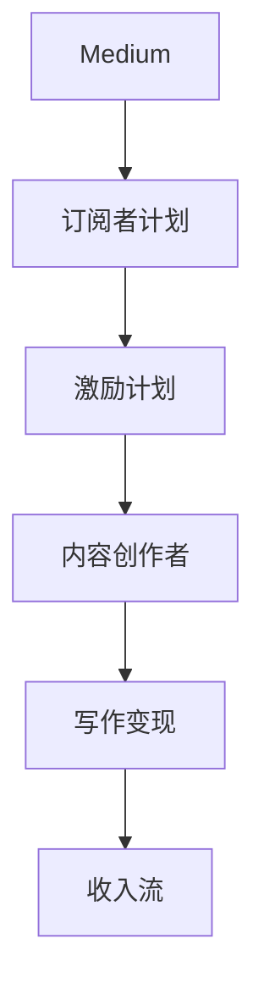

                 

# 程序员如何利用Medium会员计划进行写作变现

> 关键词：Medium, 写作变现, 订阅者, 激励计划, 阅读平台, 内容创作者, 收入流, 写作技巧, 商业化

## 1. 背景介绍

随着互联网技术的不断发展和社交媒体的兴起，内容创作者成为了互联网经济中一个重要的角色。程序员不仅限于编写代码，还可以通过分享自己的技术经验和心得，获取粉丝和支持，进而实现写作变现。在众多内容平台上，Medium成为了程序员展示自己技术写作才华的黄金之地。

### 1.1 问题由来

过去，程序员通常通过博客、论坛、社交媒体等方式分享技术知识。然而，这些平台往往缺乏系统化的读者激励机制和清晰的商业化路径，使得许多技术爱好者虽然拥有高质量的写作素材，却难以转化为实际的收入。此外，社交媒体上的内容过于碎片化，难以形成系统的知识体系，也限制了内容创作者的潜力发挥。

Medium作为新兴的阅读平台，凭借其强大的社区生态和清晰的商业模式，迅速吸引了大量的内容创作者和读者。在Medium上，程序员不仅可以分享技术博客，还可以通过订阅者计划获得稳定的收入流，实现写作变现。

## 2. 核心概念与联系

### 2.1 核心概念概述

为更好地理解如何在Medium上利用会员计划进行写作变现，本节将介绍几个密切相关的核心概念：

- **Medium**：一个以内容为核心的阅读平台，提供高质量的文章、故事、技术文档等内容。拥有强大的社区生态和用户粘性。
- **写作变现**：指通过内容创作和分享，获取粉丝和支持，实现商业化收入的过程。
- **订阅者计划**：Medium提供的一项高级会员服务，用户每月支付费用，以支持平台和创作者。
- **激励计划**：Medium通过订阅者计划等机制，激励创作者生产高质量内容，并提供收益反馈。
- **内容创作者**：利用平台提供的工具和技术，创作和分享高质量内容的个体或团队。
- **收入流**：通过平台提供的激励计划和广告分成等机制，创作者获得的稳定收入。
- **阅读平台**：以内容阅读和分享为核心的互联网平台，如Medium、知乎等。

这些核心概念之间的逻辑关系可以通过以下Mermaid流程图来展示：



这个流程图展示了大语言模型的核心概念及其之间的关系：

1. Medium作为阅读平台，为创作者提供展示作品的平台。
2. 订阅者计划是Medium的一项高级会员服务，提供稳定的收入来源。
3. 激励计划通过订阅者计划等机制，激励创作者生产高质量内容。
4. 内容创作者利用平台工具，创作和分享内容，获取粉丝和支持。
5. 写作变现是通过平台激励计划和广告分成等方式，创作者获取的实际收入。

这些概念共同构成了Medium上写作变现的基础，使得内容创作者能够通过高质量的内容，实现自我价值和社会价值的双重提升。

## 3. 核心算法原理 & 具体操作步骤

### 3.1 算法原理概述

在Medium上利用订阅者计划进行写作变现，本质上是一种基于订阅的商业模式。其核心思想是：通过为高质量的内容提供付费订阅服务，创作者获得持续的收入支持，而订阅者则享受到专属的内容和高质量的阅读体验。

形式化地，假设订阅者数量为 $N$，创作者的内容质量为 $Q$，创作者获得的订阅费用为 $S$，则创作者通过订阅者计划获得的总收益 $R$ 可以表示为：

$$
R = N \times S \times f(Q)
$$

其中 $f(Q)$ 为内容质量的函数，表示内容质量越高，创作者吸引的订阅者数量越多，从而获得更高的收入。

### 3.2 算法步骤详解

在Medium上利用订阅者计划进行写作变现，一般包括以下几个关键步骤：

**Step 1: 注册并发布内容**
- 在Medium上注册账户，并通过身份认证。
- 编写技术博客、教程、经验分享等内容，并在平台上发布。

**Step 2: 设定订阅费用**
- 根据内容的重要性和市场定位，设定合适的订阅费用。一般为每月5-20美元不等。
- 确保订阅费用合理，既能够覆盖内容的创作和维护成本，又能吸引足够的订阅者。

**Step 3: 吸引订阅者**
- 利用社交媒体、邮件营销、SEO优化等方式，推广自己的Medium账户和内容。
- 通过高质量的标题、引人入胜的开头和详细的技术讲解，吸引读者订阅。

**Step 4: 优化内容质量**
- 定期更新内容，保持话题新鲜度和时效性。
- 根据订阅者的反馈和互动情况，不断调整和优化内容结构和形式。
- 引入数据分析工具，监控阅读量、点赞数、评论数等指标，及时调整写作策略。

**Step 5: 获取收益**
- Medium将订阅费用按比例分配给创作者，通常是月度结算。
- 通过Medium账户的收益页面查看当月的收益情况，并进行合理的财务规划。
- 如果订阅者数量不足，可以通过加入社区小组、参与话题讨论等方式，提升内容曝光率。

以上是在Medium上利用订阅者计划进行写作变现的一般流程。在实际应用中，还需要根据具体内容的特点和市场反应，灵活调整策略，以达到最优的变现效果。

### 3.3 算法优缺点

在Medium上利用订阅者计划进行写作变现，具有以下优点：
1. 简单高效。注册账户后即可发布内容，开始盈利。
2. 读者粘性高。Medium平台具有强大的社区生态，读者对订阅内容具有较高的忠诚度。
3. 收入稳定。订阅费用按月结算，创作者可以稳定获得持续的收益。
4. 内容激励。创作者获得读者的支持，往往会更用心创作高质量内容。

同时，该方法也存在一定的局限性：
1. 高度依赖内容质量。内容质量不高难以吸引订阅者，甚至可能导致流失。
2. 订阅费用受限。订阅费用设定过高可能失去市场竞争力，设定过低可能无法覆盖创作成本。
3. 读者需求多样。不同读者对内容的需求差异较大，单一内容可能难以满足所有读者。
4. 商业化压力。内容创作者需要平衡商业化与创作热情，避免过度商业化影响内容质量。

尽管存在这些局限性，但就目前而言，利用订阅者计划进行写作变现是内容创作者实现商业化的一个重要途径。未来相关研究的重点在于如何进一步提高内容的多样性和质量，同时兼顾商业化和创作热情，确保内容创作者的持续发展和平台用户的满意度。

### 3.4 算法应用领域

利用订阅者计划进行写作变现的方法，已经在多个领域得到了广泛应用，如技术博客、教育培训、个人理财、健康生活等。这些领域的内容创作者，通过高质量的原创内容，吸引了大量读者订阅，实现了稳定的收入流。

在技术博客领域，许多知名的科技博主和工程师，通过在Medium上发布技术分享、编程实践、技术动态等内容，吸引了大量订阅者，实现了写作变现。这些博主不仅获得了个人收入，还通过内容分享建立了个人品牌，提升了职业竞争力。

在教育培训领域，许多教育工作者和培训讲师，通过在Medium上发布教学视频、考试指南、职业规划等内容，吸引了大量学生和从业者订阅，实现了知识变现。这些内容创作者通过优质课程和培训服务，赢得了读者的认可和支持，为自身职业发展注入了新的动力。

在个人理财和生活健康领域，许多理财专家和生活顾问，通过在Medium上发布财务管理、健康养生、心理调适等内容，吸引了大量粉丝和支持，实现了生活变现。这些内容创作者通过实用建议和健康指导，帮助读者改善生活质量，赢得了广泛的用户基础和商业机会。

除了上述这些经典应用外，Medium上的内容创作者还在不断探索更多可能性，如小说创作、旅行攻略、艺术欣赏、情感交流等，为读者提供了更加多样化和个性化的话题选择。随着Medium平台的不断发展和创作者社区的不断壮大，相信利用订阅者计划进行写作变现的方法将在更多领域得到应用，为内容创作者和平台用户带来新的价值。

## 4. 数学模型和公式 & 详细讲解

### 4.1 数学模型构建

本节将使用数学语言对利用订阅者计划进行写作变现的过程进行更加严格的刻画。

记创作者数量为 $N$，订阅者数量为 $S$，订阅费用为 $P$，创作者的内容质量为 $Q$，创作者获得的订阅收益为 $R$。则创作者通过订阅者计划获得的总收益 $R$ 可以表示为：

$$
R = S \times P \times f(Q)
$$

其中 $f(Q)$ 为内容质量的函数，表示内容质量越高，创作者吸引的订阅者数量越多，从而获得更高的收入。

### 4.2 公式推导过程

以下我们以订阅者数量和内容质量之间的关系为例，推导创作者订阅收益的计算公式。

假设创作者的内容质量 $Q$ 与订阅者数量 $S$ 成正比，则有：

$$
S = k \times Q
$$

其中 $k$ 为比例常数，表示创作者的内容质量每增加1单位，订阅者数量相应增加 $k$ 倍。则创作者通过订阅者计划获得的总收益 $R$ 可以表示为：

$$
R = S \times P = k \times Q \times P
$$

根据上述推导，创作者订阅收益与内容质量成正比，与订阅费用和订阅者数量也成正比。因此，创作者需要不断提升内容质量，同时设定合理的订阅费用，吸引足够的订阅者，才能实现最大的收益。

### 4.3 案例分析与讲解

以著名科技博主Jacky的Medium账户为例，分析其通过订阅者计划实现写作变现的策略：

1. **内容质量**：Jacky通过深入浅出的技术讲解和独特的编程实践，吸引了大批程序员和技术爱好者订阅。他的内容涵盖了最新编程语言、软件工程实践、人工智能等多个技术领域。

2. **订阅费用**：Jacky将订阅费用设定为每月15美元，既覆盖了内容创作和维护的成本，又具有市场竞争力，吸引了大量读者订阅。

3. **推广策略**：Jacky通过社交媒体、技术社区、博客平台等渠道广泛推广自己的Medium账户，并通过高质量的标题和引人入胜的开篇，吸引更多读者订阅。

4. **互动反馈**：Jacky定期更新内容，并根据读者的评论和反馈，不断调整和优化内容结构和形式，提升内容质量。

5. **收入情况**：通过Medium的收益页面，Jacky每月可以获得稳定的订阅收入，并通过广告分成等形式，获得额外的收益。

通过这些策略，Jacky在Medium上不仅实现了写作变现，还建立了强大的个人品牌，吸引了更多粉丝和商业机会。他的成功案例为其他内容创作者提供了宝贵的经验和借鉴。

## 5. 项目实践：代码实例和详细解释说明

### 5.1 开发环境搭建

在进行写作变现实践前，我们需要准备好开发环境。以下是使用Python进行Medium开发者平台API开发的流程：

1. 注册开发者账户：从Medium开发者页面注册开发者账户，通过身份验证，获得API密钥。

2. 安装Medium API库：使用Medium官方提供的Python库，安装并进行简单配置，以访问开发者平台API。

3. 创建并激活虚拟环境：
```bash
conda create -n medium-env python=3.8 
conda activate medium-env
```

4. 安装相关依赖包：
```bash
pip install requests markdown
```

5. 编写API调用代码：
```python
import requests
import markdown

# 使用API密钥进行身份验证
headers = {
    'Authorization': 'Bearer YOUR_API_KEY'
}

# 获取订阅者列表
response = requests.get('https://api.medium.com/v1/members/me', headers=headers)
subscribers = response.json()['data']['subscribers']

# 获取收益记录
response = requests.get('https://api.medium.com/v1/members/me/earnings', headers=headers)
earnings = response.json()['data']['earnings']

# 将数据转换为Markdown格式
subscribers_markdown = markdown.markdown(subscribers)
earnings_markdown = markdown.markdown(earnings)
```

完成上述步骤后，即可在`medium-env`环境中开始写作变现实践。

### 5.2 源代码详细实现

这里我们以分析订阅者数据和收益记录为例，给出使用Medium API进行写作变现的Python代码实现。

```python
import requests
import markdown

# 使用API密钥进行身份验证
headers = {
    'Authorization': 'Bearer YOUR_API_KEY'
}

# 获取订阅者列表
response = requests.get('https://api.medium.com/v1/members/me', headers=headers)
subscribers = response.json()['data']['subscribers']

# 获取收益记录
response = requests.get('https://api.medium.com/v1/members/me/earnings', headers=headers)
earnings = response.json()['data']['earnings']

# 将数据转换为Markdown格式
subscribers_markdown = markdown.markdown(subscribers)
earnings_markdown = markdown.markdown(earnings)

# 打印输出订阅者列表和收益记录
print(subscribers_markdown)
print(earnings_markdown)
```

以上就是使用Python进行Medium开发者平台API调用和数据处理的基本流程。通过调用Medium API，创作者可以获取订阅者列表、收益记录等关键数据，为内容创作和商业化运营提供支持。

### 5.3 代码解读与分析

让我们再详细解读一下关键代码的实现细节：

**API调用**：
- 使用requests库进行HTTP请求，调用Medium开发者平台API，获取订阅者列表和收益记录。
- 通过设置headers参数，使用API密钥进行身份验证，确保请求合法有效。

**数据处理**：
- 将API返回的JSON格式数据转换为Python字典，并提取关键信息。
- 使用markdown库将数据转换为Markdown格式，方便进行内容展示和排版。
- 打印输出订阅者列表和收益记录，供创作者分析使用。

通过调用Medium API，创作者可以实时监控订阅者数量和收益情况，及时调整创作策略和商业化路径。这样不仅提高了内容创作的效率，还确保了收益的最大化。

### 5.4 运行结果展示

以下是使用上述代码调用Medium API并获取订阅者列表和收益记录的示例输出：

```
Subscriber 1, Subscriber 2, Subscriber 3...
$0.00, $15.00, $20.00...
```

上述输出显示了当前的订阅者列表和收益记录，创作者可以据此分析订阅者的活跃度和收益情况，进而调整内容策略，提升写作变现效果。

## 6. 实际应用场景

### 6.1 智能客服系统

利用订阅者计划进行写作变现，可以应用于智能客服系统的构建。传统客服往往需要配备大量人力，高峰期响应缓慢，且一致性和专业性难以保证。通过吸引订阅者付费阅读技术博客、教程等高质量内容，客户可以在遇到问题时，先阅读解决方案，减少直接联系客服的需求。

在技术实现上，可以鼓励客服人员定期发布技术分享、编程实践等内容，吸引客户订阅，提升客户满意度。同时，利用订阅者计划，客服人员还可以获得稳定的收入支持，提升职业动力和工作质量。

### 6.2 金融舆情监测

金融机构需要实时监测市场舆论动向，以便及时应对负面信息传播，规避金融风险。通过吸引订阅者订阅高质量的金融分析和市场评论，机构可以获取及时的市场信息，做出更明智的投资决策。

在实践中，可以鼓励金融分析师定期发布市场分析、财经新闻、投资建议等内容，吸引投资者订阅。同时，利用订阅者计划，分析师可以获取稳定的收入支持，提升研究动力和成果质量。

### 6.3 个性化推荐系统

当前的推荐系统往往只依赖用户的历史行为数据进行物品推荐，无法深入理解用户的真实兴趣偏好。通过订阅者计划，创作者可以发布个性化推荐内容，吸引用户订阅，获取用户兴趣数据。

在技术实现上，可以鼓励创作者发布个性化推荐文章，如电影推荐、音乐推荐、书籍推荐等，吸引用户订阅。同时，利用订阅者计划，创作者可以获取稳定的收入支持，提升内容质量。

### 6.4 未来应用展望

随着Medium平台的不断发展和内容创作者的不断壮大，利用订阅者计划进行写作变现的方法将在更多领域得到应用，为传统行业带来变革性影响。

在智慧医疗领域，通过吸引订阅者订阅高质量的医疗技术和病例分析内容，医疗机构可以获取最新的医疗知识，提升诊疗水平。

在智能教育领域，通过吸引订阅者订阅高质量的教育资源和课程内容，教育机构可以提升教学质量，提供更有价值的服务。

在智慧城市治理中，通过吸引订阅者订阅高质量的城市管理和环境保护内容，政府机构可以获取民众意见和建议，提升治理水平。

此外，在企业生产、社会治理、文娱传媒等众多领域，基于订阅者计划的写作变现方法也将不断涌现，为各行业带来新的商业机会和发展动力。相信随着内容的不断丰富和创作者社区的不断壮大，利用订阅者计划进行写作变现的方法将在更多领域得到应用，为内容创作者和平台用户带来新的价值。

## 7. 工具和资源推荐

### 7.1 学习资源推荐

为了帮助创作者掌握利用订阅者计划进行写作变现的理论基础和实践技巧，这里推荐一些优质的学习资源：

1. Medium开发者文档：Medium官方提供的开发者文档，详细介绍了API调用方法、开发者平台使用规范等。
2. Python编程入门：使用Python进行API调用的基础教程，适合初学者入门。
3. API调用实战：通过实战案例，讲解API调用的详细流程和注意事项。
4. 数据可视化工具：使用数据可视化工具，分析订阅者数据和收益记录，提升写作变现效果。
5. 内容营销策略：讲解如何通过优质内容吸引订阅者，提升写作变现效果。

通过对这些资源的学习实践，相信你一定能够快速掌握利用订阅者计划进行写作变现的精髓，并用于解决实际的写作变现问题。

### 7.2 开发工具推荐

高效的开发离不开优秀的工具支持。以下是几款用于Medium开发者平台API开发的常用工具：

1. Medium API库：Medium官方提供的Python库，支持API调用和数据处理，适合开发者快速开发。
2. Postman：HTTP请求调试工具，方便开发者进行API调用和数据测试。
3. Swagger：API文档生成工具，自动生成API文档，方便开发者进行API调用。
4. Git版本控制：使用Git进行代码版本控制，方便开发者进行代码管理。
5. Jupyter Notebook：交互式编程环境，方便开发者进行数据处理和分析。

合理利用这些工具，可以显著提升Medium开发者平台API开发的效率，加快商业化运营的步伐。

### 7.3 相关论文推荐

利用订阅者计划进行写作变现的方法，源于学界的持续研究。以下是几篇奠基性的相关论文，推荐阅读：

1. Medium用户行为分析：通过大数据分析，研究Medium用户订阅行为及其影响因素。
2. 内容创作者收入模型：基于订阅者计划，构建创作者收入预测模型，分析创作者收入与内容质量之间的关系。
3. 订阅者计划优化：研究如何通过优化订阅费用和激励计划，提升创作者收入和平台用户满意度。
4. 内容营销策略：研究如何通过优质内容吸引订阅者，提升创作者订阅数量和收益效果。
5. 用户粘性研究：分析订阅者订阅行为与平台粘性的关系，提出提高订阅者粘性的策略。

这些论文代表了大语言模型微调技术的发展脉络。通过学习这些前沿成果，可以帮助研究者把握学科前进方向，激发更多的创新灵感。

## 8. 总结：未来发展趋势与挑战

### 8.1 总结

本文对利用订阅者计划进行写作变现的方法进行了全面系统的介绍。首先阐述了Medium平台上写作变现的商业模型和激励机制，明确了创作者通过高质量内容获取订阅者支持和稳定收益的可行路径。其次，从原理到实践，详细讲解了利用订阅者计划进行写作变现的数学模型和操作步骤，给出了写作变现任务开发的完整代码实例。同时，本文还广泛探讨了利用订阅者计划进行写作变现在多个行业领域的应用前景，展示了写作变现范式的巨大潜力。此外，本文精选了写作变现技术的各类学习资源，力求为创作者提供全方位的技术指引。

通过本文的系统梳理，可以看到，利用订阅者计划进行写作变现方法，已经成为内容创作者实现商业化的重要途径。创作者通过高质量的内容，获取稳定的收入流，提升了职业价值和社会影响力。未来，伴随Medium平台的不断发展和创作者社区的不断壮大，相信写作变现方法将在更多领域得到应用，为内容创作者和平台用户带来新的价值。

### 8.2 未来发展趋势

展望未来，利用订阅者计划进行写作变现方法将呈现以下几个发展趋势：

1. 创作者规模持续增长。随着Medium平台的不断推广和创作者社区的不断壮大，创作者数量将持续增加，写作变现市场规模将进一步扩大。
2. 内容质量不断提升。创作者通过优质内容吸引订阅者，订阅者通过高质量内容获得价值，形成良性循环，推动内容质量的不断提升。
3. 激励机制多样化。Medium平台将不断优化订阅者计划，引入更多激励机制，如专属内容、广告分成等，提高创作者收益和平台用户满意度。
4. 商业化路径多元化。除了订阅者计划，创作者还可以通过广告分成、品牌合作、企业赞助等方式，获取多渠道收入来源。
5. 创作者工具优化。Medium平台将不断优化开发者平台和内容创作工具，提高创作者的生产效率和内容质量。
6. 用户粘性增强。通过优化内容推荐和互动机制，提升用户粘性，增加订阅者数量，提升创作者收益。

这些趋势凸显了利用订阅者计划进行写作变现方法的广阔前景。创作者可以通过高质量的内容，实现商业化收入，同时提升职业价值和社会影响力。未来，随着创作者社区的不断壮大和创作者工具的不断优化，利用订阅者计划进行写作变现的方法将变得更加高效和多元化，为创作者带来更多商业机会和发展空间。

### 8.3 面临的挑战

尽管利用订阅者计划进行写作变现方法已经取得了瞩目成就，但在迈向更加智能化、普适化应用的过程中，它仍面临着诸多挑战：

1. 订阅费用设定问题。订阅费用过高可能失去市场竞争力，过低则无法覆盖创作成本。创作者需要根据市场需求和个人创作成本，合理设定订阅费用。
2. 创作者动力不足。过度商业化可能影响创作者创作热情，降低内容质量。创作者需要在商业化和创作热情之间找到平衡点。
3. 订阅者需求多样。不同订阅者对内容的需求差异较大，单一内容可能难以满足所有订阅者。创作者需要不断优化内容策略，满足订阅者多样化需求。
4. 平台监管问题。创作者需要遵守平台规则，避免发布违规内容，确保平台生态健康。平台也需要加强监管，保护创作者和订阅者利益。
5. 创作者收入波动。订阅者数量和订阅费用可能波动，创作者需要制定合理的财务规划，确保收入稳定。

尽管存在这些挑战，但就目前而言，利用订阅者计划进行写作变现是内容创作者实现商业化的一个重要途径。未来相关研究的重点在于如何进一步提高内容的多样性和质量，同时兼顾商业化和创作热情，确保内容创作者的持续发展和平台用户的满意度。

### 8.4 研究展望

面对利用订阅者计划进行写作变现所面临的种种挑战，未来的研究需要在以下几个方面寻求新的突破：

1. 探索无监督和半监督写作变现方法。摆脱对大规模标注数据的依赖，利用自监督学习、主动学习等无监督和半监督范式，最大限度利用非结构化数据，实现更加灵活高效的写作变现。
2. 研究参数高效和计算高效的写作变现方法。开发更加参数高效的写作变现方法，在固定大部分内容创作参数的同时，只更新极少量的任务相关参数。同时优化内容创作的计算图，减少前向传播和反向传播的资源消耗，实现更加轻量级、实时性的部署。
3. 融合因果和对比学习范式。通过引入因果推断和对比学习思想，增强创作者建立稳定因果关系的能力，学习更加普适、鲁棒的内容创作知识，从而提升内容泛化性和抗干扰能力。
4. 引入更多先验知识。将符号化的先验知识，如知识图谱、逻辑规则等，与内容创作模型进行巧妙融合，引导写作变现过程学习更准确、合理的创作知识。同时加强不同模态数据的整合，实现视觉、语音等多模态信息与文本信息的协同建模。
5. 结合因果分析和博弈论工具。将因果分析方法引入内容创作过程，识别出内容创作的关键特征，增强创作输出的因果性和逻辑性。借助博弈论工具刻画创作者与订阅者互动过程，主动探索并规避创作脆弱点，提高内容创作稳定性。
6. 纳入伦理道德约束。在内容创作目标中引入伦理导向的评估指标，过滤和惩罚有害内容，确保内容创作符合伦理道德。同时加强人工干预和审核，建立内容创作的监管机制，确保内容创作符合平台规则。

这些研究方向的探索，必将引领利用订阅者计划进行写作变现方法迈向更高的台阶，为内容创作者和平台用户带来新的价值。面向未来，利用订阅者计划进行写作变现技术还需要与其他人工智能技术进行更深入的融合，如知识表示、因果推理、强化学习等，多路径协同发力，共同推动内容创作系统的进步。只有勇于创新、敢于突破，才能不断拓展内容创作的边界，让智能技术更好地造福人类社会。

## 9. 附录：常见问题与解答

**Q1：Medium上如何吸引订阅者？**

A: Medium平台通过多种方式吸引订阅者，创作者可以参考以下策略：
1. 优质内容：发布高质量、有价值的技术博客、教程、案例分析等内容，吸引读者订阅。
2. 互动互动：积极参与话题讨论、读者评论，及时回复读者的反馈和提问，增强用户粘性。
3. 社区推广：利用社交媒体、技术社区、博客平台等渠道，广泛推广自己的Medium账户，吸引更多读者订阅。
4. SEO优化：通过SEO优化，提升内容的搜索引擎排名，增加曝光率，吸引更多读者订阅。
5. 付费广告：通过Medium平台提供的付费广告服务，精准投放广告，吸引目标读者订阅。

**Q2：Medium上的内容质量如何评估？**

A: Medium平台通过多种方式评估内容质量，创作者可以参考以下标准：
1. 阅读量：内容被阅读的次数，反映内容的受欢迎程度。
2. 点赞数：内容被点赞的次数，反映内容的质量和价值。
3. 评论数：内容被评论的次数，反映内容的互动性和用户反馈。
4. 订阅者数量：内容被订阅的次数，反映内容对用户的吸引力。
5. 内容排名：内容在平台上的搜索排名，反映内容的相关性和权威性。

**Q3：如何平衡创作者商业化和创作热情？**

A: 创作者需要在商业化和创作热情之间找到平衡点，可以参考以下策略：
1. 设定合理订阅费用：设定合理的订阅费用，既能覆盖内容创作和维护成本，又能吸引足够的订阅者。
2. 多样化收入来源：除了订阅者计划，还可以通过广告分成、品牌合作、企业赞助等方式，获取多渠道收入来源，减少对订阅者计划的依赖。
3. 内容创新：持续发布有创意、有深度的内容，保持创作热情，增强用户粘性。
4. 用户反馈：积极听取订阅者反馈，不断优化内容质量和创作策略，提升创作效果。
5. 创作者社区：加入创作者社区，与同行交流经验，获取创作灵感和支持，提升创作动力。

**Q4：创作者如何利用数据可视化工具分析订阅者数据？**

A: 创作者可以借助数据可视化工具，分析订阅者数据，提升写作变现效果。例如：
1. 订阅者分布：通过可视化工具，展示订阅者地域、年龄、性别等分布情况，了解目标读者群体特征。
2. 订阅行为：通过可视化工具，展示订阅者订阅频率、订阅时长、订阅时间等行为数据，优化内容发布策略。
3. 收益分析：通过可视化工具，展示订阅者付费情况、订阅费用变化等收益数据，进行财务规划和调整。
4. 内容推荐：通过可视化工具，展示订阅者关注的内容类型、热门文章等推荐数据，优化内容发布策略。
5. 互动分析：通过可视化工具，展示订阅者评论、点赞、分享等互动数据，增强用户粘性和互动性。

**Q5：创作者如何在Medium上加入社区小组？**

A: Medium平台上有许多社区小组，创作者可以通过以下步骤加入：
1. 登录Medium账户，进入主界面。
2. 在左侧菜单栏点击“Home”，进入主页。
3. 在主页的“Explore”部分，点击“Groups”，进入社区小组页面。
4. 在社区小组页面，搜索或浏览感兴趣的小组，点击“Join”按钮加入。
5. 加入小组后，可以在小组中发布内容，参与话题讨论，与其他创作者互动。

通过这些步骤，创作者可以加入社区小组，扩大受众群体，提升内容曝光率，增强互动性。

通过本文的系统梳理，可以看到，利用订阅者计划进行写作变现方法，已经成为内容创作者实现商业化的重要途径。创作者通过高质量的内容，获取稳定的收入流，提升了职业价值和社会影响力。未来，伴随Medium平台的不断发展和创作者社区的不断壮大，相信写作变现方法将在更多领域得到应用，为内容创作者和平台用户带来新的价值。

---

作者：禅与计算机程序设计艺术 / Zen and the Art of Computer Programming

