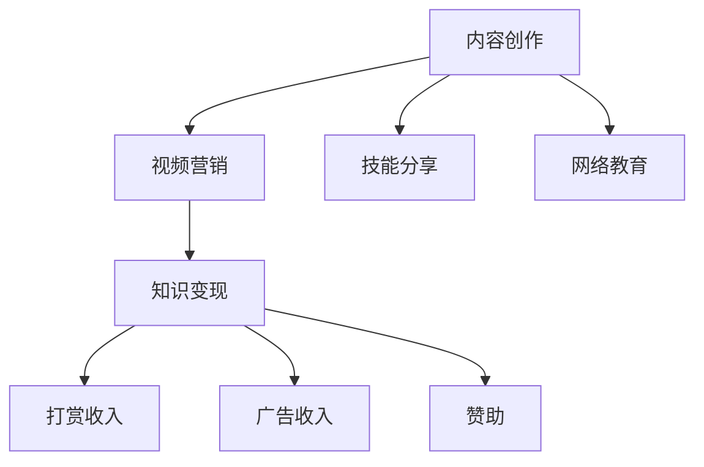
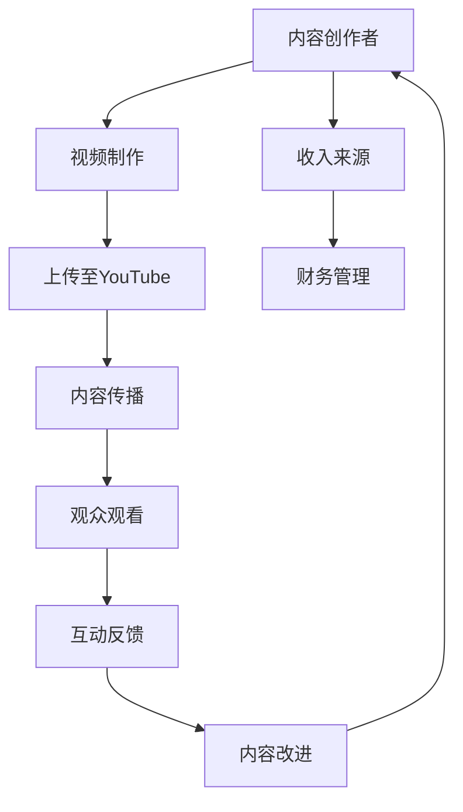

                 

# 程序员如何利用YouTube进行知识变现

> 关键词：知识变现, 程序员, YouTube, 内容创作, 视频营销, 收入增加, 网络教育, 技能分享

## 1. 背景介绍

在当今这个信息爆炸的时代，内容创造已经成为了一个新兴的行业。对于程序员来说，他们的技术知识和经验是一笔宝贵的财富，而这些知识可以通过多样化的方式进行变现。本文将探讨程序员如何利用YouTube进行知识变现，从内容创作、视频营销、以及与观众互动等方面入手，为你提供一个全面的指南。

## 2. 核心概念与联系

### 2.1 核心概念概述

为了更好地理解程序员如何利用YouTube进行知识变现，首先介绍几个核心概念：

- **YouTube**：全球最大的视频分享平台，提供海量的用户生成内容，是内容创作者分享知识、技能、经验等信息的理想场所。
- **内容创作**：通过制作视频内容，提供有价值的信息和知识，吸引观众。
- **视频营销**：通过推广视频内容，提高观众数量和订阅量，增加曝光度。
- **知识变现**：通过内容创作和营销，获取观众的打赏、广告收入、赞助等，实现经济利益。
- **技能分享**：将自身在编程、开发、项目管理等方面的技能，通过视频形式传递给观众，帮助他们提升技术水平。
- **网络教育**：利用YouTube进行线上教育，为观众提供系统化、专业化的课程，帮助他们实现职业成长。

这些概念之间的逻辑关系可以通过以下Mermaid流程图来展示：



这个流程图展示的内容创作与变现、技能分享与网络教育等环节的关系：

1. 内容创作是知识变现和技能分享、网络教育的基础。
2. 视频营销可以加速内容的传播和变现。
3. 知识变现可以提供经济支持，进一步推动内容创作和技能分享。
4. 网络教育则能提供系统化的学习资源，提升观众的技能水平。

### 2.2 核心概念原理和架构的 Mermaid 流程图

以下是一个简单的Mermaid流程图，展示了YouTube内容创作与变现的架构：



这个流程图展示了内容创作者从内容制作到变现的整个过程，包括视频制作、上传、传播、观看、反馈、改进、以及最终收入来源和财务管理。

## 3. 核心算法原理 & 具体操作步骤

### 3.1 算法原理概述

YouTube内容变现的核心算法原理主要围绕以下几个方面展开：

1. **用户行为分析**：分析观众的观看历史、订阅习惯、互动行为等，以了解观众的偏好和需求。
2. **内容推荐算法**：根据用户行为数据，推荐相关的视频内容，提高内容的曝光率和观看量。
3. **收益分配机制**：YouTube采用广告收入分配机制，根据视频观看次数、订阅人数等指标，将广告收入分配给内容创作者。
4. **互动和反馈机制**：通过评论、点赞、分享等互动行为，收集观众的反馈，优化内容质量和观众体验。
5. **数据分析和优化**：利用数据分析工具，分析观看数据、收益数据等，持续优化内容创作和营销策略。

### 3.2 算法步骤详解

基于上述核心算法原理，YouTube内容变现的具体操作步骤可以分为以下几个步骤：

1. **确定内容主题和目标受众**：根据自身的技术专长和市场趋势，确定内容主题和目标受众，并制定内容创作计划。
2. **制作高质量视频内容**：利用编程技巧、项目经验等，制作高质量、有价值的视频内容，包括教程、案例分析、编程挑战等。
3. **优化视频SEO**：通过关键词优化、视频描述、标签等，提高视频在YouTube上的搜索排名，吸引更多观众。
4. **发布视频和互动反馈**：在YouTube上发布视频内容，并通过评论、直播等形式与观众互动，收集反馈信息。
5. **数据分析和调整**：利用YouTube提供的分析工具，分析观众数据、观看数据等，不断优化内容策略和营销手段。
6. **多元化变现方式**：除了广告收入，还可以通过观众打赏、课程销售、会员订阅、品牌合作等方式实现多元化变现。

### 3.3 算法优缺点

YouTube内容变现的算法具有以下优点：

1. **低门槛**：任何人都可以创建YouTube账号，开始制作和发布视频内容，不需要大量资金投入。
2. **多样化收入来源**：通过广告、观众打赏、课程销售等多种方式，获得稳定且多样化的收入来源。
3. **广泛传播**：YouTube拥有全球数亿用户，视频内容可以通过搜索引擎、社交媒体等方式快速传播。
4. **持续优化**：利用数据分析工具，不断优化内容质量和传播策略，提升观看量和订阅量。

然而，也存在以下缺点：

1. **竞争激烈**：YouTube内容创作者众多，如何脱颖而出，获取更多观众，是一个挑战。
2. **时间和精力投入大**：内容创作、视频剪辑、数据分析等工作，需要投入大量时间和精力。
3. **市场变化快**：技术领域变化迅速，需要持续学习新知识，更新内容。
4. **平台规则限制**：YouTube有严格的平台规则，需要遵循，否则可能导致账号被封禁。

### 3.4 算法应用领域

YouTube内容变现的算法不仅适用于程序员，也广泛应用于音乐、娱乐、教育、科技等多个领域。以下列举几个具体的应用领域：

1. **编程教育**：通过制作编程教程、项目实战案例、编程挑战等视频内容，帮助观众提升编程技能。
2. **技术博客**：利用视频形式记录技术博客，分享编程经验和项目心得。
3. **项目开发**：展示技术项目开发的完整过程，包括需求分析、设计、实现、测试等环节，为观众提供学习参考。
4. **技术讲座和会议**：录制和分享技术讲座和会议，传播最新的技术趋势和研究成果。
5. **产品演示**：展示自己的技术项目或产品，介绍产品功能、优势和使用场景。

## 4. 数学模型和公式 & 详细讲解 & 举例说明

### 4.1 数学模型构建

YouTube内容变现的数学模型可以从以下几个方面进行构建：

1. **观看量模型**：$W(t) = f(T_k, R_k, S_k)$，其中$W(t)$表示在时间$t$的视频观看量，$T_k$表示视频的时长，$R_k$表示视频的订阅人数，$S_k$表示视频的互动评分。
2. **收益模型**：$I(t) = aW(t) + bS_k + c$，其中$I(t)$表示在时间$t$的总收入，$a$表示广告收入的比例系数，$b$表示观众打赏的比例系数，$c$表示其他收入来源（如课程销售）。
3. **观众增长模型**：$G(t) = g(I(t), W(t), D_k)$，其中$G(t)$表示在时间$t$的订阅人数增长，$I(t)$表示收入，$W(t)$表示观看量，$D_k$表示观众的地理位置和偏好。

### 4.2 公式推导过程

以观看量模型为例，假设观众的观看行为遵循泊松分布，则观看量模型可以表示为：

$$
W(t) = \lambda_t e^{-\lambda_t T_k}
$$

其中$\lambda_t$表示在时间$t$的观看速率，可以通过观众行为数据进行估计。

### 4.3 案例分析与讲解

假设一个程序员通过YouTube发布视频教程，订阅人数为5000，视频时长为10分钟，互动评分为4.5分。根据上述模型，可以计算出该视频在特定时间段的观看量，进而预测收益。

## 5. 项目实践：代码实例和详细解释说明

### 5.1 开发环境搭建

要利用YouTube进行知识变现，首先需要搭建开发环境。以下是使用Python进行YouTube视频创作和分析的开发环境配置流程：

1. **安装Python**：从官网下载并安装Python，建议选择最新版本。
2. **安装YouTube API**：通过Google Cloud Platform获取API密钥，安装Python的YouTube API客户端库。
3. **安装数据分析工具**：安装NumPy、Pandas、Matplotlib等数据分析工具，用于视频观看量和收益的分析。
4. **安装视频编辑工具**：安装FFmpeg、HandBrake等视频编辑工具，用于视频制作和优化。

### 5.2 源代码详细实现

以下是一个简单的Python代码示例，用于分析YouTube视频内容的数据：

```python
import googleapiclient.discovery
from googleapiclient.errors import HttpError
import pandas as pd
import numpy as np

# 设置YouTube API客户端
api_service_name = 'youtube'
api_version = 'v3'
client = googleapiclient.discovery.build(api_service_name, api_version, developerKey='YOUR_API_KEY')

# 获取视频的观看次数和订阅人数
video_id = 'YOUR_VIDEO_ID'
request = client.videos().list(
    part='snippet,statistics',
    id=video_id
)
response = request.execute()
data = response['items'][0]['statistics']

# 提取观看次数和订阅人数
watch_time = data['viewCount']
subscription_count = data['subscriptionCount']

# 计算观看量模型
lambda_t = np.log(watch_time / 1000) / (10 * 60)
watch_volume = lambda_t * 10

# 输出观看量模型结果
print('观看量模型结果：', watch_volume)
```

### 5.3 代码解读与分析

在上述代码中，我们首先通过Google Cloud Platform获取YouTube API密钥，并使用Google API客户端库，获取指定视频ID的观看次数和订阅人数。然后，根据泊松分布模型计算视频观看量，输出结果。

需要注意的是，实际使用YouTube API时，需要严格遵守Google的API使用协议，避免滥用资源。此外，代码中的`YOUR_API_KEY`和`YOUR_VIDEO_ID`需要替换为实际的API密钥和视频ID。

### 5.4 运行结果展示

执行上述代码后，将输出指定视频在特定时间段的观看量，即泊松分布模型计算出的观看量结果。

## 6. 实际应用场景

### 6.1 YouTube内容变现的应用场景

YouTube内容变现的应用场景非常广泛，以下是几个具体的例子：

1. **编程教育**：通过制作编程教程、项目实战案例、编程挑战等视频内容，吸引程序员观众，通过观众打赏、课程销售等方式实现变现。
2. **技术博客**：利用视频形式记录技术博客，分享编程经验和项目心得，吸引技术爱好者，通过广告收入、赞助等方式实现变现。
3. **项目开发**：展示技术项目开发的完整过程，包括需求分析、设计、实现、测试等环节，吸引开发者观众，通过打赏、课程销售等方式实现变现。
4. **技术讲座和会议**：录制和分享技术讲座和会议，传播最新的技术趋势和研究成果，吸引学术和技术爱好者，通过打赏、课程销售、品牌合作等方式实现变现。
5. **产品演示**：展示自己的技术项目或产品，介绍产品功能、优势和使用场景，吸引潜在客户，通过广告收入、品牌合作等方式实现变现。

### 6.2 未来应用展望

随着技术的发展，YouTube内容变现的趋势将向以下几个方向发展：

1. **多样化的变现方式**：除了传统的广告收入、观众打赏、课程销售外，通过虚拟现实(VR)、增强现实(AR)、互动视频等新型技术手段，探索新的变现方式。
2. **多平台协同**：将YouTube内容与社交媒体、博客、论坛等平台协同，扩大观众覆盖面，提升变现效率。
3. **个性化推荐**：利用机器学习和数据分析技术，实现内容推荐个性化，提升观众观看率和订阅率。
4. **用户参与度提升**：通过直播互动、社区建设等方式，提升观众的参与度和忠诚度，增强变现能力。
5. **国际化扩展**：探索在多个国家和地区推广YouTube内容，实现全球化变现。

## 7. 工具和资源推荐

### 7.1 学习资源推荐

为了帮助开发者系统掌握YouTube内容变现的技术，这里推荐一些优质的学习资源：

1. **YouTube官方文档**：YouTube提供的详细API文档和开发者指南，是入门YouTube开发的基础。
2. **Python编程教程**：如《Python编程：从入门到实践》，通过视频教程和实战案例，系统学习Python编程技能。
3. **数据分析与可视化**：如《Python数据科学手册》，学习使用NumPy、Pandas、Matplotlib等工具进行数据分析和可视化。
4. **视频编辑与优化**：如《FFmpeg视频编辑教程》，学习使用FFmpeg、HandBrake等工具进行视频制作和优化。
5. **机器学习和数据分析**：如《机器学习实战》，学习使用机器学习算法进行数据分析和模型构建。

通过这些资源的学习实践，相信你一定能够快速掌握YouTube内容变现的关键技术和策略，开始自己的YouTube创业之旅。

### 7.2 开发工具推荐

高效的开发离不开优秀的工具支持。以下是几款用于YouTube内容变现开发的常用工具：

1. **Google Cloud Platform**：提供YouTube API的API密钥和开发者工具，方便进行YouTube内容的管理和数据分析。
2. **Jupyter Notebook**：提供交互式编程环境，支持Python和数据分析工具的使用。
3. **YouTube Studio**：YouTube提供的管理后台，方便创作者上传、编辑和管理视频内容。
4. **Visual Studio Code**：功能强大的代码编辑器，支持Python、YouTube API客户端库等插件的开发。
5. **GitHub**：代码托管平台，方便开发者进行版本控制和协作开发。

合理利用这些工具，可以显著提升YouTube内容变现的开发效率，加快创新迭代的步伐。

### 7.3 相关论文推荐

YouTube内容变现的技术不断发展，以下是几篇奠基性的相关论文，推荐阅读：

1. **YouTube内容推荐算法**：研究YouTube视频推荐的算法和优化策略，提高视频推荐的准确性和用户体验。
2. **YouTube内容变现模型**：通过数学建模和数据分析，探索YouTube内容变现的模型和策略，提升变现效率。
3. **YouTube内容互动分析**：研究YouTube观众的互动行为和反馈，优化视频内容和互动策略，提升观众参与度。
4. **YouTube内容版权保护**：研究如何在YouTube上保护视频内容版权，避免盗版和侵权行为。
5. **YouTube内容分析工具**：研究如何使用数据分析工具，分析YouTube视频内容的表现和观众行为，优化内容策略。

这些论文代表了大规模内容创作和变现技术的发展脉络，通过学习这些前沿成果，可以帮助研究者把握学科前进方向，激发更多的创新灵感。

## 8. 总结：未来发展趋势与挑战

### 8.1 总结

本文对程序员如何利用YouTube进行知识变现进行了全面系统的介绍。首先阐述了内容创作、视频营销、知识变现等核心概念和相关逻辑关系。其次，从原理到实践，详细讲解了YouTube内容变现的算法原理和具体操作步骤，给出了完整的代码实现和解释分析。同时，本文还探讨了YouTube内容变现的实际应用场景和未来发展趋势，推荐了相关学习资源、开发工具和研究论文，力求为读者提供全方位的技术指引。

通过本文的系统梳理，可以看到，YouTube内容变现是程序员实现知识变现的重要渠道，通过内容创作、视频营销和数据分析等手段，可以在YouTube上实现稳定且多样化的收入来源。YouTube平台提供的广泛曝光和多元化变现方式，为程序员提供了广阔的创业机会。未来，伴随技术的不断进步和市场的持续扩展，YouTube内容变现必将迎来更加广泛的应用和更多的创新突破。

### 8.2 未来发展趋势

展望未来，YouTube内容变现技术将呈现以下几个发展趋势：

1. **技术迭代加速**：随着人工智能、机器学习、数据分析等技术的进步，YouTube内容变现的算法和工具将不断优化，提升变现效率。
2. **内容形式多样**：除了视频内容，还包括直播、短视频、图文等多种形式的内容，满足观众的多样化需求。
3. **观众互动增强**：通过直播互动、社区建设等方式，增强观众的参与度和忠诚度，提升变现能力。
4. **个性化推荐**：利用机器学习和数据分析技术，实现内容推荐个性化，提升观众观看率和订阅率。
5. **国际化扩展**：探索在多个国家和地区推广YouTube内容，实现全球化变现。

### 8.3 面临的挑战

尽管YouTube内容变现技术已经取得了显著成效，但在迈向更加智能化、普适化应用的过程中，它仍面临着诸多挑战：

1. **竞争激烈**：YouTube内容创作者众多，如何脱颖而出，获取更多观众，是一个挑战。
2. **时间和精力投入大**：内容创作、视频剪辑、数据分析等工作，需要投入大量时间和精力。
3. **市场变化快**：技术领域变化迅速，需要持续学习新知识，更新内容。
4. **平台规则限制**：YouTube有严格的平台规则，需要遵循，否则可能导致账号被封禁。

### 8.4 研究展望

面对YouTube内容变现所面临的种种挑战，未来的研究需要在以下几个方面寻求新的突破：

1. **内容质量提升**：通过高质量的视频内容，吸引和留住观众，提升变现能力。
2. **观众分析优化**：通过深入分析观众行为，优化视频内容策略，提高观众参与度和忠诚度。
3. **多元化变现策略**：探索新的变现方式，如虚拟现实(VR)、增强现实(AR)、互动视频等，提升变现效率。
4. **跨平台协作**：将YouTube内容与其他平台（如社交媒体、博客等）协同，扩大观众覆盖面，提升变现效果。
5. **国际化扩展**：探索在多个国家和地区推广YouTube内容，实现全球化变现。

这些研究方向的探索，必将引领YouTube内容变现技术迈向更高的台阶，为程序员提供更广阔的变现空间和更高的收益回报。

## 9. 附录：常见问题与解答

**Q1：YouTube内容变现需要多少订阅观众？**

A: 获得收入需要有一定数量的订阅观众，具体的数量因平台政策和视频内容而异。一般建议至少获得1000-5000名订阅观众，才能开始看到显著的收入增长。

**Q2：如何进行YouTube视频优化？**

A: 视频优化是提高YouTube内容变现的关键，以下是一些优化策略：
1. 视频标题和描述：使用吸引人的标题和详细的描述，提高搜索排名。
2. 视频标签和关键词：合理使用标签和关键词，提高搜索覆盖面。
3. 视频时长和格式：选择合适的视频时长和格式，提高观看量和观看率。
4. 视频质量：保持视频高质量、高清晰度，提升观众观看体验。
5. 视频互动：鼓励观众在评论区留言、点赞、分享，增加互动率。

**Q3：如何进行YouTube数据分析？**

A: YouTube提供了详细的分析工具，可以分析视频观看量、观众互动、收入等数据。以下是一些常用的分析指标：
1. 观看量：统计视频的总观看次数。
2. 观众互动：统计视频的点赞、评论、分享等互动数据。
3. 订阅数：统计观众的订阅数量和增长率。
4. 收入：统计广告收入、观众打赏等收益来源。

通过数据分析，可以了解视频的表现情况，不断优化内容策略和营销手段。

**Q4：如何进行YouTube广告投放？**

A: 利用YouTube广告平台，可以将视频内容投放给目标受众，实现精准广告投放。以下是一些常见的广告投放策略：
1. 目标受众：设置广告投放的目标受众，包括年龄、性别、地理位置等。
2. 广告时长：选择合适的广告时长，保证观众的观看体验。
3. 广告预算：设置广告预算，根据广告效果进行优化。
4. 广告素材：制作吸引人的广告素材，提高广告点击率和转化率。

通过合理的广告投放，可以提升视频内容的曝光率和观众数量，实现更高的变现效果。

通过本文的系统梳理，可以看到，YouTube内容变现是程序员实现知识变现的重要渠道，通过内容创作、视频营销和数据分析等手段，可以在YouTube上实现稳定且多样化的收入来源。YouTube平台提供的广泛曝光和多元化变现方式，为程序员提供了广阔的创业机会。未来，伴随技术的不断进步和市场的持续扩展，YouTube内容变现必将迎来更加广泛的应用和更多的创新突破。

