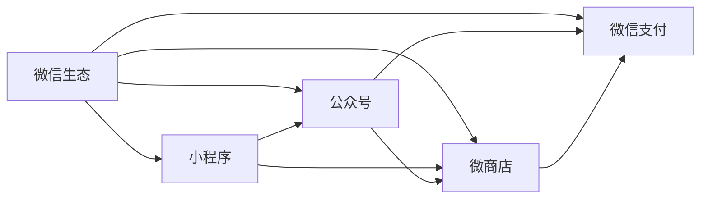

                 

# 程序员如何利用微信生态进行知识付费

> 关键词：微信生态,知识付费,小程序,公众号,微商店,微信支付,数字内容,数据分析,智能推荐

## 1. 背景介绍

### 1.1 问题由来

随着移动互联网的发展和智能手机的普及，越来越多的人通过手机获取信息、享受服务。传统的网站和应用软件已经不能满足用户的移动化需求，微信生态以其独特的社交属性和便捷的使用体验，逐渐成为人们日常生活中的重要组成部分。

与此同时，知识付费作为互联网时代的新型商业模式，为专业人士和机构提供了一个展示才华、分享知识、变现价值的平台。程序员作为IT行业的主力军，掌握着丰富的技术知识和实践经验，有很强的分享和变现潜力。

### 1.2 问题核心关键点

知识付费对于程序员而言，既是一种变现方式，也是一种提升自身影响力的途径。但如何结合微信生态，更有效地开展知识付费活动，最大化收益，是一个值得深入探讨的问题。

本文将重点讨论利用微信生态进行知识付费的具体策略和实施方案，涵盖小程序、公众号、微商店、微信支付等关键要素，旨在为程序员提供系统的技术指导和操作指南。

### 1.3 问题研究意义

利用微信生态进行知识付费，不仅可以拓宽程序员的收入渠道，还可以通过提供高质量的技术内容，帮助他人提升技能、解决实际问题，形成正向循环。这种模式不仅提升了程序员的技术价值，也增强了社区凝聚力和生态粘性，具有广泛的应用前景和深远的社会意义。

## 2. 核心概念与联系

### 2.1 核心概念概述

为了更好地理解如何利用微信生态进行知识付费，我们需要掌握以下几个核心概念：

- 微信生态：包括微信、微信公众号、微信小程序、微信微商店、微信支付等各类微信平台和工具，共同构成了完整的微信服务体系。
- 知识付费：通过微信平台提供专业知识和技能服务，以货币或其他形式获得报酬的商业模式。
- 小程序：通过微信平台提供的编程框架和开发工具，可以快速创建轻量级、功能丰富的移动应用。
- 公众号：提供定时推送内容、互动交流的平台，适合发布长图文、视频等内容。
- 微商店：在微信中创建个人或企业商店，销售数字内容、技术工具等。
- 微信支付：提供安全、便捷的在线支付服务，支持微信生态内的各类交易。

这些概念之间的逻辑关系可以通过以下Mermaid流程图来展示：



这个流程图展示了微信生态的核心组件和它们之间的联系。小程序、公众号、微商店、微信支付等都是微信生态的重要组成部分，相互配合，共同支持知识付费的实施。

## 3. 核心算法原理 & 具体操作步骤
### 3.1 算法原理概述

利用微信生态进行知识付费，本质上是一种以服务为核心的商业模型。其核心算法原理包括但不限于以下几个方面：

- 用户行为分析：通过数据分析技术，了解用户的行为模式和需求，提供个性化的推荐和服务。
- 内容推荐算法：基于用户行为和内容特征，构建推荐模型，帮助用户发现高质量的内容。
- 交易机制设计：设计合理的交易规则和激励机制，保障交易双方的利益和信任。
- 数据安全保护：采用加密和防欺诈技术，确保用户支付信息的安全性。

### 3.2 算法步骤详解

下面详细介绍利用微信生态进行知识付费的具体操作步骤：

**Step 1: 申请微信公众平台账号**
- 登录微信公众平台官网，点击“立即注册”，填写基本信息，如名称、邮箱、手机等。
- 选择“个人账号”或“企业账号”，根据需求填写相应的信息，包括主体类型、行业、规模等。
- 完成微信账号的绑定，选择适合的认证方式，提交审核。

**Step 2: 开发小程序**
- 进入微信公众平台小程序管理界面，选择“添加小程序”。
- 填写小程序的基本信息，如名称、简介、logo等。
- 选择“开发模式”，选择“小程序”，填写小程序的开发信息，包括开发语言、开发环境等。
- 创建小程序应用，设置应用信息，如版本号、描述等。
- 进入开发模式，编写小程序的代码，调试测试，发布上线。

**Step 3: 创建公众号**
- 进入微信公众平台公众号管理界面，选择“添加公众号”。
- 填写公众号的基本信息，如名称、简介、头像等。
- 选择“认证方式”，根据需求选择“个体工商户”、“企业”等认证方式，并提交相关资质证明。
- 完成公众号的认证，获取公众号的认证ID。

**Step 4: 创建微商店**
- 进入微信公众平台微商店管理界面，选择“添加微商店”。
- 填写微商店的基本信息，如名称、简介、logo等。
- 选择“认证方式”，根据需求选择“个体工商户”、“企业”等认证方式，并提交相关资质证明。
- 完成微商店的认证，获取微商店的认证ID。

**Step 5: 设计内容服务**
- 根据自身的技术专长和市场需求，设计各类内容服务，如技术教程、编程实战、问题答疑等。
- 使用微信公众号发布内容，通过文章、视频、音频等形式，吸引用户关注和订阅。
- 将内容打包为课程或服务，设定价格和课时。

**Step 6: 实现支付功能**
- 在小程序或微商店中集成微信支付API，提供微信支付功能。
- 设定支付规则，包括支付方式、支付手续费等。
- 通过微信支付完成订单处理和用户支付。

**Step 7: 数据分析与优化**
- 利用微信平台提供的数据分析工具，收集用户行为数据。
- 分析用户数据，了解用户需求和行为特征，优化内容和服务。
- 通过智能推荐算法，推荐相关内容给用户，提高用户满意度和转化率。

**Step 8: 持续更新与维护**
- 根据用户反馈和技术发展，持续更新和优化内容和服务。
- 定期进行微信生态的维护和升级，确保服务的稳定性和安全性。
- 拓展新的业务领域，如直播、社群、线下活动等，增加收入渠道。

### 3.3 算法优缺点

利用微信生态进行知识付费的优势包括：

- 覆盖广泛：微信生态覆盖了大量的用户，尤其是在年轻用户中拥有极高的用户粘性，有助于扩大知识付费的受众基础。
- 功能丰富：小程序、公众号、微商店等功能丰富，可以根据不同的需求，提供多样化的服务。
- 操作便捷：微信生态中的各项功能操作简便，适合非技术背景的创作者快速上手。

但同时也存在一些缺点：

- 平台依赖：过度依赖微信平台，可能面临平台政策变化的风险。
- 监管压力：作为新型的商业模式，知识付费领域存在一定的监管压力，需时刻关注相关政策法规的变化。
- 内容竞争：微信生态中内容丰富，用户选择面广，内容创作需有独特性和竞争力。

### 3.4 算法应用领域

利用微信生态进行知识付费可以广泛应用于以下领域：

- 技术教程：为初学者提供编程语言、框架、工具等技术教程，帮助他们快速入门。
- 实战项目：提供实际开发项目的案例分析、代码示例、问题解答，提升用户实战能力。
- 问题答疑：提供技术疑难问题的在线答疑服务，帮助用户解决实际问题。
- 技术培训：提供企业内部的技术培训课程，提升员工的技术水平。
- 产品推广：利用公众号、小程序等渠道推广自己的产品和服务，增加曝光度。
- 软件开发：通过微信微商店销售软件、工具、模板等数字内容，实现产品变现。

## 4. 数学模型和公式 & 详细讲解 & 举例说明

### 4.1 数学模型构建

为了更好地理解知识付费中的推荐算法，我们可以构建一个简单的推荐模型。设用户集合为 $U$，内容集合为 $V$，用户与内容的交互数据为 $I$。

定义用户对内容的评分矩阵 $R_{UV}$，其中 $R_{ui}$ 表示用户 $u$ 对内容 $v$ 的评分。设 $\overrightarrow{r_u}$ 为用户 $u$ 的评分向量，$\overrightarrow{p_v}$ 为内容 $v$ 的评分向量，则推荐算法可以通过计算用户 $u$ 对内容 $v$ 的预测评分来实现。

### 4.2 公式推导过程

推荐算法常用的模型包括协同过滤和基于内容的推荐。

**协同过滤算法**
- 基于用户的协同过滤：计算用户 $u$ 和用户 $v$ 的相似度 $\alpha_{uv}$，利用用户 $v$ 对内容 $p$ 的评分 $\overrightarrow{r_v}$ 预测用户 $u$ 对内容 $p$ 的评分 $\overrightarrow{r_u}$。
- 基于物品的协同过滤：利用物品 $p$ 和物品 $q$ 的相似度 $\beta_{pq}$，利用物品 $q$ 对用户 $v$ 的评分 $\overrightarrow{r_v}$ 预测物品 $p$ 对用户 $u$ 的评分 $\overrightarrow{r_u}$。

**基于内容的推荐算法**
- 基于内容的推荐算法可以通过计算内容特征向量 $c_v$ 和用户特征向量 $f_u$ 的相似度 $\gamma_{uv}$，预测用户 $u$ 对内容 $v$ 的评分。

### 4.3 案例分析与讲解

下面以一个简单的案例来展示推荐算法的实现：

**案例背景**
- 某技术博客平台有多个编程语言教程，如Java、Python、C++等。
- 平台上有数千名用户订阅，每天有大量新增用户。

**数据准备**
- 用户对各课程的评分数据：用户 $u$ 对课程 $v$ 的评分 $r_{uv}$。
- 课程特征数据：课程 $v$ 的编程难度、教学风格、内容深度等特征 $c_v$。
- 用户特征数据：用户 $u$ 的职业、学习经验、兴趣等特征 $f_u$。

**算法实现**
- 基于用户的协同过滤算法：
  - 计算用户 $u$ 和用户 $v$ 的相似度 $\alpha_{uv}$。
  - 利用用户 $v$ 对课程 $p$ 的评分 $\overrightarrow{r_v}$ 预测用户 $u$ 对课程 $p$ 的评分 $\overrightarrow{r_u}$。
- 基于内容的推荐算法：
  - 计算课程特征向量 $c_v$ 和用户特征向量 $f_u$ 的相似度 $\gamma_{uv}$。
  - 利用课程特征向量 $c_v$ 预测用户 $u$ 对课程 $v$ 的评分 $\overrightarrow{r_u}$。

## 5. 项目实践：代码实例和详细解释说明
### 5.1 开发环境搭建

要进行知识付费平台的开发，首先需要搭建一个合适的开发环境。以下是具体的步骤：

1. 安装Node.js和npm：Node.js是微信小程序开发的基础，npm用于管理项目依赖。
   ```bash
   sudo apt-get install nodejs npm
   ```

2. 创建微信小程序开发项目：
   ```bash
   npm init -y
   npm install weapp --save
   ```

3. 安装微信小程序开发工具：
   - 下载微信小程序开发工具（https://developers.weixin.qq.com/miniprogram/dev/tools/download.html）
   - 解压安装后，进入bin目录，配置环境变量：
     ```bash
     export PATH=$PATH:/path/to/weapp/bin
     ```

4. 创建微信小程序：
   - 在微信小程序开发工具中，选择“创建新项目”。
   - 输入项目名称、路径等信息，选择“创建”。
   - 进入项目目录，编写小程序代码。

### 5.2 源代码详细实现

下面以一个简单的技术教程小程序为例，展示代码实现：

**index.js**
```javascript
Page({
  data: {
    courses: [],
    currentCourse: {},
    loading: false
  },
  onLoad: function (options) {
    this.getCourses();
  },
  getCourses: function () {
    this.setData({
      loading: true
    });
    wx.request({
      url: 'https://example.com/api/courses',
      success: function (res) {
        var courses = res.data;
        this.setData({
          courses: courses,
          currentCourse: courses[0],
          loading: false
        });
      }
    });
  },
  onCourseClick: function (e) {
    var courseId = e.target.dataset.courseId;
    this.getCourseDetail(courseId);
  },
  getCourseDetail: function (courseId) {
    this.setData({
      loading: true
    });
    wx.request({
      url: 'https://example.com/api/course/' + courseId,
      success: function (res) {
        var course = res.data;
        this.setData({
          currentCourse: course,
          loading: false
        });
      }
    });
  }
});
```

**course-list.html**
```html
<view>
  <view class="course-item" wx:for="{{courses}}" wx:key="{{index}}" wx:bindtap="onCourseClick">
    <view class="course-title">{{course.title}}</view>
    <view class="course-desc">{{course.desc}}</view>
  </view>
</view>
```

### 5.3 代码解读与分析

1. **index.js分析**
   - `onLoad`方法：当页面加载时，自动调用 `getCourses` 方法，获取所有课程信息，并进行页面渲染。
   - `getCourses`方法：发送网络请求，获取所有课程数据，并将其保存到组件状态中。
   - `onCourseClick`方法：当用户点击课程项时，调用 `getCourseDetail` 方法，获取该课程的详细信息。
   - `getCourseDetail`方法：发送网络请求，获取指定课程的详细信息，并更新组件状态。

2. **course-list.html分析**
   - `course-item` 标签：用于循环渲染课程项，显示课程标题和描述。
   - `wx:for`：用于循环渲染列表，`index` 为循环变量，用于设置每个列表项的唯一标识。
   - `wx:bindtap`：用于绑定点击事件，当用户点击课程项时，调用 `onCourseClick` 方法。

3. **运行结果展示**
   - 在小程序开发工具中运行程序，即可看到课程列表的渲染效果。
   - 点击某个课程项，即可看到该课程的详细信息。

## 6. 实际应用场景

### 6.1 教育培训

微信生态中的小程序、公众号和微商店，可以有效地帮助教育培训机构进行知识付费。

**应用场景**
- 培训机构可以在小程序上创建课程，提供视频、文档、练习等丰富内容。
- 利用公众号进行课程推广和营销，吸引更多学员关注和订阅。
- 在微商店中销售课程包、证书、书籍等附加服务，增加收入来源。

**案例**
- 某编程培训机构，通过小程序提供Python、Java等编程语言的在线课程，每门课程售价199元。
- 在公众号中发布课程预告、学员评价、优惠活动等信息，吸引用户订阅。
- 在微商店中销售相关书籍、工具、证书等，增加附加收入。

### 6.2 技术咨询

技术咨询是一种高端的知识付费模式，通过微信生态可以更便捷地提供服务。

**应用场景**
- 技术专家可以通过公众号发布技术文章、案例分析、在线咨询等信息，展示自身实力。
- 用户可以通过小程序或公众号与技术专家进行交流，获取个性化的技术支持。
- 在微商店中销售技术咨询服务、技术咨询报告等付费内容，增加收入。

**案例**
- 某资深Java程序员，通过公众号发布技术文章和案例分析，吸引用户关注。
- 在小程序中提供一对一在线咨询服务，每小时收费199元。
- 在微商店中销售技术咨询服务、技术咨询报告等付费内容，增加收入。

### 6.3 软件开发

软件开发是程序员最常见的知识付费形式，利用微信生态可以更好地推广和销售自己的产品和服务。

**应用场景**
- 软件开发人员可以在小程序中展示自己的项目和产品。
- 利用公众号进行项目推广和用户互动。
- 在微商店中销售产品、工具、模板等数字内容，实现产品变现。

**案例**
- 某软件开发者，通过小程序展示自己的开发项目，提供源代码、技术文档、视频教程等。
- 在公众号中发布项目更新、用户评价、技术分享等信息，吸引用户关注和下载。
- 在微商店中销售开发工具、模板、插件等，增加产品变现渠道。

## 7. 工具和资源推荐

### 7.1 学习资源推荐

- 《微信小程序开发指南》：微信官方发布的开发手册，详细介绍微信小程序的开发流程和常见问题。
- 《微信公众平台开发指南》：微信官方发布的开发手册，详细介绍公众号和微商店的开发流程和常见问题。
- 《微信开发工具使用手册》：微信官方发布的开发工具使用手册，详细介绍开发工具的安装和使用。
- 《微信生态与知识付费》：讲解利用微信生态进行知识付费的全面攻略，涵盖小程序、公众号、微商店、微信支付等。

### 7.2 开发工具推荐

- 微信公众平台：提供公众号、微商店、微信支付等功能的开发和运营平台。
- 微信小程序开发工具：提供微信小程序的开发和调试工具，支持代码自动生成、可视化界面设计等。
- 微信开发工具：提供微信公众平台和小程序的开发和管理工具，支持微信服务器的搭建和维护。
- npm：用于管理项目依赖的工具，方便快速安装、更新和发布第三方组件。

### 7.3 相关论文推荐

- 《微信生态中的知识付费模式研究》：探讨微信生态在知识付费中的应用，提出相关策略和建议。
- 《利用微信小程序进行技术教程的开发与推广》：介绍利用微信小程序进行技术教程开发的案例和方法。
- 《基于微商店的知识付费模式分析》：分析基于微商店的知识付费模式，提出优化策略和建议。

## 8. 总结：未来发展趋势与挑战

### 8.1 总结

本文详细探讨了利用微信生态进行知识付费的具体策略和实施方案。通过微信小程序、公众号、微商店、微信支付等组件，程序员可以高效地开展知识付费活动，拓展收入渠道，提升自身影响力。

通过微信生态的知识付费，不仅能够提升程序员的技术价值，还能够构建更加活跃、有粘性的社区，形成正向循环。未来的知识付费市场将有广阔的发展空间，值得更多的关注和投入。

### 8.2 未来发展趋势

未来，利用微信生态进行知识付费将呈现以下几个趋势：

- 智能化推荐：利用机器学习和大数据技术，提供更加精准的推荐服务，提升用户满意度和转化率。
- 多元化变现：除了传统的知识付费，还可以拓展到直播、社群、线下活动等多种变现形式。
- 个性化服务：根据用户行为和需求，提供个性化的内容和服务，提升用户体验。
- 国际化扩展：通过微信生态的国际化功能，拓展海外市场，增加全球用户群体。

### 8.3 面临的挑战

虽然利用微信生态进行知识付费有着巨大的潜力和前景，但也面临一些挑战：

- 平台政策变化：微信生态的政策变化可能影响知识付费的运营和发展。
- 内容同质化：微信生态中的内容丰富，如何突出自身的独特性和竞争力，是一个挑战。
- 市场监管：知识付费领域存在一定的监管压力，需时刻关注相关政策法规的变化。
- 用户体验：如何提升用户体验，减少用户流失，增加用户粘性，是一个长期的课题。

### 8.4 研究展望

未来，知识付费领域将不断创新，结合新技术和新模式，带来更多的突破和进步。微信生态作为知识付费的重要平台，将迎来更多机遇和挑战。

- 创新内容形式：结合AR、VR、AI等新技术，创新知识付费的内容形式，提升用户体验。
- 拓展服务领域：将知识付费与教育培训、技术咨询、软件开发等业务相结合，拓展服务领域。
- 优化运营模式：利用大数据和AI技术，优化知识付费的运营模式，提升运营效率和用户满意度。
- 保障用户权益：加强用户隐私保护和权益保障，确保用户支付信息和数据的安全性。

总之，利用微信生态进行知识付费，是程序员拓展收入渠道、提升自身影响力的重要途径。未来，只要不断创新、优化和完善，必将迎来更加广阔的发展前景。

## 9. 附录：常见问题与解答

**Q1: 如何使用微信公众平台进行知识付费？**

A: 1. 登录微信公众平台，填写基本信息，选择认证方式。
   2. 创建小程序、公众号、微商店等组件。
   3. 在小程序或微商店中集成微信支付API，提供支付功能。
   4. 设计并发布知识服务，如技术教程、在线咨询等。
   5. 利用公众号进行内容推广和互动交流。

**Q2: 微信公众平台如何收取支付费用？**

A: 1. 在小程序或微商店中集成微信支付API，提供支付功能。
   2. 设定支付规则，包括支付方式、支付手续费等。
   3. 用户通过微信支付支付费用，订单处理与确认。

**Q3: 如何优化微信生态中的知识付费体验？**

A: 1. 利用智能推荐算法，提供个性化的内容推荐。
   2. 优化用户体验，减少用户流失，增加用户粘性。
   3. 结合AR、VR、AI等新技术，创新内容形式。
   4. 拓展服务领域，将知识付费与教育培训、技术咨询等业务相结合。

**Q4: 知识付费领域面临哪些挑战？**

A: 1. 平台政策变化：微信生态的政策变化可能影响知识付费的运营和发展。
   2. 内容同质化：微信生态中的内容丰富，如何突出自身的独特性和竞争力。
   3. 市场监管：知识付费领域存在一定的监管压力。
   4. 用户体验：如何提升用户体验，减少用户流失。

**Q5: 知识付费领域的未来发展方向是什么？**

A: 1. 智能化推荐：利用机器学习和大数据技术，提供更加精准的推荐服务。
   2. 多元化变现：除了传统的知识付费，还可以拓展到直播、社群、线下活动等多种变现形式。
   3. 个性化服务：根据用户行为和需求，提供个性化的内容和服务。
   4. 国际化扩展：通过微信生态的国际化功能，拓展海外市场。

---

作者：禅与计算机程序设计艺术 / Zen and the Art of Computer Programming

