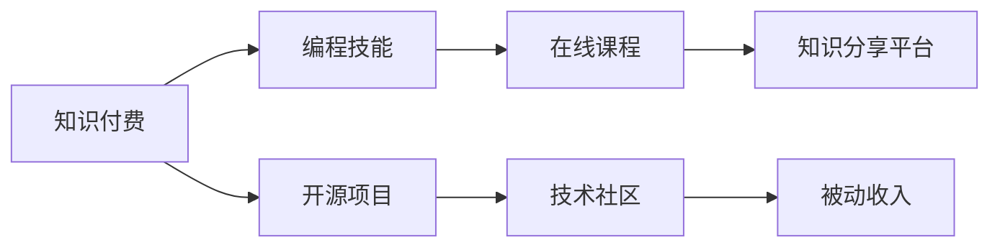

                 

# 程序员如何利用知识付费实现被动收入

## 1. 背景介绍

在数字化转型的浪潮下，编程技能已成为一种极具价值的高薪职业，但随着市场的饱和和技术迭代的加速，单纯的编程工作已经不再是高薪的保证。程序员们迫切需要寻找新的收入渠道，以应对职业生涯的不确定性。知识付费作为一种新兴的商业模式，为程序员开辟了新的收入来源，使他们能够在不牺牲编程时间的前提下，通过知识输出实现被动收入。

本文将全面介绍程序员如何通过知识付费，实现从雇佣制到自雇制的转型，走上财务自由的道路。

## 2. 核心概念与联系

为了理解如何利用知识付费实现被动收入，我们需要了解几个关键概念及其相互联系。

### 2.1 核心概念概述

- **知识付费**：指通过专业知识或技能，为他人提供有偿服务或知识，实现价值变现的过程。
- **被动收入**：与主动工作不同，被动收入是通过投资或自动化系统，在不直接参与的情况下获取的收入，如股票分红、知识产权授权费、网站广告等。
- **程序员自雇**：指程序员不再依赖雇主提供的工作机会，而是通过自己的技术或知识资源，建立业务或服务，实现财务独立。
- **知识分享平台**：如Udemy、Coursera、知乎等，为知识付费提供市场和渠道，允许程序员将自己的专业知识变现。
- **在线课程**：通过视频、文章、课程等方式，系统地传授编程知识和经验。
- **开源项目**：通过开源社区提供技术支持、代码贡献等方式，积累影响力和资源。

### 2.2 核心概念原理和架构的 Mermaid 流程图



这个流程图展示了知识付费的基本逻辑：编程技能作为核心竞争力，通过在线课程和开源项目在知识分享平台进行知识变现，最终实现被动收入。

## 3. 核心算法原理 & 具体操作步骤

### 3.1 算法原理概述

知识付费的算法原理基于价值创造和市场定价理论。价值创造是指通过知识输出，提供有价值的信息或服务，满足用户需求。市场定价则根据市场供需关系，决定知识内容的价值和价格。

从程序员的角度，如何实现知识付费？通常包括以下步骤：

1. **确定价值点**：选择适合通过知识付费输出的内容，如编程技巧、项目经验、技术分析等。
2. **内容制作**：制作高质量的知识内容，如视频课程、技术文章、代码示例等。
3. **平台选择**：选择适合的知识分享平台，确保目标用户群体的覆盖。
4. **市场定价**：根据市场需求和内容质量，合理定价。
5. **用户获取**：通过营销和推广，吸引潜在用户。
6. **持续更新**：不断更新和完善内容，保持用户黏性。

### 3.2 算法步骤详解

#### 3.2.1 确定价值点

首先，程序员需要确定哪些编程知识和经验适合通过知识付费输出。以下是一些常见的价值点：

- **编程技巧**：如高效调试、代码优化、设计模式等。
- **项目经验**：如实际项目中的技术选型、问题解决、性能优化等。
- **技术分析**：如对最新技术趋势、框架优劣、行业应用等分析。
- **实战案例**：如具体项目的案例分析、代码实现等。

选择价值点时，应考虑市场需求、竞争程度和自己的优势。通过调查市场反馈和分析自身优势，确定最有潜力的内容主题。

#### 3.2.2 内容制作

内容制作是知识付费的核心。以下是一些制作优质内容的建议：

- **系统化**：将知识内容系统化、结构化，方便用户学习和理解。
- **互动性**：增加互动元素，如问答、评论、作业等，提高用户参与度。
- **多媒体**：利用视频、图片、代码等多媒体元素，丰富学习体验。
- **案例驱动**：通过实际项目案例，展示编程知识的应用效果。

内容制作需要耗费大量时间和精力，因此需要规划好内容发布节奏和时间安排。

#### 3.2.3 平台选择

选择合适的知识分享平台是知识付费成功的关键。以下是一些平台的选择建议：

- **综合平台**：如Udemy、Coursera、edX等，覆盖广泛用户群体。
- **技术社区**：如CSDN、Stack Overflow、知乎等，专业性强，目标用户明确。
- **个人博客**：如Medium、个人博客网站等，灵活自由，适合小规模内容发布。

平台的选择应结合自己的定位和目标用户群体。

#### 3.2.4 市场定价

合理定价是知识付费的关键环节。以下是一些定价策略建议：

- **基于成本**：根据内容制作成本和自身收益预期，合理定价。
- **市场调研**：通过市场调研和竞争对手分析，了解行业定价标准。
- **动态调整**：根据用户反馈和市场变化，动态调整价格。

定价应兼顾成本、市场需求和自身收益，找到最优平衡点。

#### 3.2.5 用户获取

用户获取是知识付费的瓶颈。以下是一些用户获取策略：

- **内容营销**：通过内容推广，吸引潜在用户。如发布博客文章、参与技术社区等。
- **社交媒体**：利用社交媒体平台，增加曝光和用户互动。
- **合作推广**：与技术博客、技术社区等合作推广，扩大影响力。

用户获取需要长期坚持和不断优化，建立稳定的用户基础。

#### 3.2.6 持续更新

持续更新是保持用户黏性的关键。以下是一些持续更新策略：

- **定期发布**：制定内容发布计划，保持内容的新鲜度。
- **用户反馈**：根据用户反馈，不断改进和完善内容。
- **扩展内容**：增加新的课程、项目案例、技术分析等，保持内容多样性。

持续更新可以不断提升内容质量和用户满意度，延长知识付费的生命周期。

### 3.3 算法优缺点

知识付费作为一种商业模式，有以下优点和缺点：

**优点**：

- **高效率**：通过在线课程和知识分享，可以高效地将知识和经验变现，减少传统雇佣制的成本和风险。
- **灵活性**：工作时间和地点相对自由，可以兼顾工作和个人生活。
- **多样性**：可以从事多个领域的内容输出，积累多样化的收入来源。

**缺点**：

- **初始成本高**：内容制作和平台搭建需要较高的初始投入。
- **市场需求波动**：市场需求可能因技术迭代和市场变化而波动，影响收入稳定性。
- **竞争激烈**：知识付费市场竞争激烈，需要不断提升自身竞争力。

### 3.4 算法应用领域

知识付费在程序员职业发展中具有广泛的应用场景，包括但不限于以下几个领域：

- **技术培训**：通过在线课程、技术博客等方式，提供编程技巧、项目经验等培训服务。
- **技术咨询**：提供项目技术选型、问题解决、性能优化等咨询，帮助企业提升技术能力。
- **开源贡献**：通过开源项目贡献代码、技术支持等方式，积累影响力和资源。
- **技术翻译**：翻译和传播国外最新技术文章和书籍，提供技术交流和传播服务。

## 4. 数学模型和公式 & 详细讲解 & 举例说明

### 4.1 数学模型构建

知识付费的数学模型可以表示为：

$$
R = C \times \text{用户数量} \times \text{课程单价}
$$

其中：

- $R$：总收入
- $C$：单位时间内的内容生产成本
- $\text{用户数量}$：参与知识付费的用户数量
- $\text{课程单价}$：每门课程的价格

### 4.2 公式推导过程

从公式可以看出，总收入与用户数量和课程单价成正比，与内容生产成本成反比。以下是推导过程：

1. **收入模型**：总收入 $R$ 可以通过每门课程的销售数量乘以单价得到。
2. **成本模型**：每门课程的成本 $C$ 包括内容制作、平台费用、推广费用等。
3. **用户模型**：用户数量 $\text{用户数量}$ 可以通过市场调研、内容推广等方式获取。
4. **定价模型**：课程单价 $\text{课程单价}$ 可以通过市场需求、竞争情况、自身收益预期等因素确定。

### 4.3 案例分析与讲解

假设某程序员通过在线课程和开源项目，每月制作了5门课程，每门课程售价 $100，每门课程制作成本 $50，平均每门课程吸引了1000名用户参与。则每月总收入为：

$$
R = 5 \times 1000 \times 100 - 5 \times 50 \times 1000 = 50000 - 25000 = 25000
$$

通过数学模型，可以看到知识付费的收入和成本关系，从而制定合理的定价和营销策略。

## 5. 项目实践：代码实例和详细解释说明

### 5.1 开发环境搭建

为了开发知识付费应用，需要搭建一个全栈开发环境，包括：

1. **编程环境**：安装Python、JDK等开发工具。
2. **Web框架**：如Django、Flask等，搭建网站和API接口。
3. **数据库**：如MySQL、MongoDB等，存储用户信息和课程数据。
4. **服务器**：如AWS、阿里云等，提供网站和API的部署和运维。

### 5.2 源代码详细实现

以下是使用Django框架搭建一个在线课程平台的核心代码：

```python
# 定义课程模型
from django.db import models

class Course(models.Model):
    name = models.CharField(max_length=100)
    description = models.TextField()
    price = models.DecimalField(max_digits=10, decimal_places=2)
    author = models.ForeignKey(User, on_delete=models.CASCADE)
    created_at = models.DateTimeField(auto_now_add=True)

# 定义用户模型
class User(models.Model):
    username = models.CharField(max_length=50, unique=True)
    email = models.EmailField(unique=True)
    password = models.CharField(max_length=100)
    courses = models.ManyToManyField(Course, related_name='authors')

# 定义课程注册页面
from django.shortcuts import render

def course_reg(request):
    if request.method == 'POST':
        name = request.POST['name']
        description = request.POST['description']
        price = request.POST['price']
        author = User.objects.get(username=request.user.username)
        Course.objects.create(name=name, description=description, price=price, author=author)
        return redirect('courses')
    return render(request, 'course_reg.html')
```

### 5.3 代码解读与分析

代码中，我们定义了课程模型和用户模型，用于存储课程信息和用户信息。通过`Model`类和`Field`类型的定义，可以方便地建立数据库关系，实现课程和用户之间的关联。

`course_reg`函数用于课程注册页面的处理。当用户提交课程信息后，将课程数据保存到数据库，并重定向到课程列表页面。

### 5.4 运行结果展示

运行该代码，可以在浏览器中访问课程注册页面，提交课程信息后保存到数据库中，实现了课程的注册和管理。

## 6. 实际应用场景

### 6.1 智能辅导

智能辅导是一种常见的知识付费应用场景。程序员可以通过在线课程和互动技术，提供个性化的编程辅导服务。

#### 6.1.1 项目背景

某企业希望提升员工的编程能力，但又缺乏足够的内部专家。他们希望通过知识付费的方式，引入外部专家提供辅导服务。

#### 6.1.2 技术实现

1. **平台搭建**：搭建一个在线辅导平台，提供在线课程和互动功能。
2. **专家招募**：招募具有丰富经验的程序员，提供在线辅导服务。
3. **用户管理**：管理企业和员工的用户信息，提供课程推荐和辅导安排。
4. **互动功能**：提供在线答疑、作业批改、直播授课等功能，提升用户互动体验。

#### 6.1.3 效果评估

通过平台的使用反馈和员工学习效果，评估知识付费在提升员工编程能力方面的效果。

### 6.2 开源贡献

开源贡献是另一种常见的知识付费应用场景。通过开源社区提供技术支持、代码贡献等方式，程序员可以积累影响力和资源。

#### 6.2.1 项目背景

某开源项目需要新的开发者加入，以加速项目开发和功能完善。

#### 6.2.2 技术实现

1. **社区贡献**：在开源社区提供技术支持、代码贡献等，参与社区讨论和问题解决。
2. **文档撰写**：编写技术文档和教程，帮助其他开发者理解和使用项目。
3. **培训讲座**：通过在线课程、技术讲座等方式，传授项目知识和技术。
4. **商业合作**：与企业合作，提供商业解决方案和技术支持。

#### 6.2.3 效果评估

通过开源社区的贡献反馈和商业合作机会，评估知识付费在提升自身影响力和资源方面的效果。

### 6.3 技术咨询

技术咨询是另一种常见的知识付费应用场景。程序员可以通过提供项目技术选型、问题解决、性能优化等服务，帮助企业提升技术能力。

#### 6.3.1 项目背景

某企业希望提升其技术架构和开发效率，但缺乏内部技术专家。

#### 6.3.2 技术实现

1. **需求分析**：与企业沟通技术需求，提供详细的技术选型和方案建议。
2. **技术支持**：提供项目技术支持和问题解决，帮助企业顺利推进项目。
3. **培训培训**：提供技术培训和知识分享，提升企业技术团队能力。
4. **持续维护**：提供持续的技术支持和维护，确保项目长期稳定运行。

#### 6.3.3 效果评估

通过企业的技术反馈和项目成果，评估知识付费在提升企业技术能力方面的效果。

### 6.4 未来应用展望

随着知识付费市场的不断成熟和技术的发展，未来将在更多领域得到应用，为程序员提供更多的职业发展机会。

#### 6.4.1 智能教育

知识付费在智能教育领域的应用前景广阔。程序员可以通过在线课程和互动技术，提供编程教育和职业培训服务，帮助更多人提升编程技能。

#### 6.4.2 技术交流

知识付费在技术交流领域的应用也非常广泛。程序员可以通过技术讲座、技术博客等方式，分享最新技术和行业趋势，提升自身影响力。

#### 6.4.3 商业合作

知识付费在商业合作领域也有广泛的应用。程序员可以通过技术服务和商业解决方案，与企业合作，实现商业价值。

## 7. 工具和资源推荐

### 7.1 学习资源推荐

为了帮助程序员掌握知识付费的技能，这里推荐一些优质的学习资源：

1. **《知识付费的商业化之路》**：全面介绍了知识付费的市场和商业模式，提供了详细的案例分析和策略建议。
2. **《程序员如何通过知识付费实现被动收入》**：针对程序员的定制化指导，提供实用的知识和实践建议。
3. **《在线课程开发实战》**：系统介绍了在线课程的开发流程和技术实现，适合想要自主开发知识付费平台的程序员。
4. **《知识付费平台建设与运营》**：提供了知识付费平台建设的详细技术和运营建议，适合创业者参考。
5. **《知识付费的实战案例分析》**：通过真实的知识付费项目，分析成功经验和失败教训，提供实际操作的指导。

### 7.2 开发工具推荐

为了高效地开发知识付费平台，需要选择合适的开发工具。以下是一些推荐工具：

1. **编程语言**：Python、Java等，支持丰富的第三方库和框架。
2. **Web框架**：Django、Flask等，提供了便捷的Web开发支持。
3. **数据库**：MySQL、MongoDB等，支持关系型和非关系型数据存储。
4. **服务器**：AWS、阿里云等，提供了便捷的服务器部署和运维支持。

### 7.3 相关论文推荐

知识付费作为一种新兴的商业模式，相关研究正在不断涌现。以下是几篇奠基性的相关论文，推荐阅读：

1. **《知识付费市场的兴起与挑战》**：分析了知识付费市场的兴起背景、市场趋势和面临的挑战。
2. **《知识付费平台的技术架构与设计》**：介绍了知识付费平台的技术架构和设计思路，提供了详细的技术实现建议。
3. **《知识付费的经济模型与运营策略》**：分析了知识付费的经济模型和运营策略，提供了实际的商业模式建议。
4. **《知识付费的未来发展与前景》**：探讨了知识付费未来的发展趋势和前景，提供了前瞻性的市场分析。
5. **《知识付费平台的运营优化与用户管理》**：提供了知识付费平台的用户管理与运营优化策略，提升了用户体验和平台收益。

## 8. 总结：未来发展趋势与挑战

### 8.1 总结

本文对程序员如何通过知识付费实现被动收入进行了全面介绍。知识付费为程序员提供了新的职业发展机会，使他们能够通过编程技能输出实现财务独立。通过在线课程、开源项目、技术咨询等多种方式，程序员可以获取稳定的被动收入，实现职业的转型和升级。

### 8.2 未来发展趋势

随着知识付费市场的不断成熟，未来将呈现以下发展趋势：

1. **市场规模扩大**：知识付费市场将不断扩大，成为更多程序员的重要收入来源。
2. **技术创新推动**：技术创新将不断提升知识付费平台的效率和用户体验，降低内容制作和平台运营的门槛。
3. **内容多样化**：知识付费内容将不断丰富，从单一的编程技能输出扩展到多元化、跨领域的知识分享。
4. **国际化扩展**：知识付费平台将不断扩展国际化市场，提供全球化的知识输出和服务。
5. **生态系统形成**：知识付费平台将形成完整的生态系统，包括内容制作、平台运营、用户互动等多方面的协同合作。

### 8.3 面临的挑战

尽管知识付费具备广阔的发展前景，但面对市场竞争和技术演进，也面临以下挑战：

1. **市场饱和**：知识付费市场竞争激烈，需要不断提升自身竞争力。
2. **内容质量控制**：保证内容质量是知识付费平台的核心问题，需要建立严格的内容审核机制。
3. **用户黏性提升**：提升用户黏性是知识付费平台的重要目标，需要不断优化用户体验和内容互动。
4. **商业模式多样性**：探索多样化的商业模式，如课程订阅、付费问答、技术咨询等，满足不同用户的需求。
5. **法律法规合规**：知识付费平台需要遵守相关法律法规，确保平台的合规性和用户权益保护。

### 8.4 研究展望

面对知识付费市场的挑战，未来的研究应重点关注以下几个方向：

1. **内容质量提升**：通过AI辅助内容审核和质量控制，提升知识付费内容的质量和专业性。
2. **用户体验优化**：利用数据驱动的用户行为分析，优化知识付费平台的用户体验和内容推荐。
3. **商业模型创新**：探索多样化的商业模型，如订阅服务、按需服务、社区互动等，实现知识付费平台的可持续发展。
4. **跨领域融合**：推动知识付费与AI、区块链、大数据等前沿技术的融合，提升平台的技术实力和应用场景。
5. **全球化布局**：拓展知识付费平台的国际化市场，提供全球化的知识输出和服务。

这些研究方向的探索，将为知识付费平台带来新的突破，推动程序员实现财务自由和职业转型。

## 9. 附录：常见问题与解答

### Q1：知识付费是否适合所有程序员？

A: 知识付费适合具备一定编程技能和知识储备的程序员。知识付费的核心是内容输出，需要具备良好的技术能力和内容制作经验。对于初学者或基础薄弱者，可以先通过学习编程基础和相关课程，再逐步尝试知识付费。

### Q2：知识付费的初始成本高吗？

A: 知识付费的初始成本包括内容制作、平台搭建和推广等环节，确实需要较高的投入。但对于已经具备一定技能和资源的程序员，可以通过自身优势和网络资源，降低成本，甚至实现自建平台。

### Q3：如何评估知识付费的效果？

A: 知识付费的效果评估可以从以下几个方面进行：

1. **收入评估**：统计知识付费平台的用户数量、课程销售数量和总收入。
2. **用户反馈**：通过用户评价和反馈，评估内容质量和用户体验。
3. **影响力评估**：通过博客阅读量、社交媒体关注度等指标，评估知识输出和影响力。
4. **技术合作**：通过商业合作和项目合作，评估知识付费在技术能力提升方面的效果。

### Q4：如何选择合适的知识付费平台？

A: 选择合适的知识付费平台应考虑以下几个因素：

1. **用户群体**：选择目标用户群体覆盖广、需求旺盛的平台。
2. **平台功能和特性**：选择功能完善、用户互动性强的平台。
3. **平台费用**：选择费用合理、性价比高的平台。
4. **平台信誉**：选择信誉良好、用户口碑好的平台。

通过综合考虑这些因素，可以选出最适合自己的知识付费平台。

### Q5：知识付费的持续更新和维护需要投入大量时间和精力，如何应对？

A: 知识付费的持续更新和维护确实需要投入大量时间和精力，但可以通过以下方式进行优化：

1. **自动化工具**：利用自动化工具进行内容更新和发布，减少手动操作的时间和成本。
2. **团队协作**：组建内容团队，分工协作，提升内容制作和更新的效率。
3. **用户反馈**：通过用户反馈和需求分析，有针对性地更新和完善内容。
4. **定期复审**：定期复审和更新内容，确保内容的及时性和准确性。

通过合理利用工具和资源，可以减轻持续更新和维护的负担，实现知识付费平台的高效运营。

---

作者：禅与计算机程序设计艺术 / Zen and the Art of Computer Programming

