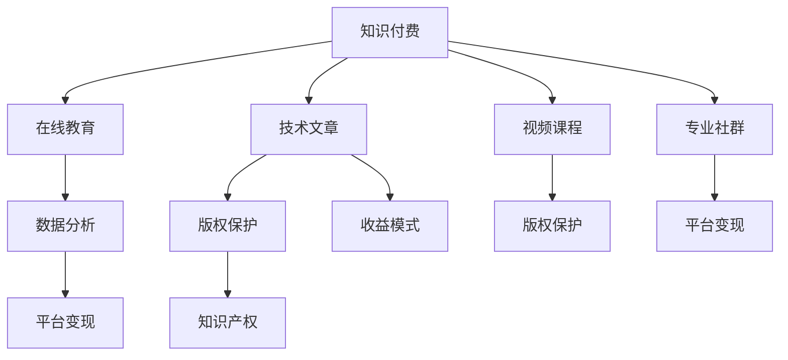

                 

# 程序员如何利用知识付费实现被动收入的途径

> 关键词：知识付费, 在线教育, 技术文章, 视频课程, 专业社群, 数据分析, 平台变现, 版权保护, 知识产权, 收益模式

## 1. 背景介绍

### 1.1 问题由来
在数字经济的浪潮中，程序员和技术人员作为推动技术进步的重要力量，他们所掌握的专业知识日益受到重视。从传统软件开发到新兴的人工智能、区块链等技术，技术人才的知识和经验正成为宝贵的生产资料。同时，科技领域的快速发展也催生了大量知识付费的解决方案，使技术人员能够通过知识传播和分享实现个人价值的最大化。

## 2. 核心概念与联系

### 2.1 核心概念概述

为了更好地理解程序员如何利用知识付费实现被动收入，本文将介绍以下几个核心概念：

- **知识付费**：通过在线课程、技术文章、咨询服务等方式，将专业知识和技术经验转化为商业价值，为他人提供价值交换，从而获取收入。
- **在线教育**：利用互联网技术进行知识传授和学习的方式，提供高效、便捷的学习渠道。
- **技术文章和博客**：程序员将自己的技术心得、项目经验、解决方案等内容撰写成文，发布到技术平台或个人博客，形成知识资产。
- **视频课程**：通过录制和上传视频内容，以视觉和听觉结合的方式传授知识和技能。
- **专业社群**：聚焦于某个技术领域的线上或线下社群，提供交流、讨论、分享平台。
- **数据分析**：利用统计和计算方法，从大量数据中提取信息，辅助决策。
- **平台变现**：通过技术平台或知识服务社区等载体，实现知识付费变现。
- **版权保护**：保障知识产权的合法性，避免他人抄袭或非法使用。
- **知识产权**：法律赋予创作者对其作品（如文章、视频、代码）的控制权和收益权。
- **收益模式**：知识付费市场中的各种收入模型，包括订阅模式、按需模式、捐赠模式等。

### 2.2 核心概念原理和架构的 Mermaid 流程图(Mermaid 流程节点中不要有括号、逗号等特殊字符)



这个流程图展示了知识付费生态系统中各个概念之间的联系：

1. **知识付费**作为核心，连接了在线教育、技术文章、视频课程、专业社群等形式，并贯穿数据分析、平台变现、版权保护、知识产权和收益模式等环节。
2. **在线教育**和**视频课程**是知识传播的主要形式，通过可视化的教学方式，帮助学习者快速掌握知识。
3. **技术文章**提供了深入的技术探讨和案例分享，适合深度阅读和自学。
4. **专业社群**促进了知识的交流和分享，增强了社区成员之间的互动。
5. **数据分析**利用技术手段，从知识传播的效果中提取有价值的信息。
6. **平台变现**是实现知识付费价值的关键步骤，通过平台或社区将知识转化为实际收入。
7. **版权保护**和**知识产权**保障了内容创作者的合法权益，避免了知识的非法复制和传播。
8. **收益模式**多样，为知识创作者提供了多种收入渠道。

## 3. 核心算法原理 & 具体操作步骤

### 3.1 算法原理概述

知识付费的核心在于内容的价值化和商业化，其算法原理主要体现在以下几个方面：

1. **知识价值评估**：通过算法分析内容的深度、广度、实用性等指标，评估其价值。
2. **用户画像分析**：利用机器学习算法，分析用户的学习习惯、偏好和支付意愿，从而精准推送相关内容。
3. **推荐系统优化**：基于协同过滤、内容过滤等技术，为用户推荐最适合其需求的知识内容。
4. **交易模型构建**：设计有效的交易机制，如订阅费、按需付费、免费内容等，确保知识变现。

### 3.2 算法步骤详解

**Step 1: 知识内容创作与积累**
- **技术文章**：选择感兴趣的领域，撰写深入浅出的技术文章。
- **视频课程**：准备详细的讲义和演示，录制高质量的视频内容。
- **在线教育**：设计合理的课程结构和教学内容，创建完整的教学体系。
- **专业社群**：聚集志同道合的同行，定期分享和讨论技术问题。

**Step 2: 平台选择与内容发布**
- **内容平台**：选择适合自己知识传播的在线教育平台（如Coursera、Udemy）或知识分享社区（如GitHub、知乎）。
- **平台注册与发布**：注册成为平台用户，发布自己的技术文章、视频课程、教育资源等。

**Step 3: 流量获取与用户互动**
- **SEO优化**：通过优化标题、摘要、标签等，提高文章或课程在搜索引擎中的排名。
- **社交媒体推广**：利用社交媒体平台推广自己的作品，吸引更多关注。
- **用户互动**：积极与用户互动，回答问题，参与讨论，增加用户粘性。

**Step 4: 数据分析与优化**
- **流量分析**：利用平台提供的数据分析工具，了解内容的访问量、阅读时长、用户反馈等。
- **内容优化**：根据分析结果，调整内容形式、更新频率、发布时间等，提高内容质量。

**Step 5: 变现模式选择与执行**
- **订阅模式**：设定内容包，定期推送新内容给订阅用户。
- **按需付费**：提供单次购买或一次购买多个内容的选项。
- **免费内容**：发布一定比例的免费内容，吸引用户关注和分享。

**Step 6: 版权保护与知识产权**
- **版权声明**：在内容中明确版权信息，避免侵权风险。
- **知识产权登记**：将内容进行知识产权登记，获得法律保护。

### 3.3 算法优缺点

知识付费的算法有以下优点：

1. **高效传播**：通过平台和技术手段，可以快速将知识传播给广泛的用户群体。
2. **个性化推荐**：基于用户行为数据分析，精准推荐相关内容，提升用户满意度。
3. **持续收益**：通过订阅和按需付费模式，实现持续稳定的收入来源。

同时，也存在以下缺点：

1. **用户流失**：高品质的内容难以长期吸引用户，可能导致用户流失。
2. **竞争激烈**：知识付费市场竞争激烈，内容质量和技术含量是关键。
3. **版权保护复杂**：版权保护涉及多方面法律问题，需要专业的法律知识。

### 3.4 算法应用领域

知识付费算法在以下领域得到广泛应用：

1. **在线教育**：提供技术课程、编程技能培训等，满足用户不同层次的学习需求。
2. **技术文章和博客**：分享编程技巧、开发经验、技术案例，提升个人品牌影响力。
3. **视频课程**：提供高级编程语言、框架、算法等深入知识，帮助用户提升技术水平。
4. **专业社群**：提供技术交流平台，促进社区成员之间的知识共享和经验交流。
5. **数据分析**：利用数据分析工具，评估内容质量和用户反馈，优化知识传播效果。

## 4. 数学模型和公式 & 详细讲解 & 举例说明

### 4.1 数学模型构建

本文将利用数学模型来描述知识付费的算法原理。设知识内容集合为 $S$，用户集合为 $U$，内容价值评估函数为 $v_s$，用户画像分析函数为 $u_u$，推荐系统算法为 $r$，交易模型为 $t$。

**用户画像分析**：设用户画像向量为 $u$，内容画像向量为 $v$，则用户画像分析函数为：

$$u_u(u) = \alpha u + \beta v$$

其中 $\alpha$ 和 $\beta$ 为权重系数，控制用户画像和内容画像的影响程度。

**推荐系统优化**：设推荐结果向量为 $r_u$，推荐系统优化目标为：

$$r_u = \max_{r} (r_u \cdot u_u)$$

其中 $r$ 为推荐系统算法，$u_u$ 为用户画像分析函数。

**交易模型构建**：设交易结果向量为 $t_u$，交易模型为：

$$t_u = \sum_{i=1}^n \delta_i p_i$$

其中 $p_i$ 为交易价格，$\delta_i$ 为交易选择因子，如订阅次数、观看时长等。

### 4.2 公式推导过程

**用户画像分析**：

假设用户画像向量 $u$ 为 $\begin{bmatrix} u_1 \\ u_2 \\ \vdots \\ u_n \end{bmatrix}$，内容画像向量 $v$ 为 $\begin{bmatrix} v_1 \\ v_2 \\ \vdots \\ v_n \end{bmatrix}$，则用户画像分析函数为：

$$u_u(u) = \alpha u + \beta v = \begin{bmatrix} \alpha u_1 + \beta v_1 \\ \alpha u_2 + \beta v_2 \\ \vdots \\ \alpha u_n + \beta v_n \end{bmatrix}$$

其中 $\alpha$ 和 $\beta$ 为权重系数，可以通过机器学习算法训练得到。

**推荐系统优化**：

推荐系统算法 $r$ 可以采用协同过滤算法、基于内容的推荐算法、深度学习推荐算法等多种方法。这里以协同过滤算法为例：

$$r_u = \max_{r} (r_u \cdot u_u)$$

其中 $r_u$ 为用户推荐结果向量，$u_u$ 为用户画像向量。

**交易模型构建**：

交易模型 $t_u$ 可以采用订阅模式、按需付费模式、免费模式等多种方式。这里以订阅模式为例：

$$t_u = \sum_{i=1}^n \delta_i p_i$$

其中 $\delta_i$ 为订阅次数，$p_i$ 为每次订阅的价格。

### 4.3 案例分析与讲解

以某在线教育平台为例，平台利用知识付费算法实现内容推荐和用户变现：

1. **用户画像分析**：平台通过用户的学习行为（如观看时间、完成度、评论等）生成用户画像向量 $u$，通过内容的使用情况（如下载量、分享量、评分等）生成内容画像向量 $v$。
2. **推荐系统优化**：平台采用协同过滤算法，根据用户画像和内容画像的相似度，为用户推荐相关课程。
3. **交易模型构建**：平台提供月度订阅服务，每月固定价格，用户可以选择订阅或按需购买课程。

## 5. 项目实践：代码实例和详细解释说明

### 5.1 开发环境搭建

要进行知识付费的开发实践，需要搭建相应的开发环境：

1. **编程语言**：选择 Python、JavaScript 等常用语言。
2. **开发框架**：选择 Django、Flask、Express 等常用的后端框架。
3. **数据库**：选择 MySQL、MongoDB、Redis 等数据库。
4. **服务器**：选择 AWS、阿里云、腾讯云等云服务平台。
5. **代码托管**：选择 GitHub、GitLab 等代码托管平台。

### 5.2 源代码详细实现

以下是一个简单的知识付费平台开发的 Python 代码实现，包括用户注册、内容发布、推荐系统和交易模块：

```python
# 用户注册模块
def register_user(username, password):
    # 数据库插入用户信息
    pass

# 内容发布模块
def publish_content(title, content, category):
    # 数据库插入内容信息
    pass

# 推荐系统模块
def recommend_content(user_id):
    # 根据用户画像和内容画像，推荐相关内容
    pass

# 交易模块
def subscribe_content(content_id):
    # 判断内容是否已订阅
    # 更新订阅记录
    pass

# 运行代码
if __name__ == '__main__':
    # 注册新用户
    register_user('username', 'password')
    # 发布新内容
    publish_content('标题', '内容', '类别')
    # 推荐内容
    recommend_content(user_id)
    # 订阅内容
    subscribe_content(content_id)
```

### 5.3 代码解读与分析

**用户注册模块**：

- `register_user(username, password)`：将新用户信息（用户名和密码）存储到数据库中。

**内容发布模块**：

- `publish_content(title, content, category)`：将新内容（标题、内容、类别）存储到数据库中。

**推荐系统模块**：

- `recommend_content(user_id)`：根据用户画像和内容画像，使用协同过滤算法推荐相关内容。

**交易模块**：

- `subscribe_content(content_id)`：判断内容是否已订阅，更新订阅记录，实现按需付费或订阅模式。

### 5.4 运行结果展示

运行上述代码，可以展示平台的核心功能：

- 用户注册：用户可以通过网页或App注册新账户。
- 内容发布：用户可以上传自己的技术文章、视频课程等。
- 推荐系统：平台根据用户行为，精准推荐相关内容。
- 交易模块：用户可以选择订阅或按需付费，获取平台提供的知识服务。

## 6. 实际应用场景

### 6.1 在线教育

在线教育平台通过知识付费算法，帮助技术爱好者系统学习编程、算法、数据结构等知识。平台提供丰富的课程资源，包括入门课程、进阶课程、实战项目等，满足不同层次的需求。用户可以根据自身的学习进度和兴趣，灵活选择学习内容，并通过订阅或付费购买课程，获取深入的知识。

### 6.2 技术文章和博客

技术博主通过撰写高质量的技术文章，分享自己的开发经验、项目案例和解决方案。平台提供文章分类、标签、评论等功能，帮助用户更高效地发现和使用优质内容。技术博主可以通过文章的阅读量和赞赏，获得一定的经济收益。

### 6.3 视频课程

视频课程通过生动形象的演示和讲解，帮助用户快速掌握复杂的编程技能和知识点。平台采用订阅或付费模式，用户可以选择一次性购买多个课程，或定期订阅课程更新。视频课程的互动性强，可以通过直播、录播、答疑等方式，增强学习效果。

### 6.4 专业社群

专业社群通过知识付费算法，聚集同一领域的技术爱好者，提供技术交流、问题解答、资源共享的平台。用户可以发布自己的项目和技术问题，获取社群内其他成员的解答和建议。平台提供付费专家咨询、VIP会员等增值服务，满足用户更高层次的需求。

## 7. 工具和资源推荐

### 7.1 学习资源推荐

为了帮助程序员系统掌握知识付费的相关知识，这里推荐一些优质的学习资源：

1. **Coursera**：提供多种在线教育课程，涵盖编程、数据科学、人工智能等多个领域。
2. **Udacity**：提供项目导向的编程课程，注重实践和实战能力。
3. **Kaggle**：提供数据科学和机器学习竞赛，帮助用户提升技术水平。
4. **GitHub**：提供代码托管和协作平台，开发者可以分享自己的代码和项目。
5. **Stack Overflow**：提供技术问答平台，程序员可以发布问题并获取解答。

### 7.2 开发工具推荐

高效的开发离不开优秀的工具支持。以下是几款用于知识付费开发的常用工具：

1. **GitHub**：代码托管平台，支持版本控制、协作开发。
2. **Django**：Python Web开发框架，快速搭建后端服务。
3. **MongoDB**：NoSQL数据库，适合存储文档型数据。
4. **AWS**：云计算平台，提供弹性计算、存储、网络等服务。
5. **Jupyter Notebook**：交互式编程环境，支持多种编程语言。

### 7.3 相关论文推荐

知识付费相关的研究涵盖多个方向，以下是几篇经典论文，推荐阅读：

1. **An Empirical Evaluation of Recommendation Algorithms for Online Education**：研究在线教育推荐系统的效果和优化方法。
2. **A Survey of Recommendation Systems**：综述推荐系统的各种算法和技术。
3. **A Study of Copyright Protection in Online Education**：探讨在线教育中版权保护的方法和策略。

## 8. 总结：未来发展趋势与挑战

### 8.1 研究成果总结

本文详细介绍了程序员如何利用知识付费实现被动收入的途径，涵盖了在线教育、技术文章、视频课程、专业社群等多种形式。知识付费算法在个性化推荐、流量获取、内容优化、版权保护等方面发挥了重要作用，实现了知识传播和变现。

### 8.2 未来发展趋势

1. **个性化推荐系统的提升**：未来推荐系统将更加精准，通过多维数据分析，实现个性化推荐。
2. **多样化内容形式的创新**：除了视频、文章等传统形式，更多新型内容形式（如AR、VR、MR）将得到应用。
3. **交互式学习平台的发展**：通过实时互动、虚拟实验室等方式，提升学习效果。
4. **社区化学习的深化**：知识付费平台将更加注重社区建设，增强用户互动和交流。
5. **国际化的拓展**：知识付费平台将面向全球用户，提供多语言支持和学习资源。

### 8.3 面临的挑战

1. **用户流失**：内容质量和平台体验是吸引用户的关键，如何保持用户粘性是重要挑战。
2. **版权保护复杂**：知识付费涉及版权保护问题，需要专业的法律知识和技术手段。
3. **市场竞争激烈**：知识付费市场竞争激烈，如何在众多平台中脱颖而出。
4. **技术门槛高**：开发和维护知识付费平台需要较高的技术门槛。
5. **商业模式多样**：知识付费的收益模式多样化，如何选择适合自身的商业模式。

### 8.4 研究展望

知识付费的未来发展方向包括：

1. **知识付费生态系统的完善**：构建完整的知识付费生态系统，涵盖内容创作、平台服务、用户互动等多个环节。
2. **知识付费的标准化**：制定知识付费的行业标准，规范内容质量和服务流程。
3. **知识付费的国际化**：面向全球用户，提供多语言支持和学习资源。
4. **知识付费的智能化**：利用人工智能技术，提升内容推荐、用户分析等环节的智能化水平。

## 9. 附录：常见问题与解答

**Q1：知识付费与免费资源相比，有什么优势？**

A: 知识付费可以提供更优质、更系统、更专业的学习资源，避免免费资源中存在的错误和杂乱信息。同时，付费用户可以获得更快的更新速度和更多的优质内容。

**Q2：如何选择合适的知识付费平台？**

A: 选择知识付费平台时，应考虑平台的用户群体、内容质量、用户体验、技术支持等方面。可以通过用户评价、平台口碑、免费试用等手段进行评估。

**Q3：如何提升自己的知识付费变现能力？**

A: 通过不断提升自身技术水平，撰写高质量的技术文章、录制优质视频课程，增强个人品牌影响力。同时，积极与用户互动，提升用户粘性和满意度。

**Q4：知识付费内容创作的难点是什么？**

A: 内容创作的难点在于内容的深度、广度和实用性。需要持续关注技术动态，积累实战经验，不断改进内容质量。

**Q5：如何避免知识付费中的版权问题？**

A: 在内容创作和发布前，进行版权声明和知识产权登记，避免侵权风险。同时，了解相关法律法规，确保内容合法合规。

---

作者：禅与计算机程序设计艺术 / Zen and the Art of Computer Programming

