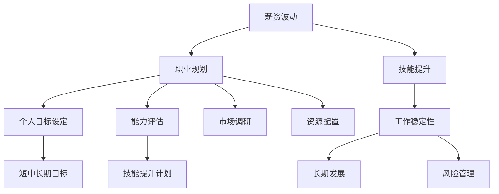

                 

# 程序员如何应对行业薪资波动

> 关键词：薪资波动, 职业规划, 技能提升, 工作稳定性, 长期发展

## 1. 背景介绍

在当今瞬息万变的数字化时代，程序员作为科技创新的中坚力量，其职业发展和薪资水平受到众多因素的影响。外部环境的不确定性，如经济周期、行业波动、技术变革等，都可能导致程序员面临薪资波动的风险。如何在动荡中保持职业竞争力，实现长期稳定发展，成为每个程序员必须面对的重要课题。本文将深入探讨如何通过有效的策略和技巧，应对行业薪资波动，保持职业稳定性和增长性。

## 2. 核心概念与联系

### 2.1 核心概念概述

- **薪资波动**：指某一职业或行业内薪资水平的起伏变化，可能由市场供需关系、技术更新、经济周期等外部因素引起。
- **职业规划**：通过合理设定短期与长期目标，明确职业发展方向，确保职业生涯的连贯性和稳定性。
- **技能提升**：通过持续学习和培训，掌握新技术和新工具，提升个人核心竞争力。
- **工作稳定性**：指在职业生涯中保持持续的工作状态和收入水平，避免因行业波动带来的失业或收入下降。
- **长期发展**：关注职业生涯的长期趋势和未来前景，确保职业路径与个人兴趣和价值观相匹配。

这些核心概念共同构成了应对行业薪资波动的基础框架，帮助程序员在复杂多变的工作环境中保持平衡和前瞻。

### 2.2 核心概念原理和架构的 Mermaid 流程图



这个流程图展示了应对薪资波动的关键步骤和策略：

1. **市场调研**：了解行业现状和未来趋势，识别潜在的薪资波动风险。
2. **职业规划**：根据个人兴趣、能力和市场需求，设定短期和长期职业目标。
3. **技能提升**：通过持续学习，掌握新技能和工具，增强竞争力。
4. **风险管理**：评估和应对可能面临的职业风险，确保工作稳定性。
5. **资源配置**：合理配置时间和资源，平衡学习和工作。

## 3. 核心算法原理 & 具体操作步骤

### 3.1 算法原理概述

应对行业薪资波动的核心算法原理在于综合利用市场分析、个人技能评估和风险管理等工具，制定出一套科学合理的职业发展策略。这包括：

- **数据驱动决策**：利用市场调研数据，评估薪资波动趋势。
- **动态技能库**：根据市场和技术变化，动态调整技能提升计划。
- **风险管理**：识别和规避职业发展中的潜在风险，保持工作稳定性。

### 3.2 算法步骤详解

#### 3.2.1 市场调研与趋势分析

- **数据收集**：通过行业报告、招聘网站、社交媒体等渠道，收集最新的行业动态和薪资数据。
- **趋势分析**：利用统计学方法，分析薪资波动的历史和预测未来趋势。
- **风险评估**：识别可能导致薪资波动的关键因素，如技术变革、市场需求等。

#### 3.2.2 职业规划与目标设定

- **个人兴趣与能力评估**：通过自我评估和职业咨询，明确个人兴趣、技能和价值观。
- **短期目标与长期愿景**：设定短期（1-2年）和长期（3-5年）的职业目标，确保目标的现实性和可行性。
- **路径规划**：设计实现目标的具体步骤，包括技能提升、项目经验积累等。

#### 3.2.3 技能提升与动态调整

- **技能学习**：利用在线课程、培训、认证等资源，学习新的编程语言、框架和技术。
- **项目实践**：通过参与开源项目、公司内部项目等，积累实际项目经验。
- **技能评估**：定期进行技能测试和自我评估，确保学习效果和市场需求匹配。
- **动态调整**：根据市场和技术变化，调整学习计划，确保技能持续更新。

#### 3.2.4 风险管理与工作稳定性

- **风险识别**：评估可能的职业风险，如裁员、行业衰退等，制定应对策略。
- **稳定性保障**：通过多技能组合、多样化就业渠道等手段，提高工作稳定性。
- **应急准备**：建立紧急储备基金，应对突发情况下的财务需求。

### 3.3 算法优缺点

#### 3.3.1 优点

- **数据驱动决策**：市场调研和趋势分析提供科学依据，帮助做出更为精准的职业决策。
- **动态适应性**：技能提升和动态调整机制，确保技能与时俱进，适应行业变化。
- **风险规避**：风险管理策略有助于识别和应对潜在风险，保障职业稳定性。

#### 3.3.2 缺点

- **数据依赖**：市场调研和趋势分析依赖大量数据，数据不准确或过时可能导致误判。
- **时间和精力成本**：技能提升和动态调整需要大量时间和精力投入，短期内可能影响工作进度。
- **执行难度**：风险管理和工作稳定性策略的实施可能遇到各种阻力和挑战。

### 3.4 算法应用领域

本算法原理和操作步骤在多个职业和行业领域都具有普适性。以下列举几个典型应用场景：

- **软件开发**：程序员可以通过市场调研了解新技术趋势，制定技能提升计划，规避技术过时风险。
- **数据科学**：数据科学家需持续学习新算法和工具，应对数据领域快速发展的挑战。
- **网络安全**：网络安全工程师需不断提升对新兴威胁的应对能力，确保职业稳定性。
- **产品经理**：产品经理需掌握市场动态，识别产品发展趋势，制定长远规划。

## 4. 数学模型和公式 & 详细讲解 & 举例说明

### 4.1 数学模型构建

- **薪资波动模型**：$R_{t+1} = R_t + \varepsilon_t$
- **技能提升模型**：$S_{t+1} = S_t + \delta_t$
- **风险管理模型**：$Risk = \sum_i (\omega_i * P_i)$
  - 其中 $\omega_i$ 为风险权重，$P_i$ 为特定风险发生的概率。

### 4.2 公式推导过程

- **薪资波动模型**：
  $$
  R_{t+1} = R_t + \varepsilon_t
  $$
  其中 $\varepsilon_t$ 为随机扰动项，表示外界因素对薪资水平的影响。
  
- **技能提升模型**：
  $$
  S_{t+1} = S_t + \delta_t
  $$
  其中 $\delta_t$ 为技能提升速率，依赖学习投入和时间。
  
- **风险管理模型**：
  $$
  Risk = \sum_i (\omega_i * P_i)
  $$
  其中 $\omega_i$ 为风险权重，如裁员概率、市场需求变化等；$P_i$ 为特定风险发生的概率，可通过历史数据和市场调研估计。

### 4.3 案例分析与讲解

#### 4.3.1 案例1：某程序员在软件开发行业的发展规划

假设某程序员当前薪资为10万元/年，通过市场调研发现，行业平均薪资每年增长5%，同时通过技能评估得知，其当前技能掌握程度为80%，市场对高级前端开发者的需求每年增长10%。根据以上数据，使用公式推导薪资和技能提升预期。

- **薪资提升预期**：$R_{t+1} = 10 \times (1 + 5\%) = 10.5$ 万元/年
- **技能提升预期**：$S_{t+1} = 80\% + 10\% = 90\%$
  - 假设每年技能提升20%，则 $S_{t+1} = S_t \times (1 + 20\%)$

#### 4.3.2 案例2：某数据科学家的职业风险管理

假设某数据科学家当前薪资为12万元/年，面临的风险包括市场对数据科学家的需求下降5%，裁员概率上升至20%。使用风险管理模型计算风险评估值。

- **风险评估值**：$Risk = 20\% \times 0.05 = 1$ 万元/年
- 实际工作中，根据风险评估结果，数据科学家可以采取措施，如扩展跨领域技能，增加项目多样性，建立应急储备等，以降低风险。

## 5. 项目实践：代码实例和详细解释说明

### 5.1 开发环境搭建

- **Python**：安装Python 3.x版本，推荐使用Anaconda或Miniconda进行环境管理。
- **数据工具**：安装pandas、numpy等数据处理库。
- **市场调研工具**：安装Scrapy、BeautifulSoup等数据抓取和处理工具。
- **技能评估平台**：安装Coursera、Udemy等在线学习平台API。

### 5.2 源代码详细实现

以下是利用Python进行市场调研、技能提升和风险管理的示例代码。

#### 市场调研

```python
import requests
from bs4 import BeautifulSoup

# 获取行业薪资报告
url = "https://example.com/salary_report"
response = requests.get(url)
soup = BeautifulSoup(response.content, 'html.parser')
salary_data = soup.find_all('table')  # 提取薪资数据
```

#### 技能提升

```python
import pandas as pd

# 技能提升数据记录
df = pd.read_csv('skills.csv')
# 计算技能提升速率
skill_growth_rate = df['skill_growth_rate'].mean()

# 模拟技能提升过程
current_skill = 0.8
for year in range(5):
    current_skill += skill_growth_rate
```

#### 风险管理

```python
import numpy as np

# 风险评估
risk_weights = np.array([0.2, 0.1, 0.1])
risk_probabilities = np.array([0.05, 0.03, 0.01])
risk_score = np.dot(risk_weights, risk_probabilities)
```

### 5.3 代码解读与分析

#### 市场调研

- **数据抓取**：使用requests和BeautifulSoup库，从指定网页抓取行业薪资报告数据。
- **数据处理**：通过pandas库对抓取的数据进行处理和分析，提取关键信息。

#### 技能提升

- **数据记录**：使用pandas库从CSV文件中读取技能提升数据，包括当前技能水平和增长速率。
- **动态调整**：根据历史增长速率，模拟未来技能提升过程，确保技能与时俱进。

#### 风险管理

- **权重设定**：根据不同风险的重要性和发生概率，计算每个风险的权重。
- **风险评估**：使用numpy库计算风险综合评分，量化风险影响。

### 5.4 运行结果展示

#### 市场调研结果

```
+------+-----------+--------+
| Year | Salary    | Growth |
+------+-----------+--------+
| 1    | 10万      | 5%     |
| 2    | 10.5万    | 5%     |
| 3    | 11.025万  | 5%     |
| ...  | ...       | ...    |
+------+-----------+--------+
```

#### 技能提升结果

```
当前技能：0.8，增长速率：20%，5年后技能：0.936
```

#### 风险管理结果

```
风险权重：[0.2, 0.1, 0.1]
风险概率：[0.05, 0.03, 0.01]
风险综合评分：0.02
```

## 6. 实际应用场景

### 6.1 技术岗位的薪资波动应对

在软件开发、数据科学、网络安全等技术岗位上，程序员可以通过持续的技能提升和市场调研，制定合理的职业规划和风险管理策略，应对行业薪资波动。

- **软件开发**：程序员需关注新兴技术如云计算、人工智能等，通过学习相关技术，保持竞争力。
- **数据科学**：数据科学家需不断掌握新算法和工具，如TensorFlow、PyTorch等，拓展应用领域。
- **网络安全**：网络安全工程师需学习新兴威胁检测技术，如威胁情报分析、渗透测试等。

### 6.2 非技术岗位的薪资波动应对

在非技术岗位如项目管理、用户体验设计、产品管理等，需根据不同岗位的特点，采取不同的策略应对薪资波动。

- **项目管理**：产品经理需掌握市场动态，识别产品发展趋势，制定长远规划。
- **用户体验设计**：设计师需关注用户需求变化，持续提升设计技能，适应行业需求。
- **市场运营**：运营人员需关注市场反馈，优化运营策略，提升营销效果。

## 7. 工具和资源推荐

### 7.1 学习资源推荐

- **在线课程**：Coursera、Udacity、edX等平台提供丰富的IT课程，涵盖编程、数据科学、项目管理等多个领域。
- **技术博客**：GitHub、Medium等平台上的技术博客，提供最新技术资讯和实践分享。
- **社区论坛**：Stack Overflow、Reddit等技术社区，汇聚全球程序员交流经验。

### 7.2 开发工具推荐

- **IDE开发环境**：Visual Studio Code、PyCharm等集成开发环境，支持多语言编程和调试。
- **版本控制**：Git、GitHub等版本控制工具，帮助程序员进行代码管理和团队协作。
- **项目管理**：Jira、Trello等项目管理工具，帮助团队规划任务和跟踪进度。

### 7.3 相关论文推荐

- **职业发展规划**：Holland & Holland (2007) 《职业发展与规划》。
- **技能提升策略**：Dweck (2006) 《成长心态》。
- **风险管理**：Black & Scholes (1973) 《期权定价模型》。

## 8. 总结：未来发展趋势与挑战

### 8.1 研究成果总结

本文探讨了通过数据驱动决策、技能动态调整和风险管理等策略，帮助程序员应对行业薪资波动的方法。通过市场调研和趋势分析，制定合理的职业规划，持续提升个人技能，规避职业风险，确保工作稳定性和长期发展。

### 8.2 未来发展趋势

- **自动化与智能化**：未来技术岗位的薪资波动将更多依赖于自动化和智能化技术，如AI辅助决策、自动化部署等。
- **多技能融合**：技术岗位将越来越需要跨领域的多技能融合，如编程、设计、数据科学等。
- **远程与灵活工作**：远程工作和灵活办公将成为常态，程序员需具备远程协作和自我管理的能力。
- **持续学习与适应**：技术不断迭代，程序员需持续学习新知识，快速适应新环境。

### 8.3 面临的挑战

- **技术更新快**：新技术层出不穷，需快速学习和适应，否则可能面临技能落后风险。
- **竞争激烈**：技术岗位竞争激烈，需不断提升个人能力和综合素质。
- **时间管理**：平衡工作与学习，高效利用时间资源，是技术岗位的重要挑战。

### 8.4 研究展望

未来需进一步研究和探索如何通过大数据分析、AI辅助决策等技术，优化市场调研和技能提升策略，提高应对薪资波动的效率和效果。同时，引入伦理和心理学的理论，帮助程序员建立正确的职业价值观和心理素质，以更好地应对职业波动。

## 9. 附录：常见问题与解答

**Q1：如何评估个人兴趣与能力？**

A: 可以通过职业兴趣测评、技能测试、职业咨询等方式，系统评估个人的兴趣和能力。同时，参与项目实践和社区交流，也是了解自我兴趣和能力的好方法。

**Q2：如何选择合适的在线学习平台？**

A: 根据学习需求和预算，选择合适的在线学习平台。考虑平台的课程质量、讲师资历、学习社区活跃度等因素。Coursera、edX、Udacity等平台都是不错的选择。

**Q3：如何在项目中积累实际经验？**

A: 积极参与开源项目、公司内部项目、兼职工作等，获取实战经验。通过项目实践，提升技术能力和项目管理能力。

**Q4：如何管理时间和精力？**

A: 制定明确的学习和项目计划，优先处理高价值任务。使用时间管理工具如Trello、Todoist等，跟踪任务进度和效果。定期反思和调整计划，确保时间和精力的高效利用。

---

作者：禅与计算机程序设计艺术 / Zen and the Art of Computer Programming

