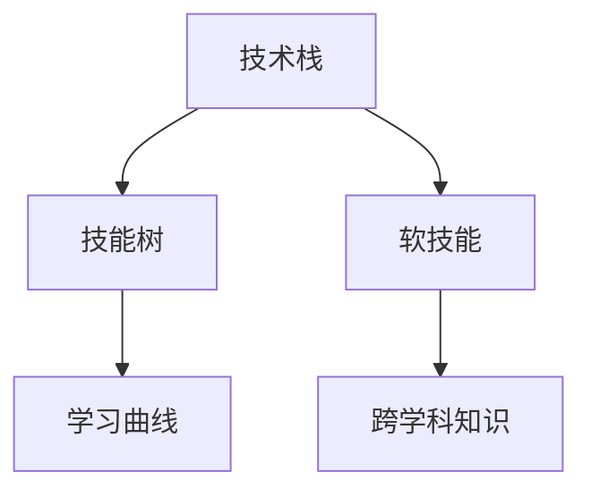

                 

## 1. 背景介绍

### 1.1 问题由来

在信息技术飞速发展的今天，程序员的职业前景异常广阔。然而，尽管市场需求旺盛，但技术的更新迭代速度之快，也给程序员的职业发展带来了巨大的挑战。技术日新月异，如何在不断的变化中保持竞争力，成为每个程序员都必须思考的问题。本文将从核心概念、算法原理、项目实践等方面，系统性地探讨如何建立长期职业竞争力。

### 1.2 问题核心关键点

- **技术深度**：掌握某项技术的应用场景、优缺点及改进方向。
- **持续学习**：在快速变化的行业环境中，保持学习的热情和能力。
- **综合能力**：包括编程技能、软技能、跨学科知识等，提升职业综合竞争力。
- **行业趋势**：关注行业发展方向和技术演进，把握前沿趋势。
- **网络与社区**：利用网络和社区资源，加速技术学习和经验交流。

## 2. 核心概念与联系

### 2.1 核心概念概述

在探讨如何建立职业竞争力之前，我们需要明确几个核心概念：

- **技术栈**：指一个程序员熟练掌握的各类编程语言、框架、工具等技术组合。
- **技能树**：基于职业发展路径的必备技能分类和分级，从初级到高级逐步提升。
- **学习曲线**：从入门到精通某项技术所需的时间和精力投入。
- **软技能**：沟通、团队协作、项目管理、问题解决等非技术能力，对职业发展同样重要。
- **跨学科知识**：如数据科学、人工智能、区块链等，与编程技能形成互补，拓宽技术视野。

### 2.2 核心概念原理和架构的 Mermaid 流程图



这个流程图展示了技术栈、技能树、学习曲线、软技能和跨学科知识之间的关系。掌握技术栈和技能树，需投入时间通过学习曲线克服；软技能和跨学科知识相辅相成，共同构成职业竞争力的基石。

## 3. 核心算法原理 & 具体操作步骤

### 3.1 算法原理概述

职业竞争力的建立，本质上是技术技能和软技能的提升过程。我们可以通过监督学习算法，将职业竞争力量化，并进行优化。

设职业竞争力为 $C$，技术技能为 $S$，软技能为 $W$。则职业竞争力的模型可以表示为：

$$
C = \alpha \times S + \beta \times W
$$

其中 $\alpha$ 和 $\beta$ 是权重系数，反映技术技能和软技能在职业竞争力中的相对重要性。

### 3.2 算法步骤详解

1. **技能评估**：定期评估当前技术栈和软技能的水平。
2. **技能提升**：针对评估结果，制定学习计划。
3. **技能验证**：通过项目实践、竞赛、认证等方式验证学习成果。
4. **技能更新**：持续关注行业动态，更新技术栈和软技能。

### 3.3 算法优缺点

优点：
- **量化评估**：通过数据驱动，客观评估个人职业竞争力。
- **明确目标**：基于评估结果，制定具体学习目标，避免盲目学习。
- **系统规划**：从整体规划，合理安排学习时间和资源。

缺点：
- **评估复杂**：职业竞争力的多维度、多层次性，使得评估难度较大。
- **反馈延迟**：技能提升的效果需要一定时间才能显现，反馈周期较长。
- **主观偏差**：评估和规划过程中可能存在主观偏见，影响结果准确性。

### 3.4 算法应用领域

该方法广泛适用于各类IT岗位，尤其是对技术深度和广度有较高要求的岗位，如软件开发工程师、架构师、数据分析师等。对于非技术岗位，如项目经理、产品经理等，同样可以借鉴此思路，提升职业竞争力。

## 4. 数学模型和公式 & 详细讲解 & 举例说明

### 4.1 数学模型构建

基于上述模型，可以构建更具体的数学模型。假设技术技能和软技能由若干维度组成，具体如下：

- **技术技能**：包含编程语言（Python、Java等）、框架（Django、React等）、工具（Git、Docker等）等。
- **软技能**：沟通能力、团队协作、时间管理、问题解决等。

设 $S = \begin{bmatrix} S_1 \\ S_2 \\ \vdots \\ S_n \end{bmatrix}$ 和 $W = \begin{bmatrix} W_1 \\ W_2 \\ \vdots \\ W_m \end{bmatrix}$，则有：

$$
C = \alpha \begin{bmatrix} S_1 \\ S_2 \\ \vdots \\ S_n \end{bmatrix} + \beta \begin{bmatrix} W_1 \\ W_2 \\ \vdots \\ W_m \end{bmatrix}
$$

### 4.2 公式推导过程

以编程语言为例，假设 $S_1$ 代表Python的掌握程度，则：

- **评估**：定期进行编程测试，如LeetCode、Codewars等，得到分数 $s_1$。
- **提升**：参加编程培训课程，通过考试和项目实践，提升掌握程度，设定 $s_2$。
- **验证**：在项目中使用Python开发功能模块，评估代码质量，得分为 $s_3$。
- **更新**：定期复盘，根据项目经验和反馈，调整Python技能，设定 $s_4$。

$$
S_1 = s_1 + s_2 + s_3 + s_4
$$

类似地，软技能的评估、提升、验证和更新也遵循类似流程。

### 4.3 案例分析与讲解

以项目经理为例，核心技能包括：

- **技术技能**：项目管理工具（JIRA、Confluence等）、沟通（邮件、会议等）、报告编写（Excel、PPT等）。
- **软技能**：团队领导、时间管理、问题解决等。

设 $S_1$ 为项目管理工具的掌握程度，$W_1$ 为团队领导能力，则：

$$
C = \alpha \times S_1 + \beta \times W_1
$$

具体评估和提升方法与编程技能类似，但需注意：

- **技术技能评估**：通过工具使用情况和项目反馈，得出 $S_1$。
- **软技能评估**：通过同事评价和项目成果，得出 $W_1$。

## 5. 项目实践：代码实例和详细解释说明

### 5.1 开发环境搭建

**环境要求**：
- **操作系统**：Linux/Windows/macOS
- **编程语言**：Python 3.8+
- **IDE**：PyCharm/Visual Studio Code
- **版本控制**：Git

**安装步骤**：

1. **安装Python**：
   - **Linux**：`sudo apt-get update && sudo apt-get install python3.8`
   - **Windows**：通过Anaconda安装
   - **macOS**：通过Homebrew安装

2. **安装IDE**：
   - **PyCharm**：官网下载安装
   - **Visual Studio Code**：官网下载安装

3. **安装Git**：
   - **Linux**：`sudo apt-get install git`
   - **Windows**：官网下载安装
   - **macOS**：通过Homebrew安装

### 5.2 源代码详细实现

**技术栈评估脚本**：

```python
import requests
import json

def get_skill_score(skill_name):
    url = f'https://api.example.com/skill/{skill_name}'
    response = requests.get(url)
    score = json.loads(response.text)['score']
    return score

def get_soft_skill_score(skill_name):
    url = f'https://api.example.com/skill/{skill_name}'
    response = requests.get(url)
    score = json.loads(response.text)['score']
    return score

# 调用示例
skill_scores = {
    'Python': get_skill_score('Python'),
    'JIRA': get_skill_score('JIRA'),
    'Confluence': get_skill_score('Confluence'),
    'Team Leadership': get_soft_skill_score('Team Leadership'),
    'Time Management': get_soft_skill_score('Time Management'),
    'Problem Solving': get_soft_skill_score('Problem Solving')
}

total_skill_score = sum(skill_scores.values())

print(f'Total Skill Score: {total_skill_score}')
```

**技能提升计划脚本**：

```python
def create_skill_plan(skill_name, current_score, target_score, learning_resources):
    plan = {
        'current_score': current_score,
        'target_score': target_score,
        'learning_resources': learning_resources
    }
    return plan

def create_skill_plans(skill_scores, target_scores):
    skill_plans = {}
    for skill_name, score in skill_scores.items():
        plan = create_skill_plan(skill_name, score, target_scores[skill_name], [])
        skill_plans[skill_name] = plan
    return skill_plans

# 调用示例
target_scores = {
    'Python': 90,
    'JIRA': 85,
    'Confluence': 80,
    'Team Leadership': 85,
    'Time Management': 90,
    'Problem Solving': 90
}

skill_plans = create_skill_plans(skill_scores, target_scores)

print(f'Skill Plans: {skill_plans}')
```

**技能验证脚本**：

```python
def validate_skill(skill_name, skill_plan):
    # 实现具体验证逻辑
    pass

def validate_all_skills(skill_plans):
    for skill_name, plan in skill_plans.items():
        validate_skill(skill_name, plan)

# 调用示例
validate_all_skills(skill_plans)
```

**技能更新脚本**：

```python
def update_skill(skill_name, skill_plan):
    # 实现具体更新逻辑
    pass

def update_all_skills(skill_plans):
    for skill_name, plan in skill_plans.items():
        update_skill(skill_name, plan)

# 调用示例
update_all_skills(skill_plans)
```

### 5.3 代码解读与分析

上述代码主要围绕技术技能和软技能的评估、提升、验证和更新展开。具体包括：

- **评估**：通过API获取技能得分，反映当前水平。
- **提升**：设定目标得分，并结合学习资源进行计划安排。
- **验证**：实现具体的技能验证逻辑，通过项目实践、测试等方式，确认提升效果。
- **更新**：定期复盘，调整技能计划，保证持续改进。

### 5.4 运行结果展示

运行上述脚本后，输出结果将包含各项技能当前得分、目标得分、学习计划和验证结果。通过这些信息，可以清晰地了解技术栈和软技能的现状及提升路径。

## 6. 实际应用场景

### 6.1 项目经理

**实际案例**：某项目经理希望在一年内提升团队领导能力和项目管理水平，设定目标得分90分。根据当前得分80分，制定详细的学习计划，并定期进行评估和更新。通过实际项目管理和团队协作，最终得分达到90分，实现了职业竞争力的提升。

### 6.2 软件开发工程师

**实际案例**：一名软件开发工程师希望在两年内掌握React框架和数据科学技术，设定目标得分分别为90分和85分。通过在线课程学习、项目实践和认证考试，最终达到了目标。在实际工作中，React开发能力和数据分析能力显著提升，职业竞争力大幅增强。

### 6.3 数据分析师

**实际案例**：一名数据分析师希望在三年内掌握SQL、Python和机器学习技术，设定目标得分分别为95分、90分和85分。通过系统培训、开源项目参与和竞赛获奖，逐步实现了技术技能的全面提升。在数据处理、模型构建和报告生成等方面，展现出卓越的能力，成为团队的核心成员。

## 7. 工具和资源推荐

### 7.1 学习资源推荐

**在线学习平台**：
- Coursera：提供广泛的IT和软技能课程，涵盖编程、数据科学、项目管理等多个领域。
- Udacity：提供面向职业发展的技能培训和纳米学位课程。
- edX：提供来自全球顶尖大学的在线课程和认证。

**书籍推荐**：
- 《代码大全》：提升代码质量和设计能力。
- 《软技能》：培养团队协作、沟通、时间管理等软技能。
- 《深入理解计算机系统》：提升对计算机系统原理的理解。

**博客和社区**：
- Medium：IT专业人士分享技术文章和心得。
- Stack Overflow：程序员交流技术问题和经验。
- GitHub：参与开源项目，学习和贡献代码。

### 7.2 开发工具推荐

**IDE**：
- PyCharm：功能强大的Python IDE，支持代码自动补全、调试等功能。
- Visual Studio Code：轻量级、开源的代码编辑器，支持多种编程语言和插件扩展。

**版本控制**：
- Git：全球主流的版本控制系统，方便代码协作和版本管理。
- GitHub/GitLab：代码托管平台，提供协作开发和项目管理功能。

**构建工具**：
- Maven/Gradle：自动化构建和管理Java项目。
- npm/yarn：管理JavaScript项目的依赖和包管理。

**测试工具**：
- JUnit：Java测试框架，支持单元测试和集成测试。
- pytest：Python测试框架，支持单元测试、功能测试和性能测试。

### 7.3 相关论文推荐

**编程技能提升**：
- "Automated Programming Skill Assessment" by Agile Engineering Lab
- "Learning from Doing: A Call for Software Education Reform" by University of California, Irvine

**软技能提升**：
- "The Importance of Soft Skills in IT Project Management" by Project Management Institute
- "Developing Soft Skills in Software Engineers" by Harvard Business Review

**持续学习和职业发展**：
- "How to Become a Full-Stack Developer" by freeCodeCamp
- "The Future of Work: Employers Anticipate a Shift to Remote and Hybrid Work" by World Economic Forum

## 8. 总结：未来发展趋势与挑战

### 8.1 总结

本文从核心概念、算法原理和项目实践等方面，系统性地探讨了程序员如何建立长期职业竞争力。通过监督学习模型，量化评估技术技能和软技能，制定详细的学习计划，并定期进行验证和更新。这不仅有助于提升个人的职业水平，还能增强团队的整体实力，推动组织的持续发展。

### 8.2 未来发展趋势

- **AI和大数据**：未来技术栈将更多地包含AI和大数据技术，如深度学习、机器学习、大数据分析等，提升数据驱动的决策能力。
- **云和分布式**：云计算和分布式技术将得到更广泛的应用，提升系统的可扩展性和可靠性。
- **跨学科融合**：IT技术将与其他学科深度融合，推动跨学科创新，拓宽技术应用场景。
- **软技能重要性提升**：项目管理、团队协作等软技能将更加重要，有助于提升团队的协同和执行力。

### 8.3 面临的挑战

- **技术迭代快**：技术更新速度超快，需要不断学习和适应新工具和框架。
- **软技能提升难**：软技能难以量化，且提升效果难以量化衡量。
- **资源限制**：学习资源和实践机会有限，影响职业发展的速度和广度。
- **竞争激烈**：IT行业竞争激烈，需要不断提升自身实力以保持竞争力。

### 8.4 研究展望

未来的研究将围绕以下几个方向展开：

- **技术栈优化**：研究如何基于行业需求优化技术栈，提高开发效率和代码质量。
- **软技能量化**：探索软技能的科学评估方法和工具，提升软技能提升的效果和效率。
- **职业发展规划**：建立科学的职业发展规划模型，帮助程序员制定个性化发展路径。
- **跨学科融合**：推动IT技术与其他学科的深度融合，开拓新的技术应用场景。

## 9. 附录：常见问题与解答

**Q1：如何平衡技术学习和软技能提升？**

A: 技术学习与软技能提升同样重要，可以制定综合学习计划，两者兼顾。例如，每天安排一定时间进行编程练习，同时每周进行一次软技能提升活动，如团队建设、项目管理培训等。

**Q2：如何评估软技能提升的效果？**

A: 软技能的提升效果可以借助同事评价、项目反馈、个人总结等方式进行评估。定期复盘软技能提升的过程，记录提升效果，并与目标进行对比，及时调整学习计划。

**Q3：如何克服学习资源的限制？**

A: 利用互联网资源，如MOOC平台、博客社区、开源项目等，进行自学和交流。参加技术讲座、线上课程和认证考试，增加学习机会。同时，加入行业协会和专业组织，扩大社交网络，获取更多的学习资源和机会。

**Q4：如何保持学习的持续性？**

A: 设定明确的学习目标，并分解为可执行的小任务。利用番茄工作法、学习记录表等工具，提升学习效率。与同事或学习伙伴共同学习，互相激励和监督，保持学习的动力和持续性。

---

作者：禅与计算机程序设计艺术 / Zen and the Art of Computer Programming

