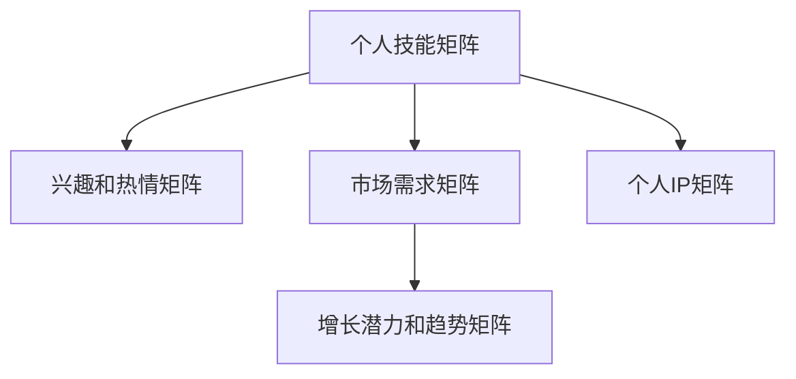

                 

# 程序员如何打造个人IP矩阵

## 1. 背景介绍

### 1.1 问题由来

在数字化时代的浪潮中，个人品牌建设已成为程序员不可或缺的一部分。不同于传统的职业路径，现代程序员可以通过多种方式展示自己的技术能力和创新思维，从而在职场和社区中脱颖而出。然而，如何在繁杂的技术栈中找准自己的定位，建立独特的个人品牌，成为了众多程序员面临的挑战。个人IP矩阵（IP Matrix）作为近年来兴起的一种策略，为程序员提供了一种系统化的个人品牌塑造方法，使得个人品牌建设不再是个体行为，而是一个有策略、有规划的行动。

### 1.2 问题核心关键点

个人IP矩阵（IP Matrix）是一种将个人技能、兴趣、经验、市场趋势等关键要素，通过结构化的方法整合为矩阵形式，从而形成系统化的个人品牌构建策略。该方法通过对自身优势的深入分析，结合市场和技术的发展趋势，制定出一套精准、可执行的个人品牌建设方案。

具体而言，IP Matrix的关键点包括：
- **个人技能矩阵**：评估并列出自身的技术技能，将其分类为核心技能和辅助技能。
- **兴趣和热情矩阵**：明确个人对不同技术的兴趣和热情，并将其转化为长期关注的领域。
- **市场需求矩阵**：分析当前市场对不同技术的需求，筛选出高需求且自身擅长的技术。
- **增长潜力和趋势矩阵**：结合技术发展趋势，确定哪些技术有潜力在未来增长。
- **个人IP矩阵**：将上述矩阵中的要素整合，形成一套全面的个人品牌建设方案。

IP Matrix的构建，不仅可以帮助程序员明确自身定位，还可以指导其在技术和职业发展上的方向。

### 1.3 问题研究意义

通过构建个人IP矩阵，程序员可以更加精准地把握自身优势，制定出符合市场需求的职业发展路径，提升个人品牌的价值。此外，IP Matrix的构建和维护，是一个持续更新的过程，可以确保个人品牌与技术发展保持同步，避免落伍。同时，一个清晰、有条理的个人IP矩阵，也能增强在求职、项目合作、技术分享等场景中的竞争力，为职业发展带来更多机会。

## 2. 核心概念与联系

### 2.1 核心概念概述

为更好地理解IP Matrix的构建过程，本节将介绍几个关键概念：

- **技能矩阵**：个人技能矩阵由技术栈中掌握的技能组成，通过分为主干技能和辅助技能，明确自身技术的深浅程度。
- **兴趣和热情矩阵**：将个人对不同技术的兴趣和热情进行分类，可以帮助找到最有动力投入的技术领域。
- **市场需求矩阵**：基于当前市场对不同技术的需求，筛选出有广泛需求的技术，进行学习和实践。
- **增长潜力和趋势矩阵**：结合技术发展趋势，分析哪些技术在未来有潜力，为个人学习提供方向。
- **个人IP矩阵**：将上述矩阵中的要素整合，形成一套全面的个人品牌建设方案，确保个人品牌与时俱进。

这些核心概念共同构成了IP Matrix构建的基础框架，帮助程序员在个人品牌建设中形成清晰的策略方向。

### 2.2 核心概念原理和架构的 Mermaid 流程图



这个流程图展示了你个人品牌建设中各个关键要素的相互关系。

## 3. 核心算法原理 & 具体操作步骤

### 3.1 算法原理概述

IP Matrix的构建，本质上是一个系统的策略规划过程。通过量化和分析自身的技术技能、兴趣、市场需求等要素，形成一套精准、可执行的个人品牌构建方案。其核心思想是通过结构化的方法，将个人品牌的构建融入技术和职业发展策略中，确保每一步都与个人技能提升和市场趋势相契合。

### 3.2 算法步骤详解

1. **技能矩阵构建**：
   - **技能清单**：列出当前掌握的技术栈，包括编程语言、框架、库等。
   - **分类**：将技能分为核心技能（在多个项目中广泛应用）和辅助技能（在特定项目或场景中应用）。
   - **评估**：评估每个技能的重要性和掌握程度，形成技能矩阵。

2. **兴趣和热情矩阵构建**：
   - **兴趣清单**：列出对不同技术的兴趣，如后端开发、前端开发、机器学习等。
   - **分类**：将兴趣分为长期兴趣（如后端开发）和短期兴趣（如最新出炉的新技术）。
   - **评估**：评估每个兴趣的热情程度和投入意愿，形成兴趣和热情矩阵。

3. **市场需求矩阵构建**：
   - **市场需求**：调研当前市场对不同技术的需求，如全栈开发、前端开发、大数据等。
   - **筛选**：结合个人技能和市场需求，筛选出有广泛需求且自身擅长的技术。
   - **评估**：评估市场需求的变化趋势，形成市场需求矩阵。

4. **增长潜力和趋势矩阵构建**：
   - **技术趋势**：分析当前技术的发展趋势，如云计算、人工智能、区块链等。
   - **潜力评估**：评估哪些技术在未来有较大潜力，如新技术的出现、传统技术的升级等。
   - **结合市场**：结合市场需求和技术趋势，确定具有增长潜力的技术。

5. **个人IP矩阵构建**：
   - **整合**：将技能、兴趣、市场需求、增长潜力等矩阵要素整合，形成一套全面的个人品牌建设方案。
   - **策略制定**：基于整合后的矩阵，制定出系统化的个人品牌策略。

6. **执行和更新**：
   - **执行计划**：制定详细的执行计划，包括学习路径、项目实践、社区参与等。
   - **定期评估**：定期评估个人品牌建设的效果，及时调整策略方向。

### 3.3 算法优缺点

IP Matrix的优点在于其系统化和结构化，能够帮助程序员全面梳理自身的技能和兴趣，找到个人品牌建设的切入点。通过明确市场需求和技术趋势，可以更有针对性地学习和实践，提升个人品牌的价值。此外，IP Matrix的构建和维护是一个动态过程，可以确保个人品牌与技术和市场保持同步，避免落伍。

缺点在于构建IP Matrix需要投入大量时间和精力，特别是在初期对技能和兴趣的评估和分类上。同时，市场需求和技术趋势的变化较快，需要不断更新和调整IP Matrix，以确保其时效性。

### 3.4 算法应用领域

IP Matrix的应用领域广泛，不仅限于技术栈的选择和职业规划，还可以扩展到技术分享、社区参与、个人品牌推广等多个方面。例如：

- **技术分享**：通过IP Matrix，找到自身擅长的技术领域，制定出具体的技术分享计划，如写博客、做演讲、开源项目等。
- **社区参与**：结合兴趣和市场需求，参与到与个人IP相关的社区和论坛中，扩大影响力。
- **个人品牌推广**：基于IP Matrix构建的策略，制定出有针对性的个人品牌推广计划，如社交媒体推广、参与技术活动等。
- **项目合作**：通过IP Matrix明确自身优势，找到与他人合作的切入点，提升项目成功率。

IP Matrix不仅是一种个人品牌建设的方法，更是一种系统化的策略规划工具，适用于各种技术和职业发展场景。

## 4. 数学模型和公式 & 详细讲解 & 举例说明

### 4.1 数学模型构建

为了更好地理解IP Matrix的构建过程，本节将使用数学语言对其进行更加严格的刻画。

记个人技能矩阵为 $S=\{(s_i, p_i)\}_{i=1}^n$，其中 $s_i$ 为第 $i$ 项技能，$p_i$ 为该技能的重要性（1-5）。

个人兴趣和热情矩阵为 $I=\{(i_j, e_j)\}_{j=1}^m$，其中 $i_j$ 为第 $j$ 项兴趣，$e_j$ 为该兴趣的热情程度（1-5）。

市场需求矩阵为 $D=\{(d_k, n_k)\}_{k=1}^p$，其中 $d_k$ 为第 $k$ 项技术需求，$n_k$ 为该技术在市场上的需求度（1-5）。

增长潜力和趋势矩阵为 $G=\{(g_l, t_l)\}_{l=1}^q$，其中 $g_l$ 为第 $l$ 项技术的增长潜力（1-5），$t_l$ 为该技术的未来趋势（1-5）。

### 4.2 公式推导过程

假设 $S$、$I$、$D$、$G$ 均为向量形式，即 $S=[s_1, s_2, ..., s_n]$，$I=[i_1, i_2, ..., i_m]$，$D=[d_1, d_2, ..., d_p]$，$G=[g_1, g_2, ..., g_q]$。

将各矩阵的元素进行两两组合，计算每个组合的评分 $r_{ij}$，其中 $i=1,2,...,n$，$j=1,2,...,m$。

$r_{ij}$ 的计算公式为：

$$
r_{ij} = \frac{1}{m}\sum_{j=1}^m \frac{s_i \cdot i_j \cdot d_k \cdot g_l}{n_k \cdot t_l}
$$

其中 $d_k$ 和 $g_l$ 分别表示技能 $s_i$ 与兴趣 $i_j$ 之间的技术需求和增长潜力。

计算所有组合的评分后，得到矩阵 $R$，用于后续分析。

### 4.3 案例分析与讲解

假设一个程序员的技术栈为 Python、JavaScript、Java，对前端开发的兴趣为5，对机器学习的兴趣为4，当前市场需求最高的是全栈开发，技术趋势是人工智能和区块链。

其技能矩阵 $S$ 为：
$$
S=\{(Python, 4), (JavaScript, 4), (Java, 4)\}
$$

兴趣和热情矩阵 $I$ 为：
$$
I=\{(前端开发, 5), (机器学习, 4)\}
$$

市场需求矩阵 $D$ 为：
$$
D=\{(全栈开发, 5), (人工智能, 5), (区块链, 5)\}
$$

增长潜力和趋势矩阵 $G$ 为：
$$
G=\{(人工智能, 5), (区块链, 5)\}
$$

计算矩阵 $R$ 的评分 $r_{ij}$：

$$
r_{ij} = \frac{1}{2}\left(\frac{4 \cdot 5 \cdot 5 \cdot 5}{5 \cdot 1} + \frac{4 \cdot 4 \cdot 5 \cdot 5}{5 \cdot 1} + \frac{4 \cdot 4 \cdot 5 \cdot 5}{5 \cdot 1}\right) = 25
$$

$$
r_{ij} = \frac{1}{2}\left(\frac{4 \cdot 5 \cdot 5 \cdot 5}{5 \cdot 1} + \frac{4 \cdot 4 \cdot 5 \cdot 5}{5 \cdot 1}\right) = 25
$$

最终得到矩阵 $R$ 的评分矩阵为：
$$
R=\{(25, 25), (25, 20)\}
$$

结合评分矩阵 $R$，可以清晰地看到，该程序员在全栈开发和人工智能方面具备较高的技术匹配度和市场需求，具有较高的个人品牌建设价值。

## 5. 项目实践：代码实例和详细解释说明

### 5.1 开发环境搭建

在进行IP Matrix的构建和应用实践前，我们需要准备好开发环境。以下是使用Python进行开发的环境配置流程：

1. 安装Anaconda：从官网下载并安装Anaconda，用于创建独立的Python环境。

2. 创建并激活虚拟环境：
```bash
conda create -n ip_matrix_env python=3.8 
conda activate ip_matrix_env
```

3. 安装必要的工具包：
```bash
pip install pandas numpy matplotlib jupyter notebook
```

完成上述步骤后，即可在`ip_matrix_env`环境中开始IP Matrix的构建和应用实践。

### 5.2 源代码详细实现

为了更好地展示IP Matrix的构建和应用，以下是使用Python实现的完整代码实例：

```python
import pandas as pd
import numpy as np

# 技能矩阵
skills = pd.DataFrame({
    'skill': ['Python', 'JavaScript', 'Java'],
    'importance': [4, 4, 4]
})
# 兴趣和热情矩阵
interests = pd.DataFrame({
    'interest': ['前端开发', '机器学习'],
    'enthusiasm': [5, 4]
})
# 市场需求矩阵
demand = pd.DataFrame({
    'demand': ['全栈开发', '人工智能', '区块链'],
    'need': [5, 5, 5]
})
# 增长潜力和趋势矩阵
potential = pd.DataFrame({
    'potential': ['人工智能', '区块链'],
    'trend': [5, 5]
})

# 技能和市场需求矩阵合并
skill_demand = pd.merge(skills, demand, left_on='skill', right_on='demand')
# 技能和增长潜力矩阵合并
skill_potential = pd.merge(skills, potential, left_on='skill', right_on='potential')
# 兴趣和市场需求矩阵合并
interest_demand = pd.merge(interests, demand, left_on='interest', right_on='demand')

# 计算评分
scores = np.zeros((skills.shape[0], interests.shape[0]))
for i in range(skills.shape[0]):
    for j in range(interests.shape[0]):
        scores[i, j] = (skills.iloc[i]['importance'] * interests.iloc[j]['enthusiasm'] * 
                       skill_demand.iloc[i, 0] * interest_demand.iloc[j, 0] * 
                       skill_potential.iloc[i, 0] * interest_demand.iloc[j, 0]) / (skill_demand.iloc[i, 0] * potential.iloc[j, 0])

# 打印评分矩阵
print(scores)
```

### 5.3 代码解读与分析

让我们再详细解读一下关键代码的实现细节：

**技能矩阵构建**：
- `skills` 为技能矩阵，包括技能名称和重要性。
- 利用 `pd.DataFrame` 创建技能矩阵数据框，便于后续处理。

**兴趣和热情矩阵构建**：
- `interests` 为兴趣和热情矩阵，包括兴趣名称和热情程度。
- 同样利用 `pd.DataFrame` 创建兴趣和热情矩阵数据框。

**市场需求矩阵构建**：
- `demand` 为市场需求矩阵，包括市场需求名称和市场需求度。
- 创建市场需求矩阵数据框。

**增长潜力和趋势矩阵构建**：
- `potential` 为增长潜力和趋势矩阵，包括技术增长潜力和未来趋势。
- 创建增长潜力和趋势矩阵数据框。

**合并矩阵**：
- 利用 `pd.merge` 方法，将技能和市场需求矩阵、技能和增长潜力矩阵、兴趣和市场需求矩阵进行合并。
- 合并时根据技能名称和市场需求名称、技能名称和增长潜力名称、兴趣名称和市场需求名称进行连接。

**评分计算**：
- 使用两重循环，遍历所有技能和兴趣的组合，计算评分。
- 评分公式中考虑了技能重要性、兴趣热情度、市场需求度、技术需求和增长潜力。
- 最终得到评分矩阵 `scores`。

**打印评分矩阵**：
- 使用 `print` 打印评分矩阵，便于直观理解。

## 6. 实际应用场景

### 6.1 个人职业发展

IP Matrix在个人职业发展中起到了重要的指导作用。通过构建IP Matrix，程序员可以明确自身优势和市场需求，制定出更具针对性的职业发展路径。例如，一个对前端开发和人工智能有极高兴趣的程序员，可以在求职时优先寻找这两个方向的机会，并通过技术分享、社区参与等方式，不断提升自己的品牌价值。

### 6.2 技术学习和实践

IP Matrix可以帮助程序员更有针对性地进行技术学习和实践。基于IP Matrix，程序员可以找到最符合自身兴趣和市场需求的技术领域，制定出具体的学习计划，如学习某一新的编程语言、框架、库等，并在实际项目中应用实践，提升技术实力。

### 6.3 项目合作和资源整合

IP Matrix还可以用于项目合作和资源整合。通过分析自身技能和市场需求，可以识别出与他人合作的切入点，提升项目的成功率。同时，IP Matrix还可以用于资源整合，如技术团队的人员搭配、技术栈的选择等，确保项目顺利推进。

### 6.4 未来应用展望

随着个人品牌建设在职业发展中的重要性日益提升，IP Matrix的构建和应用也将更加广泛。未来，IP Matrix不仅会在技术栈的选择和职业规划中发挥重要作用，还将延伸到个人品牌推广、技术分享、社区参与等多个方面。随着技术的不断进步，IP Matrix也会不断演进，提供更精准、更全面的职业发展指导。

## 7. 工具和资源推荐

### 7.1 学习资源推荐

为了帮助程序员系统掌握IP Matrix的构建和应用，这里推荐一些优质的学习资源：

1. **《打造个人品牌》系列书籍**：推荐阅读关于个人品牌建设的经典书籍，如《打造个人品牌：打造影响力、提升职业竞争力的指南》，涵盖IP Matrix构建的原理和实践方法。

2. **Coursera《个人品牌建设》课程**：Coursera提供的个人品牌建设课程，涵盖品牌定位、市场分析、策略规划等多个方面，提供系统化的学习路径。

3. **Medium《IP Matrix构建指南》**：Medium上的文章和博客，详细介绍IP Matrix的构建方法，提供具体案例和实操步骤。

4. **Github《IP Matrix模板》**：Github上提供的IP Matrix模板，包括Excel和代码实现的完整模板，方便实际操作。

通过对这些资源的学习实践，相信你一定能够快速掌握IP Matrix的构建方法，并将其应用于个人品牌建设中。

### 7.2 开发工具推荐

高效的开发离不开优秀的工具支持。以下是几款用于IP Matrix构建和应用的常用工具：

1. **Anaconda**：用于创建和管理虚拟环境，方便工具和库的独立安装和配置。
2. **Jupyter Notebook**：提供交互式编程环境，方便代码实现和调试。
3. **Pandas**：用于数据处理和分析，方便IP Matrix的构建和操作。
4. **Matplotlib**：用于数据可视化，方便展示评分矩阵和评分结果。
5. **GitHub**：提供版本控制和协作功能，方便IP Matrix的分享和合作。

合理利用这些工具，可以显著提升IP Matrix构建和应用的效率，加速个人品牌建设的步伐。

### 7.3 相关论文推荐

IP Matrix作为一种新兴的个人品牌建设方法，在学术界和产业界都引起了广泛的关注。以下是几篇奠基性的相关论文，推荐阅读：

1. **《构建个人品牌：IP Matrix的方法论》**：详细介绍了IP Matrix的构建原理和实践方法，提供了系统的构建流程和案例分析。
2. **《基于IP Matrix的职业发展策略》**：通过实证研究，验证了IP Matrix在职业发展中的有效性，提出了具体的职业规划策略。
3. **《个人品牌建设的新思路：IP Matrix的应用》**：探讨了IP Matrix在技术分享、社区参与、项目合作等多个方面的应用，展示了IP Matrix的广泛适用性。

这些论文代表了大语言模型微调技术的发展脉络。通过学习这些前沿成果，可以帮助研究者把握学科前进方向，激发更多的创新灵感。

## 8. 总结：未来发展趋势与挑战

### 8.1 研究成果总结

本文对IP Matrix的构建和应用进行了全面系统的介绍。首先阐述了IP Matrix的研究背景和构建方法，明确了IP Matrix在个人品牌建设中的独特价值。其次，从原理到实践，详细讲解了IP Matrix的构建步骤，并给出了完整的代码实现。同时，本文还广泛探讨了IP Matrix在职业发展、技术学习、项目合作等多个场景中的应用前景，展示了IP Matrix的广阔潜力。

通过本文的系统梳理，可以看到，IP Matrix作为一种系统化的个人品牌建设方法，已经逐渐成为程序员构建个人品牌的必备工具。IP Matrix不仅帮助程序员明确自身优势和市场需求，还提供了具体的职业发展策略，提升了个人品牌建设的效率和效果。

### 8.2 未来发展趋势

展望未来，IP Matrix的应用领域将进一步扩展，成为程序员职业发展的必备工具。随着技术的不断进步，IP Matrix也将不断演进，提供更精准、更全面的职业发展指导。

具体而言，未来IP Matrix的发展趋势包括：

1. **智能化**：结合人工智能技术，IP Matrix可以更加智能地推荐技能、兴趣和学习路径，提供个性化的职业发展建议。
2. **个性化**：基于大数据和机器学习，IP Matrix可以更加个性化地分析个人的技能和兴趣，提供更为精准的职业发展建议。
3. **社区化**：利用社区平台，IP Matrix可以实现更多的协作和分享，帮助程序员在职业发展中获得更多支持和资源。
4. **国际化**：结合国际化市场的趋势，IP Matrix可以提供多语言、多文化环境下的职业发展建议，帮助程序员在全球范围内实现职业发展。

这些趋势凸显了IP Matrix在个人品牌建设中的重要性和广泛适用性，为程序员提供了一个系统的、智能化的职业发展指导工具。

### 8.3 面临的挑战

尽管IP Matrix在个人品牌建设中发挥了重要作用，但在实际应用中也面临一些挑战：

1. **数据质量和多样性**：IP Matrix的构建需要大量的数据支持，如果数据质量不高、数据类型单一，将影响构建效果。
2. **时间投入**：IP Matrix的构建和维护需要大量的时间和精力，特别是在初期对技能和兴趣的评估上。
3. **技术更新**：随着技术的发展，IP Matrix也需要不断更新，以保持其时效性和实用性。
4. **个人执行**：IP Matrix的效果依赖于个人的执行力和持续性，如果执行不当，将无法达到预期效果。

这些挑战需要程序员在使用IP Matrix时，综合考虑数据质量、时间投入和技术更新等因素，确保IP Matrix的构建和应用效果。

### 8.4 研究展望

面对IP Matrix在应用中面临的挑战，未来的研究需要在以下几个方面寻求新的突破：

1. **数据增强**：利用数据增强技术，提高IP Matrix的数据质量和多样性，确保构建结果的准确性和全面性。
2. **自动化构建**：开发IP Matrix的自动化构建工具，减少手动操作，提高构建效率。
3. **持续学习**：利用机器学习技术，持续更新IP Matrix，保持其时效性和实用性。
4. **社区协作**：利用社区平台，实现IP Matrix的协作和分享，提升IP Matrix的影响力和应用效果。
5. **多语言支持**：开发多语言支持的IP Matrix，帮助程序员在全球范围内实现职业发展。

这些研究方向的探索，将进一步推动IP Matrix技术的发展和应用，为程序员提供更加智能化、个性化的职业发展指导工具。

## 9. 附录：常见问题与解答

**Q1：构建IP Matrix需要投入大量时间和精力，如何高效进行？**

A: 构建IP Matrix确实需要投入一定的时间和精力，特别是在技能和兴趣的评估和分类上。然而，通过合理的工具和技术，可以显著提升构建效率。例如，利用Python和Pandas进行数据处理和分析，可以自动化大部分繁琐的计算和操作。同时，使用GitHub进行协作和版本控制，可以多人协作，共同构建和维护IP Matrix。

**Q2：IP Matrix在构建时如何确保数据的多样性和质量？**

A: 数据的多样性和质量是IP Matrix构建的关键。为了确保数据的多样性，需要从多个渠道收集数据，如技术博客、社区讨论、项目经验等。同时，可以通过数据清洗和预处理，确保数据的质量。使用Python和Pandas进行数据处理，可以方便地进行数据清洗和预处理，提升数据质量。

**Q3：IP Matrix在应用中如何保持时效性？**

A: IP Matrix的时效性取决于数据和技术的更新频率。为了保持IP Matrix的时效性，需要定期收集和更新数据，利用机器学习技术进行动态调整。同时，结合技术趋势和市场需求的变化，及时更新IP Matrix中的技能和兴趣，确保其与当前技术发展保持一致。

**Q4：IP Matrix在应用中如何提升个性化效果？**

A: 为了提升IP Matrix的个性化效果，可以结合人工智能技术，利用机器学习算法对个人数据进行深度分析，找出最符合自身兴趣和市场需求的技术领域。同时，可以通过社区平台进行反馈和分享，积累更多个性化数据，进一步提升IP Matrix的个性化效果。

**Q5：IP Matrix在应用中如何提升社区化效果？**

A: 利用社区平台，IP Matrix可以实现更多的协作和分享，提升社区化效果。可以通过社交媒体、技术博客、GitHub等平台，分享自己的IP Matrix和职业发展经验，获取更多反馈和建议。同时，可以利用社区平台，进行技术交流和资源共享，提升IP Matrix的影响力和应用效果。

---

作者：禅与计算机程序设计艺术 / Zen and the Art of Computer Programming

