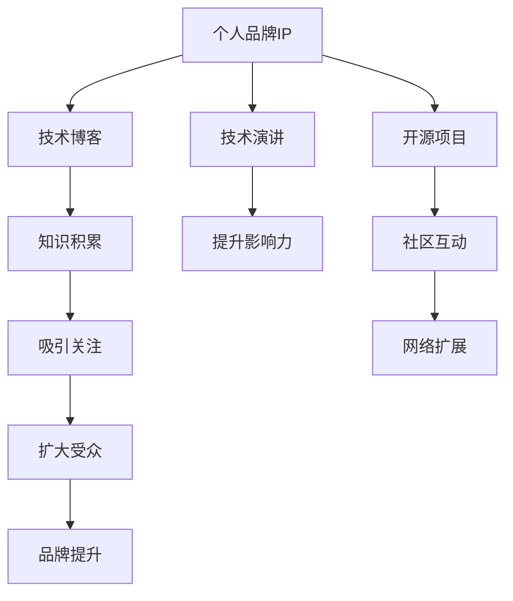

                 

# 程序员如何打造个人品牌IP

## 1. 背景介绍

在当下这个快速发展的时代，个人品牌已经成为竞争力的重要标志。对于程序员来说，打造个人品牌IP不仅能提升自身的职业发展空间，还能在技术社区中占据一席之地。本文将从背景介绍、核心概念、算法原理、具体步骤、实际应用、工具和资源推荐、未来展望等多个维度，深入探讨程序员如何通过技术实现个人品牌IP的打造。

## 2. 核心概念与联系

### 2.1 核心概念概述

在探讨个人品牌IP打造的过程中，我们需要理解以下几个核心概念：

- **个人品牌IP**：即个人品牌形象识别系统，是个人在职业和社区中独一无二、高度识别的标识。对于程序员而言，品牌IP可以体现在技术博客、开源项目、技术演讲等多个方面。
- **技术博客**：是程序员展现其技术积累和知识分享的主要平台，有助于建立专业形象，积累技术影响力。
- **开源项目**：通过贡献开源代码，程序员可以展示其编程能力和技术水平，同时与全球开发者互动，提升影响力。
- **技术演讲**：在技术会议上分享自己的研究成果和技术见解，不仅能获得行业认可，还能扩展自己的专业网络。

这些核心概念的联系可以通过以下Mermaid流程图来展示：



这个流程图展示了个人品牌IP构建的关键路径：通过技术博客积累知识、通过开源项目展示能力、通过技术演讲提升影响力，并通过社区互动、扩大受众，最终提升品牌形象。

## 3. 核心算法原理 & 具体操作步骤

### 3.1 算法原理概述

个人品牌IP的打造是一个复杂的过程，涉及到技术输出、社区互动和影响力提升等多个方面。其核心算法原理可以归结为以下几个步骤：

1. **技术输出**：通过撰写技术博客、贡献开源项目等方式，将自身的技术积累和创新能力外化。
2. **社区互动**：积极参与技术社区的讨论和交流，通过回答问题、指导新人等方式，建立自己的专业形象。
3. **影响力提升**：通过技术演讲、技术培训等方式，扩大自己的技术影响力，提升品牌认可度。

### 3.2 算法步骤详解

#### 3.2.1 技术输出

**步骤1：选择合适的技术博客平台**  
选择一个或多个适合的技术博客平台，如Medium、CSDN、掘金等，根据自身技术领域和受众定位选择合适的平台。

**步骤2：确定技术内容方向**  
明确自己的技术专长和兴趣点，选择适合自己的技术主题，如深度学习、大数据、前端开发等。

**步骤3：撰写高质量技术文章**  
确保技术文章内容原创、有深度，结合实际案例进行详细讲解，同时注重文章的可读性和易懂性。

**步骤4：定期发布和维护**  
保持定期发布新文章，根据社区反馈进行调整，不断提升自己的技术写作水平。

#### 3.2.2 社区互动

**步骤1：参与技术社区**  
选择适合自己的技术社区，如Stack Overflow、GitHub、技术论坛等，积极参与技术讨论和问题解答。

**步骤2：贡献开源项目**  
寻找自己感兴趣的开源项目，贡献代码、修复Bug、撰写文档等，展示自己的编程能力和专业素养。

**步骤3：指导新人**  
在社区中积极回答新手的问题，提供技术指导和建议，帮助新人快速成长。

#### 3.2.3 影响力提升

**步骤1：参加技术会议**  
选择符合自己技术方向的技术会议，积极准备技术演讲，展示自己的研究成果和技术见解。

**步骤2：组织技术培训**  
在社区或公司内部组织技术培训，分享自己的技术经验，提升自己在行业中的影响力。

**步骤3：建立个人网站**  
建立个人技术网站，展示自己的技术博客、开源项目和演讲视频等，形成一个完整的个人品牌形象。

### 3.3 算法优缺点

**优点**：
1. **全面展示能力**：技术博客、开源项目、技术演讲等多元化输出方式，可以全面展示程序员的技术能力和创新思维。
2. **加速职业发展**：通过社区互动和影响力提升，可以迅速建立专业网络，获得更多的职业机会。
3. **提高知名度**：通过技术演讲和社区互动，可以显著提升程序员在行业内的知名度。

**缺点**：
1. **时间成本高**：技术输出、社区互动和影响力提升需要大量的时间和精力投入。
2. **技术要求高**：需要具备较强的技术功底和良好的写作能力，才能撰写高质量的技术文章和演讲。
3. **市场竞争激烈**：技术领域竞争激烈，需要不断创新和保持高水平的技术输出，才能持续获得关注和认可。

### 3.4 算法应用领域

个人品牌IP的打造技术广泛适用于多个领域，包括但不限于：

- **软件开发**：通过技术博客、开源项目展示编程能力，建立专业形象。
- **数据科学**：通过撰写数据分析报告、参与数据科学竞赛等方式，提升自身影响力。
- **人工智能**：通过技术博客、开源项目分享AI研究成果，参与AI社区讨论，提升技术影响力。
- **区块链**：通过撰写区块链技术文章、参与区块链项目开发，展示自己的技术实力和创新能力。

## 4. 数学模型和公式 & 详细讲解 & 举例说明

### 4.1 数学模型构建

**技术输出模型**：  
设程序员的技术积累量为 $P$，技术博客输出量为 $B$，开源项目贡献量为 $C$，技术演讲次数为 $S$，则技术输出模型可以表示为：  
$$ T = k \times P^{\alpha} \times B^{\beta} \times C^{\gamma} \times S^{\delta} $$  
其中 $k$ 为常数，$\alpha, \beta, \gamma, \delta$ 分别为各因素的权重系数。

**社区互动模型**：  
设社区互动量为 $I$，参与技术讨论次数为 $D$，指导新手次数为 $G$，则在社区互动模型中：  
$$ I = m \times D^{\eta} \times G^{\zeta} $$  
其中 $m$ 为常数，$\eta, \zeta$ 为各因素的权重系数。

**影响力提升模型**：  
设技术影响力为 $F$，技术演讲次数为 $S$，技术培训次数为 $T$，则在影响力提升模型中：  
$$ F = n \times S^{\theta} \times T^{\iota} $$  
其中 $n$ 为常数，$\theta, \iota$ 为各因素的权重系数。

### 4.2 公式推导过程

以上三个模型中，各变量之间的关系可以表示为：  
$$ T = k \times P^{\alpha} \times B^{\beta} \times C^{\gamma} \times S^{\delta} $$
$$ I = m \times D^{\eta} \times G^{\zeta} $$
$$ F = n \times S^{\theta} \times T^{\iota} $$

**推导思路**：  
- **技术输出模型**：假设程序员的技术积累 $P$ 是其技术输出的基础，而技术博客 $B$、开源项目 $C$、技术演讲 $S$ 分别对其产生不同程度的放大作用。
- **社区互动模型**：假设社区互动主要受到技术讨论次数 $D$ 和指导新手次数 $G$ 的影响。
- **影响力提升模型**：技术演讲 $S$ 和技术培训 $T$ 是提升技术影响力的主要途径。

### 4.3 案例分析与讲解

**案例1：一名Python开发者的个人品牌IP打造**  
- **技术输出**：撰写高质量的Python编程教程，积极参与开源项目，在PyCon上分享自己的Python应用案例。
- **社区互动**：在Stack Overflow上回答Python问题，指导社区内的新手Python编程。
- **影响力提升**：通过技术演讲和内部培训，提升自己在公司内部和行业内的技术影响力。

**案例2：一名数据科学家的个人品牌IP打造**  
- **技术输出**：撰写数据科学应用案例，参与Kaggle竞赛，发布数据科学教程和分析报告。
- **社区互动**：在数据科学社区活跃，分享数据科学项目经验，指导社区内数据科学初学者。
- **影响力提升**：在数据科学会议上发表技术演讲，发布数据科学博客，扩大自己在行业内的知名度。

## 5. 项目实践：代码实例和详细解释说明

### 5.1 开发环境搭建

#### 5.1.1 技术博客平台搭建  
选择一个技术博客平台，如Medium或CSDN，注册并搭建个人博客。

#### 5.1.2 开源项目贡献  
选择一个开源项目，如GitHub上的TensorFlow项目，贡献代码、修复Bug、撰写文档。

#### 5.1.3 技术演讲准备  
选择一个符合自己技术方向的技术会议，准备技术演讲内容，进行技术演讲。

### 5.2 源代码详细实现

#### 5.2.1 技术博客开发  
使用Python和Markdown技术，开发一个技术博客平台，支持文章发布、评论、分类等功能。

#### 5.2.2 开源项目贡献  
使用Git和GitHub，选择一个开源项目，通过提交代码、参与讨论等方式贡献自己的力量。

#### 5.2.3 技术演讲准备  
使用PowerPoint或Google Slides，准备一个清晰、有逻辑的技术演讲PPT。

### 5.3 代码解读与分析

**技术博客开发**：  
- **实现功能**：文章发布、评论、分类等。
- **技术栈**：Python、Flask、Markdown等。
- **关键代码**：  
  ```python
  from flask import Flask, render_template, request
  
  app = Flask(__name__)
  
  @app.route('/')
  def index():
      return render_template('index.html')
  
  @app.route('/article', methods=['POST'])
  def submit_article():
      title = request.form.get('title')
      content = request.form.get('content')
      # 将文章保存到数据库或文件系统中
      return 'Article submitted successfully!'
  ```

**开源项目贡献**：  
- **实现功能**：代码提交、Bug修复、文档撰写等。
- **技术栈**：Git、GitHub等。
- **关键代码**：  
  ```bash
  # 克隆开源项目
  git clone https://github.com/tensorflow/tensorflow.git
  
  # 提交代码
  git add .
  git commit -m 'Add new feature'
  git push
  
  # 提交文档
  # 假设文档存放在docs目录下
  git add docs
  git commit -m 'Add new documentation'
  git push
  ```

**技术演讲准备**：  
- **实现功能**：技术PPT准备、技术演讲展示。
- **技术栈**：PowerPoint、Google Slides等。
- **关键代码**：  
  ```pptx
  // 技术PPT的代码实现
  // 使用PowerPoint或Google Slides进行技术展示
  ```

### 5.4 运行结果展示

**技术博客展示**：  
- **展示内容**：技术文章、评论、分类等。
- **展示效果**：一个直观、易于访问的个人技术博客。

**开源项目展示**：  
- **展示内容**：代码提交记录、Bug修复记录、文档贡献等。
- **展示效果**：一个活跃、有贡献的开源项目。

**技术演讲展示**：  
- **展示内容**：技术演讲PPT、技术演讲视频等。
- **展示效果**：一个有深度、有吸引力的技术演讲。

## 6. 实际应用场景

### 6.1 软件开发

**案例1：开源项目贡献**  
开发者A通过贡献开源项目，展示自己的编程能力，积累了大量的技术追随者，获得了多个职业机会。

**案例2：技术演讲提升**  
开发者B在技术会议上分享自己的技术成果，提升了自己在公司内部和行业内的知名度，获得了更多的技术支持和合作机会。

### 6.2 数据科学

**案例1：数据科学应用案例**  
数据科学家C撰写并分享了大量数据科学应用案例，积累了丰富的数据科学经验，成为了社区内的知名专家。

**案例2：Kaggle竞赛成绩**  
数据科学家D在Kaggle竞赛中取得了优异成绩，提升了自身影响力，获得了更多的职业机会。

### 6.3 人工智能

**案例1：AI技术博客**  
AI研究者E通过撰写高质量的AI技术博客，分享自己的研究成果，吸引了大量AI技术爱好者和研究者。

**案例2：AI技术演讲**  
AI研究者F在AI会议上分享了自己的AI研究成果，提升了自己在AI领域的影响力，获得了更多的合作和资金支持。

### 6.4 区块链

**案例1：区块链技术分享**  
区块链开发者G通过撰写区块链技术分享文章，展示了自己的区块链技术实力，吸引了大量的区块链技术追随者。

**案例2：区块链项目贡献**  
区块链开发者H通过贡献开源区块链项目，提升了自身在区块链领域的影响力，获得了更多的职业机会。

## 7. 工具和资源推荐

### 7.1 学习资源推荐

**书籍推荐**：  
1. 《程序员的自我修养》：讲解了程序员如何建立自己的品牌IP，是技术职业发展的必读之作。
2. 《黑客与画家》：通过技术和文化结合，展示了程序员如何通过技术实现个人品牌IP的打造。

**在线课程推荐**：  
1. Coursera上的《技术写作与出版》课程：教授技术写作技巧，提升技术文章的质量。
2. Udemy上的《GitHub contribute guide》课程：教授GitHub的贡献技巧，提升开源项目贡献能力。
3. YouTube上的《技术演讲技巧》系列视频：讲解技术演讲的技巧和方法，提升技术演讲效果。

### 7.2 开发工具推荐

**开发工具推荐**：  
1. GitHub：用于开源项目管理和代码贡献。
2. Markdown：用于技术博客的文本编辑和格式控制。
3. PowerPoint/Google Slides：用于技术演讲的PPT制作。
4. Flask：用于搭建技术博客平台。

### 7.3 相关论文推荐

**论文推荐**：  
1. 《The Myth of the Lone Programmer》：探讨了程序员如何通过社区互动和知识共享建立品牌IP。
2. 《Impact of Social Media on Personal Brand Development》：分析了社交媒体对个人品牌IP构建的影响。
3. 《Technical Blogging Best Practices》：详细介绍了技术博客的写作技巧和优化方法。

## 8. 总结：未来发展趋势与挑战

### 8.1 总结

本文从背景介绍、核心概念、算法原理、具体操作步骤、实际应用、工具和资源推荐等多个维度，深入探讨了程序员如何通过技术实现个人品牌IP的打造。通过技术博客、开源项目、技术演讲等多种方式，程序员可以全面展示自己的技术能力和创新思维，从而在技术和社区中建立专业形象，提升自身影响力。

## 8.2 未来发展趋势

**技术博客**：随着内容创作工具和平台的发展，技术博客将更加注重互动和社交功能，用户可以通过评论、点赞等方式参与讨论。

**开源项目**：开源社区将更加注重项目管理和贡献流程的优化，通过社区自动化工具和平台，提升项目的贡献效率和质量。

**技术演讲**：技术演讲将更加注重视觉和互动效果，通过虚拟现实和增强现实技术，提升演讲体验。

## 8.3 面临的挑战

**时间管理**：技术输出、社区互动和影响力提升需要大量的时间和精力，如何平衡工作和生活，成为一大挑战。

**技术迭代**：技术领域日新月异，程序员需要不断学习和更新知识，才能保持技术领先。

**市场竞争**：技术领域竞争激烈，需要不断创新和保持高水平的技术输出，才能持续获得关注和认可。

## 8.4 研究展望

未来的研究可以从以下几个方面进行探索：  
1. **技术输出自动化**：利用AI技术自动生成技术文章和代码，提升技术输出的效率和质量。
2. **社区互动智能化**：利用机器学习技术分析社区互动数据，优化社区互动策略。
3. **影响力提升多样化**：结合多种影响力提升手段，如技术培训、技术展览等，提升技术影响力的广度和深度。

## 9. 附录：常见问题与解答

**Q1：如何平衡工作与技术输出？**  
**A1：**合理规划时间，利用碎片时间进行技术输出，确保有稳定的输出节奏，同时利用社区平台的多样化互动功能，提升社区互动的效率。

**Q2：如何提升技术文章的质量？**  
**A2：**多阅读高质量的技术文章，积累技术知识，注重文章的结构和逻辑，使用图表和实例进行详细讲解，同时注重文章的可读性和易懂性。

**Q3：如何选择适合自己的技术社区？**  
**A3：**选择与自己技术方向和兴趣点相符合的社区，积极参与技术讨论和问题解答，不断积累社区影响力。

**Q4：如何进行技术演讲准备？**  
**A4：**提前准备技术演讲内容，使用PowerPoint或Google Slides进行演讲PPT制作，注意演讲的逻辑性和互动性，通过模拟演讲和反馈不断优化。

**Q5：如何提升技术演讲的效果？**  
**A5：**结合视觉和互动技术，如视频、动画等，提升演讲的吸引力和互动性，同时注意演讲的节奏和语调，与听众保持良好的互动。

---

作者：禅与计算机程序设计艺术 / Zen and the Art of Computer Programming

